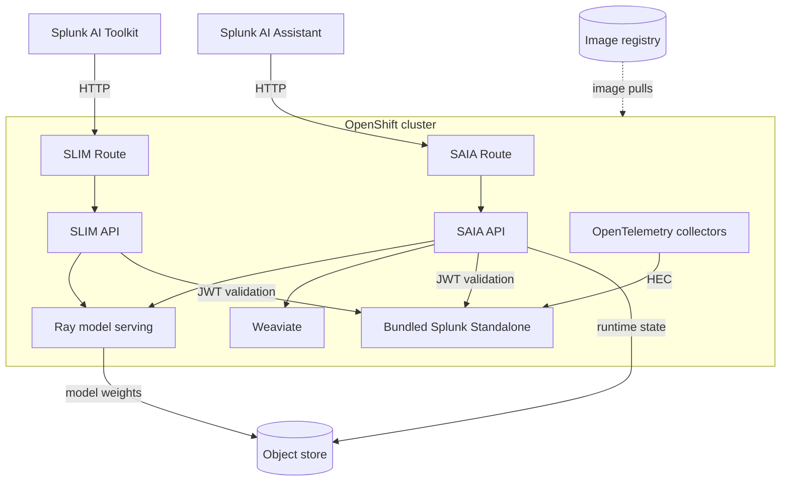

# Splunk AI Tier on OpenShift (AI POD)

This guide explains how to install Splunk AI Tier (AI POD) on an existing
OpenShift cluster and connect Splunk AI Assistant and Splunk AI Toolkit.

For the condensed installation checklist, see
[`openshift-quick-reference.md`](./openshift-quick-reference.md).

> [!IMPORTANT]
> The installer deploys AI POD workloads and supporting operators. It does not
> create, upgrade, or remove the OpenShift cluster itself.

For a k0s deployment, use [`k0s-readme.md`](../ai-tier-docs/k0s-readme.md).

## Contents

- **Plan**
  - [What the installer deploys](#what-the-installer-deploys)
  - [How OpenShift differs from k0s](#how-openshift-differs-from-k0s)
  - [Architecture](#architecture)
  - [Requirements](#requirements)
- **Deploy**
  - [Prepare the configuration](#prepare-the-configuration)
  - [Installer command reference](#installer-command-reference)
  - [Standard deployment (internet-connected)](#standard-deployment-internet-connected)
  - [Air-gapped deployment](#air-gapped-deployment)
  - [Installation flow](#installation-flow)
  - [Verify and access the deployment](#verify-and-access-the-deployment)
- **Configure and operate**
  - [Install and test the Splunk apps](#install-and-test-the-splunk-apps)
  - [Configuration reference](#configuration-reference)
  - [OpenShift behavior](#openshift-behavior)
  - [Security and production considerations](#security-and-production-considerations)
  - [Model staging](#model-staging)
  - [Troubleshooting](#troubleshooting)
    - [OpenShift troubleshooting guide](./openshift-troubleshooting.md)
  - [Uninstall](#uninstall)

## What the installer deploys

`openshift_with_stack.sh install` deploys the following components:

| Component | Namespace | Method |
|---|---|---|
| Node Feature Discovery Operator | `openshift-nfd` | Operator Lifecycle Manager |
| NVIDIA GPU Operator | `nvidia-gpu-operator` | Operator Lifecycle Manager |
| Local Path Provisioner | `local-path-storage` | Manifest |
| cert-manager | `cert-manager` | Manifest |
| OpenTelemetry Operator | `opentelemetry-operator-system` | Helm |
| KubeRay Operator | `ray-system` | Helm |
| Splunk AI Operator | `splunk-ai-operator-system` | Manifest |
| Splunk Operator | `splunk-operator` | Manifest |
| Splunk Standalone, Ray, Weaviate, SAIA, and SLIM | `ai-platform` | Operators and custom resources |
| SAIA and SLIM Routes | `ai-platform` | HTTP OpenShift Routes |

The workload namespace is configurable and defaults to `ai-platform`.

## How OpenShift differs from k0s

| Concern | k0s | OpenShift |
|---|---|---|
| Cluster provisioning | Installer creates the cluster | Installer uses an existing cluster |
| Pod security | Kubernetes Pod Security Admission | OpenShift Security Context Constraints |
| Node Feature Discovery and NVIDIA GPU Operator | Helm | Operator Lifecycle Manager Subscriptions |
| External SAIA and SLIM access | MetalLB LoadBalancer | HTTP OpenShift Routes |
| Local storage | Local Path Provisioner | Local Path Provisioner with SELinux relabeling |
| Primary CLI | `kubectl` | `oc` |

## Architecture



- **Ray** runs the model-serving head and GPU worker workloads.
- **Weaviate** stores vector data and is initialized by a post-install job.
- **SAIA** provides the Splunk AI Assistant API and retrieval-augmented
  generation workflow.
- **SLIM** provides model discovery and inference for Splunk AI Toolkit.
- **Splunk Standalone** provides JWT issuer validation and receives internal
  telemetry through HTTP Event Collector.
- **Object storage** contains model artifacts and persistent SAIA runtime data.

## Requirements

### OpenShift cluster

- OpenShift Container Platform **4.21.x**.
- Red Hat Enterprise Linux CoreOS (RHCOS) **amd64** control-plane and worker
  nodes. The installer rejects other node operating systems and architectures.
- At least one OpenShift worker node.
- A production cluster should use the standard three-node, highly available
  control plane.
- `cluster-admin` access. The installer creates cluster-scoped resources,
  installs operators, labels nodes, and grants Security Context Constraints.
- Network connectivity from the installer machine to the OpenShift API,
  configured image registry, and object store.

> [!NOTE]
> This installer is qualified for OpenShift 4.21. Setting another version in
> the configuration does not add support for that OpenShift release.

### AI-tier worker capacity

The current topology uses one shared AI-tier node pool for CPU and GPU
workloads.

| `scaleFactor` | System RAM | Available workload disk | GPU memory | CPU |
|---:|---:|---:|---:|---:|
| `1` | 256 GiB | 1 TiB (1024 GiB) | 2 × 96 GB VRAM | 64 allocatable vCPU |
| `2` | 512 GiB | 2 TiB (2048 GiB) | 4 × 96 GB VRAM | 128 allocatable vCPU |

> [!IMPORTANT]
> Disk values are usable capacity available immediately before installation,
> not advertised drive size. A 1 TB drive provides about 931 GiB before
> formatting and does not meet the 1024 GiB scale-1 check. Storage must cover
> `/var/lib/containers` and `/opt/local-path-provisioner`, or provide equivalent
> capacity for both.

`scaleFactor` does not add hardware. Add the required CPU, memory, GPU, and
storage capacity before increasing it.

### Reference hardware for `scaleFactor: 1`

**Shared AI-tier worker:** one Cisco UCS C845A M8 AI Server

| Resource | Configuration |
|---|---|
| Memory | 8 × `CAI-MRX64G2RE5` — 512 GB installed |
| CPU | 2 × `CAI-CPU-A9375F` — 64 physical cores / 128 threads |
| GPU | 2 × `CAI-GPU-RTXP6000` — 192 GB total VRAM |
| Boot storage | 2 × `CAI-M2-960G` with `CAI-M2-HWRAID`, RAID 1 — 1.92 TB raw / 960 GB usable |
| Workload storage | Dedicated enterprise NVMe providing at least 1 TiB available for scale 1 |

**OpenShift control plane:** three Cisco UCS C225 M8 SFF servers

| Resource | Configuration per server |
|---|---|
| Memory | 8 × `UCS-MRX32G1RE3` — 256 GB installed |
| CPU | 1 × `UCS-CPU-A9224` — 24 physical cores / 48 threads with SMT |
| Boot storage | 2 × `UCS-M2-480G`, RAID 1 — 960 GB raw / 480 GB usable |

The AI worker's boot pair does not satisfy the workload-disk requirement.
Provide separate workload storage.

### Installer machine

| Installation type | Supported installer host |
|---|---|
| Standard (internet-connected) | macOS or Linux with the required tools |
| Air-gapped | Linux host; `oc-mirror` is Linux-only |

RHEL 9, RHEL 10, and Ubuntu 24 can be used as installer hosts when all tools
are available. They are installer machines, not supported OpenShift node
operating systems for this deployment.

Required tools:

- OpenShift CLI (`oc`), logged in to the target cluster
- Mike Farah `yq` v4
- Helm v3+
- `curl`, `jq`, `base64`, GNU `timeout`, `python3`, and `tar`
- MinIO client (`mc`) for MinIO, SeaweedFS, or generic S3-compatible storage
- AWS CLI only when using AWS S3 or automatic Amazon ECR authentication
- `oc-mirror` v2 for an air-gapped deployment

Exact client patch versions are not pinned. The installer pins these platform
dependencies:

| Dependency | Installer contract |
|---|---|
| OpenShift | 4.21.x |
| Node Feature Discovery Operator | `stable` channel |
| NVIDIA GPU Operator | `v26.3` channel |
| cert-manager | 1.13.0 |
| Local Path Provisioner | 0.0.26 |
| KubeRay Operator | 1.2.2 |
| OpenTelemetry Operator chart | 0.121.0 |
| Ray runtime | 2.56.0 |

### External services

Before installation, provide:

- Network access to the registries containing the images under `images.*`, or
  an internal registry containing their mirrors for an air-gapped cluster.
- An AWS S3, MinIO, SeaweedFS, or generic S3-compatible object store for model
  artifacts.
- Credentials for private registries and the object store.
- Access from the installer machine to Hugging Face when model staging is
  enabled and any required model is missing.

In a standard deployment, the cluster must reach the configured Operator
catalogs and image registries. OpenShift nodes do not need public internet
access only when all Operator and application content is mirrored to registries
reachable by the cluster and all models are in the configured object store.

### Network requirements

Allow these flows for the selected installation and integration path:

| Source | Destination | Purpose |
|---|---|---|
| Installer machine | OpenShift API endpoint, normally TCP 6443 | Install and verify resources |
| Installer machine | GitHub, Helm repositories, source registries, and Red Hat registries | Standard deployment or preparation of air-gap mirror content |
| Installer machine | Hugging Face | Download a required model that is missing when model staging is enabled |
| Installer machine and AI workloads | Object-store endpoint | Stage and read models and runtime state |
| OpenShift nodes | Configured image registries | Pull Operator and workload images |
| User browser and external Splunk | OpenShift router on TCP 80 | Reach the supported HTTP SAIA and SLIM Routes |
| SAIA and SLIM workloads | Bundled Splunk management service on TCP 8089 | Fetch signing keys and validate JWTs |
| Internal OpenTelemetry collectors | Bundled Splunk HEC service on TCP 8088 | Send internal telemetry |
| Splunk Enterprise, only when using Bring Your Own LLM | Customer OIDC token endpoint and LLM endpoint | Authenticate to and invoke the custom model provider |

An external Splunk server and the user's browser must each be able to resolve
and reach the appropriate Route. A laptop VPN does not provide connectivity for
the external Splunk server or for workloads running inside OpenShift.

The supported SAIA and SLIM exposure uses HTTP on TCP 80. HTTPS Route TLS and
workload mTLS are not configured or qualified by this installation workflow.

### External content dependencies

Standard deployment and air-gap preparation use these external sources:

| Consumer | Source | Content |
|---|---|---|
| Installer machine | `github.com` and `raw.githubusercontent.com` | cert-manager and Local Path Provisioner manifests |
| Installer machine | `open-telemetry.github.io` and `ray-project.github.io` | OpenTelemetry and KubeRay Helm charts |
| Installer machine | `huggingface.co` | Model weights, only when model staging is enabled and a required model is missing |
| Installer machine or `oc-mirror` | Red Hat, certified Operator, and public image registries | Operator catalogs, operands, Driver Toolkit, and installer-owned images |
| OpenShift nodes | Registries referenced by cluster mirror policy and `images.*` | Operator and workload images at pod scheduling time |

In air-gap mode, the installer machine must reach both the public sources and
the internal registry while preparing and importing mirror content. OpenShift
nodes then pull from the internal mirrors. GPU workers do not download host
drivers directly; the NVIDIA GPU Operator and OpenShift Driver Toolkit consume
the mirrored cluster content.

## Prepare the configuration

Work from `tools/ai-tier-cluster-setup` and create an environment-specific copy of the
template:

```bash
cd <path-to-clone>/splunk-ai-operator/tools/ai-tier-cluster-setup
cp openshift-cluster-config.yaml my-openshift-cluster-config.yaml
export CONFIG_FILE="$PWD/my-openshift-cluster-config.yaml"
```

Edit the copy and set, at minimum:

- `openshift.nodes` to the AI-tier worker node names when using the `manual`
  labeling strategy
- confirm the `images.*` release references; replace them and configure
  registry authentication when using a private registry or mirror
- `storage.objectStore` endpoint, bucket, type, and credentials
- `storage.modelStaging.enabled` for the intended model workflow
- `ecr.enabled: false` when the image registry is not Amazon ECR

> [!WARNING]
> Do not commit registry or object-store credentials. Relative paths under
> `files` are resolved from the configuration file, so keep the copy in
> `tools/ai-tier-cluster-setup` or use absolute manifest paths.

Validate cluster access before installation:

```bash
export KUBECONFIG="$HOME/.kube/openshift"  # omit if oc is already configured
oc whoami
oc whoami --show-server
oc auth can-i '*' '*' --all-namespaces     # must print yes
```

Choose the deployment mode before running the installer:

| Mode | Configuration | Installer host | Cluster content source |
|---|---|---|---|
| Standard (internet-connected) | `cluster.airgap: false` | macOS or Linux | Configured Operator catalogs and image registries |
| Air-gapped | `cluster.airgap: true` | Linux with `oc-mirror` v2 | Internal registry and object store only |

## Installer command reference

| Command | Purpose |
|---|---|
| `./openshift_with_stack.sh validate` | Validate the configuration without changing the cluster |
| `./openshift_with_stack.sh install` | Install or reconcile the complete platform |
| `./openshift_with_stack.sh install --silent` | Install non-interactively using configuration values |
| `./openshift_with_stack.sh verify-pods` | Check platform resources and pod health; collect diagnostics on failure |
| `./openshift_with_stack.sh diagnose` | Create a compressed support bundle |
| `./openshift_with_stack.sh stage-artifacts` | Stage model artifacts without installing the platform |
| `./openshift_with_stack.sh clean-all` | Remove installer-owned platform resources while preserving the OpenShift cluster |

The default command is `install` when no subcommand is supplied. Set
`CONFIG_FILE` for every command so the installer uses the intended namespace,
resource names, and object-store settings.

## Standard deployment (internet-connected)

Set `cluster.airgap: false`, then run:

```bash
CONFIG_FILE="$CONFIG_FILE" ./openshift_with_stack.sh validate
CONFIG_FILE="$CONFIG_FILE" ./openshift_with_stack.sh install
```

The install command performs preflight checks, stages missing models when
enabled, installs the platform, waits for readiness, and prints the SAIA and
SLIM URLs. A separate `stage-artifacts` run is not required.

For unattended installation:

```bash
CONFIG_FILE="$CONFIG_FILE" ./openshift_with_stack.sh install --silent
```

## Air-gapped deployment

This mode supports an OpenShift cluster without public internet access. Set:

```yaml
cluster:
  airgap: true
```

Run the same command from a Linux installer machine:

```bash
CONFIG_FILE="$CONFIG_FILE" ./openshift_with_stack.sh validate
CONFIG_FILE="$CONFIG_FILE" ./openshift_with_stack.sh install
```

### Content mirrored by the installer

The installer uses `oc-mirror` to mirror its OpenShift-specific dependencies
into `images.registry`, applies the generated mirror policies and CatalogSource
resources, and continues the installation. It mirrors:

- Node Feature Discovery and NVIDIA GPU Operator catalogs and operand images
- the OpenShift Driver Toolkit image when it is not already in the cluster's
  release mirror
- cert-manager, Local Path Provisioner, KubeRay, and OpenTelemetry images
- installer helper images

### Content provided by the customer

The customer must provide separately:

- every application image configured under `images.*` in the internal registry
- object-store and registry credentials
- model weights, unless the installer machine can download missing models

### Registry authentication for mirroring

`oc-mirror` must authenticate to both its source registries and
`images.registry` before workload pull secrets are created. The unified
installer combines the cluster pull secret with `imagePullSecrets.custom` for
this step.

When `images.registry` is Amazon ECR, `ecr.enabled: true` is not sufficient for
the earlier mirror import; it creates pod pull secrets later in the install.
Also provide ECR destination credentials through one of these methods:

- configure `imagePullSecrets.custom` with the ECR server, username `AWS`, and
  a current ECR authorization token
- add ECR credentials to the cluster pull secret
- provide a complete Docker-compatible auth file through `REGISTRY_AUTH_FILE`
  or `AIRGAP_REGISTRY_AUTH_FILE`; it must cover the source and destination
  registries

### Installer host requirements

> [!IMPORTANT]
> The installer host must be Linux and have `oc-mirror` v2. Plan for
> approximately **100 GiB of temporary free space** for mirror content and
> working files. This is a planning recommendation, not an installer-enforced
> minimum; actual usage depends on the selected catalog content and versions.

During preparation, the host must reach the target OpenShift API, public source
registries, the internal registry, and the object store. If model staging is
enabled, it must also reach Hugging Face when a model is missing.

The cluster nodes do not need public internet access. They must reach the
internal registry and object store.

`images.registryInsecure: true` adds the registry host to OpenShift's
`insecureRegistries`, permits plain-HTTP pulls, and passes
`--dest-tls-verify=false` to the air-gap `oc-mirror` import. For an HTTPS
registry, this skips destination certificate verification. Production
deployments must leave it `false` and use a registry certificate trusted by the
installer host and OpenShift nodes.

## Installation flow

`openshift_with_stack.sh install` performs these phases in order:

1. **Air-gap preparation, when enabled** — mirror installer-owned OpenShift
   content into the internal registry and apply the generated mirror resources.
2. **Configuration** — load and validate settings, resolve images, accelerator,
   model staging, and print the installation plan.
3. **Preflight** — validate client tools, cluster-admin access, OpenShift and
   node compatibility, storage, object-store access, registry access, and
   air-gap prerequisites.
4. **Model staging** — upload missing or changed models when enabled. An
   air-gapped install with staging disabled verifies the required completion
   markers.
5. **Infrastructure** — install Node Feature Discovery and NVIDIA GPU
   Operators, label nodes, install Local Path Provisioner, and apply the SELinux
   relabeling required for local volumes.
6. **Operators** — install cert-manager, OpenTelemetry Operator, KubeRay
   Operator, registry pull secrets, Splunk AI Operator, and Splunk Operator.
7. **AI Platform stack** — create Splunk Standalone and AIPlatform resources,
   normalize feature Services, and create the enabled HTTP Routes.
8. **Readiness and summary** — wait for platform resources and pods to become
   ready, then print the SAIA and SLIM endpoints.

## Verify and access the deployment

### Check platform health

Check the custom resources and pods:

```bash
oc get aiplatform,aiservice,raycluster,rayservice -n ai-platform
oc get pods -n ai-platform
CONFIG_FILE="$CONFIG_FILE" ./openshift_with_stack.sh verify-pods
```

Use these commands when observing a deployment in progress:

```bash
oc get raycluster,rayservice -n ai-platform -w
oc logs -n splunk-ai-operator-system \
  -l control-plane=controller-manager -f
```

A healthy deployment has current-generation `Ready=True` conditions on the
AIPlatform and enabled AIServices, ready Ray resources, no failed or pending
platform pods, and completed post-install Jobs. If `verify-pods` finds an unhealthy
resource, it runs `diagnose` automatically unless `AUTO_DIAGNOSE=false`.

### Use the service endpoints

The default external endpoints are:

```text
SAIA: http://saia.<ingress-domain>
SLIM: http://slim.<ingress-domain>/tenant/slim-api/v1alpha1
```

Use the SAIA URL in the Splunk AI Assistant app and the full SLIM URL in Splunk
AI Toolkit. An existing external Splunk Enterprise deployment can use these
URLs when its network can resolve and reach the OpenShift Routes.

When Splunk runs inside the same cluster, AITK can use the internal SLIM
endpoint instead:

```text
http://<aiPlatform.name>-slim-slim-service.<namespace>.svc.cluster.local:8080/tenant/slim-api/v1alpha1
```

List the Routes:

```bash
oc get route saia slim -n ai-platform
```

The installer supports and qualifies HTTP Routes only. HTTPS Route TLS and
workload mTLS are not configured or supported by this deployment workflow. Use
the HTTP URLs printed by the installer.

### Open the Ray dashboard

To open the Ray dashboard locally:

```bash
oc port-forward -n ai-platform svc/openshift-ai-platform-head-svc 8265:8265
```

Then open `http://localhost:8265`. Replace `openshift-ai-platform` if
`aiPlatform.name` was changed.

## Install and test the Splunk apps

The OpenShift installer always deploys a bundled Splunk Standalone. An
externally managed Splunk Enterprise instance can also use the SAIA and SLIM
Routes, but it does not replace the bundled instance in the current installer.
For external Splunk, make sure its JWT issuer is listed under
`splunk.trustedIssuers` and that both Splunk and the user's browser can reach
the required Routes.

### Open bundled Splunk Web

Read the configured names, retrieve the generated admin password, and forward
Splunk Web to the installer machine:

```bash
NAMESPACE="$(yq eval '.kubernetes.namespace // "ai-platform"' "$CONFIG_FILE")"
STANDALONE_NAME="$(yq eval '.splunk.standaloneName // "splunk-standalone"' "$CONFIG_FILE")"
SPLUNK_SECRET="splunk-${STANDALONE_NAME}-standalone-secret-v1"
SPLUNK_SERVICE="splunk-${STANDALONE_NAME}-standalone-service"

oc get secret "$SPLUNK_SECRET" -n "$NAMESPACE" \
  -o jsonpath='{.data.password}' | base64 --decode && echo
oc port-forward -n "$NAMESPACE" "svc/$SPLUNK_SERVICE" 18001:8000
```

Keep the port-forward running and open `http://localhost:18001`. Log in as
`admin` with the password printed above.

### Install and configure Splunk AI Assistant

Use Splunk Enterprise 10.2 and install
[Splunk AI Assistant](https://splunkbase.splunk.com/app/7245) version 2.3.0
(`Splunk_AI_Assistant_Cloud.tgz`):

1. In Splunk Web, go to **Apps → Manage Apps → Install app from file**.
2. Upload `Splunk_AI_Assistant_Cloud.tgz` and restart Splunk if prompted.
3. Open **Splunk AI Assistant → Configuration**.
4. Enter the SAIA Route printed by the installer, for example
   `http://saia.<ingress-domain>`, and save it.
5. Send a prompt and confirm that the app returns a model response.

The user's browser calls the configured SAIA URL directly. The HTTP Route must
therefore be resolvable and reachable from the browser, not only from Splunk.
Do not change the configured URL to `https://`; HTTPS is not supported by this
installation workflow.

### Install and configure Splunk AI Toolkit

Install the Python for Scientific Computing app first, then install
[Splunk AI Toolkit](https://splunkbase.splunk.com/app/2890) version 6.1.0 or
later (`Splunk_ML_Toolkit.tgz`) through **Manage Apps**. Restart Splunk if
prompted.

AITK uses SLIM, not SAIA. In **Splunk AI Toolkit → Connections**, select
**+ Connection → Endpoint → Splunk AI tier** and save an endpoint that includes
the complete API path:

```text
http://<slim-host>/tenant/slim-api/v1alpha1
```

For the bundled Splunk instance, use the internal endpoint:

```bash
AI_PLATFORM_NAME="$(yq eval '.aiPlatform.name // "openshift-ai-platform"' "$CONFIG_FILE")"
echo "http://${AI_PLATFORM_NAME}-slim-slim-service.${NAMESPACE}.svc.cluster.local:8080/tenant/slim-api/v1alpha1"
```

For an external Splunk instance, use the SLIM Route printed by the installer:

```text
http://slim.<ingress-domain>/tenant/slim-api/v1alpha1
```

Saving the endpoint validates its format but is not a complete connectivity
test. Confirm that models appear when creating an LLM connection. To use the
`ai` command, also create **+ Connection → LLM → Splunk AI tier LLM**, select a
model, and save the named connection.

Run these searches as end-to-end smoke tests. Replace `<connection-name>` with
the LLM connection created above:

```text
| inputlookup internet_traffic.csv
| head 2000
| apply CDTSM bits_transferred forecast_k=128
```

```text
| makeresults
| eval text="Fifteen failed logins were detected from one host within two minutes."
| ai connection="<connection-name>" prompt="Summarize this security event in one concise sentence: {text}"
| table text ai_result_1
```

Forecast values from `apply CDTSM` and a non-empty `ai_result_1` confirm the
Splunk → SLIM → model path.

### Bring Your Own LLM

AITK can share a customer-managed LLM connection with Splunk AI Assistant. This
is an application workflow and does not change the OpenShift installation or
the SAIA and SLIM endpoints.

1. In **Splunk AI Toolkit → Connections**, create an **LLM → Custom provider**
   connection.
2. Select **OpenID Connect (OIDC)** and enter the Token URL, Client ID, Client
   Secret, scope, model endpoint, and model settings. API-key connections
   cannot be shared with Splunk AI Assistant.
3. Under **Connect to services**, select **Splunk AI Assistant App**, accept the
   warning and consent, and save the connection.
4. In **Splunk AI Assistant → Settings → Model Runtime**, select **Bring your
   own model configured in the Splunk AI Tool Kit**, then select the shared
   connection.
5. Start a chat and confirm that it uses the customer-managed model.

The Splunk host must be able to resolve and reach both the OIDC token endpoint
and the custom LLM endpoint. This workflow is not available on cloud or
cloud-connected stacks.

## Configuration reference

### Cluster and OpenShift

| Setting | Meaning |
|---|---|
| `cluster.airgap` | `false` for a standard deployment; `true` for an air-gapped deployment |
| `kubernetes.namespace` | Workload namespace; default `ai-platform` |
| `openshift.requiredVersion` | Qualified OpenShift minor; must be `4.21` |
| `openshift.grantPrivilegedSCC` | Control namespace-wide grants for AI workloads and the Splunk AI Operator; component-specific grants remain automatic |
| `openshift.nodeLabelStrategy` | `manual` labels listed nodes; `auto` labels all workers |
| `openshift.nodes` | AI-tier nodes used by the `manual` strategy |
| `openshift.ingressDomain` | Optional ingress-domain override |
| `openshift.routes.<feature>.enabled` | Create the supported HTTP SAIA or SLIM Route |
| `openshift.routes.<feature>.host` | Optional HTTP Route hostname override |

CPU and GPU workloads share the AI-tier pool. GPU workers are selected by their
`nvidia.com/gpu` resource request; there is no separate CPU/GPU scheduling mode
in this installer.

### Images and registry credentials

`images.registry` is prepended unless the installer recognizes the image as a
fully qualified reference. The supported qualified form starts with a domain
name containing a dot or an IPv4 address, optionally includes a port, and has a
tag, for example `docker.io/splunk/app:v1` or
`10.0.0.1:5000/splunk/app:v1`. Registry names without a dot, `localhost`, and
tagless references are treated as short names and are prefixed when
`images.registry` is set. Use the supported tagged form for predictable image
resolution, and replace public paths with their internal paths for an
air-gapped deployment.

| Setting | Release default | Purpose |
|---|---|---|
| `images.registry` | empty | Optional registry prefix for short image names |
| `images.registryInsecure` | `false` | Must remain `false` in production; `true` permits plain HTTP and skips destination TLS verification during air-gap import |
| `images.operator.image` | `docker.io/splunk/splunk-ai-operator:v1.0` | Splunk AI Operator |
| `images.ray.headImage` | `docker.io/splunk/ai-tier-ray-head:v1.0` | Ray head runtime |
| `images.ray.workerImage` | `docker.io/splunk/ai-tier-ray-worker:v1.0` | Ray GPU worker runtime |
| `images.weaviate.image` | `docker.io/semitechnologies/weaviate:stable-v1.28-007846a` | Weaviate vector database |
| `images.saia.apiImage` | `docker.io/splunk/ai-tier-saia-api:v1.0` | SAIA API v1 |
| `images.saia.apiV2Image` | `docker.io/splunk/ai-tier-saia-api-v2:v1.0` | SAIA API v2 |
| `images.saia.dataLoaderImage` | `docker.io/splunk/ai-tier-saia-data-loader:v1.0` | SAIA post-install data loader |
| `images.slim.apiImage` | `docker.io/splunk/ai-tier-slim-service:v1.0` | SLIM API used by AITK |
| `images.splunk.image` | `docker.io/splunk/splunk:10.2-rhel9` | Bundled Splunk Enterprise |
| `images.splunk.operatorImage` | `docker.io/splunk/splunk-operator:3.0.0` | Splunk Operator |
| `images.fluentBit.image` | `docker.io/fluent/fluent-bit:1.9.6` | Fluent Bit sidecar |
| `images.otelCollector.image` | `docker.io/otel/opentelemetry-collector-contrib:0.122.1` | OpenTelemetry Collector |
| `images.nginx.image` | `docker.io/library/nginx:1.27-alpine` | SAIA reverse proxy |

The application `v1.0` tags may be mutable, and workloads use
`imagePullPolicy: IfNotPresent`. For a controlled refresh, use a new immutable
tag or image digest instead of reusing a changed tag.

For Amazon ECR, enable:

```yaml
ecr:
  enabled: true
  account: "<aws-account-id>"
  region: "<aws-region>"
```

The installer runs `aws ecr get-login-password` and creates pull secrets in
the required namespaces during installation. This happens after air-gap mirror
import, so an air-gapped ECR destination also requires the mirror
authentication described under [Registry authentication for
mirroring](#registry-authentication-for-mirroring). Amazon ECR tokens expire
after 12 hours; customers using ECR must provide a credential-refresh process
for long-running clusters.

For another private registry, disable ECR and configure only the matching
`imagePullSecrets` block. Each enabled block is independent. The installer
creates its secret in `ai-platform`, `splunk-ai-operator-system`, and
`splunk-operator`, then attaches it to the relevant service accounts.

```yaml
ecr:
  enabled: false

imagePullSecrets:
  autoCreateECR: false

  dockerHub:
    enabled: false
    username: "<docker-hub-user>"
    password: "<docker-hub-access-token>"
    email: "<optional-email>"

  gcr:
    enabled: false
    jsonKey: |
      {"type": "service_account"}

  acr:
    enabled: false
    registry: "<registry-name>.azurecr.io"
    username: "<service-principal-or-registry-user>"
    password: "<password>"

  custom:
    enabled: true
    name: "custom-registry-secret"
    server: "registry.example.com"
    username: "<username>"
    password: "<access-token>"
    email: "<optional-email>"
```

`imagePullSecrets.autoCreateECR: true` also enables ECR secret creation, but
the public configuration template uses `ecr.enabled`. A block is skipped with
a warning when required credentials are absent. A public registry that does
not require authentication needs no pull-secret block.

### Storage and object store

| Setting | Default | Purpose |
|---|---|---|
| `storage.storageClass` | `local-path` | StorageClass used for workload PVCs |
| `storage.vectorDbSize` | `50Gi` | Requested Weaviate PVC size |
| `storage.minimumDiskSpace.aiTierNode` | `1024` | Minimum available GiB on every AI-tier node at `scaleFactor: 1`; multiplied by the scale factor |
| `storage.modelStaging.enabled` | `true` | Stage only missing or changed models; `false` skips staging and performs a pre-check only for air-gapped installs |
| `storage.objectStore.type` | `seaweedfs` in the template | `aws`, `minio`, `seaweedfs`, or `s3compat` |
| `storage.objectStore.bucket` | `ai-platform-bucket` | Bucket used for model artifacts and runtime state |
| `storage.objectStore.endpoint` | none | Required for MinIO, SeaweedFS, and generic S3-compatible storage |
| `storage.objectStore.region` | ECR region when omitted | AWS S3 region; set it explicitly when S3 and ECR use different regions |
| `storage.objectStore.auth.rootUser` | none | Object-store access key |
| `storage.objectStore.auth.rootPassword` | none | Object-store secret key |

```yaml
storage:
  objectStore:
    type: "minio"       # aws | minio | seaweedfs | s3compat
    bucket: "ai-platform-bucket"
    endpoint: "http://object-store.example.com:9000"
    auth:
      rootUser: "<access-key>"
      rootPassword: "<secret-key>"
```

`endpoint` is required for MinIO, SeaweedFS, and `s3compat`. AWS S3 uses
`storage.objectStore.region`; AWS CLI is required. Temporary AWS STS access
keys are not supported because the generated secret has no session-token
field.

The installer does not deploy the object store. The bucket contains staged
models under `model_artifacts/` and `staging_state/`, and SAIA creates runtime
state such as `conversations/`, `config/`, and `storage_queue/`. Treat the
bucket as persistent application data and do not delete those runtime paths
during a reinstall.

### Splunk issuers and HEC

The installer adds the primary short Splunk management service URL to
`SPLUNK_ISSUERS`. Values under `splunk.trustedIssuers` are additional accepted
management/JWT issuer URLs; use them when a client token contains a different,
valid service URL such as the namespace-qualified service name.

The JWT issuer endpoint and `hecEndpoint` serve different purposes:

- the issuer endpoint validates Splunk JWTs on port 8089
- `hecEndpoint` sends telemetry to Splunk HTTP Event Collector on port 8088

### AI Platform

| Setting | Meaning |
|---|---|
| `aiPlatform.name` | AIPlatform custom-resource name |
| `aiPlatform.defaultAcceleratorType` | Must be `RTX_PRO_6000_BLACKWELL` |
| `aiPlatform.scaleFactor` | Integer capacity multiplier, minimum 1 |
| `aiPlatform.features` | Enabled feature services: SAIA and SLIM |
| `aiPlatform.serviceTemplate.type` | Backing Service type; normally `ClusterIP` on OpenShift |

Keep the feature Services as `ClusterIP` when Routes provide external access.
`NodePort` and `LoadBalancer` remain explicit alternatives, but they are not
needed for the standard OpenShift design.

Reducing `scaleFactor` resizes workloads and causes temporary service downtime.
Downscale during a maintenance window.

### Operators

| Setting | Default | Purpose |
|---|---|---|
| `operators.nfd.catalogSource` | `redhat-operators` | Standard-deployment CatalogSource for the Node Feature Discovery Operator |
| `operators.gpu.catalogSource` | `certified-operators` | Standard-deployment CatalogSource for the NVIDIA GPU Operator |
| `operators.ray.modelVersion` | `v0.3.14-36-g1549f5a` | Ray Serve application-package version expected in object storage |
| `operators.ray.rayVersion` | `2.56.0` | Ray runtime version; it must match the Ray head and worker images |

In air-gap mode, the installer mirrors the required Operator catalogs and uses
the generated internal CatalogSources. KubeRay Operator version 1.2.2 is pinned
by `openshift_with_stack.sh`; it is not selected by `modelVersion` or
`rayVersion`.

### Manifest paths

```yaml
files:
  aiPlatform: "./artifacts.yaml"
  splunkOperator: "./splunk-operator-cluster.yaml"
```

Relative paths are resolved from the directory containing `CONFIG_FILE`.

## OpenShift behavior

### Security Context Constraints

When `openshift.grantPrivilegedSCC` is `"true"`, the installer grants
namespace-wide `anyuid` and `privileged` access to the AI workload namespace
and `privileged` access to the Splunk AI Operator namespace.

This setting is not a global SCC switch. The installer always applies the
following component-specific grants required by its current manifests:

| Component | Grant |
|---|---|
| cert-manager service accounts | `anyuid` |
| Local Path Provisioner and helper | `privileged` SCC ClusterRoleBindings |
| OpenTelemetry Operator | `privileged` SCC ClusterRoleBinding |
| Splunk Operator namespace | `privileged` |

The installer records the grants it owns and removes them during `clean-all`.

Use the same namespace and resource names for install and cleanup. SCC cleanup
uses ownership recorded by the installer in `openshift-config` and is
independent of the current `openshift.grantPrivilegedSCC` value. The `clean-all`
command removes only grants recorded as installer-owned.

### Operators and GPU drivers

Node Feature Discovery and the NVIDIA GPU Operator are installed through
Operator Lifecycle Manager. The GPU Operator uses the OpenShift Driver Toolkit;
the installer does not SSH to nodes or install host drivers manually.

| Operator | Subscription | Channel | Namespace | Custom resource |
|---|---|---|---|---|
| Node Feature Discovery | `nfd` | `stable` | `openshift-nfd` | `NodeFeatureDiscovery/nfd-instance` |
| NVIDIA GPU Operator | `gpu-operator-certified` | `v26.3` | `nvidia-gpu-operator` | `ClusterPolicy/gpu-cluster-policy` |

The CatalogSources come from `operators.nfd.catalogSource` and
`operators.gpu.catalogSource`. Operator Lifecycle Manager resolves the
compatible patch release within each configured channel. The generated GPU
ClusterPolicy enables `driver.use_ocp_driver_toolkit`, so OpenShift manages the
node-driver deployment through the Driver Toolkit.

For a disconnected cluster, the relevant catalogs, operand images, GPU driver
images, and Driver Toolkit image must be available through the configured
mirror. The air-gapped workflow handles this content.

### Node labeling and scheduling

The installer applies these labels:

| Nodes | Labels |
|---|---|
| Control-plane nodes | `splunk.ai/node-role=controller`, `splunk.ai/workload-type=control-plane` |
| AI-tier worker nodes | `splunk.ai/node-role=worker`, `splunk.ai/ai-tier-node=true` |

With `openshift.nodeLabelStrategy: auto`, every worker joins the shared AI-tier
pool. With `manual`, only nodes listed under `openshift.nodes` join it. CPU and
GPU schedulers select the same pool; GPU pods additionally request
`nvidia.com/gpu`, which limits them to nodes where the GPU resource is
allocatable. The installer removes a lingering
`nvidia.com/gpu=true:NoSchedule` taint from selected AI-tier nodes so CPU
workloads can also use them.

### Storage and SELinux

The installer can deploy the Local Path Provisioner when `storageClass` is
`local-path`. It labels the host directory for container use through
`oc debug node`, which is why cluster-admin access is required.

Local persistent volumes have node affinity. Changing `openshift.nodes` after
volumes are created can leave replacement pods pending if the original node is
no longer eligible.

### Routes

SAIA and SLIM have separate Routes backed by `ClusterIP` Services. The Routes
use a 600-second timeout and disabled response buffering for long-running and
streaming responses. A Route may return HTTP 503 until its backing Service has
ready endpoints. The generated Routes target HTTP port 8080 and do not include
a Route `spec.tls` configuration.

| Route | Default host | Backing Service |
|---|---|---|
| `saia` | `saia.<ingress-domain>` | `<aiPlatform.name>-saia-saia-service:8080` |
| `slim` | `slim.<ingress-domain>` | `<aiPlatform.name>-slim-slim-service:8080` |

Set `openshift.routes.<feature>.enabled: false` to keep that feature internal.

## Security and production considerations

- The supported production deployment exposes SAIA and SLIM through HTTP
  Routes. HTTPS Route TLS and workload mTLS are not configured, supported, or
  qualified by this installation workflow.
- `images.registryInsecure` is unrelated to SAIA and SLIM transport. Keep it
  `false` in production so registry TLS verification remains enabled.
- Keep registry and object-store credentials out of source control. Manage
  OpenShift secret encryption, RBAC, audit logging, and credential rotation
  according to the customer's cluster-security policy.
- The installer requires cluster-admin privileges and records the shared
  cluster resources and SCC grants it creates so `clean-all` preserves resources
  it did not own.
- Do not apply a generic deny-all NetworkPolicy without a tested allowlist. A
  policy must preserve OpenShift router ingress, DNS, Operator and webhook
  traffic, same-namespace service calls, object-store access, and the required
  Splunk management and HEC flows.
- Back up the object-store runtime data and required persistent volumes. The
  installer does not provide a backup or disaster-recovery workflow.
- External Splunk integration is limited to JWT validation through its
  management issuer on port 8089. The current installer configures HEC and
  OpenTelemetry only for the bundled Splunk deployment.

## Model staging

The RTX Pro 6000 Blackwell profile uses
`model_artifacts_configs_quantized.yaml`, including the quantized Gemma model.

`storage.modelStaging.enabled` controls the workflow:

- `true`: check completion markers and download/upload only missing or changed
  models from the installer machine
- `false`: do not download models; air-gapped installs verify every required
  completion marker before platform installation, while standard installs skip
  this pre-check and can fail later if required artifacts are missing

The cluster nodes do not download models from Hugging Face. Ray workers read
the staged artifacts from the object store.

AWS S3, MinIO, SeaweedFS, and generic S3-compatible stores are supported. Run
staging separately only when needed:

```bash
CONFIG_FILE="$CONFIG_FILE" ./openshift_with_stack.sh stage-artifacts
```

Set `SKIP_IF_STAGED=0` to force a fresh download and upload.

The current quantized model manifest contains:

| Artifact ID | Source |
|---|---|
| `all-minilm-l6-v2` | `sentence-transformers/all-MiniLM-L6-v2` |
| `cross-encoder` | `cross-encoder/ms-marco-MiniLM-L-6-v2` |
| `e5-language-classifier` | `Mike0307/multilingual-e5-language-detection` |
| `fm_timeseries` | `cisco-ai/cisco-time-series-model-1.0` |
| `gpt-oss-20b` | `openai/gpt-oss-20b` |
| `mbart-translator` | `facebook/mbart-large-50-many-to-many-mmt` |
| `gemma-4-31b-it-qat-w4a16-ct` | `google/gemma-4-31B-it-qat-w4a16-ct` |
| `pii-classifier` | `StanfordAIMI/stanford-deidentifier-base` |
| `uae-large` | `WhereIsAI/UAE-Large-V1` |
| `xlm-roberta-language-classifier` | `papluca/xlm-roberta-base-language-detection` |

The uploader selected by object-store type is `upload_to_s3.sh` for AWS,
`upload_to_minio.sh` for MinIO and generic S3-compatible stores, and
`upload_to_seaweedfs_upload_only.sh` for SeaweedFS. Artifacts are stored below
`model_artifacts/<artifact-id>/`; the corresponding
`staging_state/<artifact-id>/.staging_complete` marker makes reruns skip an
artifact that is already current.

## Troubleshooting

Use [`openshift-troubleshooting.md`](./openshift-troubleshooting.md) for the
complete OpenShift installer, Operator Lifecycle Manager, GPU, storage,
air-gap, workload, Route, and Splunk app troubleshooting workflow. The quick
checks below cover the most common symptoms.

### Collect a support bundle

```bash
CONFIG_FILE="$CONFIG_FILE" ./openshift_with_stack.sh diagnose
```

`verify-pods` automatically collects diagnostics on failure unless
`AUTO_DIAGNOSE=false`.

### `ImagePullBackOff`

Confirm the image reference is correct and that its pull secret exists in the
pod namespace and is attached to the service account. Refresh expired Amazon
ECR credentials when applicable.

### Route returns HTTP 503

Check the backing pods and endpoints:

```bash
oc get pods,endpoints,route -n ai-platform
```

Routes are created before all model services are ready, so a temporary 503
during deployment is expected.

### Pod remains `Pending`

Check node capacity, taints, persistent-volume node affinity, and the configured
AI-tier nodes:

```bash
oc describe pod <pod-name> -n ai-platform
oc get pv -o wide
```

### Webhook has no endpoints

Wait for the Splunk AI Operator rollout, then rerun install:

```bash
oc get pods,endpoints -n splunk-ai-operator-system
```

### Certificate is not yet valid

Confirm that every cluster node uses a common Network Time Protocol source.
The installer retries transient cert-manager clock-skew errors, but incorrect
node time must be fixed at the infrastructure level.

### Node Feature Discovery or GPU Operator is not ready

Check the Operator Lifecycle Manager resources and GPU discovery state:

```bash
oc get subscription,csv -n openshift-nfd
oc get subscription,csv -n nvidia-gpu-operator
oc get clusterpolicy gpu-cluster-policy
oc get nodes -l nvidia.com/gpu.present=true
```

In an air-gapped deployment, also confirm that the operator catalogs, operand
images, driver images, and matching OpenShift Driver Toolkit image were
successfully mirrored.

### Re-run vector database setup

The setup Job is owned by the AIService and cannot be rerun in place. Find and
delete it; the operator recreates it:

```bash
oc get jobs -n ai-platform
oc delete job <vector-db-setup-job-name> -n ai-platform
```

### Operator-owned resources

Do not patch generated StatefulSets or Deployments as a permanent fix. The
operator reconciles them from the AIPlatform and AIService custom resources.

## Uninstall

```bash
CONFIG_FILE="$CONFIG_FILE" ./openshift_with_stack.sh clean-all
```

This removes resources owned by the installer and leaves the OpenShift cluster
running.
