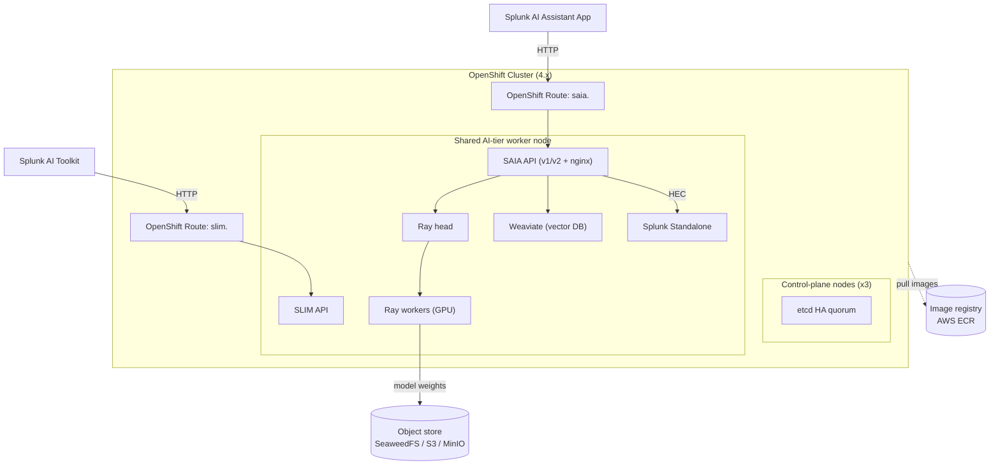

# Splunk AI tier on OpenShift — Customer Onboarding Guide


This guide walks you through deploying the Splunk AI tier stack onto an
**existing** OpenShift cluster using `openshift_with_stack.sh`. Unlike the k0s
installer, this installer does **not** provision a cluster — it assumes you
already have a running, healthy OpenShift cluster and installs only the AI
Platform stack on top of it.

> If you are deploying on a self-managed k0s cluster instead, use
> [`K0S_README.md`](./K0S_README.md). This document covers **OpenShift only**.

---

## Table of Contents

1. [Overview](#overview)
2. [What Gets Installed](#what-gets-installed)
3. [Prerequisites](#prerequisites)
4. [Quick Start](#quick-start)
5. [Configuration Reference](#configuration-reference)
6. [Install Flow](#install-flow)
7. [Architecture](#architecture)
8. [OpenShift-Specific Behavior](#openshift-specific-behavior)
9. [Image Pull Secrets (ECR)](#image-pull-secrets-ecr)
10. [Accessing SAIA and SLIM](#accessing-saia-and-slim)
11. [Air-Gapped Deployment](#air-gapped-deployment)
12. [Model Staging](#model-staging)
13. [Verification & Health Checks](#verification--health-checks)
14. [Troubleshooting](#troubleshooting)
15. [Uninstall](#uninstall)

---

## Overview

The Splunk AI tier packages the models, vector database, and Splunk
integration that power the **Splunk AI Assistant (SAIA)** feature inside Splunk.
On OpenShift the stack is deployed by a single script, `openshift_with_stack.sh`,
which drives OLM operators, cert-manager, KubeRay, and the Splunk AI Operator to
stand up the platform.

**Key OpenShift differences vs. k0s** (these shape everything in this guide):

| Concern | k0s | OpenShift |
|---|---|---|
| Cluster provisioning | Installer creates the cluster | Cluster already exists; installer adds the stack only |
| Pod security | PodSecurityAdmission (warn) | **SCC-enforced** (`grantPrivilegedSCC`) |
| GPU Operator / NFD | Helm | **OLM Subscriptions** (OperatorHub catalogs) |
| External access | MetalLB LoadBalancer | **OpenShift Route** (HAProxy ingress) |
| Storage | local-path provisioner (installed by script) | local-path provisioner **+ SELinux relabel** of host dirs |
| CLI | `kubectl` | `oc` (installer uses `oc` exclusively) |

---

## What Gets Installed

Running `openshift_with_stack.sh install` creates the following, in order:

| Component | Namespace | Installed via |
|---|---|---|
| Node Feature Discovery (NFD) Operator → `NodeFeatureDiscovery` CR | `openshift-nfd` | OLM Subscription (`redhat-operators`, channel `stable`) |
| NVIDIA GPU Operator → `ClusterPolicy` CR | `nvidia-gpu-operator` | OLM Subscription (`certified-operators`, channel `v26.3`) |
| Node labels (`splunk.ai/*`) | — | `oc label` |
| local-path provisioner (+ SELinux relabel) | `local-path-storage` | Static manifest |
| cert-manager | `cert-manager` | Static manifest |
| OpenTelemetry Operator | `opentelemetry-operator-system` | Helm chart |
| KubeRay Operator | `ray-system` | Helm chart |
| ECR image pull secrets | all AI namespaces | `oc create secret` |
| Splunk AI Operator | `splunk-ai-operator-system` | `artifacts.yaml` |
| Splunk Operator | `splunk-operator` | `splunk-operator-cluster.yaml` |
| Splunk Standalone CR | `ai-platform` | Splunk Operator |
| AIPlatform CR (Ray, Weaviate, SAIA, SLIM) | `ai-platform` | Splunk AI Operator |
| SAIA and SLIM Routes | `ai-platform` | `oc apply` |

The AI Platform workload namespace defaults to **`ai-platform`**.

---

## Prerequisites

**Cluster**
- A running **OpenShift Container Platform 4.21** cluster. The installer is
  validated on OCP 4.21 and fails preflight on another minor version.
- This installer is qualified on **RHCOS amd64** control-plane and compute
  nodes. OpenShift itself requires RHCOS on the control plane and permits
  supported RHEL compute nodes, but this AI/GPU deployment path has not been
  validated on RHEL workers and therefore fails preflight for them. RHEL 9/10
  and Ubuntu 24 may be used as the client/install workstation when the listed
  GNU tools are installed (these client distributions are not currently covered
  by repository CI). Ubuntu is not an OpenShift node operating system.
- 3 control-plane nodes (etcd HA quorum).
- `cluster-admin` privileges (required for SCC grants, OLM installs, and the
  `oc debug node/` SELinux relabel).

**Minimum shared AI-tier node sizing** (current single-worker topology):

| `scaleFactor` | RAM requirement | Disk requirement | GPU memory | CPU |
|---:|---:|---:|---:|---:|
| `1` | 256 GiB | 1 TiB (1024 GiB) available | 2 × 96 GB VRAM | 64 allocatable vCPU |
| `2` | 512 GiB | 2 TiB (2048 GiB) available | 4 × 96 GB VRAM | 128 allocatable vCPU |

The disk values are **available usable capacity immediately before install** on
the AI workload filesystem, not nominal drive labels. A drive sold as 1 TB
contains only about 931 GiB before formatting and therefore does not satisfy the
1024 GiB scale-1 minimum. Size the raw storage above the table value to allow
for RAID, formatting, the host OS, and future operating headroom.

CPU means Kubernetes-allocatable logical CPUs, after OpenShift node reservations.
The scale-factor-1 platform can use approximately 47 vCPU at configured limits;
64 vCPU leaves capacity for OpenShift system services and workload bursts. The
scale-2 values are the corresponding capacity-planning minima when the current
single-node workload is doubled.

**Reference Cisco hardware configuration** (`scaleFactor: 1`):

Shared AI-tier worker — 1 &times; Cisco UCS C845A M8 AI Server:

- **Memory:** 8 &times; `CAI-MRX64G2RE5` — 512 GB installed
- **CPU:** 2 &times; `CAI-CPU-A9375F` — 64 physical cores / 128 threads
- **GPU:** 2 &times; `CAI-GPU-RTXP6000` — 192 GB total VRAM
- **Boot storage:** 2 &times; `CAI-M2-960G` with 1 &times;
  `CAI-M2-HWRAID`, configured as RAID 1 — 1.92 TB raw / 960 GB usable;
  use this pair for boot, not to satisfy the AI workload disk requirement
- **AI workload storage:** dedicated enterprise NVMe storage providing at least
  1 TiB (1024 GiB) available to `/var/lib/containers` and
  `/opt/local-path-provisioner` for scale 1, or 2 TiB (2048 GiB) for scale 2

OpenShift control plane — 3 &times; dedicated Cisco UCS C225 M8 SFF
servers, each configured with:

- **Memory:** 8 &times; `UCS-MRX32G1RE3` — 256 GB installed
- **CPU:** 1 &times; `UCS-CPU-A9224` — 24 physical cores / 48 threads
  with SMT enabled
- **Boot storage:** 2 &times; `UCS-M2-480G`, configured as RAID 1 —
  960 GB raw / 480 GB usable

The three control-plane servers are separate physical hosts and are not AI-tier
worker nodes. The C845A RAID-1 boot pair provides only 960 GB decimal (about
894 GiB) before OS consumption, so it cannot meet the scale-1 workload minimum.
Provision the dedicated workload storage above in addition to the boot pair.

**Client tools** on the install machine:
`oc` (logged in via `oc login`), Mike Farah `yq` v4, `helm` (v3+), `curl`,
`jq`, `base64`, `timeout`, `python3`, and `tar`. `aws` CLI is required only for
AWS S3 model storage (`storage.objectStore.type: aws`). `mc` is required for
MinIO, SeaweedFS, and other S3-compatible model-marker verification.

Automatic ECR pull-secret creation is a separate optional workflow. Enabling
`ecr.enabled` or `imagePullSecrets.autoCreateECR` invokes
`aws ecr get-login-password` and therefore also requires AWS CLI. Docker Hub,
MinIO, an internal registry, or a pre-authenticated/mirrored registry does not.

The client tools are interface requirements rather than exact pins. The
following exact versions were used for this OpenShift validation:

| Install-machine dependency | Validated version |
|---|---|
| OpenShift CLI (`oc`) | 4.22.0 client |
| Helm | 3.18.4 |
| Mike Farah `yq` | 4.48.1 |
| `jq` | 1.7.1 |
| `curl` | 8.7.1 |
| GNU `timeout` | coreutils 9.7 |
| Python | 3.14.2 |
| `tar` | bsdtar 3.5.3 / libarchive 3.7.4 |
| MinIO client (`mc`) | RELEASE.2025-08-13T08-35-41Z |
| AWS CLI (conditional) | 2.28.12 |

`base64` is also required, but the macOS system implementation used in this
validation does not expose a separate version identifier.

**Pinned and cluster-provided dependencies:**

| Dependency | Installer contract | Exact live-cluster version |
|---|---|---|
| OpenShift | 4.21.x | 4.21.10 (Kubernetes 1.34.6) |
| Node OS | RHCOS amd64 | RHCOS 9.6.20260407-0, kernel 5.14.0-570.106.1.el9_6.x86_64 |
| NFD Operator | OLM `stable` channel for OpenShift 4.21 | 4.21.0-202608172306 |
| NVIDIA GPU Operator | OLM `v26.3` channel | 26.3.3; driver 580.126.20 |
| cert-manager | v1.13.0 | v1.13.0 |
| local-path-provisioner | v0.0.26 | v0.0.26 |
| KubeRay Operator chart/image | 1.2.2 | 1.2.2 |
| OpenTelemetry Operator | chart 0.121.0 | chart 0.121.0; operator 0.157.0 |
| Ray runtime | 2.56.0 | 2.56.0 |

OLM resolves the exact NFD and GPU Operator patch/build from the pinned channel,
so those two exact live values may advance while remaining on the qualified
channel. Installer-downloaded manifests and Helm charts are fixed to the exact
versions shown above.

**External dependencies**
- An image registry holding the platform images. Any registry works — AWS ECR,
  Docker Hub, GCR, ACR, an internal/Harbor registry, or a disconnected mirror.
  Set `images.registry` to your registry prefix and pick the matching pull-secret
  mechanism (`ecr.enabled` for ECR, or the `imagePullSecrets.*` blocks otherwise).
  The reference config uses **AWS ECR**
  (`658391232643.dkr.ecr.us-east-2.amazonaws.com`, region `us-east-2`).
- An S3-compatible object store for model artifacts (AWS S3, MinIO, or
  SeaweedFS). 

> The Ray head/worker, SAIA, and SLIM images are **built internally** and are not
> on any public registry. They must already exist in your registry (or be
> mirrored for air-gap) before install.

---

## Quick Start

```bash
cd tools/ai-tier-cluster-setup

# 1. Log in to your OpenShift cluster as cluster-admin
oc login --token=<token> --server=https://api.<cluster>:6443
oc whoami                       # confirm identity
oc auth can-i create clusterrolebinding   # must return "yes"

# 2. Edit the config for your environment
$EDITOR openshift-cluster-config.yaml
#   - set images.* to your registry paths
#   - set storage.objectStore.endpoint + auth to real values
#   - set openshift.nodes[] (manual strategy) to your node names
#   - set ecr.account / ecr.region if using ECR

# 3. Stage model weights to your object store.
#    Required for a fresh object store — Ray workers fail to start if weights
#    are missing. Skip only if the bucket is already staged from a prior run.
CONFIG_FILE=./openshift-cluster-config.yaml ./openshift_with_stack.sh stage-artifacts

# 4. Install the stack
CONFIG_FILE=./openshift-cluster-config.yaml ./openshift_with_stack.sh install

# (Teardown, when needed) Remove the stack. Leaves the cluster and nodes intact.
CONFIG_FILE=./openshift-cluster-config.yaml ./openshift_with_stack.sh delete
```

Because the installer uses your ambient `oc` login, make sure `oc whoami`
points at the correct cluster before running. If you manage cluster access via a
kubeconfig file, export it first, e.g. `export KUBECONFIG=~/.kube/openshift`.

The default subcommand is `install` if none is given. Use `--silent` / `-s` for
a non-interactive run.

**Subcommands:**

| Command | What it does |
|---|---|
| `install [--silent\|-s]` | Deploy the full stack |
| `delete` | Remove the stack (leaves cluster nodes running) |
| `diagnose` | Collect a support bundle (`tar.gz`) |
| `stage-artifacts` | Stage model weights to object storage only |
| `verify` | Check all pods are Running/Completed; auto-diagnoses on failure |

---

## Configuration Reference

The config file (default `openshift-cluster-config.yaml`, override with
`CONFIG_FILE=`) is validated with `yq`. Below are the sections and the values
from the reference deployment.

### `cluster`
```yaml
cluster:
  airgap: false
```

- Set `airgap: true` for an air-gapped installation. The normal
  `openshift_with_stack.sh install` command automatically stages and mirrors
  the required OpenShift dependencies.
- Set `airgap: false` for a connected installation.

### `kubernetes`
```yaml
kubernetes:
  namespace: ai-platform      # AI Platform workload namespace
```

### `openshift`
```yaml
openshift:
  grantPrivilegedSCC: "true"  # grant SCCs to Ray/operator SAs (required for GPU)
  nodeLabelStrategy: "manual" # "auto" = all worker nodes; "manual" = list below
  nodes:                      # AI-tier pool (manual strategy only)
    - 00-25-b5-b5-00-35
    - 00-25-b5-b5-00-37
    - cc-40-f3-9f-e2-3c
  routes:
    saia:
      enabled: true           # host defaults to saia.<ingress-domain>
    slim:
      enabled: true           # host defaults to slim.<ingress-domain>
```
- `grantPrivilegedSCC` — set `"false"` only if your cluster policy already grants
  the required SCCs. Required for GPU (`nvidia.com/gpu`) workloads.
- `nodeLabelStrategy` — `manual` labels only the nodes you list; `auto` labels
  every `node-role.kubernetes.io/worker` node.
- `ingressDomain` — optional; auto-detected from the default `IngressController`
  if omitted. Used to build both feature Route hosts.
- `routes.<feature>.enabled` — controls external Route creation independently
  for SAIA and SLIM. Both default to `true` when their feature is enabled.
- `routes.<feature>.host` — optional full hostname override. When omitted, the
  installer uses `<feature>.<ingress-domain>`.

### `images`
```yaml
images:
  registry: "658391232643.dkr.ecr.us-east-2.amazonaws.com"   # prefix for non-FQ images
  operator:
    image: ".../splunk-ai-operator:openshift-0.10"
  ray:
    headImage:   "ml-platform/ray/ray-head:build-953"
    workerImage: "ml-platform/ray/ray-worker-gpu:build-953"
  weaviate:
    image: "docker.io/semitechnologies/weaviate:stable-v1.28-007846a"
  saia:
    apiImage:        "ml-platform/saia/saia-api:build-v2-main-c3b489d"
    apiV2Image:      "ml-platform/saia/saia-api-v2:build-v2-main-c3b489d"
    dataLoaderImage: "ml-platform/saia/saia-data-loader:build-v2-main-c3b489d"
  slim:
    apiImage: "ml-platform/slim/slim-api:build-1"
  splunk:
    image:         "docker.io/splunk/splunk:10.2-rhel9"
    operatorImage: "docker.io/splunk/splunk-operator:3.0.0"
  fluentBit:     { image: "docker.io/fluent/fluent-bit:1.9.6" }
  otelCollector: { image: "docker.io/otel/opentelemetry-collector-contrib:0.122.1" }
  nginx:         { image: "docker.io/library/nginx:1.27-alpine" }
```
The `registry` prefix is prepended to any image that is not fully qualified
(e.g. the `ml-platform/...` Ray, SAIA, and SLIM paths). `images.slim.apiImage`
is required only when `slim` is enabled under `aiPlatform.features`.


### `storage`
```yaml
storage:
  storageClass: "local-path"
  vectorDbSize: "50Gi"
  minimumDiskSpace:
    aiTierNode: 1024  # Scale-1 base in available GiB; multiplied by scaleFactor
  objectStore:
    type: "seaweedfs"           # aws | s3compat | minio | seaweedfs
    bucket: "ai-platform-bucket"
    endpoint: "http://<host>:8333"
    auth:
      rootUser: "<S3_ACCESS_KEY_ID>"
      rootPassword: "<S3_SECRET_ACCESS_KEY>"
```
Object storage path scheme by type: `s3://` (aws), `s3compat://`,
`minio://` (minio **and** seaweedfs).

`aiTierNode` is the scale-factor-1 minimum available capacity, in GiB, checked on
the filesystem backing `/var/lib/containers`. The installer multiplies it by
`aiPlatform.scaleFactor`, so the reference setting enforces 1024 GiB at scale 1
and 2048 GiB at scale 2. OpenShift uses a shared AI-tier node pool, so the same
free-space gate applies to every configured node. The storage must also back, or
provide equivalent capacity for, `/opt/local-path-provisioner`. These minima
cover the Ray worker ephemeral-storage limits (350 GiB at scale 1 and 700 GiB at
scale 2), local PVCs, container images, platform services, logs, image
extraction, and upgrade headroom.

### `splunk`
```yaml
splunk:
  standaloneName: splunk-standalone
  # Additional management/JWT issuer URLs appended for SAIA and SLIM.
  trustedIssuers:
    - "https://splunk-splunk-standalone-standalone-service.ai-platform.svc.cluster.local:8089"
```

The installer keeps the management/JWT issuer separate from the HEC telemetry
endpoint. `splunkConfiguration.endpoint` must match the Standalone
`oauth2_settings.issuer_uri` exactly; `hecEndpoint` is used only by the
OpenTelemetry exporter. Following the k0s installer design, the primary short
management URL is rendered as `splunkConfiguration.endpoint`, and each
`splunk.trustedIssuers` entry is appended to SAIA and SLIM's `SPLUNK_ISSUERS`.
With the example above, the resulting issuer list is:

```text
https://splunk-<standaloneName>-standalone-service:8089,
https://splunk-<standaloneName>-standalone-service.<namespace>.svc.cluster.local:8089
```

### `aiPlatform`
```yaml
aiPlatform:
  name: "openshift-ai-platform"
  defaultAcceleratorType: "RTX_PRO_6000_BLACKWELL"   # OpenShift supports RTX Pro 6000 Blackwell only
  scaleFactor: 1
  workerGroupConfig:
    imageRegistry: ""
  serviceTemplate:
    type: ClusterIP
  features:
    - name: "saia"
      version: "1.1.0"
    - name: "slim"
      version: "1.0.0"
```

`serviceTemplate` is optional; omitted and explicit `ClusterIP` configurations
both keep the backing feature Services internal. The OpenShift Routes provide
stable external hostnames without exposing worker-node ports.

On a reinstall, the installer also converts preserved feature-level NodePort
overrides from an older deployment back to `ClusterIP` and recreates only the
affected Service.

`NodePort` remains an explicit fallback. When selected, set `nodePort` for SAIA
and a different `slimNodePort` for SLIM; the installer patches SLIM's generated
AIService to avoid the collision caused by the shared AIPlatform Service
template. OpenShift deployments should normally retain `ClusterIP` and Routes.

#### Scaling Deployment Capacity

Set `scaleFactor` under `aiPlatform` to change AI workload capacity:

```yaml
aiPlatform:
  scaleFactor: 2
```

Use a whole number of `1` or higher. The default is `1`; for example, `2`
doubles the standard capacity. Increasing this value does not add GPU nodes, so
ask your cluster administrator to add the required RTX Pro GPU capacity first.

Save the configuration and run the installer in interactive mode:

```bash
CONFIG_FILE=./openshift-cluster-config.yaml ./openshift_with_stack.sh install
```

> **Downscaling notice:** Reducing `scaleFactor` causes temporary service
> downtime while workloads are resized. Plan downscaling during a maintenance
> window.


### `operators`
```yaml
operators:
  ray:
    modelVersion: "v0.3.14-36-g1549f5a"   # model artifact version
    rayVersion: "2.56.0"                   # Must match Ray in the head/worker images
```

### `files`
```yaml
files:
  aiPlatform: "./artifacts.yaml"                  # Splunk AI Operator manifests
  splunkOperator: "./splunk-operator-cluster.yaml"
```
Relative paths are anchored to the config file's directory.

### `ecr`
```yaml
ecr:
  enabled: true
  account: "658391232643"
  region: "us-east-2"
```
When enabled, the installer creates `ecr-registry-secret` in all relevant
namespaces using an `aws ecr get-login-password` token. Set `enabled: false` for
non-ECR registries and use the `imagePullSecrets.*` blocks instead — see
[Image Pull Secrets](#image-pull-secrets-ecr) for the exact keys.

> **Non-ECR registries need `imagePullSecrets.*`.** Setting `ecr.enabled: false`
> alone creates **no** pull secret. If your internal Ray/SAIA/operator images
> live in a private (non-ECR) registry, you must enable the matching
> `imagePullSecrets.*` block below, or pods will fail with `ImagePullBackOff`.

---

## Install Flow

`openshift_with_stack.sh install` runs these phases:

1. **Pre-config** — load & validate config, resolve images, resolve accelerator
   type, resolve model staging, print the install plan.
2. **Preflight** — verify tools, cluster-admin, OCP/RHCOS compatibility,
   registry policy, storage capacity, object-store config, and disconnected
   catalog/mirror prerequisites.
3. **Model Staging/Verification** — when enabled, check the object store and
   download/upload only missing or changed weights from the installer machine.
   When disabled in air-gap mode, verify every required pre-staged marker.
4. **Infrastructure** — NFD Operator → GPU Operator → node labeling →
   local-path provisioner + SELinux relabel.
5. **Operators** — cert-manager → OpenTelemetry Operator → KubeRay Operator →
   ECR/image pull secrets → Splunk AI Operator → Splunk Operator.
6. **AI Platform Stack** — converge Splunk TLS/issuer/HEC → AIPlatform CR →
   internal feature Services → SAIA Route → SLIM Route.
7. **Readiness gate** — wait for pods, AIPlatform/AIService, RayCluster, and
   RayService readiness before reporting success.
8. **Summary** — prints the SAIA and full AITK/SLIM endpoint URLs.

---

## Architecture



- **Ray (KubeRay)** runs the model-serving cluster: the head and GPU worker pods
  share the AI-tier node, with GPU workers additionally requesting
  `nvidia.com/gpu`.
- **Weaviate** is the vector database (CPU workload); a `vector-db-setup` job
  populates it after install.
- **SAIA** is the RAG API fronted by nginx and exposed through the `saia` Route.
- **SLIM** provides AITK model discovery and inference through the `slim` Route.
- **Splunk Standalone** is deployed by the Splunk Operator; SAIA sends data to it
  over HEC at
  `http://splunk-<standalone-name>-standalone-service.<ns>.svc.cluster.local:8088`.
- **Model weights** are staged to the object store and pulled by Ray workers.

### Node model & scheduling
All AI-tier nodes share a single `splunk.ai/ai-tier-node=true` label; both the
CPU scheduler and GPU scheduler select on it. GPU workers are further pinned to
GPU-capable nodes by their `nvidia.com/gpu` resource request — **not** by a
separate label or taint. Control-plane nodes are labeled
`splunk.ai/node-role=controller` and `splunk.ai/workload-type=control-plane`;
AI worker nodes are labeled `splunk.ai/node-role=worker`.

---

## OpenShift-Specific Behavior

### Security Context Constraints (SCC)

| Namespace | SCC | Reason |
|---|---|---|
| `splunk-ai-operator-system` | `privileged` | Operator webhook + leader election |
| `ai-platform` | `anyuid` | Operator-created SAs run as image-defined UID |
| `ai-platform` | `privileged` | Splunk Standalone writes to hostPath PVCs |
| `splunk-operator` | `privileged` | Operator pod adds `NET_BIND_SERVICE` |
| `local-path-storage` | `privileged` | Helper pod mounts host paths |

These group grants are added on `install` and removed on `delete` — but only
when `openshift.grantPrivilegedSCC` is `"true"` **in the config used for that
command**. The cleanup is conditional, so if you install with the grants
enabled and later flip `grantPrivilegedSCC: "false"`, `delete` will **skip**
the SCC cleanup and leave the `privileged`/`anyuid` group entries on the SCCs.
Those stale entries re-apply to any workload that later reuses these namespace
names. Run `delete` with the **same** `grantPrivilegedSCC` value you installed
with, or remove the entries manually:

```bash
oc adm policy remove-scc-from-group privileged system:serviceaccounts:splunk-ai-operator-system
oc adm policy remove-scc-from-group anyuid     system:serviceaccounts:ai-platform
oc adm policy remove-scc-from-group privileged system:serviceaccounts:ai-platform
oc adm policy remove-scc-from-group privileged system:serviceaccounts:splunk-operator
oc adm policy remove-scc-from-group privileged system:serviceaccounts:local-path-storage
```

### OpenShift Routes (external access)
SAIA and SLIM have independent OpenShift Routes:

| Route | Default host | Backing Service |
|---|---|---|
| `saia` | `saia.<ingress-domain>` | `<aiPlatform.name>-saia-saia-service:8080` |
| `slim` | `slim.<ingress-domain>` | `<aiPlatform.name>-slim-slim-service:8080` |

Both Routes carry a `600s` HAProxy timeout and disabled response buffering for
long-running and streaming inference. They are created immediately and return
`503` until their operator-managed backend endpoints are ready. Set
`openshift.routes.<feature>.enabled: false` to keep a feature internal-only.

### OLM operators (NFD + GPU Operator)
NFD and the NVIDIA GPU Operator are installed as **OLM Subscriptions**, not Helm:
- **NFD** — Subscription `nfd`, channel `stable`, source `redhat-operators`, in
  `openshift-nfd`; then a `NodeFeatureDiscovery` CR (`nfd-instance`).
- **GPU Operator** — Subscription `gpu-operator-certified`, channel `v26.3`,
  source `certified-operators`, in `nvidia-gpu-operator`; then a `ClusterPolicy`
  CR (`gpu-cluster-policy`) with `driver.use_ocp_driver_toolkit: true` (no SSH to
  nodes needed). The installer waits up to 15 minutes for the
  `nvidia.com/gpu.present=true` node label.

### SELinux
On RHEL nodes SELinux is enforcing. The installer relabels the local-path
provisioner directory to `container_file_t` (MCS label `s0`) via
`oc debug node/...`, which requires cluster-admin and a debug image.

### cert-manager clock skew
cert-manager issues certs with `notBefore` ~30–60s in the future; early webhook
calls can fail with `x509: certificate ... is not yet valid`. The installer
probes with a real resource and retries (up to ~5 minutes) during OTel and
AIPlatform CR creation.

---

## Image Pull Secrets (ECR)

Two mechanisms exist:

1. **ECR auto-secret** (`ecr.enabled: true`) — the installer runs
   `aws ecr get-login-password`, creates `ecr-registry-secret` in
   `splunk-ai-operator-system`, `ai-platform`, and `splunk-operator`, and
   attaches it to the relevant service accounts. This optional workflow
   requires AWS CLI even when the object store is not AWS S3.
2. **`imagePullSecrets.*` blocks** — for DockerHub, GCR, ACR, or a custom
   registry, enable the matching block; the installer creates the secret and
   attaches it to the `default` service account.

Both mechanisms run in all three namespaces: `ai-platform`,
`splunk-ai-operator-system`, and `splunk-operator`.

### Non-ECR registry schema

If you set `ecr.enabled: false` (or leave it out) you **must** supply the keys
below, or no pull secret is created and internal images fail with
`ImagePullBackOff`. Enable only the block(s) you need — each is independent and
all default to `enabled: false`:

```yaml
imagePullSecrets:
  autoCreateECR: false          # set true to also create the ECR secret here

  dockerHub:                    # → secret "docker-hub-secret" (server docker.io)
    enabled: true
    username: "myuser"
    password: "mytoken"         # DockerHub access token or password
    email: "me@example.com"     # optional

  gcr:                          # → secret "gcr-secret" (server gcr.io)
    enabled: false
    jsonKey: |                  # full service-account JSON; username is "_json_key"
      { "type": "service_account", ... }

  acr:                          # → secret "acr-secret"
    enabled: false
    registry: "myregistry.azurecr.io"
    username: "<sp-app-id>"
    password: "<sp-password>"

  custom:                       # → secret "custom-registry-secret" (or .name)
    enabled: false
    name: "custom-registry-secret"   # optional; overrides the secret name
    server: "registry.internal.example.com"
    username: "myuser"
    password: "mypassword"
    email: "me@example.com"          # optional
```

A block is only applied when `enabled: true` **and** its required credentials
are present (username+password for DockerHub/ACR/custom, `jsonKey` for GCR,
plus `server` for custom); otherwise the installer logs a warning and skips it.
Point the platform's image fields at the same registry so the created secret
matches the images being pulled.

> **ECR tokens expire after 12 hours.** For long-running clusters you should set
> up a refresh mechanism (e.g. a CronJob re-running the secret creation); this is
> not automated by the installer.

---

## Accessing SAIA and SLIM

After install, the script prints both external URLs:

```text
SAIA: http://saia.<ingress-domain>
SLIM: http://slim.<ingress-domain>/tenant/slim-api/v1alpha1
```

In the reference deployment this resolves to
**`http://saia.apps.splunk-ai.rtplab.splunk.com`**, which the OpenShift Route
forwards to the internal `openshift-ai-platform-saia-saia-service:8080`.

Use the SAIA URL when configuring the **Splunk AI Assistant** app. Use the full
SLIM URL, including `/tenant/slim-api/v1alpha1`, as the AI-tier endpoint in
**Splunk AI Toolkit (AITK)**. The backing Services remain `ClusterIP`; the
Routes are their external entry points.

When bundled Splunk runs in the same cluster, AITK can avoid external ingress
and use the internal endpoint instead:

```text
http://<aiPlatform.name>-slim-slim-service.<namespace>.svc.cluster.local:8080/tenant/slim-api/v1alpha1
```

To find the URL later:
```bash
oc get route saia slim -n ai-platform
```

---

## Air-Gapped Deployment

Set one value in the cluster config:

```yaml
cluster:
  airgap: true
```

Then use the normal install command. The installer automatically downloads its
OpenShift infrastructure content, mirrors it into `images.registry`, applies
the generated image mirror policies and Operator CatalogSources, and continues
the installation. Users do not create or select a bundle. When preparation and
installation run on the same machine, the installer consumes the prepared
directory directly; it does not create and extract duplicate transfer archives.

OpenShift nodes do not require public internet. The installer machine must reach
the OpenShift API, public source registries, internal registry, and object store.
It needs internet while mirroring installer-owned content or downloading a model
that is missing from the object store.

Air-gap installation must run on a Linux x86_64 installer machine because Red
Hat `oc-mirror` is Linux-only. Use a supported Linux x86_64 host with the
documented client dependencies and network access. The qualified OpenShift 4.21
Operator and GPU content currently uses about 24 GiB; plan for about 100 GiB of
free installer storage for `oc-mirror` working data, logs, and installation
overhead.

The installer automatically handles:

- cert-manager, local-path-provisioner, KubeRay, and OpenTelemetry content
- Node Feature Discovery Operator and NVIDIA GPU Operator content
- GPU operand and driver images
- the target cluster's current OpenShift Driver Toolkit image when it is not
  already supplied by the cluster's disconnected base-release mirror
- generated `ImageDigestMirrorSet`, `ImageTagMirrorSet`, and CatalogSources

The customer still provides:

- application images listed under `images.*` in `images.registry`
- model weights in the configured object store, unless model staging is enabled
- registry credentials, object-store credentials, or Hugging Face tokens

The installer builds temporary registry authentication from the cluster global
pull secret and `imagePullSecrets.custom`. Run:

```bash
CONFIG_FILE=./openshift-cluster-config.yaml ./openshift_with_stack.sh install
```

For a controlled, isolated network, OpenShift can use the same plain-HTTP design
as k0s. Set `images.registryInsecure: true` and use an `http://` object-store
endpoint. The installer preserves existing OpenShift registry policy, adds the
configured registry to `image.config.openshift.io/cluster` insecure registries,
allows HTTP on matching OpenShift Routes, and waits for the configured AI-tier
nodes to receive the container-runtime change. Leave this disabled for
production or any network where traffic can be observed.

The existing disconnected OpenShift cluster remains responsible for its base
release image mirror. The installer adds only the platform-specific
Operator and infrastructure content listed above.

---

## Model Staging

Model artifacts are downloaded from HuggingFace and uploaded to your object
store. Staging is controlled by `storage.modelStaging.enabled` (or forced by the
`stage-artifacts` subcommand). Air-gap mode does not disable staging because the
installer machine, not the cluster nodes, performs downloads and uploads.

With staging enabled, completion markers are checked first. If all models are
current, no download occurs. Otherwise, only missing or changed models are
downloaded and uploaded. On an isolated installer, set staging to `false` only
after every required model has been staged; installation then verifies all
markers and fails early if any model is missing.

OpenShift uses `model_artifacts_configs_quantized.yaml` for RTX Pro 6000
Blackwell deployments (all models are non-gated):

| artifact-id | source |
|---|---|
| all-minilm-l6-v2 | sentence-transformers/all-MiniLM-L6-v2 |
| cross-encoder | cross-encoder/ms-marco-MiniLM-L-6-v2 |
| e5-language-classifier | Mike0307/multilingual-e5-language-detection |
| fm_timeseries | cisco-ai/cisco-time-series-model-1.0 |
| gpt-oss-20b | openai/gpt-oss-20b |
| mbart-translator | facebook/mbart-large-50-many-to-many-mmt |
| gemma-4-31b-it-qat-w4a16-ct | google/gemma-4-31B-it-qat-w4a16-ct |
| pii-classifier | StanfordAIMI/stanford-deidentifier-base |
| uae-large | WhereIsAI/UAE-Large-V1 |
| xlm-roberta-language-classifier | papluca/xlm-roberta-base-language-detection |

Upload target is chosen by object-store type: `aws` → `upload_to_s3.sh`,
`minio` → `upload_to_minio.sh`, `seaweedfs` →
`upload_to_seaweedfs_upload_only.sh`. A `.staging_complete` marker per model lets
re-runs skip already-staged artifacts (override with `SKIP_IF_STAGED=0`).

> **`s3compat` is not supported by `stage-artifacts`.** Automated staging only
> handles `aws`, `minio`, and `seaweedfs`; a `s3compat` store errors out. For a
> generic S3-compatible store, upload the model weights into the bucket manually
> (the layout the platform expects is `model_artifacts/<artifact-id>/...` under
> your configured bucket) before running `install`.


---

## Verification & Health Checks

```bash
# High-level status
oc get aiplatform,aiservice,raycluster,rayservice -n ai-platform

# Automated pod health check across all namespaces
CONFIG_FILE=./openshift-cluster-config.yaml ./openshift_with_stack.sh verify

# Watch Ray come up
oc get raycluster,rayservice -n ai-platform -w

# Operator logs
oc logs -n splunk-ai-operator-system -l control-plane=controller-manager -f
```

A healthy reference deployment shows:
- `AIPlatform/openshift-ai-platform` — `READY=True`, `RAYSERVICE=True`,
  `VECTORDB=True`
- Ray head pod `3/3`, GPU worker pods `2/2`, SAIA deployment + nginx + v2 +
  worker Running, `weaviate-0` `1/1`, `splunk-standalone-0` `1/1`, and the
  `vector-db-setup` post-hook job `Completed`.
- Routes `saia` and `slim` resolving to your ingress domain.

If `verify` finds unhealthy pods it automatically runs `diagnose` (unless
`AUTO_DIAGNOSE=false`), producing a support bundle.

### Ray Dashboard UI

The Ray dashboard runs on the Ray head pod at port **8265**, exposed by the
`<aiPlatform.name>-head-svc` service (a `ClusterIP` — there is no Route for it).
To reach it, port-forward the head service and open the dashboard locally:

```bash
# Forward the dashboard port (Ctrl-C to stop)
oc port-forward -n ai-platform svc/openshift-ai-platform-head-svc 8265:8265
```

Then browse to **http://localhost:8265**. The dashboard shows the Ray cluster
state, Serve applications/deployments, actors, and per-node GPU/CPU usage. If
your AIPlatform CR uses a different `name`, substitute the matching
`<name>-head-svc` (find it with `oc get svc -n ai-platform | grep head-svc`).

---

## Troubleshooting

**Weaviate or Splunk Standalone stuck `Pending`**
Usually a PV node-affinity mismatch. The `local-path` provisioner pins a PV to
the node where it was provisioned. If `openshift.nodes` is later changed, a
replacement pod might not be able to reach that node. Keep the original node in
the AI-tier pool or deliberately reprovision/migrate the PVC onto a listed node.

**Do not patch operator-owned resources directly**
The Weaviate StatefulSet and other stack resources are owned by the AIPlatform
CR. Patches to their `nodeSelector`/spec are reconciled back by the operator.

**Re-running the vector-db-setup job**
A completed Job cannot be re-run in place, and it is owned by the AIService CR.
`oc delete job <name> -n ai-platform` and the operator recreates it.

**AIPlatform CR rejected: "no endpoints available for service
`splunk-ai-operator-webhook-service`"**
The operator rolled out but its webhook endpoint isn't registered yet. Wait until
`oc get endpoints -n splunk-ai-operator-system` shows non-empty endpoints, then
retry.

**`x509: certificate ... is not yet valid`**
cert-manager clock skew — retry after a minute; the installer handles this
automatically during its own steps.

**ImagePullBackOff**
Confirm `ecr-registry-secret` exists in the pod's namespace and is attached to
its service account. Remember the ECR token expires after 12 hours; recreate the
secret if the cluster has been idle.

---

## Uninstall

```bash
CONFIG_FILE=./openshift-cluster-config.yaml ./openshift_with_stack.sh delete
```

This removes the AI Platform stack and reverses the SCC grants. It leaves the
underlying OpenShift cluster and its nodes running.

---

*Reference deployment facts in this guide were validated against a live
OpenShift 4.21 cluster. Image tags, versions, and endpoints reflect that
environment — substitute your own values in `openshift-cluster-config.yaml`.*
