# Splunk AI tier — Deployment Guide

End-to-end customer experience guide for deploying the Splunk AI tier on
k0s Kubernetes. Covers both standard (internet-connected) and air-gapped
(fully disconnected) deployments.

---

## Table of Contents

- [Which Path Is Right for You?](#which-path-is-right-for-you)
- [Supported platforms](#supported-platforms)
  - [Supported release combination](#supported-release-combination)
- [Keep the Installer Session Alive](#keep-the-installer-session-alive)
- [What Gets Deployed](#what-gets-deployed)
  - [Internal Splunk Transport](#internal-splunk-transport)
  - [Scaling Deployment Capacity](#scaling-deployment-capacity)
- [Standard Deployment (Internet-Connected)](#standard-deployment-internet-connected)
  - [What You Need Before Starting](#what-you-need-before-starting)
  - [Install Flow](#install-flow)
  - [Step-by-Step](#step-by-step-standard)
- [Air-Gapped Deployment (No Internet on Cluster)](#air-gapped-deployment-no-internet-on-cluster)
  - [Air-Gap Concepts](#air-gap-concepts)
  - [Phase 1 — Stage the Artifacts](#phase-1--stage-the-artifacts)
  - [Phase 2 — Mirror Container Images](#phase-2--mirror-container-images)
  - [Phase 3 — Stage Model Weights](#phase-3--stage-model-weights)
  - [Phase 4 — Enable Air-Gap Mode](#phase-4--enable-air-gap-mode)
  - [GPU Nodes in Air-Gapped Environments](#gpu-nodes-in-air-gapped-environments)
- **Shared steps for standard and air-gapped deployments**
  - [Install, Monitor, and Verify](#install-monitor-and-verify-both-deployment-modes)
  - [Post-Install Verification](#post-install-verification)
- [Internal Splunk Access](#internal-splunk-access)
- [Install the Splunk AI Assistant App](#install-the-splunk-ai-assistant-app)
- [Install the Splunk AI Toolkit App](#install-the-splunk-ai-toolkit-app)
- [Common Operations](#common-operations)
- [Troubleshooting](#troubleshooting)

---

## Which Path Is Right for You?

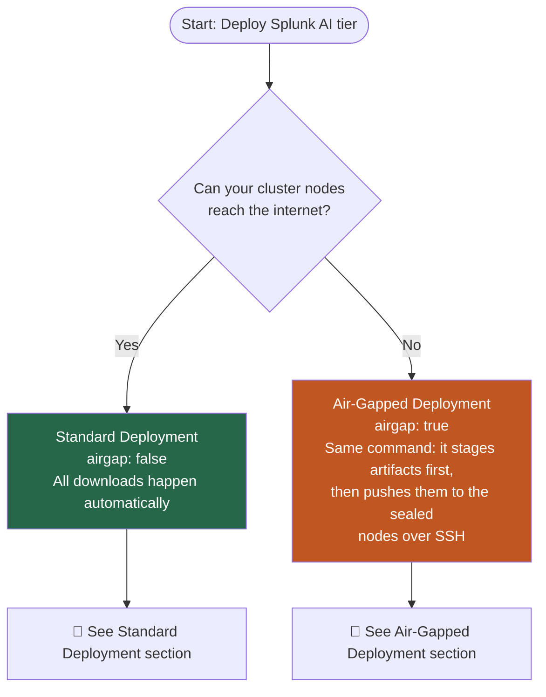

| Scenario | Installer machine has internet | Cluster nodes have internet | Use |
|---|---|---|---|
| Typical cloud / on-prem | ✅ | ✅ | [Standard deployment](#standard-deployment-internet-connected) |
| Cluster isolated | ✅ | ❌ | [Air-gapped deployment](#air-gapped-deployment-no-internet-on-cluster) — the **same** `k0s_cluster_with_stack.sh install` command, with `cluster.airgap: true` in the config |

---

## Supported platforms

The following matrix is the canonical operating-system support boundary for
k0s deployments. Use x86_64/amd64 machines and one cluster-node OS and version
across all controllers and workers.

| Deployment path | Installer machine OS | Cluster-node OS | Connectivity and additional requirements |
|---|---|---|---|
| Standard | RHEL 9.8 or RHEL 10.2 | RHEL 9.8, RHEL 10.2, or Ubuntu 24.04 | The installer machine must have SSH access to every node. The installer machine and cluster nodes require outbound internet access. |
| Air-gapped — RHEL 9.8 nodes | RHEL 9.8 | RHEL 9.8 | The installer machine requires internet access, SSH access to every sealed node, and `createrepo_c`; cluster nodes require no outbound internet access. |
| Air-gapped — RHEL 10.2 nodes | RHEL 10.2 | RHEL 10.2 | The installer machine requires internet access, SSH access to every sealed node, and `createrepo_c`; staging includes the required `kernel-modules-extra` closure. Cluster nodes require no outbound internet access. |
| Air-gapped — Ubuntu 24.04 nodes | RHEL 9.8 | Ubuntu 24.04 | The installer machine requires internet access, SSH access to every sealed node, and Podman or Docker to build the Ubuntu package closure. Cluster nodes require no outbound internet access. |

For a standard deployment, either supported RHEL installer release can be
used with any supported cluster-node OS. Matching the installer RHEL release
to the node release is required only when building air-gap package closures.
Ubuntu 24.04 is supported for cluster nodes, not for the installer machine.

The installer machine is separate from the cluster nodes. Run the commands
locally on it, or SSH into it first when it is remote.

### Supported release combination

Use these versions together for this release:

| Component | Version |
|---|---|
| [Splunk AI Assistant app](https://splunkbase.splunk.com/app/7245) | 2.3.0 |
| [Splunk AI Toolkit app](https://splunkbase.splunk.com/app/2890) | >= 6.1.0 |
| Splunk Enterprise | 10.2 |
| AI Tier / Splunk AI Operator | v1.0 |
| SAIA container images (API v1, API v2, and data loader) | v1.0 |
| SLIM service image | v1.0 |
| Ray runtime | 2.56.0 |
| Ray head image | `docker.io/splunk/ai-tier-ray-head:v1.0` |
| Ray worker image | `docker.io/splunk/ai-tier-ray-worker:v1.0` |

The SAIA `v1.0` entry above is the container release tag,
not the API generation.

Version combinations outside this table have not been qualified for this
release.

---

## Keep the Installer Session Alive

The first install can run for **3–7 hours**, mostly while staging model weights.
Run it inside a persistent `tmux` or `screen` session on the installer machine
so an SSH disconnect does not interrupt the job. Install `tmux` if needed:

```bash
# RHEL 9.8 or RHEL 10.2 installer machine
sudo dnf install -y tmux

tmux new -s splunk-ai-install
# Run the install command here, then detach with Ctrl-b followed by d.
```

Reconnect later with:

```bash
tmux attach -t splunk-ai-install
```

Use `screen -S splunk-ai-install` and `screen -r splunk-ai-install` instead if `screen`
is your standard. Keep the installer machine powered on and connected to the
cluster nodes for the duration of the run.

---

## What Gets Deployed

The installer deploys the complete Splunk AI tier stack onto your k0s cluster.

> **SAIA** = Splunk AI Assistant — the AI chat and SPL-generation application that runs on top of the platform.

SAIA API v1 and v2 are internal API generations deployed together behind the
same AI Tier endpoint. Customers do not select an API generation or configure
separate endpoints.

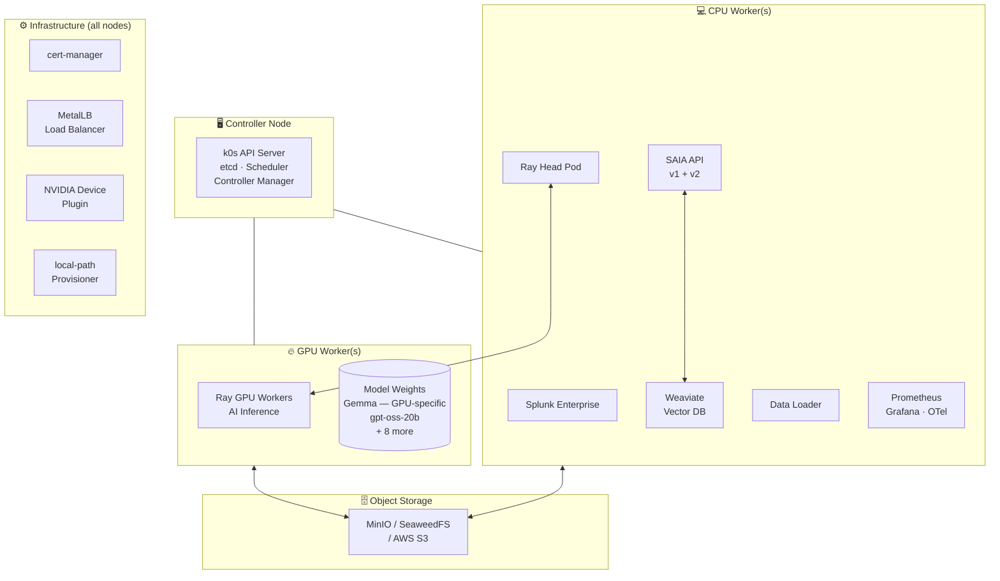

### Operator Stack

| Operator | Version | Purpose |
|---|---|---|
| Splunk AI Operator | v1.0 | Manages `AIPlatform` CR lifecycle |
| Splunk Operator | 3.0.0 | Manages Splunk Enterprise |
| KubeRay | 1.2.2 | Manages Ray clusters for AI inference |
| cert-manager | v1.13.0 | Operator/webhook certificate prerequisite; workload mTLS is not supported in this release |
| OTel Operator | latest | Installed for the existing bundled/internal collector path; workload telemetry remains experimental and is not a supported feature claim for this release |
| NVIDIA Device Plugin | v0.17.3 | Exposes GPUs to Kubernetes |

### Version Compatibility

| Component | Supported version | Notes |
|---|---|---|
| k0s (Kubernetes) | v1.31+ (validated on v1.36.1, containerd 2.x) | Installed automatically by the installer |
| Installer and cluster-node OS | Installer: RHEL 9.8 or RHEL 10.2; cluster nodes: RHEL 9.8, RHEL 10.2, or Ubuntu 24.04 | Use one cluster-node OS and version across all controllers and workers. See the canonical [Supported platforms matrix](#supported-platforms) for the standard and air-gapped installer-host mappings. |
| NVIDIA driver | `nvidia-driver:latest-dkms` (RHEL, DKMS module) or `cuda-drivers` (Ubuntu, DKMS) | Installed via the NVIDIA repo on GPU nodes; RHEL's older `cuda-drivers` meta-package is gone, but Ubuntu's is current and used there |
| NVIDIA Container Toolkit | latest stable | Installed alongside the driver |
| GPU hardware | NVIDIA L40S or H100 | Set `defaultAcceleratorType: L40S` or `defaultAcceleratorType: H100` |
| Splunk Enterprise | 10.2 | For bundled/in-cluster Splunk, use `docker.io/splunk/splunk:10.2-rhel9` or the corresponding private-registry path. Use the release combination below; other combinations have not been qualified for this release. |

> **Licensing:** Splunk Enterprise and the Splunk AI Operator require valid Splunk licenses. Container images are pulled from the configured public or private registry; ensure your deployment has the required image access before deployment.

### Internal Splunk Transport

For k0s **internal Splunk** mode, this branch restores `main`'s native splunkd
HTTPS and short-issuer contract rather than installing certificates or another
proxy. It also aligns the AIPlatform endpoint with that issuer for both SAIA
and SLIM Service. Splunkd keeps its native HTTPS listener on port 8089. This is
required by the Splunk AI Assistant app 2.3.0, whose local Splunk SDK connects
to `https://127.0.0.1:8089`.

Splunk's OAuth `issuer_uri` and
`AIPlatform.spec.splunkConfiguration.endpoint` use the same short,
namespace-local Service URL:

```text
https://splunk-<standaloneName>-standalone-service:8089
```

The operator propagates that endpoint to both SAIA and SLIM Service as
`SPLUNK_ISSUERS`, so the JWT `iss` claim and both feature allowlists remain
byte-identical. The installer does not create a JWKS proxy, TLS Secret,
Certificate, CA ConfigMap, or CA mount for this path.

This compatibility choice has an explicit limitation. Splunk's built-in
certificate may not be trusted by an image that strictly verifies outbound TLS,
and it may not contain a SAN matching the Kubernetes Service hostname. That
certificate-validation problem is not solved in this branch. The separate
certificate/CA design and verified end-to-end workload TLS are not supported in
this release. Do not disable verification globally to work around a failed
certificate check.

> **Release support boundary:** the bundled/internal HEC and OTel behavior is
> retained unchanged to avoid regressing the tested installation path, but
> workload telemetry is not a supported feature claim for this release.
> External Splunk is JWT-only through `splunk.trustedIssuers` on management port
> 8089; external HEC/OTel is unsupported and not release-qualified.
> Workload mTLS is not enabled or supported.

Changing from an FQDN or HTTP issuer to the short native-HTTPS issuer
changes the JWT `iss` value. Users must sign in again or repeat onboarding so
Splunk mints fresh interactive tokens. Tokens containing the previous issuer
are expected to be rejected.

### Scaling Deployment Capacity

Use `aiPlatform.scaleFactor` to increase or decrease AI workload capacity:

```yaml
aiPlatform:
  scaleFactor: 2
```

Use a whole number of `1` or higher. The default is `1`; for example, `2`
doubles the standard capacity. Increasing this value does not add GPU nodes, so
ask your cluster administrator to add the required GPU capacity first.

> **Downscaling notice:** Reducing `scaleFactor` causes temporary service
> downtime while workloads are resized. Plan downscaling during a maintenance
> window.

---

## Standard Deployment (Internet-Connected)

### What You Need Before Starting

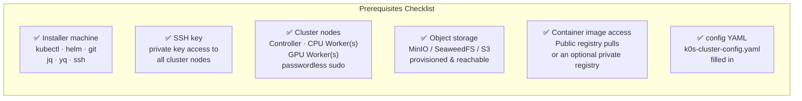

**Node size requirements:**

| Node Type | Min CPU | Min RAM | Min Disk | Count |
|---|---|---|---|---|
| Controller | 4 cores | 8 GB | 100 GB | 1 |
| CPU Worker | 8 cores | 32 GB | 200 GB | 1+ |
| GPU Worker — choose **either** L40S **or** H100, not both | | | | |
| ↳ L40S | 48 vCPUs | 384 GiB | 500 GB | **2 nodes required** · 4 × NVIDIA L40S per node (48 GB GDDR6 each) · **8 × L40S total, 384 GB total GPU memory** · equivalent to `g6e.12xlarge` |
| ↳ H100 | 16 vCPUs | 256 GiB | 500 GB | **2 nodes required** · 1 × NVIDIA H100 per node (80 GB HBM3 each) · **2 × H100 total, 160 GB total GPU memory** · equivalent to `p5.4xlarge` |

> **Minimum viable topology:** The platform requires at least 1 controller + 1 CPU worker + 2 GPU workers. The controller and CPU worker roles can coexist on a single machine for lab/testing use, but this is not supported for production. A single GPU worker is not sufficient — the AI inference stack distributes work across both nodes.
>
> **Only one controller is supported.** The installer rejects configurations where `nodes.controllers` is not `1` or where more than one controller IP is listed. It never issues a controller-join token, so this release does not provide an HA control plane or etcd quorum. Set `nodes.controllers: 1` and list exactly one controller IP.

**Ports to open between nodes:** 22 (SSH), 6443 (k8s API), 2380 (etcd), 10250 (kubelet), 8132 (konnectivity), 4789/UDP (VXLAN/Calico), 179 (Calico BGP).

**Object storage sizing:**

| Data | Minimum size | Notes |
|---|---|---|
| Model weights (`model_artifacts/`) | 250 GB | >120 GB for 10 models + headroom for re-staging |
| Runtime data (conversations, queues, config) | 100 GB | Grows with usage; monitor and expand as needed |
| **Total recommended bucket** | **500 GB+** | Plan for growth if running multiple tenants |

### Install Flow

**Estimated time:**

| Phase | Typical duration | Notes |
|---|---|---|
| Preflight | 1–2 min | Config validation and SSH checks |
| Model staging | 2–6 hours | Depends on internet speed — >120 GB download. Skip with `modelStaging.enabled: false` if already staged. |
| Cluster bootstrap | 10–20 min | k0s install + NVIDIA driver install on GPU nodes |
| Platform stack | 15–30 min | Helm chart deploys + operator reconciliation |
| **Total (first install with staging)** | **~3–7 hours** | Mostly model download time |
| **Total (staging already done)** | **~30–60 min** | |

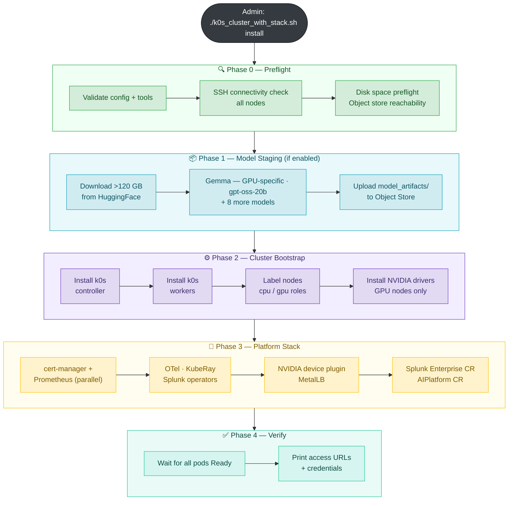

### Step-by-Step (Standard)

**1. Confirm every node is ready**

```bash
# On each node (controller, CPU worker, GPU worker) — confirm OS, passwordless sudo, and Python
cat /etc/os-release               # tested: RHEL 9.8, RHEL 10.2, or Ubuntu 24.04
sudo -n true && echo "passwordless sudo OK"
python3 --version                 # 3.8+

# From the installer machine — confirm SSH access to each node
chmod 600 <path-to-private-key>   # required if the key was copied or downloaded
ssh -i <key> <user>@<node-ip> hostname
```

RHEL 9.8, RHEL 10.2, and Ubuntu 24.04 are the supported node operating
systems. Use one OS and version across all controllers and workers. The
installer-machine requirements differ by deployment path; see the canonical
[Supported platforms matrix](#supported-platforms).
For air-gapped RHEL 10.2, staging includes `kernel-modules-extra` because el10
keeps kube-proxy's required netfilter modules there rather than in the base
kernel.

**GPU worker nodes** need no manual driver install. The installer installs
the driver automatically on internet-connected nodes — RHEL: EPEL →
`nvidia-driver:latest-dkms` (DKMS) → `nvidia-container-toolkit`; Ubuntu: CUDA
repo → `cuda-drivers` (DKMS) → `nvidia-container-toolkit` — and verifies with
`nvidia-smi` as part of `install`.

**2. Configure your cluster**

```bash
cd tools/ai-tier-cluster-setup
cp k0s-cluster-config.yaml my-cluster.yaml
# Open my-cluster.yaml and fill in ALL fields marked CHANGE THIS
```

The config sections to fill in:

| Section | What to set |
|---|---|
| `cluster` | `name`, `sshKeyPath`, `sshUser` |
| `nodes.existingIPs` | IP addresses of your controller and worker nodes — list workers **CPU workers first**: the installer treats the first `nodes.cpuWorkers` entries as CPU nodes and every remaining entry as GPU |
| `storage.objectStore` | Your MinIO / SeaweedFS / S3 endpoint + credentials |
| `images.registry` | Optional registry prefix; leave empty to use the fully qualified public image paths, or set an ECR/private-registry hostname |
| `images.registryInsecure` | Applies only when `images.registry` is set; defaults to `true` for plain HTTP, and must be `false` for ECR, Harbor, or any HTTPS registry |
| `images` (tags) | Public image paths, or private-registry paths when using an optional mirror |
| `aiPlatform` | `defaultAcceleratorType` — `L40S` or `H100` |
| `metallb.pool.addresses` | A free IP range on your LAN (for LoadBalancer VIP) |

> For full field descriptions, secure vs insecure registry guidance, and examples — see [Configuration Reference in k0s-readme.md](k0s-readme.md#images-section).

After completing the standard-deployment preparation, continue to
[Install, Monitor, and Verify (Both Deployment Modes)](#install-monitor-and-verify-both-deployment-modes).

---

## Air-Gapped Deployment (No Internet on Cluster)

### Air-Gap Concepts

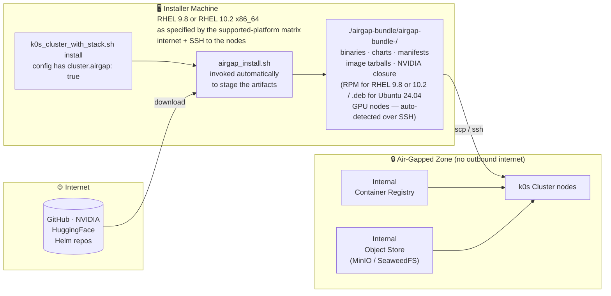

**Key principle:** the air-gap boundary sits between the installer machine and the
cluster nodes — not between two machines. Only the installer machine needs
internet; the nodes never make an outbound connection. There is no tarball to
copy and no separate command to learn: `k0s_cluster_with_stack.sh install`
detects air-gap mode, stages everything into a staging directory via
`airgap_install.sh`, and then pushes it to the nodes over SSH.

**One entry point, two modes.** The command is identical either way — the config
selects the mode:

```yaml
cluster:
  airgap: false   # standard install — proceeds directly to the nodes
  airgap: true    # stages ~3 GB of artifacts first (~15 min), then installs
```

```bash
CONFIG_FILE=./my-cluster.yaml ./k0s_cluster_with_stack.sh install
```

`AIRGAP_MODE=true` in the environment is an equally valid trigger, for a one-off
air-gap run without editing the config:

```bash
AIRGAP_MODE=true CONFIG_FILE=./my-cluster.yaml ./k0s_cluster_with_stack.sh install
```

**Only `install` and `join-workers` stage artifacts.** `validate`, `diagnose`,
`delete`, `clean-all`, `verify-pods`, and `stage-artifacts` never trigger
staging, so they stay instant even with `airgap: true` — a read-only config check
must not require a 15-minute download.

The main installer has no hardcoded download URLs — every internet address is
overridable via environment variables, and the staging step sets all of them
automatically from the staged artifacts.

> **Advanced / direct path.** `airgap_install.sh` remains available as the
> lower-level command and is unchanged: use it to pre-stage with
> `--download-only`, or to drive staging with non-default flags
> (`--k0s-version`, `--gpu-hosts`, `--driver-version`, …). The unified command
> calls it for you with defaults.

### Phase 1 — Stage the Artifacts

Phases 1–3 are preparation you do before installing. If your container images
are already mirrored and your model weights already staged, skip straight to
[Phase 4](#phase-4--enable-air-gap-mode) — the single command there does
Phase 1 for you.

Before starting the phases, create the working configuration from the
air-gapped template and update its required values:

```bash
cd tools/ai-tier-cluster-setup
cp k0s-airgapped-config.yaml my-cluster.yaml
# Edit my-cluster.yaml and fill in the required values
```

Stage explicitly only if you want the artifacts on disk *before* the install
window — to inspect them, to check their size, or to work through Phase 2's
image list. `--download-only` has no equivalent on the unified command, so this
is the way to pre-stage. Run it on the internet-connected RHEL installer machine
specified by the [Supported platforms matrix](#supported-platforms) —
the same machine that can SSH to the cluster nodes.

```bash
cd tools/ai-tier-cluster-setup

# Stage everything and stop, without installing
./airgap_install.sh --download-only --config my-cluster.yaml

# Pin a specific k0s version
./airgap_install.sh --download-only --config my-cluster.yaml \
  --k0s-version v1.31.2+k0s.0

# Stage somewhere other than ./airgap-bundle
./airgap_install.sh --download-only --config my-cluster.yaml \
  --output-dir /mnt/staging
```

**What gets downloaded:**

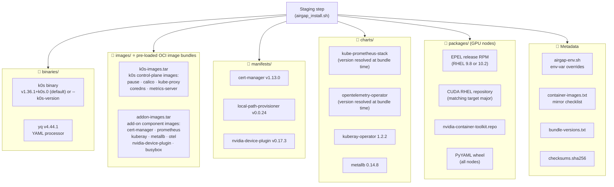

> **⭐ The `images/` tarballs are the part customers most often miss.** The
> staging step produces **both** image tarballs automatically —
> you do **not** run a separate command for them. They are essential: without
> them, an air-gapped cluster's own infrastructure pods (Calico, CoreDNS,
> cert-manager, the NVIDIA device plugin, …) try to pull from quay.io / ghcr.io /
> registry.k8s.io over the blocked link and the cluster never becomes Ready.
> See [Why two image bundles?](#why-two-image-bundles) below.

Output: a timestamped staging directory, consumed in place:

```
./airgap-bundle/airgap-bundle-20260612-103000/   (~3 GB)
```

> **Staging size:** the image tarballs are the bulk — expect a few GB (the
> binaries, charts, and manifests alone are ~500 MB; the k0s and add-on images
> add the rest). Size scales with the resolved image set. After a successful
> install the staged tree is deleted to reclaim disk unless you pass
> `--keep-staging`.

#### Why two image bundles?

Container images are staged as two separate OCI tarballs under `images/`
because two *different* sets of images would otherwise be pulled from the
internet at cluster-bring-up time — and neither set is covered by the
`images.registry` rewrite you configure for the platform's own images:

| Tarball | Built by (during staging, in `airgap_install.sh`) | Covers | Why it can't come from your registry |
|---|---|---|---|
| `k0s-images.tar` | `k0s airgap list-images --all` → `k0s airgap bundle-artifacts` | k0s control-plane images: `pause`, Calico, kube-proxy, CoreDNS, metrics-server | k0s pulls these itself at kubelet startup (from quay.io/k0sproject) — they never pass through the installer's config |
| `addon-images.tar` | renders every Helm chart + static manifest, collects each `image:` ref, then `bundle-artifacts` | add-on components: cert-manager, kube-prometheus-stack, kuberay, MetalLB, OTel, **NVIDIA device plugin**, busybox | their image refs live *inside* the charts/manifests (quay.io, ghcr.io, registry.k8s.io, nvcr.io, docker.io) — the `images.registry` rewrite only touches the platform CR images, not these |

**How they get used (fully automatic):** the staging step detects
`images/*.tar` and the installer copies **every** tarball to
`/var/lib/k0s/images/` on each node — *after* `k0s install` (which recreates
`/var/lib/k0s`) and *before* `k0s start`. k0s auto-imports every tarball in that
directory into containerd at kubelet startup, so the infra pods start with
`IfNotPresent` and never reach for the internet. Workers added later with
`join-workers` get the same treatment.

> **This is distinct from [Phase 2 — Mirror Container Images](#phase-2--mirror-container-images).**
> The `images/` bundles cover **infrastructure** images (k0s + add-ons) and are
> built for you. Phase 2 covers the **Splunk AI tier application** images
> (Splunk Enterprise, SAIA, Ray, Weaviate, the operator …), which you mirror to
> your own registry and point `images.registry` at. Both are required.

### Phase 2 — Mirror Container Images

Platform application images are **not** staged (they would add many GB). Mirror them separately to your internal registry. `--download-only` in Phase 1 gives you the list to work from.

**Air-gapped private registry sizing:** Reserve **~25–30 GB** for the mirrored
platform images. The exact amount depends on the selected images and mirroring
strategy; it is separate from object-storage capacity.

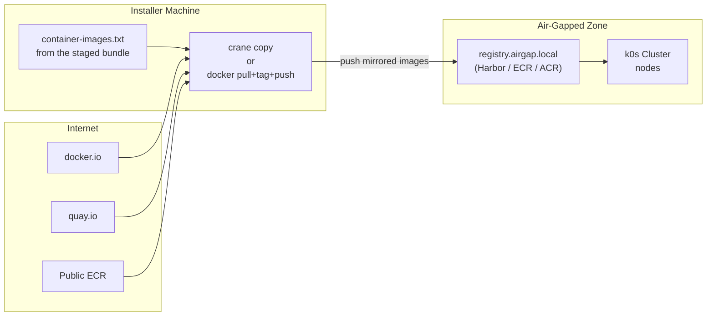

```bash
INTERNAL_REGISTRY="registry.airgap.local"
IMAGE_LIST=$(ls ./airgap-bundle/airgap-bundle-*/container-images.txt | tail -1)

while IFS= read -r img; do
  [[ "$img" =~ ^# ]] && continue
  [[ -z "$img" ]] && continue
  relative_image="${img#*/}"
  dest="${INTERNAL_REGISTRY}/${relative_image}"
  echo "Copying $img → $dest"
  crane copy "$img" "$dest"
done < "${IMAGE_LIST}"
```

After mirroring, update your config:

```yaml
images:
  registry: "registry.airgap.local"
  operator:
    image: "registry.airgap.local/splunk/splunk-ai-operator:v1.0"
  # ... all other images pointing at your internal registry

imagePullSecrets:
  autoCreateECR: false   # disable automatic ECR token refresh
```

> **`registry.airgap.local` requires authentication** (Harbor or similar)?
> `autoCreateECR: false` plus `images.registry` alone creates no pull secret —
> the installer only creates one when `imagePullSecrets.custom` is configured:
>
> ```yaml
> imagePullSecrets:
>   autoCreateECR: false
>   custom:
>     enabled: true
>     name: "custom-registry-secret"
>     server: "registry.airgap.local"
>     username: "<registry-username>"
>     password: "<registry-password>"
> ```
>
> Leave `custom.enabled: false` only if your registry accepts unauthenticated pulls.

### Phase 3 — Stage Model Weights

Model weights (>120 GB) must be staged to your object store. Do this on the installer machine, or any other machine with internet and reach to the object store.

**System requirements for the staging machine**

| Resource | Minimum | Notes |
|---|---|---|
| Disk (free) | 250 GB | >120 GB for 10 models + buffer for download staging and upload temp files |
| RAM | 16 GB | Scripts process and stream large files; less RAM causes swapping and slow uploads |
| Internet | Stable broadband | Downloads >120 GB from HuggingFace; safe to re-run on a flaky connection — already-staged models are skipped automatically |
| CPU | 4 cores | Recommended for parallel upload scripts |

> **Same machine as the installer?** The installer machine already runs `kubectl`, `helm`, and `ssh` — it can also run model staging. Just ensure the **disk requirement** is met. `/tmp` or the working directory must have 250 GB free.

```bash
cd tools/artifacts_download_upload_scripts

# Download from HuggingFace — pass GPU type or select interactively when prompted
./download_from_huggingface.sh --accelerator l40s   # or --accelerator h100

# Upload to your object store (endpoint must be reachable from this machine)
./upload_to_minio.sh    # or upload_to_s3.sh, upload_to_seaweedfs.sh
```

Then disable auto-staging in your cluster config (models are already there):

```yaml
storage:
  modelStaging:
    enabled: false
```

### Phase 4 — Enable Air-Gap Mode

**4a. Add `cluster.airgap: true` to your config**

This is the mode switch — it is what makes the install command below stage
artifacts instead of going straight at the nodes.

```yaml
cluster:
  name: my-cluster
  airgap: true        # stage artifacts first; skip internet connectivity checks
  sshKeyPath: ~/.ssh/id_rsa
  sshUser: ec2-user # Update this to match the SSH user configured on your nodes.
```

**4b. Continue with the shared install steps**

The install command is the same as for a standard deployment. Continue to
[Install, Monitor, and Verify (Both Deployment Modes)](#install-monitor-and-verify-both-deployment-modes).
The GPU node IPs and SSH user/key are read from the config, so no GPU flags are
normally needed. Air-gapped installation stages ~3 GB of artifacts first and
adds roughly 15 minutes up front.

> **Air-gap staging requirements (installer host only):** `createrepo_c`,
> `sudo`, and ~5 GB free — the NVIDIA RPM closure is built there. A standard
> (`airgap: false`) install needs none of these.

**What the install does automatically in air-gap mode:**

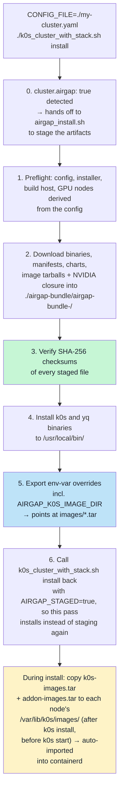

The install plan shown before any changes are made will display:

```
Air-gap mode    : true
k0s install URL : file://./airgap-bundle/airgap-bundle-<date>/binaries/k0s
Helm charts     : local (file://./airgap-bundle/airgap-bundle-<date>/charts/)
Image bundles   : k0s-images.tar, addon-images.tar  → staged to /var/lib/k0s/images/
...
```

During install, watch the log for lines confirming the bundles reached each node:

```
Staging image bundle k0s-images.tar on <node-ip> (/var/lib/k0s/images/)...
Staging image bundle addon-images.tar on <node-ip> (/var/lib/k0s/images/)...
```

> If you instead see `No pre-loaded image bundles in air-gap bundle (images/*.tar)`,
> the image tarballs were not staged — re-run the install with the current
> scripts. Without the bundles, infra pods will sit in `ImagePullBackOff` and
> nodes will stay `NotReady`.

Confirm to proceed.

> **If the install fails partway**, the staged artifacts are deliberately kept so
> a retry needs no re-download. The script prints the exact `source airgap-env.sh`
> and `CONFIG_FILE=... ./k0s_cluster_with_stack.sh <subcommand>` commands to
> resume from where it stopped.

### GPU Nodes in Air-Gapped Environments

GPU nodes require OS packages (DKMS, CUDA, nvidia-container-toolkit, plus EPEL
on RHEL) that normally download from the internet. The air-gap staging step
builds a complete offline closure for them — an **RPM closure** for RHEL GPU
nodes, or a **.deb closure** for Ubuntu 24.04 GPU nodes — and the installer
pushes it to each GPU node, so a sealed node never contacts
`developer.download.nvidia.com`. The staging step auto-detects which format to
build by SSHing to a GPU node and reading `/etc/os-release`; you never choose
the format yourself unless overriding with `--gpu-os`.

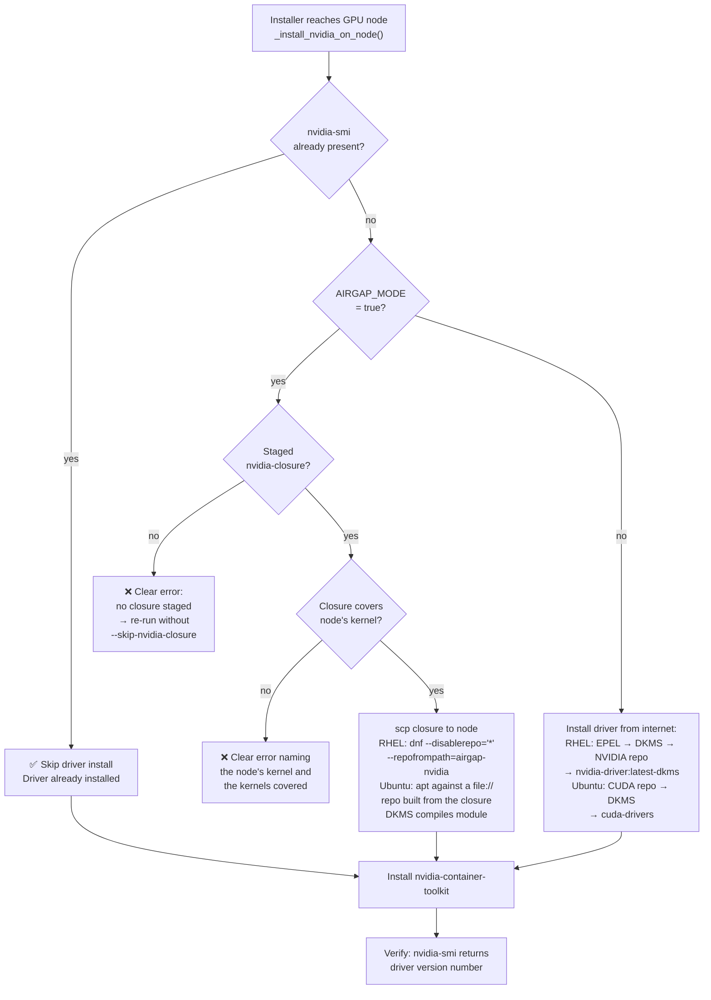

**Two strategies for GPU node packages in air-gap:**

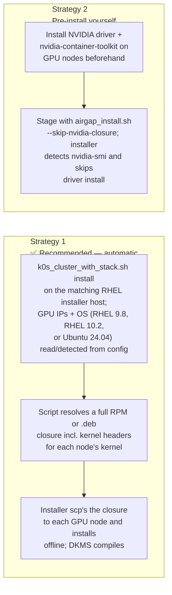

**Strategy 1 — staging the driver closure:**

Run this on the internet-connected RHEL installer machine specified by the
[Supported platforms matrix](#supported-platforms).
The staged NVIDIA packages use DKMS: `kmod-nvidia-latest-dkms` on RHEL and
`cuda-drivers` on Ubuntu 24.04. The kernel module is compiled on each GPU node
and needs kernel headers matching that node's exact `uname -r`.

On supported RHEL 9.8 nodes, the installer selects the
`nvidia-driver:latest-dkms` DNF module stream before resolving that RPM. This
RHEL 9-specific step does not run for RHEL 10.2 or Ubuntu 24.04.

```bash
# Nothing extra to do — the GPU node IPs and OS are derived from your config
# and each node's `uname -r` / OS is surveyed over SSH.
CONFIG_FILE=./my-cluster.yaml ./k0s_cluster_with_stack.sh install
```

To override the derived kernel, host list, or OS, drive the staging step
directly — these flags live on `airgap_install.sh`, which then continues into
the install just as the unified command would:

```bash
# Override the derived list only if needed (e.g. non-standard node layout)
./airgap_install.sh --config my-cluster.yaml \
  --gpu-hosts 10.0.38.138,10.0.38.139

# …or name the kernels explicitly if the nodes aren't reachable over SSH yet
./airgap_install.sh --config my-cluster.yaml \
  --gpu-kernels 5.14.0-687.29.1.el9_8.x86_64

# …or force the GPU node OS/package format instead of auto-detecting it
./airgap_install.sh --config my-cluster.yaml --gpu-os ubuntu24
```

> GPU node IPs come from your config: the workers listed in
> `nodes.existingIPs.workers` after the first `nodes.cpuWorkers` entries are
> treated as the GPU workers. `--gpu-hosts` is only an override. `--gpu-os`
> defaults to `auto`, which SSHes to the first GPU node and reads
> `/etc/os-release` to pick `rhel9`, `rhel10` (RPM closure), or `ubuntu24`
> (`.deb` closure).

Installer-host requirements: use RHEL 9.8 for air-gapped RHEL 9.8 or Ubuntu
24.04 clusters, and RHEL 10.2 for air-gapped RHEL 10.2 clusters. The host needs
`dnf`, `rpm`, and `createrepo_c` (`sudo dnf install -y createrepo_c`) for an RPM
closure. Add Podman or Docker for Ubuntu 24.04 GPU nodes because the `.deb`
closure is resolved inside an `ubuntu:24.04` container. These requirements are
validated before downloads begin.

The RHEL major version must match because `dnf` derives `$releasever` from the
installer host. Standard installations build no offline closure and may use any
standard installer OS listed in the supported-platform matrix.

> **Driver vs. supported GPU hardware:** driver packages are not
> accelerator-specific, but this k0s release supports only NVIDIA L40S and H100.
> Kernel headers remain node-specific.

**The closure is valid only for the kernels it was built for.** If a GPU node runs an
uncovered kernel, the installer fails before copying anything and names both the
node's kernel and the kernels the closure covers — re-run with that kernel included.
For the same reason, don't let an air-gapped GPU node upgrade or reboot into a
different kernel afterward; the DKMS module is built only against the one it saw.

> **Full reference** — flags, kernel-coverage rules, and troubleshooting rows for
> each failure mode are in
> [k0s-readme.md — GPU Nodes in Air-Gapped Environments](k0s-readme.md#gpu-nodes-in-air-gapped-environments).

The same run then continues into the install. It exports
`AIRGAP_NVIDIA_CLOSURE_DIR`, and the installer copies the closure to each GPU node,
installs the driver, DKMS, build toolchain, container toolkit, and matching
`kernel-devel` with `dnf --disablerepo='*' --repofrompath=airgap-nvidia,<dir>`,
verifies the DKMS build, then configures the containerd runtime, generates the CDI
spec, and applies the device-plugin DaemonSet — all offline.

**What the installer handles for you (k0s ≥ 1.33 / containerd 2.x):**

- **containerd 2.x runtime config.** `nvidia-ctk runtime configure` still emits
  the legacy `io.containerd.grpc.v1.cri` plugin key, which containerd 2.x
  rejects (crash-looping the worker). The installer rewrites the drop-in to the
  new `io.containerd.cri.v1.runtime` key automatically when the node's k0s base
  config uses it — no manual edit needed.
- **device-plugin image.** `nvcr.io/nvidia/k8s-device-plugin` is included in
  `addon-images.tar`, staged to `/var/lib/k0s/images/` on every worker, so the
  DaemonSet starts without pulling from `nvcr.io`. (If you see the device-plugin
  in `ImagePullBackOff`, the tarballs did not reach the node — check
  `ls /var/lib/k0s/images/` there.)
- **worker image staging on rejoin.** Workers joined into an existing cluster
  also receive the image tarballs, so a GPU node added later still comes up
  Ready offline.

> **Environment variable reference and advanced options** — see [k0s-readme.md — Air-Gapped Deployment](k0s-readme.md#air-gapped-deployment).

---

## Install, Monitor, and Verify (Both Deployment Modes)

> **This section applies to both standard and air-gapped deployments.** It is
> not part of the air-gapped-only workflow.

After completing either the standard-deployment preparation or the air-gapped
preparation above, run these shared steps from
`tools/ai-tier-cluster-setup`.

### 1. Validate your config before installing

```bash
CONFIG_FILE=./my-cluster.yaml ./k0s_cluster_with_stack.sh validate
```

`validate` checks local configuration completeness only. It does not contact
the cluster nodes, object store, or image registry, and it does not confirm
that model artifacts are staged. The `install` command runs those environment
checks during preflight before making changes.

This runs a read-only config check and prints a ✔/✖ checklist. Fix any ✖ items
before proceeding.

### 2. Run the installer

Start this command inside the [persistent installer session](#keep-the-installer-session-alive):

```bash
CONFIG_FILE=./my-cluster.yaml ./k0s_cluster_with_stack.sh install
```

The installer shows an install plan and asks for confirmation before making any
changes. With `cluster.airgap: true`, this same command stages the offline
artifacts before it installs the platform.

### 3. Monitor progress

The installer prints timestamped progress to the terminal and to a log file:

```bash
# In another terminal — follow the live log
tail -f logs/k0s-install-*.log
```

### 4. Run the quick verification

Run the same verification command for standard and air-gapped deployments:

```bash
CONFIG_FILE=./my-cluster.yaml ./k0s_cluster_with_stack.sh verify-pods
```

## Post-Install Verification

**Component namespaces — quick reference:**

| Namespace | Components |
|---|---|
| `ai-platform` | AIPlatform CR, SAIA API v1/v2, Ray Head/Workers, Weaviate, Splunk Enterprise, Data Loader, Nginx |
| `splunk-ai-operator-system` | Splunk AI Operator controller |
| `splunk-operator` | Splunk Operator controller |
| `ray-system` | KubeRay Operator |
| `cert-manager` | cert-manager controller, webhook, cainjector |
| `kube-prometheus-stack` | Prometheus, Grafana, Alertmanager |
| `opentelemetry-operator-system` | OTel Operator |
| `kube-system` | NVIDIA device plugin DaemonSet, Calico, local-path-provisioner |
| `metallb-system` | MetalLB controller and speakers (if LoadBalancer enabled) |
| `local-path-storage` | local-path-provisioner |

```bash
# Set kubeconfig
export KUBECONFIG=~/.kube/k0s-<cluster-name>

# All nodes must be Ready
kubectl get nodes -o wide

# All pods must be Running or Completed
kubectl get pods -A --sort-by=.metadata.namespace

# AIPlatform CR must be Ready
kubectl get aiplatform -n ai-platform -o wide

# Inspect the generated SAIA service and its exposure mode
SAIA_SERVICE="<cluster-name>-ai-platform-saia-saia-service"
kubectl get svc "${SAIA_SERVICE}" -n ai-platform -o wide

# GPU nodes must show available GPUs
kubectl get nodes -l splunk.ai/workload-type=gpu -o yaml | grep nvidia.com/gpu
# → nvidia.com/gpu: "<count>" appears twice per GPU node (status.capacity and
#   status.allocatable) once the NVIDIA device plugin has registered the GPUs
```

**Expected state after a successful install:**

| Resource | Expected Status |
|---|---|
| All nodes | `Ready` |
| `cert-manager` pods | `Running` |
| `kube-prometheus-stack` pods | `Running` |
| `splunk-operator` pods | `Running` |
| `kuberay-operator` pods | `Running` |
| `splunk-standalone` | `Ready` |
| `aiplatform/<name>` | `Ready` |
| SAIA service | Matches the configured `ClusterIP`, `NodePort`, or `LoadBalancer` exposure mode |
| GPU nodes | `nvidia.com/gpu: N` in allocatable |

**Sample output — healthy cluster:**

```
# kubectl get nodes
NAME          STATUS   ROLES    AGE   VERSION
controller    Ready    master   12m   v1.31.2+k0s
cpu-worker-1  Ready    <none>   10m   v1.31.2+k0s
gpu-worker-1  Ready    <none>   10m   v1.31.2+k0s
gpu-worker-2  Ready    <none>   10m   v1.31.2+k0s

# kubectl get aiplatform -n ai-platform
NAME                  STATUS   AGE
my-cluster-ai-platform  Ready    8m
```

If any node shows `NotReady` or the AIPlatform CR shows `Pending` for more than 10 minutes, check the session log and see [Troubleshooting](#troubleshooting).

---

## Internal Splunk Access

The in-cluster Splunk Enterprise instance is a ClusterIP service by default;
the installer does not create a Splunk NodePort or LoadBalancer. Use
`kubectl port-forward` for quick access from the installer machine. See
[k0s-readme.md — Finding the Splunk Web URL](k0s-readme.md#finding-the-splunk-web-url)
for the exact service and operator-managed Secret lookup. This section applies
only to bundled Splunk; external Splunk uses its administrator-provided URL and
credentials.

For ClusterIP onboarding, configure Splunk with the in-cluster URL
`http://<cluster-name>-ai-platform-saia-saia-service.ai-platform.svc.cluster.local:8080`.
Use `kubectl port-forward` only for browser or local testing; do not save its
`127.0.0.1` URL in the Splunk AI Assistant configuration.

---

## Install the Splunk AI Assistant App

After the cluster is healthy, install the
[**Splunk AI Assistant** app](https://splunkbase.splunk.com/app/7245)
version 2.3.0 (`Splunk_AI_Assistant_Cloud.tgz`) on Splunk Enterprise 10.2, then
onboard it to AI Tier / Splunk AI Operator v1.0.

> **Obtaining the app:** Download version 2.3.0 from the
> [Splunk AI Assistant listing on Splunkbase](https://splunkbase.splunk.com/app/7245).
> Verify the package version before uploading `Splunk_AI_Assistant_Cloud.tgz`.
> Other version combinations have not been qualified for this release.

The app is installed after the platform deployment is healthy; it is a separate
post-install step and does not change the cluster installation flow.

### 1. Find your Splunk Web URL

```bash
# Bundled Splunk only: discover the operator-managed versioned Secret.
NAMESPACE="ai-platform"
STANDALONE_NAME="splunk-standalone"
SPLUNK_SECRET="$(kubectl get secret -n "${NAMESPACE}" \
  -l 'app.kubernetes.io/component=versionedSecrets,app.kubernetes.io/managed-by=splunk-operator' \
  -o jsonpath='{range .items[*]}{.metadata.name}{"|"}{.metadata.ownerReferences[0].name}{"\n"}{end}' \
  | awk -F'|' -v owner="${STANDALONE_NAME}" '$2 == owner {print $1; exit}')"
[[ -n "${SPLUNK_SECRET}" ]] || { echo "Splunk admin Secret not found" >&2; exit 1; }
kubectl get secret "${SPLUNK_SECRET}" -n "${NAMESPACE}" \
  -o jsonpath='{.data.password}' | base64 --decode && echo

# Splunk Web is ClusterIP by default; expose it locally.
SPLUNK_SERVICE="splunk-${STANDALONE_NAME}-standalone-service"
kubectl get svc "${SPLUNK_SERVICE}" -n "${NAMESPACE}"
kubectl port-forward -n "${NAMESPACE}" "svc/${SPLUNK_SERVICE}" 8000:8000
```

### 2. Install the app

1. Log in to Splunk Web (`http://localhost:8000` when using the port-forward above)
2. **Apps → Manage Apps → Install app from file**
3. Select `Splunk_AI_Assistant_Cloud.tgz`, check **Upgrade app** if updating, click **Upload**
4. Restart Splunk if prompted

### 3. Onboard to the AI tier

The app needs the SAIA API URL to route prompts to the AI backend.

```bash
# The installer creates this service from the AIPlatform/AIService names.
NAMESPACE="ai-platform"
CLUSTER_NAME="<cluster-name>"
SAIA_SERVICE="${CLUSTER_NAME}-ai-platform-saia-saia-service"
kubectl get svc "${SAIA_SERVICE}" -n "${NAMESPACE}" -o wide
# NodePort: use the reported nodePort with http://<worker-node-ip>:<nodePort>
# LoadBalancer: use the reported external address with port 8080
# ClusterIP: use the in-cluster DNS URL from the note below for Splunk-side config
```

In Splunk Web: **Splunk AI Assistant → Configuration** → enter the endpoint
from the service exposure mode above and save. For `ClusterIP`, use
`http://${SAIA_SERVICE}.${NAMESPACE}.svc.cluster.local:8080`; this URL is
reachable from the Splunk pod. A `kubectl port-forward` is only for browser or
local testing from the installer machine, and its `127.0.0.1` URL must not be
saved in the Splunk app configuration.

> **Full configuration options** (scripted setup via `splunkaiassistant.conf`, air-gapped install, verification, and troubleshooting) — see [k0s-readme.md — Splunk AI Assistant App](k0s-readme.md#splunk-ai-assistant-app).

### 4. Verify

```bash
kubectl get standalone splunk-standalone -n ai-platform -o json \
  | jq '.status.appContext.appSrcDeployStatus'
# deployStatus: 3 = installed
```

Open the Splunk AI Assistant app and send a test prompt to confirm end-to-end connectivity.

For a reusable pass/fail sequence covering installer completion, Pods, workload
resources, direct model inference, trusted SAIA reachability, and the browser
flow, use the [Post-Install Sanity Checklist](../../tools/ai-tier-cluster-setup/SANITY_TEST_CHECKLIST.md).

---

## Install the Splunk AI Toolkit App

After the cluster is healthy, install the **Splunk AI Toolkit** app
(`Splunk_ML_Toolkit`, packaged as `Splunk_ML_Toolkit.tgz`) version >= 6.1.0 on
the same Splunk Enterprise 10.2 instance — installing the Splunk AI Assistant
app above is not a prerequisite. Unlike the Assistant app, the Toolkit app
calls the **SLIM service**, not SAIA, and adds the `ai` and `apply CDTSM` SPL
commands. This is a separate post-install step and does not change the cluster
installation flow.

> **Prerequisite:** the `slim` feature must be enabled and its Service exposed
> so Splunk can reach it — see
> [`aiPlatform.serviceTemplate.slimNodePort`](k0s-readme.md#service-template-saia--slim-public-exposure).
> The default `ClusterIP` exposure is enough only when Splunk runs in the same
> cluster.

### 1. Install the app

Using the same Splunk Web session as [above](#install-the-splunk-ai-assistant-app):

1. **Apps → Manage Apps → Install app from file**
2. Select `Splunk_ML_Toolkit.tgz`, check **Upgrade app** if updating, click **Upload**
3. Restart Splunk if prompted

### 2. Onboard to the AI tier

The app needs the SLIM base URL, including the API path, to route the `ai` and
`apply CDTSM` commands to the AI tier.

```bash
NAMESPACE="ai-platform"
CLUSTER_NAME="<cluster-name>"
SLIM_SERVICE="${CLUSTER_NAME}-ai-platform-slim-slim-service"
kubectl get svc "${SLIM_SERVICE}" -n "${NAMESPACE}" -o wide
# NodePort: http://<worker-node-ip>:<nodePort>/tenant/slim-api/v1alpha1
# LoadBalancer: http://<external-ip-or-hostname>:8080/tenant/slim-api/v1alpha1
# ClusterIP: http://${SLIM_SERVICE}.${NAMESPACE}.svc.cluster.local:8080/tenant/slim-api/v1alpha1
```

`tenant` is a literal path segment that SLIM reads as a tenant label; keep it
as written or use another short name.

In Splunk Web: **Splunk AI Toolkit → Connections**. Click **+ Connection** →
under **Endpoint**, choose **Splunk AI tier**, then walk through the wizard and
enter the URL above — including the `/tenant/slim-api/v1alpha1` suffix — as the
**AI tier endpoint URL**. Saving performs no connectivity check; confirm SLIM
is reachable first with a `/health` probe from inside the Splunk pod (see the
full guide below).

> **Full configuration options** (endpoint reachability checks, the AI tier
> LLM connection required for `ai`, and troubleshooting) — see
> [k0s-readme.md — Splunk AI Toolkit App](k0s-readme.md#splunk-ai-toolkit-app)
> and
> [Onboarding to the AI Tier (Splunk AI Toolkit)](k0s-readme.md#onboarding-to-the-ai-tier-splunk-ai-toolkit).

### 3. Verify

```text
| inputlookup internet_traffic.csv | head 2000 | apply CDTSM bits_transferred forecast_k=128
```

Forecast values in the results mean the full path — Splunk → SLIM → model — is
healthy. The `ai` command additionally needs an AI tier LLM connection
(**Connections → + Connection → LLM → Splunk AI tier LLM**) before it can run.

---

## Common Operations

### Re-run after a partial failure

The installer is safe to re-run for most steps — existing Helm releases are
updated in place, and k0s join is skipped for nodes that are already Ready.

**Steps that are NOT idempotent:**
- **`clean-all`** — destructive; wipes all k0s state from every node with no recovery

Model staging is now **resumable** — re-runs skip already-staged models automatically. No flags needed.

If install fails partway, re-run directly:

```bash
CONFIG_FILE=./my-cluster.yaml ./k0s_cluster_with_stack.sh install
```

The safety gate prevents wiping a cluster with Ready nodes. If you need to start completely clean:

```bash
CONFIG_FILE=./my-cluster.yaml ./k0s_cluster_with_stack.sh clean-all
CONFIG_FILE=./my-cluster.yaml ./k0s_cluster_with_stack.sh install
```

### Add worker nodes

```bash
CONFIG_FILE=./my-cluster.yaml ./k0s_cluster_with_stack.sh join-workers
```

### Re-stage models only

```bash
CONFIG_FILE=./my-cluster.yaml ./k0s_cluster_with_stack.sh stage-artifacts
```

The command is resumable — it checks which models are already staged in the object store and only downloads/uploads what is missing. The GPU type is read from `aiPlatform.defaultAcceleratorType` in your config (`L40S` or `H100`). See [k0s-readme.md](k0s-readme.md) for details on the pre-check, per-model logging, and direct script usage.

### Image-tag refresh observed in testing

For this initial k0s release, no version-to-version platform upgrade support
contract is defined. Engineering validation confirmed that updating image tags
and rerunning the installer refreshes existing Helm releases in place:

```bash
# 1. Update image tags in your config
vi my-cluster.yaml   # bump operator, ray, saia, splunk image versions

# 2. Run install — Helm refreshes existing releases, does not wipe the cluster
CONFIG_FILE=./my-cluster.yaml ./k0s_cluster_with_stack.sh install
```

> The safety gate prevents `install` from wiping a cluster with Ready nodes and
> updates the stack in place. This is the engineering-tested image-refresh
> behavior.

**Air-gap image refresh:** re-run the same command on the installer machine — with
`airgap: true` still in the config it re-stages the k0s and add-on infrastructure
image bundles before refreshing the stack. It does **not** mirror the platform
application image at the new tag — that's always a manual step
([Phase 2 — Mirror Container Images](#phase-2--mirror-container-images)), and
skipping it leaves the sealed nodes unable to pull the new tag
(`ImagePullBackOff`). For each changed image:

```bash
# 1. Mirror the new tag to your internal registry BEFORE bumping the config
crane copy "docker.io/splunk/<image>:<new-tag>" "registry.airgap.local/<image>:<new-tag>"

# 2. Update the tag in your config to point at the mirrored image
vi my-cluster.yaml

# 3. Re-run install
CONFIG_FILE=./my-cluster.yaml ./k0s_cluster_with_stack.sh install
```

### Collect a support bundle

```bash
CONFIG_FILE=./my-cluster.yaml ./k0s_cluster_with_stack.sh diagnose
ls tools/ai-tier-cluster-setup/logs/k0s-diagnose-*.tar.gz
```

The tar.gz contains: pod logs from all namespaces, Kubernetes events, node descriptions, AIPlatform CR status, and the install session log — with secrets and credentials redacted. **Attach this file when opening a Splunk support case.**

---

## Troubleshooting

### Diagnose first

**Step 1 — validate config** (catches ~40% of issues before touching any node):

```bash
CONFIG_FILE=./my-cluster.yaml ./k0s_cluster_with_stack.sh validate
```

**Step 2 — check the session log** (search for `ERROR`):

```bash
tail -100 tools/ai-tier-cluster-setup/logs/k0s-install-*.log | grep -i error
```

**Step 3 — collect a support bundle**:

```bash
CONFIG_FILE=./my-cluster.yaml ./k0s_cluster_with_stack.sh diagnose
ls tools/ai-tier-cluster-setup/logs/k0s-diagnose-*.tar.gz
```

### Decision tree

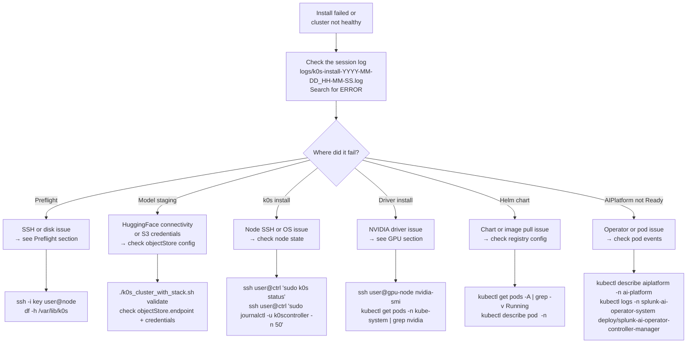

### Quick reference

| Symptom | First check | Fix |
|---|---|---|
| "SSH connection refused" or "Connection timed out" | `ssh -i key user@node-ip hostname` | For refusal, check that SSH is running on the node. For a timeout, check routing/VPN and allow inbound TCP 22 from the installer machine in the security group or firewall. |
| "Refusing to wipe — Ready nodes" (rare — a plain re-run normally detects the already-running k0s and resumes into stack deploy without hitting this) | `kubectl get nodes` | Set `cluster.useExisting: auto` in config or run `clean-all` first |
| "python3+pyyaml missing" on nodes | `ssh user@node python3 -c 'import yaml'` | Run `dnf install -y python3-pyyaml` on the node (or set `AIRGAP_PYYAML_WHEEL_PATH`) |
| "nvidia-smi not found" in AIRGAP_MODE | `ssh user@gpu-node which nvidia-smi` | Check that staging created the offline driver closure and re-run without `--skip-nvidia-closure`; manual driver installation is only needed for the optional pre-installed-driver path — see [Air-Gapped Deployment](k0s-readme.md#gpu-nodes-in-air-gapped-environments) |
| "Checksum verification failed" | A staged file was truncated mid-download | Delete the staging dir and re-run the install (staging repeats automatically) |
| "Expected chart not found" | `ls ./airgap-bundle/airgap-bundle-*/charts/` | Set `PROMETHEUS_CHART_PATH` etc. to the actual filename |
| Pod stuck in `ImagePullBackOff` (SAIA / Splunk / Ray / Weaviate) | `kubectl describe pod <pod> -n <ns>` | Check `images.registry` in config and that image pull secret exists — these are the platform images you mirrored in [Phase 2](#phase-2--mirror-container-images) |
| `ImagePullBackOff` with `http: server gave HTTP response to HTTPS client` | `kubectl describe pod <pod>` → look at image pull error | Registry is plain-HTTP — set `images.registryInsecure: true` in config and re-run install; see [Insecure Registry Support](k0s-readme.md#insecure-registry-support-containerd-v2) |
| All models reported MISSING | `mc ls myminio/<bucket>/staging_state/` or `aws s3api head-bucket --bucket <bucket>` | Confirm the bucket exists, is the configured bucket, and contains `staging_state/` and `model_artifacts/` entries. An empty or missing bucket must be created/populated; uppercase names are normalized, but lowercase config values are recommended. See [Models are reported MISSING after upload](troubleshooting.md#models-are-reported-missing-after-upload) |
| All models MISSING after changing `defaultAcceleratorType` from L40S to H100 | Expected — marker `accel=` field is validated | Re-run `stage-artifacts`; the pre-check detects the accel mismatch and triggers a fresh download/upload. See [Switching accelerator type](troubleshooting.md#switching-defaultacceleratortype-from-l40s-to-h100-reports-models-as-missing) |
| Air-gap: infra pods `ImagePullBackOff` (Calico / CoreDNS / cert-manager / device-plugin) or nodes `NotReady` | `ssh <node> 'ls -la /var/lib/k0s/images/'` | Image bundles didn't reach the node. Confirm `images/*.tar` exists in the staged tree (`--download-only` to inspect); re-run install — see [Why two image bundles?](#why-two-image-bundles) |
| SAIA service has no external address or is unreachable | `kubectl get svc <cluster-name>-ai-platform-saia-saia-service -n ai-platform -o wide` | `NodePort` and `ClusterIP` services correctly have no `EXTERNAL-IP`; use the reported NodePort or `kubectl port-forward`. For a `LoadBalancer` with no address, check MetalLB pods: `kubectl get pods -n metallb-system` |
| AIPlatform CR stuck `Pending` | `kubectl describe aiplatform -n ai-platform` | Check operator logs and GPU node availability |

> For the full symptom list — Ray workers not starting, models not loading, Splunk stuck initializing, and more — see **[troubleshooting.md](troubleshooting.md)**.

---

*Splunk AI tier · k0s Deployment Guide · Last updated 2026-07-02*
