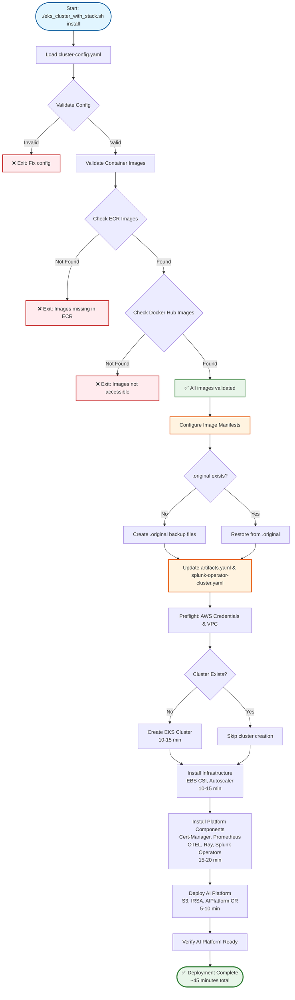
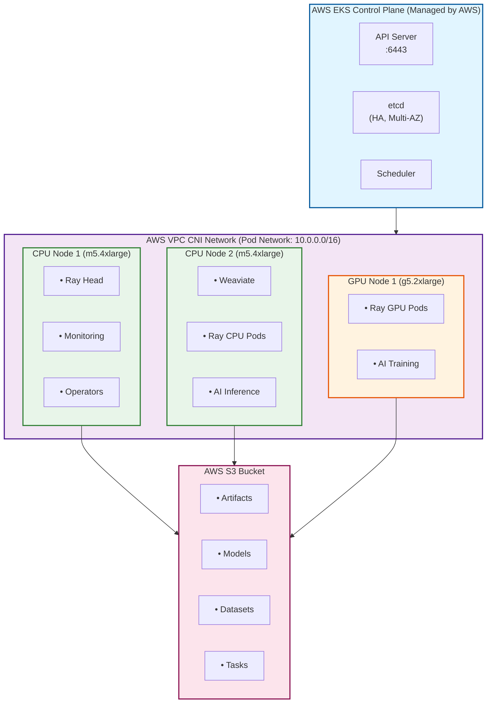

# AWS EKS Deployment for Splunk AI Platform

Complete guide for deploying Splunk AI Platform on AWS Elastic Kubernetes Service (EKS).

## Table of Contents

- [Overview](#overview)
- [Features](#features)
- [Prerequisites](#prerequisites)
- [Quick Start](#quick-start)
- [Configuration](#configuration)
- [Usage](#usage)
- [Architecture](#architecture)
- [Image Pull Secrets](#image-pull-secrets)
- [Advanced Topics](#advanced-topics)
- [Troubleshooting](#troubleshooting)
- [Security](#security)
- [Cost Optimization](#cost-optimization)
- [Migration Guide](#migration-guide)

---

## Overview

The `eks_cluster_with_stack.sh` script deploys the complete Splunk AI Platform on AWS EKS with full AWS integration, supporting:

- **Production AWS deployments** with managed Kubernetes
- **Auto-scaling workloads** with GPU and CPU node groups
- **S3 storage integration** for AI artifacts and models
- **IAM Roles for Service Accounts (IRSA)** for secure AWS access
- **Fully managed control plane** with AWS-managed etcd and API servers

### What is AWS EKS?

[Amazon Elastic Kubernetes Service (EKS)](https://aws.amazon.com/eks/) is a managed Kubernetes service that:
- Runs and scales the Kubernetes control plane across multiple AWS Availability Zones
- Automatically replaces unhealthy control plane nodes
- Provides automated version upgrades and patching
- Integrates with AWS services (IAM, VPC, CloudWatch, ELB)
- Offers 99.95% uptime SLA for the control plane

---

## Features

### Complete AI Platform Stack

The script installs everything needed for the AI Platform:

1. **EKS Cluster** (Kubernetes 1.29+) - AWS-managed control plane
2. **VPC CNI** - Native AWS VPC networking for pods
3. **S3 Bucket** - Object storage for AI artifacts and models
4. **EBS CSI Driver** - Persistent volumes backed by AWS EBS
5. **Cluster Autoscaler** - Automatic node scaling based on demand
6. **Cert-Manager** - Automated certificate management
7. **Kube-Prometheus Stack** - Monitoring with Prometheus + Grafana
8. **OpenTelemetry Operator** - Distributed tracing and telemetry
9. **NVIDIA Device Plugin** - GPU support for AI workloads
10. **KubeRay Operator** - Ray cluster management for distributed AI
11. **Splunk Operator** - Splunk Enterprise management
12. **Splunk AI Platform Operator** - AI platform orchestration
13. **AI Platform CR** - Complete AI deployment with features

### AWS Integration Features

✅ **IAM Roles for Service Accounts (IRSA)** - Secure AWS access without credentials
✅ **S3 Storage** - Native AWS object storage with versioning and encryption
✅ **EBS Volumes** - High-performance block storage for stateful workloads
✅ **Application Load Balancer (ALB)** - Managed ingress with AWS Load Balancer Controller
✅ **VPC Networking** - Secure private networking with security groups
✅ **CloudWatch Integration** - Centralized logging and monitoring
✅ **Auto Scaling** - Dynamic cluster scaling based on workload demand
✅ **Multi-AZ Deployment** - High availability across availability zones

### Automated Image Configuration ✨

**NEW:** Centralized container image management with validation:
- ✅ **Single Configuration File** - All images in `cluster-config.yaml`
- ✅ **Pre-deployment Validation** - Verifies images exist before cluster creation (fails fast!)
- ✅ **Mixed Registries** - Support for both public (Docker Hub) and private (ECR) images
- ✅ **Idempotent Updates** - Safe to run multiple times, creates clean backups
- ✅ **No Manual Editing** - Script automatically updates manifest files

### Image Pull Secrets Support 🔐

Automatically creates and configures secrets for private container registries:
- **AWS ECR** - Elastic Container Registry (auto-token refresh)
- **Docker Hub** - Docker Hub private repositories (manual setup)
- **GCR** - Google Container Registry (manual setup)
- **ACR** - Azure Container Registry (manual setup)
- **Custom** - Any Docker registry (manual setup)

---

## Prerequisites

### AWS Requirements

#### 1. AWS Account and Credentials

```bash
# Install AWS CLI (macOS)
brew install awscli

# Install AWS CLI (Linux)
curl "https://awscli.amazonaws.com/awscli-exe-linux-x86_64.zip" -o "awscliv2.zip"
unzip awscliv2.zip
sudo ./aws/install

# Configure AWS credentials
aws configure
# Enter:
#   AWS Access Key ID: YOUR_ACCESS_KEY
#   AWS Secret Access Key: YOUR_SECRET_KEY
#   Default region: us-west-2
#   Default output format: json

# Verify credentials
aws sts get-caller-identity
```

#### 2. IAM Permissions

Your AWS user/role needs the following permissions:

**Required Services:**
- **EKS**: Create/manage clusters, node groups
- **EC2**: Create/manage instances, security groups, VPCs, subnets, internet gateways
- **IAM**: Create/manage roles, policies, OIDC providers
- **S3**: Create/manage buckets
- **EBS**: Create/manage volumes
- **CloudFormation**: Create/manage stacks (if using eksctl)

**Recommended IAM Policy:** `AdministratorAccess` for initial setup, or create a custom policy with the specific permissions above.

**Check Current Permissions:**
```bash
# Check if you can create EKS cluster
aws eks describe-cluster --name test-check 2>&1 | grep -q "ResourceNotFoundException" && echo "✓ EKS access granted" || echo "✗ No EKS access"

# Check if you can create IAM roles
aws iam get-role --role-name test-check 2>&1 | grep -q "NoSuchEntity" && echo "✓ IAM access granted" || echo "✗ No IAM access"

# Check S3 access
aws s3 ls &>/dev/null && echo "✓ S3 access granted" || echo "✗ No S3 access"
```

#### 3. VPC Configuration

You need an existing VPC with:
- **Public subnets** (at least 2, in different AZs) - For load balancers and NAT gateways
- **Private subnets** (at least 2, in different AZs) - For EKS nodes
- **Internet Gateway** - For outbound internet access
- **NAT Gateway(s)** - For private subnet internet access

**Find Your VPC:**
```bash
# List all VPCs
aws ec2 describe-vpcs --query 'Vpcs[*].[VpcId,CidrBlock,Tags[?Key==`Name`].Value|[0]]' --output table

# Get subnets for a VPC
aws ec2 describe-subnets --filters "Name=vpc-id,Values=vpc-xxxxx" \
  --query 'Subnets[*].[SubnetId,AvailabilityZone,CidrBlock,MapPublicIpOnLaunch]' --output table
```

**Don't Have a VPC?** The script can work with the default VPC, but for production, create a dedicated VPC:
```bash
# Create VPC with eksctl (automatically creates subnets, IGW, NAT)
eksctl create cluster --name temp-cluster --dry-run --vpc-cidr 10.0.0.0/16
```

#### 4. EC2 Key Pair

Create an SSH key pair for accessing nodes (optional, but recommended for troubleshooting):

```bash
# Create key pair
aws ec2 create-key-pair --key-name splunk-ai-key \
  --query 'KeyMaterial' --output text > ~/.ssh/splunk-ai-key.pem

# Set permissions
chmod 400 ~/.ssh/splunk-ai-key.pem

# Verify
aws ec2 describe-key-pairs --key-names splunk-ai-key
```

#### 5. Service Quotas

Ensure you have sufficient quotas for:

| Resource | Required | Check Command |
|----------|----------|---------------|
| Running On-Demand Standard (A, C, D, H, I, M, R, T, Z) instances | 10+ vCPUs | `aws service-quotas get-service-quota --service-code ec2 --quota-code L-1216C47A` |
| Running On-Demand G instances | 8+ vCPUs (for GPU) | `aws service-quotas get-service-quota --service-code ec2 --quota-code L-DB2E81BA` |
| VPCs per Region | 1+ | `aws service-quotas get-service-quota --service-code vpc --quota-code L-F678F1CE` |
| Internet Gateways per Region | 1+ | `aws service-quotas get-service-quota --service-code vpc --quota-code L-A4707A72` |

**Request Quota Increase:**
```bash
# Example: Request increase for G instances (GPU)
aws service-quotas request-service-quota-increase \
  --service-code ec2 \
  --quota-code L-DB2E81BA \
  --desired-value 64
```

### Local Tools

Install required tools on your local machine:

```bash
# macOS
brew install kubectl helm git jq yq eksctl

# Linux (Ubuntu/Debian)
# kubectl
curl -LO "https://dl.k8s.io/release/$(curl -L -s https://dl.k8s.io/release/stable.txt)/bin/linux/amd64/kubectl"
sudo install -o root -g root -m 0755 kubectl /usr/local/bin/kubectl

# helm
curl https://raw.githubusercontent.com/helm/helm/main/scripts/get-helm-3 | bash

# jq
sudo apt-get install -y jq

# yq
wget https://github.com/mikefarah/yq/releases/latest/download/yq_linux_amd64 -O /usr/local/bin/yq
chmod +x /usr/local/bin/yq

# eksctl
curl --silent --location "https://github.com/weaveworks/eksctl/releases/latest/download/eksctl_$(uname -s)_amd64.tar.gz" | tar xz -C /tmp
sudo mv /tmp/eksctl /usr/local/bin

# Verify installations and check minimum versions
kubectl version --client    # Minimum: v1.28+
helm version               # Minimum: v3.12+
git --version             # Minimum: v2.30+
jq --version              # Minimum: v1.6+
yq --version              # Minimum: v4.30+ (mikefarah/yq, NOT Python yq)
eksctl version            # Minimum: v0.2.0+
aws --version             # Minimum: AWS CLI v2.13+
```

### Container Images Configuration

**IMPORTANT:** The `artifacts.yaml` file contains image references that point to a specific ECR registry. If you're using your own container registry or have uploaded the images to your own ECR account, you **must** update the image references before installation.

#### Required Updates in artifacts.yaml

The Splunk AI Operator deployment in `artifacts.yaml` contains environment variables that specify container images for all components. You need to update these to point to your registry:

**Location:** `artifacts.yaml` → Deployment: `splunk-ai-operator-controller-manager` → Container env vars

**Images to update:**

```yaml
env:
  - name: RELATED_IMAGE_RAY_HEAD
    value: YOUR_REGISTRY/ray-head:YOUR_TAG               # ← UPDATE THIS
  - name: RELATED_IMAGE_RAY_WORKER
    value: YOUR_REGISTRY/ray-worker-gpu:YOUR_TAG         # ← UPDATE THIS
  - name: RELATED_IMAGE_WEAVIATE
    value: YOUR_REGISTRY/weaviate:YOUR_TAG               # ← UPDATE THIS (or use public: semitechnologies/weaviate:stable-v1.28-007846a)
  - name: RELATED_IMAGE_SAIA_API
    value: YOUR_REGISTRY/saia-api:YOUR_TAG               # ← UPDATE THIS
  - name: RELATED_IMAGE_POST_INSTALL_HOOK
    value: YOUR_REGISTRY/saia-data-loader:YOUR_TAG       # ← UPDATE THIS
  - name: RELATED_IMAGE_FLUENT_BIT
    value: fluent/fluent-bit:1.9.6                       # ← Public image, usually no change needed
  - name: RELATED_IMAGE_OTEL_COLLECTOR
    value: otel/opentelemetry-collector-contrib:0.122.1  # ← Public image, usually no change needed
  - name: MODEL_VERSION
    value: v0.3.14-36-g1549f5a                           # ← Update to your model version
  - name: RAY_VERSION
    value: 2.44.0                                        # ← Ray version (usually no change needed)
image: YOUR_REGISTRY/splunk-ai-operator:YOUR_TAG         # ← UPDATE THIS (operator image itself)
```

**Example with your own ECR registry:**

```yaml
env:
  - name: RELATED_IMAGE_RAY_HEAD
    value: 123456789012.dkr.ecr.us-west-2.amazonaws.com/my-ai-platform/ray-head:v1.0.0
  - name: RELATED_IMAGE_RAY_WORKER
    value: 123456789012.dkr.ecr.us-west-2.amazonaws.com/my-ai-platform/ray-worker-gpu:v1.0.0
  - name: RELATED_IMAGE_WEAVIATE
    value: semitechnologies/weaviate:stable-v1.28-007846a  # Can use public image
  - name: RELATED_IMAGE_SAIA_API
    value: 123456789012.dkr.ecr.us-west-2.amazonaws.com/my-ai-platform/saia-api:v1.1.0
  - name: RELATED_IMAGE_POST_INSTALL_HOOK
    value: 123456789012.dkr.ecr.us-west-2.amazonaws.com/my-ai-platform/saia-data-loader:v1.1.0
  - name: RELATED_IMAGE_FLUENT_BIT
    value: fluent/fluent-bit:1.9.6  # Public image
  - name: RELATED_IMAGE_OTEL_COLLECTOR
    value: otel/opentelemetry-collector-contrib:0.122.1  # Public image
  - name: MODEL_VERSION
    value: v0.3.14-36-g1549f5a
  - name: RAY_VERSION
    value: 2.44.0
image: docker.io/your-dockerhub-user/splunk-ai-operator:v1.2.0
```

**How to update:**

```bash
# Edit artifacts.yaml
vi artifacts.yaml

# Or use yq to update programmatically
yq eval '.spec.template.spec.containers[0].env[] |= select(.name == "RELATED_IMAGE_RAY_HEAD").value = "YOUR_REGISTRY/ray-head:YOUR_TAG"' -i artifacts.yaml

# Verify changes
grep "RELATED_IMAGE" artifacts.yaml
```

**When to update:**
- ✅ When using your own private container registry
- ✅ When you've uploaded images to your own ECR account
- ✅ When using different image tags/versions
- ❌ If using the default public images (but check if they're accessible)

**Image Pull Secrets:**
If your images are in a private registry (like ECR), ensure you:
1. Have valid AWS credentials configured (for ECR)
2. The script will automatically create ECR pull secrets if AWS credentials are available
3. For non-ECR registries, manually create image pull secrets (see [Image Pull Secrets](#image-pull-secrets) section)

---

## Quick Start

**Time to complete:** ~45 minutes

### 1. Navigate to Cluster Setup Directory

```bash
cd /path/to/splunk-ai-operator/tools/cluster_setup
```

### 2. Prepare AWS Prerequisites

**✅ Ensure you have:**
- AWS CLI installed and configured (`aws --version`)
- Valid AWS credentials with appropriate permissions
- Existing VPC with public and private subnets in multiple AZs **OR** let eksctl create a new VPC automatically
- Required tools installed: `eksctl`, `kubectl`, `helm`, `jq`, `yq`

**🔐 Set AWS Credentials:**
```bash
# Option 1: Use AWS Profile (recommended)
export AWS_PROFILE=your-profile-name
aws sts get-caller-identity  # Verify you're in the correct account

# Option 2: Use environment variables
export AWS_ACCESS_KEY_ID=your-key
export AWS_SECRET_ACCESS_KEY=your-secret
export AWS_SESSION_TOKEN=your-token  # if using temporary credentials

# Verify your AWS account ID
aws sts get-caller-identity --query Account --output text
```

**⚠️ Important:** The script requires valid AWS credentials to pass preflight checks. You'll get a clear error message if credentials are missing.

**Note about AWS Credentials for Claude Code users:** If you're using Claude Code, you may need to unset AWS credentials that are set for Bedrock, as they will conflict with your actual AWS account credentials:
```bash
unset AWS_ACCESS_KEY_ID AWS_SECRET_ACCESS_KEY AWS_SESSION_TOKEN AWS_PROFILE
export AWS_PROFILE=your-actual-profile
```

### 3. Find Your VPC and Subnets (Optional)

**You have two options:**

**Option A: Let eksctl create a new VPC automatically (Easiest)**
- Skip this step entirely
- Leave the `subnets` section empty in your config file
- eksctl will create a new VPC with proper networking

**Option B: Use an existing VPC with subnets**

```bash
# List all VPCs in your region
aws ec2 describe-vpcs --region us-west-2 \
  --query 'Vpcs[*].[VpcId,CidrBlock,Tags[?Key==`Name`].Value|[0]]' \
  --output table

# Get subnets for your VPC
VPC_ID=vpc-xxxxx  # Replace with your VPC ID
aws ec2 describe-subnets --filters "Name=vpc-id,Values=$VPC_ID" --region us-west-2 \
  --query 'Subnets[*].[SubnetId,AvailabilityZone,CidrBlock,MapPublicIpOnLaunch,Tags[?Key==`Name`].Value|[0]]' \
  --output table

# Find private subnets (MapPublicIpOnLaunch = False)
aws ec2 describe-subnets --filters "Name=vpc-id,Values=$VPC_ID" \
  "Name=map-public-ip-on-launch,Values=false" --region us-west-2 \
  --query 'Subnets[*].[SubnetId,AvailabilityZone]' --output table

# Find public subnets (MapPublicIpOnLaunch = True)
aws ec2 describe-subnets --filters "Name=vpc-id,Values=$VPC_ID" \
  "Name=map-public-ip-on-launch,Values=true" --region us-west-2 \
  --query 'Subnets[*].[SubnetId,AvailabilityZone]' --output table

# IMPORTANT: Verify VPC has NAT Gateway (required for private subnets)
aws ec2 describe-nat-gateways --region us-west-2 \
  --filter "Name=vpc-id,Values=$VPC_ID" "Name=state,Values=available" \
  --query 'NatGateways[*].[NatGatewayId,SubnetId,State]' --output table
```

**Required VPC Networking Components:**
If using existing VPC, ensure it has:
- ✅ At least 2 private subnets in different AZs
- ✅ At least 2 public subnets in different AZs
- ✅ NAT Gateway (at least 1, preferably 1 per AZ for HA)
- ✅ Internet Gateway attached to VPC
- ✅ Private subnets route to NAT Gateway (0.0.0.0/0 → nat-xxxxx)
- ✅ Public subnets route to Internet Gateway (0.0.0.0/0 → igw-xxxxx)

**The script will validate all these requirements during preflight checks.**

### 4. Configure Your Deployment

The script uses a YAML configuration file (`cluster-config.yaml`) for all settings.

**Copy the template:**
```bash
cp cluster-config.yaml my-cluster-config.yaml
```

**Edit the configuration file:**
```bash
vi my-cluster-config.yaml
```

**Minimum required changes:**

```yaml
cluster:
  name: "my-ai-cluster"           # ← CHANGE: Your unique cluster name (DNS-1123 compliant)
  region: "us-west-2"             # ← CHANGE: Your AWS region
  k8sVersion: "1.31"              # Kubernetes version (1.29, 1.30, 1.31)

  # Option A: Leave subnets empty to create new VPC automatically
  # Option B: Provide existing subnet IDs (eksctl auto-detects VPC from subnets)
  subnets:
    private:                      # ← OPTIONAL: Your private subnet IDs
      - id: "subnet-0f4af6..."    #             (at least 2, different AZs)
        az: "us-west-2b"          #             Include the AZ for each subnet
      - id: "subnet-024d4e..."
        az: "us-west-2c"
    public:                       # ← OPTIONAL: Your public subnet IDs
      - id: "subnet-0439b4..."    #             (at least 2, different AZs)
        az: "us-west-2b"
      - id: "subnet-06aef8..."
        az: "us-west-2c"

storage:
  s3Bucket: "my-ai-platform-bucket"  # ← CHANGE: Globally unique S3 bucket name
                                      #          (3-63 chars, lowercase, numbers, hyphens)

images:
  # ← CHANGE: Configure your container images
  registry: "123456789012.dkr.ecr.us-west-2.amazonaws.com"  # Your ECR registry
  operator:
    image: "splunk-ai-operator:v1.0.0"                     # Your operator image
  # ... (see Configuration section for complete image setup)
```

**Important Notes:**
- **Cluster Name**: Must be DNS-1123 compliant (lowercase letters, numbers, hyphens; start/end with alphanumeric)
- **S3 Bucket**: Must be globally unique across all AWS accounts
- **Container Images**: Configure all images in the `images:` section - script validates they exist before deployment
- **Subnets**: If provided, script validates NAT Gateway, Internet Gateway, and route tables exist
- **Subnets**: Leave empty or comment out to let eksctl create a new VPC automatically

### 5. Deploy the Cluster

```bash
# Run the installation with your configuration file
CONFIG_FILE=./my-cluster-config.yaml ./eks_cluster_with_stack.sh install

# Installation takes approximately 30-45 minutes
# The script will show progress for each step
```

**📋 Script performs these steps:**
1. **Preflight Checks** (1-2 min)
   - ✓ Validates configuration file
   - ✓ Checks AWS credentials
   - ✓ Verifies subnets exist
   - ✓ Validates all container images exist in registries (fails fast!)
   - ✓ Checks required tools
2. **Create EKS Cluster** (10-15 min)
   - ✓ Creates managed control plane
   - ✓ Sets up node groups (CPU + GPU)
3. **Install Infrastructure** (10-15 min)
   - ✓ EBS CSI Driver (for persistent volumes)
   - ✓ Cluster Autoscaler (for node scaling)
   - ✓ VPC CNI (for pod networking)
4. **Install Platform Components** (15-20 min)
   - ✓ Cert Manager (certificates)
   - ✓ Prometheus + Grafana (monitoring)
   - ✓ OpenTelemetry (tracing)
   - ✓ NVIDIA GPU Operator (GPU support)
   - ✓ KubeRay Operator (Ray clusters)
   - ✓ Splunk Operator (Splunk management)
5. **Deploy AI Platform** (5-10 min)
   - ✓ Creates S3 bucket
   - ✓ Sets up IAM roles (IRSA)
   - ✓ Installs Splunk AI Operator
   - ✓ Creates AIPlatform CR
   - ✓ Deploys AI services

### 6. Verify Installation

```bash
# Set kubeconfig (done automatically by script)
export KUBECONFIG=~/.kube/config

# Check cluster
kubectl get nodes

# Check AI Platform
kubectl get aiplatform -n ai-platform

# Check all pods
kubectl get pods --all-namespaces
```

---

## Configuration

### Container Images Configuration

**✨ NEW:** All container images are now configured from a single file - `cluster-config.yaml`!

The script automatically:
- ✅ Validates all images exist before deployment (fails fast!)
- ✅ Updates manifest files with your configured images
- ✅ Supports mixing public (Docker Hub) and private (ECR) registries
- ✅ Creates idempotent backups (safe to run multiple times)

**Quick example:**
```yaml
images:
  registry: "123456789012.dkr.ecr.us-west-2.amazonaws.com"

  operator:
    image: "splunk-ai-operator:v1.0.0"

  splunk:
    image: "docker.io/splunk/splunk:10.2.0"  # Full path = uses Docker Hub

  ray:
    headImage: "ml-platform/ray/ray-head:v1"  # Relative = uses registry prefix
```

For complete image configuration guide, registry setup, validation details, and troubleshooting, see the [Comprehensive EKS Deployment Guide](../tools/cluster_setup/EKS_README.md#container-images-configuration).

### Custom Resources

For detailed configuration options, custom resource specifications, and advanced deployment scenarios, see the [Custom Resource Guide](api-reference.md).

---

## Usage

### Basic Commands

```bash
# Install EKS cluster and AI Platform
./eks_cluster_with_stack.sh install

# Delete entire cluster and all AWS resources
./eks_cluster_with_stack.sh delete

# Full cleanup (including S3 buckets, IAM roles)
./eks_cluster_with_stack.sh delete-full

# Check AIPlatform status
./eks_cluster_with_stack.sh status
```

For detailed usage patterns and operational procedures, see the complete guide in `tools/cluster_setup/EKS_README.md`.

---

## Architecture

### Deployment Workflow

The script follows an automated deployment workflow with built-in validation and idempotent image configuration:



**Key Features:**
- 🚀 **Fail Fast**: Image validation happens BEFORE cluster creation (saves 20+ minutes if images are missing)
- 🔄 **Idempotent**: Safe to run multiple times - restores from clean backups before each run
- ✅ **Multi-Registry**: Validates images in both ECR and Docker Hub
- 📦 **Backup Safety**: Preserves original manifest files as `.original`

### EKS Cluster Architecture



For complete architecture diagrams, data flow patterns, and component interactions, see `tools/cluster_setup/EKS_README.md`.

---

## Image Pull Secrets

The EKS deployment automatically creates image pull secrets for private container registries, with primary focus on AWS ECR.

### Automatic ECR Secret Creation

**What Happens Automatically:**
1. Script detects AWS credentials during installation
2. Auto-detects AWS account ID
3. Gets ECR authorization token (valid 12 hours)
4. Creates `ecr-registry-secret` in `ai-platform` namespace
5. Adds secret to AIPlatform CR `spec.images.imagePullSecrets`
6. Operator propagates to all AI workloads

For detailed image pull secret configuration, token refresh procedures, and troubleshooting, see `tools/cluster_setup/EKS_README.md`.

---

## Advanced Topics

### Auto Scaling
### Multi-Region Deployment
### VPC Peering for Multi-Cluster
### Advanced Monitoring
### Spot Instances for Cost Savings
### Backup and Disaster Recovery

For comprehensive coverage of advanced topics, see `tools/cluster_setup/EKS_README.md`.

---

## Troubleshooting

### Common Issues

#### Script Execution Issues
- AWS credentials not set
- Wrong AWS account
- Subnets don't exist
- Missing tools

#### Cluster Creation Issues
- Insufficient capacity error
- VPC does not have enough IP addresses
- EKS cluster already exists

#### Node Issues
- Nodes stuck in "NotReady" state
- GPU nodes not showing GPUs

#### Pod Issues
- Pods stuck in Pending
- ImagePullBackOff with ECR
- Pod CrashLoopBackOff

For detailed troubleshooting steps and solutions, see `tools/cluster_setup/EKS_README.md`.

---

## Security

### Production Security Checklist

- [ ] Enable EKS cluster encryption for secrets
- [ ] Use IRSA instead of IAM instance profiles
- [ ] Enable VPC Flow Logs for network monitoring
- [ ] Enable CloudTrail for API audit logging
- [ ] Use AWS Secrets Manager for sensitive data
- [ ] Enable S3 bucket encryption (SSE-S3 or SSE-KMS)
- [ ] Enable S3 bucket versioning and MFA delete
- [ ] Configure S3 bucket policies to restrict access
- [ ] Enable EBS encryption for volumes
- [ ] Use AWS KMS for encryption keys
- [ ] Enable pod security policies or Pod Security Standards
- [ ] Configure network policies to restrict pod communication
- [ ] Use AWS WAF with Application Load Balancer
- [ ] Enable Amazon GuardDuty for threat detection
- [ ] Regularly update EKS cluster and node group versions
- [ ] Use ECR image scanning for vulnerabilities
- [ ] Implement least privilege IAM policies
- [ ] Enable AWS Config for compliance monitoring
- [ ] Set up CloudWatch alarms for security events
- [ ] Use AWS Systems Manager Session Manager instead of SSH

For detailed security implementation procedures, see `tools/cluster_setup/EKS_README.md`.

---

## Cost Optimization

### Monthly Cost Estimate

**Example Production Cluster:**
- **EKS Control Plane**: $73/month
- **CPU Nodes** (3x m5.4xlarge): ~$554/month
- **GPU Nodes** (2x g5.2xlarge): ~$870/month
- **EBS Volumes** (300 GB gp3): ~$24/month
- **S3 Storage** (500 GB Standard): ~$12/month
- **NAT Gateway** (2x): ~$90/month
- **Data Transfer**: ~$50/month (varies)
- **CloudWatch Logs**: ~$10/month
- **Application Load Balancer**: ~$23/month

**Total**: ~$1,706/month

**Development Cluster (No GPU):**
- **EKS Control Plane**: $73/month
- **CPU Nodes** (2x m5.xlarge): ~$142/month
- **EBS Volumes** (100 GB gp3): ~$8/month
- **S3 Storage** (50 GB Standard): ~$1/month
- **NAT Gateway** (1x): ~$45/month
- **Data Transfer**: ~$10/month

**Total**: ~$279/month

For cost optimization strategies and detailed recommendations, see `tools/cluster_setup/EKS_README.md`.

---

## Migration Guide

### From k0s to EKS

If you're migrating from k0s deployment to EKS:

**1. Export Current Configuration**
```bash
# Export AIPlatform CR
kubectl get aiplatform -n ai-platform -o yaml > aiplatform-backup.yaml

# Export Splunk Standalone
kubectl get standalone -n ai-platform -o yaml > splunk-backup.yaml

# Backup MinIO data to S3
kubectl port-forward -n minio-system svc/minio 9000:9000 &
mc alias set k0s-minio http://localhost:9000 minioadmin minioadmin123
mc mirror k0s-minio/ai-platform-bucket s3://migration-backup-bucket/
```

**2. Install EKS Cluster**
```bash
# Configure EKS
export CLUSTER_NAME="splunk-ai-eks"
export REGION="us-west-2"
export VPC_ID="vpc-xxxxx"
export SUBNET_IDS="subnet-a,subnet-b"

# Install
./eks_cluster_with_stack.sh install
```

For complete migration procedures, see `tools/cluster_setup/EKS_README.md`.

---

## Support and Resources

### Documentation

- **AWS EKS**: https://docs.aws.amazon.com/eks/
- **Splunk AI Operator**: https://github.com/splunk/splunk-ai-operator
- **KubeRay**: https://docs.ray.io/en/latest/cluster/kubernetes/
- **AWS Load Balancer Controller**: https://kubernetes-sigs.github.io/aws-load-balancer-controller/
- **EBS CSI Driver**: https://github.com/kubernetes-sigs/aws-ebs-csi-driver

### Getting Help

- **GitHub Issues**: https://github.com/splunk/splunk-ai-operator/issues
- **Splunk Community**: https://community.splunk.com/
- **AWS Support**: https://aws.amazon.com/support/
- **EKS Best Practices**: https://aws.github.io/aws-eks-best-practices/

---

**Quick Links:**
- [Comprehensive EKS Deployment Guide](../tools/cluster_setup/EKS_README.md)
- [Custom Resource Guide](api-reference.md)
- [Splunk AI Operator GitHub](https://github.com/splunk/splunk-ai-operator)
