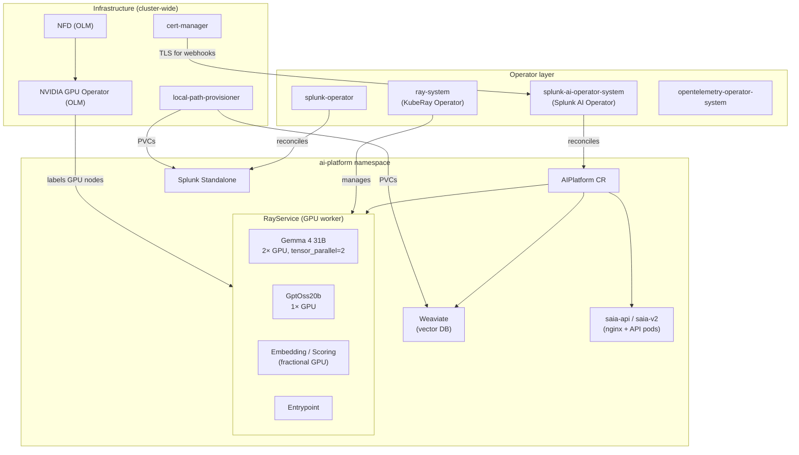
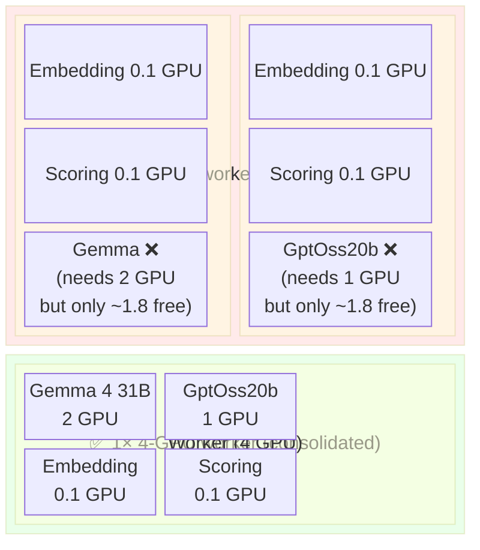
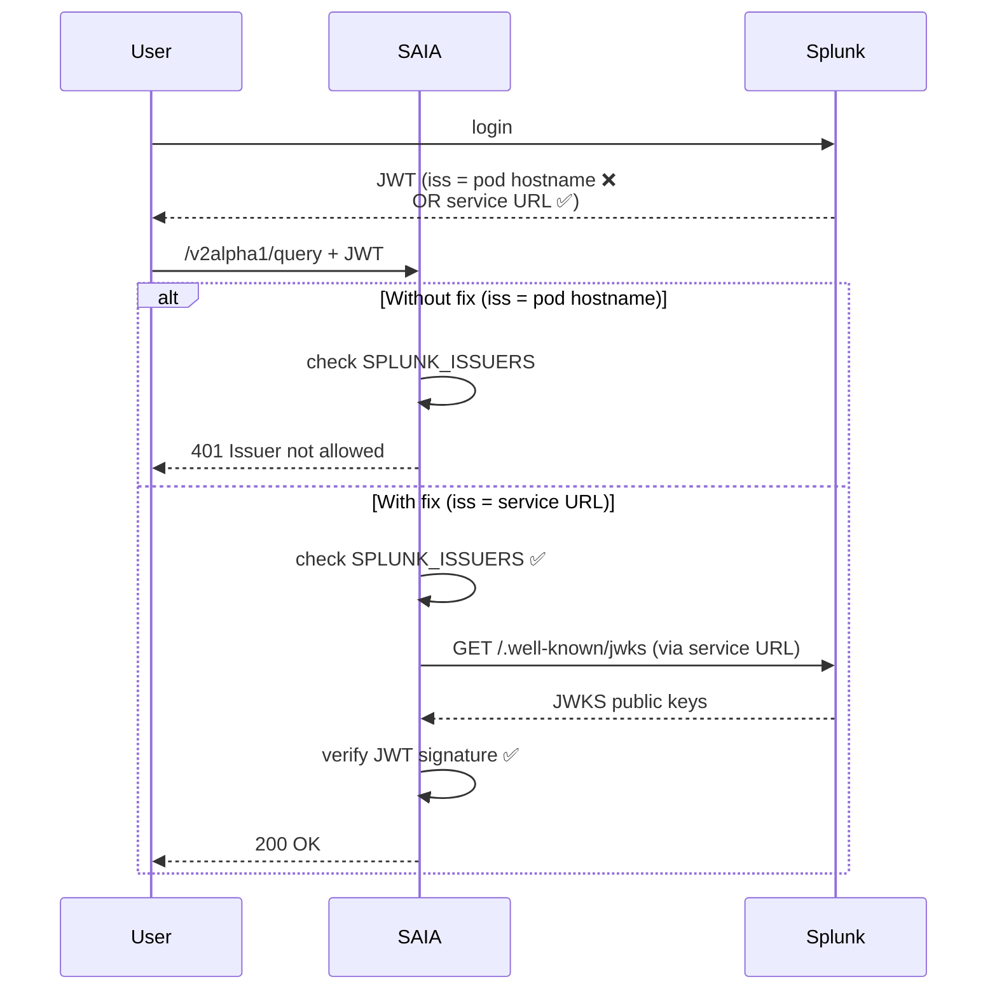
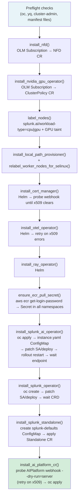

OpenShift Support for Splunk AI Platform 

 

## 1. Overview 

 

Self-contained shell script (`openshift_with_stack.sh`) that installs the AI Platform stack on an existing bare-metal OpenShift cluster. A `delete` subcommand fully reverses the installation. This script essentially migrates k0s_cluster_with_stack.sh script to OpenShift environment.  

 

**Target environment:** 

| Component | Spec | 

| Platform 		| OpenShift 4.x, bare-metal  

| GPU 		| RTX PRO 6000 Blackwell, 96 GB VRAM  

| Object storage 	| MinIO or AWS S3  

| Image registry 	| AWS ECR / openshift local registry 

 

## 2. Architecture 



--- 

 

## 3. Design Decisions 

 

### 3.1 Security Context Constraints (SCC) 

 

OpenShift restricts what containers can do by default — they cannot run as arbitrary UIDs, use privileged Linux capabilities, or mount host directories without explicit permission. Several containers in our stack need elevated access: the Splunk Operator container requires the `NET_BIND_SERVICE` capability (to bind to ports below 1024), and Splunk Standalone containers need write access to hostPath volumes. OpenShift enforces these restrictions through Security Context Constraints (SCCs), which define what security contexts pods' containers are permitted to use. 

 

There are two ways to grant SCC permissions — only one actually works: 

- `oc adm policy add-scc-to-group` ✅ — directly updates the SCC's allowed groups list; OCP honors this 

- `ClusterRoleBinding` to the SCC ClusterRole ❌ — documented but silently ignored by OCP's admission controller 

 

The script uses `add-scc-to-group` exclusively. Grants applied: 

 

| Namespace 	 		| SCC 			| Why | 

| `splunk-ai-operator-system` 	| `privileged` | Operator pod needs elevated capabilities | 

| `ai-platform` 			| `anyuid`, `privileged` | Ray workers, Weaviate, Splunk run as specific user IDs and need host access | 

| `splunk-operator` 		| `privileged` | Operator pod adds `NET_BIND_SERVICE` capability | 

| `local-path-storage` 		| `privileged` | Storage helper pod mounts and relabels host directories | 

 

### 3.2 SELinux Host Path Labeling 

 

When `local-path-provisioner` creates a PVC directory on a host node, SELinux inherits the wrong label from the parent directory. This prevents containers from writing to it. 

 

The correct label is `container_file_t:s0`: 

- `container_file_t` — marks the directory as writable by containers 

- `:s0` — the MCS sensitivity label with no category pair, which OpenShift accepts from any container (OpenShift assigns each pod a random category pair at runtime; using `:s0` avoids needing to match it) 

 

 

### 3.3 GPU Operator via OLM 

 

OpenShift manages cluster operators through OLM (Operator Lifecycle Manager). Installing NFD or the NVIDIA GPU Operator via Helm bypasses OLM and can conflict with other cluster-managed operators. 

 

Both are installed via OLM `Subscription` + `OperatorGroup` resources. One gotcha: the `ClusterPolicy` CR that configures the GPU Operator requires several fields (`operator`, `daemonsets`, `dcgmExporter`, `nodeStatusExporter`) to be explicitly present even if empty — omitting any of them causes a validation error. 

 

### 3.4 cert-manager TLS Clock Skew 

 

cert-manager sometimes issues TLS certificates with a `notBefore` timestamp set ~30–60 seconds in the future, due to clock skew between nodes. Any webhook call during that window fails with an x509 "certificate not yet valid" error, even though the server is up and listening. A simple TCP or HTTP health check isn't sufficient — it succeeds as soon as the port is open, before the certificate is actually valid. 

 

**Fix:** Before each webhook-dependent step, send a real Kubernetes API request (a temporary `Issuer` CR for cert-manager, or `--dry-run=server` for the AIPlatform webhook) and retry until it succeeds without x509 errors. 

 

**Important:** The AIPlatform webhook probe must run immediately before `oc apply`, not earlier in the install. The operator rotates its own TLS certificate during startup, which resets the clock-skew window — a probe that ran minutes earlier gives no guarantee. 

 

### 3.5 ECR Pull Secrets 

 

This section only applies when `ecr.enabled: true` in the config. Set it to `false` if images are pulled from a local registry or are already present on the nodes — the script skips all ECR steps in that case. 

 

When ECR is enabled: AWS ECR requires an auth token to pull images, and that token expires every 12 hours. The script creates an `ecr-registry-secret` in all relevant namespaces at install time. 

 

If using images from openshifts local registry then set ecr.enabled: false and specify images in cluster-config file as below: 

images: 

registry: "image-registry.openshift-image-registry.svc:5000/ai-platform" 

 

### 3.6 Ray GPU Resource Fragmentation 

 

**Problem:** When multiple Ray workers are provisioned, small embedding/scoring models (fractional GPU) scatter across all workers. This leaves no single worker with a contiguous GPU block large enough for Gemma (2 GPUs) or GptOss20b (1 GPU). 

 

For example, with two 2-GPU workers: 

- Small models scatter across both workers 

- Gemma needs 2 contiguous GPUs on one worker — if any small model landed there, Gemma is blocked 

 

**Fix: single worker with all GPUs.** Rather than splitting GPUs across multiple workers, provision one worker with all available GPUs. All models compete on the same node, and Ray's fractional scheduling ensures small models together consume far less than 1 GPU, leaving plenty of room for the LLMs. 



| Setup | Worker config | Works? | 

| 2 GPUs | 1× 2-GPU worker | ✅ GptOss20b (1 GPU) + small models | 

| 4 GPUs | 2× 2-GPU workers | ❌ Fragmentation — Gemma blocked | 

| 4 GPUs | 1× 4-GPU worker | ✅ Gemma (2 GPU) + GptOss20b (1 GPU) + small models | 

 

**Secondary problem:** The `ai-platform-models` framework auto-adds `gpu_count:ceil(num_gpus)` to each actor's resource request. For fractional models (`num_gpus < 1`) this generates `gpu_count:1`, which doesn't match a `gpu_count:2` or `gpu_count:4` worker's label — the actor never schedules. 

 

**Fix:** Add an explicit `resources` override in each model's RTX section in `applications.yaml` to pin to the correct worker tier: 

 

```yaml 

# For 4-GPU worker (when additional GPUs are added) 

RTX_PRO_6000_BLACKWELL: 

ray_actor_options: 

num_gpus: 0.031 

resources: 

"gpu_count:4": 0.001 

"accelerator_type:RTX_PRO_6000_BLACKWELL": 0.001 

``` 

 

The `0.001` values are placement tokens — negligible resource consumption, used purely as node-affinity pins. Update all model overrides in `applications.yaml` and the `instanceScale` in `saia.yaml` when changing the worker tier. 

 

### 3.7 Splunk JWT Issuer 

 

By default, Splunk sets `serverName = $HOSTNAME` (pod name, e.g. `splunk-splunk-standalone-standalone-0`). SAIA's `SPLUNK_ISSUERS` expects the service URL (`https://splunk-splunk-standalone-standalone-service:8089`). Mismatch causes `Issuer not allowed`; even if patched, SAIA can't construct a JWKS URL from a bare pod name. 



**Fix:** Mount a `splunk-defaults` ConfigMap into the Standalone CR to override `oauth2_settings.issuer_uri`: 

 

```yaml 

# splunk-defaults ConfigMap 

data: 

default.yml: | 

splunk: 

conf: 

- key: authentication 

value: 

directory: /opt/splunk/etc/system/local 

content: 

oauth2_settings: 

issuer_uri: https://splunk-splunk-standalone-standalone-service:8089 

``` 

 

```yaml 

# Standalone CR 

spec: 

volumes: 

- name: defaults 

configMap: 

name: splunk-defaults 

defaultsUrl: /mnt/defaults/default.yml 

``` 

 

--- 

 

## 4. Install Sequence 



**Delete** runs in reverse order. Each step cleans its own CRDs, RBAC, namespaces, and SCC grants. 

 

--- 

 

## 5. Files Changed 

 

| File | Change | 

| `tools/cluster_setup/openshift_with_stack.sh` 	| New — main install/delete script | 

| `tools/cluster_setup/openshift-cluster-config.yaml` 	| New — cluster-specific config (nodes, images, ECR) | 

| `config/configs/instance.yaml` 			| Added RTX PRO 6000 Blackwell tier definitions | 

| `config/configs/applications.yaml` 		| Added RTX overrides with `gpu_count:2` resources for all models; added Gemma 4 31B RTX section | 

| `config/configs/features/saia.yaml` 		| Added RTX instanceScale (0-gpu:1, 1-gpu:0, 2-gpu:1); Gemma431bIt enabled | 

 

 

## 6. Configuration Reference (`openshift-cluster-config.yaml`) 

 

| Field 				| Description | 

| `kubernetes.namespace` 		| AI Platform workload namespace | 

| `openshift.nodeLabelStrategy` 		| `manual` (list node names) or `auto` (detect by GPU label) | 

| `openshift.nodes.cpu[]` / `.gpu[]` 	| Node names for each role | 

| `images.operator.image` 		| Splunk AI Operator image (custom build for new GPU types) | 

| `aiPlatform.defaultAcceleratorType` 	| Must match a key in `instance.yaml` — e.g. `RTX_PRO_6000_BLACKWELL` | 

| `storage.objectStore.type` 		| `aws`, `s3compat`, `minio`, `seaweedfs` | 

| `ecr.enabled` / `ecr.account` / `ecr.region` | ECR pull secret config | 

 

## 7. Open Issues 

 

| Issue | Notes | 

| Gemma + GptOss20b concurrency | Requires 4 GPUs to run simultaneously. With 2 GPUs, only one LLM runs at a time. | 

| Air-gapped install | `oc debug node/` pulls from `registry.access.redhat.com` — needs pre-pulled image or MachineConfig alternative. | 

 

## 8. Testing 

 

Validated on: OCP 4.x, 3 control-plane + 2 CPU worker + 1 GPU worker, 2× RTX PRO 6000 Blackwell, MinIO object storage, AWS ECR. Operator image: `kiran/splunk/splunk-ai-operator:openshift-0.4`. 

 

End state verified: all prerequisite operators healthy, Ray workers running, all small models in `RUNNING` state on 2-GPU worker, GptOss20b serving, SAIA `/v2alpha1/query` accepting Splunk-issued JWT tokens. 

 

Not validated: Gemma + GptOss20b simultaneously (needs 3+ GPUs), `auto` node labeling, air-gapped install. 

 

 