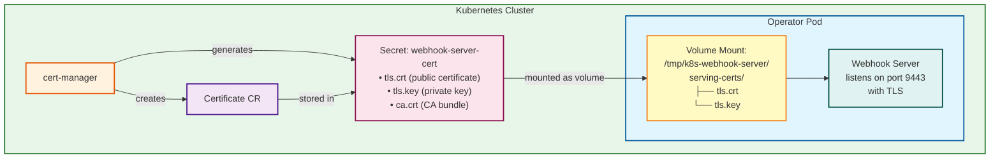

# Webhook Certificate Management

## Overview

The Splunk AI Operator uses **admission webhooks** for validating and defaulting AIPlatform and AIService resources. Webhooks require TLS certificates for secure communication between the Kubernetes API server and the operator.

## Certificate Management Strategy

### Production Deployment (Kubernetes Cluster)

**DO NOT bake certificates into the Docker image!** This is a security anti-pattern.

Instead, use **cert-manager** for dynamic certificate provisioning:

1. **cert-manager** generates unique certificates per deployment
2. Certificates are stored in Kubernetes Secrets
3. Certificates are mounted into the pod at runtime
4. Certificates can be rotated without rebuilding the image

### How It Works



### Configuration Files

The certificate management is configured through these files:

#### 1. Certificate Definition
**File:** `config/certmanager/certificate-webhook.yaml`

Defines the Certificate resource that cert-manager will provision:
```yaml
apiVersion: cert-manager.io/v1
kind: Certificate
metadata:
  name: serving-cert
  namespace: system
spec:
  dnsNames:
  - SERVICE_NAME.SERVICE_NAMESPACE.svc
  - SERVICE_NAME.SERVICE_NAMESPACE.svc.cluster.local
  issuerRef:
    kind: Issuer
    name: selfsigned-issuer
  secretName: webhook-server-cert
```

#### 2. Self-Signed Issuer
**File:** `config/certmanager/issuer.yaml`

Defines the CA issuer:
```yaml
apiVersion: cert-manager.io/v1
kind: Issuer
metadata:
  name: selfsigned-issuer
  namespace: system
spec:
  selfSigned: {}
```

#### 3. Deployment Volume Mount
**File:** `config/default/manager_webhook_patch.yaml`

Configures how certificates are mounted into the operator pod:
```yaml
# Add the volumeMount for the webhook certificates
- op: add
  path: /spec/template/spec/containers/0/volumeMounts/-
  value:
    mountPath: /tmp/k8s-webhook-server/serving-certs
    name: webhook-certs
    readOnly: true

# Add the volume configuration for the webhook certificates
- op: add
  path: /spec/template/spec/volumes/-
  value:
    name: webhook-certs
    secret:
      secretName: webhook-server-cert
```

#### 4. Kustomization Configuration
**File:** `config/default/kustomization.yaml`

Enables cert-manager integration:
- Includes `../certmanager` resource
- Configures certificate name/namespace substitution
- Adds CA injection annotations to webhook configurations

## Deployment Prerequisites

### 1. Install cert-manager

```bash
kubectl apply -f https://github.com/cert-manager/cert-manager/releases/download/v1.14.0/cert-manager.yaml

# Wait for cert-manager to be ready
kubectl wait --for=condition=Available --timeout=300s deployment/cert-manager -n cert-manager
kubectl wait --for=condition=Available --timeout=300s deployment/cert-manager-webhook -n cert-manager
kubectl wait --for=condition=Available --timeout=300s deployment/cert-manager-cainjector -n cert-manager
```

### 2. Deploy Operator

```bash
# Build and push image
make docker-build docker-push IMG=<your-registry>/splunk-ai-operator:latest

# Deploy to cluster
make deploy IMG=<your-registry>/splunk-ai-operator:latest
```

### 3. Verify Certificate

```bash
# Check certificate status
kubectl get certificate -n splunk-ai-operator-system

# Output should show:
# NAME           READY   SECRET                AGE
# serving-cert   True    webhook-server-cert   1m

# Verify secret exists
kubectl get secret webhook-server-cert -n splunk-ai-operator-system

# Check certificate details
kubectl describe certificate serving-cert -n splunk-ai-operator-system
```

## Local Development

For local development (running operator outside the cluster), use self-signed certificates:

### Option 1: Use the Helper Script

```bash
./scripts/generate-webhook-certs.sh
go run ./cmd/main.go --webhook-cert-path=/tmp/webhook-certs
```

### Option 2: Generate Certificates Manually

```bash
mkdir -p /tmp/webhook-certs

openssl req -x509 -newkey rsa:4096 -nodes \
  -keyout /tmp/webhook-certs/tls.key \
  -out /tmp/webhook-certs/tls.crt \
  -days 365 \
  -subj "/CN=webhook-service.splunk-ai-operator-system.svc" \
  -addext "subjectAltName=DNS:webhook-service.splunk-ai-operator-system.svc,DNS:webhook-service.splunk-ai-operator-system.svc.cluster.local"

go run ./cmd/main.go --webhook-cert-path=/tmp/webhook-certs
```

### Option 3: Disable Webhooks (Development Only)

```bash
# Not recommended for production
go run ./cmd/main.go --webhook-enabled=false
```

Or use the helper script:
```bash
./scripts/run-local.sh
```

## Security Considerations

### ✅ DO

- Use cert-manager for certificate provisioning in production
- Mount certificates from Kubernetes Secrets at runtime
- Use proper DNS names in certificate SANs
- Rotate certificates regularly (cert-manager handles this)
- Use unique certificates per deployment

### ❌ DO NOT

- Bake certificates into Docker images
- Commit private keys to version control
- Use the same certificate across deployments
- Use certificates without proper DNS SANs
- Disable webhooks in production

## Troubleshooting

### Certificate Not Ready

```bash
# Check certificate status
kubectl describe certificate serving-cert -n splunk-ai-operator-system

# Check cert-manager logs
kubectl logs -n cert-manager deployment/cert-manager
```

**Common issues:**
- cert-manager not installed
- cert-manager pods not ready
- Namespace doesn't exist

### Webhook Connection Refused

```bash
# Check if webhook server is listening
kubectl logs -n splunk-ai-operator-system deployment/splunk-ai-operator-controller-manager

# Check if certificates are mounted
kubectl exec -n splunk-ai-operator-system deployment/splunk-ai-operator-controller-manager -- ls -la /tmp/k8s-webhook-server/serving-certs/
```

**Common issues:**
- Certificates not mounted
- Wrong certificate path
- Webhook server not starting

### Certificate Expired

cert-manager automatically rotates certificates before expiry. If manual intervention is needed:

```bash
# Delete certificate to force regeneration
kubectl delete certificate serving-cert -n splunk-ai-operator-system

# Wait for cert-manager to recreate it
kubectl wait --for=condition=Ready certificate/serving-cert -n splunk-ai-operator-system --timeout=60s
```

## Additional Resources

- [cert-manager Documentation](https://cert-manager.io/docs/)
- [Kubernetes Admission Webhooks](https://kubernetes.io/docs/reference/access-authn-authz/extensible-admission-controllers/)
- [Kubebuilder Webhook Guide](https://book.kubebuilder.io/cronjob-tutorial/webhook-implementation.html)
- [LOCAL_DEVELOPMENT.md](local-development.md) - Local development setup guide
