# Splunk AI Platform — Deployment Guide

End-to-end customer experience guide for deploying the Splunk AI Platform on
k0s Kubernetes. Covers both standard (internet-connected) and air-gapped
(fully disconnected) deployments.

---

## Table of Contents

- [Which Path Is Right for You?](#which-path-is-right-for-you)
- [What Gets Deployed](#what-gets-deployed)
- [Standard Deployment (Internet-Connected)](#standard-deployment-internet-connected)
  - [What You Need Before Starting](#what-you-need-before-starting)
  - [Install Flow](#install-flow)
  - [Step-by-Step](#step-by-step-standard)
- [Air-Gapped Deployment (No Internet on Cluster)](#air-gapped-deployment-no-internet-on-cluster)
  - [Air-Gap Concepts](#air-gap-concepts)
  - [Phase 1 — Prepare the Bundle (Connected Machine)](#phase-1--prepare-the-bundle-connected-machine)
  - [Phase 2 — Mirror Container Images](#phase-2--mirror-container-images)
  - [Phase 3 — Stage Model Weights](#phase-3--stage-model-weights)
  - [Phase 4 — Transfer to Air-Gapped Environment](#phase-4--transfer-to-air-gapped-environment)
  - [Phase 5 — Install from the Bundle](#phase-5--install-from-the-bundle)
  - [GPU Nodes in Air-Gapped Environments](#gpu-nodes-in-air-gapped-environments)
- [Post-Install Verification](#post-install-verification)
- [Install the Splunk AI Assistant App](#install-the-splunk-ai-assistant-app)
- [Common Operations](#common-operations)
- [Troubleshooting](#troubleshooting)

---

## Which Path Is Right for You?

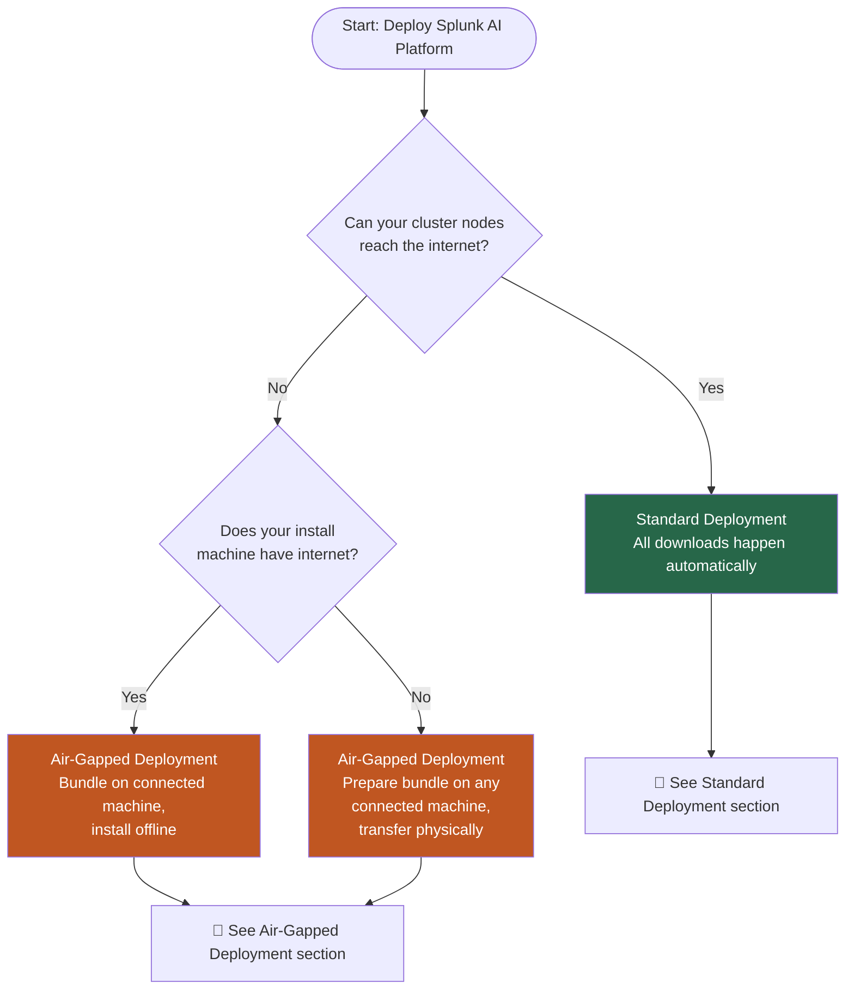

| Scenario | Install machine has internet | Cluster nodes have internet | Use |
|---|---|---|---|
| Typical cloud / on-prem | ✅ | ✅ | [Standard deployment](#standard-deployment-internet-connected) |
| Cluster isolated (with or without internet on install machine) | ✅ / ❌ | ❌ | [Air-gapped deployment](#air-gapped-deployment-no-internet-on-cluster) — run `prepare_airgap_bundle.sh` on any connected machine, then transfer the bundle |

---

## What Gets Deployed

The installer deploys the complete Splunk AI Platform stack onto your k0s cluster.

> **SAIA** = Splunk AI Assistant — the AI chat and SPL-generation application that runs on top of the platform.

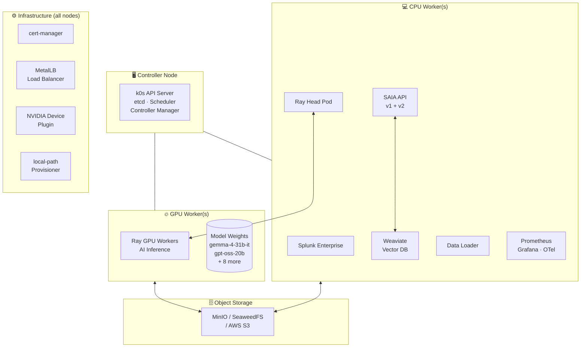

### Operator Stack

| Operator | Version | Purpose |
|---|---|---|
| Splunk AI Operator | your build | Manages `AIPlatform` CR lifecycle |
| Splunk Operator | 3.0.0 | Manages Splunk Enterprise |
| KubeRay | 1.2.2 | Manages Ray clusters for AI inference |
| cert-manager | v1.21.1 | TLS certificate management |
| OTel Operator | latest | Observability |
| NVIDIA Device Plugin | v0.17.3 | Exposes GPUs to Kubernetes |

### Version Compatibility

| Component | Supported version | Notes |
|---|---|---|
| k0s (Kubernetes) | v1.31+ (validated on v1.36.1, containerd 2.x) | Installed automatically by the installer |
| RHEL | 9 | Only supported OS for cluster nodes |
| NVIDIA driver | `nvidia-driver:latest-dkms` (DKMS module) | Installed via NVIDIA repo on GPU nodes; the older `cuda-drivers` meta-package is no longer published |
| NVIDIA Container Toolkit | latest stable | Installed alongside the driver |
| GPU hardware | NVIDIA L40S or H100 | Set `defaultAcceleratorType: L40S` or `defaultAcceleratorType: H100` |
| Splunk Enterprise | matched to your build | Provided via your registry — do not mix versions |

> **Licensing:** Splunk Enterprise and the Splunk AI Operator require valid Splunk licenses. Container images are access-controlled through your private registry. Contact your Splunk account team to confirm entitlements before deployment.

---

## Standard Deployment (Internet-Connected)

### What You Need Before Starting

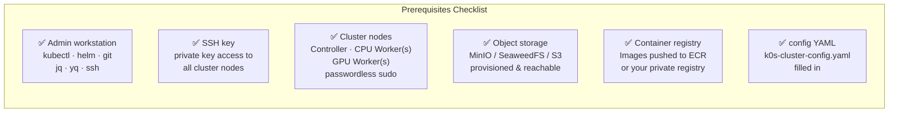

**Node size requirements:**

| Node Type | Min CPU | Min RAM | Min Disk | Count |
|---|---|---|---|---|
| Controller | 4 cores | 8 GB | 100 GB | 1 (or 3 for HA) |
| CPU Worker | 8 cores | 32 GB | 200 GB | 1+ |
| GPU Worker | 48 vCPUs | 384 GiB | 500 GB | **2 nodes required** · 4 × NVIDIA L40S per node (48 GB GDDR6 each) · **8 × L40S total, 384 GB total GPU memory** · 100 Gbps · equivalent to g6e.12xlarge |

> **Minimum viable topology:** The platform requires at least 1 controller + 1 CPU worker + 2 GPU workers. The controller and CPU worker roles can coexist on a single machine for lab/testing use, but this is not supported for production. A single GPU worker is not sufficient — the AI inference stack distributes work across both nodes.

**Ports to open between nodes:** 22 (SSH), 6443 (k8s API), 2380 (etcd), 10250 (kubelet), 8132 (konnectivity), 4789/UDP (VXLAN/Calico), 179 (Calico BGP).

**Object storage sizing:**

| Data | Minimum size | Notes |
|---|---|---|
| Model weights (`model_artifacts/`) | 250 GB | >120 GB for 10 models + headroom for re-staging |
| Runtime data (conversations, queues, config) | 100 GB | Grows with usage; monitor and expand as needed |
| **Total recommended bucket** | **500 GB+** | Plan for growth if running multiple tenants |

### Install Flow

**Estimated time:**

| Phase | Typical duration | Notes |
|---|---|---|
| Preflight | 1–2 min | Config validation and SSH checks |
| Model staging | 2–6 hours | Depends on internet speed — >120 GB download. Skip with `modelStaging.enabled: false` if already staged. |
| Cluster bootstrap | 10–20 min | k0s install + NVIDIA driver install on GPU nodes |
| Platform stack | 15–30 min | Helm chart deploys + operator reconciliation |
| **Total (first install with staging)** | **~3–7 hours** | Mostly model download time |
| **Total (staging already done)** | **~30–60 min** | |

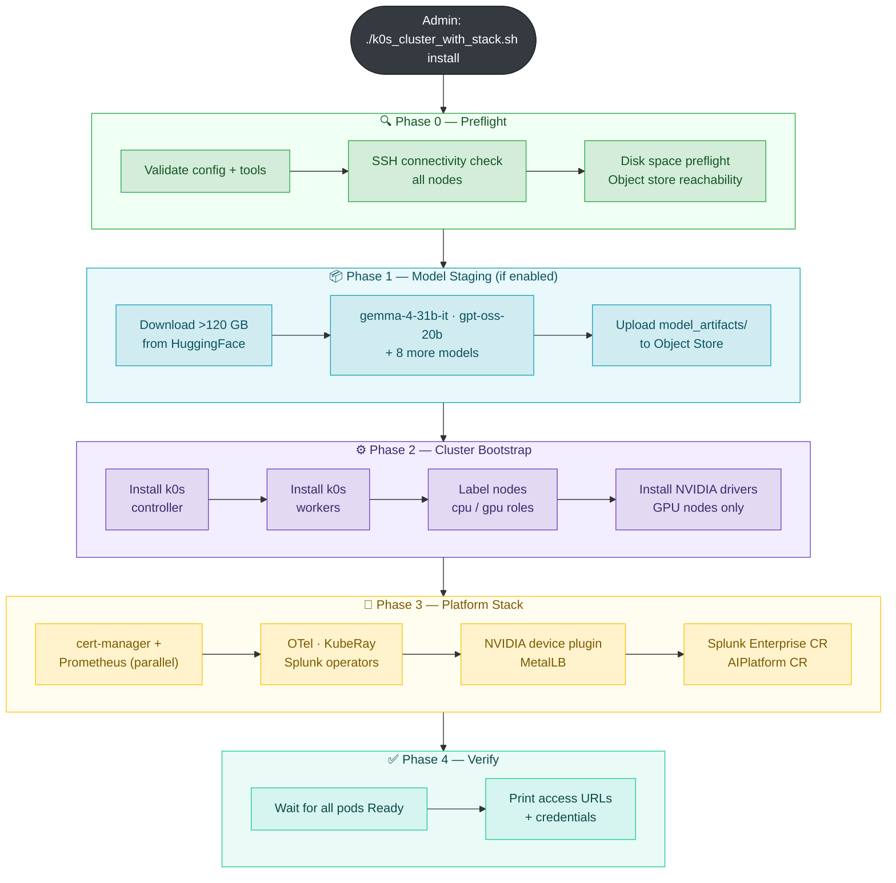

### Step-by-Step (Standard)

**1. Configure your cluster**

```bash
cd tools/cluster_setup
cp k0s-cluster-config.yaml my-cluster.yaml
# Open my-cluster.yaml and fill in ALL fields marked CHANGE THIS
```

The config sections to fill in:

| Section | What to set |
|---|---|
| `cluster` | `name`, `sshKeyPath`, `sshUser` |
| `nodes.existingIPs` | IP addresses of your controller and worker nodes |
| `storage.objectStore` | Your MinIO / SeaweedFS / S3 endpoint + credentials |
| `images.registry` | Your registry hostname, e.g. `123456789.dkr.ecr.us-east-2.amazonaws.com` or `registry.internal:5000` |
| `images.registryInsecure` | `true` only for plain-HTTP (no-TLS) registries; leave `false` (default) for ECR, Harbor, or any HTTPS registry |
| `images` (tags) | All image tags pointing at your registry |
| `aiPlatform` | `defaultAcceleratorType` — `L40S` or `H100` |
| `metallb.pool.addresses` | A free IP range on your LAN (for LoadBalancer VIP) |

> For full field descriptions, secure vs insecure registry guidance, and examples — see [Configuration Reference in K0S_README.md](K0S_README.md#images-section).

**2. Validate your config before installing**

```bash
CONFIG_FILE=./my-cluster.yaml ./k0s_cluster_with_stack.sh validate
```

This runs a read-only config check and prints a ✔/✖ checklist. Fix any ✖ items before proceeding.

**3. Run the installer**

```bash
CONFIG_FILE=./my-cluster.yaml ./k0s_cluster_with_stack.sh install
```

The installer shows an install plan and asks for confirmation before making any changes.

For internal Splunk, the installer also refuses to overwrite a fixed-name TLS or workload object
unless it has both installer labels and the exact
`ai.splunk.com/owner-id=<cluster.name>/<splunk.standaloneName>` annotation. This protects shared
namespaces and separate installer instances. The first transaction preflight runs after
cert-manager Phase 1 but before Phase 2 installs or can reconcile the Splunk Operator. It checks
the configured Standalone when its CRD exists; an absent CRD safely means no Standalone object can
exist yet, while a discovery failure is fatal. The complete fixed-name footprint is checked again
after Phase 2 and before AI-namespace image-pull Secret reconciliation or any internal Splunk
certificate/workload mutation. On an upgrade from an older unlabelled installation, inspect the exact object named by
the error and use the printed `kubectl label` **and**
`kubectl annotate` commands only after proving it belongs to this installation. Foreign objects
must be resolved through their owner or isolated in another namespace; they are never adopted
automatically.

**4. Monitor progress**

The installer prints timestamped progress to the terminal and to a log file:

```bash
# In another terminal — follow the live log
tail -f tools/cluster_setup/logs/k0s-install-*.log
```

**5. Verify the result**

```bash
export KUBECONFIG=~/.kube/k0s-<your-cluster-name>
kubectl get nodes                          # all nodes Ready
kubectl get pods -A                        # all pods Running
kubectl get aiplatform -n ai-platform      # AIPlatform Ready
```

---

## Air-Gapped Deployment (No Internet on Cluster)

### Air-Gap Concepts

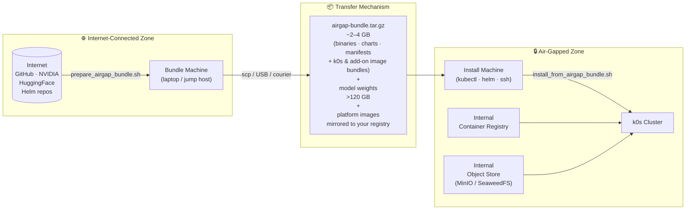

**Key principle:** The main installer has no hardcoded download URLs — every internet address is overridable via environment variables. `install_from_airgap_bundle.sh` sets all of them automatically from the bundle.

### Phase 1 — Prepare the Bundle (Connected Machine)

Run this on any machine with internet access. You do not need the cluster nodes reachable from this machine.

```bash
cd tools/cluster_setup

# Build the bundle (RHEL 9 GPU nodes — only supported target)
./prepare_airgap_bundle.sh --output-dir /mnt/transfer

# Pin a specific k0s version
./prepare_airgap_bundle.sh --output-dir /mnt/transfer --k0s-version v1.31.2+k0s.0
```

**What gets downloaded into the bundle:**

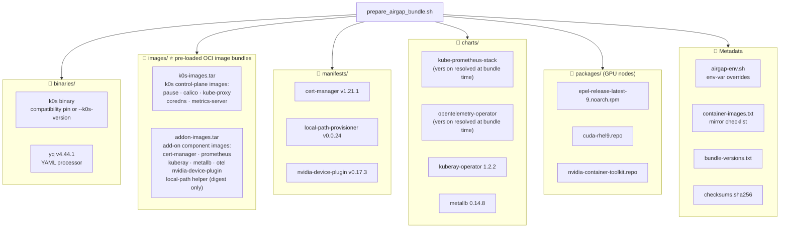

> **⭐ The `images/` bundles are the part customers most often miss.** A single
> `prepare_airgap_bundle.sh` run produces **both** image tarballs automatically —
> you do **not** run a separate command for them. They are essential: without
> them, an air-gapped cluster's own infrastructure pods (Calico, CoreDNS,
> cert-manager, the NVIDIA device plugin, …) try to pull from quay.io / ghcr.io /
> registry.k8s.io over the blocked link and the cluster never becomes Ready.
> See [Why two image bundles?](#why-two-image-bundles) below.

Output: a single timestamped `.tar.gz`:

```
/mnt/transfer/airgap-bundle-20260612-103000.tar.gz   (~2–4 GB)
```

> **Bundle size:** the image tarballs are the bulk of the bundle — expect a few
> GB (the binaries, charts, and manifests alone are ~500 MB; the k0s and add-on
> images add the rest). Size scales with the resolved image set.

#### Why two image bundles?

The bundle carries container images in two separate OCI tarballs under `images/`
because two *different* sets of images would otherwise be pulled from the
internet at cluster-bring-up time — and neither set is covered by the
`images.registry` rewrite you configure for the platform's own images:

| Tarball | Built by (in `prepare_airgap_bundle.sh`) | Covers | Why it can't come from your registry |
|---|---|---|---|
| `k0s-images.tar` | `k0s airgap list-images --all` → `k0s airgap bundle-artifacts` | k0s control-plane images: `pause`, Calico, kube-proxy, CoreDNS, metrics-server | k0s manages these itself (from quay.io/k0sproject) — they never pass through the installer's config |
| `addon-images.tar` | renders every installed Helm chart profile with `--skip-tests`, reads required static manifests, validates every runtime reference, then runs `bundle-artifacts` | add-on components: cert-manager, kube-prometheus-stack, kuberay, MetalLB, OTel, **NVIDIA device plugin**, the digest-only local-path BusyBox helper | their image refs live *inside* the charts/manifests (quay.io, ghcr.io, registry.k8s.io, nvcr.io, docker.io) — the `images.registry` rewrite only touches the platform CR images, not these |

The builder fails closed if a required chart/manifest is missing, Helm cannot render with the
install-equivalent image settings, no image is found, or any reference is unrendered, untagged, or
uses `:latest`. Helm test hooks are excluded because `helm upgrade --install` does not deploy them.
The embedded untagged local-path helper is rewritten to the digest-only
`docker.io/library/busybox@sha256:...` reference recorded as
`local_path_helper_image` in `bundle-versions.txt`.

**How they get used (fully automatic):** `install_from_airgap_bundle.sh` detects
`images/*.tar`. For a new node, the installer places every archive in
`/var/lib/k0s/images/` before k0s starts. When a running k0s cluster is reused, it maps every live
Kubernetes `Node` to a configured SSH endpoint using the Node name/addresses and the endpoint's
hostname, FQDN, and IPs. Configured controller-only endpoints have no `Node` and are skipped; any
actual `Node` without a mapping aborts installation.

On the installer host, the installer derives exact image-reference/SHA-256 pairs from every local
OCI archive's `index.json`. On each mapped node, verification requires the same name and digest in
`k0s ctr images list` with `io.cri-containerd.pinned=pinned`; a matching name alone is
insufficient. Changed archives are copied through a separate staging directory and moved
atomically into `/var/lib/k0s/images/`. If the archive hash already matches but a required pinned digest is absent
or stale, the current archive is touched to retrigger the running k0s importer without a network
retransfer. Mapping, copy, checksum, import, and digest-verification failures stop installation.
New-node startup is gated by the normal node/workload readiness checks, and workers added later
with `join-workers` receive the archives before their first start.

> **This is distinct from [Phase 2 — Mirror Container Images](#phase-2--mirror-container-images).**
> The `images/` bundles cover **infrastructure** images (k0s + add-ons) and are
> built for you. Phase 2 covers the **Splunk AI Platform application** images
> (Splunk Enterprise, SAIA, Ray, Weaviate, the operator …), which you mirror to
> your own registry and point `images.registry` at. Both are required.

### Phase 2 — Mirror Container Images

Container images are **not** in the bundle (they would add many GB). Mirror them separately to your internal registry.

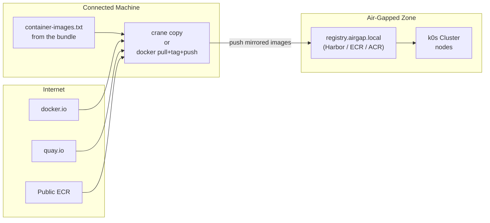

```bash
INTERNAL_REGISTRY="registry.airgap.local"

while IFS= read -r img; do
  [[ "$img" =~ ^# ]] && continue
  [[ -z "$img" ]] && continue
  dest="${INTERNAL_REGISTRY}/${img##*/}"
  echo "Copying $img → $dest"
  crane copy "$img" "$dest"
done < container-images.txt
```

After mirroring, update your config:

```yaml
images:
  registry: "registry.airgap.local"
  operator:
    image: "registry.airgap.local/splunk-ai-operator:latest"
  # ... all other images pointing at your internal registry

imagePullSecrets:
  autoCreateECR: false   # disable automatic ECR token refresh
```

### Phase 3 — Stage Model Weights

Model weights (>120 GB) must be staged to your object store. Do this on the connected machine.

**System requirements for the staging machine**

| Resource | Minimum | Notes |
|---|---|---|
| Disk (free) | 250 GB | >120 GB for 10 models + buffer for download staging and upload temp files |
| RAM | 16 GB | Scripts process and stream large files; less RAM causes swapping and slow uploads |
| Internet | Stable broadband | Downloads >120 GB from HuggingFace; safe to re-run on a flaky connection — already-staged models are skipped automatically |
| CPU | 4 cores | Recommended for parallel upload scripts |

> **Same machine as the installer?** The installer machine already runs `kubectl`, `helm`, and `ssh` — it can also run model staging. Just ensure the **disk requirement** is met. `/tmp` or the working directory must have 250 GB free.

```bash
cd tools/artifacts_download_upload_scripts

# Download from HuggingFace — pass GPU type or select interactively when prompted
./download_from_huggingface.sh --accelerator l40s   # or --accelerator h100

# Upload to your object store (endpoint must be reachable from this machine)
./upload_to_minio.sh    # or upload_to_s3.sh, upload_to_seaweedfs.sh
```

Then disable auto-staging in your cluster config (models are already there):

```yaml
storage:
  modelStaging:
    enabled: false
```

### Phase 4 — Transfer to Air-Gapped Environment

```bash
# Copy bundle
scp /mnt/transfer/airgap-bundle-<timestamp>.tar.gz \
    admin@install-machine:/opt/splunk-ai/

# Copy installer scripts (if not already on the machine)
scp tools/cluster_setup/k0s_cluster_with_stack.sh \
    tools/cluster_setup/install_from_airgap_bundle.sh \
    tools/cluster_setup/k0s-cluster-config.yaml \
    admin@install-machine:/opt/splunk-ai/

# Copy your edited cluster config
scp my-cluster-config.yaml admin@install-machine:/opt/splunk-ai/
```

### Phase 5 — Install from the Bundle

**5a. Add `cluster.airgap: true` to your config**

```yaml
cluster:
  name: my-cluster
  airgap: true        # skips internet connectivity checks immediately
  sshKeyPath: ~/.ssh/id_rsa
  sshUser: ec2-user
```

**5b. Run the installer**

```bash
cd /opt/splunk-ai
chmod +x install_from_airgap_bundle.sh k0s_cluster_with_stack.sh

./install_from_airgap_bundle.sh \
  --bundle /opt/splunk-ai/airgap-bundle-<timestamp>.tar.gz \
  --config /opt/splunk-ai/my-cluster-config.yaml
```

**What `install_from_airgap_bundle.sh` does automatically:**

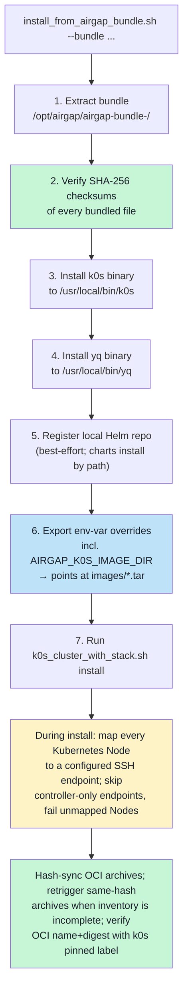

The install plan shown before any changes are made will display:

```
Air-gap mode    : true
k0s install URL : file:///opt/airgap/.../binaries/k0s
Helm charts     : local (file:///opt/airgap/.../charts/)
Image bundles   : k0s-images.tar, addon-images.tar  → staged to /var/lib/k0s/images/
...
```

During a new-node install, watch for staging messages. A reused running k0s cluster additionally
prints the verification result:

```
Staging image bundle k0s-images.tar on <node-ip> (/var/lib/k0s/images/)...
Staging image bundle addon-images.tar on <node-ip> (/var/lib/k0s/images/)...
Verified <count> pinned bundle image digests on <node-ip>
```

On a rerun where an archive has not changed and the pinned digest inventory is complete, the
installer logs `Image bundle <name> is already current on <node-ip>` instead of transferring it.
If inventory is missing or stale, it logs
`Retriggered import of current image bundle <name> on <node-ip>` after touching the existing
archive; no network retransmission is needed. The
installer-host bundled `yq` also builds and validates `/etc/k0s/k0s.yaml`; cluster nodes do not
need Python or PyYAML.

> If you instead see `No pre-loaded image bundles in air-gap bundle (images/*.tar)`,
> your bundle was built before this feature — rebuild it with the current
> `prepare_airgap_bundle.sh`. Without the bundles, infra pods will sit in
> `ImagePullBackOff` and nodes will stay `NotReady`.

Confirm to proceed.

### GPU Nodes in Air-Gapped Environments

GPU nodes require OS packages (EPEL, DKMS, CUDA, nvidia-container-toolkit) that normally download from the internet. In air-gap mode the installer detects missing `nvidia-smi` and fails clearly rather than timing out.

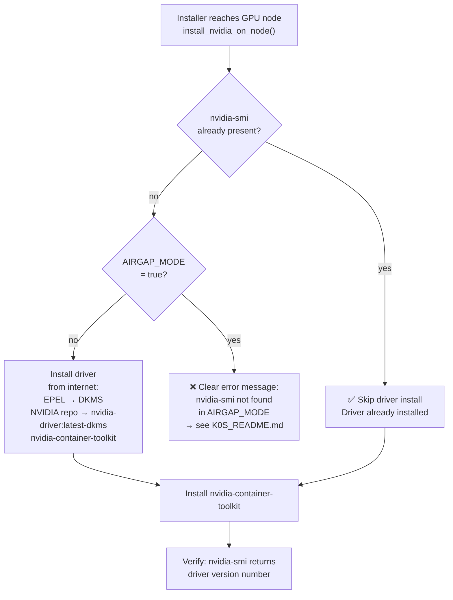

**Three strategies for GPU node packages in air-gap:**

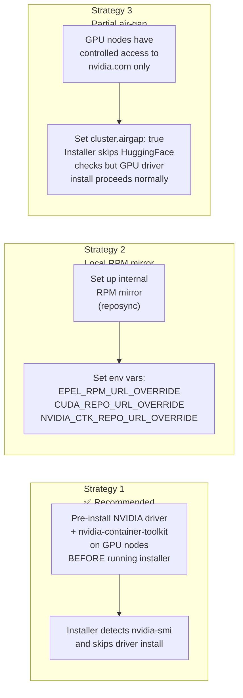

**Pre-installing the driver offline (Strategy 1):**

A fully air-gapped GPU node can't reach NVIDIA's RPM repos. The bundle's
`cuda-rhel9.repo` only points `dnf` at NVIDIA's servers, so on a disconnected
node you supply the packages yourself: build a self-contained RPM **closure** on
a connected RHEL 9 host, copy it to the node, and install from it as a local
repo. Use the DKMS driver flavor `nvidia-driver:latest-dkms`
(`kmod-nvidia-latest-dkms`) — the older `cuda-drivers` meta-package is no longer
published.

> **Driver vs. GPU model:** the driver RPMs are **not** GPU-model-specific — the
> same `kmod-nvidia-latest-dkms` covers T4, A10G, **L40S**, A100, H100. Only
> `kernel-devel` / `kernel-headers` are node-specific (pinned to the node's
> `uname -r`).

The recipe is three steps:

1. **Build the closure** on a connected RHEL 9 host — enable
   `nvidia-driver:latest-dkms`, then `dnf download --resolve --alldeps` the
   driver, container toolkit, and DKMS build chain, pinned to the *GPU node's*
   kernel release and RHEL minor (not the build host's).
2. **Fix three gotchas** before publishing the repo: delete the too-new `glibc`
   RPMs `--alldeps` drags in and re-pull them at the node's version (you can't
   upgrade a core lib offline); add `kernel-devel-matched-<KREL>` (a `dkms`
   rich-dep); run `createrepo_c` to build the repo index.
3. **Install on the node** from the local repo with
   `dnf install --refresh --disablerepo='*' --repofrompath=...` (named packages,
   not `*.rpm`), then verify with `dkms status`, `nvidia-smi`, and `nvidia-ctk
   --version`.

> **Full copy-paste recipe** — the exact commands for all three steps, including
> the kernel/glibc pinning and the `--repofrompath` install line, are in
> [K0S_README.md — GPU Nodes in Air-Gapped Environments](K0S_README.md#gpu-nodes-in-air-gapped-environments).
> Don't reboot an air-gapped GPU node into a different kernel afterward — the
> DKMS kmod is built only against the running one.

After the driver is in place on every GPU node, run
`install_from_airgap_bundle.sh` normally. The installer detects `nvidia-smi`
(skips driver install) and `nvidia-ctk` (skips Container Toolkit install), then
configures the containerd runtime, generates the CDI spec, and applies the
device-plugin DaemonSet — all offline.

**What the installer handles for you (k0s ≥ 1.33 / containerd 2.x):**

- **containerd 2.x runtime config.** `nvidia-ctk runtime configure` still emits
  the legacy `io.containerd.grpc.v1.cri` plugin key, which containerd 2.x
  rejects (crash-looping the worker). The installer rewrites the drop-in to the
  new `io.containerd.cri.v1.runtime` key automatically when the node's k0s base
  config uses it — no manual edit needed.
- **device-plugin image.** The bundle includes
  `nvcr.io/nvidia/k8s-device-plugin` in `addon-images.tar`, staged to
  `/var/lib/k0s/images/` on every worker, so the DaemonSet starts without
  pulling from `nvcr.io`. (If you see the device-plugin in `ImagePullBackOff`,
  you are on a bundle built before this fix — rebuild with the current
  `prepare_airgap_bundle.sh`.)
- **worker image staging on rejoin.** Workers joined into an existing cluster
  also receive the image tarballs, so a GPU node added later still comes up
  Ready offline.

> **Environment variable reference and advanced options** — see [K0S_README.md — Air-Gapped Deployment](K0S_README.md#air-gapped-deployment).

---

## Post-Install Verification

**Component namespaces — quick reference:**

| Namespace | Components |
|---|---|
| `ai-platform` | AIPlatform CR, SAIA API v1/v2, Ray Head/Workers, Weaviate, Splunk Enterprise, Data Loader, Nginx |
| `splunk-ai-operator-system` | Splunk AI Operator controller |
| `splunk-operator` | Splunk Operator controller |
| `ray-system` | KubeRay Operator |
| `cert-manager` | cert-manager controller, webhook, cainjector |
| `kube-prometheus-stack` | Prometheus, Grafana, Alertmanager |
| `opentelemetry-operator-system` | OTel Operator |
| `kube-system` | NVIDIA device plugin DaemonSet, Calico, local-path-provisioner |
| `metallb-system` | MetalLB controller and speakers (if LoadBalancer enabled) |
| `local-path-storage` | local-path-provisioner |

```bash
# Set kubeconfig
export KUBECONFIG=~/.kube/k0s-<cluster-name>

# All nodes must be Ready
kubectl get nodes -o wide

# All pods must be Running or Completed
kubectl get pods -A --sort-by=.metadata.namespace

# AIPlatform CR must be Ready
kubectl get aiplatform -n ai-platform -o wide

# SAIA service must have an EXTERNAL-IP (if using LoadBalancer)
kubectl get svc -n ai-platform -l app.kubernetes.io/component=saia

# GPU nodes must show available GPUs
kubectl get nodes -l splunk.ai/workload-type=gpu -o yaml | grep nvidia.com/gpu
```

**Expected state after a successful install:**

| Resource | Expected Status |
|---|---|
| All nodes | `Ready` |
| `cert-manager` pods | `Running` |
| `kube-prometheus-stack` pods | `Running` |
| `splunk-operator` pods | `Running` |
| `kuberay-operator` pods | `Running` |
| `splunk-standalone` | `Ready` |
| `aiplatform/<name>` | `Ready` |
| SAIA service | `EXTERNAL-IP` assigned |
| GPU nodes | `nvidia.com/gpu: N` in allocatable |

**Sample output — healthy cluster:**

```
# kubectl get nodes
NAME          STATUS   ROLES    AGE   VERSION
controller    Ready    master   12m   v1.31.2+k0s
cpu-worker-1  Ready    <none>   10m   v1.31.2+k0s
gpu-worker-1  Ready    <none>   10m   v1.31.2+k0s
gpu-worker-2  Ready    <none>   10m   v1.31.2+k0s

# kubectl get aiplatform -n ai-platform
NAME                  STATUS   AGE
my-cluster-ai-platform  Ready    8m
```

If any node shows `NotReady` or the AIPlatform CR shows `Pending` for more than 10 minutes, check the session log and see [Troubleshooting](#troubleshooting).

---

## Install the Splunk AI Assistant App

After the cluster is healthy, install the **Splunk AI Assistant** app
(`Splunk_AI_Assistant_Cloud.tgz`) on the Splunk Enterprise instance, then
onboard it to the AI tier.

> **Obtaining the app:** `Splunk_AI_Assistant_Cloud.tgz` is provided by your Splunk account team. Contact your Splunk representative if you do not have it.

### 1. Find your Splunk Web URL

```bash
# Retrieve the admin password
kubectl get secret splunk-standalone-secret -n ai-platform \
  -o jsonpath='{.data.password}' | base64 --decode && echo

# NodePort (default) — open on any worker node IP
kubectl get svc -n ai-platform -l app.kubernetes.io/name=splunk
# → http://<node-ip>:<nodePort>
```

### 2. Install the app

1. Log in to Splunk Web (`http://<node-ip>:<nodePort>`)
2. **Apps → Manage Apps → Install app from file**
3. Select `Splunk_AI_Assistant_Cloud.tgz`, check **Upgrade app** if updating, click **Upload**
4. Restart Splunk if prompted

### 3. Onboard to the AI tier

The app needs the SAIA API URL (`http://<node-ip>:<nodePort>`) to route prompts to the AI backend.

```bash
# Find the SAIA NodePort
kubectl get svc -n ai-platform -l app.kubernetes.io/component=saia
# PORT(S) column shows  8080:<nodePort>/TCP  — use that nodePort
```

In Splunk Web: **Splunk AI Assistant → Configuration** → enter `http://<worker-node-ip>:<nodePort>` as the AI Tier Endpoint and save.

> **Full configuration options** (scripted setup via `splunkaiassistant.conf`, air-gapped install, verification, and troubleshooting) — see [K0S_README.md — Splunk AI Assistant App](K0S_README.md#splunk-ai-assistant-app).

### 4. Verify

```bash
kubectl get standalone splunk-standalone -n ai-platform -o json \
  | jq '.status.appContext.appSrcDeployStatus'
# deployStatus: 3 = installed
```

Open the Splunk AI Assistant app and send a test prompt to confirm end-to-end connectivity.

---

## Common Operations

### Re-run after a partial failure

The installer is safe to re-run for most steps — Helm releases are upgraded if they already exist, and k0s join is skipped for nodes that are already Ready.

**Steps that are NOT idempotent:**
- **`clean-all`** — destructive; wipes all k0s state from every node with no recovery

Model staging is now **resumable** — re-runs skip already-staged models automatically. No flags needed.

If install fails partway, re-run directly:

```bash
CONFIG_FILE=./my-cluster.yaml ./k0s_cluster_with_stack.sh install
```

The safety gate prevents wiping a cluster with Ready nodes. If you need to start completely clean:

```bash
CONFIG_FILE=./my-cluster.yaml ./k0s_cluster_with_stack.sh clean-all
CONFIG_FILE=./my-cluster.yaml ./k0s_cluster_with_stack.sh install
```

### Add worker nodes

```bash
CONFIG_FILE=./my-cluster.yaml ./k0s_cluster_with_stack.sh join-workers
```

### Re-stage models only

```bash
CONFIG_FILE=./my-cluster.yaml ./k0s_cluster_with_stack.sh stage-artifacts
```

The command is resumable — it checks which models are already staged in the object store and only downloads/uploads what is missing. The GPU type is read from `aiPlatform.defaultAcceleratorType` in your config (`L40S` or `H100`). See [K0S_README.md](K0S_README.md) for details on the pre-check, per-model logging, and direct script usage.

### Upgrade the platform

Update your config YAML with new image tags, then re-run install. The installer upgrades existing Helm releases in place:

```bash
# 1. Update image tags in your config
vi my-cluster.yaml   # bump operator, ray, saia, splunk image versions

# 2. Run install — Helm upgrades existing releases, does not wipe the cluster
CONFIG_FILE=./my-cluster.yaml ./k0s_cluster_with_stack.sh install
```

> The safety gate prevents `install` from wiping a cluster with Ready nodes — it upgrades the stack only. If you also need to upgrade k0s itself, run `clean-all` + `install` (destructive — back up etcd first).

**Air-gap upgrade:**

```bash
# Build a new bundle on a connected machine
./prepare_airgap_bundle.sh --output-dir /mnt/transfer

# Then on the install machine
./install_from_airgap_bundle.sh \
  --bundle /opt/airgap-bundle-<new-timestamp>.tar.gz \
  --config my-cluster-config.yaml \
  --subcommand upgrade
```

When the existing k0s cluster is reused, this command synchronizes changed OCI archives onto all
live Kubernetes `Node` objects that map to configured SSH endpoints and verifies their exact
OCI-index name/digest records plus the k0s pinned label before upgrading the stack. Controller-only
endpoints are skipped; an unmapped actual `Node` is fatal. It does not restart k0s. A same-hash
archive with complete inventory is skipped, while incomplete inventory retriggers import by
touching the archive without retransferring it.

### Collect a support bundle

```bash
CONFIG_FILE=./my-cluster.yaml ./k0s_cluster_with_stack.sh diagnose
ls tools/cluster_setup/logs/k0s-diagnose-*.tar.gz
```

The tar.gz contains: pod logs from all namespaces, Kubernetes events, node descriptions, AIPlatform CR status, and the install session log — with secrets and credentials redacted. **Attach this file when opening a Splunk support case.**

---

## Troubleshooting

### Diagnose first

**Step 1 — validate config** (catches ~40% of issues before touching any node):

```bash
CONFIG_FILE=./my-cluster.yaml ./k0s_cluster_with_stack.sh validate
```

**Step 2 — check the session log** (search for `ERROR`):

```bash
tail -100 tools/cluster_setup/logs/k0s-install-*.log | grep -i error
```

**Step 3 — collect a support bundle**:

```bash
CONFIG_FILE=./my-cluster.yaml ./k0s_cluster_with_stack.sh diagnose
ls tools/cluster_setup/logs/k0s-diagnose-*.tar.gz
```

### Decision tree

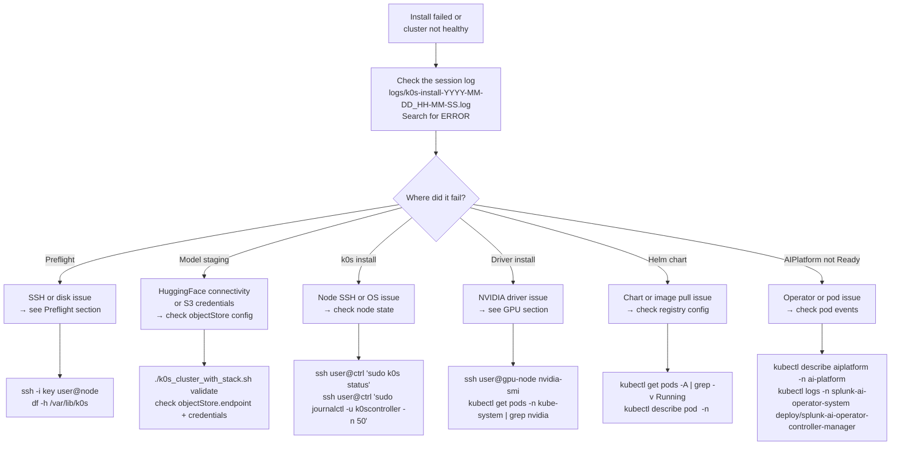

### Quick reference

| Symptom | First check | Fix |
|---|---|---|
| "SSH connection refused" | `ssh -i key user@node-ip hostname` | Check firewall / security groups on port 22 |
| "Refusing to wipe — Ready nodes" | `kubectl get nodes` | Set `useExisting: auto` in config or run `clean-all` first |
| "Unable to apply installer settings to the generated k0s configuration" | `yq --version` on the install machine and the preceding installer log | Use the current bundled `yq`, confirm the generated YAML is readable, and rerun. Do not install PyYAML on cluster nodes. |
| "nvidia-smi not found" in AIRGAP_MODE | `ssh user@gpu-node which nvidia-smi` | Pre-install NVIDIA driver — see [Air-Gapped Deployment](K0S_README.md#gpu-nodes-in-air-gapped-environments) |
| "Checksum verification failed" | Re-transfer the bundle | `sha256sum airgap-bundle-<date>.tar.gz` and compare |
| "Expected chart not found" | `ls /opt/airgap/airgap-bundle-*/charts/` | Set `PROMETHEUS_CHART_PATH` etc. to the actual filename |
| Pod stuck in `ImagePullBackOff` (SAIA / Splunk / Ray / Weaviate) | `kubectl describe pod <pod> -n <ns>` | Check `images.registry` in config and that image pull secret exists — these are the platform images you mirrored in [Phase 2](#phase-2--mirror-container-images) |
| `ImagePullBackOff` with `http: server gave HTTP response to HTTPS client` | `kubectl describe pod <pod>` → look at image pull error | Registry is plain-HTTP — set `images.registryInsecure: true` in config and re-run install; see [Insecure Registry Support](K0S_README.md#insecure-registry-support-containerd-v2) |
| All models reported MISSING after a successful upload | `mc ls myminio/<bucket>/staging_state/` | Bucket name has uppercase letters — the upload scripts normalize to lowercase; use a lowercase `storage.objectStore.bucket` value. See [Model Staging Issues](K0S_README.md#model-staging-issues) |
| All models MISSING after changing `defaultAcceleratorType` from L40S to H100 | Expected — marker `accel=` field is validated | Re-run `stage-artifacts`; the pre-check detects the accel mismatch and triggers a fresh download/upload. See [Switching accelerator type](K0S_README.md#switching-defaultacceleratortype-from-l40s-to-h100-shows-models-as-missing) |
| Air-gap: infra pods `ImagePullBackOff` (Calico / CoreDNS / cert-manager / device-plugin) or nodes `NotReady` | `ssh <node> 'ls -la /var/lib/k0s/images/'` | Image bundles didn't reach the node. Confirm `images/*.tar` exists in your bundle (rebuild with current `prepare_airgap_bundle.sh` if not); re-run install — see [Why two image bundles?](#why-two-image-bundles) |
| Air-gap install times out waiting for pinned bundle image digests | `ssh <node> 'sudo k0s status && sudo k0s ctr images list'` | Check that each OCI-index name has the exact digest and `io.cri-containerd.pinned=pinned`; inspect disk and k0s logs. Same-hash archives are touched automatically when records are missing. Increase the timeout only for a healthy slow import. |
| Air-gap install reports an unmapped Kubernetes `Node` | Compare `kubectl get nodes -o wide` with `nodes.existingIPs` and SSH `hostname`, `hostname -f`, and `hostname -I` | Add/correct the SSH endpoint for every actual `Node`. Controller-only configured endpoints with no `Node` are skipped normally. |
| Installer refuses to adopt or overwrite an internal Splunk object | Inspect the object named by the error and compare `app.kubernetes.io/*` labels plus `ai.splunk.com/owner-id` | Use both one-time adoption commands printed by the installer only for a proven legacy object from the same cluster/Standalone. Otherwise resolve the collision through its owner or use another namespace. |
| SAIA service no `EXTERNAL-IP` | `kubectl get svc -n ai-platform` | Check MetalLB pods: `kubectl get pods -n metallb-system` |
| AIPlatform CR stuck `Pending` | `kubectl describe aiplatform -n ai-platform` | Check operator logs and GPU node availability |

> For the full symptom list — Ray workers not starting, models not loading, Splunk stuck initializing, and more — see **[TROUBLESHOOTING.md](TROUBLESHOOTING.md)**.

---

*Splunk AI Platform · k0s Deployment Guide · Last updated 2026-07-02*
