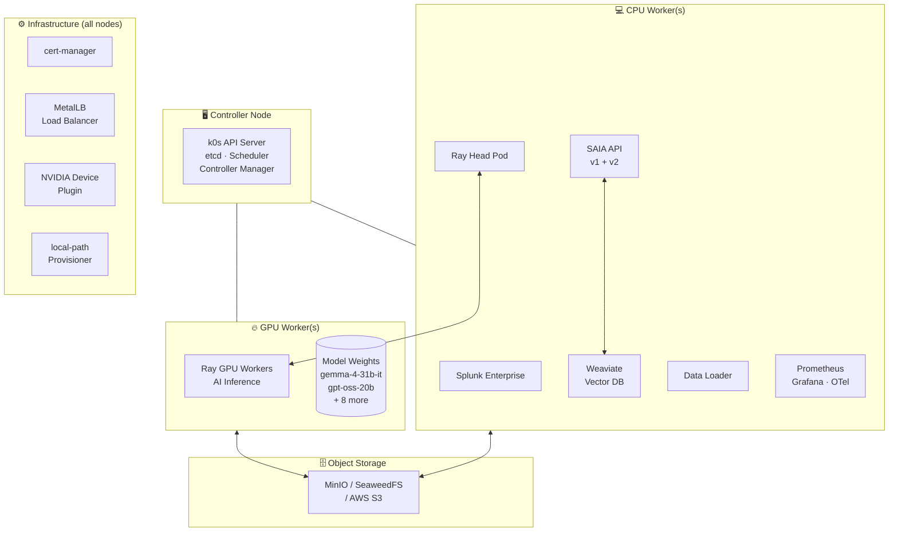
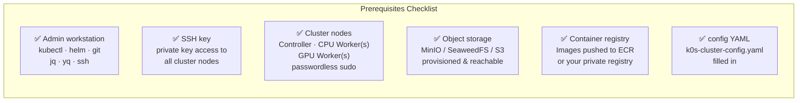
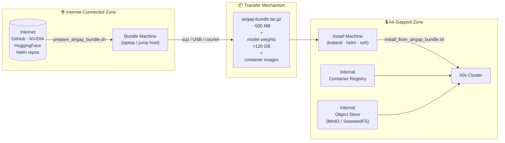
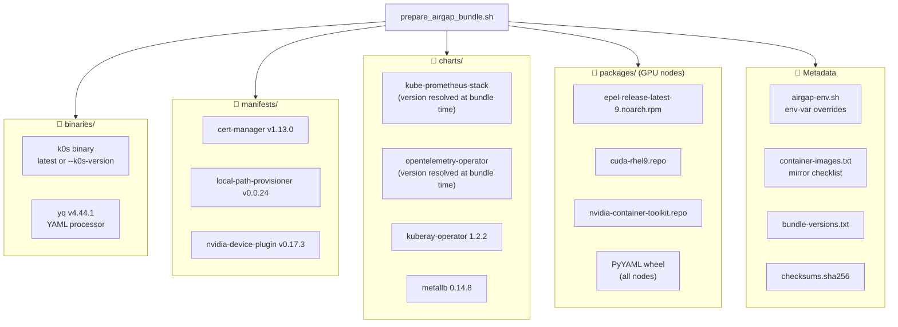
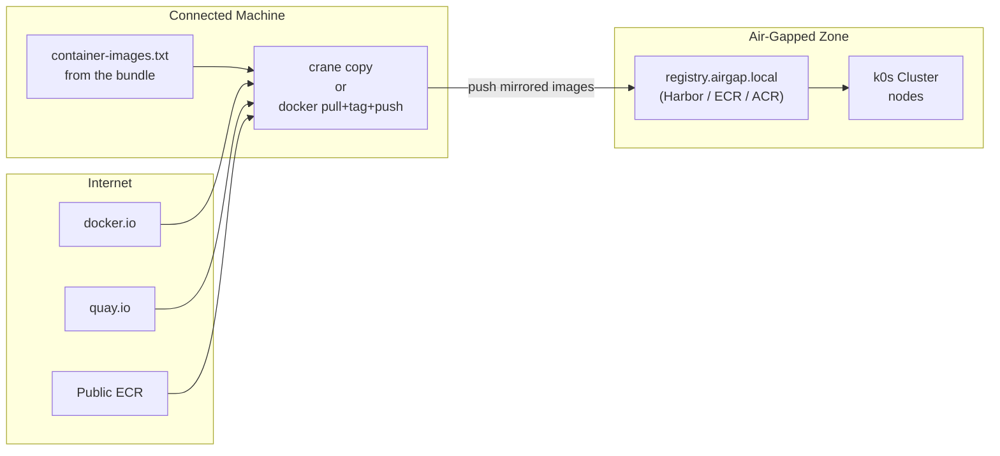
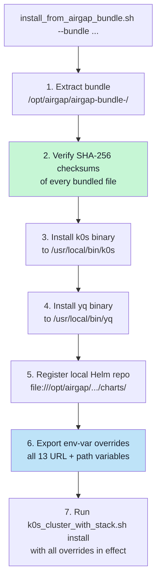
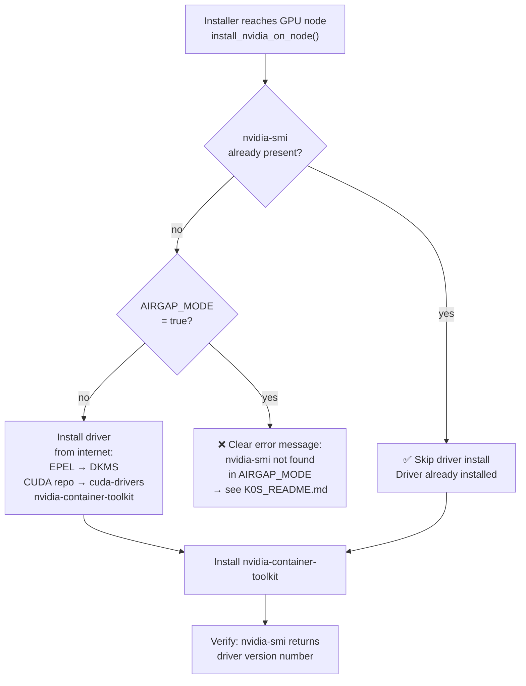
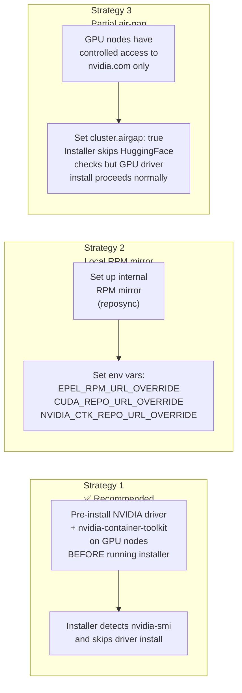
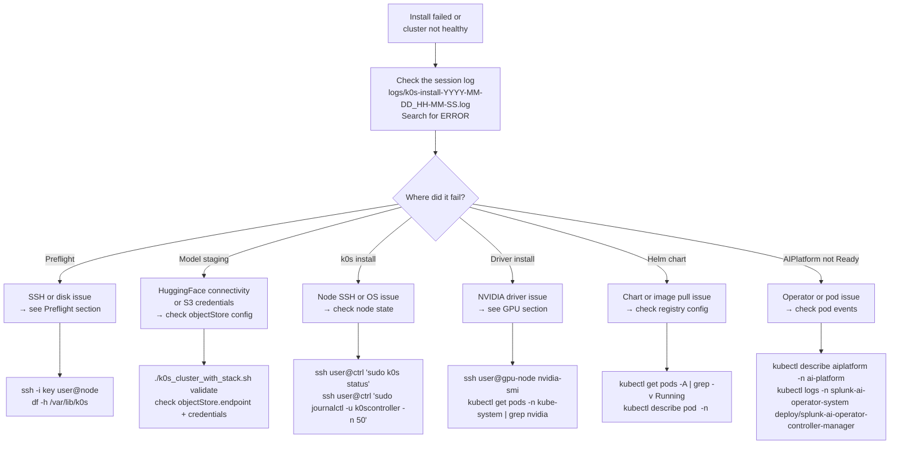

# Splunk AI Platform — Deployment Guide

End-to-end customer experience guide for deploying the Splunk AI Platform on
k0s Kubernetes. Covers both standard (internet-connected) and air-gapped
(fully disconnected) deployments.

---

## Table of Contents

- [Which Path Is Right for You?](#which-path-is-right-for-you)
- [What Gets Deployed](#what-gets-deployed)
- [Standard Deployment (Internet-Connected)](#standard-deployment-internet-connected)
  - [What You Need Before Starting](#what-you-need-before-starting)
  - [Install Flow](#install-flow)
  - [Step-by-Step](#step-by-step-standard)
- [Air-Gapped Deployment (No Internet on Cluster)](#air-gapped-deployment-no-internet-on-cluster)
  - [Air-Gap Concepts](#air-gap-concepts)
  - [Phase 1 — Prepare the Bundle (Connected Machine)](#phase-1--prepare-the-bundle-connected-machine)
  - [Phase 2 — Mirror Container Images](#phase-2--mirror-container-images)
  - [Phase 3 — Stage Model Weights](#phase-3--stage-model-weights)
  - [Phase 4 — Transfer to Air-Gapped Environment](#phase-4--transfer-to-air-gapped-environment)
  - [Phase 5 — Install from the Bundle](#phase-5--install-from-the-bundle)
  - [GPU Nodes in Air-Gapped Environments](#gpu-nodes-in-air-gapped-environments)
- [Post-Install Verification](#post-install-verification)
- [Install the Splunk AI Assistant App](#install-the-splunk-ai-assistant-app)
- [Common Operations](#common-operations)
- [Troubleshooting](#troubleshooting)

---

## Which Path Is Right for You?


| Scenario | Install machine has internet | Cluster nodes have internet | Use |
|---|---|---|---|
| Typical cloud / on-prem | ✅ | ✅ | [Standard deployment](#standard-deployment-internet-connected) |
| Cluster isolated (with or without internet on install machine) | ✅ / ❌ | ❌ | [Air-gapped deployment](#air-gapped-deployment-no-internet-on-cluster) — run `prepare_airgap_bundle.sh` on any connected machine, then transfer the bundle |

---

## What Gets Deployed

The installer deploys the complete Splunk AI Platform stack onto your k0s cluster.

> **SAIA** = Splunk AI Assistant — the AI chat and SPL-generation application that runs on top of the platform.



### Operator Stack

| Operator | Version | Purpose |
|---|---|---|
| Splunk AI Operator | your build | Manages `AIPlatform` CR lifecycle |
| Splunk Operator | 3.0.0 | Manages Splunk Enterprise |
| KubeRay | 1.2.2 | Manages Ray clusters for AI inference |
| cert-manager | v1.13.0 | TLS certificate management |
| OTel Operator | latest | Observability |
| NVIDIA Device Plugin | v0.17.3 | Exposes GPUs to Kubernetes |

### Version Compatibility

| Component | Supported version | Notes |
|---|---|---|
| k0s (Kubernetes) | v1.31.x | Installed automatically by the installer |
| RHEL | 9 | Only supported OS for cluster nodes |
| NVIDIA CUDA driver | 12.x (cuda-drivers) | Installed via CUDA repo on GPU nodes |
| NVIDIA Container Toolkit | latest stable | Installed alongside CUDA drivers |
| GPU hardware | NVIDIA L40S | Only `defaultAcceleratorType: L40S` is supported |
| Splunk Enterprise | matched to your build | Provided via your registry — do not mix versions |

> **Licensing:** Splunk Enterprise and the Splunk AI Operator require valid Splunk licenses. Container images are access-controlled through your private registry. Contact your Splunk account team to confirm entitlements before deployment.

---

## Standard Deployment (Internet-Connected)

### What You Need Before Starting



**Node size requirements:**

| Node Type | Min CPU | Min RAM | Min Disk | Count |
|---|---|---|---|---|
| Controller | 4 cores | 8 GB | 100 GB | 1 (or 3 for HA) |
| CPU Worker | 8 cores | 32 GB | 200 GB | 1+ |
| GPU Worker | 48 vCPUs | 384 GiB | 500 GB | **2 nodes required** · 4 × NVIDIA L40S per node (48 GB GDDR6 each) · **8 × L40S total, 384 GB total GPU memory** · 100 Gbps · equivalent to g6e.12xlarge |

> **Minimum viable topology:** The platform requires at least 1 controller + 1 CPU worker + 2 GPU workers. The controller and CPU worker roles can coexist on a single machine for lab/testing use, but this is not supported for production. A single GPU worker is not sufficient — the AI inference stack distributes work across both nodes.

**Ports to open between nodes:** 22 (SSH), 6443 (k8s API), 2380 (etcd), 10250 (kubelet), 8132 (konnectivity), 4789/UDP (VXLAN/Calico), 179 (Calico BGP).

**Object storage sizing:**

| Data | Minimum size | Notes |
|---|---|---|
| Model weights (`model_artifacts/`) | 250 GB | >120 GB for 10 models + headroom for re-staging |
| Runtime data (conversations, queues, config) | 100 GB | Grows with usage; monitor and expand as needed |
| **Total recommended bucket** | **500 GB+** | Plan for growth if running multiple tenants |

### Install Flow

**Estimated time:**

| Phase | Typical duration | Notes |
|---|---|---|
| Preflight | 1–2 min | Config validation and SSH checks |
| Model staging | 2–6 hours | Depends on internet speed — >120 GB download. Skip with `modelStaging.enabled: false` if already staged. |
| Cluster bootstrap | 10–20 min | k0s install + NVIDIA driver install on GPU nodes |
| Platform stack | 15–30 min | Helm chart deploys + operator reconciliation |
| **Total (first install with staging)** | **~3–7 hours** | Mostly model download time |
| **Total (staging already done)** | **~30–60 min** | |


### Step-by-Step (Standard)

**1. Configure your cluster**

```bash
cd tools/cluster_setup
cp k0s-cluster-config.yaml my-cluster.yaml
# Open my-cluster.yaml and fill in ALL fields marked CHANGE THIS
```

The config sections to fill in:

| Section | What to set |
|---|---|
| `cluster` | `name`, `sshKeyPath`, `sshUser` |
| `nodes.existingIPs` | IP addresses of your controller and worker nodes |
| `storage.objectStore` | Your MinIO / SeaweedFS / S3 endpoint + credentials |
| `images` | Your registry URL + all image tags |
| `aiPlatform` | `defaultAcceleratorType` — set to `L40S` |
| `metallb.pool.addresses` | A free IP range on your LAN (for LoadBalancer VIP) |

> For full field descriptions, defaults, and examples — see [Configuration Reference in K0S_README.md](K0S_README.md#configuration).

**2. Validate your config before installing**

```bash
CONFIG_FILE=./my-cluster.yaml ./k0s_cluster_with_stack.sh validate
```

This runs a read-only config check and prints a ✔/✖ checklist. Fix any ✖ items before proceeding.

**3. Run the installer**

```bash
CONFIG_FILE=./my-cluster.yaml ./k0s_cluster_with_stack.sh install
```

The installer shows an install plan and asks for confirmation before making any changes.

**4. Monitor progress**

The installer prints timestamped progress to the terminal and to a log file:

```bash
# In another terminal — follow the live log
tail -f tools/cluster_setup/logs/k0s-install-*.log
```

**5. Verify the result**

```bash
export KUBECONFIG=~/.kube/k0s-<your-cluster-name>
kubectl get nodes                          # all nodes Ready
kubectl get pods -A                        # all pods Running
kubectl get aiplatform -n ai-platform      # AIPlatform Ready
```

---

## Air-Gapped Deployment (No Internet on Cluster)

### Air-Gap Concepts



**Key principle:** The main installer has no hardcoded download URLs — every internet address is overridable via environment variables. `install_from_airgap_bundle.sh` sets all of them automatically from the bundle.

### Phase 1 — Prepare the Bundle (Connected Machine)

Run this on any machine with internet access. You do not need the cluster nodes reachable from this machine.

```bash
cd tools/cluster_setup

# Build the bundle (RHEL 9 GPU nodes — only supported target)
./prepare_airgap_bundle.sh --output-dir /mnt/transfer

# Pin a specific k0s version
./prepare_airgap_bundle.sh --output-dir /mnt/transfer --k0s-version v1.31.2+k0s.0
```

**What gets downloaded into the bundle:**



Output: a single timestamped `.tar.gz`:

```
/mnt/transfer/airgap-bundle-20260612-103000.tar.gz   (~500 MB)
```

### Phase 2 — Mirror Container Images

Container images are **not** in the bundle (they would add many GB). Mirror them separately to your internal registry.



```bash
INTERNAL_REGISTRY="registry.airgap.local"

while IFS= read -r img; do
  [[ "$img" =~ ^# ]] && continue
  [[ -z "$img" ]] && continue
  dest="${INTERNAL_REGISTRY}/${img##*/}"
  echo "Copying $img → $dest"
  crane copy "$img" "$dest"
done < container-images.txt
```

After mirroring, update your config:

```yaml
images:
  registry: "registry.airgap.local"
  operator:
    image: "registry.airgap.local/splunk-ai-operator:latest"
  # ... all other images pointing at your internal registry

imagePullSecrets:
  autoCreateECR: false   # disable automatic ECR token refresh
```

### Phase 3 — Stage Model Weights

Model weights (>120 GB) must be staged to your object store. Do this on the connected machine.

**System requirements for the staging machine**

| Resource | Minimum | Notes |
|---|---|---|
| Disk (free) | 250 GB | >120 GB for 10 models + buffer for download staging and upload temp files |
| RAM | 16 GB | Scripts process and stream large files; less RAM causes swapping and slow uploads |
| Internet | Stable broadband | Downloads >120 GB from HuggingFace; a flaky connection will require re-running with `SKIP_IF_EXISTS=1` |
| CPU | 4 cores | Recommended for parallel upload scripts |

> **Same machine as the installer?** The installer machine already runs `kubectl`, `helm`, and `ssh` — it can also run model staging. Just ensure the **disk requirement** is met. `/tmp` or the working directory must have 250 GB free.

```bash
cd tools/artifacts_download_upload_scripts

# Download from HuggingFace (HF_TOKEN is optional for the current release)
./download_from_huggingface.sh

# Upload to your object store (endpoint must be reachable from this machine)
./upload_to_minio.sh    # or upload_to_s3.sh, upload_to_seaweedfs.sh
```

Then disable auto-staging in your cluster config (models are already there):

```yaml
storage:
  modelStaging:
    enabled: false
```

### Phase 4 — Transfer to Air-Gapped Environment

```bash
# Copy bundle
scp /mnt/transfer/airgap-bundle-<timestamp>.tar.gz \
    admin@install-machine:/opt/splunk-ai/

# Copy installer scripts (if not already on the machine)
scp tools/cluster_setup/k0s_cluster_with_stack.sh \
    tools/cluster_setup/install_from_airgap_bundle.sh \
    tools/cluster_setup/k0s-cluster-config.yaml \
    admin@install-machine:/opt/splunk-ai/

# Copy your edited cluster config
scp my-cluster-config.yaml admin@install-machine:/opt/splunk-ai/
```

### Phase 5 — Install from the Bundle

**5a. Add `cluster.airgap: true` to your config**

```yaml
cluster:
  name: my-cluster
  airgap: true        # skips internet connectivity checks immediately
  sshKeyPath: ~/.ssh/id_rsa
  sshUser: ec2-user
```

**5b. Run the installer**

```bash
cd /opt/splunk-ai
chmod +x install_from_airgap_bundle.sh k0s_cluster_with_stack.sh

./install_from_airgap_bundle.sh \
  --bundle /opt/splunk-ai/airgap-bundle-<timestamp>.tar.gz \
  --config /opt/splunk-ai/my-cluster-config.yaml
```

**What `install_from_airgap_bundle.sh` does automatically:**



The install plan shown before any changes are made will display:

```
Air-gap mode    : true
k0s install URL : file:///opt/airgap/.../binaries/k0s
Helm charts     : local (file:///opt/airgap/.../charts/)
...
```

Confirm to proceed.

### GPU Nodes in Air-Gapped Environments

GPU nodes require OS packages (EPEL, DKMS, CUDA, nvidia-container-toolkit) that normally download from the internet. In air-gap mode the installer detects missing `nvidia-smi` and fails clearly rather than timing out.



**Three strategies for GPU node packages in air-gap:**



**Using bundled package files (Strategy 1):**

The bundle's `packages/` directory contains the files needed to pre-install drivers:

```bash
GPU_NODE="10.0.0.3"
BUNDLE_PKGS="/opt/airgap/airgap-bundle-<date>/packages"

scp -r "${BUNDLE_PKGS}" "${GPU_NODE}:/tmp/airgap-packages"

ssh "${GPU_NODE}" bash <<'EOF'
  PKG=/tmp/airgap-packages
  sudo dnf install -y "${PKG}/epel-release-latest-9.noarch.rpm"
  sudo dnf install -y dkms gcc make elfutils-libelf-devel "kernel-devel-$(uname -r)"
  sudo cp "${PKG}/cuda-rhel9.repo" /etc/yum.repos.d/
  sudo dnf install -y cuda-drivers
  sudo cp "${PKG}/nvidia-container-toolkit.repo" /etc/yum.repos.d/
  sudo dnf install -y nvidia-container-toolkit
  nvidia-smi
EOF
```

> After pre-installing drivers, run `install_from_airgap_bundle.sh` normally. The installer will detect `nvidia-smi` and skip driver installation entirely.

> **Environment variable reference and advanced options** — see [K0S_README.md — Air-Gapped Deployment](K0S_README.md#air-gapped-deployment).

---

## Post-Install Verification

**Component namespaces — quick reference:**

| Namespace | Components |
|---|---|
| `ai-platform` | AIPlatform CR, SAIA API v1/v2, Ray Head/Workers, Weaviate, Splunk Enterprise, Data Loader, Nginx |
| `splunk-ai-operator-system` | Splunk AI Operator controller |
| `splunk-operator` | Splunk Operator controller |
| `ray-system` | KubeRay Operator |
| `cert-manager` | cert-manager controller, webhook, cainjector |
| `kube-prometheus-stack` | Prometheus, Grafana, Alertmanager |
| `opentelemetry-operator-system` | OTel Operator |
| `kube-system` | NVIDIA device plugin DaemonSet, Calico, local-path-provisioner |
| `metallb-system` | MetalLB controller and speakers (if LoadBalancer enabled) |
| `local-path-storage` | local-path-provisioner |

```bash
# Set kubeconfig
export KUBECONFIG=~/.kube/k0s-<cluster-name>

# All nodes must be Ready
kubectl get nodes -o wide

# All pods must be Running or Completed
kubectl get pods -A --sort-by=.metadata.namespace

# AIPlatform CR must be Ready
kubectl get aiplatform -n ai-platform -o wide

# SAIA service must have an EXTERNAL-IP (if using LoadBalancer)
kubectl get svc -n ai-platform -l app.kubernetes.io/component=saia

# GPU nodes must show available GPUs
kubectl get nodes -l splunk.ai/workload-type=gpu -o yaml | grep nvidia.com/gpu
```

**Expected state after a successful install:**

| Resource | Expected Status |
|---|---|
| All nodes | `Ready` |
| `cert-manager` pods | `Running` |
| `kube-prometheus-stack` pods | `Running` |
| `splunk-operator` pods | `Running` |
| `kuberay-operator` pods | `Running` |
| `splunk-standalone` | `Ready` |
| `aiplatform/<name>` | `Ready` |
| SAIA service | `EXTERNAL-IP` assigned |
| GPU nodes | `nvidia.com/gpu: N` in allocatable |

**Sample output — healthy cluster:**

```
# kubectl get nodes
NAME          STATUS   ROLES    AGE   VERSION
controller    Ready    master   12m   v1.31.2+k0s
cpu-worker-1  Ready    <none>   10m   v1.31.2+k0s
gpu-worker-1  Ready    <none>   10m   v1.31.2+k0s
gpu-worker-2  Ready    <none>   10m   v1.31.2+k0s

# kubectl get aiplatform -n ai-platform
NAME                  STATUS   AGE
my-cluster-ai-platform  Ready    8m
```

If any node shows `NotReady` or the AIPlatform CR shows `Pending` for more than 10 minutes, check the session log and see [Troubleshooting](#troubleshooting).

---

## Install the Splunk AI Assistant App

After the cluster is healthy, install the **Splunk AI Assistant** app
(`Splunk_AI_Assistant_Cloud.tgz`) on the Splunk Enterprise instance to enable
the AI chat UI.

> **Obtaining the app:** `Splunk_AI_Assistant_Cloud.tgz` is provided by your Splunk account team as part of your Splunk AI Platform entitlement. Contact your Splunk representative if you do not have it.

### 1. Find your Splunk Web URL

```bash
# Retrieve the admin password
kubectl get secret splunk-standalone-secret -n ai-platform \
  -o jsonpath='{.data.password}' | base64 --decode && echo

# NodePort (default) — open on any worker node IP
kubectl get svc -n ai-platform -l app.kubernetes.io/name=splunk

# LoadBalancer — if MetalLB is configured
kubectl get svc -n ai-platform -l app.kubernetes.io/component=saia

# Quick access without external exposure
kubectl port-forward -n ai-platform svc/splunk-standalone-service 8000:8000
# → http://localhost:8000
```

### 2. Install via Splunk UI

1. Log in to Splunk Web (`http://<node-ip>:<nodePort>`, default port **8000**)
2. Click **Apps → Manage Apps**
3. Click **Install app from file**, select `Splunk_AI_Assistant_Cloud.tgz`
4. Check **Upgrade app** if updating an existing installation, then click **Upload**
5. Restart Splunk if prompted

### 3. Air-gapped install (no browser access to cluster)

```bash
APP_TGZ="Splunk_AI_Assistant_Cloud.tgz"
kubectl cp "${APP_TGZ}" ai-platform/splunk-standalone-0:/tmp/${APP_TGZ}
kubectl exec -n ai-platform splunk-standalone-0 -- bash -c "
  tar -xzf /tmp/${APP_TGZ} -C /opt/splunk/etc/apps && rm /tmp/${APP_TGZ}"
kubectl exec -n ai-platform splunk-standalone-0 -- /opt/splunk/bin/splunk restart
```

### 4. Verify

```bash
kubectl get standalone splunk-standalone -n ai-platform -o json \
  | jq '.status.appContext.appSrcDeployStatus'
# deployStatus: 3 = installed
```

> **Full details** — app configuration, `splunkaiassistant.conf`, air-gapped
> install steps, and troubleshooting are in
> [K0S_README.md — Splunk AI Assistant App](K0S_README.md#splunk-ai-assistant-app).

---

## Common Operations

### Re-run after a partial failure

The installer is safe to re-run for most steps — Helm releases are upgraded if they already exist, and k0s join is skipped for nodes that are already Ready.

**Steps that are NOT idempotent:**
- **Model staging** — re-downloads files already on disk unless you set `SKIP_IF_EXISTS=1`
- **`clean-all`** — destructive; wipes all k0s state from every node with no recovery

If install fails partway, re-run directly:

```bash
CONFIG_FILE=./my-cluster.yaml ./k0s_cluster_with_stack.sh install
```

The safety gate prevents wiping a cluster with Ready nodes. If you need to start completely clean:

```bash
CONFIG_FILE=./my-cluster.yaml ./k0s_cluster_with_stack.sh clean-all
CONFIG_FILE=./my-cluster.yaml ./k0s_cluster_with_stack.sh install
```

### Add worker nodes

```bash
CONFIG_FILE=./my-cluster.yaml ./k0s_cluster_with_stack.sh join-workers
```

### Re-stage models only

```bash
CONFIG_FILE=./my-cluster.yaml ./k0s_cluster_with_stack.sh stage-artifacts

# Skip models already downloaded locally
SKIP_IF_EXISTS=1 CONFIG_FILE=./my-cluster.yaml ./k0s_cluster_with_stack.sh stage-artifacts
```

### Upgrade the platform

Update your config YAML with new image tags, then re-run install. The installer upgrades existing Helm releases in place:

```bash
# 1. Update image tags in your config
vi my-cluster.yaml   # bump operator, ray, saia, splunk image versions

# 2. Run install — Helm upgrades existing releases, does not wipe the cluster
CONFIG_FILE=./my-cluster.yaml ./k0s_cluster_with_stack.sh install
```

> The safety gate prevents `install` from wiping a cluster with Ready nodes — it upgrades the stack only. If you also need to upgrade k0s itself, run `clean-all` + `install` (destructive — back up etcd first).

**Air-gap upgrade:**

```bash
# Build a new bundle on a connected machine
./prepare_airgap_bundle.sh --output-dir /mnt/transfer

# Then on the install machine
./install_from_airgap_bundle.sh \
  --bundle /opt/airgap-bundle-<new-timestamp>.tar.gz \
  --config my-cluster-config.yaml \
  --subcommand upgrade
```

### Collect a support bundle

```bash
CONFIG_FILE=./my-cluster.yaml ./k0s_cluster_with_stack.sh diagnose
ls tools/cluster_setup/logs/k0s-diagnose-*.tar.gz
```

The tar.gz contains: pod logs from all namespaces, Kubernetes events, node descriptions, AIPlatform CR status, and the install session log — with secrets and credentials redacted. **Attach this file when opening a Splunk support case.**

---

## Troubleshooting

### Diagnose first

**Step 1 — validate config** (catches ~40% of issues before touching any node):

```bash
CONFIG_FILE=./my-cluster.yaml ./k0s_cluster_with_stack.sh validate
```

**Step 2 — check the session log** (search for `ERROR`):

```bash
tail -100 tools/cluster_setup/logs/k0s-install-*.log | grep -i error
```

**Step 3 — collect a support bundle**:

```bash
CONFIG_FILE=./my-cluster.yaml ./k0s_cluster_with_stack.sh diagnose
ls tools/cluster_setup/logs/k0s-diagnose-*.tar.gz
```

### Decision tree



### Quick reference

| Symptom | First check | Fix |
|---|---|---|
| "SSH connection refused" | `ssh -i key user@node-ip hostname` | Check firewall / security groups on port 22 |
| "Refusing to wipe — Ready nodes" | `kubectl get nodes` | Set `useExisting: auto` in config or run `clean-all` first |
| "python3+pyyaml missing" on nodes | `ssh user@node python3 -c 'import yaml'` | Run `dnf install -y python3-pyyaml` on the node (or set `AIRGAP_PYYAML_WHEEL_PATH`) |
| "nvidia-smi not found" in AIRGAP_MODE | `ssh user@gpu-node which nvidia-smi` | Pre-install NVIDIA driver — see [Air-Gapped Deployment](K0S_README.md#gpu-nodes-in-air-gapped-environments) |
| "Checksum verification failed" | Re-transfer the bundle | `sha256sum airgap-bundle-<date>.tar.gz` and compare |
| "Expected chart not found" | `ls /opt/airgap/airgap-bundle-*/charts/` | Set `PROMETHEUS_CHART_PATH` etc. to the actual filename |
| Pod stuck in `ImagePullBackOff` | `kubectl describe pod <pod> -n <ns>` | Check `images.registry` in config and that image pull secret exists |
| SAIA service no `EXTERNAL-IP` | `kubectl get svc -n ai-platform` | Check MetalLB pods: `kubectl get pods -n metallb-system` |
| AIPlatform CR stuck `Pending` | `kubectl describe aiplatform -n ai-platform` | Check operator logs and GPU node availability |

> For the full symptom list — Ray workers not starting, models not loading, Splunk stuck initializing, and more — see **[TROUBLESHOOTING.md](TROUBLESHOOTING.md)**.

---

*Splunk AI Platform · k0s Deployment Guide · Last updated 2026-06-12*
