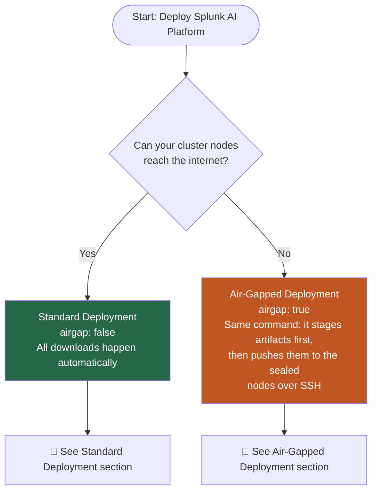
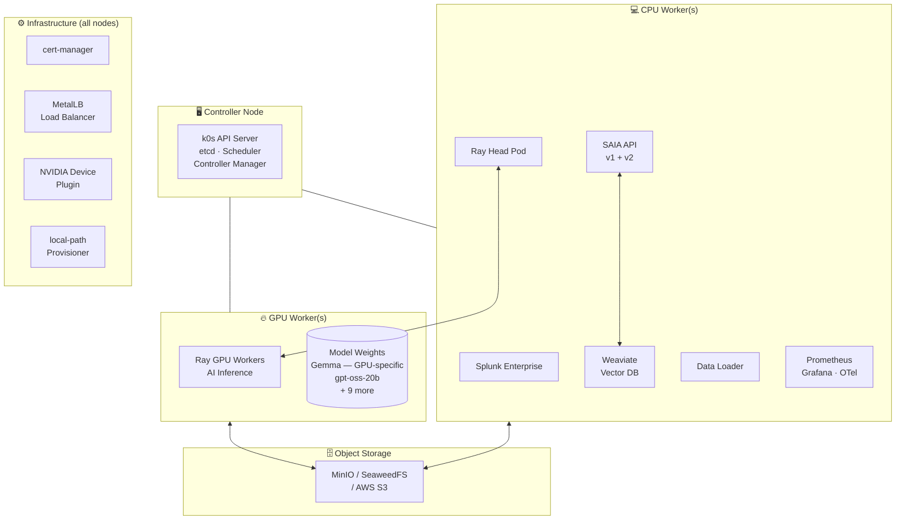
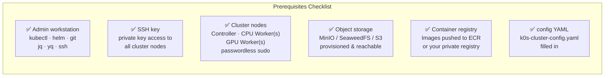
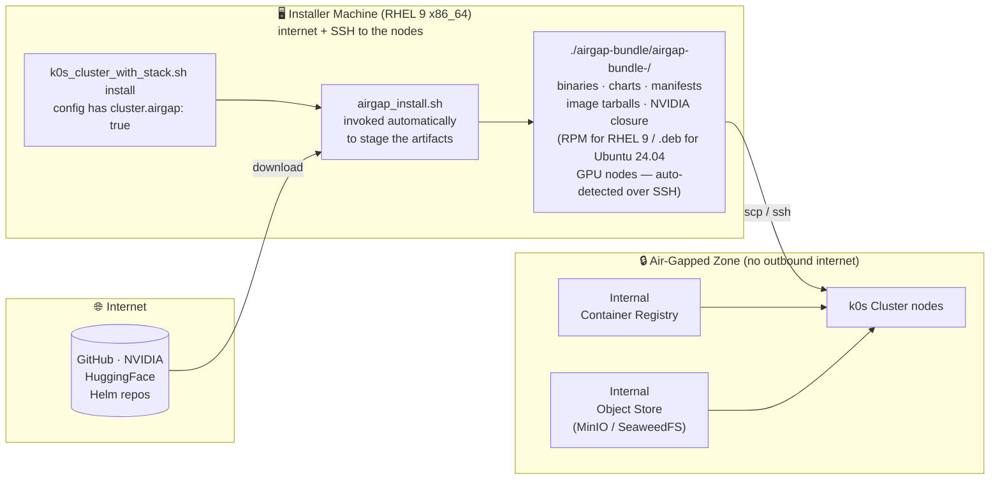
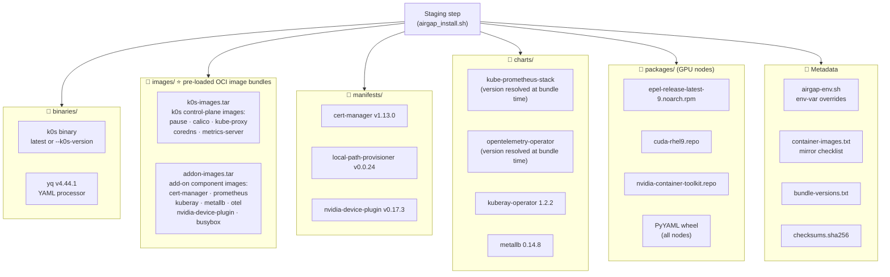
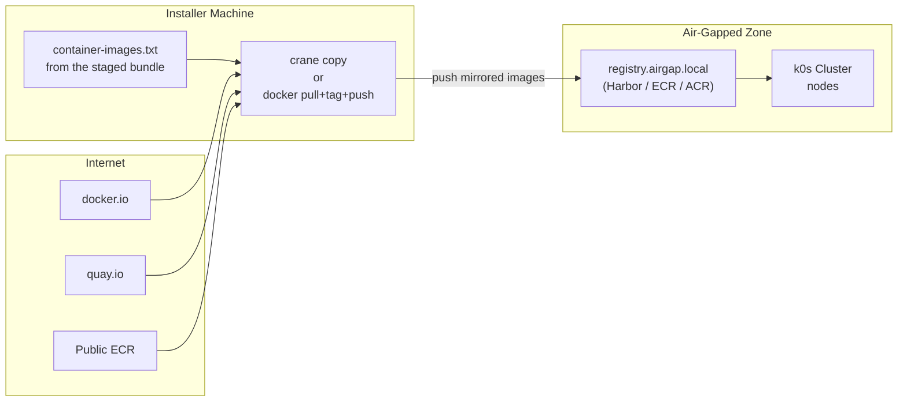
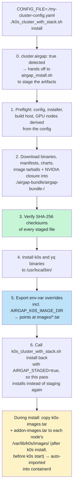
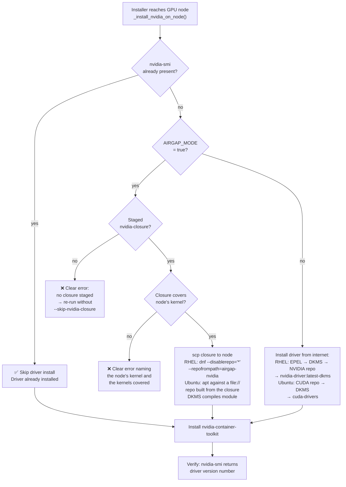
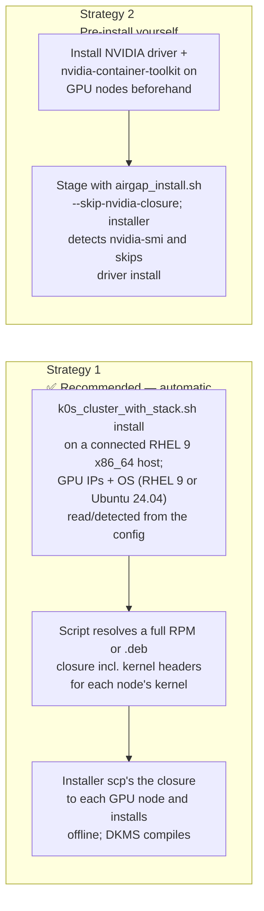
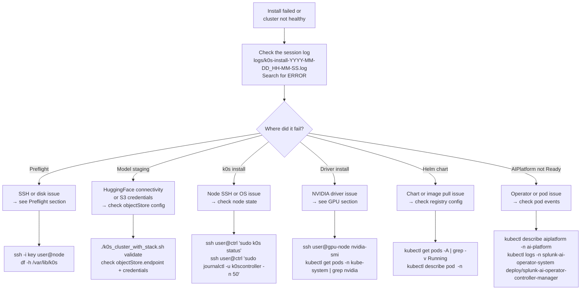

# Splunk AI Platform — Deployment Guide

End-to-end customer experience guide for deploying the Splunk AI Platform on
k0s Kubernetes. Covers both standard (internet-connected) and air-gapped
(fully disconnected) deployments.

---

## Table of Contents

- [Which Path Is Right for You?](#which-path-is-right-for-you)
- [What Gets Deployed](#what-gets-deployed)
  - [Internal Splunk Transport](#internal-splunk-transport)
  - [Scaling Deployment Capacity](#scaling-deployment-capacity)
- [Standard Deployment (Internet-Connected)](#standard-deployment-internet-connected)
  - [What You Need Before Starting](#what-you-need-before-starting)
  - [Install Flow](#install-flow)
  - [Step-by-Step](#step-by-step-standard)
- [Air-Gapped Deployment (No Internet on Cluster)](#air-gapped-deployment-no-internet-on-cluster)
  - [Air-Gap Concepts](#air-gap-concepts)
  - [Phase 1 — Stage the Artifacts](#phase-1--stage-the-artifacts)
  - [Phase 2 — Mirror Container Images](#phase-2--mirror-container-images)
  - [Phase 3 — Stage Model Weights](#phase-3--stage-model-weights)
  - [Phase 4 — Install](#phase-4--install)
  - [GPU Nodes in Air-Gapped Environments](#gpu-nodes-in-air-gapped-environments)
- [Post-Install Verification](#post-install-verification)
- [Internal Splunk Access](#internal-splunk-access)
- [Install the Splunk AI Assistant App](#install-the-splunk-ai-assistant-app)
- [Common Operations](#common-operations)
- [Troubleshooting](#troubleshooting)

---

## Which Path Is Right for You?



| Scenario | Installer machine has internet | Cluster nodes have internet | Use |
|---|---|---|---|
| Typical cloud / on-prem | ✅ | ✅ | [Standard deployment](#standard-deployment-internet-connected) |
| Cluster isolated | ✅ | ❌ | [Air-gapped deployment](#air-gapped-deployment-no-internet-on-cluster) — the **same** `k0s_cluster_with_stack.sh install` command, with `cluster.airgap: true` in the config |

---

## What Gets Deployed

The installer deploys the complete Splunk AI Platform stack onto your k0s cluster.

> **SAIA** = Splunk AI Assistant — the AI chat and SPL-generation application that runs on top of the platform.



### Operator Stack

| Operator | Version | Purpose |
|---|---|---|
| Splunk AI Operator | your build | Manages `AIPlatform` CR lifecycle |
| Splunk Operator | 3.0.0 | Manages Splunk Enterprise |
| KubeRay | 1.2.2 | Manages Ray clusters for AI inference |
| cert-manager | v1.13.0 | TLS certificate management |
| OTel Operator | latest | Observability |
| NVIDIA Device Plugin | v0.17.3 | Exposes GPUs to Kubernetes |

### Version Compatibility

| Component | Supported version | Notes |
|---|---|---|
| k0s (Kubernetes) | v1.31+ (validated on v1.36.1, containerd 2.x) | Installed automatically by the installer |
| Node OS | RHEL 9 or Ubuntu 24.04 | Only tested/supported OSes for **cluster** nodes (controllers, CPU workers, GPU workers). Any other OS is rejected at preflight; set `FORCE_UNSUPPORTED_OS=1` to bypass at your own risk. For air-gapped installs, the **installer machine** itself must be RHEL 9 x86_64 regardless of the target nodes' OS — see [Installer-host requirements](#gpu-nodes-in-air-gapped-environments) |
| NVIDIA driver | `nvidia-driver:latest-dkms` (RHEL, DKMS module) or `cuda-drivers` (Ubuntu, DKMS) | Installed via the NVIDIA repo on GPU nodes; RHEL's older `cuda-drivers` meta-package is gone, but Ubuntu's is current and used there |
| NVIDIA Container Toolkit | latest stable | Installed alongside the driver |
| GPU hardware | NVIDIA L40S or H100 | Set `defaultAcceleratorType: L40S` or `defaultAcceleratorType: H100` |
| Splunk Enterprise | matched to your build | Provided via your registry — do not mix versions |

> **Licensing:** Splunk Enterprise and the Splunk AI Operator require valid Splunk licenses. Container images are access-controlled through your private registry. Contact your Splunk account team to confirm entitlements before deployment.

### Internal Splunk Transport

For the k0s **internal Splunk** mode, the final management/JWKS endpoint on
port 8089 intentionally uses HTTP. The installer sets both Splunk's OAuth
`issuer_uri` and `AIPlatform.spec.splunkConfiguration.endpoint` to the same
service URL:

```text
http://splunk-<standaloneName>-standalone-service.<namespace>.svc.cluster.local:8089
```

OTel telemetry uses the separate `splunkConfiguration.hecEndpoint` on port
8088. HEC is used only for telemetry and is never treated as the JWT issuer.
After Splunk is Ready, the installer reads the effective `[http]` stanza with
`btool`, verifies that HEC is enabled and healthy, and renders `http://` or
`https://` to match `enableSSL`. It does not change the HEC TLS setting. A fresh
Splunk Operator 3.0.0 install normally reports HTTP; an upgraded or customized
instance may report HTTPS.

This is the AIP-4614 compatibility behavior for SAIA/Slim interactive-token
validation. The installer disables `enableSplunkdSSL`, rolls the Splunk pod, and
tests the HTTP endpoint before deploying `AIPlatform`. Current SAIA images work
with this URL; no image rollback or certificate mount is needed. The Splunk
OAuth certificate remains configured because it signs JWTs rather than securing
the HTTP transport. Splunk 10.2 still performs its bounded initial HTTPS scheme
probe before falling back to HTTP. The installer extends only the Standalone
startup-probe allowance so the image can finish that fallback without weakening
splunk-ansible's global retry policy; this can add several minutes to a Splunk
pod start.

Rerunning the installer against a PVC created by an earlier TLS-preview install
performs an idempotent compatibility migration before Splunk starts. It removes
only persisted TLS options from configuration files that still reference the
installer-owned `/mnt/splunk-cert*` paths, restores Splunk Web to HTTP, and
removes the stale custom HEC certificate path. It does not delete the PVC or
indexed data. HEC's `enableSSL` setting is deliberately unchanged, so HEC keeps
using its independently configured HTTP or HTTPS protocol. Installation fails
closed if the effective HEC setting cannot be read, HEC is disabled, its port is
not the operator Service's port 8088, or the matching health URL is unavailable.
During an operator upgrade, the OTel ConfigMap migration also removes the exact
legacy operator-managed `tls.ca_file: /etc/splunk-ca/ca.crt` reference when
that CA mount is no longer configured. HTTPS then retains the existing
no-CA `insecure_skip_verify` behavior; HTTP carries no generated TLS settings.
Other exporter, processor, and custom CA settings are preserved.

Keep the Kubernetes pod/service network private. Management credentials and
JWKS requests on port 8089 are unencrypted within that network, so production
clusters should restrict untrusted workloads with NetworkPolicy. External
Splunk, image registries, cert-manager webhooks, and customer-managed ingress
retain their independent TLS settings.

### Scaling Deployment Capacity

Use `aiPlatform.scaleFactor` to increase or decrease AI workload capacity:

```yaml
aiPlatform:
  scaleFactor: 2
```

Use a whole number of `1` or higher. The default is `1`; for example, `2`
doubles the standard capacity. Increasing this value does not add GPU nodes, so
ask your cluster administrator to add the required GPU capacity first.

> **Downscaling notice:** Reducing `scaleFactor` causes temporary service
> downtime while workloads are resized. Plan downscaling during a maintenance
> window.

---

## Standard Deployment (Internet-Connected)

### What You Need Before Starting



**Node size requirements:**

| Node Type | Min CPU | Min RAM | Min Disk | Count |
|---|---|---|---|---|
| Controller | 4 cores | 8 GB | 100 GB | 1 (or 3 for HA) |
| CPU Worker | 8 cores | 32 GB | 200 GB | 1+ |
| GPU Worker | 48 vCPUs | 384 GiB | 500 GB | **2 nodes required** · 4 × NVIDIA L40S per node (48 GB GDDR6 each) · **8 × L40S total, 384 GB total GPU memory** · 100 Gbps · equivalent to g6e.12xlarge |

> **Minimum viable topology:** The platform requires at least 1 controller + 1 CPU worker + 2 GPU workers. The controller and CPU worker roles can coexist on a single machine for lab/testing use, but this is not supported for production. A single GPU worker is not sufficient — the AI inference stack distributes work across both nodes.

**Ports to open between nodes:** 22 (SSH), 6443 (k8s API), 2380 (etcd), 10250 (kubelet), 8132 (konnectivity), 4789/UDP (VXLAN/Calico), 179 (Calico BGP).

**Object storage sizing:**

| Data | Minimum size | Notes |
|---|---|---|
| Model weights (`model_artifacts/`) | 250 GB | >120 GB for 11 models + headroom for re-staging |
| Runtime data (conversations, queues, config) | 100 GB | Grows with usage; monitor and expand as needed |
| **Total recommended bucket** | **500 GB+** | Plan for growth if running multiple tenants |

### Install Flow

**Estimated time:**

| Phase | Typical duration | Notes |
|---|---|---|
| Preflight | 1–2 min | Config validation and SSH checks |
| Model staging | 2–6 hours | Depends on internet speed — >120 GB download. Skip with `modelStaging.enabled: false` if already staged. |
| Cluster bootstrap | 10–20 min | k0s install + NVIDIA driver install on GPU nodes |
| Platform stack | 15–30 min | Helm chart deploys + operator reconciliation |
| **Total (first install with staging)** | **~3–7 hours** | Mostly model download time |
| **Total (staging already done)** | **~30–60 min** | |


### Step-by-Step (Standard)

**1. Confirm every node is ready**

```bash
# On each node (controller, CPU worker, GPU worker) — confirm OS, passwordless sudo, and Python
cat /etc/os-release               # must be RHEL 9 or Ubuntu 24.04
sudo -n true && echo "passwordless sudo OK"
python3 --version                 # 3.8+

# From the admin workstation — confirm SSH access to each node
ssh -i <key> <user>@<node-ip> hostname
```

RHEL 9 and Ubuntu 24.04 are the only supported node OSes — mix and match
freely across controllers/workers, the installer detects each node's OS over
SSH. Any other OS is rejected at preflight (`FORCE_UNSUPPORTED_OS=1` bypasses
this at your own risk).

**GPU worker nodes** need no manual driver install. The installer installs
the driver automatically on internet-connected nodes — RHEL: EPEL →
`nvidia-driver:latest-dkms` (DKMS) → `nvidia-container-toolkit`; Ubuntu: CUDA
repo → `cuda-drivers` (DKMS) → `nvidia-container-toolkit` — and verifies with
`nvidia-smi` as part of `install`.

**2. Configure your cluster**

```bash
cd tools/cluster_setup
cp k0s-cluster-config.yaml my-cluster.yaml
# Open my-cluster.yaml and fill in ALL fields marked CHANGE THIS
```

The config sections to fill in:

| Section | What to set |
|---|---|
| `cluster` | `name`, `sshKeyPath`, `sshUser` |
| `nodes.existingIPs` | IP addresses of your controller and worker nodes |
| `storage.objectStore` | Your MinIO / SeaweedFS / S3 endpoint + credentials |
| `images.registry` | Your registry hostname, e.g. `123456789.dkr.ecr.us-east-2.amazonaws.com` or `registry.internal:5000` |
| `images.registryInsecure` | `true` only for plain-HTTP (no-TLS) registries; leave `false` (default) for ECR, Harbor, or any HTTPS registry |
| `images` (tags) | All image tags pointing at your registry |
| `aiPlatform` | `defaultAcceleratorType` — `L40S` or `H100` |
| `metallb.pool.addresses` | A free IP range on your LAN (for LoadBalancer VIP) |

> For full field descriptions, secure vs insecure registry guidance, and examples — see [Configuration Reference in K0S_README.md](K0S_README.md#images-section).

**3. Validate your config before installing**

```bash
CONFIG_FILE=./my-cluster.yaml ./k0s_cluster_with_stack.sh validate
```

This runs a read-only config check and prints a ✔/✖ checklist. Fix any ✖ items before proceeding.

**4. Run the installer**

```bash
CONFIG_FILE=./my-cluster.yaml ./k0s_cluster_with_stack.sh install
```

The installer shows an install plan and asks for confirmation before making any changes.

**5. Monitor progress**

The installer prints timestamped progress to the terminal and to a log file:

```bash
# In another terminal — follow the live log
tail -f tools/cluster_setup/logs/k0s-install-*.log
```

**6. Verify the result**

```bash
export KUBECONFIG=~/.kube/k0s-<your-cluster-name>
kubectl get nodes                          # all nodes Ready
kubectl get pods -A                        # all pods Running
kubectl get aiplatform -n ai-platform      # AIPlatform Ready
```

---

## Air-Gapped Deployment (No Internet on Cluster)

### Air-Gap Concepts



**Key principle:** the air-gap boundary sits between the installer machine and the
cluster nodes — not between two machines. Only the installer machine needs
internet; the nodes never make an outbound connection. There is no tarball to
copy and no separate command to learn: `k0s_cluster_with_stack.sh install`
detects air-gap mode, stages everything into a staging directory via
`airgap_install.sh`, and then pushes it to the nodes over SSH.

**One entry point, two modes.** The command is identical either way — the config
selects the mode:

```yaml
cluster:
  airgap: false   # standard install — proceeds directly to the nodes
  airgap: true    # stages ~2.2 GB of artifacts first (~15 min), then installs
```

```bash
CONFIG_FILE=./my-config.yaml ./k0s_cluster_with_stack.sh install
```

`AIRGAP_MODE=true` in the environment is an equally valid trigger, for a one-off
air-gap run without editing the config:

```bash
AIRGAP_MODE=true CONFIG_FILE=./my-config.yaml ./k0s_cluster_with_stack.sh install
```

**Only `install` and `join-workers` stage artifacts.** `validate`, `diagnose`,
`delete`, `clean-all`, `verify-pods`, and `stage-artifacts` never trigger
staging, so they stay instant even with `airgap: true` — a read-only config check
must not require a 15-minute download.

The main installer has no hardcoded download URLs — every internet address is
overridable via environment variables, and the staging step sets all of them
automatically from the staged artifacts.

> **Advanced / direct path.** `airgap_install.sh` remains available as the
> lower-level command and is unchanged: use it to pre-stage with
> `--download-only`, or to drive staging with non-default flags
> (`--k0s-version`, `--gpu-hosts`, `--driver-version`, …). The unified command
> calls it for you with defaults.

### Phase 1 — Stage the Artifacts

Phases 1–3 are preparation you do before installing. If your container images
are already mirrored and your model weights already staged, skip straight to
[Phase 4](#phase-4--install) — the single command there does Phase 1 for you.

Stage explicitly only if you want the artifacts on disk *before* the install
window — to inspect them, to check their size, or to work through Phase 2's
image list. `--download-only` has no equivalent on the unified command, so this
is the way to pre-stage. Run it on the internet-connected RHEL 9 installer
machine — the same machine that can SSH to the cluster nodes.

```bash
cd tools/cluster_setup

# Stage everything and stop, without installing
./airgap_install.sh --download-only --config my-cluster-config.yaml

# Pin a specific k0s version
./airgap_install.sh --download-only --config my-cluster-config.yaml \
  --k0s-version v1.31.2+k0s.0

# Stage somewhere other than ./airgap-bundle
./airgap_install.sh --download-only --config my-cluster-config.yaml \
  --output-dir /mnt/staging
```

**What gets downloaded:**



> **⭐ The `images/` tarballs are the part customers most often miss.** The
> staging step produces **both** image tarballs automatically —
> you do **not** run a separate command for them. They are essential: without
> them, an air-gapped cluster's own infrastructure pods (Calico, CoreDNS,
> cert-manager, the NVIDIA device plugin, …) try to pull from quay.io / ghcr.io /
> registry.k8s.io over the blocked link and the cluster never becomes Ready.
> See [Why two image bundles?](#why-two-image-bundles) below.

Output: a timestamped staging directory, consumed in place:

```
./airgap-bundle/airgap-bundle-20260612-103000/   (~2–4 GB)
```

> **Staging size:** the image tarballs are the bulk — expect a few GB (the
> binaries, charts, and manifests alone are ~500 MB; the k0s and add-on images
> add the rest). Size scales with the resolved image set. After a successful
> install the staged tree is deleted to reclaim disk unless you pass
> `--keep-staging`.

#### Why two image bundles?

Container images are staged as two separate OCI tarballs under `images/`
because two *different* sets of images would otherwise be pulled from the
internet at cluster-bring-up time — and neither set is covered by the
`images.registry` rewrite you configure for the platform's own images:

| Tarball | Built by (during staging, in `airgap_install.sh`) | Covers | Why it can't come from your registry |
|---|---|---|---|
| `k0s-images.tar` | `k0s airgap list-images --all` → `k0s airgap bundle-artifacts` | k0s control-plane images: `pause`, Calico, kube-proxy, CoreDNS, metrics-server | k0s pulls these itself at kubelet startup (from quay.io/k0sproject) — they never pass through the installer's config |
| `addon-images.tar` | renders every Helm chart + static manifest, collects each `image:` ref, then `bundle-artifacts` | add-on components: cert-manager, kube-prometheus-stack, kuberay, MetalLB, OTel, **NVIDIA device plugin**, busybox | their image refs live *inside* the charts/manifests (quay.io, ghcr.io, registry.k8s.io, nvcr.io, docker.io) — the `images.registry` rewrite only touches the platform CR images, not these |

**How they get used (fully automatic):** the staging step detects
`images/*.tar` and the installer copies **every** tarball to
`/var/lib/k0s/images/` on each node — *after* `k0s install` (which recreates
`/var/lib/k0s`) and *before* `k0s start`. k0s auto-imports every tarball in that
directory into containerd at kubelet startup, so the infra pods start with
`IfNotPresent` and never reach for the internet. Workers added later with
`join-workers` get the same treatment.

> **This is distinct from [Phase 2 — Mirror Container Images](#phase-2--mirror-container-images).**
> The `images/` bundles cover **infrastructure** images (k0s + add-ons) and are
> built for you. Phase 2 covers the **Splunk AI Platform application** images
> (Splunk Enterprise, SAIA, Ray, Weaviate, the operator …), which you mirror to
> your own registry and point `images.registry` at. Both are required.

### Phase 2 — Mirror Container Images

Platform application images are **not** staged (they would add many GB). Mirror them separately to your internal registry. `--download-only` in Phase 1 gives you the list to work from.



```bash
INTERNAL_REGISTRY="registry.airgap.local"

while IFS= read -r img; do
  [[ "$img" =~ ^# ]] && continue
  [[ -z "$img" ]] && continue
  dest="${INTERNAL_REGISTRY}/${img##*/}"
  echo "Copying $img → $dest"
  crane copy "$img" "$dest"
done < container-images.txt
```

After mirroring, update your config:

```yaml
images:
  registry: "registry.airgap.local"
  operator:
    image: "registry.airgap.local/splunk-ai-operator:latest"
  # ... all other images pointing at your internal registry

imagePullSecrets:
  autoCreateECR: false   # disable automatic ECR token refresh
```

### Phase 3 — Stage Model Weights

Model weights (>120 GB) must be staged to your object store. Do this on the installer machine, or any other machine with internet and reach to the object store.

**System requirements for the staging machine**

| Resource | Minimum | Notes |
|---|---|---|
| Disk (free) | 250 GB | >120 GB for 11 models + buffer for download staging and upload temp files |
| RAM | 16 GB | Scripts process and stream large files; less RAM causes swapping and slow uploads |
| Internet | Stable broadband | Downloads >120 GB from HuggingFace; safe to re-run on a flaky connection — already-staged models are skipped automatically |
| CPU | 4 cores | Recommended for parallel upload scripts |

> **Same machine as the installer?** The installer machine already runs `kubectl`, `helm`, and `ssh` — it can also run model staging. Just ensure the **disk requirement** is met. `/tmp` or the working directory must have 250 GB free.

```bash
cd tools/artifacts_download_upload_scripts

# Download from HuggingFace — pass GPU type or select interactively when prompted
./download_from_huggingface.sh --accelerator l40s   # or --accelerator h100

# Upload to your object store (endpoint must be reachable from this machine)
./upload_to_minio.sh    # or upload_to_s3.sh, upload_to_seaweedfs.sh
```

Then disable auto-staging in your cluster config (models are already there):

```yaml
storage:
  modelStaging:
    enabled: false
```

### Phase 4 — Install

**4a. Add `cluster.airgap: true` to your config**

This is the mode switch — it is what makes the install command below stage
artifacts instead of going straight at the nodes.

```yaml
cluster:
  name: my-cluster
  airgap: true        # stage artifacts first; skip internet connectivity checks
  sshKeyPath: ~/.ssh/id_rsa
  sshUser: ec2-user
```

**4b. Run the install**

The same command as a standard install, on the internet-connected installer
machine:

```bash
cd tools/cluster_setup
chmod +x airgap_install.sh k0s_cluster_with_stack.sh

CONFIG_FILE=./my-cluster-config.yaml ./k0s_cluster_with_stack.sh install
```

That is the whole thing. GPU node IPs and the SSH user/key are read from the
config, so no GPU flags are normally needed. Expect roughly 15 extra minutes up
front for the ~2.2 GB of artifacts.

> **Air-gap staging requirements (installer host only):** `createrepo_c`,
> `sudo`, and ~5 GB free — the NVIDIA RPM closure is built there. A standard
> (`airgap: false`) install needs none of these.

**What the install does automatically in air-gap mode:**



The install plan shown before any changes are made will display:

```
Air-gap mode    : true
k0s install URL : file://./airgap-bundle/airgap-bundle-<date>/binaries/k0s
Helm charts     : local (file://./airgap-bundle/airgap-bundle-<date>/charts/)
Image bundles   : k0s-images.tar, addon-images.tar  → staged to /var/lib/k0s/images/
...
```

During install, watch the log for lines confirming the bundles reached each node:

```
Staging image bundle k0s-images.tar on <node-ip> (/var/lib/k0s/images/)...
Staging image bundle addon-images.tar on <node-ip> (/var/lib/k0s/images/)...
```

> If you instead see `No pre-loaded image bundles in air-gap bundle (images/*.tar)`,
> the image tarballs were not staged — re-run the install with the current
> scripts. Without the bundles, infra pods will sit in `ImagePullBackOff` and
> nodes will stay `NotReady`.

Confirm to proceed.

> **If the install fails partway**, the staged artifacts are deliberately kept so
> a retry needs no re-download. The script prints the exact `source airgap-env.sh`
> and `CONFIG_FILE=... ./k0s_cluster_with_stack.sh <subcommand>` commands to
> resume from where it stopped.

### GPU Nodes in Air-Gapped Environments

GPU nodes require OS packages (DKMS, CUDA, nvidia-container-toolkit, plus EPEL
on RHEL) that normally download from the internet. The air-gap staging step
builds a complete offline closure for them — an **RPM closure** for RHEL 9 GPU
nodes, or a **.deb closure** for Ubuntu 24.04 GPU nodes — and the installer
pushes it to each GPU node, so a sealed node never contacts
`developer.download.nvidia.com`. The staging step auto-detects which format to
build by SSHing to a GPU node and reading `/etc/os-release`; you never choose
the format yourself unless overriding with `--gpu-os`.



**Two strategies for GPU node packages in air-gap:**



**Strategy 1 — staging the driver closure:**

Run this on the internet-connected RHEL 9 x86_64 installer machine. NVIDIA
publishes **DKMS-only** packages for both target OSes — `kmod-nvidia-latest-dkms`
on RHEL 9 (the older `cuda-drivers` meta-package is gone there), and
`cuda-drivers` on Ubuntu 24.04 (current and used as-is) — so the kernel module
is compiled on each GPU node and needs kernel headers matching that node's exact
`uname -r`.

```bash
# Nothing extra to do — the GPU node IPs and OS are derived from your config
# and each node's `uname -r` / OS is surveyed over SSH.
CONFIG_FILE=./my-cluster-config.yaml ./k0s_cluster_with_stack.sh install
```

To override the derived kernel, host list, or OS, drive the staging step
directly — these flags live on `airgap_install.sh`, which then continues into
the install just as the unified command would:

```bash
# Override the derived list only if needed (e.g. non-standard node layout)
./airgap_install.sh --config my-cluster-config.yaml \
  --gpu-hosts 10.0.38.138,10.0.38.139

# …or name the kernels explicitly if the nodes aren't reachable over SSH yet
./airgap_install.sh --config my-cluster-config.yaml \
  --gpu-kernels 5.14.0-687.29.1.el9_8.x86_64

# …or force the GPU node OS/package format instead of auto-detecting it
./airgap_install.sh --config my-cluster-config.yaml --gpu-os ubuntu24
```

> GPU node IPs come from your config: the workers listed in
> `nodes.existingIPs.workers` after the first `nodes.cpuWorkers` entries are
> treated as the GPU workers. `--gpu-hosts` is only an override. `--gpu-os`
> defaults to `auto`, which SSHes to the first GPU node and reads
> `/etc/os-release` to pick `rhel9` (RPM closure) or `ubuntu24` (.deb closure).

Installer-host requirements: RHEL 9 x86_64 Linux with `dnf`, `rpm`, and
`createrepo_c` (`sudo dnf install -y createrepo_c`) for an RPM closure; add
`podman` or `docker` if any GPU node is Ubuntu 24.04, since the .deb closure is
resolved inside an `ubuntu:24.04` container regardless of the build host's own
OS. The host's RHEL **minor** version and running kernel do *not* need to match
RHEL 9 GPU nodes — `$releasever` resolves to `9`, so a 9.6 build host can supply
`kernel-devel` for a 9.8 node. All of this is validated in preflight, before any
downloads.

> **Driver vs. GPU model:** the driver packages are **not** GPU-model-specific —
> the same `kmod-nvidia-latest-dkms` (RHEL) or `cuda-drivers` (Ubuntu) covers T4,
> A10G, **L40S**, A100, H100. Only the kernel headers are node-specific.

**The closure is valid only for the kernels it was built for.** If a GPU node runs an
uncovered kernel, the installer fails before copying anything and names both the
node's kernel and the kernels the closure covers — re-run with that kernel included.
For the same reason, don't let an air-gapped GPU node upgrade or reboot into a
different kernel afterward; the DKMS module is built only against the one it saw.

> **Full reference** — flags, kernel-coverage rules, and troubleshooting rows for
> each failure mode are in
> [K0S_README.md — GPU Nodes in Air-Gapped Environments](K0S_README.md#gpu-nodes-in-air-gapped-environments).

The same run then continues into the install. It exports
`AIRGAP_NVIDIA_CLOSURE_DIR`, and the installer copies the closure to each GPU node,
installs the driver, DKMS, build toolchain, container toolkit, and matching
`kernel-devel` with `dnf --disablerepo='*' --repofrompath=airgap-nvidia,<dir>`,
verifies the DKMS build, then configures the containerd runtime, generates the CDI
spec, and applies the device-plugin DaemonSet — all offline.

**What the installer handles for you (k0s ≥ 1.33 / containerd 2.x):**

- **containerd 2.x runtime config.** `nvidia-ctk runtime configure` still emits
  the legacy `io.containerd.grpc.v1.cri` plugin key, which containerd 2.x
  rejects (crash-looping the worker). The installer rewrites the drop-in to the
  new `io.containerd.cri.v1.runtime` key automatically when the node's k0s base
  config uses it — no manual edit needed.
- **device-plugin image.** `nvcr.io/nvidia/k8s-device-plugin` is included in
  `addon-images.tar`, staged to `/var/lib/k0s/images/` on every worker, so the
  DaemonSet starts without pulling from `nvcr.io`. (If you see the device-plugin
  in `ImagePullBackOff`, the tarballs did not reach the node — check
  `ls /var/lib/k0s/images/` there.)
- **worker image staging on rejoin.** Workers joined into an existing cluster
  also receive the image tarballs, so a GPU node added later still comes up
  Ready offline.

> **Environment variable reference and advanced options** — see [K0S_README.md — Air-Gapped Deployment](K0S_README.md#air-gapped-deployment).

---

## Post-Install Verification

**Component namespaces — quick reference:**

| Namespace | Components |
|---|---|
| `ai-platform` | AIPlatform CR, SAIA API v1/v2, Ray Head/Workers, Weaviate, Splunk Enterprise, Data Loader, Nginx |
| `splunk-ai-operator-system` | Splunk AI Operator controller |
| `splunk-operator` | Splunk Operator controller |
| `ray-system` | KubeRay Operator |
| `cert-manager` | cert-manager controller, webhook, cainjector |
| `kube-prometheus-stack` | Prometheus, Grafana, Alertmanager |
| `opentelemetry-operator-system` | OTel Operator |
| `kube-system` | NVIDIA device plugin DaemonSet, Calico, local-path-provisioner |
| `metallb-system` | MetalLB controller and speakers (if LoadBalancer enabled) |
| `local-path-storage` | local-path-provisioner |

```bash
# Set kubeconfig
export KUBECONFIG=~/.kube/k0s-<cluster-name>

# All nodes must be Ready
kubectl get nodes -o wide

# All pods must be Running or Completed
kubectl get pods -A --sort-by=.metadata.namespace

# AIPlatform CR must be Ready
kubectl get aiplatform -n ai-platform -o wide

# SAIA service must have an EXTERNAL-IP (if using LoadBalancer)
kubectl get svc -n ai-platform -l app.kubernetes.io/component=saia

# GPU nodes must show available GPUs
kubectl get nodes -l splunk.ai/workload-type=gpu -o yaml | grep nvidia.com/gpu
# → nvidia.com/gpu: "<count>" appears twice per GPU node (status.capacity and
#   status.allocatable) once the NVIDIA device plugin has registered the GPUs
```

**Expected state after a successful install:**

| Resource | Expected Status |
|---|---|
| All nodes | `Ready` |
| `cert-manager` pods | `Running` |
| `kube-prometheus-stack` pods | `Running` |
| `splunk-operator` pods | `Running` |
| `kuberay-operator` pods | `Running` |
| `splunk-standalone` | `Ready` |
| `aiplatform/<name>` | `Ready` |
| SAIA service | `EXTERNAL-IP` assigned |
| GPU nodes | `nvidia.com/gpu: N` in allocatable |

**Sample output — healthy cluster:**

```
# kubectl get nodes
NAME          STATUS   ROLES    AGE   VERSION
controller    Ready    master   12m   v1.31.2+k0s
cpu-worker-1  Ready    <none>   10m   v1.31.2+k0s
gpu-worker-1  Ready    <none>   10m   v1.31.2+k0s
gpu-worker-2  Ready    <none>   10m   v1.31.2+k0s

# kubectl get aiplatform -n ai-platform
NAME                  STATUS   AGE
my-cluster-ai-platform  Ready    8m
```

If any node shows `NotReady` or the AIPlatform CR shows `Pending` for more than 10 minutes, check the session log and see [Troubleshooting](#troubleshooting).

---

## Internal Splunk Access

The in-cluster Splunk Enterprise instance is reachable via NodePort (default),
LoadBalancer (MetalLB), or `kubectl port-forward` for quick access from your
admin workstation with no external exposure. See
[K0S_README.md — Finding the Splunk Web URL](K0S_README.md#finding-the-splunk-web-url)
for the commands for each method, plus how to retrieve the admin password.

---

## Install the Splunk AI Assistant App

After the cluster is healthy, install the **Splunk AI Assistant** app
(`Splunk_AI_Assistant_Cloud.tgz`) on the Splunk Enterprise instance, then
onboard it to the AI tier.

> **Obtaining the app:** `Splunk_AI_Assistant_Cloud.tgz` is provided by your Splunk account team. Contact your Splunk representative if you do not have it.

### 1. Find your Splunk Web URL

```bash
# Retrieve the admin password
kubectl get secret splunk-standalone-secret -n ai-platform \
  -o jsonpath='{.data.password}' | base64 --decode && echo

# NodePort (default) — open on any worker node IP
kubectl get svc -n ai-platform -l app.kubernetes.io/name=splunk
# → http://<node-ip>:<nodePort>
```

### 2. Install the app

1. Log in to Splunk Web (`http://<node-ip>:<nodePort>`)
2. **Apps → Manage Apps → Install app from file**
3. Select `Splunk_AI_Assistant_Cloud.tgz`, check **Upgrade app** if updating, click **Upload**
4. Restart Splunk if prompted

### 3. Onboard to the AI tier

The app needs the SAIA API URL (`http://<node-ip>:<nodePort>`) to route prompts to the AI backend.

```bash
# Find the SAIA NodePort
kubectl get svc -n ai-platform -l app.kubernetes.io/component=saia
# PORT(S) column shows  8080:<nodePort>/TCP  — use that nodePort
```

In Splunk Web: **Splunk AI Assistant → Configuration** → enter `http://<worker-node-ip>:<nodePort>` as the AI Tier Endpoint and save.

> **Full configuration options** (scripted setup via `splunkaiassistant.conf`, air-gapped install, verification, and troubleshooting) — see [K0S_README.md — Splunk AI Assistant App](K0S_README.md#splunk-ai-assistant-app).

### 4. Verify

```bash
kubectl get standalone splunk-standalone -n ai-platform -o json \
  | jq '.status.appContext.appSrcDeployStatus'
# deployStatus: 3 = installed
```

Open the Splunk AI Assistant app and send a test prompt to confirm end-to-end connectivity.

---

## Common Operations

### Re-run after a partial failure

The installer is safe to re-run for most steps — Helm releases are upgraded if they already exist, and k0s join is skipped for nodes that are already Ready.

**Steps that are NOT idempotent:**
- **`clean-all`** — destructive; wipes all k0s state from every node with no recovery

Model staging is now **resumable** — re-runs skip already-staged models automatically. No flags needed.

If install fails partway, re-run directly:

```bash
CONFIG_FILE=./my-cluster.yaml ./k0s_cluster_with_stack.sh install
```

The safety gate prevents wiping a cluster with Ready nodes. If you need to start completely clean:

```bash
CONFIG_FILE=./my-cluster.yaml ./k0s_cluster_with_stack.sh clean-all
CONFIG_FILE=./my-cluster.yaml ./k0s_cluster_with_stack.sh install
```

### Add worker nodes

```bash
CONFIG_FILE=./my-cluster.yaml ./k0s_cluster_with_stack.sh join-workers
```

### Re-stage models only

```bash
CONFIG_FILE=./my-cluster.yaml ./k0s_cluster_with_stack.sh stage-artifacts
```

The command is resumable — it checks which models are already staged in the object store and only downloads/uploads what is missing. The GPU type is read from `aiPlatform.defaultAcceleratorType` in your config (`L40S` or `H100`). See [K0S_README.md](K0S_README.md) for details on the pre-check, per-model logging, and direct script usage.

### Upgrade the platform

Update your config YAML with new image tags, then re-run install. The installer upgrades existing Helm releases in place:

```bash
# 1. Update image tags in your config
vi my-cluster.yaml   # bump operator, ray, saia, splunk image versions

# 2. Run install — Helm upgrades existing releases, does not wipe the cluster
CONFIG_FILE=./my-cluster.yaml ./k0s_cluster_with_stack.sh install
```

> The safety gate prevents `install` from wiping a cluster with Ready nodes — it upgrades the stack only. If you also need to upgrade k0s itself, run `clean-all` + `install` (destructive — back up etcd first).

**Air-gap upgrade:** re-run the same command on the installer machine — with
`airgap: true` still in the config it re-downloads the current artifacts before
upgrading the stack.

```bash
CONFIG_FILE=./my-cluster-config.yaml ./k0s_cluster_with_stack.sh install
```

### Collect a support bundle

```bash
CONFIG_FILE=./my-cluster.yaml ./k0s_cluster_with_stack.sh diagnose
ls tools/cluster_setup/logs/k0s-diagnose-*.tar.gz
```

The tar.gz contains: pod logs from all namespaces, Kubernetes events, node descriptions, AIPlatform CR status, and the install session log — with secrets and credentials redacted. **Attach this file when opening a Splunk support case.**

---

## Troubleshooting

### Diagnose first

**Step 1 — validate config** (catches ~40% of issues before touching any node):

```bash
CONFIG_FILE=./my-cluster.yaml ./k0s_cluster_with_stack.sh validate
```

**Step 2 — check the session log** (search for `ERROR`):

```bash
tail -100 tools/cluster_setup/logs/k0s-install-*.log | grep -i error
```

**Step 3 — collect a support bundle**:

```bash
CONFIG_FILE=./my-cluster.yaml ./k0s_cluster_with_stack.sh diagnose
ls tools/cluster_setup/logs/k0s-diagnose-*.tar.gz
```

### Decision tree



### Quick reference

| Symptom | First check | Fix |
|---|---|---|
| "SSH connection refused" | `ssh -i key user@node-ip hostname` | Check firewall / security groups on port 22 |
| "Refusing to wipe — Ready nodes" | `kubectl get nodes` | Set `useExisting: auto` in config or run `clean-all` first |
| "python3+pyyaml missing" on nodes | `ssh user@node python3 -c 'import yaml'` | Run `dnf install -y python3-pyyaml` on the node (or set `AIRGAP_PYYAML_WHEEL_PATH`) |
| "nvidia-smi not found" in AIRGAP_MODE | `ssh user@gpu-node which nvidia-smi` | Pre-install NVIDIA driver — see [Air-Gapped Deployment](K0S_README.md#gpu-nodes-in-air-gapped-environments) |
| "Checksum verification failed" | A staged file was truncated mid-download | Delete the staging dir and re-run the install (staging repeats automatically) |
| "Expected chart not found" | `ls ./airgap-bundle/airgap-bundle-*/charts/` | Set `PROMETHEUS_CHART_PATH` etc. to the actual filename |
| Pod stuck in `ImagePullBackOff` (SAIA / Splunk / Ray / Weaviate) | `kubectl describe pod <pod> -n <ns>` | Check `images.registry` in config and that image pull secret exists — these are the platform images you mirrored in [Phase 2](#phase-2--mirror-container-images) |
| `ImagePullBackOff` with `http: server gave HTTP response to HTTPS client` | `kubectl describe pod <pod>` → look at image pull error | Registry is plain-HTTP — set `images.registryInsecure: true` in config and re-run install; see [Insecure Registry Support](K0S_README.md#insecure-registry-support-containerd-v2) |
| All models reported MISSING after a successful upload | `mc ls myminio/<bucket>/staging_state/` | Bucket name has uppercase letters — the upload scripts normalize to lowercase; use a lowercase `storage.objectStore.bucket` value. See [Model Staging Issues](K0S_README.md#model-staging-issues) |
| All models MISSING after changing `defaultAcceleratorType` from L40S to H100 | Expected — marker `accel=` field is validated | Re-run `stage-artifacts`; the pre-check detects the accel mismatch and triggers a fresh download/upload. See [Switching accelerator type](K0S_README.md#switching-defaultacceleratortype-from-l40s-to-h100-shows-models-as-missing) |
| Air-gap: infra pods `ImagePullBackOff` (Calico / CoreDNS / cert-manager / device-plugin) or nodes `NotReady` | `ssh <node> 'ls -la /var/lib/k0s/images/'` | Image bundles didn't reach the node. Confirm `images/*.tar` exists in the staged tree (`--download-only` to inspect); re-run install — see [Why two image bundles?](#why-two-image-bundles) |
| SAIA service no `EXTERNAL-IP` | `kubectl get svc -n ai-platform` | Check MetalLB pods: `kubectl get pods -n metallb-system` |
| AIPlatform CR stuck `Pending` | `kubectl describe aiplatform -n ai-platform` | Check operator logs and GPU node availability |

> For the full symptom list — Ray workers not starting, models not loading, Splunk stuck initializing, and more — see **[TROUBLESHOOTING.md](TROUBLESHOOTING.md)**.

---

*Splunk AI Platform · k0s Deployment Guide · Last updated 2026-07-02*
