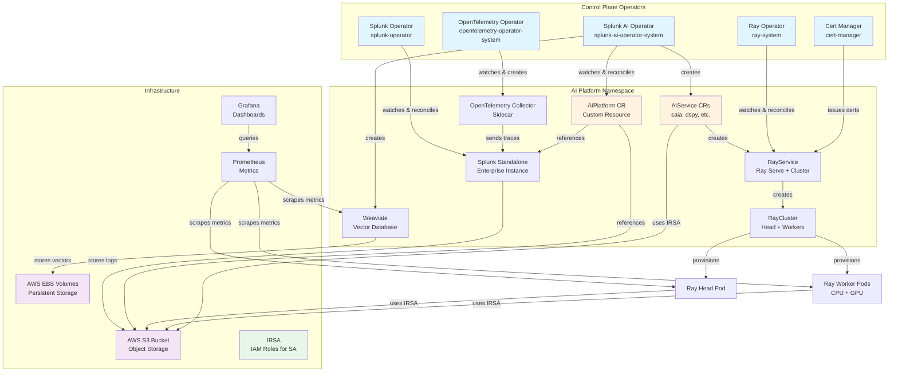
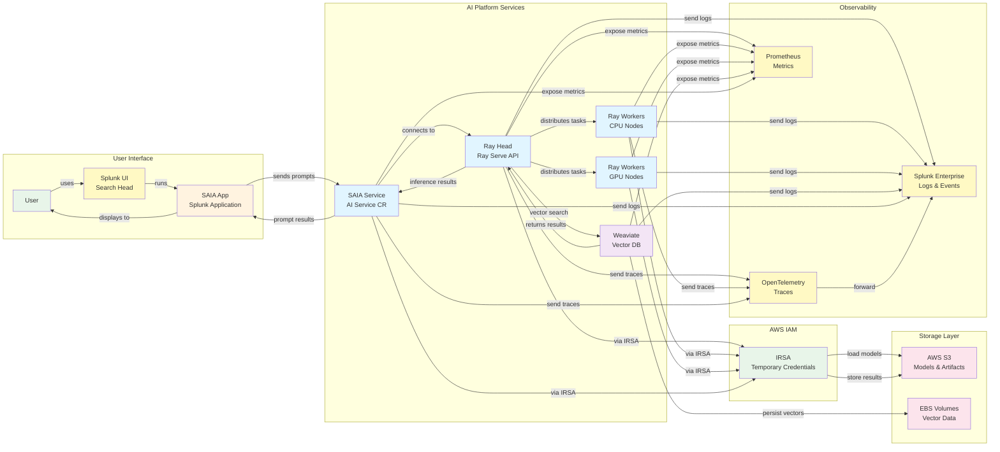
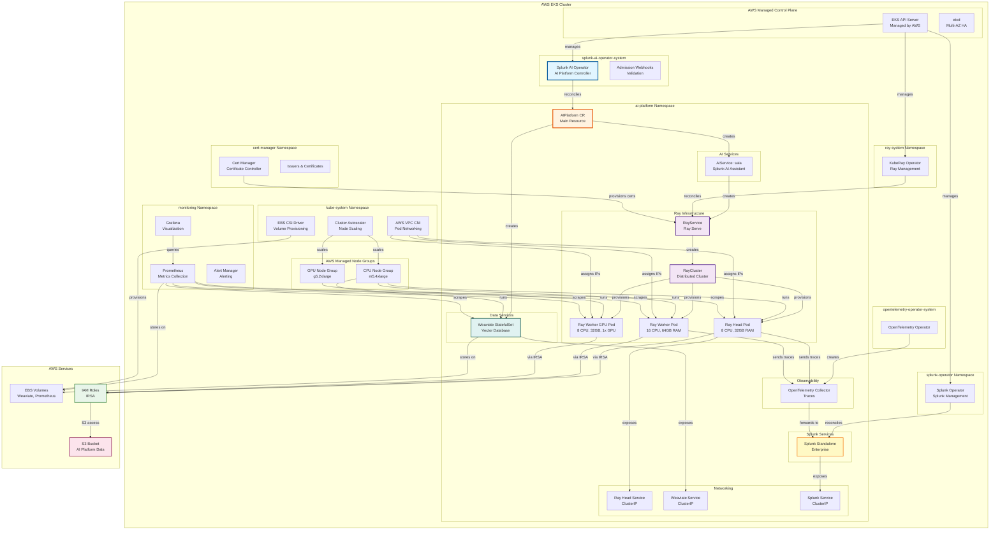

# AWS EKS Deployment for Splunk AI Platform

Complete guide for deploying Splunk AI Platform on AWS Elastic Kubernetes Service (EKS).

## Table of Contents

- [Overview](#overview)
- [Features](#features)
- [Prerequisites](#prerequisites)
- [Quick Start](#quick-start)
- [Configuration](#configuration)
- [Usage](#usage)
- [Architecture](#architecture)
- [Image Pull Secrets](#image-pull-secrets)
- [Advanced Topics](#advanced-topics)
- [Troubleshooting](#troubleshooting)
- [Security](#security)
- [Cost Optimization](#cost-optimization)
- [Migration Guide](#migration-guide)

---

## Overview

The `eks_cluster_with_stack.sh` script deploys the complete Splunk AI Platform on AWS EKS with full AWS integration, supporting:

- **Production AWS deployments** with managed Kubernetes
- **Auto-scaling workloads** with GPU and CPU node groups
- **S3 storage integration** for AI artifacts and models
- **IAM Roles for Service Accounts (IRSA)** for secure AWS access
- **Fully managed control plane** with AWS-managed etcd and API servers

### What is AWS EKS?

[Amazon Elastic Kubernetes Service (EKS)](https://aws.amazon.com/eks/) is a managed Kubernetes service that:
- Runs and scales the Kubernetes control plane across multiple AWS Availability Zones
- Automatically replaces unhealthy control plane nodes
- Provides automated version upgrades and patching
- Integrates with AWS services (IAM, VPC, CloudWatch, ELB)
- Offers 99.95% uptime SLA for the control plane

---

## Features

### Complete AI Platform Stack

The script installs everything needed for the AI Platform:

1. **EKS Cluster** (Kubernetes 1.31-1.34) - AWS-managed control plane
2. **VPC CNI** - Native AWS VPC networking for pods
3. **S3 Bucket** - Object storage for AI artifacts and models
4. **EBS CSI Driver** - Persistent volumes backed by AWS EBS
5. **Cluster Autoscaler** - Automatic node scaling based on demand
6. **Cert-Manager** - Automated certificate management
7. **Object storage** - AWS S3 or external S3-compatible only (MinIO, SeaweedFS, etc.; no in-cluster MinIO install)
8. **Kube-Prometheus Stack** - Monitoring with Prometheus + Grafana
9. **OpenTelemetry Operator** - Distributed tracing and telemetry
10. **NVIDIA Device Plugin** - GPU support for AI workloads
11. **KubeRay Operator** - Ray cluster management for distributed AI
12. **Splunk Operator** - Splunk Enterprise management
13. **Splunk AI Platform Operator** - AI platform orchestration
14. **AI Platform CR** - Complete AI deployment with features

### AWS Integration Features

✅ **IAM Roles for Service Accounts (IRSA)** - Secure AWS access without credentials
✅ **S3 Storage** - Native AWS object storage with versioning and encryption
✅ **EBS Volumes** - High-performance block storage for stateful workloads
✅ **Application Load Balancer (ALB)** - Managed ingress with AWS Load Balancer Controller
✅ **VPC Networking** - Secure private networking with security groups
✅ **CloudWatch Integration** - Centralized logging and monitoring
✅ **Auto Scaling** - Dynamic cluster scaling based on workload demand
✅ **Multi-AZ Deployment** - High availability across availability zones

### Image Pull Secrets Support 🔐

Automatically creates and configures secrets for private container registries:
- **AWS ECR** - Elastic Container Registry (auto-token refresh)
- **Docker Hub** - Docker Hub private repositories (manual setup)
- **GCR** - Google Container Registry (manual setup)
- **ACR** - Azure Container Registry (manual setup)
- **Custom** - Any Docker registry (manual setup)

---

## Prerequisites

### AWS Requirements

#### 1. AWS Account and Credentials

```bash
# Install AWS CLI (macOS)
brew install awscli

# Install AWS CLI (Linux)
curl "https://awscli.amazonaws.com/awscli-exe-linux-x86_64.zip" -o "awscliv2.zip"
unzip awscliv2.zip
sudo ./aws/install

# Configure AWS credentials
aws configure
# Enter:
#   AWS Access Key ID: YOUR_ACCESS_KEY
#   AWS Secret Access Key: YOUR_SECRET_KEY
#   Default region: us-west-2
#   Default output format: json

# Verify credentials
aws sts get-caller-identity
```

#### 2. IAM Permissions

Your AWS user/role needs the following permissions:

**Required Services:**
- **EKS**: Create/manage clusters, node groups
- **EC2**: Create/manage instances, security groups, VPCs, subnets, internet gateways
- **IAM**: Create/manage roles, policies, OIDC providers
- **S3**: Create/manage buckets
- **EBS**: Create/manage volumes
- **CloudFormation**: Create/manage stacks (if using eksctl)

**Recommended IAM Policy:** `AdministratorAccess` for initial setup, or create a custom policy with the specific permissions above.

**Check Current Permissions:**
```bash
# Check if you can create EKS cluster
aws eks describe-cluster --name test-check 2>&1 | grep -q "ResourceNotFoundException" && echo "✓ EKS access granted" || echo "✗ No EKS access"

# Check if you can create IAM roles
aws iam get-role --role-name test-check 2>&1 | grep -q "NoSuchEntity" && echo "✓ IAM access granted" || echo "✗ No IAM access"

# Check S3 access
aws s3 ls &>/dev/null && echo "✓ S3 access granted" || echo "✗ No S3 access"
```

#### 3. VPC Configuration

You need an existing VPC with:
- **Public subnets** (at least 2, in different AZs) - For load balancers and NAT gateways
- **Private subnets** (at least 2, in different AZs) - For EKS nodes
- **Internet Gateway** - For outbound internet access
- **NAT Gateway(s)** - For private subnet internet access

**Find Your VPC:**
```bash
# List all VPCs
aws ec2 describe-vpcs --query 'Vpcs[*].[VpcId,CidrBlock,Tags[?Key==`Name`].Value|[0]]' --output table

# Get subnets for a VPC
aws ec2 describe-subnets --filters "Name=vpc-id,Values=vpc-xxxxx" \
  --query 'Subnets[*].[SubnetId,AvailabilityZone,CidrBlock,MapPublicIpOnLaunch]' --output table
```

**Don't Have a VPC?** The script can work with the default VPC, but for production, create a dedicated VPC:
```bash
# Create VPC with eksctl (automatically creates subnets, IGW, NAT)
eksctl create cluster --name temp-cluster --dry-run --vpc-cidr 10.0.0.0/16
```

#### 4. EC2 Key Pair

Create an SSH key pair for accessing nodes (optional, but recommended for troubleshooting):

```bash
# Create key pair
aws ec2 create-key-pair --key-name splunk-ai-key \
  --query 'KeyMaterial' --output text > ~/.ssh/splunk-ai-key.pem

# Set permissions
chmod 400 ~/.ssh/splunk-ai-key.pem

# Verify
aws ec2 describe-key-pairs --key-names splunk-ai-key
```

#### 5. Service Quotas

Ensure you have sufficient quotas for:

| Resource | Required | Check Command |
|----------|----------|---------------|
| Running On-Demand Standard (A, C, D, H, I, M, R, T, Z) instances | 10+ vCPUs | `aws service-quotas get-service-quota --service-code ec2 --quota-code L-1216C47A` |
| Running On-Demand G instances | 8+ vCPUs (for GPU) | `aws service-quotas get-service-quota --service-code ec2 --quota-code L-DB2E81BA` |
| VPCs per Region | 1+ | `aws service-quotas get-service-quota --service-code vpc --quota-code L-F678F1CE` |
| Internet Gateways per Region | 1+ | `aws service-quotas get-service-quota --service-code vpc --quota-code L-A4707A72` |

**Request Quota Increase:**
```bash
# Example: Request increase for G instances (GPU)
aws service-quotas request-service-quota-increase \
  --service-code ec2 \
  --quota-code L-DB2E81BA \
  --desired-value 64
```

### Local Tools

Install required tools on your local machine:

```bash
# macOS
brew install kubectl helm git jq yq eksctl

# Linux (Ubuntu/Debian)
# kubectl
curl -LO "https://dl.k8s.io/release/$(curl -L -s https://dl.k8s.io/release/stable.txt)/bin/linux/amd64/kubectl"
sudo install -o root -g root -m 0755 kubectl /usr/local/bin/kubectl

# helm
curl https://raw.githubusercontent.com/helm/helm/main/scripts/get-helm-3 | bash

# jq
sudo apt-get install -y jq

# yq
wget https://github.com/mikefarah/yq/releases/latest/download/yq_linux_amd64 -O /usr/local/bin/yq
chmod +x /usr/local/bin/yq

# eksctl
curl --silent --location "https://github.com/weaveworks/eksctl/releases/latest/download/eksctl_$(uname -s)_amd64.tar.gz" | tar xz -C /tmp
sudo mv /tmp/eksctl /usr/local/bin

# Verify installations and check minimum versions
kubectl version --client    # Minimum: v1.28+
helm version               # Minimum: v3.12+
git --version             # Minimum: v2.30+
jq --version              # Minimum: v1.6+
yq --version              # Minimum: v4.30+ (mikefarah/yq, NOT Python yq)
eksctl version            # Minimum: v0.217+ (for K8s 1.34 support)
aws --version             # Minimum: AWS CLI v2.13+

# IMPORTANT: eksctl version determines supported Kubernetes versions
# - eksctl 0.191 supports K8s up to 1.31
# - eksctl 0.217+ supports K8s 1.32, 1.33, 1.34
# If you need K8s 1.32+, upgrade eksctl to latest version
```

### Container Images Configuration

**GOOD NEWS:** The script now automatically configures all container images from a single configuration file! You don't need to manually edit YAML files.

#### How Image Configuration Works

All container images are configured in **`cluster-config.yaml`** under the `images:` section. The script:

1. ✅ **Validates** all images exist in their registries before deployment
2. ✅ **Automatically updates** `artifacts.yaml` and `splunk-operator-cluster.yaml` with your images
3. ✅ **Fails fast** if any images are missing (saves 20+ minutes of waiting)
4. ✅ **Creates backups** of original files (`.original` suffix)

#### Simple Registry Configuration

The `registry` field is automatically prepended to ALL image paths (unless they already have a registry):

**`cluster-config.yaml`:**
```yaml
images:
  # Your private container registry (ECR, Docker Hub, Harbor, etc.)
  registry: "123456789012.dkr.ecr.us-west-2.amazonaws.com"

  # All images below - the script handles registry prefix automatically
  operator:
    image: "splunk-ai-operator:v1.0.0"  # Becomes: registry/splunk-ai-operator:v1.0.0

  splunk:
    image: "splunk/splunk:10.2.0"  # Becomes: registry/splunk/splunk:10.2.0

  ray:
    headImage: "ray/ray-head:v1"  # Becomes: registry/ray/ray-head:v1
    workerImage: "ray/ray-worker:v1"  # Becomes: registry/ray/ray-worker:v1

  weaviate:
    image: "weaviate:1.28.0"  # Becomes: registry/weaviate:1.28.0

  saia:
    apiImage: "saia/api:v1"  # Becomes: registry/saia/api:v1
    dataLoaderImage: "saia/loader:v1"  # Becomes: registry/saia/loader:v1
```

**Result:** ALL images use your private ECR!

#### Mix Public and Private Images

You can also mix images from different registries by specifying full paths:

```yaml
images:
  registry: "123456789012.dkr.ecr.us-west-2.amazonaws.com"

  # Your custom operator in ECR (relative path)
  operator:
    image: "splunk-ai-operator:v1.0.0"
    # → 123456789012.dkr.ecr.us-west-2.amazonaws.com/splunk-ai-operator:v1.0.0

  # Public Splunk from Docker Hub (full path, ignores registry)
  splunk:
    image: "docker.io/splunk/splunk:10.2.0"
    # → docker.io/splunk/splunk:10.2.0 (uses as-is)

  # Your custom Ray in ECR (relative paths)
  ray:
    headImage: "ml-platform/ray/ray-head:build-17"
    # → 123456789012.dkr.ecr.us-west-2.amazonaws.com/ml-platform/ray/ray-head:build-17

  # Public Weaviate from Docker Hub (full path)
  weaviate:
    image: "semitechnologies/weaviate:1.28.0"
    # → semitechnologies/weaviate:1.28.0 (Docker Hub)
```

#### Image Validation

Before cluster creation, the script validates ALL images exist:

```bash
./eks_cluster_with_stack.sh install
```

**Output:**
```
[INFO] Validating image availability in registries...
[INFO]   Checking: 123456789012.dkr.ecr.us-west-2.amazonaws.com/splunk-ai-operator:v1.0.0
[INFO]     ✓ Found (via AWS ECR)
[INFO]   Checking: docker.io/splunk/splunk:10.2.0
[INFO]     ✓ Found (via docker)
...
[INFO] ✓ All images validated successfully - ready for deployment!
```

**If images are missing:**
```
[ERROR] ❌ Image validation FAILED! The following images were not found:
  - 123456789012.dkr.ecr.us-west-2.amazonaws.com/ray/ray-head:v99

Please verify:
1. Image names and tags are correct in cluster-config.yaml
2. You have access to the registries (ECR login, Docker Hub auth)
3. Images have been pushed to the registries

For ECR images, ensure you're logged in:
  aws ecr get-login-password --region us-west-2 | \
    docker login --username AWS --password-stdin 123456789012.dkr.ecr.us-west-2.amazonaws.com
```

**Skip validation (emergency only):**
```bash
SKIP_IMAGE_VALIDATION=true ./eks_cluster_with_stack.sh install
```

#### Idempotent and Safe

The script is **idempotent** - you can run it multiple times safely:

- ✅ **First run:** Creates `.original` backup files of clean YAML manifests
- ✅ **Subsequent runs:** Restores from clean backups, applies fresh configuration
- ✅ **No corruption:** Image paths never get duplicated or stacked
- ✅ **Safe re-runs:** Change images in `cluster-config.yaml` and re-run anytime

**Backup files created:**
```
tools/cluster_setup/
├── artifacts.yaml              # Modified with your images
├── artifacts.yaml.original     # Clean backup (preserved)
├── splunk-operator-cluster.yaml
└── splunk-operator-cluster.yaml.original
```

**To reset to clean state:**
```bash
# Remove modified files and backups
rm -f artifacts.yaml artifacts.yaml.original
rm -f splunk-operator-cluster.yaml splunk-operator-cluster.yaml.original

# Restore clean files from git
git checkout HEAD -- artifacts.yaml splunk-operator-cluster.yaml

# Re-run script to create fresh backups and apply config
./eks_cluster_with_stack.sh install
```

#### Required Images

You must configure these images in `cluster-config.yaml`:

| Image | Config Field | Description |
|-------|--------------|-------------|
| Splunk AI Operator | `operator.image` | Main operator controller |
| Splunk Enterprise | `splunk.image` | Splunk instance for observability |
| Splunk Operator | `splunk.operatorImage` | Splunk CRD controller (optional, has default) |
| Ray Head | `ray.headImage` | Ray cluster head node |
| Ray Worker | `ray.workerImage` | Ray worker nodes (GPU) |
| Weaviate | `weaviate.image` | Vector database |
| SAIA API | `saia.apiImage` | Splunk AI Assistant API |
| SAIA Data Loader | `saia.dataLoaderImage` | SAIA initialization |
| Fluent Bit | `fluentBit.image` | Logging (optional, has default) |

**No manual YAML editing required!** The script handles everything.

---

## Quick Start

**Time to complete:** ~45 minutes

> **✨ NEW:** Automated image configuration and validation! The script now:
> - ✅ Configures all container images from a single config file
> - ✅ Validates images exist before cluster creation (fails fast!)
> - ✅ No manual YAML editing required
> - ✅ Supports mix of private/public registries

### 1. Navigate to Cluster Setup Directory

```bash
cd /path/to/splunk-ai-operator/tools/cluster_setup
```

### 2. Prepare AWS Prerequisites

**✅ Ensure you have:**
- AWS CLI installed and configured (`aws --version`)
- Valid AWS credentials with appropriate permissions
- Existing VPC with public and private subnets in multiple AZs **OR** let eksctl create a new VPC automatically
- Required tools installed: `eksctl`, `kubectl`, `helm`, `jq`, `yq`

**🔐 Set AWS Credentials:**
```bash
# Option 1: Use AWS Profile (recommended)
export AWS_PROFILE=your-profile-name
aws sts get-caller-identity  # Verify you're in the correct account

# Option 2: Use environment variables
export AWS_ACCESS_KEY_ID=your-key
export AWS_SECRET_ACCESS_KEY=your-secret
export AWS_SESSION_TOKEN=your-token  # if using temporary credentials

# Verify your AWS account ID
aws sts get-caller-identity --query Account --output text
```

**⚠️ Important:** The script requires valid AWS credentials to pass preflight checks. You'll get a clear error message if credentials are missing.

**Note about AWS Credentials for Claude Code users:** If you're using Claude Code, you may need to unset AWS credentials that are set for Bedrock, as they will conflict with your actual AWS account credentials:
```bash
unset AWS_ACCESS_KEY_ID AWS_SECRET_ACCESS_KEY AWS_SESSION_TOKEN AWS_PROFILE
export AWS_PROFILE=your-actual-profile
```

### 3. Find Your VPC and Subnets (Optional)

**You have two options:**

**Option A: Let eksctl create a new VPC automatically (Easiest)**
- Skip this step entirely
- Leave the `subnets` section empty in your config file
- eksctl will create a new VPC with proper networking

**Option B: Use an existing VPC with subnets**

```bash
# List all VPCs in your region
aws ec2 describe-vpcs --region us-west-2 \
  --query 'Vpcs[*].[VpcId,CidrBlock,Tags[?Key==`Name`].Value|[0]]' \
  --output table

# Get subnets for your VPC
VPC_ID=vpc-xxxxx  # Replace with your VPC ID
aws ec2 describe-subnets --filters "Name=vpc-id,Values=$VPC_ID" --region us-west-2 \
  --query 'Subnets[*].[SubnetId,AvailabilityZone,CidrBlock,MapPublicIpOnLaunch,Tags[?Key==`Name`].Value|[0]]' \
  --output table

# Find private subnets (MapPublicIpOnLaunch = False)
aws ec2 describe-subnets --filters "Name=vpc-id,Values=$VPC_ID" \
  "Name=map-public-ip-on-launch,Values=false" --region us-west-2 \
  --query 'Subnets[*].[SubnetId,AvailabilityZone]' --output table

# Find public subnets (MapPublicIpOnLaunch = True)
aws ec2 describe-subnets --filters "Name=vpc-id,Values=$VPC_ID" \
  "Name=map-public-ip-on-launch,Values=true" --region us-west-2 \
  --query 'Subnets[*].[SubnetId,AvailabilityZone]' --output table

# IMPORTANT: Verify VPC has NAT Gateway (required for private subnets)
aws ec2 describe-nat-gateways --region us-west-2 \
  --filter "Name=vpc-id,Values=$VPC_ID" "Name=state,Values=available" \
  --query 'NatGateways[*].[NatGatewayId,SubnetId,State]' --output table
```

**Required VPC Networking Components:**
If using existing VPC, ensure it has:
- ✅ At least 2 private subnets in different AZs
- ✅ At least 2 public subnets in different AZs
- ✅ NAT Gateway (at least 1, preferably 1 per AZ for HA)
- ✅ Internet Gateway attached to VPC
- ✅ Private subnets route to NAT Gateway (0.0.0.0/0 → nat-xxxxx)
- ✅ Public subnets route to Internet Gateway (0.0.0.0/0 → igw-xxxxx)

**The script will validate all these requirements during preflight checks.**

### 4. Configure Your Deployment

The script uses a YAML configuration file (`cluster-config.yaml`) for all settings.

**Copy the template:**
```bash
cp cluster-config.yaml my-cluster-config.yaml
```

**Edit the configuration file:**
```bash
vi my-cluster-config.yaml
```

**Minimum required changes:**

```yaml
cluster:
  name: "my-ai-cluster"           # ← CHANGE: Your unique cluster name (DNS-1123 compliant)
  region: "us-west-2"             # ← CHANGE: Your AWS region
  k8sVersion: "1.31"              # Kubernetes version (1.29, 1.30, 1.31)

  # Option A: Leave subnets empty to create new VPC automatically
  # Option B: Provide existing subnet IDs (eksctl auto-detects VPC from subnets)
  subnets:
    private:                      # ← OPTIONAL: Your private subnet IDs
      - id: "subnet-0f4af6..."    #             (at least 2, different AZs)
        az: "us-west-2b"          #             Include the AZ for each subnet
      - id: "subnet-024d4e..."
        az: "us-west-2c"
    public:                       # ← OPTIONAL: Your public subnet IDs
      - id: "subnet-0439b4..."    #             (at least 2, different AZs)
        az: "us-west-2b"
      - id: "subnet-06aef8..."
        az: "us-west-2c"

storage:
  s3Bucket: "my-ai-platform-bucket"  # ← CHANGE: Globally unique S3 bucket name
                                      #          (3-63 chars, lowercase, numbers, hyphens)
```

**Generic object store (`storage.objectStore.type`)**  
Only **AWS S3** or **external S3-compatible** storage is supported (no in-cluster MinIO install). Set `storage.objectStore.type` to `aws`, `s3compat`, `minio`, or `seaweedfs` (default is `aws` when unset). The script sets the AIPlatform `objectStorage.path` and creates a credentials secret for s3compat/minio/seaweedfs; you must provide `endpoint` and credentials. See [Object Storage Selection](../../docs/configuration/object-storage.md).

**External S3-compatible (MinIO, SeaweedFS, etc.)**  
Set `storage.objectStore.type` to `minio`, `s3compat`, or `seaweedfs`, and set `storage.objectStore.endpoint` (e.g. `http://<host>:9000` for MinIO) and credentials. You can run MinIO or SeaweedFS on EC2 or elsewhere; use `install_minio_ec2.sh` to install MinIO on an EC2 in the same VPC if desired. Pre-populate artifacts before cluster setup. The Splunk app (when using `splunkStandalone.localAppPath`) is not uploaded to external object storage automatically; upload it to your bucket at `apps/` via console or `mc`/`aws s3 --endpoint-url`.

**S3-compatible / SeaweedFS (bring your own)**  
- **Generic (`s3compat`):** Set `storage.objectStore.type: s3compat`, `storage.objectStore.endpoint`, `storage.objectStore.bucket`, and credentials. The script creates the credentials secret and sets the path to `s3compat://bucket`; it does not install any storage. Use for any S3-compatible backend (Ceph, custom gateway, etc.).
- **SeaweedFS:** Set `storage.objectStore.type: seaweedfs`, `storage.objectStore.endpoint` (e.g. `http://seaweedfs-s3:8333`), `storage.objectStore.bucket`, and credentials (env `MINIO_ROOT_USER`/`MINIO_ROOT_PASSWORD` or `objectStore.auth`). The script does not install SeaweedFS; it only creates the credentials secret and sets the AIPlatform path to `seaweedfs://bucket`. Ensure your SeaweedFS S3 gateway is reachable from the cluster.

**Ensuring SeaweedFS is used (not MinIO)**  
To force the stack to use SeaweedFS instead of MinIO:

1. **Config:** In `cluster-config.yaml` set `storage.objectStore.type: "seaweedfs"` and `storage.objectStore.endpoint` to your SeaweedFS S3 URL with **port 8333** (e.g. `http://3.144.157.201:8333`). MinIO uses port 9000; using 8333 avoids pointing at MinIO by mistake.
2. **Preflight:** When you run the install script, preflight prints `Object storage: external S3-compatible (seaweedfs)` and `SeaweedFS endpoint: ...`. If the endpoint shows `:9000`, the script warns you to use `:8333` for SeaweedFS.
3. **After install:** Confirm the AIPlatform CR uses SeaweedFS:
   ```bash
   kubectl -n ai-platform get aiplatform -o yaml | grep -A6 objectStorage
   ```
   You should see `path: seaweedfs://<bucket>` and `endpoint: "http://...:8333"`. The secret name remains `minio-credentials` (used for any S3-compatible store).

**Secure MinIO credentials (recommended)**  
The script reads MinIO credentials in this order: **environment variables first**, then config file. Prefer not storing passwords in `cluster-config.yaml` (e.g. to avoid committing secrets to Git).

| Approach | How | When to use |
|----------|-----|-------------|
| **Environment variables** | Export before running the script: `export MINIO_ROOT_USER=minioadmin` and `export MINIO_ROOT_PASSWORD='<your-password>'`. You can leave `storage.objectStore.auth.rootUser` / `rootPassword` empty or omit them in config; env takes precedence. | Local runs, CI/CD (set secrets in pipeline), one-off setups. |
| **Config file only** | Set `storage.objectStore.auth.rootUser` and `storage.objectStore.auth.rootPassword` in `cluster-config.yaml`. | Quick testing only; avoid if the file is in version control. |
| **Pre-created Kubernetes Secret** | Create the secret yourself (e.g. from Vault or AWS Secrets Manager) in the AI platform namespace as `minio-credentials` with keys `s3_access_key` and `s3_secret_key`. The script can still create the secret from env/config; for stricter control, use a separate flow that only references the existing secret. | GitOps, when you already have a secrets pipeline. |
| **External secret manager** | Store credentials in AWS Secrets Manager, HashiCorp Vault, or similar. Before running the script, fetch the secret and set `MINIO_ROOT_USER` and `MINIO_ROOT_PASSWORD` (e.g. via a wrapper or CI step). Do not put the password in config. | Production; keeps secrets out of config and Git. |

Example (MinIO credentials from environment only; no secrets in config):

```bash
export MINIO_ROOT_USER=minioadmin
export MINIO_ROOT_PASSWORD='your-secure-password'
CONFIG_FILE=./cluster-config.yaml ./eks_cluster_with_stack.sh install
```

**Idempotency and existing VPC**  
- The install is **idempotent**: if the EKS cluster already exists, the script skips cluster creation and only runs reconcile (addons, operators, AIPlatform). Set `cluster.useExisting: true` to require an existing cluster (script fails if the cluster is not found).
- **Use an existing VPC:** Provide `cluster.subnets` (private and public subnet IDs and AZs). eksctl will use that VPC and will not create a new one.

**Important Notes:**
- **Cluster Name**: Must be DNS-1123 compliant (lowercase letters, numbers, hyphens; start/end with alphanumeric)
- **S3 Bucket**: Must be globally unique across all AWS accounts (ignored when MinIO is enabled)
- **Subnets**: If provided, script validates NAT Gateway, Internet Gateway, and route tables exist; cluster uses this existing VPC
- **Subnets**: Leave empty or comment out to let eksctl create a new VPC automatically

**What each section configures:**

| Section | What It Does | Required Changes |
|---------|--------------|------------------|
| `cluster.name` | EKS cluster name | ✅ **REQUIRED:** Change to your cluster name |
| `cluster.region` | AWS region | ✅ **REQUIRED:** Change to your region |
| `cluster.useExisting` | Use existing cluster only (do not create) | ⚙️ Set `true` to skip cluster creation; script fails if cluster not found |
| `cluster.subnets` | VPC subnets for nodes | ⚙️ **OPTIONAL:** Leave empty for new VPC or provide existing subnet IDs to use existing VPC |
| `storage.s3Bucket` | S3 bucket for AI artifacts (used when `objectStore.type` is aws) | ✅ **REQUIRED** if not using MinIO/SeaweedFS |
| `storage.objectStore` | Object store: `type` (aws \| s3compat \| minio \| seaweedfs), `bucket`, `endpoint`, `auth`. Default type is `aws` when unset. External only (no in-cluster install). | ⚙️ Required for s3compat/minio/seaweedfs: set `endpoint` and credentials. See [Object Storage Selection](../../docs/configuration/object-storage.md). |
| `images.registry` | Container registry URL | ✅ **REQUIRED:** Your ECR/Docker registry |
| `images.*` | All container images | ✅ **REQUIRED:** Configure all image paths |
| `nodeGroups.cpu` | CPU node group settings | ⚙️ Optional: adjust size/type |
| `nodeGroups.gpu` | GPU node group settings | ⚙️ Optional: adjust size/type |
| `aiPlatform` | AI Platform configuration | ⚙️ Optional: customize features |

### 5. Configure Container Images ⚠️ CRITICAL

**This is the most important configuration step!** All container images must be specified correctly.

**Update the `images:` section in your config file:**

```yaml
images:
  # Your container registry (ECR, Docker Hub, Harbor, etc.)
  registry: "123456789012.dkr.ecr.us-west-2.amazonaws.com"  # ← CHANGE THIS

  operator:
    image: "splunk-ai-operator:v1.0.0"  # ← CHANGE: Your operator image

  splunk:
    image: "splunk/splunk:10.2.0"  # ← CHANGE: Splunk Enterprise image
    operatorImage: "docker.io/splunk/splunk-operator:3.0.0"  # ← OPTIONAL (has default)

  ray:
    headImage: "ml-platform/ray/ray-head:build-17"  # ← CHANGE: Ray head image path
    workerImage: "ml-platform/ray/ray-worker-gpu:build-17"  # ← CHANGE: Ray worker image path

  weaviate:
    image: "semitechnologies/weaviate:1.28.0"  # ← CHANGE: Weaviate database

  saia:
    apiImage: "ml-platform/saia/saia-api:build-1"  # ← CHANGE: SAIA API image path
    dataLoaderImage: "ml-platform/saia/saia-data-loader:build-1"  # ← CHANGE: SAIA loader

  fluentBit:
    image: "fluent/fluent-bit:1.9.6"  # ← OPTIONAL (has default)
```

**Tips:**
- Use **relative paths** (no registry prefix) for images in your private registry
  - Example: `"ray/ray-head:v1"` becomes `registry/ray/ray-head:v1`

- Use **full paths** for public Docker Hub images
  - Example: `"docker.io/splunk/splunk:10.2.0"` stays as-is

**The script will validate ALL images exist before deployment!**

### 6. Login to Container Registries

**For AWS ECR:**
```bash
# Login to your ECR registry
aws ecr get-login-password --region us-west-2 | \
  docker login --username AWS --password-stdin 123456789012.dkr.ecr.us-west-2.amazonaws.com
```

**For Docker Hub (if using private images):**
```bash
docker login
```

**Verify image access:**
```bash
# Test pull one of your images
docker pull 123456789012.dkr.ecr.us-west-2.amazonaws.com/ray/ray-head:v1
```

**Optional customizations:**

```yaml
nodeGroups:
  cpu:
    instanceType: "m5.xlarge"      # ← Change for different CPU capacity
    desiredCapacity: 4             # ← Adjust number of CPU nodes
    volumeSize: 500                # ← Adjust disk size (GB)

  gpu:
    enabled: true                  # ← Set false to skip GPU nodes
    instanceType: "g6e.12xlarge"   # ← Change for different GPU type
    desiredCapacity: 2             # ← Adjust number of GPU nodes
```

### 7. Deploy the Cluster

```bash
# Run the installation with your configuration file
CONFIG_FILE=./my-cluster-config.yaml ./eks_cluster_with_stack.sh install

# Installation takes approximately 30-45 minutes
# The script will show progress for each step
```

**What happens immediately:**
```
[INFO] Loading configuration from: ./my-cluster-config.yaml
[INFO] Validating image configuration...
[INFO] ✓ Image configuration validated successfully
[INFO] Configuring container images in manifest files...
[INFO] ✓ All images configured successfully
[INFO] Validating image availability in registries...
[INFO]   Checking: 123456789012.dkr.ecr.us-west-2.amazonaws.com/splunk-ai-operator:v1.0.0
[INFO]     ✓ Found (via AWS ECR)
[INFO]   Checking: 123456789012.dkr.ecr.us-west-2.amazonaws.com/ray/ray-head:build-17
[INFO]     ✓ Found (via AWS ECR)
[INFO]   ... (checking all 9 images)
[INFO] ✓ All images validated successfully - ready for deployment!
[INFO] Region: us-west-2, Account: 123456789012, Cluster: my-ai-cluster
[INFO] Starting preflight checks...
```

**💡 TIP:** The script validates images exist BEFORE starting cluster creation. This saves 20+ minutes if any images are misconfigured!

**📋 Deployment Steps (30-45 minutes total):**
1. **Configuration & Validation** (1-2 min) ⚡ NEW!
   - ✓ Validates configuration file
   - ✓ Validates ALL container images exist
   - ✓ Updates manifest files automatically
   - ✓ Creates backups

2. **Preflight Checks** (1 min)
   - ✓ Checks AWS credentials
   - ✓ Verifies subnets exist (if provided)
   - ✓ Validates NAT Gateway & Internet Gateway
   - ✓ Checks required tools

3. **Create EKS Cluster** (10-15 min)
   - ✓ Creates managed control plane
   - ✓ Sets up node groups (CPU + GPU)

4. **Install Infrastructure** (10-15 min)
   - ✓ EBS CSI Driver (for persistent volumes)
   - ✓ Cluster Autoscaler (for node scaling)
   - ✓ VPC CNI (for pod networking)

5. **Install Platform Components** (15-20 min)
   - ✓ Cert Manager (certificates)
   - ✓ Prometheus + Grafana (monitoring)
   - ✓ OpenTelemetry (tracing)
   - ✓ NVIDIA GPU Operator (GPU support)
   - ✓ KubeRay Operator (Ray clusters)
   - ✓ Splunk Operator (Splunk management)

6. **Deploy AI Platform** (5-10 min)
   - ✓ Creates S3 bucket
   - ✓ Sets up IAM roles (IRSA)
   - ✓ Installs Splunk AI Operator (with your images!)
   - ✓ Creates AIPlatform CR
   - ✓ Deploys AI services

**What Happens During Installation:**
1. ✓ Creates EKS cluster with control plane (5-10 minutes)
2. ✓ Creates managed node groups (CPU and GPU) (5-10 minutes)
3. ✓ Installs AWS Load Balancer Controller
4. ✓ Installs EBS CSI driver
5. ✓ Installs Cluster Autoscaler
6. ✓ Installs cert-manager
7. ✓ Installs monitoring stack (Prometheus, Grafana)
8. ✓ Installs OpenTelemetry
9. ✓ Installs NVIDIA GPU support
10. ✓ Installs Ray operator
11. ✓ Installs Splunk operator
12. ✓ Creates Splunk Standalone instance
13. ✓ Installs Splunk AI Platform operator
14. ✓ Creates S3 bucket and IAM roles
15. ✓ Creates ECR image pull secrets
16. ✓ Deploys AIPlatform CR

### 4. Verify Installation

After running `eks_cluster_with_stack.sh install` (or upgrade) with the latest operator image, use the commands below to verify the setup. Default namespace and AIPlatform name come from `cluster-config.yaml` (`aiPlatform.namespace` and `aiPlatform.name`); if you use a custom config, set `AI_NS` and `AI_PLATFORM_NAME` accordingly.

```bash
# Set kubeconfig (done automatically by script)
export KUBECONFIG=~/.kube/config

# ----- Optional: load namespace/name from your config -----
# CONFIG_FILE="${CONFIG_FILE:-./cluster-config.yaml}"
# AI_NS="$(yq eval '.aiPlatform.namespace' "$CONFIG_FILE")"
# AI_PLATFORM_NAME="$(yq eval '.aiPlatform.name' "$CONFIG_FILE")"
# Or use defaults:
export AI_NS="${AI_NS:-ai-platform}"
export AI_PLATFORM_NAME="${AI_PLATFORM_NAME:-splunk-ai-stack}"
export SPLUNK_AI_NS="${SPLUNK_AI_NS:-splunk-ai-operator-system}"
```

**1. Cluster and nodes**

```bash
kubectl get nodes
kubectl get nodes -o wide
```

**2. Splunk AI Operator (confirm it is running the image you deployed)**

```bash
kubectl get deploy -n "$SPLUNK_AI_NS" -l app.kubernetes.io/name=splunk-ai-operator -o wide
kubectl get pods -n "$SPLUNK_AI_NS" -l app.kubernetes.io/name=splunk-ai-operator
# Show operator image (replace deployment name if different)
kubectl get deploy -n "$SPLUNK_AI_NS" -o jsonpath='{.items[0].spec.template.spec.containers[0].image}'; echo
```

**3. AIPlatform CR and status**

```bash
kubectl get aiplatform "$AI_PLATFORM_NAME" -n "$AI_NS"
kubectl get aiplatform "$AI_PLATFORM_NAME" -n "$AI_NS" -o jsonpath='{.status.conditions[*].type}{"\n"}{.status.conditions[*].status}'; echo
# Detailed readiness (expect Ready=True when healthy)
kubectl get aiplatform "$AI_PLATFORM_NAME" -n "$AI_NS" -o jsonpath='{.status.conditions[?(@.type=="Ready")]}' | jq .
```

**4. Object storage secret (MinIO/S3 credentials for serve config)**

```bash
# Secret name comes from AIPlatform spec.objectStorage.secretRef
SECRET_NAME="$(kubectl get aiplatform "$AI_PLATFORM_NAME" -n "$AI_NS" -o jsonpath='{.spec.objectStorage.secretRef}')"
echo "SecretRef: ${SECRET_NAME:-<not set>}"
kubectl get secret "${SECRET_NAME:-minio-credentials}" -n "$AI_NS" 2>/dev/null && echo "✓ Secret exists" || echo "✗ Secret missing"
kubectl get secret "${SECRET_NAME:-minio-credentials}" -n "$AI_NS" -o jsonpath='{.data}' 2>/dev/null | jq -r 'keys[]' | grep -E 's3_access_key|s3_secret_key' && echo "✓ Required keys present" || echo "✗ Check s3_access_key / s3_secret_key"
```

**5. RayService and serve config (MinIO credentials in apps)**

```bash
kubectl get rayservice "$AI_PLATFORM_NAME" -n "$AI_NS"
# Count MINIO_ACCESS_KEY in serve config (expect > 0 when using MinIO)
kubectl get rayservice "$AI_PLATFORM_NAME" -n "$AI_NS" -o jsonpath='{.spec.serveConfigV2}' | grep -o 'MINIO_ACCESS_KEY' | wc -l
```

**6. Ray and application pods**

```bash
kubectl get pods -n "$AI_NS" -l ray.io/cluster="$AI_PLATFORM_NAME"
kubectl get pods -n "$AI_NS" -l ai.splunk.com/platform="$AI_PLATFORM_NAME"
```

**7. Services (Ray Serve, Weaviate)**

```bash
kubectl get svc -n "$AI_NS" -l ray.io/cluster="$AI_PLATFORM_NAME"
kubectl get svc -n "$AI_NS" | grep -E "ray|weaviate"
```

**8. Events (recent issues)**

```bash
kubectl get events -n "$AI_NS" --sort-by='.lastTimestamp' | tail -30
kubectl describe aiplatform "$AI_PLATFORM_NAME" -n "$AI_NS" | tail -40
```

**Quick one-liner summary**

```bash
echo "--- Operator ---"; kubectl get deploy -n "$SPLUNK_AI_NS" -o 'custom-columns=NAME:.metadata.name,READY:.status.readyReplicas,IMAGE:.spec.template.spec.containers[0].image'
echo "--- AIPlatform ---"; kubectl get aiplatform "$AI_PLATFORM_NAME" -n "$AI_NS" -o 'custom-columns=NAME:.metadata.name,READY:.status.conditions[0].status'
echo "--- RayService ---"; kubectl get rayservice "$AI_PLATFORM_NAME" -n "$AI_NS"
echo "--- Pods ---"; kubectl get pods -n "$AI_NS" --no-headers | wc -l; kubectl get pods -n "$AI_NS" | head -20
```

---

## Configuration

### EKS Cluster Configuration

The script uses a YAML configuration file (`cluster-config.yaml`) for all settings. Configuration is loaded from the file specified by the `CONFIG_FILE` environment variable (defaults to `./cluster-config.yaml`).

#### Configuration File Structure

```yaml
# cluster-config.yaml

cluster:
  name: "my-ai-cluster"              # EKS cluster name (DNS-1123 compliant)
  region: "us-west-2"                # AWS region
  k8sVersion: "1.31"                 # Kubernetes version (1.29, 1.30, 1.31)

  subnets:                           # Optional - leave empty for auto VPC creation
    private:                         # Private subnets (at least 2, different AZs)
      - id: "subnet-xxxxx"
        az: "us-west-2a"
      - id: "subnet-yyyyy"
        az: "us-west-2b"
    public:                          # Public subnets (at least 2, different AZs)
      - id: "subnet-zzzzz"
        az: "us-west-2a"
      - id: "subnet-wwwww"
        az: "us-west-2b"

nodeGroups:
  cpu:
    enabled: true                    # Enable CPU node group
    instanceType: "m5.xlarge"        # CPU instance type
    desiredCapacity: 4               # Initial number of nodes
    minSize: 2                       # Minimum nodes for autoscaling
    maxSize: 8                       # Maximum nodes for autoscaling
    volumeSize: 500                  # EBS volume size in GB
    volumeType: "gp3"                # EBS volume type (gp3, gp2, io1, io2)

  gpu:
    enabled: true                    # Enable GPU node group
    instanceType: "g6e.12xlarge"     # GPU instance type
    desiredCapacity: 2               # Initial number of nodes
    minSize: 2                       # Minimum nodes
    maxSize: 4                       # Maximum nodes
    volumeSize: 1000                 # EBS volume size in GB
    volumeType: "gp3"                # EBS volume type

storage:
  s3Bucket: "my-ai-platform-bucket"  # S3 bucket for artifacts/apps/tasks
  storageClass: "gp3"                # Default storage class for PVCs
  vectorDbSize: "50Gi"               # VectorDB PVC size

operators:
  splunk:
    image: "splunk/splunk:10.2.0-dev1"  # Splunk Enterprise image
  ray:
    version: "v1.2.2"                          # Ray operator version
  nvidia:
    devicePluginVersion: "v0.17.3"             # NVIDIA device plugin version

aiPlatform:
  namespace: "ai-platform"           # Kubernetes namespace
  name: "splunk-ai-stack"            # AIPlatform CR name
  serviceAccounts:                   # Service accounts for IRSA
    rayHead: "ray-head-sa"
    rayWorker: "ray-worker-sa"
    saiaService: "saia-service-sa"
  defaultAcceleratorType: "L40S"     # Default GPU type
  workerGroupConfig:
    serviceAccountName: "ray-worker-sa"
    imageRegistry: ""                # Leave empty for default
  ingress:
    enabled: false                   # Enable ingress (requires ingress controller)
    className: "nginx"
    host: "ai.example.com"
    tlsSecretName: "ai-platform-tls"

splunkStandalone:
  name: "splunk-standalone"          # Splunk Standalone CR name
  serviceAccount: "saia-service-sa"  # Service account for S3 access
  localAppPath: ""                   # Optional: local path to Splunk app to upload

files:
  splunkOperatorManifest: "./splunk-operator-cluster.yaml"
  splunkAiOperatorManifest: "./artifacts.yaml"
```

#### Using Custom Configuration File

```bash
# Specify custom config file
CONFIG_FILE=./my-custom-config.yaml ./eks_cluster_with_stack.sh install

# Or set it as environment variable
export CONFIG_FILE=./my-custom-config.yaml
./eks_cluster_with_stack.sh install
```

### Configuration Examples

#### Example 1: Development Cluster (Cost-Optimized, Auto VPC)

```yaml
# dev-cluster-config.yaml - Minimal setup for development/testing

cluster:
  name: "dev-ai-platform"
  region: "us-west-2"
  k8sVersion: "1.31"
  # No subnets specified - eksctl creates new VPC automatically

nodeGroups:
  cpu:
    enabled: true
    instanceType: "m5.xlarge"        # 4 vCPU, 16GB RAM (smaller)
    desiredCapacity: 2
    minSize: 1
    maxSize: 4
    volumeSize: 200                  # Smaller disk
    volumeType: "gp3"

  gpu:
    enabled: false                   # Disable GPU to save costs

storage:
  s3Bucket: "dev-ai-platform-data"
  storageClass: "gp3"
  vectorDbSize: "20Gi"               # Smaller vector DB

operators:
  splunk:
    image: "splunk/splunk:10.2.0-dev1"
  ray:
    version: "v1.2.2"

aiPlatform:
  namespace: "ai-platform"
  name: "splunk-ai-stack"
  defaultAcceleratorType: "L40S"

splunkStandalone:
  name: "splunk-standalone"
  serviceAccount: "saia-service-sa"
```

#### Example 2: Production Cluster (High Availability, Existing VPC)

```yaml
# prod-cluster-config.yaml - Production-ready setup

cluster:
  name: "prod-ai-platform"
  region: "us-west-2"
  k8sVersion: "1.31"
  subnets:
    private:                         # 3 AZs for high availability
      - id: "subnet-private-2a"
        az: "us-west-2a"
      - id: "subnet-private-2b"
        az: "us-west-2b"
      - id: "subnet-private-2c"
        az: "us-west-2c"
    public:
      - id: "subnet-public-2a"
        az: "us-west-2a"
      - id: "subnet-public-2b"
        az: "us-west-2b"
      - id: "subnet-public-2c"
        az: "us-west-2c"

nodeGroups:
  cpu:
    enabled: true
    instanceType: "m5.4xlarge"       # 16 vCPU, 64GB RAM
    desiredCapacity: 5               # Higher capacity
    minSize: 3                       # Never go below 3
    maxSize: 20                      # Allow scaling to 20
    volumeSize: 500
    volumeType: "gp3"

  gpu:
    enabled: true
    instanceType: "g5.2xlarge"       # 1x A10G GPU
    desiredCapacity: 2
    minSize: 1
    maxSize: 10
    volumeSize: 1000
    volumeType: "gp3"

storage:
  s3Bucket: "prod-ai-platform-data"
  storageClass: "gp3"
  vectorDbSize: "200Gi"              # Large vector DB

operators:
  splunk:
    image: "splunk/splunk:10.2.0-dev1"
  ray:
    version: "v1.2.2"

aiPlatform:
  namespace: "ai-platform"
  name: "splunk-ai-stack"
  defaultAcceleratorType: "L40S"
  ingress:
    enabled: true                    # Enable ingress for production
    className: "nginx"
    host: "ai.production.example.com"
    tlsSecretName: "ai-platform-tls"
```

#### Example 3: GPU-Heavy Workload

```yaml
# gpu-heavy-config.yaml - For AI training/inference intensive workloads

cluster:
  name: "ai-training-cluster"
  region: "us-east-1"                # Check GPU availability
  k8sVersion: "1.31"
  # Auto-create VPC with sufficient capacity

nodeGroups:
  cpu:
    enabled: true
    instanceType: "m5.xlarge"        # Minimal CPU
    desiredCapacity: 2
    minSize: 1
    maxSize: 4
    volumeSize: 200
    volumeType: "gp3"

  gpu:
    enabled: true
    instanceType: "g5.12xlarge"      # 4x A10G GPUs, 48 vCPU, 192GB RAM
    desiredCapacity: 4               # More GPU nodes
    minSize: 2
    maxSize: 10
    volumeSize: 2000                 # Large volumes for models
    volumeType: "gp3"

storage:
  s3Bucket: "ai-training-platform-data"
  storageClass: "gp3"
  vectorDbSize: "100Gi"

operators:
  splunk:
    image: "splunk/splunk:10.2.0-dev1"
  ray:
    version: "v1.2.2"

aiPlatform:
  namespace: "ai-platform"
  name: "splunk-ai-stack"
  defaultAcceleratorType: "L40S"
```

### Instance Type Selection Guide

#### CPU Instance Types (For Ray head, Weaviate, general workloads)

| Instance Type | vCPU | Memory | Network | Use Case | Approx Cost/hr |
|---------------|------|--------|---------|----------|----------------|
| m5.xlarge | 4 | 16 GB | Up to 10 Gbps | Dev/Test | $0.19 |
| m5.2xlarge | 8 | 32 GB | Up to 10 Gbps | Small Production | $0.38 |
| m5.4xlarge | 16 | 64 GB | Up to 10 Gbps | **Recommended** | $0.77 |
| m5.8xlarge | 32 | 128 GB | 10 Gbps | Large Production | $1.54 |
| c5.4xlarge | 16 | 32 GB | Up to 10 Gbps | Compute-Optimized | $0.68 |
| r5.4xlarge | 16 | 128 GB | Up to 10 Gbps | Memory-Optimized | $1.01 |

#### GPU Instance Types (For AI training/inference)

| Instance Type | GPUs | GPU Memory | vCPU | Memory | Use Case | Approx Cost/hr |
|---------------|------|------------|------|--------|----------|----------------|
| g5.xlarge | 1x A10G | 24 GB | 4 | 16 GB | Dev/Small Models | $1.01 |
| g5.2xlarge | 1x A10G | 24 GB | 8 | 32 GB | **Recommended** | $1.21 |
| g5.4xlarge | 1x A10G | 24 GB | 16 | 64 GB | Large Single-GPU | $1.62 |
| g5.12xlarge | 4x A10G | 96 GB | 48 | 192 GB | Multi-GPU Training | $5.67 |
| p3.2xlarge | 1x V100 | 16 GB | 8 | 61 GB | ML Training | $3.06 |
| p4d.24xlarge | 8x A100 | 320 GB | 96 | 1152 GB | Large-Scale Training | $32.77 |

**Note:** Prices are approximate for US East/West regions and may vary. Check [AWS Pricing](https://aws.amazon.com/ec2/pricing/on-demand/) for current rates.

---

## Usage

### Basic Commands

```bash
# Install EKS cluster and AI Platform
./eks_cluster_with_stack.sh install

# Delete entire cluster and all AWS resources
./eks_cluster_with_stack.sh delete

# Full cleanup (including S3 buckets, IAM roles)
./eks_cluster_with_stack.sh delete-full

# Check AIPlatform status
./eks_cluster_with_stack.sh status
```

### Post-Installation Tasks

#### 1. Access the Cluster

```bash
# Kubeconfig is automatically configured
kubectl get nodes

# Or explicitly set
export KUBECONFIG=~/.kube/config
aws eks update-kubeconfig --name ${CLUSTER_NAME} --region ${REGION}

# Verify connection
kubectl cluster-info
```

#### 2. Check Installation Status

```bash
# Check AI Platform status
kubectl get aiplatform -n ai-platform

# Check AIServices
kubectl get aiservice -n ai-platform

# Check Ray clusters
kubectl get rayservice -n ai-platform

# Check all pods
kubectl get pods -n ai-platform

# View AIPlatform details
kubectl describe aiplatform -n ai-platform
```

#### 3. Access MinIO Console (Not applicable for EKS - uses S3)

EKS deployment uses AWS S3 instead of MinIO. Access your data via:

```bash
# List S3 bucket contents
aws s3 ls s3://splunk-ai-platform-data-${CLUSTER_NAME}/ --recursive

# Download artifacts
aws s3 sync s3://splunk-ai-platform-data-${CLUSTER_NAME}/artifacts ./local-artifacts

# Upload models
aws s3 cp ./my-model.pkl s3://splunk-ai-platform-data-${CLUSTER_NAME}/models/
```

#### 4. Access Splunk Enterprise

```bash
# Get Splunk admin password
kubectl get secret splunk-splunk-standalone-standalone-secret-v1 \
  -n ai-platform \
  -o jsonpath='{.data.password}' | base64 -d

# Port forward Splunk Web UI
kubectl port-forward -n ai-platform \
  svc/splunk-standalone-standalone-service 8000:8000

# Access at http://localhost:8000
# Username: admin
# Password: (from above command)
```

#### 5. Access Prometheus/Grafana

```bash
# Prometheus
kubectl port-forward -n monitoring svc/kube-prometheus-stack-prometheus 9090:9090
# Access at http://localhost:9090

# Grafana
kubectl port-forward -n monitoring svc/kube-prometheus-stack-grafana 3000:80
# Access at http://localhost:3000
# Get password: kubectl get secret -n monitoring kube-prometheus-stack-grafana \
#   -o jsonpath='{.data.admin-password}' | base64 -d
```

#### 6. Access Ray Dashboard

```bash
# Find Ray head service
kubectl get svc -n ai-platform | grep head

# Port forward Ray dashboard
kubectl port-forward -n ai-platform svc/<ray-head-svc> 8265:8265

# Access at http://localhost:8265
```

### Updating the Cluster

#### Update Node Group Size

```bash
# Scale CPU nodes
aws eks update-nodegroup-config \
  --cluster-name ${CLUSTER_NAME} \
  --nodegroup-name cpu-nodes \
  --scaling-config minSize=3,maxSize=15,desiredSize=5

# Scale GPU nodes
aws eks update-nodegroup-config \
  --cluster-name ${CLUSTER_NAME} \
  --nodegroup-name gpu-nodes \
  --scaling-config minSize=1,maxSize=5,desiredSize=2
```

#### Update Kubernetes Version

```bash
# Check current version
aws eks describe-cluster --name ${CLUSTER_NAME} --query cluster.version

# Update control plane
aws eks update-cluster-version --name ${CLUSTER_NAME} --kubernetes-version 1.29

# Wait for update to complete (check status)
aws eks describe-update --name ${CLUSTER_NAME} --update-id <update-id>

# Update node groups after control plane is updated
aws eks update-nodegroup-version \
  --cluster-name ${CLUSTER_NAME} \
  --nodegroup-name cpu-nodes
```

#### Update AI Platform Operator

```bash
# Update operator image
kubectl set image deployment/splunk-ai-operator-controller-manager \
  manager=docker.io/splunk/splunk-ai-operator:0.1.0 \
  -n splunk-ai-operator-system

# Restart operator
kubectl rollout restart deployment/splunk-ai-operator-controller-manager \
  -n splunk-ai-operator-system

# Verify update
kubectl get deployment splunk-ai-operator-controller-manager \
  -n splunk-ai-operator-system \
  -o jsonpath='{.spec.template.spec.containers[0].image}'
```

---

## Architecture

### EKS Cluster Architecture

```
┌─────────────────────────────────────────────────────────────┐
│                AWS EKS Control Plane                        │
│                (Managed by AWS)                             │
│  ┌──────────────┐  ┌──────────────┐  ┌──────────────┐     │
│  │ API Server   │  │    etcd      │  │  Scheduler   │     │
│  │   :6443      │  │ (HA, Multi-AZ)│  │              │     │
│  └──────┬───────┘  └──────────────┘  └──────────────┘     │
└─────────┼──────────────────────────────────────────────────┘
          │
    ┌─────┴────────────────────────┐
    │  AWS VPC CNI Network         │
    │  (Pod Network: 10.0.0.0/16)  │
    └─────┬────────────────────────┘
          │
  ┌───────┼───────────────────┬────────────────────┐
  │       │                   │                    │
┌─▼───────▼──────┐  ┌─────────▼────────┐  ┌───────▼─────────┐
│ CPU Node 1     │  │  CPU Node 2      │  │  GPU Node 1     │
│ (m5.4xlarge)   │  │  (m5.4xlarge)    │  │  (g5.2xlarge)   │
│                │  │                  │  │                 │
│ • Ray Head     │  │ • Weaviate       │  │ • Ray GPU Pods  │
│ • Monitoring   │  │ • Ray CPU Pods   │  │ • AI Training   │
│ • Operators    │  │ • AI Inference   │  │                 │
└────────────────┘  └──────────────────┘  └─────────────────┘
         │                   │                    │
         └───────────────────┼────────────────────┘
                             │
                   ┌─────────▼──────────┐
                   │    AWS S3 Bucket   │
                   │                    │
                   │ • Artifacts        │
                   │ • Models           │
                   │ • Datasets         │
                   │ • Tasks            │
                   └────────────────────┘
```

### Network Architecture

**VPC Layout:**
```
VPC (10.0.0.0/16)
├── Public Subnet A (10.0.1.0/24) - AZ us-west-2a
│   ├── Internet Gateway
│   ├── NAT Gateway A
│   └── Application Load Balancer (if using ingress)
├── Public Subnet B (10.0.2.0/24) - AZ us-west-2b
│   ├── NAT Gateway B
│   └── Application Load Balancer (if using ingress)
├── Private Subnet A (10.0.101.0/24) - AZ us-west-2a
│   └── EKS Worker Nodes (CPU)
└── Private Subnet B (10.0.102.0/24) - AZ us-west-2b
    └── EKS Worker Nodes (GPU)
```

**Pod Networking (VPC CNI):**
- Pods get IP addresses from VPC CIDR
- Direct pod-to-pod communication via VPC routing
- Each pod has a routable IP address
- Security groups can be applied at pod level
- No overlay network (unlike Calico VXLAN in k0s)

### Storage Architecture

```
┌──────────────────────────────────────────────────────────┐
│                    AWS S3 Bucket                         │
│          (Serverless, Highly Available)                  │
│                                                          │
│  Endpoint: https://<bucket>.s3.amazonaws.com             │
│  Access: IAM Roles for Service Accounts (IRSA)           │
│                                                          │
│  Bucket Structure:                                       │
│  ├─ artifacts/        (Model artifacts)                  │
│  ├─ apps                                                 | 
│  └─ tasks/            (Task outputs)                     │
│                                                          │
│  Features:                                               │
│  ✓ Versioning enabled                                    │
│  ✓ Encryption at rest (SSE-S3)                           │
│  ✓ Lifecycle policies (automatic archival)               │
│  ✓ Access logging                                        │
│  ✓ Cross-region replication (optional)                   │
└──────────────────────────────────────────────────────────┘

┌──────────────────────────────────────────────────────────┐
│              AWS EBS Volumes (Persistent)                │
│                                                          │
│  StorageClass: gp3 (recommended)                         │
│                                                          │
│  Uses:                                                   │
│  ├─ Vector Database (Weaviate) - 50Gi+                   │
│  ├─ Prometheus Data - 20Gi                               │
│  ├─ Grafana Data - 10Gi                                  │
│  └─ Splunk etc/var volumes - 50/500Gi(check splunk doccs)│
│                                                          │
│  Features:                                               │
│  ✓ Dynamic provisioning via EBS CSI driver               │
│  ✓ Automatic snapshots                                   │
│  ✓ Volume expansion (can grow without downtime)          │
│  ✓ Multi-Attach (io2 only)                               │
│  ✓ Encryption at rest                                    │
└──────────────────────────────────────────────────────────┘
```

**Access Patterns:**
```yaml
# S3 Access via IRSA (No credentials in pods!)
objectStorage:
  path: s3://splunk-ai-platform-data/artifacts
  region: us-west-2
  # No secretRef needed - IRSA provides credentials automatically

# EBS Access via StorageClass
storage:
  vectorDB:
    size: "50Gi"
    storageClassName: gp3  # Provisioned automatically
```

### IAM Architecture (IRSA)

```
┌─────────────────────────────────────────────────────────┐
│              IAM Roles for Service Accounts             │
│                        (IRSA)                           │
└─────────────────────────────────────────────────────────┘
                          │
        ┌─────────────────┼─────────────────┐
        │                 │                 │
┌───────▼────────┐ ┌──────▼───────┐ ┌──────▼──────────┐
│ Ray Head SA    │ │ Ray Worker SA│ │ SAIA Service SA │
│                │ │              │ │                 │
│ IAM Role:      │ │ IAM Role:    │ │ IAM Role:       │
│ ray-head-role  │ │ ray-work-role│ │ saia-role       │
│                │ │              │ │                 │
│ Policies:      │ │ Policies:    │ │ Policies:       │
│ • S3 Read/Write│ │ • S3 Read    │ │ • S3 Read/Write │
│ • ECR Pull     │ │ • ECR Pull   │ │ • ECR Pull      │
│                │ │              │ │ • SageMaker API │
└────────────────┘ └──────────────┘ └─────────────────┘
         │                 │                 │
         └─────────────────┼─────────────────┘
                           │
                  ┌────────▼─────────┐
                  │  AWS API Calls   │
                  │                  │
                  │ • S3 GetObject   │
                  │ • S3 PutObject   │
                  │ • ECR GetAuth    │
                  └──────────────────┘
```

**How IRSA Works:**
1. Kubernetes ServiceAccount annotated with IAM role ARN
2. Webhook injects AWS credentials into pod
3. Pods use AWS SDK/CLI without explicit credentials
4. Temporary credentials auto-rotate every hour
5. Fine-grained permissions per service

### Component Architecture

#### Operator and Resource Hierarchy



#### Data Flow and Interactions



#### Complete Platform Deployment



---

## Image Pull Secrets

The EKS deployment automatically creates image pull secrets for private container registries, with primary focus on AWS ECR.

### Automatic ECR Secret Creation

**What Happens Automatically:**
1. Script detects AWS credentials during installation
2. Auto-detects AWS account ID
3. Gets ECR authorization token (valid 12 hours)
4. Creates `ecr-registry-secret` in `ai-platform` namespace
5. Adds secret to AIPlatform CR `spec.images.imagePullSecrets`
6. Operator propagates to all AI workloads

**No Configuration Needed:**
```bash
# ECR secret is created automatically if AWS credentials are available
./eks_cluster_with_stack.sh install
```

**What You'll See:**
```
[INFO] Creating image pull secrets for private container registries...
[INFO] Creating ECR secret for private images...
[INFO] ECR Account: 667741767953, Region: us-west-2
✓ ECR secret created: ecr-registry-secret
  Registry: 667741767953.dkr.ecr.us-west-2.amazonaws.com
  Note: ECR tokens expire after 12 hours
[INFO] ImagePullSecrets found, adding to AIPlatform CR
```

### Manual Secret Creation (Other Registries)

For Docker Hub, GCR, ACR, or custom registries:

```bash
# Docker Hub
kubectl create secret docker-registry docker-hub-secret \
  --docker-server=docker.io \
  --docker-username=myuser \
  --docker-password=mypassword \
  --namespace=ai-platform

# Google Container Registry (GCR)
kubectl create secret docker-registry gcr-secret \
  --docker-server=gcr.io \
  --docker-username=_json_key \
  --docker-password="$(cat ~/gcp-key.json)" \
  --namespace=ai-platform

# Azure Container Registry (ACR)
kubectl create secret docker-registry acr-secret \
  --docker-server=myregistry.azurecr.io \
  --docker-username=myusername \
  --docker-password=mypassword \
  --namespace=ai-platform

# Custom registry
kubectl create secret docker-registry custom-registry-secret \
  --docker-server=registry.example.com \
  --docker-username=admin \
  --docker-password=secret123 \
  --namespace=ai-platform
```

After creating secrets manually, update the AIPlatform CR:

```bash
kubectl patch aiplatform splunk-ai \
  -n ai-platform \
  --type=json \
  -p='[{"op": "add", "path": "/spec/images/imagePullSecrets/-", "value": {"name": "docker-hub-secret"}}]'
```

### Image Pull Secret Propagation

Secrets flow automatically through the platform:

```
AIPlatform CR
  spec.images.imagePullSecrets:
    - name: ecr-registry-secret
         ↓
AIService CR (created by AIPlatform controller)
  spec.imagePullSecrets:
    - name: ecr-registry-secret
         ↓
RayService/RayCluster (created by AIService controller)
  spec.headGroupSpec.template.spec.imagePullSecrets:
    - name: ecr-registry-secret
  spec.workerGroupSpecs[*].template.spec.imagePullSecrets:
    - name: ecr-registry-secret
         ↓
Jobs (setup hooks, migrations)
  spec.template.spec.imagePullSecrets:
    - name: ecr-registry-secret
         ↓
Pods (Ray head, Ray workers, Weaviate, etc.)
  spec.imagePullSecrets:
    - name: ecr-registry-secret
```

### Using Private ECR Images

Once the ECR secret is created, use private images in your configuration:

```yaml
# In AIPlatform CR or config
images:
  imagePullSecrets:
    - name: ecr-registry-secret

workerGroupConfig:
  imageRegistry: "667741767953.dkr.ecr.us-west-2.amazonaws.com/ray:2.9.0"

features:
  - name: saia
    version: "1.1.0"
    image: "667741767953.dkr.ecr.us-west-2.amazonaws.com/saia:1.1.0"
```

### ECR Token Refresh

ECR tokens expire after 12 hours. To refresh:

```bash
# Option 1: Re-run the installation (idempotent, won't recreate cluster)
./eks_cluster_with_stack.sh install

# Option 2: Manually refresh the secret
kubectl delete secret ecr-registry-secret -n ai-platform
kubectl create secret docker-registry ecr-registry-secret \
  --docker-server=667741767953.dkr.ecr.us-west-2.amazonaws.com \
  --docker-username=AWS \
  --docker-password=$(aws ecr get-login-password --region us-west-2) \
  --namespace=ai-platform

# Option 3: Set up a CronJob to auto-refresh
kubectl apply -f - <<EOF
apiVersion: batch/v1
kind: CronJob
metadata:
  name: ecr-token-refresh
  namespace: ai-platform
spec:
  schedule: "0 */6 * * *"  # Every 6 hours
  jobTemplate:
    spec:
      template:
        spec:
          serviceAccountName: ecr-refresh-sa  # Needs IRSA with ECR permissions
          containers:
          - name: refresh
            image: amazon/aws-cli:latest
            command:
            - /bin/sh
            - -c
            - |
              kubectl delete secret ecr-registry-secret || true
              kubectl create secret docker-registry ecr-registry-secret \\
                --docker-server=\${AWS_ACCOUNT}.dkr.ecr.us-west-2.amazonaws.com \\
                --docker-username=AWS \\
                --docker-password=\$(aws ecr get-login-password)
          restartPolicy: OnFailure
EOF
```

### Troubleshooting Image Pull Issues

```bash
# Check if secret exists
kubectl get secret ecr-registry-secret -n ai-platform

# Verify secret type
kubectl get secret ecr-registry-secret -n ai-platform -o jsonpath='{.type}'
# Should output: kubernetes.io/dockerconfigjson

# Check secret content
kubectl get secret ecr-registry-secret -n ai-platform \
  -o jsonpath='{.data.\.dockerconfigjson}' | base64 -d | jq

# Check pod events
kubectl describe pod <pod-name> -n ai-platform | grep -A10 Events

# Common errors:
# "ImagePullBackOff" - Secret missing or invalid
# "ErrImagePull" - Wrong image name or registry
# "Unable to retrieve image pull secrets" - Secret doesn't exist in namespace

# Test ECR access
aws ecr get-login-password --region us-west-2 | \
  docker login --username AWS --password-stdin \
  667741767953.dkr.ecr.us-west-2.amazonaws.com

# List images in ECR
aws ecr describe-images --repository-name ray --region us-west-2
```

---

## Advanced Topics

### Auto Scaling

#### Cluster Autoscaler

The Cluster Autoscaler automatically adjusts the number of nodes based on pod resource requests.

**How It Works:**
- Monitors pending pods that can't be scheduled due to insufficient resources
- Scales up node groups when pods are pending for >10 seconds
- Scales down nodes that are under-utilized for >10 minutes
- Respects node group min/max limits

**Configuration:**
```bash
# Check Cluster Autoscaler status
kubectl logs -n kube-system deployment/cluster-autoscaler

# View node group limits
aws eks describe-nodegroup --cluster-name ${CLUSTER_NAME} \
  --nodegroup-name cpu-nodes \
  --query 'nodegroup.scalingConfig'

# Update scaling limits
aws eks update-nodegroup-config \
  --cluster-name ${CLUSTER_NAME} \
  --nodegroup-name cpu-nodes \
  --scaling-config minSize=2,maxSize=20,desiredSize=5
```

**Best Practices:**
- Set reasonable min/max limits based on budget and workload
- Use pod resource requests to trigger scaling
- Monitor scaling events: `kubectl get events --watch -n kube-system`
- Consider Karpenter for more advanced scaling

#### Horizontal Pod Autoscaler (HPA)

Scale pods based on CPU/memory usage:

```yaml
apiVersion: autoscaling/v2
kind: HorizontalPodAutoscaler
metadata:
  name: ray-worker-hpa
  namespace: ai-platform
spec:
  scaleTargetRef:
    apiVersion: apps/v1
    kind: Deployment
    name: ray-worker
  minReplicas: 2
  maxReplicas: 10
  metrics:
  - type: Resource
    resource:
      name: cpu
      target:
        type: Utilization
        averageUtilization: 70
  - type: Resource
    resource:
      name: memory
      target:
        type: Utilization
        averageUtilization: 80
```

### Multi-Region Deployment

For disaster recovery or global distribution:

```bash
# Deploy to multiple regions
for region in us-west-2 us-east-1 eu-west-1; do
  export REGION=$region
  export CLUSTER_NAME="splunk-ai-${region}"
  ./eks_cluster_with_stack.sh install
done

# Set up S3 cross-region replication
aws s3api put-bucket-replication --bucket splunk-ai-us-west-2 --replication-configuration file://replication.json
```

### VPC Peering for Multi-Cluster

Connect clusters in different VPCs:

```bash
# Create peering connection
aws ec2 create-vpc-peering-connection \
  --vpc-id vpc-xxxxx \
  --peer-vpc-id vpc-yyyyy \
  --peer-region us-east-1

# Accept peering request
aws ec2 accept-vpc-peering-connection \
  --vpc-peering-connection-id pcx-xxxxx

# Update route tables
aws ec2 create-route --route-table-id rtb-xxxxx \
  --destination-cidr-block 10.1.0.0/16 \
  --vpc-peering-connection-id pcx-xxxxx
```

### Advanced Monitoring

#### CloudWatch Container Insights

Enable for detailed cluster metrics:

```bash
# Install CloudWatch agent
kubectl apply -f https://raw.githubusercontent.com/aws-samples/amazon-cloudwatch-container-insights/latest/k8s-deployment-manifest-templates/deployment-mode/daemonset/container-insights-monitoring/quickstart/cwagent-fluentd-quickstart.yaml

# View metrics in CloudWatch console
# Container Insights → Performance monitoring → EKS Clusters → ${CLUSTER_NAME}
```

#### Custom Prometheus Alerts

```yaml
apiVersion: monitoring.coreos.com/v1
kind: PrometheusRule
metadata:
  name: ai-platform-alerts
  namespace: monitoring
spec:
  groups:
  - name: ai-platform
    interval: 30s
    rules:
    - alert: HighRayWorkerMemory
      expr: container_memory_usage_bytes{pod=~".*ray.*worker.*"} / container_spec_memory_limit_bytes > 0.9
      for: 5m
      labels:
        severity: warning
      annotations:
        summary: "Ray worker high memory usage"
        description: "Pod {{ $labels.pod }} memory usage is above 90%"

    - alert: GPUUtilizationLow
      expr: DCGM_FI_DEV_GPU_UTIL < 20
      for: 30m
      labels:
        severity: info
      annotations:
        summary: "GPU underutilized"
        description: "GPU {{ $labels.gpu }} on node {{ $labels.node }} has been below 20% for 30min"
```

### Spot Instances for Cost Savings

Use EC2 Spot Instances for non-critical workloads:

```bash
# Create Spot node group
eksctl create nodegroup \
  --cluster=${CLUSTER_NAME} \
  --region=${REGION} \
  --name=cpu-spot \
  --node-type=m5.4xlarge \
  --nodes=2 \
  --nodes-min=0 \
  --nodes-max=10 \
  --spot \
  --instance-types=m5.4xlarge,m5a.4xlarge,m5n.4xlarge

# Add toleration to workloads
kubectl patch deployment ray-worker -n ai-platform \
  --type=json \
  -p='[{"op":"add","path":"/spec/template/spec/tolerations","value":[{"key":"spotInstance","operator":"Equal","value":"true","effect":"NoSchedule"}]}]'
```

**Spot Best Practices:**
- Use multiple instance types for better availability
- Set appropriate `--max-spot-price`
- Monitor spot interruptions: `kubectl get events --field-selector reason=SpotInterruption`
- Not recommended for: Ray head, databases, stateful workloads
- Recommended for: Ray workers, batch jobs, development workloads

### Backup and Disaster Recovery

#### EBS Snapshots

```bash
# Install Velero for cluster backups
wget https://github.com/vmware-tanzu/velero/releases/download/v1.12.0/velero-v1.12.0-linux-amd64.tar.gz
tar -xvf velero-v1.12.0-linux-amd64.tar.gz
sudo mv velero-v1.12.0-linux-amd64/velero /usr/local/bin/

# Configure Velero with S3 backend
velero install \
  --provider aws \
  --plugins velero/velero-plugin-for-aws:v1.8.0 \
  --bucket velero-backups-${CLUSTER_NAME} \
  --backup-location-config region=${REGION} \
  --snapshot-location-config region=${REGION} \
  --use-node-agent \
  --use-volume-snapshots=true

# Create backup schedule
velero schedule create daily-backup \
  --schedule="0 2 * * *" \
  --include-namespaces ai-platform,monitoring

# Backup on-demand
velero backup create manual-backup --include-namespaces ai-platform

# List backups
velero backup get

# Restore from backup
velero restore create --from-backup manual-backup
```

#### S3 Versioning and Lifecycle

```bash
# Enable S3 versioning
aws s3api put-bucket-versioning \
  --bucket splunk-ai-platform-data-${CLUSTER_NAME} \
  --versioning-configuration Status=Enabled

# Set lifecycle policy
aws s3api put-bucket-lifecycle-configuration \
  --bucket splunk-ai-platform-data-${CLUSTER_NAME} \
  --lifecycle-configuration file://lifecycle.json

# lifecycle.json
cat > lifecycle.json <<'EOF'
{
  "Rules": [
    {
      "Id": "ArchiveOldArtifacts",
      "Status": "Enabled",
      "Filter": { "Prefix": "artifacts/" },
      "Transitions": [
        {
          "Days": 90,
          "StorageClass": "GLACIER"
        }
      ],
      "NoncurrentVersionExpiration": {
        "NoncurrentDays": 30
      }
    }
  ]
}
EOF
```

---

## Troubleshooting

### Ray / AI model deployment: "Invalid repository ID or local directory"

If a Ray Serve replica (e.g. `Llama31Instruct:LLMDeploymentL40S`) fails with:

```text
Invalid repository ID or local directory specified: '/home/ray/.cache/s3/artifacts/model_artifacts/llama31-8b-instruct'.
Please verify the following requirements:
1. Provide a valid Hugging Face repository ID.
2. Specify a local directory that contains a recognized configuration file (e.g. config.json).
```

the model is loaded from object storage (S3/MinIO) into that path inside the pod. The path is missing or incomplete because the download from object storage failed or the model was never uploaded.

**Checklist:**

1. **Model is in MinIO/S3**  
   Upload the model so the bucket has the prefix `model_artifacts/llama31-8b-instruct/` with at least `config.json` and the model weights (see [artifacts README](../artifacts_download_upload_scripts/README.md)):
   - Download: `./tools/artifacts_download_upload_scripts/download_from_huggingface.sh`
   - Upload: `./tools/artifacts_download_upload_scripts/upload_to_minio.sh` (set `MINIO_ENDPOINT`, `MINIO_BUCKET`, and credentials to match your `cluster-config.yaml`).

2. **External MinIO reachable from EKS**  
   If using external MinIO (e.g. EC2), ensure:
   - `storage.objectStore.endpoint` in `cluster-config.yaml` is correct (e.g. `http://<ec2-ip>:9000`).
   - The EC2 security group allows **inbound TCP 9000** from your EKS node security group or VPC CIDR (see `install_minio_ec2.sh` output).
   - From a Ray worker pod:  
     `kubectl exec -it <ray-worker-pod> -n <namespace> -- curl -s -o /dev/null -w "%{http_code}" http://<minio-endpoint>/minio/health/live`

3. **Credentials secret**  
   AIPlatform must have `objectStorage.secretRef` set (e.g. `minio-credentials`). The secret must contain `s3_access_key` and `s3_secret_key` matching the MinIO user that can read the bucket:
   - `kubectl get secret minio-credentials -n <namespace> -o jsonpath='{.data}'`

4. **Full troubleshooting steps**  
   See [Troubleshooting: Invalid repository ID or local directory](../../docs/troubleshooting.md) in the main docs for verification commands and details.

### Script Execution Issues

#### Issue: Script Exits Silently Without Error Message

**Symptom:**
```bash
CONFIG_FILE=./cluster-config.yaml ./eks_cluster_with_stack.sh install
# Script exits immediately with no output or unclear error
```

**Root Cause:**
The script has strict preflight checks that fail silently. The most common causes are:
1. ❌ **AWS credentials not set** - No AWS_ACCESS_KEY_ID, AWS_SECRET_ACCESS_KEY, or AWS_PROFILE
2. ❌ **Wrong AWS account** - Using Bedrock/Claude credentials instead of your AWS dev account
3. ❌ **Subnets don't exist** - Subnet IDs in cluster-config.yaml don't exist in your AWS account
4. ❌ **Missing tools** - eksctl, kubectl, helm, jq, or yq not installed

**Solution 1: Check AWS Credentials**
```bash
# Verify you have AWS credentials set
echo "AWS_ACCESS_KEY_ID: ${AWS_ACCESS_KEY_ID:+SET}"
echo "AWS_SECRET_ACCESS_KEY: ${AWS_SECRET_ACCESS_KEY:+SET}"
echo "AWS_PROFILE: ${AWS_PROFILE:-NOT SET}"

# Check which AWS account you're using
aws sts get-caller-identity

# If wrong account or no credentials, set them:
export AWS_PROFILE=your-dev-profile
# OR
export AWS_ACCESS_KEY_ID=your-key
export AWS_SECRET_ACCESS_KEY=your-secret
```

**Solution 2: Run with Debug Mode**
```bash
# See exactly where the script fails
bash -x ./eks_cluster_with_stack.sh install 2>&1 | grep -E "(FAIL|ERROR|✖)" | head -20

# Or save full debug output
bash -x ./eks_cluster_with_stack.sh install 2>&1 | tee debug.log
```

**Solution 3: Check Preflight Manually**
The script shows detailed preflight checks. Look for `✖` (failure) markers:
```bash
./eks_cluster_with_stack.sh install

# You should see:
# [CHECK] Configuration file
#   ✔ Config file present: ./cluster-config.yaml
# [CHECK] AWS credentials available
#   ✖ AWS credentials NOT found - required for Splunk Standalone's S3 secret  ← ERROR HERE
#   [FIX] Set AWS credentials using one of these methods:
#        1. AWS Profile:  export AWS_PROFILE=<your-profile>
#        2. Environment:  export AWS_ACCESS_KEY_ID=<key>
```

**Solution 4: Verify Subnets Exist**
```bash
# Check if your subnets exist in your AWS account
aws ec2 describe-subnets --subnet-ids subnet-0f4af6... --region us-west-2

# If they don't exist, update cluster-config.yaml with correct subnet IDs
# See "Quick Start > Step 3: Find Your VPC and Subnets"
```

**Solution 5: Verify All Tools Installed**
```bash
# Check required tools
command -v eksctl || echo "❌ eksctl not found"
command -v kubectl || echo "❌ kubectl not found"
command -v helm || echo "❌ helm not found"
command -v jq || echo "❌ jq not found"
command -v yq || echo "❌ yq not found"
command -v aws || echo "❌ aws cli not found"

# Install missing tools (macOS)
brew install eksctl kubectl helm jq yq awscli
```

#### Issue: "AWS credentials NOT found" Error

**Symptom:**
```
[CHECK] AWS credentials available
  ✖ AWS credentials NOT found - required for Splunk Standalone's S3 secret
[ERROR] Preflight failed; please fix the above and rerun.
```

**Solution:**
```bash
# Option 1: Set AWS Profile (recommended for long-term use)
export AWS_PROFILE=your-dev-profile
aws sts get-caller-identity  # Verify it works

# Option 2: Set credentials directly (for temporary use)
export AWS_ACCESS_KEY_ID=AKIA...
export AWS_SECRET_ACCESS_KEY=xyz...
export AWS_SESSION_TOKEN=IQo...  # if using temporary credentials

# Option 3: Use AWS SSO
aws sso login --profile your-dev-profile
export AWS_PROFILE=your-dev-profile

# Verify credentials work
aws sts get-caller-identity
# Should show your AWS account ID (not 387769110234 - that's Bedrock)

# Re-run installation
CONFIG_FILE=./cluster-config.yaml ./eks_cluster_with_stack.sh install
```

**Why This Matters:**
The script needs AWS credentials to:
- Create IAM roles and policies (IRSA)
- Create S3 buckets for Splunk and AI artifacts
- Create secrets for Splunk Standalone to access S3
- Validate that subnets exist in your AWS account

### Cluster Creation Issues

#### Issue: "Insufficient capacity" error

```
Error: Cannot create node group: Insufficient capacity
```

**Solution:**
```bash
# Try different instance type
export CPU_INSTANCE_TYPE="m5.2xlarge"  # Instead of m5.4xlarge

# Or try different AZ
export SUBNET_IDS="subnet-xxx,subnet-zzz"  # Different subnets in other AZs

# Or request quota increase
aws service-quotas request-service-quota-increase \
  --service-code ec2 \
  --quota-code L-1216C47A \
  --desired-value 100
```

#### Issue: "VPC does not have enough IP addresses"

```
Error: VPC subnet has insufficient IP addresses available
```

**Solution:**
```bash
# Check subnet available IPs
aws ec2 describe-subnets --subnet-ids subnet-xxx \
  --query 'Subnets[*].AvailableIpAddressCount'

# Options:
# 1. Use larger CIDR subnets (e.g., /22 instead of /24)
# 2. Create additional subnets
# 3. Clean up unused ENIs

# Create new subnet
aws ec2 create-subnet \
  --vpc-id vpc-xxx \
  --cidr-block 10.0.200.0/22 \
  --availability-zone us-west-2c
```

#### Issue: "EKS cluster already exists"

```bash
# Check existing cluster
aws eks describe-cluster --name ${CLUSTER_NAME}

# Options:
# 1. Use different cluster name
export CLUSTER_NAME="splunk-ai-eks-v2"

# 2. Or delete existing cluster first
./eks_cluster_with_stack.sh delete-full
```

### Node Issues

#### Issue: Nodes stuck in "NotReady" state

```bash
# Check node status
kubectl get nodes

# Describe problematic node
kubectl describe node <node-name>

# Check kubelet logs on node (via SSM or SSH)
aws ssm start-session --target <instance-id>
sudo journalctl -u kubelet -f

# Common causes:
# - VPC CNI issues
# - IAM permissions missing
# - Disk full
# - Network connectivity

# Fix VPC CNI
kubectl delete pod -n kube-system -l k8s-app=aws-node
```

#### Issue: GPU nodes not showing GPUs

```bash
# Check GPU resources
kubectl get nodes -o json | jq '.items[].status.capacity["nvidia.com/gpu"]'

# If null, check NVIDIA device plugin
kubectl get pods -n kube-system | grep nvidia

# Install/reinstall device plugin
kubectl apply -f https://raw.githubusercontent.com/NVIDIA/k8s-device-plugin/v0.14.0/nvidia-device-plugin.yml

# Verify GPU on node
aws ssm start-session --target <gpu-instance-id>
nvidia-smi
```

### Pod Issues

#### Issue: Pods stuck in Pending

```bash
# Check why pod is pending
kubectl describe pod <pod-name> -n ai-platform

# Common reasons:
# 1. Insufficient resources
kubectl top nodes  # Check node resource usage
kubectl describe node | grep -A 5 "Allocated resources"

# 2. Node selector mismatch
kubectl get pod <pod-name> -n ai-platform -o yaml | grep -A 3 nodeSelector

# 3. Taints/tolerations
kubectl get nodes -o custom-columns=NAME:.metadata.name,TAINTS:.spec.taints

# 4. PVC not bound
kubectl get pvc -n ai-platform
```

#### Issue: ImagePullBackOff with ECR

```bash
# Check ECR secret
kubectl get secret ecr-registry-secret -n ai-platform

# Verify secret is valid
kubectl get secret ecr-registry-secret -n ai-platform \
  -o jsonpath='{.data.\.dockerconfigjson}' | base64 -d

# Token may have expired (12 hour lifetime)
# Refresh token
kubectl delete secret ecr-registry-secret -n ai-platform
kubectl create secret docker-registry ecr-registry-secret \
  --docker-server=667741767953.dkr.ecr.us-west-2.amazonaws.com \
  --docker-username=AWS \
  --docker-password=$(aws ecr get-login-password --region ${REGION}) \
  --namespace=ai-platform

# Restart pod
kubectl delete pod <pod-name> -n ai-platform
```

#### Issue: Pod CrashLoopBackOff

```bash
# Check pod logs
kubectl logs <pod-name> -n ai-platform

# Check previous logs if pod restarted
kubectl logs <pod-name> -n ai-platform --previous

# Check events
kubectl get events -n ai-platform --field-selector involvedObject.name=<pod-name>

# Common causes:
# - Application configuration error
# - Missing environment variables
# - Insufficient memory/CPU limits
# - Failed liveness/readiness probes
```

### Storage Issues

#### Issue: PVC stuck in Pending

```bash
# Check PVC status
kubectl describe pvc <pvc-name> -n ai-platform

# Check StorageClass
kubectl get sc

# Verify EBS CSI driver
kubectl get pods -n kube-system | grep ebs-csi

# Check CSI driver logs
kubectl logs -n kube-system <ebs-csi-controller-pod> -c ebs-plugin

# Common issues:
# - IAM permissions for EBS CSI driver
# - StorageClass doesn't exist
# - Insufficient EBS quota
```

#### Issue: S3 access denied

```bash
# Check IAM role for service account
kubectl get sa ray-head-sa -n ai-platform -o yaml

# Verify IRSA annotation
kubectl get sa ray-head-sa -n ai-platform \
  -o jsonpath='{.metadata.annotations.eks\.amazonaws\.com/role-arn}'

# Check IAM role trust policy
aws iam get-role --role-name ray-head-role \
  --query 'Role.AssumeRolePolicyDocument'

# Verify S3 permissions
aws iam list-attached-role-policies --role-name ray-head-role

# Test S3 access from pod
kubectl run aws-cli -it --rm --image=amazon/aws-cli:latest \
  --serviceaccount=ray-head-sa --namespace=ai-platform \
  -- s3 ls s3://splunk-ai-platform-data-${CLUSTER_NAME}/
```

### Networking Issues

#### Issue: Cannot access services via LoadBalancer

```bash
# Check LoadBalancer service
kubectl get svc -n ai-platform

# Check AWS Load Balancer Controller
kubectl get pods -n kube-system | grep aws-load-balancer-controller

# Check controller logs
kubectl logs -n kube-system deployment/aws-load-balancer-controller

# Verify security groups
aws elbv2 describe-load-balancers \
  --query 'LoadBalancers[*].[LoadBalancerName,SecurityGroups[]]'

# Check if port is open in security group
aws ec2 describe-security-groups --group-ids sg-xxxxx
```

#### Issue: Pod-to-pod communication fails

```bash
# Test connectivity
kubectl run test-pod --image=nicolaka/netshoot -it --rm -- bash
# From inside pod:
curl http://<service-name>.<namespace>.svc.cluster.local

# Check VPC CNI
kubectl get pods -n kube-system -l k8s-app=aws-node

# Check DNS
kubectl run test-dns --image=busybox -it --rm -- nslookup kubernetes.default

# Check network policies
kubectl get networkpolicies -n ai-platform
```

### Debugging Commands

```bash
# Get all resources in namespace
kubectl get all -n ai-platform

# Check events (recent issues)
kubectl get events --all-namespaces --sort-by='.lastTimestamp' | tail -20

# Check resource usage
kubectl top nodes
kubectl top pods -n ai-platform

# Exec into pod for debugging
kubectl exec -it <pod-name> -n ai-platform -- /bin/bash

# Port forward for local testing
kubectl port-forward -n ai-platform svc/<service-name> 8080:80

# Get pod YAML
kubectl get pod <pod-name> -n ai-platform -o yaml > pod.yaml

# Check API server logs (if needed)
kubectl logs -n kube-system kube-apiserver-<node>

# Create debug pod with all tools
kubectl run debug-pod -n ai-platform --image=nicolaka/netshoot -it --rm -- bash
```

---

## Security

### Production Security Checklist

- [ ] Enable EKS cluster encryption for secrets
- [ ] Use IRSA instead of IAM instance profiles
- [ ] Enable VPC Flow Logs for network monitoring
- [ ] Enable CloudTrail for API audit logging
- [ ] Use AWS Secrets Manager for sensitive data
- [ ] Enable S3 bucket encryption (SSE-S3 or SSE-KMS)
- [ ] Enable S3 bucket versioning and MFA delete
- [ ] Configure S3 bucket policies to restrict access
- [ ] Enable EBS encryption for volumes
- [ ] Use AWS KMS for encryption keys
- [ ] Enable pod security policies or Pod Security Standards
- [ ] Configure network policies to restrict pod communication
- [ ] Use AWS WAF with Application Load Balancer
- [ ] Enable Amazon GuardDuty for threat detection
- [ ] Regularly update EKS cluster and node group versions
- [ ] Use ECR image scanning for vulnerabilities
- [ ] Implement least privilege IAM policies
- [ ] Enable AWS Config for compliance monitoring
- [ ] Set up CloudWatch alarms for security events
- [ ] Use AWS Systems Manager Session Manager instead of SSH

### Enable Cluster Encryption

```bash
# Enable secrets encryption when creating cluster
eksctl create cluster \
  --name ${CLUSTER_NAME} \
  --region ${REGION} \
  --with-oidc \
  --encryption-config=key-arn=arn:aws:kms:${REGION}:${ACCOUNT_ID}:key/xxxxx

# For existing cluster, create KMS key and update
aws kms create-key --description "EKS ${CLUSTER_NAME} secrets encryption"

aws eks associate-encryption-config \
  --cluster-name ${CLUSTER_NAME} \
  --encryption-config "resources=secrets,provider={keyArn=arn:aws:kms:${REGION}:${ACCOUNT_ID}:key/xxxxx}"
```

### Network Policies

```yaml
# Deny all ingress by default
apiVersion: networking.k8s.io/v1
kind: NetworkPolicy
metadata:
  name: default-deny-ingress
  namespace: ai-platform
spec:
  podSelector: {}
  policyTypes:
  - Ingress

---
# Allow specific pod-to-pod communication
apiVersion: networking.k8s.io/v1
kind: NetworkPolicy
metadata:
  name: allow-ray-worker-to-head
  namespace: ai-platform
spec:
  podSelector:
    matchLabels:
      app: ray-head
  policyTypes:
  - Ingress
  ingress:
  - from:
    - podSelector:
        matchLabels:
          app: ray-worker
    ports:
    - protocol: TCP
      port: 6379
    - protocol: TCP
      port: 8265
```

### AWS Secrets Manager Integration

```bash
# Install Secrets Store CSI Driver
helm repo add secrets-store-csi-driver https://kubernetes-sigs.github.io/secrets-store-csi-driver/charts
helm install csi-secrets-store secrets-store-csi-driver/secrets-store-csi-driver \
  --namespace kube-system

# Install AWS provider
kubectl apply -f https://raw.githubusercontent.com/aws/secrets-store-csi-driver-provider-aws/main/deployment/aws-provider-installer.yaml

# Use secret in pod
apiVersion: v1
kind: Pod
metadata:
  name: app-pod
spec:
  serviceAccountName: app-sa  # With IRSA
  volumes:
  - name: secrets-store
    csi:
      driver: secrets-store.csi.k8s.io
      readOnly: true
      volumeAttributes:
        secretProviderClass: "aws-secrets"
  containers:
  - name: app
    image: myapp:latest
    volumeMounts:
    - name: secrets-store
      mountPath: "/mnt/secrets"
      readOnly: true
```

### IAM Policy Best Practices

```json
{
  "Version": "2012-10-17",
  "Statement": [
    {
      "Effect": "Allow",
      "Action": [
        "s3:GetObject",
        "s3:ListBucket"
      ],
      "Resource": [
        "arn:aws:s3:::splunk-ai-platform-data/*",
        "arn:aws:s3:::splunk-ai-platform-data"
      ],
      "Condition": {
        "StringEquals": {
          "aws:PrincipalOrgID": "o-xxxxxxxxxx"
        }
      }
    },
    {
      "Effect": "Deny",
      "Action": "s3:*",
      "Resource": "*",
      "Condition": {
        "Bool": {
          "aws:SecureTransport": "false"
        }
      }
    }
  ]
}
```

---

## Cost Optimization

### Monthly Cost Estimate

**Example Production Cluster:**
- **EKS Control Plane**: $73/month
- **CPU Nodes** (3x m5.4xlarge): ~$554/month
- **GPU Nodes** (2x g5.2xlarge): ~$870/month
- **EBS Volumes** (300 GB gp3): ~$24/month
- **S3 Storage** (500 GB Standard): ~$12/month
- **NAT Gateway** (2x): ~$90/month
- **Data Transfer**: ~$50/month (varies)
- **CloudWatch Logs**: ~$10/month
- **Application Load Balancer**: ~$23/month

**Total**: ~$1,706/month

**Development Cluster (No GPU):**
- **EKS Control Plane**: $73/month
- **CPU Nodes** (2x m5.xlarge): ~$142/month
- **EBS Volumes** (100 GB gp3): ~$8/month
- **S3 Storage** (50 GB Standard): ~$1/month
- **NAT Gateway** (1x): ~$45/month
- **Data Transfer**: ~$10/month

**Total**: ~$279/month

### Cost Optimization Strategies

#### 1. Use Savings Plans or Reserved Instances

```bash
# Purchase Compute Savings Plan (1 or 3 years)
# Savings: Up to 72% compared to On-Demand

# Check recommendations
aws ce get-savings-plans-purchase-recommendation \
  --lookback-period-in-days SIXTY_DAYS \
  --term-in-years ONE_YEAR \
  --payment-option NO_UPFRONT \
  --savings-plans-type COMPUTE_SP
```

#### 2. Use Spot Instances for Non-Critical Workloads

```bash
# Spot instances can save up to 90%
# Not recommended for: Ray head, databases, stateful apps
# Recommended for: Ray workers, batch jobs, development

# Create Spot node group (see Advanced Topics section)
```

#### 3. Right-Size Your Instances

```bash
# Monitor actual usage
kubectl top nodes
kubectl top pods -n ai-platform

# Use AWS Compute Optimizer
aws compute-optimizer get-ec2-instance-recommendations \
  --instance-arns arn:aws:ec2:${REGION}:${ACCOUNT_ID}:instance/<instance-id>
```

#### 4. Use Auto Scaling Effectively

```bash
# Scale down during off-hours
# Set appropriate min nodes (can be 0 for non-prod)
aws eks update-nodegroup-config \
  --cluster-name ${CLUSTER_NAME} \
  --nodegroup-name cpu-nodes \
  --scaling-config minSize=0,maxSize=10,desiredSize=0

# Set up scheduled scaling with AWS Lambda + EventBridge
```

#### 5. Optimize Storage Costs

```bash
# Use gp3 instead of gp2 (20% cheaper, better performance)
# Use S3 Intelligent-Tiering for automatic cost optimization
# Enable S3 lifecycle policies to archive old data

aws s3api put-bucket-intelligent-tiering-configuration \
  --bucket splunk-ai-platform-data-${CLUSTER_NAME} \
  --id IntelligentTiering \
  --intelligent-tiering-configuration file://tiering.json

# Use smaller EBS volumes where possible
# Delete unused snapshots
aws ec2 describe-snapshots --owner-ids self \
  --query 'Snapshots[?StartTime<=`2023-01-01`].SnapshotId' \
  --output text | xargs -n1 aws ec2 delete-snapshot --snapshot-id
```

#### 6. Optimize Data Transfer

```bash
# Use VPC endpoints to avoid NAT Gateway costs
aws ec2 create-vpc-endpoint \
  --vpc-id ${VPC_ID} \
  --service-name com.amazonaws.${REGION}.s3 \
  --route-table-ids rtb-xxxxx

# Use S3 Transfer Acceleration for faster uploads (if needed)
aws s3api put-bucket-accelerate-configuration \
  --bucket splunk-ai-platform-data-${CLUSTER_NAME} \
  --accelerate-configuration Status=Enabled
```

#### 7. Delete Unused Resources

```bash
# Delete unused Load Balancers
aws elbv2 describe-load-balancers \
  --query 'LoadBalancers[?CreatedTime<=`2023-01-01`].LoadBalancerArn' \
  --output text | xargs -n1 aws elbv2 delete-load-balancer --load-balancer-arn

# Delete unused EBS volumes
aws ec2 describe-volumes --filters Name=status,Values=available \
  --query 'Volumes[].VolumeId' --output text | \
  xargs -n1 aws ec2 delete-volume --volume-id

# Delete old CloudWatch Logs
aws logs describe-log-groups --query 'logGroups[].logGroupName' --output text | \
  xargs -I {} aws logs put-retention-policy --log-group-name {} --retention-in-days 7
```

### Cost Monitoring

```bash
# Enable AWS Cost Explorer
# Set up AWS Budgets with alerts
aws budgets create-budget --account-id ${ACCOUNT_ID} --budget file://budget.json

# Use AWS Cost and Usage Report
# Set up Cost Anomaly Detection

# Tag all resources for cost allocation
# Example: Environment=production, Project=ai-platform, Team=ml
```

---

## Migration Guide

### From k0s to EKS

If you're migrating from k0s deployment to EKS:

**1. Export Current Configuration**
```bash
# Export AIPlatform CR
kubectl get aiplatform -n ai-platform -o yaml > aiplatform-backup.yaml

# Export Splunk Standalone
kubectl get standalone -n ai-platform -o yaml > splunk-backup.yaml

# Backup MinIO data to S3
kubectl port-forward -n minio-system svc/minio 9000:9000 &
mc alias set k0s-minio http://localhost:9000 minioadmin minioadmin123
mc mirror k0s-minio/ai-platform-bucket s3://migration-backup-bucket/
```

**2. Install EKS Cluster**
```bash
# Configure EKS
export CLUSTER_NAME="splunk-ai-eks"
export REGION="us-west-2"
export VPC_ID="vpc-xxxxx"
export SUBNET_IDS="subnet-a,subnet-b"

# Install
./eks_cluster_with_stack.sh install
```

**3. Migrate Data from MinIO to S3**
```bash
# Data is already in S3 from backup step
# Or sync directly if clusters can communicate
mc mirror k0s-minio/ai-platform-bucket s3://splunk-ai-platform-data-${CLUSTER_NAME}/
```

**4. Update AIPlatform CR for S3**
```yaml
# Change objectStorage from MinIO to S3
objectStorage:
  path: s3://splunk-ai-platform-data-${CLUSTER_NAME}/artifacts
  region: us-west-2
  # No endpoint needed - native S3
  # No secretRef needed - IRSA provides credentials
```

**5. Apply Resources**
```bash
kubectl apply -f aiplatform-backup.yaml
```

**6. Verify Migration**
```bash
kubectl get aiplatform -n ai-platform
kubectl get pods -n ai-platform
kubectl logs -n splunk-ai-operator-system deployment/splunk-ai-operator-controller-manager
```

### From EKS to k0s

If moving from EKS back to k0s (e.g., for on-premises):

See the K0S_README.md migration guide section.

---

## Comparison: EKS vs k0s

| Feature | EKS | k0s |
|---------|-----|-----|
| **Infrastructure** |
| Control Plane | AWS Managed | Self-managed |
| Deployment Target | AWS Only | On-prem + Cloud |
| **Cost** |
| Control Plane | $73/month | Free |
| Node Costs | EC2 pricing | EC2 or hardware you own |
| Management Overhead | Low (AWS handles) | Medium (you manage) |
| **Storage** |
| Object Storage | S3 (managed, $0.023/GB/month) | MinIO (free, your storage) |
| Block Storage | EBS ($0.08/GB/month for gp3) | Local or EBS |
| **Networking** |
| CNI | AWS VPC CNI (native VPC networking) | Calico VXLAN (overlay) |
| Load Balancer | AWS ALB/NLB | NodePort or MetalLB |
| **Operations** |
| Setup Time | 20-30 minutes | 30-45 minutes |
| Maintenance | AWS handles control plane | You handle everything |
| Upgrades | Automated (AWS managed) | Manual |
| **Reliability** |
| Control Plane SLA | 99.95% | Based on your infrastructure |
| Multi-AZ | Native support | Requires manual setup |
| **Security** |
| IAM Integration | IRSA (native) | ServiceAccounts only |
| Encryption | KMS integration | Manual cert-manager |
| Compliance | AWS compliance certs | Your responsibility |
| **Monitoring** |
| Built-in | CloudWatch Container Insights | Self-hosted Prometheus |
| Logging | CloudWatch Logs | Self-hosted |
| **Best For** |
| Production Cloud | ✅ Excellent | ⚠️ Possible |
| On-Premises | ❌ Not possible | ✅ Excellent |
| Air-Gapped | ❌ Not possible | ✅ Excellent |
| Cost Optimization | ⚠️ Can be expensive | ✅ Lower cost (on-prem) |
| Quick Testing | ✅ Very fast | ✅ Fast |
| Enterprise Support | ✅ AWS Premium Support | ⚠️ Community/vendor |

---

## Support and Resources

### Documentation

- **AWS EKS**: https://docs.aws.amazon.com/eks/
- **Splunk AI Operator**: https://github.com/splunk/splunk-ai-operator
- **KubeRay**: https://docs.ray.io/en/latest/cluster/kubernetes/
- **AWS Load Balancer Controller**: https://kubernetes-sigs.github.io/aws-load-balancer-controller/
- **EBS CSI Driver**: https://github.com/kubernetes-sigs/aws-ebs-csi-driver

### Getting Help

- **GitHub Issues**: https://github.com/splunk/splunk-ai-operator/issues
- **Splunk Community**: https://community.splunk.com/
- **AWS Support**: https://aws.amazon.com/support/
- **EKS Best Practices**: https://aws.github.io/aws-eks-best-practices/

### Useful Links

- **AWS EKS Pricing**: https://aws.amazon.com/eks/pricing/
- **EC2 Instance Comparison**: https://instances.vantage.sh/
- **AWS Service Quotas**: https://console.aws.amazon.com/servicequotas/
- **EKS Kubernetes Versions**: https://docs.aws.amazon.com/eks/latest/userguide/kubernetes-versions.html
- **AWS Region Table**: https://aws.amazon.com/about-aws/global-infrastructure/regional-product-services/

### Contributing

Contributions are welcome! Please:
1. Fork the repository
2. Create a feature branch
3. Submit a pull request

### License

See the main repository LICENSE file.

---

**Quick Links:**
- [k0s Deployment Guide](./K0S_README.md)
- [Main README](./README.md)
- [Splunk AI Operator GitHub](https://github.com/splunk/splunk-ai-operator)
