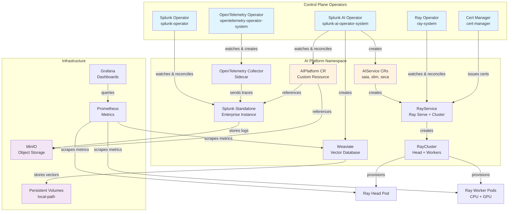
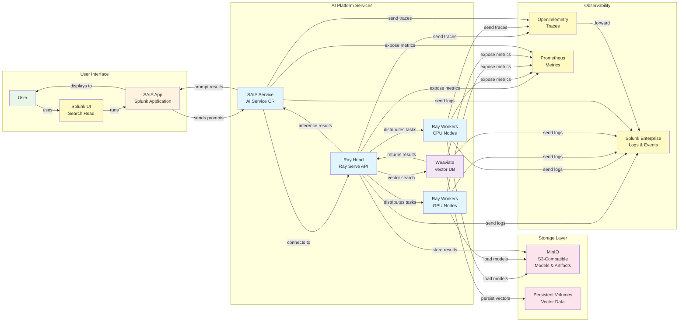

# k0s Cluster Setup for Splunk AI Platform

Complete guide for deploying Splunk AI Platform on k0s Kubernetes clusters.

## Table of Contents

- [Overview](#overview)
- [Pure On-Premises Deployments](#pure-on-premises-deployments-no-aws)
- [Features](#features)
- [Prerequisites](#prerequisites)
- [Quick Start](#quick-start)
- [Configuration](#configuration)
- [Usage](#usage)
- [Architecture](#architecture)
- [Image Pull Secrets](#image-pull-secrets)
- [Advanced Topics](#advanced-topics)
- [Troubleshooting](#troubleshooting)
- [Security](#security)
- [Internet Dependencies](#internet-dependencies)
- [Migration Guide](#migration-guide)

---

## Overview

The `k0s_cluster_with_stack.sh` script deploys the complete Splunk AI Platform on k0s Kubernetes, supporting:

- **Bare metal / on-premises deployments** with existing hardware and SSH access
- **AWS EC2 instances** for testing and simulation (auto-creates instances)
- **External S3-compatible object storage** (SeaweedFS, MinIO, or any S3-compatible endpoint)
- **In-cluster MinIO** as a fallback when no external storage is configured
- **Air-gapped environments** with private registries

### What is k0s?

[k0s](https://k0sproject.io/) is a CNCF-certified, lightweight Kubernetes distribution designed for:
- Simple installation (single binary, no OS dependencies)
- Production-ready clusters with minimal overhead
- Edge, IoT, and on-premises deployments
- Air-gapped and security-sensitive environments

---

## Pure On-Premises Deployments (No AWS)

### Does this work for customers in their own data centers?

**Yes!** The k0s deployment is specifically designed for on-premises deployments where customers have zero AWS presence. Here's what you need to know:

### What Works Without AWS

✅ **Complete AI Platform Stack** - All features (SAIA, Slim, SECA) work in pure on-prem environments
✅ **Flexible Object Storage** - External SeaweedFS/MinIO/S3-compatible, or in-cluster MinIO
✅ **No Cloud Dependencies** - No AWS services required
✅ **Air-Gapped Support** - Can run completely disconnected from the internet
✅ **Private Registries** - Use your own container registry instead of ECR

### What You Need to Provide (On-Premises)

**1. Physical/Virtual Infrastructure:**
- Physical servers or VMs with Ubuntu 22.04 LTS (or similar)
- Minimum 3 nodes (1 controller + 2 workers), recommended 5+ nodes
- Direct SSH access to all nodes
- Root/sudo privileges on all nodes

**2. Network Infrastructure:**
- **Internal Network**: All nodes must be on the same network segment
- **IP Addressing**: Static IPs or DHCP reservations for all nodes
- **DNS (Optional but recommended)**: Internal DNS for node resolution
- **Internet Access (Initial Setup)**: For downloading k0s binary and container images
  - Can be removed after installation for air-gapped operation

**3. Network Ports (Between Nodes):**

| Port | Protocol | Source | Destination | Purpose |
|------|----------|--------|-------------|---------|
| 22 | TCP | Admin workstation | All nodes | SSH management |
| 6443 | TCP | All nodes | Controller | Kubernetes API |
| 2380 | TCP | Controllers | Controllers | etcd peer communication |
| 10250 | TCP | All nodes | All nodes | Kubelet API |
| 8132 | TCP | Worker nodes | Controller | Konnectivity agent |
| 179 | TCP | All nodes | All nodes | Calico BGP (if using BGP) |
| 4789 | UDP | All nodes | All nodes | Calico VXLAN overlay |
| 30000-32767 | TCP | User networks | Worker nodes | NodePort services (optional) |

**4. Storage:**
- Local disk space on each node:
  - Controller: 100GB minimum
  - CPU Worker: 200GB minimum (for MinIO and workloads)
  - GPU Worker: 500GB+ recommended (for models and datasets)

**5. For Private Container Registry:**
- Your own Docker registry (Harbor, Artifactory, etc.)
- Pre-pull and push all required images to your registry
- Configure imagePullSecrets for the registry

### Network Architecture (Pure On-Premises)

```
┌─────────────────────────────────────────────────────────────┐
│                  Your Data Center Network                   │
│                  (e.g., 10.0.0.0/16)                        │
└─────────────────────────────────────────────────────────────┘
                            │
        ┌───────────────────┼───────────────────┐
        │                   │                   │
┌───────▼──────────┐ ┌──────▼───────────┐ ┌───▼──────────────┐
│  Controller Node │ │  CPU Worker 1    │ │  GPU Worker 1    │
│  10.0.1.10       │ │  10.0.1.20       │ │  10.0.1.30       │
│  :6443 (API)     │ │                  │ │                  │
│  :8132 (Konnect) │ │ • MinIO          │ │ • Ray GPU Pods   │
└──────────────────┘ └──────────────────┘ └──────────────────┘
        │                   │                   │
        └───────────────────┼───────────────────┘
                            │
                  ┌─────────▼──────────┐
                  │  Calico VXLAN      │
                  │  Pod Network       │
                  │  10.244.0.0/16     │
                  └────────────────────┘
```

**Key Points:**
- **Host Network (10.0.0.0/16)**: Your physical data center network
- **Pod Network (10.244.0.0/16)**: Calico VXLAN overlay network
- **Service Network (10.96.0.0/16)**: Kubernetes ClusterIP services
- All pod-to-pod communication happens over VXLAN (no cloud networking)
- MinIO storage is local to the cluster (no S3)

### Configuration Example (Pure On-Premises)

```yaml
cluster:
  name: onprem-ai-cluster
  sshUser: ubuntu
  sshKeyPath: ~/.ssh/onprem-key

nodes:
  controllers: 1
  cpuWorkers: 2  # First 2 workers are CPU
  gpuWorkers: 2  # Remaining 2 workers are GPU

  existingIPs:
    controllers:
      - 10.0.1.10     # Your controller server IP
    workers:
      - 10.0.1.20     # CPU worker 1 (index 0)
      - 10.0.1.21     # CPU worker 2 (index 1)
      - 10.0.1.30     # GPU worker 1 (index 2)
      - 10.0.1.31     # GPU worker 2 (index 3)

storage:
  storageClass: "local-path"
  vectorDbSize: "100Gi"
  objectStore:
    type: "minio"                        # External MinIO endpoint
    bucket: "ai-platform-data"
    endpoint: "http://10.0.1.50:9000"
    auth:
      rootUser: "minio-admin"
      rootPassword: "SuperSecurePassword123!"

images:
  registry: "registry.yourcompany.com"
  operator:
    image: "registry.yourcompany.com/splunk/splunk-ai-operator:v0.1.5"
  splunk:
    image: "registry.yourcompany.com/splunk/splunk:latest"
    operatorImage: "registry.yourcompany.com/splunk/splunk-operator:3.0.0"
  ray:
    headImage: "registry.yourcompany.com/ray/ray-head:build-v1alpha1"
    workerImage: "registry.yourcompany.com/ray/ray-worker-gpu:build-v1alpha1"
  weaviate:
    image: "registry.yourcompany.com/weaviate:stable-v1.28"
  saia:
    apiImage: "registry.yourcompany.com/saia/saia-api:build-v1alpha1"
    dataLoaderImage: "registry.yourcompany.com/saia/saia-data-loader:build-v1alpha1"
  slim:
    apiImage: "registry.yourcompany.com/slim/slim-api:v0.0.1"

kubernetes:
  namespace: ai-platform

imagePullSecrets:
  secrets:
    - private-registry-secret
  autoCreateECR: false

aiPlatform:
  name: "onprem-ai-stack"
  features:
    - name: "saia"
      version: "1.1.0"
    - name: "slim"
      version: "1.0.0"
```

### Installation Steps (Pure On-Premises)

**1. Prepare Your Nodes:**
```bash
# On each node, ensure:
# - Ubuntu 22.04 LTS installed
# - SSH access configured
# - Passwordless sudo enabled
# - Python 3.8+ installed

# Example setup on each node:
ssh ubuntu@10.0.1.10
sudo apt-get update
sudo apt-get install -y python3 curl
```

**2. Configure SSH Access:**
```bash
# From your admin workstation
# Test SSH access to all nodes
ssh -i ~/.ssh/onprem-key ubuntu@10.0.1.10 "hostname"
ssh -i ~/.ssh/onprem-key ubuntu@10.0.1.20 "hostname"
ssh -i ~/.ssh/onprem-key ubuntu@10.0.1.21 "hostname"
```

**3. Create Configuration File:**
```bash
# Copy template and edit
cp k0s-cluster-config.yaml onprem-config.yaml
vi onprem-config.yaml
# - Set existingIPs to your node IPs
# - Set autoCreateECR: false
# - Configure MinIO credentials
```

**4. Run Installation:**
```bash
# From your admin workstation (must have internet access for initial download)
CONFIG_FILE=./onprem-config.yaml ./k0s_cluster_with_stack.sh install
```

**5. Access Your Cluster:**
```bash
# Kubeconfig is saved to ~/.kube/k0s-<cluster-name>
export KUBECONFIG=~/.kube/k0s-onprem-ai-cluster

# Verify
kubectl get nodes
kubectl get pods -A
```

### Private Container Registry Setup

If using a private registry instead of public Docker Hub:

**1. Set up your registry** (Harbor, Artifactory, JFrog, etc.)

**2. Pre-pull and push images:**
```bash
# Pull from public registries
docker pull rayproject/ray:2.9.0
docker pull semitechnologies/weaviate:1.28.0
docker pull minio/minio:latest

# Tag for your registry
docker tag rayproject/ray:2.9.0 registry.yourcompany.com/ray:2.9.0
docker tag semitechnologies/weaviate:1.28.0 registry.yourcompany.com/weaviate:1.28.0
docker tag minio/minio:latest registry.yourcompany.com/minio:latest

# Push to your registry
docker push registry.yourcompany.com/ray:2.9.0
docker push registry.yourcompany.com/weaviate:1.28.0
docker push registry.yourcompany.com/minio:latest
```

**3. Create registry secret:**
```bash
kubectl create secret docker-registry private-registry-secret \
  --docker-server=registry.yourcompany.com \
  --docker-username=admin \
  --docker-password=secretpassword \
  --namespace=ai-platform
```

**4. Configure in k0s-cluster-config.yaml:**
```yaml
imagePullSecrets:
  secrets:
    - private-registry-secret
  autoCreateECR: false

aiplatform:
  ray:
    image: "registry.yourcompany.com/ray:2.9.0"
  vectordb:
    image: "registry.yourcompany.com/weaviate:1.28.0"
```

### Air-Gapped Deployment

For completely disconnected environments:

**1. Pre-stage on a connected system:**
- Download k0s binary
- Pull all required container images
- Download Helm charts

**2. Transfer to air-gapped environment:**
- Copy k0s binary to all nodes
- Load images into local registry
- Copy Helm charts and manifests

**3. Configure to use local resources:**
```yaml
imagePullSecrets:
  secrets:
    - airgap-registry
  autoCreateECR: false
```

**4. Run installation pointing to local registry**

### Common On-Premises Scenarios

#### Scenario 1: Corporate Data Center with Proxy

```yaml
# Configure nodes to use corporate proxy
# On each node:
export HTTP_PROXY=http://proxy.corp.com:8080
export HTTPS_PROXY=http://proxy.corp.com:8080
export NO_PROXY=localhost,127.0.0.1,10.0.0.0/8,.cluster.local

# Then run installation
```

#### Scenario 2: Multiple Data Centers (Multi-Site)

For multi-site deployments:
- Deploy separate k0s cluster per data center
- Use federation or multi-cluster management (not covered in this script)
- Consider network latency between sites (<10ms recommended for etcd)

#### Scenario 3: Existing Kubernetes Cluster

If you already have a Kubernetes cluster:
```yaml
cluster:
  useExisting: force  # Use existing cluster instead of creating new one
```

Then install just the AI Platform stack on your existing cluster.

### Networking Deep Dive

#### Required Connectivity Matrix

| From | To | Ports | Purpose |
|------|-----|-------|---------|
| Admin Workstation | All nodes | 22/TCP | SSH management |
| All nodes | Controller | 6443/TCP | Kubernetes API |
| All nodes | Controller | 8132/TCP | Konnectivity |
| All nodes | All nodes | 10250/TCP | Kubelet |
| All nodes | All nodes | 4789/UDP | VXLAN overlay |
| Controllers | Controllers | 2380/TCP | etcd (HA only) |
| User clients | Worker nodes | 30000-32767/TCP | NodePort (optional) |

#### Firewall Configuration Example (iptables)

```bash
# On controller node
sudo iptables -A INPUT -p tcp --dport 6443 -s 10.0.0.0/16 -j ACCEPT
sudo iptables -A INPUT -p tcp --dport 8132 -s 10.0.0.0/16 -j ACCEPT
sudo iptables -A INPUT -p tcp --dport 2380 -s 10.0.0.0/16 -j ACCEPT

# On all nodes
sudo iptables -A INPUT -p tcp --dport 10250 -s 10.0.0.0/16 -j ACCEPT
sudo iptables -A INPUT -p udp --dport 4789 -s 10.0.0.0/16 -j ACCEPT
sudo iptables -A INPUT -p tcp --dport 179 -s 10.0.0.0/16 -j ACCEPT
```

#### DNS Requirements

**Optional but Recommended:**
- Internal DNS server resolving node hostnames
- Or: Configure /etc/hosts on all nodes with all node IPs

```bash
# Example /etc/hosts on each node
10.0.1.10  controller1.corp.local controller1
10.0.1.20  worker1.corp.local worker1
10.0.1.21  worker2.corp.local worker2
```

### What About AWS Features?

| AWS Feature | On-Prem Alternative |
|-------------|---------------------|
| S3 Storage | MinIO (S3-compatible) ✅ |
| ECR Registry | Harbor, Artifactory, JFrog ✅ |
| EBS Volumes | Local storage (local-path) ✅ |
| IAM Roles | Kubernetes ServiceAccounts ✅ |
| ELB/ALB | NodePort or MetalLB ✅ |
| VPC Networking | Calico VXLAN ✅ |
| Route53 DNS | Internal DNS server ✅ |
| CloudWatch | Prometheus + Grafana ✅ |

**Everything works on-premises with alternative solutions!**

---

## Features

### Complete AI Platform Stack

The script installs everything needed for the AI Platform:

1. **k0s Kubernetes Cluster** - CNCF certified, single-binary Kubernetes
2. **Calico CNI** - High-performance networking with VXLAN
3. **local-path Storage Provisioner** - Default StorageClass for PVCs
4. **Object Storage** - External S3-compatible (SeaweedFS/MinIO) or in-cluster MinIO
5. **Cert-Manager v1.13.0** - Automated certificate management
6. **Kube-Prometheus Stack** - Monitoring with Prometheus + Grafana
7. **OpenTelemetry Operator** - Distributed tracing and telemetry
8. **NVIDIA Host Drivers + Device Plugin** - GPU support for AI workloads (optional, bare-metal driver install)
9. **KubeRay Operator v1.0.0** - Ray cluster management for distributed AI
10. **Splunk Operator** - Splunk Enterprise management
11. **Splunk AI Platform Operator** - AI platform orchestration (SAIA, Slim, SECA features)
12. **AIPlatform CR** - Complete AI deployment with features, scheduling, and secrets

### Two Deployment Modes

#### Mode 1: Bare Metal / On-Premises
- Provide existing IP addresses in `nodes.existingIPs`
- Script SSHs into each node and installs k0s, NVIDIA drivers (if GPU), iptables, and PyYAML
- Passwordless SSH with sudo access required
- Production-ready for on-prem deployments
- Air-gapped support with private registries

#### Mode 2: AWS EC2 (Testing / Simulation)
- Automatically creates EC2 instances (controller, CPU workers, GPU workers)
- Creates or reuses a Security Group with required k0s ports open
- User-data bootstraps nodes with `curl`, `wget`, `jq`, and k0s binary
- Quick setup for testing and validation before on-prem rollout

### Image Pull Secrets Support 🔐

Automatically creates and configures secrets for private container registries:
- **AWS ECR** - Elastic Container Registry (auto-token refresh)
- **Docker Hub** - Docker Hub private repositories
- **GCR** - Google Container Registry
- **ACR** - Azure Container Registry
- **Custom** - Any Docker registry

Secrets are automatically propagated through the platform:
```
AIPlatform CR → AIService → Job/RayCluster → Pods
```

---

## Prerequisites

### Required Tools

```bash
# Install required tools on macOS
brew install kubectl helm git jq yq aws-cli

# Install required tools on Ubuntu/Debian
sudo apt-get update
sudo apt-get install -y kubectl helm git jq
wget https://github.com/mikefarah/yq/releases/latest/download/yq_linux_amd64 -O /usr/local/bin/yq
chmod +x /usr/local/bin/yq

# Verify installations
kubectl version --client
helm version
git --version
jq --version
yq --version
```

### For On-Prem Deployments

**Hardware Requirements:**
- **Controller Node**: 4 CPU, 8GB RAM, 50GB disk (minimum)
- **CPU Worker**: 8 CPU, 32GB RAM, 100GB disk (recommended for AI)
- **GPU Worker**: 8 CPU, 32GB RAM, 100GB disk + NVIDIA GPU

**Software Requirements:**
- Ubuntu 22.04 LTS (or similar Linux distribution)
- Passwordless SSH access to all nodes
- Sudo privileges without password
- Python 3.8+ installed on all nodes

**Network Requirements:**
Open the following ports between nodes:

| Port | Protocol | Purpose |
|------|----------|---------|
| 6443 | TCP | Kubernetes API server |
| 2380 | TCP | etcd client |
| 10250 | TCP | Kubelet API |
| 8132 | TCP | Konnectivity agent |
| 179 | TCP | Calico BGP |
| 4789 | UDP | Calico VXLAN |
| 30000-32767 | TCP | NodePort services |

### For AWS EC2 Deployments

**AWS Requirements:**
- AWS CLI configured with credentials
- IAM permissions: EC2, VPC, Security Groups
- Existing VPC with internet gateway
- SSH key pair in AWS region
- Sufficient EC2 quotas:
  - t3.xlarge (controllers): 1+ instances
  - m5.4xlarge (CPU workers): 2+ instances
  - g5.2xlarge (GPU workers): 1+ instances

**Verify AWS Access:**
```bash
# Check AWS credentials
aws sts get-caller-identity

# Check available regions
aws ec2 describe-regions --output table

# Check EC2 quotas
aws service-quotas get-service-quota \
  --service-code ec2 \
  --quota-code L-1216C47A \
  --region us-west-2
```

---

## Quick Start

### 1. Clone the Repository

```bash
git clone https://github.com/splunk/splunk-ai-operator.git
cd splunk-ai-operator/tools/cluster_setup
```

### 2. Create Configuration File

```bash
# Copy the template
cp k0s-cluster-config.yaml my-cluster.yaml

# Edit with your settings
vi my-cluster.yaml
```

### 3. Deploy the Cluster

```bash
# For on-prem deployment
CONFIG_FILE=./my-cluster.yaml ./k0s_cluster_with_stack.sh install

# For EC2 testing
CONFIG_FILE=./my-cluster.yaml ./k0s_cluster_with_stack.sh install
```

### 4. Verify Installation

```bash
# Set kubeconfig
export KUBECONFIG=~/.kube/k0s-my-cluster

# Check nodes
kubectl get nodes

# Check AI Platform
kubectl get aiplatform -n ai-platform

# Check all components
kubectl get pods --all-namespaces
```

---

## Configuration

### Configuration File Structure

The `k0s-cluster-config.yaml` file controls all aspects of the deployment:

```yaml
cluster:           # Cluster name, useExisting, region, SSH user/key
nodes:             # Controller/worker counts and existingIPs
storage:           # storageClass, vectorDbSize, objectStore (type/endpoint/auth)
images:            # registry prefix, operator, splunk, ray, weaviate, saia, slim, fluentBit, otelCollector
operators:         # ray (version/modelVersion/rayVersion), certManager, nvidia devicePluginVersion
kubernetes:        # namespace
files:             # splunkOperator, aiPlatform manifest paths
splunk:            # standaloneName
aiPlatform:        # defaultAcceleratorType, workerGroupConfig, features, scheduling
imagePullSecrets:  # secrets list, autoCreateECR, dockerHub, gcr, acr, custom
ecr:               # account, region
ec2:               # vpcId, subnetId, keyName (EC2 mode)
instanceTypes:     # controller, cpuWorker, gpuWorker (EC2 mode)
```

### Configuration Examples

#### Example 1: On-Premises / Bare Metal Production Cluster

**Use Case:** Production deployment on existing hardware with external object storage

```yaml
cluster:
  name: prod-ai-platform
  sshUser: ubuntu
  sshKeyPath: ~/.ssh/prod-key.pem

nodes:
  controllers: 1
  cpuWorkers: 2      # First 2 workers treated as CPU
  gpuWorkers: 2      # Remaining 2 workers treated as GPU

  existingIPs:
    controllers:
      - 10.0.1.10     # Physical server 1
    workers:
      - 10.0.1.20     # Physical server 2 (CPU - worker index 0)
      - 10.0.1.21     # Physical server 3 (CPU - worker index 1)
      - 10.0.1.22     # Physical server 4 (GPU - worker index 2)
      - 10.0.1.23     # Physical server 5 (GPU - worker index 3)

storage:
  storageClass: "local-path"
  vectorDbSize: "200Gi"
  objectStore:
    type: "seaweedfs"
    bucket: "ai-platform-production"
    endpoint: "http://10.0.1.50:8333"
    auth:
      rootUser: "admin"
      rootPassword: "Change-This-Strong-Password-123!"

images: # TODO update images with released versions (from docker.io / how ?)
  registry: "registry.corp.com"
  operator:
    image: "registry.corp.com/splunk/splunk-ai-operator:v0.1.5"
  splunk:
    image: "registry.corp.com/splunk/splunk:latest"
    operatorImage: "docker.io/splunk/splunk-operator:3.0.0"
  ray:
    headImage: "registry.corp.com/ray/ray-head:build-v1alpha1"
    workerImage: "registry.corp.com/ray/ray-worker-gpu:build-v1alpha1"
  weaviate:
    image: "docker.io/semitechnologies/weaviate:stable-v1.28"
  saia:
    apiImage: "registry.corp.com/saia/saia-api:build-v1alpha1"
    dataLoaderImage: "registry.corp.com/saia/saia-data-loader:build-v1alpha1"
  slim:
    apiImage: "registry.corp.com/slim/slim-api:v0.0.1"

kubernetes:
  namespace: ai-platform

splunk:
  standaloneName: splunk-prod

imagePullSecrets:
  secrets:
    - private-registry-secret
  autoCreateECR: false

aiPlatform:
  name: "prod-ai-stack"
  features:
    - name: "saia"
      version: "1.1.0"
    - name: "slim"
      version: "1.0.0"
```

#### Example 2: AWS EC2 Testing Cluster

**Use Case:** Quick testing/validation before on-prem deployment

```yaml
cluster:
  name: test-ai-platform
  region: us-west-2
  sshUser: ec2-user
  sshKeyPath: ~/.ssh/test-key.pem

nodes:
  controllers: 1
  cpuWorkers: 2
  gpuWorkers: 1
  existingIPs:
    controllers: []  # Empty = auto-create EC2
    workers: []      # Empty = auto-create EC2

ec2:
  vpcId: vpc-0123456789abcdef0
  subnetId: ""
  keyName: test-key

instanceTypes:
  controller: t3.xlarge
  cpuWorker: m5.2xlarge
  gpuWorker: g5.xlarge

storage:
  storageClass: "local-path"
  vectorDbSize: "50Gi"
  objectStore:
    type: "minio"
    bucket: "ai-platform-test"
    endpoint: "http://minio-host:9000"
    auth:
      rootUser: "minioadmin"
      rootPassword: "minioadmin123"

images:
  registry: "123456789012.dkr.ecr.us-west-2.amazonaws.com"
  operator:
    image: "123456789012.dkr.ecr.us-west-2.amazonaws.com/splunk-ai-operator:latest"

ecr:
  account: "123456789012" # Your AWS account ID
  region: us-west-2

imagePullSecrets:
  secrets: []
  autoCreateECR: true

kubernetes:
  namespace: ai-platform
```

#### Example 3: Hybrid Cluster (Some Existing, Some New)

**Use Case:** Mix existing on-prem nodes with cloud nodes

```yaml
cluster:
  name: hybrid-cluster
  region: us-east-1
  sshUser: ubuntu
  sshKeyPath: ~/.ssh/hybrid-key.pem

nodes:
  controllers: 1
  cpuWorkers: 2      # First 2 workers are CPU (on-prem), + 2 EC2 CPU workers created
  gpuWorkers: 2      # Remaining 2 on-prem workers are GPU

  existingIPs:
    controllers:
      - 192.168.1.10  # Existing on-prem controller
    workers:
      - 192.168.1.20  # Existing on-prem worker (CPU - index 0)
      - 192.168.1.21  # Existing on-prem worker (CPU - index 1)
      - 192.168.1.30  # Existing on-prem worker (GPU - index 2)
      - 192.168.1.31  # Existing on-prem worker (GPU - index 3)

ec2:
  vpcId: vpc-0123456789abcdef0
  keyName: hybrid-key

instanceTypes:
  cpuWorker: m5.2xlarge  # For new EC2 workers

imagePullSecrets:
  autoCreateECR: true
```

#### Example 4: Air-Gapped On-Prem Cluster

**Use Case:** Secure environment with no internet access

```yaml
cluster:
  name: airgap-cluster
  sshUser: admin
  sshKeyPath: ~/.ssh/secure-key.pem

nodes:
  controllers: 3  # HA setup
  cpuWorkers: 2   # First 2 workers are CPU
  gpuWorkers: 1   # Last worker is GPU

  existingIPs:
    controllers:
      - 172.16.0.10
      - 172.16.0.11
      - 172.16.0.12
    workers:
      - 172.16.0.20  # CPU
      - 172.16.0.21  # CPU
      - 172.16.0.22  # GPU

storage:
  storageClass: "local-path"
  vectorDbSize: "100Gi"
  objectStore:
    type: "minio"
    bucket: "airgap-storage"
    endpoint: "http://172.16.0.50:9000"
    auth:
      rootUser: "secure-admin"
      rootPassword: "Very-Long-Secure-Password-456!"

images:
  registry: "registry.airgap.local"
  operator:
    image: "registry.airgap.local/splunk-ai-operator:v0.1.5"

imagePullSecrets:
  secrets:
    - private-registry-secret  # Pre-created manually
  autoCreateECR: false

# Note: Pre-pull all images to local registry before installation
# See the "Internet Dependencies" section for the full list of images
```

### Configuration Reference

#### Cluster Section

```yaml
cluster:
  # Cluster name (used for tagging, kubeconfig, etc.)
  name: my-cluster

  # Use existing cluster instead of creating new one
  # Options: auto (detect), force (fail if not found), never (always create)
  useExisting: auto

  # AWS region. Required for EC2 mode. Also used as fallback for ecr.region
  # when pulling images from ECR (even in bare-metal mode).
  # Not needed for pure on-prem with no AWS.
  region: us-west-2

  # SSH configuration
  sshUser: ubuntu                    # SSH username
  sshKeyPath: ~/.ssh/my-key.pem      # Path to private key
```

#### Nodes Section

```yaml
nodes:
  # Number of controller nodes (1 or 3 for HA)
  controllers: 1

  # Number of CPU workers. In EC2 mode: instances to create.
  # In bare-metal mode: first N entries in workers[] are CPU, rest are GPU.
  # Controls node labeling, NVIDIA driver install, and GPU device plugin.
  cpuWorkers: 2

  # Number of GPU workers. In EC2 mode: instances to create.
  # In bare-metal mode: workers after the first cpuWorkers are treated as GPU.
  gpuWorkers: 1

  # Existing IP addresses (bare-metal / on-prem mode)
  existingIPs:
    controllers: []  # Leave empty for EC2 auto-creation
    workers: []      # Leave empty for EC2 auto-creation
```

#### Storage Section

```yaml
storage:
  storageClass: "local-path"          # Kubernetes StorageClass for PVCs
  vectorDbSize: "50Gi"                # Weaviate PersistentVolume size

  objectStore:
    type: "seaweedfs"                 # aws | s3compat | minio | seaweedfs
    bucket: "ai-platform-bucket"      # S3 bucket name
    endpoint: "http://host:8333"      # S3-compatible endpoint URL
    auth:
      rootUser: "admin"               # Access key / root user
      rootPassword: "password"        # Secret key / root password
```

#### Images Section

Short image paths (without a FQDN) are automatically prefixed with `images.registry`.

```yaml
images:
  registry: "myregistry.com"          # Prefix applied to short image paths
  operator:
    image: "myregistry.com/splunk-ai-operator:v0.1.5"
  splunk:
    image: "myregistry.com/splunk:latest"
    operatorImage: "docker.io/splunk/splunk-operator:3.0.0"
  ray:
    headImage: "ray/ray-head:build-v1alpha1"
    workerImage: "ray/ray-worker-gpu:build-v1alpha1"
  weaviate:
    image: "docker.io/semitechnologies/weaviate:stable-v1.28"
  saia:
    apiImage: "saia/saia-api:build-v1alpha1"
    dataLoaderImage: "saia/saia-data-loader:build-v1alpha1"
  slim:
    apiImage: "myregistry.com/slim-api:v0.0.1"
  fluentBit:
    image: "docker.io/fluent/fluent-bit:1.9.6"
  otelCollector:
    image: "docker.io/otel/opentelemetry-collector-contrib:0.122.1"
```

**Image patching chain:** The script reads these config values, resolves them via `build_image_url()` (prepends registry if needed), then uses `sed` to patch the corresponding `RELATED_IMAGE_*` env vars in the manifest files:

| Config field | Env var patched | Target file |
|---|---|---|
| `images.operator.image` | Container `image:` field | `artifacts.yaml` |
| `images.splunk.image` | `RELATED_IMAGE_SPLUNK_ENTERPRISE` | `splunk-operator-cluster.yaml` only |
| `images.splunk.operatorImage` | Container `image:` field | `splunk-operator-cluster.yaml` |
| `images.ray.headImage` | `RELATED_IMAGE_RAY_HEAD` | `artifacts.yaml` |
| `images.ray.workerImage` | `RELATED_IMAGE_RAY_WORKER` | `artifacts.yaml` |
| `images.weaviate.image` | `RELATED_IMAGE_WEAVIATE` | `artifacts.yaml` |
| `images.saia.apiImage` | `RELATED_IMAGE_SAIA_API` | `artifacts.yaml` |
| `images.saia.dataLoaderImage` | `RELATED_IMAGE_POST_INSTALL_HOOK` | `artifacts.yaml` |
| `images.slim.apiImage` | `RELATED_IMAGE_SLIM_API` | `artifacts.yaml` |
| `images.fluentBit.image` | `RELATED_IMAGE_FLUENT_BIT` | `artifacts.yaml` |
| `images.otelCollector.image` | `RELATED_IMAGE_OTEL_COLLECTOR` | `artifacts.yaml` |
| `operators.ray.modelVersion` | `MODEL_VERSION` | `artifacts.yaml` |
| `operators.ray.rayVersion` | `RAY_VERSION` | `artifacts.yaml` |

> **Note:** `RELATED_IMAGE_SPLUNK_ENTERPRISE` also exists in `artifacts.yaml` but is only
> patched in `splunk-operator-cluster.yaml`. `SPLUNK_METRICS_INDEX_NAME` in `artifacts.yaml`
> is not configurable from the config file.

#### Operators Section

```yaml
operators:
  ray:
    version: "v1.2.2"                 # KubeRay operator Helm chart version
    modelVersion: "v0.3.14-36-g1549f5a"  # Model version label for Ray
    rayVersion: "2.44.0"              # Ray runtime version
  certManager:
    installCRDs: true                 # Install cert-manager CRDs
  nvidia:
    devicePluginVersion: "v0.17.3"    # NVIDIA k8s device plugin version
```

#### AI Platform Section

```yaml
aiPlatform:
  defaultAcceleratorType: "L40S"      # GPU tier: L40S, H100_NVL, or ""
  workerGroupConfig:
    imageRegistry: ""                 # Override registry for Ray worker images
  # Note: name, features, cpuScheduling, gpuScheduling are defined
  # for reference but currently hardcoded in the script's CR template
```

#### Image Pull Secrets Section

The `secrets` list is **not consumed** by the script. Instead, the script auto-detects
which secrets exist in the namespace by checking for hardcoded names: `ecr-registry-secret`,
`docker-hub-secret`, `gcr-secret`, `acr-secret`, `custom-registry-secret`.

```yaml
imagePullSecrets:
  secrets:                            # Pre-existing secret names; NOT consumed; script auto-detects secrets in namespace
    - ecr-registry-secret
    - docker-hub-secret
  autoCreateECR: true                 # Auto-create ECR secret from AWS creds

  # Docker Hub (optional)
  dockerHub:
    enabled: false
    username: ""
    password: ""
    email: ""

  # Google Container Registry (optional)
  gcr:
    enabled: false
    jsonKey: ""                       # GCP service account JSON key

  # Azure Container Registry (optional)
  acr:
    enabled: false
    registry: ""                      # e.g. myregistry.azurecr.io
    username: ""
    password: ""

  # Custom Docker-compatible registry (optional)
  custom:
    enabled: false
    name: "custom-registry-secret"
    server: ""
    username: ""
    password: ""
    email: ""
```

---

## Usage

### Basic Commands

```bash
# Install cluster with custom config
CONFIG_FILE=./my-config.yaml ./k0s_cluster_with_stack.sh install

# Delete entire cluster
CONFIG_FILE=./my-config.yaml ./k0s_cluster_with_stack.sh delete

# Clean all k0s state from bare-metal nodes (stop/reset/remove)
CONFIG_FILE=./my-config.yaml ./k0s_cluster_with_stack.sh clean-all

# Join additional workers to an existing cluster
CONFIG_FILE=./my-config.yaml ./k0s_cluster_with_stack.sh join-workers
```

### Advanced Commands

```bash
# Install without confirmation prompts
AUTO_APPROVE=true CONFIG_FILE=./my-config.yaml ./k0s_cluster_with_stack.sh install

# Use existing cluster (skip k0s installation, deploy stack only)
USE_EXISTING=force CONFIG_FILE=./my-config.yaml ./k0s_cluster_with_stack.sh install
```

### Post-Installation Tasks

#### 1. Access the Cluster

```bash
# Set kubeconfig environment variable
export KUBECONFIG=~/.kube/k0s-my-cluster

# Or copy to default location
cp ~/.kube/k0s-my-cluster ~/.kube/config

# Verify cluster access
kubectl cluster-info
kubectl get nodes
```

#### 2. Check Installation Status

```bash
# Check all namespaces
kubectl get pods --all-namespaces

# Check AI Platform specifically
kubectl get aiplatform -n ai-platform -o wide

# Check AIServices
kubectl get aiservice -n ai-platform

# Check RayCluster
kubectl get rayservice -n ai-platform
```

#### 3. Access MinIO Console

```bash
# Port forward MinIO console
kubectl port-forward -n minio-system svc/minio 9001:9001

# Open in browser: http://localhost:9001
# Login with credentials from config file
```

#### 4. Access Splunk

```bash
# Get Splunk admin password
SPLUNK_PASSWORD=$(kubectl get secret \
  splunk-<standalone-name>-standalone-secret-v1 \
  -n ai-platform \
  -o jsonpath='{.data.password}' | base64 -d)

echo "Splunk password: $SPLUNK_PASSWORD"

# Port forward Splunk web UI
kubectl port-forward -n ai-platform \
  svc/splunk-<standalone-name>-standalone-service 8000:8000

# Access at http://localhost:8000
# Username: admin
# Password: (from above command)
```

#### 5. Access Prometheus/Grafana

```bash
# Prometheus
kubectl port-forward -n monitoring svc/prometheus-operated 9090:9090
# Access at http://localhost:9090

# Grafana
kubectl port-forward -n monitoring svc/grafana 3000:80
# Access at http://localhost:3000
# Default credentials: admin/admin
```

---

## Architecture

### Cluster Architecture

```
┌─────────────────────────────────────────────────────────────┐
│                  k0s Controller Node(s)                     │
│  ┌──────────────┐  ┌──────────────┐  ┌──────────────┐     │
│  │ API Server   │  │    etcd      │  │  Scheduler   │     │
│  │   :6443      │  │   :2380      │  │              │     │
│  └──────┬───────┘  └──────────────┘  └──────────────┘     │
│         │  Konnectivity                                    │
│         │  Server :8132                                    │
└─────────┼──────────────────────────────────────────────────┘
          │
    ┌─────┴────────────────────────┐
    │  Calico VXLAN Network        │
    │  (Pod Network: 10.244.0.0/16)│
    └─────┬────────────────────────┘
          │
  ┌───────┼───────────────────┬────────────────────┐
  │       │                   │                    │
┌─▼───────▼──────┐  ┌─────────▼────────┐  ┌───────▼─────────┐
│ CPU Worker 1   │  │  CPU Worker 2    │  │  GPU Worker     │
│                │  │                  │  │                 │
│ • MinIO        │  │ • Weaviate       │  │ • Ray GPU Pods  │
│ • Ray Head     │  │ • Ray CPU Pods   │  │ • AI Training   │
│ • Monitoring   │  │ • AI Inference   │  │                 │
└────────────────┘  └──────────────────┘  └─────────────────┘
```

### Network Architecture

**Pod Network (Calico VXLAN):**
- CIDR: `10.244.0.0/16`
- Overlay network across all nodes
- Isolated from host network

**Service Network:**
- CIDR: `10.96.0.0/16`
- ClusterIP services
- NodePort range: `30000-32767`

**Host Network:**
- Controller API: `<public-ip>:6443`
- Konnectivity: `<public-ip>:8132`
- SSH: `<public-ip>:22`

### Storage Architecture

```
┌──────────────────────────────────────────────────────────┐
│                    MinIO Object Storage                  │
│          (S3-Compatible, Running in Kubernetes)          │
│                                                          │
│  Endpoint: http://minio.minio-system.svc.cluster.local  │
│  Port: 9000 (API), 9001 (Console)                       │
│                                                          │
│  Buckets:                                                │
│  ├─ ai-platform-bucket/                                 │
│  │  ├─ artifacts/        (Build artifacts)              │
│  │  ├─ models/           (ML models)                    │
│  │  ├─ datasets/         (Training data)                │
│  │  └─ tasks/            (Task outputs)                 │
│  │                                                       │
│  └─ splunk-index/        (Splunk SmartStore indexes)    │
│                                                          │
│  Persistence:                                            │
│  └─ PVC: minio-storage (local-path)                     │
│     Size: 100Gi (configurable)                          │
└──────────────────────────────────────────────────────────┘
```

**Access Patterns:**
```yaml
# From pods in cluster
endpoint: http://minio.minio-system.svc.cluster.local:9000

# From outside cluster (via port-forward)
endpoint: http://localhost:9000

# AIPlatform CR reference
objectStorage:
  path: s3://ai-platform-bucket/artifacts
  endpoint: http://minio.minio-system.svc.cluster.local:9000
  region: us-east-1  # Ignored by MinIO, but required
  secretRef: s3-secret
```

### Component Architecture

#### Operator and Resource Hierarchy



#### Data Flow and Interactions



#### Complete Platform Deployment

```mermaid
graph TB
    subgraph "Kubernetes Cluster - k0s"
        subgraph "kube-system Namespace"
            K8S_API[Kubernetes API Server]
            CALICO[Calico CNI<br/>VXLAN Networking]
        end

        subgraph "cert-manager Namespace"
            CERTMGR[Cert Manager<br/>Certificate Controller]
            ISSUER[Issuers & Certificates]
        end

        subgraph "monitoring Namespace"
            PROM[Prometheus<br/>Metrics Collection]
            GRAFANA[Grafana<br/>Visualization]
            ALERTMGR[Alert Manager<br/>Alerting]
        end

        subgraph "opentelemetry-operator-system"
            OTELOP[OpenTelemetry Operator]
        end

        subgraph "ray-system Namespace"
            RAYOP[KubeRay Operator<br/>Ray Management]
        end

        subgraph "splunk-operator Namespace"
            SPLOP[Splunk Operator<br/>Splunk Management]
        end

        subgraph "splunk-ai-operator-system"
            AIOP[Splunk AI Operator<br/>AI Platform Controller]
            WEBHOOK[Admission Webhooks<br/>Validation]
        end

        subgraph "minio-system Namespace"
            MINIO[MinIO Deployment<br/>Object Storage]
            MINIOPVC[MinIO PVC<br/>200Gi]
        end

        subgraph "ai-platform Namespace"
            AIPLATFORM[AIPlatform CR<br/>Main Resource]

            subgraph "AI Services"
                SAIA[AIService: saia<br/>Splunk AI Assistant]
                SLIM[AIService: slim<br/>Slim API]
            end

            subgraph "Ray Infrastructure"
                RAYSERVICE[RayService<br/>Ray Serve]
                RAYCLUSTER[RayCluster<br/>Distributed Cluster]
                RAYHEAD[Ray Head Pod<br/>8 CPU, 32GB RAM]
                RAYWORKER1[Ray Worker Pod<br/>16 CPU, 64GB RAM]
                RAYWORKER2[Ray Worker GPU Pod<br/>8 CPU, 32GB, 1x GPU]
            end

            subgraph "Data Services"
                WEAVIATE[Weaviate StatefulSet<br/>Vector Database]
                WEAVIATEPVC[Weaviate PVC<br/>50Gi]
            end

            subgraph "Splunk Services"
                SPLUNK[Splunk Standalone<br/>Enterprise]
                SPLUNKETC[Splunk etc PVC]
                SPLUNKVAR[Splunk var PVC]
            end

            subgraph "Observability"
                OTELCOL[OpenTelemetry Collector<br/>Traces]
            end

            subgraph "Networking"
                RAYSVC[Ray Head Service<br/>ClusterIP]
                WEAVIATESVC[Weaviate Service<br/>ClusterIP]
                SPLUNKSVC[Splunk Service<br/>ClusterIP]
            end
        end

        subgraph "kube-system (GPU)"
            GPUPLUGIN[NVIDIA Device Plugin<br/>DaemonSet]
        end
    end

    K8S_API -->|manages| AIOP
    K8S_API -->|manages| SPLOP
    K8S_API -->|manages| RAYOP

    AIOP -->|reconciles| AIPLATFORM
    AIPLATFORM -->|creates| SAIA
    SAIA -->|creates| RAYSERVICE
    RAYOP -->|reconciles| RAYSERVICE
    RAYSERVICE -->|creates| RAYCLUSTER
    RAYCLUSTER -->|provisions| RAYHEAD
    RAYCLUSTER -->|provisions| RAYWORKER1
    RAYCLUSTER -->|provisions| RAYWORKER2

    AIPLATFORM -->|creates| WEAVIATE
    WEAVIATE -->|claims| WEAVIATEPVC

    SPLOP -->|reconciles| SPLUNK
    SPLUNK -->|claims| SPLUNKETC
    SPLUNK -->|claims| SPLUNKVAR

    CERTMGR -->|provisions certs| RAYSERVICE

    OTELOP -->|creates| OTELCOL

    RAYHEAD -->|exposes| RAYSVC
    WEAVIATE -->|exposes| WEAVIATESVC
    SPLUNK -->|exposes| SPLUNKSVC

    RAYHEAD -->|reads/writes| MINIO
    RAYWORKER1 -->|reads/writes| MINIO
    RAYWORKER2 -->|reads/writes| MINIO
    SPLUNK -->|reads apps| MINIO

    MINIO -->|stores on| MINIOPVC

    PROM -->|scrapes| RAYHEAD
    PROM -->|scrapes| RAYWORKER1
    PROM -->|scrapes| RAYWORKER2
    PROM -->|scrapes| WEAVIATE
    GRAFANA -->|queries| PROM

    RAYHEAD -->|sends traces| OTELCOL
    RAYWORKER1 -->|sends traces| OTELCOL
    OTELCOL -->|forwards to| SPLUNK

    GPUPLUGIN -->|provides GPUs to| RAYWORKER2

    style AIOP fill:#e1f5ff,stroke:#01579b,stroke-width:3px
    style AIPLATFORM fill:#fff3e0,stroke:#e65100,stroke-width:3px
    style RAYSERVICE fill:#f3e5f5,stroke:#4a148c,stroke-width:2px
    style RAYCLUSTER fill:#f3e5f5,stroke:#4a148c,stroke-width:2px
    style MINIO fill:#fce4ec,stroke:#880e4f,stroke-width:2px
    style SPLUNK fill:#fff9c4,stroke:#f57f17,stroke-width:2px
    style WEAVIATE fill:#e0f2f1,stroke:#004d40,stroke-width:2px
```



---

## Image Pull Secrets

The platform supports automatic creation and propagation of image pull secrets for private container registries.

### Supported Registries

1. **AWS ECR** (Elastic Container Registry)
2. **Docker Hub** (Private repositories)
3. **GCR** (Google Container Registry)
4. **ACR** (Azure Container Registry)
5. **Custom** (Any Docker-compatible registry)

### Automatic ECR Configuration

The easiest way to use private ECR images:

```yaml
# In k0s-cluster-config.yaml
ecr:
  account: "123456789012"  # Your AWS account ID

imagePullSecrets:
  autoCreateECR: true  # Enable automatic ECR secret creation
```

**What happens automatically:**
1. Script detects AWS credentials
2. Gets ECR authorization token
3. Creates `ecr-registry-secret` in `ai-platform` namespace
4. Adds secret to AIPlatform CR `spec.images.imagePullSecrets`
5. Operator propagates to all AI workloads

**ECR Token Expiration:**
- ECR tokens expire after 12 hours
- Re-run installation to refresh tokens
- Or set up a CronJob for automatic refresh

### Manual Secret Creation

For air-gapped or custom registries:

```bash
# ECR secret
kubectl create secret docker-registry ecr-registry-secret \
  --docker-server=123456789012.dkr.ecr.us-west-2.amazonaws.com \
  --docker-username=AWS \
  --docker-password=$(aws ecr get-login-password --region us-west-2) \
  --namespace=ai-platform

# Docker Hub secret
kubectl create secret docker-registry docker-hub-secret \
  --docker-server=docker.io \
  --docker-username=myuser \
  --docker-password=mypassword \
  --namespace=ai-platform

# Private registry secret
kubectl create secret docker-registry private-registry \
  --docker-server=registry.example.com \
  --docker-username=admin \
  --docker-password=secret123 \
  --namespace=ai-platform
```

Then reference in config:

```yaml
imagePullSecrets:
  secrets:
    - ecr-registry-secret
    - docker-hub-secret
    - private-registry
  autoCreateECR: false
```

### Image Pull Secret Propagation

Secrets are automatically propagated through the platform:

```yaml
AIPlatform CR
  spec.images.imagePullSecrets:
    - name: ecr-registry-secret
         ↓
AIService CR
  spec.imagePullSecrets:
    - name: ecr-registry-secret
         ↓
RayService/RayCluster
  spec.headGroupSpec.template.spec.imagePullSecrets:
    - name: ecr-registry-secret
  spec.workerGroupSpecs[*].template.spec.imagePullSecrets:
    - name: ecr-registry-secret
         ↓
Jobs (setup hooks, migrations)
  spec.template.spec.imagePullSecrets:
    - name: ecr-registry-secret
         ↓
Pods (Ray head, Ray workers, Weaviate, etc.)
  spec.imagePullSecrets:
    - name: ecr-registry-secret
```

### Using Private Images

Once secrets are configured, specify private images in your config:

```yaml
# In k0s-cluster-config.yaml or AIPlatform CR
aiplatform:
  ray:
    image: "123456789012.dkr.ecr.us-west-2.amazonaws.com/ray:2.9.0"

  vectordb:
    image: "123456789012.dkr.ecr.us-west-2.amazonaws.com/weaviate:1.28.0"
```

### Troubleshooting Image Pull Issues

```bash
# Check if secret exists
kubectl get secret ecr-registry-secret -n ai-platform

# Verify secret type
kubectl get secret ecr-registry-secret -n ai-platform -o jsonpath='{.type}'
# Should output: kubernetes.io/dockerconfigjson

# Check secret content
kubectl get secret ecr-registry-secret -n ai-platform \
  -o jsonpath='{.data.\.dockerconfigjson}' | base64 -d | jq

# Check pod events
kubectl describe pod <pod-name> -n ai-platform | grep -A10 Events

# Common errors:
# "ImagePullBackOff" - Secret missing or invalid
# "ErrImagePull" - Wrong image name or registry
# "Unable to retrieve image pull secrets" - Secret doesn't exist in namespace
```

---

## Advanced Topics

### Node Labeling and Scheduling

The script automatically labels all nodes for proper workload scheduling.

#### Automatic Labels

**Controller Nodes:**
```yaml
splunk.ai/node-role: controller
splunk.ai/workload-type: control-plane
node.kubernetes.io/role: controller
```

**CPU Worker Nodes:**
```yaml
splunk.ai/node-role: worker
splunk.ai/workload-type: cpu
node.kubernetes.io/workload: ai-cpu
splunk.ai/instance-type: cpu-worker
```

**GPU Worker Nodes:**
```yaml
splunk.ai/node-role: worker
splunk.ai/workload-type: gpu
node.kubernetes.io/workload: ai-gpu
splunk.ai/instance-type: gpu-worker
nvidia.com/gpu: "true"
nvidia.com/gpu.count: "1"  # Auto-detected
```

#### Taints

GPU nodes are automatically tainted to prevent non-GPU workloads:
```yaml
taints:
  - key: nvidia.com/gpu
    value: "true"
    effect: NoSchedule
```

#### Viewing Labels

```bash
# Show all labels
kubectl get nodes --show-labels

# Show specific labels
kubectl get nodes -L splunk.ai/workload-type,splunk.ai/node-role

# Filter by label
kubectl get nodes -l splunk.ai/workload-type=gpu
kubectl get nodes -l splunk.ai/workload-type=cpu

# Count by type
echo "GPU nodes: $(kubectl get nodes -l splunk.ai/workload-type=gpu --no-headers | wc -l)"
echo "CPU nodes: $(kubectl get nodes -l splunk.ai/workload-type=cpu --no-headers | wc -l)"
```

#### Custom Scheduling in AIPlatform CR

```yaml
apiVersion: ai.splunk.com/v1
kind: AIPlatform
metadata:
  name: my-platform
spec:
  # CPU workloads (Weaviate, Ray head, etc.)
  cpuSchedulingSpec:
    nodeSelector:
      splunk.ai/workload-type: cpu
    tolerations: []
    affinity:
      nodeAffinity:
        requiredDuringSchedulingIgnoredDuringExecution:
          nodeSelectorTerms:
          - matchExpressions:
            - key: splunk.ai/workload-type
              operator: In
              values:
              - cpu

  # GPU workloads (Ray GPU workers)
  gpuSchedulingSpec:
    nodeSelector:
      splunk.ai/workload-type: gpu
      nvidia.com/gpu: "true"
    tolerations:
    - key: nvidia.com/gpu
      operator: Equal
      value: "true"
      effect: NoSchedule
    affinity:
      nodeAffinity:
        requiredDuringSchedulingIgnoredDuringExecution:
          nodeSelectorTerms:
          - matchExpressions:
            - key: nvidia.com/gpu.count
              operator: Exists
```

### High Availability Setup

For production deployments, use 3 controller nodes:

```yaml
nodes:
  controllers: 3  # HA etcd cluster
  existingIPs:
    controllers:
      - 10.0.1.10
      - 10.0.1.11
      - 10.0.1.12
```

**Benefits:**
- Survives single controller failure
- etcd quorum maintained
- Zero downtime for API server

**Requirements:**
- Odd number of controllers (1, 3, 5)
- Same datacenter/region for low latency
- Reliable network between controllers

### Custom CA Certificates

For air-gapped or secure environments:

```bash
# Create custom CA secret
kubectl create secret generic custom-ca \
  --from-file=ca.crt=/path/to/ca.crt \
  -n cert-manager

# Update cert-manager to use custom CA
kubectl patch deployment cert-manager -n cert-manager \
  --patch '{"spec":{"template":{"spec":{"volumes":[{"name":"custom-ca","secret":{"secretName":"custom-ca"}}],"containers":[{"name":"cert-manager","volumeMounts":[{"name":"custom-ca","mountPath":"/etc/ssl/certs/custom-ca.crt","subPath":"ca.crt"}]}]}}}}'
```

### Resource Quotas

Set resource limits per namespace:

```bash
kubectl apply -f - <<EOF
apiVersion: v1
kind: ResourceQuota
metadata:
  name: ai-platform-quota
  namespace: ai-platform
spec:
  hard:
    requests.cpu: "100"
    requests.memory: "200Gi"
    requests.nvidia.com/gpu: "8"
    limits.cpu: "200"
    limits.memory: "400Gi"
    limits.nvidia.com/gpu: "8"
    persistentvolumeclaims: "50"
EOF
```

### Backup and Restore

#### Backup MinIO Data

```bash
# Install MinIO client
wget https://dl.min.io/client/mc/release/linux-amd64/mc
chmod +x mc
sudo mv mc /usr/local/bin/

# Configure alias
mc alias set k0s-minio \
  http://localhost:9000 \
  minioadmin \
  minioadmin123

# Backup bucket
mc mirror k0s-minio/ai-platform-bucket ./backup/minio-data

# Backup configuration
kubectl get secret -n minio-system minio-creds -o yaml > backup/minio-secret.yaml
```

#### Backup etcd

```bash
# On controller node
ssh ubuntu@controller-ip
sudo k0s etcd snapshot save /tmp/etcd-backup.db

# Copy to local machine
scp ubuntu@controller-ip:/tmp/etcd-backup.db ./backup/
```

#### Restore from Backup

```bash
# Restore etcd
scp ./backup/etcd-backup.db ubuntu@controller-ip:/tmp/
ssh ubuntu@controller-ip
sudo k0s etcd snapshot restore /tmp/etcd-backup.db

# Restore MinIO data
mc mirror ./backup/minio-data k0s-minio/ai-platform-bucket
```

---

## Troubleshooting

### Installation Issues

#### SSH Connection Failures

```bash
# Test SSH access
ssh -i ~/.ssh/my-key.pem ubuntu@node-ip hostname

# Common issues:
# 1. Wrong key permissions
chmod 600 ~/.ssh/my-key.pem

# 2. SSH agent not running
eval $(ssh-agent)
ssh-add ~/.ssh/my-key.pem

# 3. Firewall blocking port 22
# Open port 22 on node firewall

# 4. Wrong username
# Try: ubuntu, ec2-user, admin, root
```

#### k0s Installation Failures

```bash
# Check k0s status on controller
ssh ubuntu@controller-ip
sudo k0s status

# View k0s logs
sudo journalctl -u k0scontroller -f

# Check k0s config
sudo cat /etc/k0s/k0s.yaml

# Reset k0s and retry
sudo k0s stop
sudo k0s reset
# Re-run installation script
```

#### Worker Join Failures

```bash
# Check if worker is running
ssh ubuntu@worker-ip
sudo k0s status

# View worker logs
sudo journalctl -u k0sworker -f

# Regenerate token and retry
ssh ubuntu@controller-ip
sudo k0s token create --role=worker

# Manually join worker
ssh ubuntu@worker-ip
sudo k0s install worker --token-file=<(echo 'NEW_TOKEN_HERE')
sudo k0s start
```

### Networking Issues

#### Pods Cannot Communicate

```bash
# Check Calico status
kubectl get pods -n kube-system | grep calico

# View Calico logs
kubectl logs -n kube-system daemonset/calico-node

# Check VXLAN interface
kubectl exec -n kube-system calico-node-xxx -- ip link show vxlan.calico

# Verify routes
kubectl exec -n kube-system calico-node-xxx -- ip route
```

#### Konnectivity Issues

```bash
# Check konnectivity-agent pods
kubectl get pods -n kube-system | grep konnectivity-agent

# All should be 1/1 Running
# If 0/1 or CrashLoopBackOff:

# Check agent logs
kubectl logs -n kube-system konnectivity-agent-xxx

# Common issue: Port 8132 not open
# Verify security group allows TCP 8132 from 0.0.0.0/0

# Test connectivity from worker
ssh ubuntu@worker-ip
nc -zv <controller-public-ip> 8132
```

#### DNS Resolution Failures

```bash
# Test DNS from a pod
kubectl run -it --rm debug --image=busybox --restart=Never -- nslookup kubernetes.default

# If fails, check CoreDNS
kubectl get pods -n kube-system | grep coredns
kubectl logs -n kube-system deployment/coredns
```

### Storage Issues

#### MinIO Not Starting

```bash
# Check MinIO pods
kubectl get pods -n minio-system

# View MinIO logs
kubectl logs -n minio-system deployment/minio

# Common issues:
# 1. PVC not bound
kubectl get pvc -n minio-system

# 2. Storage class not available
kubectl get sc

# 3. Insufficient disk space
kubectl describe node | grep -A5 "Allocated resources"
```

#### PVC Stuck in Pending

```bash
# Check PVC status
kubectl get pvc -n ai-platform

# Describe PVC for events
kubectl describe pvc <pvc-name> -n ai-platform

# Check storage class
kubectl get sc

# For local-path issues:
kubectl get pods -n local-path-storage
kubectl logs -n local-path-storage deployment/local-path-provisioner
```

### GPU Issues

#### GPU Not Detected

The script installs NVIDIA host drivers and the device plugin DaemonSet directly (not the GPU Operator).

```bash
# Check NVIDIA device plugin pods
kubectl get pods -n kube-system -l name=nvidia-device-plugin-ds

# Check node GPU resources
kubectl get nodes -o json | jq '.items[].status.capacity | select(.["nvidia.com/gpu"] != null)'

# Manually verify GPU on node
ssh ubuntu@gpu-worker-ip
nvidia-smi
```

#### GPU Workloads Not Scheduling

```bash
# Check if GPU nodes are tainted
kubectl describe node <gpu-node> | grep Taints

# Should have:
# nvidia.com/gpu=true:NoSchedule

# Check if pods have tolerations
kubectl get pod <pod-name> -n ai-platform -o yaml | grep -A5 tolerations

# Manually label GPU node if needed
kubectl label nodes <gpu-node> nvidia.com/gpu=true --overwrite
```

### Application Issues

#### AIPlatform Not Ready

```bash
# Check AIPlatform status
kubectl get aiplatform -n ai-platform -o wide

# Describe for events
kubectl describe aiplatform <name> -n ai-platform

# Check operator logs
kubectl logs -n splunk-ai-operator-system \
  deployment/splunk-ai-operator-controller-manager

# Common issues:
# 1. Missing dependencies (MinIO, Splunk)
kubectl get all -n minio-system
kubectl get standalone -n ai-platform

# 2. Invalid configuration
kubectl get aiplatform <name> -n ai-platform -o yaml
```

#### RayCluster Pods ImagePullBackOff

```bash
# Check pod events
kubectl describe pod <ray-pod> -n ai-platform | grep -A10 Events

# Common causes:
# 1. Image doesn't exist
# Verify image exists in registry

# 2. Missing imagePullSecrets
kubectl get pod <ray-pod> -n ai-platform -o yaml | grep -A5 imagePullSecrets

# 3. Invalid ECR token
kubectl get secret ecr-registry-secret -n ai-platform

# Recreate ECR secret if expired (tokens expire after 12 hours)
kubectl delete secret ecr-registry-secret -n ai-platform
# Re-run installation or create manually
```

#### Weaviate Pod Stuck Pending

```bash
# Check pod status
kubectl describe pod <weaviate-pod> -n ai-platform

# Common issue: No CPU nodes labeled
kubectl get nodes -l splunk.ai/workload-type=cpu

# If no nodes found, label manually:
kubectl label nodes <node-name> splunk.ai/workload-type=cpu

# Or remove CPU nodeSelector from AIPlatform:
kubectl patch aiplatform <name> -n ai-platform --type=json \
  -p='[{"op": "remove", "path": "/spec/cpuScheduler/nodeSelector"}]'
```

### Performance Issues

#### Slow Pod Startup

```bash
# Check image pull time
kubectl describe pod <pod-name> -n ai-platform | grep -A20 Events

# If pulling large images (GB+):
# 1. Pre-pull images to nodes
# 2. Use local registry mirror
# 3. Enable image pull parallelization

# Check node resources
kubectl top nodes
kubectl describe node <node-name> | grep -A10 "Allocated resources"
```

#### High Memory Usage

```bash
# Check memory usage per node
kubectl top nodes

# Check memory usage per pod
kubectl top pods -n ai-platform

# Check pod limits
kubectl get pods -n ai-platform -o json | \
  jq '.items[] | {name: .metadata.name, limits: .spec.containers[].resources.limits}'

# If needed, adjust resource limits in AIPlatform CR
```

### Debugging Commands

```bash
# Get all resources in namespace
kubectl get all -n ai-platform

# Check events across cluster
kubectl get events --all-namespaces --sort-by='.lastTimestamp'

# Check resource usage
kubectl top nodes
kubectl top pods -n ai-platform

# Exec into pod for debugging
kubectl exec -it <pod-name> -n ai-platform -- /bin/bash

# Check pod logs (all containers)
kubectl logs <pod-name> -n ai-platform --all-containers=true --tail=100

# Check previous container logs (if crashed)
kubectl logs <pod-name> -n ai-platform --previous

# Port forward for testing
kubectl port-forward -n ai-platform svc/<service-name> 8080:80

# Create debug pod
kubectl run -it --rm debug --image=nicolaka/netshoot --restart=Never -- bash
```

---

## Security

### Production Security Checklist

- [ ] Change default MinIO credentials
- [ ] Enable TLS for all services
- [ ] Configure network policies
- [ ] Use unique SSH keys per environment
- [ ] Enable audit logging
- [ ] Set up RBAC policies
- [ ] Enable pod security policies
- [ ] Configure secrets encryption at rest
- [ ] Set up backup and disaster recovery
- [ ] Enable monitoring and alerting
- [ ] Harden SSH configuration
- [ ] Disable root SSH access
- [ ] Enable firewall on all nodes
- [ ] Regular security updates

### Changing MinIO Credentials

```bash
# 1. Create new secret
kubectl create secret generic minio-creds-new \
  --from-literal=accesskey='new-strong-access-key' \
  --from-literal=secretkey='new-strong-secret-key-123!' \
  --namespace=minio-system \
  --dry-run=client -o yaml | kubectl apply -f -

# 2. Update MinIO deployment
kubectl patch deployment minio -n minio-system \
  --patch '{"spec":{"template":{"spec":{"containers":[{"name":"minio","env":[{"name":"MINIO_ROOT_USER","valueFrom":{"secretKeyRef":{"name":"minio-creds-new","key":"accesskey"}}},{"name":"MINIO_ROOT_PASSWORD","valueFrom":{"secretKeyRef":{"name":"minio-creds-new","key":"secretkey"}}}]}]}}}}'

# 3. Update s3-secret in ai-platform namespace
kubectl create secret generic s3-secret \
  --from-literal=s3_access_key='new-strong-access-key' \
  --from-literal=s3_secret_key='new-strong-secret-key-123!' \
  --namespace=ai-platform \
  --dry-run=client -o yaml | kubectl apply -f -

# 4. Restart affected pods
kubectl rollout restart deployment -n minio-system
kubectl delete pods -n ai-platform -l app=splunk
```

### Enabling TLS with Cert-Manager

```bash
# 1. Create ClusterIssuer for Let's Encrypt
kubectl apply -f - <<EOF
apiVersion: cert-manager.io/v1
kind: ClusterIssuer
metadata:
  name: letsencrypt-prod
spec:
  acme:
    server: https://acme-v02.api.letsencrypt.org/directory
    email: admin@example.com
    privateKeySecretRef:
      name: letsencrypt-prod
    solvers:
    - http01:
        ingress:
          class: nginx
EOF

# 2. Create Certificate for MinIO
kubectl apply -f - <<EOF
apiVersion: cert-manager.io/v1
kind: Certificate
metadata:
  name: minio-tls
  namespace: minio-system
spec:
  secretName: minio-tls
  issuerRef:
    name: letsencrypt-prod
    kind: ClusterIssuer
  dnsNames:
  - minio.example.com
EOF

# 3. Update MinIO to use TLS
# Add certificate volume mount to MinIO deployment
```

### Network Policies

```bash
# Restrict traffic to MinIO
kubectl apply -f - <<EOF
apiVersion: networking.k8s.io/v1
kind: NetworkPolicy
metadata:
  name: minio-network-policy
  namespace: minio-system
spec:
  podSelector:
    matchLabels:
      app: minio
  policyTypes:
  - Ingress
  ingress:
  - from:
    - namespaceSelector:
        matchLabels:
          name: ai-platform
    ports:
    - protocol: TCP
      port: 9000
EOF

# Isolate ai-platform namespace
kubectl apply -f - <<EOF
apiVersion: networking.k8s.io/v1
kind: NetworkPolicy
metadata:
  name: deny-all-ingress
  namespace: ai-platform
spec:
  podSelector: {}
  policyTypes:
  - Ingress
---
apiVersion: networking.k8s.io/v1
kind: NetworkPolicy
metadata:
  name: allow-same-namespace
  namespace: ai-platform
spec:
  podSelector: {}
  policyTypes:
  - Ingress
  ingress:
  - from:
    - podSelector: {}
EOF
```

---

## Internet Dependencies

The script downloads various binaries, manifests, Helm charts, OS packages, and container images from the internet. This section lists every external download grouped by where it occurs, which is important for air-gapped planning and security review.

### Downloads from the Local Machine (where the script runs)

| What | URL / Source |
|------|-------------|
| Public IP detection | `https://checkip.amazonaws.com`, `https://ipinfo.io/ip`, `https://api.ipify.org` |
| cert-manager manifest | `https://github.com/cert-manager/cert-manager/releases/download/v1.13.0/cert-manager.yaml` |
| NVIDIA k8s device plugin | `https://raw.githubusercontent.com/NVIDIA/k8s-device-plugin/<version>/deployments/static/nvidia-device-plugin.yml` |
| local-path-provisioner | `https://raw.githubusercontent.com/rancher/local-path-provisioner/v0.0.24/deploy/local-path-storage.yaml` |
| Prometheus Helm repo | `https://prometheus-community.github.io/helm-charts` |
| kube-prometheus-stack chart | `prometheus-community/kube-prometheus-stack` (via `helm install`) |
| OpenTelemetry Helm repo | `https://open-telemetry.github.io/opentelemetry-helm-charts` |
| OpenTelemetry Operator chart | `open-telemetry/opentelemetry-operator` (via `helm install`) |
| KubeRay Helm repo | `https://ray-project.github.io/kuberay-helm/` |
| KubeRay Operator chart | `kuberay/kuberay-operator` version `1.0.0` (via `helm install`) |

### Downloads on EC2 Nodes (user-data bootstrap, EC2 mode only)

| What | URL / Source |
|------|-------------|
| System packages | `apt-get install -y curl wget jq` |
| k0s binary | `curl -sSLf https://get.k0s.sh \| sh` |

### Downloads on All Nodes via SSH (bare-metal & EC2)

| What | URL / Source |
|------|-------------|
| iptables-nft | `dnf install -y iptables-nft` (RHEL/Fedora, if missing) |
| python3-pyyaml | `dnf install -y python3-pyyaml` or `apt-get install -y python3-yaml` or `pip3 install pyyaml` |
| k0s binary | `curl -sSLf https://get.k0s.sh \| sudo sh` (if not already installed) |

### Downloads on GPU Worker Nodes via SSH

| What | URL / Source |
|------|-------------|
| Kernel headers | `dnf/yum install kernel-devel-$(uname -r) kernel-headers-$(uname -r)` or `apt-get install linux-headers-$(uname -r)` |
| NVIDIA GPU driver (AL2023) | Repo: `https://developer.download.nvidia.com/compute/cuda/repos/amzn2023/x86_64/cuda-amzn2023.repo` |
| NVIDIA GPU driver (RHEL 9/10) | Repo: `https://developer.download.nvidia.com/compute/cuda/repos/rhel{9,10}/x86_64/...` |
| NVIDIA GPU driver (Ubuntu) | `https://developer.download.nvidia.com/compute/cuda/repos/ubuntu2204/x86_64/cuda-keyring_1.1-1_all.deb` + `nvidia-driver-550` |
| EPEL for dkms (RHEL 10) | `https://dl.fedoraproject.org/pub/epel/epel-release-latest-10.noarch.rpm` |
| NVIDIA Container Toolkit | Repo: `https://nvidia.github.io/libnvidia-container/stable/rpm/nvidia-container-toolkit.repo`, GPG: `https://nvidia.github.io/libnvidia-container/gpgkey` |

### Container Images Pulled by Kubernetes at Runtime

These images are pulled from registries when pods are scheduled. They can be pre-pulled for air-gapped environments.

| Image | Default Source |
|-------|---------------|
| Splunk AI Operator | ECR or configured registry |
| Ray Head / Ray Worker GPU | ECR or configured registry |
| Weaviate | `docker.io/semitechnologies/weaviate:...` |
| SAIA API / Data Loader | ECR or configured registry |
| Slim API | ECR or configured registry |
| Fluent Bit | `docker.io/fluent/fluent-bit:1.9.6` |
| OpenTelemetry Collector | `docker.io/otel/opentelemetry-collector-contrib:0.122.1` |
| Splunk Enterprise | ECR or configured registry |
| Splunk Operator | `docker.io/splunk/splunk-operator:3.0.0` |
| MinIO + MinIO Client | `minio/minio:latest`, `minio/mc:latest` (only when in-cluster MinIO is deployed) |
| Prometheus, Grafana, Alertmanager | Pulled by kube-prometheus-stack Helm chart |
| KubeRay Operator | Pulled by kuberay Helm chart |
| OpenTelemetry Operator | Pulled by opentelemetry-operator Helm chart |
| cert-manager (controller, webhook, cainjector) | Pulled by cert-manager manifest |
| NVIDIA device plugin | Pulled by DaemonSet manifest |
| local-path-provisioner | Pulled by provisioner manifest |

---

## Migration Guide

### From EKS to k0s

If you're migrating from an existing EKS deployment:

**1. Export EKS Configuration**
```bash
# Export AIPlatform CR
kubectl get aiplatform -n ai-platform -o yaml > aiplatform-backup.yaml

# Export Splunk Standalone
kubectl get standalone -n ai-platform -o yaml > splunk-backup.yaml

# Backup MinIO/S3 data
aws s3 sync s3://my-ai-bucket ./s3-backup/
```

**2. Install k0s Cluster**
```bash
CONFIG_FILE=./k0s-config.yaml ./k0s_cluster_with_stack.sh install
```

**3. Restore Data to MinIO**
```bash
# Copy data to MinIO
mc mirror ./s3-backup/ k0s-minio/ai-platform-bucket/
```

**4. Update AIPlatform CR**
```yaml
# Change objectStorage from S3 to MinIO
objectStorage:
  path: s3://ai-platform-bucket/artifacts
  endpoint: http://minio.minio-system.svc.cluster.local:9000
  region: us-east-1
  secretRef: s3-secret
```

**5. Apply Resources**
```bash
kubectl apply -f aiplatform-backup.yaml
```

### Upgrading k0s Version

```bash
# On controller node
ssh ubuntu@controller-ip

# Download new k0s version
wget https://github.com/k0sproject/k0s/releases/download/v1.30.0/k0s
sudo install k0s /usr/local/bin/k0s

# Restart controller
sudo k0s stop
sudo k0s start

# Repeat for all workers
```

---

## Comparison with EKS

| Feature | EKS | k0s |
|---------|-----|-----|
| **Infrastructure** |
| Control Plane | AWS Managed | Self-managed |
| Worker Nodes | EC2 Auto Scaling Groups | Manual or EC2 |
| High Availability | Multi-AZ | Multi-node etcd |
| **Storage** |
| Object Storage | S3 (managed) | MinIO (self-hosted) |
| Block Storage | EBS CSI | local-path/Longhorn |
| Storage Costs | Pay per GB | Included in nodes |
| **Networking** |
| CNI | AWS VPC CNI | Calico VXLAN |
| Load Balancer | AWS ELB/ALB | NodePort/MetalLB |
| Ingress | AWS ALB Controller | NGINX Ingress |
| **Security** |
| IAM Integration | IRSA for pods | Service accounts only |
| Encryption | KMS | Manual cert-manager |
| Network Isolation | VPC Security Groups | Calico policies |
| **Operations** |
| Upgrades | Automated | Manual |
| Monitoring | CloudWatch | Self-hosted Prometheus |
| Logging | CloudWatch Logs | Self-hosted Loki |
| Backup | AWS Backup | Manual scripts |
| **Cost** |
| Control Plane | $0.10/hour | Included |
| Worker Nodes | EC2 pricing | EC2 or free (on-prem) |
| Storage | S3 pricing | Included in nodes |
| Networking | Data transfer fees | Free (on-prem) |
| **Use Cases** |
| Production Cloud | ✅ Excellent | ⚠️ Possible |
| On-Premises | ❌ Not possible | ✅ Excellent |
| Air-Gapped | ❌ Not possible | ✅ Excellent |
| Cost Optimization | ⚠️ Can be expensive | ✅ Lower cost |
| Quick Testing | ✅ Fast setup | ✅ Fast setup |

---

## Support and Resources

### Documentation

- k0s Official Docs: https://docs.k0sproject.io/
- Splunk AI Operator: https://github.com/splunk/splunk-ai-operator
- MinIO Docs: https://min.io/docs/
- KubeRay: https://docs.ray.io/en/latest/cluster/kubernetes/

### Getting Help

- **GitHub Issues**: https://github.com/splunk/splunk-ai-operator/issues
- **Splunk Community**: https://community.splunk.com/
- **k0s Slack**: https://k8slens.slack.com

### Contributing

Contributions are welcome! Please:
1. Fork the repository
2. Create a feature branch
3. Submit a pull request

### License

See the main repository LICENSE file.

---

## Appendix

### Complete Config File Reference

```yaml
# Full k0s-cluster-config.yaml with all options
cluster:
  name: my-cluster                    # Cluster identifier
  useExisting: auto                   # auto|force|never
  region: us-west-2                   # EC2 mode + ECR fallback region (not needed for pure on-prem)
  sshUser: ubuntu                     # SSH username for node access
  sshKeyPath: ~/.ssh/key.pem          # SSH private key path

nodes:
  controllers: 1                      # 1 or 3 for HA
  cpuWorkers: 2                       # EC2: create count. Bare metal: first N workers = CPU
  gpuWorkers: 1                       # EC2: create count. Bare metal: remaining workers = GPU
  existingIPs:
    controllers: []                   # Empty = create EC2, or list of IPs (bare metal)
    workers: []                       # Empty = create EC2, or list of IPs (bare metal)

# --- Storage ---
storage:
  storageClass: "local-path"          # StorageClass for PVCs
  vectorDbSize: "50Gi"                # Weaviate PV size
  objectStore:
    type: "seaweedfs"                 # aws | s3compat | minio | seaweedfs
    bucket: "ai-platform-bucket"      # S3 bucket name
    endpoint: "http://host:8333"      # S3-compatible endpoint
    auth:
      rootUser: "admin"               # Access key
      rootPassword: "password"        # Secret key

# --- Container Images ---
images:
  registry: "myregistry.com"          # Registry prefix for short image paths
  operator:
    image: "myregistry.com/splunk-ai-operator:v0.1.5"
  splunk:
    image: "myregistry.com/splunk:latest"
    operatorImage: "docker.io/splunk/splunk-operator:3.0.0"
  ray:
    headImage: "myregistry.com/ray/ray-head:build-v1alpha1"
    workerImage: "myregistry.com/ray/ray-worker-gpu:build-v1alpha1"
  weaviate:
    image: "docker.io/semitechnologies/weaviate:stable-v1.28"
  saia:
    apiImage: "myregistry.com/saia/saia-api:build-v1alpha1"
    dataLoaderImage: "myregistry.com/saia/saia-data-loader:build-v1alpha1"
  slim:
    apiImage: "myregistry.com/slim-api:v0.0.1"
  fluentBit:
    image: "docker.io/fluent/fluent-bit:1.9.6"
  otelCollector:
    image: "docker.io/otel/opentelemetry-collector-contrib:0.122.1"

# --- Operator Versions ---
operators:
  ray:
    version: "v1.2.2"                 # KubeRay operator chart version
    modelVersion: "v0.3.14-36-g1549f5a"  # Model version label
    rayVersion: "2.44.0"             # Ray runtime version
  certManager:
    installCRDs: true
  nvidia:
    devicePluginVersion: "v0.17.3"   # NVIDIA k8s device plugin tag

# --- Kubernetes ---
kubernetes:
  namespace: ai-platform              # AI Platform namespace

# --- File Paths ---
files:
  splunkOperator: "./splunk-operator-cluster.yaml"  # Splunk Operator manifest path
  aiPlatform: "./artifacts.yaml"                    # AI Operator manifest path

# --- Splunk ---
splunk:
  standaloneName: splunk-standalone   # Splunk Standalone CR name

# --- AI Platform ---
# NOTE: defaultAcceleratorType and workerGroupConfig.imageRegistry are consumed
# by the script. The remaining fields are NOT consumed and are hardcoded in
# the AIPlatform CR template inside the script:
#   - name: hardcoded as "${CLUSTER_NAME}-ai-platform"
#   - features: hardcoded to only "saia" (slim/seca must be added manually)
#   - cpuScheduling/gpuScheduling: hardcoded with node selectors
#   - objectStorage.region: hardcoded to "us-east-1"
aiPlatform:
  name: "splunk-ai-stack"             # Reference only; NOT consumed; CR name = ${CLUSTER_NAME}-ai-platform
  defaultAcceleratorType: "L40S"      # Consumed → AIPlatform CR spec
  workerGroupConfig:
    imageRegistry: ""                 # Override registry for Ray worker images
  features:                           # Reference only (hardcoded in script)
    - name: "saia"
      version: "1.1.0"
    - name: "slim"
      version: "1.0.0"
  cpuScheduling:                      # Reference only (hardcoded in script)
    nodeSelector: {}
    tolerations: []
  gpuScheduling:                      # Reference only (hardcoded in script)
    nodeSelector: {}
    tolerations:
      - key: "nvidia.com/gpu"
        operator: "Equal"
        value: "true"
        effect: "NoSchedule"

# --- EC2 Mode (optional) ---
ec2:
  vpcId: vpc-xxx                      # Required for EC2 mode
  subnetId: subnet-xxx                # Optional, auto-selects first available
  keyName: my-key                     # AWS key pair name

instanceTypes:
  controller: t3.xlarge               # 4 CPU, 16GB RAM
  cpuWorker: m5.4xlarge               # 16 CPU, 64GB RAM
  gpuWorker: g5.2xlarge               # 8 CPU, 24GB RAM, A10G GPU

# --- Image Pull Secrets ---
# NOTE: secrets[] list is NOT consumed by the script. The script auto-detects
# which secrets exist in the namespace by checking hardcoded names:
# ecr-registry-secret, docker-hub-secret, gcr-secret, acr-secret, custom-registry-secret.
imagePullSecrets:
  secrets: []                         # NOT consumed; script auto-detects in namespace
  autoCreateECR: true                 # Consumed → creates ECR secret from AWS creds

  # Docker Hub private registry
  dockerHub:
    enabled: false
    username: ""
    password: ""                      # Use token, not plaintext password
    email: ""

  # Google Container Registry
  gcr:
    enabled: false
    jsonKey: ""                       # GCP service account JSON key

  # Azure Container Registry
  acr:
    enabled: false
    registry: ""                      # e.g. myregistry.azurecr.io
    username: ""
    password: ""

  # Custom Docker-compatible registry
  custom:
    enabled: false
    name: "custom-registry-secret"    # Secret name to create
    server: ""                        # Registry URL
    username: ""
    password: ""
    email: ""

ecr:
  account: "123456789012"             # AWS account ID
  region: us-east-2                   # ECR region
```

### Environment Variables

```bash
# Override config file location
CONFIG_FILE=./my-config.yaml

# Skip confirmation prompts
AUTO_APPROVE=true

# Use existing cluster (skip k0s installation)
USE_EXISTING=force
```

### Common Recipes

**Minimal Test Cluster:**
```bash
# Single CPU node, no GPU
CONFIG_FILE=minimal.yaml ./k0s_cluster_with_stack.sh install
```

**Production Cluster:**
```bash
# 3 controllers (HA), 5 workers, GPU support
CONFIG_FILE=production.yaml ./k0s_cluster_with_stack.sh install
```

**Air-Gapped Cluster:**
```bash
# Pre-pull all images, no internet access
# See air-gapped setup guide
```

**Development Cluster:**
```bash
# Quick setup for testing
CONFIG_FILE=dev.yaml AUTO_APPROVE=true ./k0s_cluster_with_stack.sh install
```

---

**Version:** 2.0
**Last Updated:** February 2026
**Maintainer:** Splunk AI Platform Team
