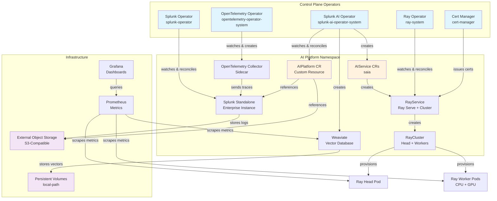

# k0s Cluster Setup for Splunk AI Platform

Complete guide for deploying Splunk AI Platform on k0s Kubernetes clusters.

## Table of Contents

- [Overview](#overview)
- [Features](#features)
- [Prerequisites](#prerequisites)
- [Quick Start](#quick-start)
- [Configuration](#configuration)
- [Usage](#usage)
- [Architecture](#architecture)
- [Image Pull Secrets](#image-pull-secrets)
- [Advanced Topics](#advanced-topics)
  - [k0s Config Persistence](#k0s-config-persistence)
  - [Kine Compaction](#kine-compaction)
  - [Insecure Registry Support (containerd v2)](#insecure-registry-support-containerd-v2)
- [Traefik HTTPS Ingress](#traefik-https-ingress)
- [Air-Gapped Deployment](#air-gapped-deployment)
- [Splunk AI Assistant App](#splunk-ai-assistant-app)
  - [Onboarding to the AI Tier](#onboarding-to-the-ai-tier)
- [Troubleshooting](#troubleshooting)
- [Security](#security)
- [Internet Dependencies](#internet-dependencies)
- [Migration Guide](#migration-guide)

---

## Overview

The `k0s_cluster_with_stack.sh` script deploys the complete Splunk AI Platform on k0s Kubernetes, supporting:

- **Bare metal / on-premises deployments** with existing hardware and SSH access
- **External S3-compatible object storage** (SeaweedFS, MinIO, or any S3-compatible endpoint) — customer-managed
- **Air-gapped environments** with private registries
- **Session logging** — all output captured to timestamped log files
- **Safety gates** — refuses to wipe a live cluster with Ready nodes

> **Important:** This script requires pre-provisioned nodes with `existingIPs` in the config YAML. It does **not** auto-create cloud instances. Object storage must be external and customer-managed (no in-cluster MinIO is deployed).

### What is k0s?

[k0s](https://k0sproject.io/) is a CNCF-certified, lightweight Kubernetes distribution designed for:
- Simple installation (single binary, no OS dependencies)
- Production-ready clusters with minimal overhead
- Edge, IoT, and on-premises deployments
- Air-gapped and security-sensitive environments

---

## Features

### Complete AI Platform Stack

The script installs everything needed for the AI Platform:

1. **k0s v1.33.13+k0s.1 Kubernetes Cluster** — Pinned full-stack compatibility baseline
2. **Calico CNI** — High-performance networking with VXLAN
3. **local-path Storage Provisioner** — Default StorageClass for PVCs
4. **Cert-Manager v1.21.1** — Automated certificate management; its installer gate accepts Kubernetes 1.33–1.36
5. **Kube-Prometheus Stack** — Monitoring with Prometheus + Grafana
6. **OpenTelemetry Operator** — Distributed tracing and telemetry
7. **NVIDIA Host Drivers + Device Plugin** — GPU support (RHEL 9)
8. **KubeRay Operator v1.2.2** — Ray cluster management for distributed AI
9. **Splunk Operator** — Splunk Enterprise management
10. **Splunk AI Platform Operator** — AI platform orchestration (SAIA feature)
11. **AIPlatform CR** — Complete AI deployment with features, scheduling, and secrets
12. **Optional Traefik HTTPS ingress** — HostPort-based HTTPS for SAIA and, in internal mode, Splunk Web

### Operational Features

- **Two-phase parallel installation** — Independent components install concurrently for faster deployments
- **Helm retry with exponential backoff** — Automatic retries on transient errors (timeouts, TLS handshake failures)
- **Preflight validation** — Checks tools, config, SSH connectivity, and disk space before starting
- **Safety gate** — Refuses to wipe a cluster that has Ready nodes (prevents accidental data loss)
- **Session logging** — All stdout/stderr captured to `tools/cluster_setup/logs/k0s-install-YYYY-MM-DD_HH-MM-SS.log`
- **Existing cluster detection** — `useExisting` flag (auto/force/never) to skip k0s install and deploy stack only

### Image Pull Secrets Support

Automatically creates and configures secrets for private container registries:
- **AWS ECR** — Elastic Container Registry (auto-token refresh)
- **Docker Hub** — Docker Hub private repositories
- **GCR** — Google Container Registry
- **ACR** — Azure Container Registry
- **Custom** — Any Docker registry

Secrets are automatically propagated through the platform:
```
AIPlatform CR → AIService → Job/RayCluster → Pods
```

---

## Prerequisites

### Required Tools (on Admin Workstation)

```bash
# Install required tools on macOS
brew install bash kubectl helm git jq yq
# The installer uses /usr/bin/env bash and requires Bash >= 4. Put Homebrew Bash first.
export PATH="$(brew --prefix)/bin:$PATH"

# Install required tools on Ubuntu/Debian
sudo apt-get update
sudo apt-get install -y bash kubectl helm git jq
wget https://github.com/mikefarah/yq/releases/latest/download/yq_linux_amd64 -O /usr/local/bin/yq
chmod +x /usr/local/bin/yq

# Verify installations
bash --version
kubectl version --client
helm version
git --version
jq --version
yq --version
```

`k0s_cluster_with_stack.sh` requires Bash 4 or newer; Bash 5 is recommended. macOS ships an
older `/bin/bash`, so either keep Homebrew's `bin` directory first in `PATH` as shown above or
invoke the script explicitly with `"$(brew --prefix)/bin/bash"`. The script exits before making
cluster changes when the resolved Bash is too old.

### Kubernetes and cert-manager Compatibility Baseline

The online installer and air-gap builder default to the same compatibility baseline:

| Component | Pinned version / range |
|---|---|
| k0s | `v1.33.13+k0s.1` (embeds Kubernetes 1.33.13) |
| cert-manager | `v1.21.1` |
| cert-manager preflight server range | Kubernetes 1.33–1.36 |

`K0S_VERSION` and the air-gap builder's `--k0s-version` option may select another k0s release only
when it embeds Kubernetes 1.33–1.36. That range is cert-manager's gate, not a statement that the
rest of the platform is validated on every minor: an explicit Kubernetes 1.34–1.36 override
requires the operator to validate Splunk Operator and full-stack compatibility independently.
The installer checks the live server version before touching cert-manager. It reuses an existing
installation only when the controller, webhook, and cainjector Deployments are all present and
their live container images use exactly `v1.21.1`; it will not upgrade or take ownership of a
different/mixed version, or adopt cert-manager CRDs when the controller Deployment is absent.
Follow [Migrating an Existing cert-manager
Installation](#migrating-an-existing-cert-manager-installation) before running the installer on
such a cluster.

### Hardware Requirements

| Node Type | Min CPU | Min RAM | Min Disk | Notes |
|-----------|---------|---------|----------|-------|
| Controller | 4+ | 8 GB | 100 GB | Runs API server, etcd, scheduler |
| CPU Worker | 8+ | 32 GB | 200 GB | Runs Weaviate, Ray head, Splunk, SAIA API/v2, Data Loader |
| GPU Worker | 48 vCPUs | 384 GiB | 500 GB | 4 × NVIDIA L40S per node (48 GB GDDR6 each) · **2 nodes required = 8 × L40S total (384 GB total GPU memory)** · 100 Gbps · equivalent to g6e.12xlarge |

**Ports between nodes:** 22 (SSH), 6443 (API), 2380 (etcd), 10250 (kubelet), 8132 (konnectivity), 4789/UDP (VXLAN), 179 (Calico BGP). Best practice: allow all ports between nodes.

### Software Requirements (on All Nodes)

- RHEL 9
- Passwordless SSH access from admin workstation
- Sudo privileges without password
- Python 3.8+ installed

### Network Requirements

Open the following ports between nodes:

| Port | Protocol | Purpose |
|------|----------|---------|
| 22 | TCP | SSH management |
| 6443 | TCP | Kubernetes API server |
| 2380 | TCP | etcd peer communication |
| 10250 | TCP | Kubelet API |
| 8132 | TCP | Konnectivity agent |
| 179 | TCP | Calico BGP |
| 4789 | UDP | Calico VXLAN |
| 30000-32767 | TCP | NodePort services (optional) |
| 8443 / 8000 | TCP | Optional Traefik HTTPS hostPorts for SAIA / internal Splunk Web; port 8000 is not bound in external/disabled Splunk mode; open only from the client/VPN network |
| 8089 | TCP | Optional Traefik TCP passthrough for Splunk management; disabled by default |

### External Object Storage

You must provide an external S3-compatible object storage endpoint:
- **SeaweedFS**, **MinIO**, or any S3-compatible service
- Must be reachable from all cluster nodes
- The script does **not** deploy object storage in-cluster

---

## Quick Start

### 1. Clone the Repository

```bash
git clone https://github.com/splunk/splunk-ai-operator.git
cd splunk-ai-operator/tools/cluster_setup
```

### 2. Create Configuration File

```bash
# Copy the template
cp k0s-cluster-config.yaml my-cluster.yaml

# Edit with your settings
vi my-cluster.yaml
```

### 3. Deploy the Cluster

```bash
CONFIG_FILE=./my-cluster.yaml ./k0s_cluster_with_stack.sh install
```

### 4. Verify Installation

```bash
# Set kubeconfig (saved automatically during install)
export KUBECONFIG=~/.kube/k0s-my-cluster

# Check nodes
kubectl get nodes

# Check AI Platform
kubectl get aiplatform -n ai-platform

# Check all components
kubectl get pods --all-namespaces
```

---

## Configuration

### Configuration File Structure

The `k0s-cluster-config.yaml` file controls all aspects of the deployment:

```yaml
cluster:           # Cluster name, useExisting, SSH user/key, optional API external address
nodes:             # Controller/worker counts and existingIPs
storage:           # storageClass, vectorDbSize, objectStore, minimumDiskSpace
images:            # registry prefix plus exact component refs; Traefik has an independent exact ref
operators:         # ray (version/modelVersion/rayVersion), certManager, nvidia devicePluginVersion
kubernetes:        # namespace
files:             # splunkOperator, aiPlatform manifest paths
splunk:            # standaloneName
aiPlatform:        # defaultAcceleratorType, workerGroupConfig, features, scheduling, serviceTemplate
imagePullSecrets:  # secrets list, autoCreateECR, dockerHub, gcr, acr, custom
ecr:               # account, region
ingress:           # optional Traefik HTTPS gate, hostname, FIPS setting, and hostPorts
```

### Configuration Example

```yaml
cluster:
  name: prod-ai-platform
  useExisting: auto               # auto | force | never
  sshUser: ubuntu
  sshKeyPath: ~/.ssh/prod-key.pem
  # Set when workers cannot reach the controller's auto-detected private IP.
  apiExternalAddress: api.prod.example.com

nodes:
  controllers: 1
  cpuWorkers: 2                   # First 2 workers treated as CPU
  gpuWorkers: 2                   # Remaining 2 workers treated as GPU
  existingIPs:
    controllers:
      - 10.0.1.10
    workers:
      - 10.0.1.20                 # CPU (worker index 0)
      - 10.0.1.21                 # CPU (worker index 1)
      - 10.0.1.22                 # GPU (worker index 2)
      - 10.0.1.23                 # GPU (worker index 3)

storage:
  storageClass: "local-path"
  vectorDbSize: "200Gi"
  minimumDiskSpace:               # Preflight disk checks (GB)
    controller: 100
    cpuWorker: 200
    gpuWorker: 500
  objectStore:
    type: "seaweedfs"             # aws | s3compat | minio | seaweedfs
    bucket: "ai-platform-data"
    endpoint: "http://10.0.1.50:8333"   # REQUIRED for s3compat/minio/seaweedfs
    auth:
      rootUser: "admin"
      rootPassword: "Change-This-Strong-Password!"
  modelStaging:
    enabled: true                 # Download from HF + upload to object store before install

images:
  registry: "registry.corp.com"
  operator:
    image: "registry.corp.com/splunk/splunk-ai-operator:v0.1.5"
  splunk:
    image: "registry.corp.com/splunk/splunk:latest"
    operatorImage: "docker.io/splunk/splunk-operator:3.0.0"
  ray:
    headImage: "registry.corp.com/ray/ray-head:build-v1alpha1"
    workerImage: "registry.corp.com/ray/ray-worker-gpu:build-v1alpha1"
  weaviate:
    image: "docker.io/semitechnologies/weaviate:stable-v1.28"
  saia:
    apiImage: "registry.corp.com/saia/saia-api:build-v1alpha1"
    apiV2Image: "registry.corp.com/saia/saia-api-v2:build-v1alpha1"
    dataLoaderImage: "registry.corp.com/saia/saia-data-loader:build-v1alpha1"
  nginx:
    image: "docker.io/library/nginx:1.27-alpine"
  fluentBit:
    image: "docker.io/fluent/fluent-bit:1.9.6"
  otelCollector:
    image: "docker.io/otel/opentelemetry-collector-contrib:0.122.1"
  ingress:
    # Exact reference: images.registry is not prepended to Traefik.
    traefikImage: "docker.io/library/traefik:v3.6.25@sha256:31267173a15b4944e797a76ffd9c419707c8d8b32fe5b610f80cd0cfa05f372d"

operators:
  ray:
    version: "v1.2.2"
    modelVersion: "v0.3.14-36-g1549f5a"
    rayVersion: "2.44.0"
  certManager:
    installCRDs: true
  nvidia:
    devicePluginVersion: "v0.17.3"

kubernetes:
  namespace: ai-platform

splunk:
  standaloneName: splunk-prod

aiPlatform:
  name: "prod-ai-stack"
  defaultAcceleratorType: "L40S"        # L40S or H100
  workerGroupConfig:
    imageRegistry: ""                   # Override registry for Ray worker images
  features:
    - name: "saia"
      version: "1.1.0"
      serviceAccountName: ""
  cpuScheduling:
    nodeSelector:
      splunk.ai/workload-type: cpu
    tolerations: []
  gpuScheduling:
    nodeSelector:
      splunk.ai/workload-type: gpu
    tolerations:
      - key: "nvidia.com/gpu"
        operator: "Equal"
        value: "true"
        effect: "NoSchedule"
  serviceTemplate:                      # Optional: expose SAIA externally
    type: "NodePort"                    # NodePort | LoadBalancer
    nodePort: 30080                     # Port for NodePort type

ingress:
  enabled: false                        # opt in to Traefik HTTPS ingress
  hostname: ""                          # optional DNS SAN; worker IP SANs are automatic
  fips: "off"                           # off | on; "on" also requires an approved image
  tls:
    mode: selfsigned                    # only supported mode
  entryPoints:
    saia:
      port: 8443
    splunkWeb:
      port: 8000
    splunkMgmt:
      port: 8089
      enabled: false                    # opt in only when direct management access is needed

imagePullSecrets:
  secrets: []
  autoCreateECR: true
  dockerHub:
    enabled: false
    username: ""
    password: ""
    email: ""
  gcr:
    enabled: false
    jsonKey: ""
  acr:
    enabled: false
    registry: ""
    username: ""
    password: ""
  custom:
    enabled: false
    name: "custom-registry-secret"
    server: ""
    username: ""
    password: ""
    email: ""

ecr:
  account: "123456789012"
  region: us-east-2
```

### Configuration Reference

#### Cluster Section

| Field | Required | Default | Description |
|-------|----------|---------|-------------|
| `cluster.name` | Yes | — | Cluster identifier (used for kubeconfig, labels) |
| `cluster.useExisting` | No | `never` | `auto` = detect existing cluster, `force` = fail if not found, `never` = always create new |
| `cluster.sshUser` | Yes | `ubuntu` | SSH username for all nodes |
| `cluster.sshKeyPath` | Yes | — | Path to SSH private key |
| `cluster.apiExternalAddress` | No | Auto-detected private bind address | API IP or hostname reachable by every worker; set for public-only or routed worker topologies |

#### Nodes Section

| Field | Required | Default | Description |
|-------|----------|---------|-------------|
| `nodes.controllers` | No | `1` | Number of controller nodes (1 or 3 for HA) |
| `nodes.cpuWorkers` | No | `2` | First N workers in the list are labeled as CPU |
| `nodes.gpuWorkers` | No | `1` | Remaining workers after cpuWorkers are labeled as GPU |
| `nodes.existingIPs.controllers` | **Yes** | — | List of controller node IPs |
| `nodes.existingIPs.workers` | **Yes** | — | List of worker node IPs |

#### Storage Section

| Field | Required | Default | Description |
|-------|----------|---------|-------------|
| `storage.storageClass` | No | `local-path` | Kubernetes StorageClass for PVCs |
| `storage.vectorDbSize` | No | `50Gi` | Weaviate PersistentVolume size |
| `storage.minimumDiskSpace.controller` | No | `100` | Minimum disk (GB) for controller preflight check |
| `storage.minimumDiskSpace.cpuWorker` | No | `200` | Minimum disk (GB) for CPU worker preflight check |
| `storage.minimumDiskSpace.gpuWorker` | No | `500` | Minimum disk (GB) for GPU worker preflight check |
| `storage.objectStore.type` | No | `minio` | `aws`, `s3compat`, `minio`, or `seaweedfs` |
| `storage.objectStore.bucket` | No | `ai-platform-data` | S3 bucket name. **Must be lowercase** — the installer normalizes to lowercase automatically; uppercase letters in the config value are silently converted before any store operations. |
| `storage.objectStore.endpoint` | **Yes*** | — | S3-compatible endpoint URL (*required for s3compat/minio/seaweedfs) |
| `storage.objectStore.auth.rootUser` | Yes | — | Access key / root user |
| `storage.objectStore.auth.rootPassword` | Yes | — | Secret key / root password |
| `storage.modelStaging.enabled` | No | `true` | Download models from Hugging Face and upload to the object store before cluster install. Set `false` to skip (e.g. models already staged). |

#### S3 Bucket Directory Layout

The S3 bucket serves as the shared storage layer for both pre-staged artifacts and runtime data.

**Pre-staged (must exist before install when `modelStaging.enabled: true` is not set):**

| Directory | Owner | Description |
|---|---|---|
| `model_artifacts/<id>/` | Admin (pre-staged) | Pre-trained model weights loaded by Ray workers at startup |
| `staging_state/<id>/.staging_complete` | Installer | Completion marker; its content includes `accel=<type>` written by the download script. The pre-check validates both presence and `accel=` field so switching `defaultAcceleratorType` forces re-download and re-upload of models that differ between GPU configs (e.g. `gemma-4-31b-it`). |

**Created at runtime by SAIA services:**

| Directory | Owner | Description |
|---|---|---|
| `conversations/` | SAIA v2 API | Conversation history per tenant |
| `config/` | SAIA v2 API / Worker | Tenant data configuration (`config/tenant_data_config/{tenant}.yaml`) |
| `storage_queue/` | SAIA v2 Worker | S3-backed task queue for async ingestion (`urgent/`, `batch/`, `locks/`) |
| `ingestion/tenant_data/` | SAIA v2 Worker | Temporary ingestion payload storage during processing |
| `field_counts/` | SAIA v2 Worker | Cached field count statistics per tenant/index/sourcetype |
| `admin/preferences/` | SAIA v2 API | Admin-curated markdown preferences per tenant |
| `job_groups/` | SAIA v1 API | Background job group state for data upload tasks |

**Created at runtime by other platform components:**

| Directory | Owner | Description |
|---|---|---|
| `artifacts/` | AI Operator | Deployment artifacts |
| `tasks/` | AI Operator / Ray | Task execution state |

> **Note:** Do not manually delete runtime directories (`conversations/`, `config/`, `storage_queue/`) as they contain active state. Deleting `storage_queue/locks/` may be necessary to clear stale distributed locks after a non-graceful pod restart.

#### Images Section

Short application image paths (without a FQDN) are automatically prefixed with
`images.registry`. Traefik is an intentional exception: its exact
`images.ingress.traefikImage` value is used verbatim so a tag/digest pin cannot be silently
rewritten.

| Field | Required | Default | Description |
|-------|----------|---------|-------------|
| `images.registry` | No | `""` | Registry hostname (and optional port) used to prefix short image paths, e.g. `registry.internal:5000` or `123456789.dkr.ecr.us-east-2.amazonaws.com` |
| `images.registryInsecure` | No | `false` | Set to `true` only for plain-HTTP (no-TLS) registries such as a local mirror. Leave `false` for ECR, Docker Hub, Harbor, or any HTTPS registry. When `true`, the installer configures containerd on every node to allow HTTP pulls from `images.registry` — see [Insecure Registry Support](#insecure-registry-support-containerd-v2). |
| `images.operator.image` | **Yes** | — | Splunk AI Operator image |
| `images.splunk.image` | **Yes** | — | Splunk Enterprise image |
| `images.splunk.operatorImage` | No | `docker.io/splunk/splunk-operator:3.0.0` | Splunk Operator image |
| `images.ray.headImage` | **Yes** | — | Ray head node image |
| `images.ray.workerImage` | **Yes** | — | Ray GPU worker image |
| `images.weaviate.image` | **Yes** | — | Weaviate vector DB image |
| `images.saia.apiImage` | **Yes** | — | SAIA API v1 image |
| `images.saia.apiV2Image` | **Yes** | — | SAIA API v2 image |
| `images.saia.dataLoaderImage` | **Yes** | — | SAIA data loader / post-install hook image |
| `images.nginx.image` | No | `docker.io/library/nginx:1.27-alpine` | Nginx reverse proxy for SAIA v1/v2 routing |
| `images.fluentBit.image` | No | `fluent/fluent-bit:1.9.6` | Fluent Bit log forwarder |
| `images.otelCollector.image` | No | `otel/opentelemetry-collector-contrib:0.122.1` | OpenTelemetry Collector |
| `images.ingress.traefikImage` | No | `docker.io/library/traefik:v3.6.25@sha256:31267173a15b4944e797a76ffd9c419707c8d8b32fe5b610f80cd0cfa05f372d` | Exact Traefik pull reference used only when `ingress.enabled: true`; set this key explicitly for a mirror or approved FIPS build because `images.registry` is not applied |

**Secure vs insecure registry — which to use:**

| Registry type | `images.registry` | `images.registryInsecure` | Notes |
|---|---|---|---|
| AWS ECR | `<account>.dkr.ecr.<region>.amazonaws.com` | `false` (default) | HTTPS; use `imagePullSecrets.autoCreateECR: true` for token refresh |
| Harbor / internal HTTPS | `registry.internal:443` | `false` (default) | HTTPS with valid TLS cert — no extra config needed |
| Plain-HTTP internal mirror | `10.0.0.5:5000` or `registry.internal:5000` | **`true`** | Installer writes containerd config for HTTP pulls on every node; see [Insecure Registry Support](#insecure-registry-support-containerd-v2) |
| Docker Hub | `docker.io` | `false` (default) | Public HTTPS — no `images.registry` needed unless mirroring |

> **Do not set `registryInsecure: true` for HTTPS registries.** It has no effect on TLS registries and may cause unexpected behaviour.

**Image rendering chain:** The script reads these config values and resolves application images via
`build_image_url()` (which prepends the registry when needed). Traefik bypasses that helper and is
rendered verbatim into its inline DaemonSet:

| Config field | Rendered field / env var | Target |
|---|---|---|
| `images.operator.image` | Container `image:` field | `artifacts.yaml` |
| `images.splunk.image` | `RELATED_IMAGE_SPLUNK_ENTERPRISE` | `splunk-operator-cluster.yaml` |
| `images.splunk.operatorImage` | Container `image:` field | `splunk-operator-cluster.yaml` |
| `images.ray.headImage` | `RELATED_IMAGE_RAY_HEAD` | `artifacts.yaml` |
| `images.ray.workerImage` | `RELATED_IMAGE_RAY_WORKER` | `artifacts.yaml` |
| `images.weaviate.image` | `RELATED_IMAGE_WEAVIATE` | `artifacts.yaml` |
| `images.saia.apiImage` | `RELATED_IMAGE_SAIA_API` | `artifacts.yaml` |
| `images.saia.apiV2Image` | `RELATED_IMAGE_SAIA_API_V2` | `artifacts.yaml` |
| `images.saia.dataLoaderImage` | `RELATED_IMAGE_POST_INSTALL_HOOK` | `artifacts.yaml` |
| `images.nginx.image` | `RELATED_IMAGE_NGINX` | `artifacts.yaml` |
| `images.fluentBit.image` | `RELATED_IMAGE_FLUENT_BIT` | `artifacts.yaml` |
| `images.otelCollector.image` | `RELATED_IMAGE_OTEL_COLLECTOR` | `artifacts.yaml` |
| `operators.ray.modelVersion` | `MODEL_VERSION` | `artifacts.yaml` |
| `operators.ray.rayVersion` | `RAY_VERSION` | `artifacts.yaml` |
| `images.ingress.traefikImage` | Inline DaemonSet `image:` | Installer-rendered Traefik DaemonSet (used verbatim; no `images.registry` prefix) |

#### AI Platform Section

| Field | Required | Default | Description |
|-------|----------|---------|-------------|
| `aiPlatform.name` | No | `${CLUSTER_NAME}-ai-platform` | Base name for the AIPlatform CR |
| `aiPlatform.defaultAcceleratorType` | **Yes** | `""` | GPU accelerator type — `L40S` or `H100` |
| `aiPlatform.workerGroupConfig.imageRegistry` | No | `""` | Override registry for Ray worker images |
| `aiPlatform.features` | Yes | — | Array of features to deploy (read dynamically from config) |
| `aiPlatform.features[].name` | Yes | — | Feature name (e.g., `saia`) |
| `aiPlatform.features[].version` | Yes | — | Feature version |
| `aiPlatform.features[].serviceAccountName` | No | `""` | Service account override |
| `aiPlatform.cpuScheduling.nodeSelector` | No | auto-generated | Node selector for CPU workloads |
| `aiPlatform.cpuScheduling.tolerations` | No | `[]` | Tolerations for CPU workloads |
| `aiPlatform.gpuScheduling.nodeSelector` | No | auto-generated | Node selector for GPU workloads |
| `aiPlatform.gpuScheduling.tolerations` | No | GPU toleration | Tolerations for GPU workloads |
| `aiPlatform.serviceTemplate.type` | No | — | Service type for SAIA exposure: `NodePort` or `LoadBalancer` |
| `aiPlatform.serviceTemplate.nodePort` | No | — | Node port number (only when type=NodePort) |

#### Traefik Ingress Section

| Field | Required | Default | Description |
|---|---|---|---|
| `ingress.enabled` | No | `false` | Enables the optional Traefik hostPort DaemonSet. An explicit feature list must include `saia`. |
| `ingress.hostname` | No | `""` | Optional lowercase DNS SAN. The installer also adds every ingress-node IP SAN. |
| `ingress.fips` | No | `"off"` | `off` or `on`. `on` only sets `GODEBUG=fips140=on`; it also requires an appropriately built and independently validated image. |
| `ingress.tls.mode` | No | `selfsigned` | Only `selfsigned` is implemented; `provided` and `acme` are rejected. |
| `ingress.entryPoints.saia.port` | No | `8443` | SAIA HTTPS hostPort. |
| `ingress.entryPoints.splunkWeb.port` | No | `8000` | Internal Splunk Web HTTPS hostPort; not bound in external/disabled Splunk mode. |
| `ingress.entryPoints.splunkMgmt.port` | No | `8089` | Splunk management TCP-passthrough hostPort. |
| `ingress.entryPoints.splunkMgmt.enabled` | No | `false` | Binds the management listener only when explicitly enabled in internal Splunk mode. |

Ingress ports must be integers from 1024 through 65535, must be unique, cannot use Traefik's
pod-local health port `9000`, and cannot collide with retained SAIA/slim NodePorts. Enabling
ingress is additive; it does not rewrite the configured SAIA Service type.

#### Image Pull Secrets Section

For platform workloads, the script auto-detects known provider Secret names in the AI namespace.
When Traefik is enabled, each name in `imagePullSecrets.secrets[]` can also be a source Secret in
the AI namespace. If the name is absent from `ingress`, or the existing copy is installer-owned,
the installer validates the source, creates or refreshes a labelled copy, and attaches it to the
Traefik pod. A valid, pre-existing unowned Secret of the same name in `ingress` is used without
being adopted or overwritten. Disable reconciliation deletes the labelled installer copies, but
retains pre-existing/unowned registry credentials in `ingress`; remove a retained credential
explicitly only after confirming it has no consumer.

```yaml
imagePullSecrets:
  secrets: []                         # source names copied into ingress when Traefik is enabled
  autoCreateECR: true                 # Consumed → creates ECR secret from AWS creds

  dockerHub:
    enabled: false
    username: ""
    password: ""
    email: ""

  gcr:
    enabled: false
    jsonKey: ""

  acr:
    enabled: false
    registry: ""
    username: ""
    password: ""

  custom:
    enabled: false
    name: "custom-registry-secret"
    server: ""
    username: ""
    password: ""
    email: ""
```

---

## Usage

### Commands

```bash
# Install cluster and full AI Platform stack
CONFIG_FILE=./my-config.yaml ./k0s_cluster_with_stack.sh install

# Stage model artifacts only (download from HF + upload to object store)
CONFIG_FILE=./my-config.yaml ./k0s_cluster_with_stack.sh stage-artifacts

# Re-stage without re-downloading models already present locally
SKIP_IF_EXISTS=1 CONFIG_FILE=./my-config.yaml ./k0s_cluster_with_stack.sh stage-artifacts

# Delete entire cluster (stop k0s, remove services)
CONFIG_FILE=./my-config.yaml ./k0s_cluster_with_stack.sh delete

# Clean all k0s state from bare-metal nodes (stop/reset/remove)
CONFIG_FILE=./my-config.yaml ./k0s_cluster_with_stack.sh clean-all

# Join additional workers to an existing cluster (or rejoin failed workers)
CONFIG_FILE=./my-config.yaml ./k0s_cluster_with_stack.sh join-workers
```

### Environment Variables

#### General

| Variable | Default | Description |
|----------|---------|-------------|
| `CONFIG_FILE` | `./k0s-cluster-config.yaml` | Path to configuration file |
| `AUTO_APPROVE` | `false` | Skip confirmation prompts |
| `USE_EXISTING` | (from config) | Override `cluster.useExisting` (`auto`/`force`/`never`) |
| `LOG_DIR` | `./logs` | Directory for session log files |
| `SKIP_IF_EXISTS` | `0` | Set to `1` to skip models that have a local `.staging_complete` marker (replaced the old directory-existence check) |
| `SKIP_IF_STAGED` | `0` | Set to `1` to also check the object store; skips models whose `staging_state/<id>/.staging_complete` marker already exists there |
| `HF_DOWNLOAD_RETRIES` | `2` | Number of download retries per model before giving up (15s backoff; partial folder deleted between attempts) |

#### Air-Gap Mode

Use `cluster.airgap: true` in your config YAML to tell the installer the cluster has no outbound internet:

```yaml
cluster:
  name: my-cluster
  airgap: true   # disconnected environment — skips HuggingFace + NVIDIA repo checks
  sshKeyPath: ~/.ssh/id_rsa
  sshUser: ec2-user
```

**What `airgap: true` does:**
- Skips the HuggingFace connectivity check before model staging (models must be pre-staged in object store)
- Skips the NVIDIA package repo connectivity check on GPU workers (drivers must be pre-installed)
- Object store connectivity is still checked — it lives on your local network and must be reachable
- The install plan banner shows `Air-gap mode: true` so customers can confirm it was picked up

**Precedence:** `AIRGAP_MODE=true` env var overrides the YAML value — useful for a one-off run without editing the file. `install_from_airgap_bundle.sh` sets `AIRGAP_MODE=true` automatically; no manual config change needed when using the bundle workflow.

| Setting | How to set | When to use |
|---|---|---|
| `cluster.airgap: true` in YAML | Edit `k0s-cluster-config.yaml` | Permanent air-gap environment — commit it with your config |
| `AIRGAP_MODE=true` env var | `AIRGAP_MODE=true ./k0s_cluster_with_stack.sh install` | One-off run without editing YAML, or CI override |
| Neither (default) | Do nothing | Internet-connected environment |

#### Air-Gap URL Overrides

Every internet URL in the installer can be redirected to a local file or
internal mirror by setting the corresponding variable. Unset variables fall
back to the default public URL. These are set automatically by
`install_from_airgap_bundle.sh`; set them manually only for partial overrides.

| Variable | Replaces | Example value |
|----------|----------|---------------|
| `K0S_INSTALL_URL` | `https://get.k0s.sh` | `file:///opt/airgap/bundle/binaries/k0s` |
| `YQ_DOWNLOAD_URL` | GitHub yq release URL | `file:///opt/airgap/bundle/binaries/yq` |
| `CERT_MANAGER_MANIFEST_URL` | GitHub cert-manager release URL | `file:///opt/airgap/bundle/manifests/cert-manager.yaml` |
| `LOCAL_PATH_MANIFEST_URL` | GitHub local-path-provisioner URL | `file:///opt/airgap/bundle/manifests/local-path-storage.yaml` |
| `NVIDIA_DEVICE_PLUGIN_MANIFEST_URL` | GitHub NVIDIA device plugin URL | `file:///opt/airgap/bundle/manifests/nvidia-device-plugin.yml` |
| `PROMETHEUS_CHART_PATH` | `prometheus-community/kube-prometheus-stack` | `/opt/airgap/bundle/charts/kube-prometheus-stack-72.3.0.tgz` |
| `OTEL_CHART_PATH` | `open-telemetry/opentelemetry-operator` | `/opt/airgap/bundle/charts/opentelemetry-operator-0.80.0.tgz` |
| `KUBERAY_CHART_PATH` | `kuberay/kuberay-operator` | `/opt/airgap/bundle/charts/kuberay-operator-1.2.2.tgz` |
| `METALLB_CHART_PATH` | `metallb/metallb` | `/opt/airgap/bundle/charts/metallb-0.14.8.tgz` |

See [Air-Gapped Deployment](#air-gapped-deployment) for the full air-gap workflow.

### Session Logging

All script output (stdout and stderr) is automatically captured to a timestamped log file:

```
tools/cluster_setup/logs/k0s-install-2026-04-29_14-30-00.log
```

Override the log directory:
```bash
LOG_DIR=/var/log/k0s CONFIG_FILE=./my-config.yaml ./k0s_cluster_with_stack.sh install
```

### Install Flow

The `install` command executes these steps in order:

1. **Load config** — Parse YAML, validate existingIPs
2. **Validate images** — Ensure all required image fields are set
3. **Configure images** — Patch `RELATED_IMAGE_*` env vars in manifest files
4. **Preflight checks** — Validate tools, SSH connectivity, disk space, config
5. **Model staging** *(when `storage.modelStaging.enabled: true`, the default)* — Download models from Hugging Face for the configured GPU type (`aiPlatform.defaultAcceleratorType`) and upload them to the object store. The staging pipeline is **resumable**: each model gets a per-model completion marker; re-runs skip already-staged models and cleanly retry only incomplete ones. The installer passes `SKIP_IF_STAGED=1` by default so previously staged models are never re-downloaded or re-uploaded. Skipped entirely when `enabled: false`.

   **Models staged (from `model_artifacts_configs.yaml`):**

   | Model artifact ID | Purpose |
   |---|---|
   | `gemma-4-31b-it` | Primary LLM for chat, SPL generation, reasoning |
   | `gpt-oss-20b` | Secondary LLM |
   | `all-minilm-l6-v2` | Sentence transformer / semantic search |
   | `bi-encoder` | BGE small encoder |
   | `cross-encoder` | MS MARCO cross-encoder |
   | `e5-language-classifier` | Multilingual language detection |
   | `fm_timeseries` | Cisco Time Series Model (CTSM) forecaster |
   | `mbart-translator` | Multilingual translation |
   | `pii-classifier` | PII detection |
   | `uae-large` | Embedding model |
   | `xlm-roberta-language-classifier` | Language classifier |

   **System requirements for the staging machine** (the machine running the installer or staging scripts):

   | Resource | Minimum | Notes |
   |---|---|---|
   | Disk (free) | 250 GB | >120 GB for 10 model weight files + buffer for download staging and upload temp files |
   | RAM | 16 GB | Needed to stream large files without swapping |
   | Internet | Stable broadband | Downloads >120 GB from HuggingFace; re-run with `SKIP_IF_EXISTS=1` to resume interrupted downloads |
   | CPU | 4 cores | Recommended for parallel upload scripts |

   This can be the same machine used to run the installer script.

   **Manual staging** (running scripts directly without cluster install):

   ```bash
   # Stage models — GPU type read from aiPlatform.defaultAcceleratorType in config
   CONFIG_FILE=./my-cluster.yaml ./k0s_cluster_with_stack.sh stage-artifacts

   # Resume: skip models already staged in the object store (default behaviour of the installer)
   SKIP_IF_STAGED=1 CONFIG_FILE=./my-cluster.yaml ./k0s_cluster_with_stack.sh stage-artifacts
   ```

   Before starting any download work, `stage-artifacts` runs `all_models_staged()` — a fast pre-check that reads the GPU-specific artifact config, verifies each model's `staging_state/<id>/.staging_complete` marker in the object store, and validates that the marker's `accel=` field matches the configured accelerator type. If all models are present and match, it exits immediately (no download, no upload). If some are missing or have a mismatched accelerator it logs each one:

   ```
   [LOG] Model staging needed: 2/10 model(s) not yet staged.
   [LOG]   MISSING: gpt-oss-20b  (bucket/staging_state/gpt-oss-20b/.staging_complete not found or accel mismatch)
   [LOG]   MISSING: gemma-4-31b-it  (bucket/staging_state/gemma-4-31b-it/.staging_complete not found or accel mismatch)
   ```

   After upload completes, a post-stage verification pass re-checks all store markers and fails with a clear per-model error list if any are still absent — preventing an install from proceeding with an incomplete model set.

   To run the download script directly, pass the GPU type via `--accelerator`. If neither flag nor `ACCELERATOR` env var is set, the script prompts interactively:

   ```bash
   cd tools/artifacts_download_upload_scripts

   # Explicit GPU type
   ./download_from_huggingface.sh --accelerator l40s   # or h100

   # Interactive — prompted when no flag or ACCELERATOR env var is set:
   #   Select GPU type:
   #     1) l40s
   #     2) h100
   #   Enter 1 or 2:
   ./download_from_huggingface.sh
   ```

   Helper scripts in `tools/artifacts_download_upload_scripts/` can also be run independently:

   | Storage Type | Script | Key Environment Variables |
   |---|---|---|
   | MinIO / S3-compatible | `upload_to_minio.sh` | `OBJECT_STORE_ENDPOINT`, `OBJECT_STORE_BUCKET`, `OBJECT_STORE_ACCESS_KEY`, `OBJECT_STORE_SECRET_KEY` |
   | SeaweedFS | `upload_to_seaweedfs.sh` | `S3COMPAT_OBJECT_STORE_ENDPOINT`, `S3COMPAT_OBJECT_STORE_BUCKET`, `S3COMPAT_OBJECT_STORE_ACCESS_KEY`, `S3COMPAT_OBJECT_STORE_SECRET_KEY` |
   | AWS S3 | `upload_to_s3.sh` | `S3_BUCKET`, `S3_REGION` (requires AWS CLI credentials) |
   | MinIO via AWS CLI | `upload_to_minio_aws.sh` | `S3COMPAT_OBJECT_STORE_ENDPOINT`, `S3COMPAT_OBJECT_STORE_BUCKET`, `S3COMPAT_OBJECT_STORE_ACCESS_KEY`, `S3COMPAT_OBJECT_STORE_SECRET_KEY` |

   **Additional utilities:**

   | Script | Purpose |
   |---|---|
   | `test_minio_connection.sh` | Diagnose S3-compatible endpoint connectivity |
   | `create_seaweedfs_folders.sh` | Create standard bucket folder structure |
   | `install_seaweedfs_systemd.sh` | Install SeaweedFS as a systemd service |
   | `install_minio_ec2.sh` | Install MinIO on an EC2 instance |

   > See `tools/artifacts_download_upload_scripts/README.md` for full usage details.

6. **Install k0s cluster** — Safety gate check → clean state → install controller → join workers → label nodes
7. **Install AI Platform stack** (two-phase parallel):
   - Phase 1 (parallel): cert-manager, kube-prometheus, NVIDIA host drivers
   - Between phases: Ensure S3 credentials secret
   - Phase 2 (parallel): OTel operator, Ray operator, Splunk operator, NVIDIA device plugin
   - Sequential: Image pull secrets → Splunk TLS Certificate → Splunk Standalone (including a
     controlled OnDelete recycle on changed leaf) → AI operator → optional Traefik reconciliation
     (including the CA-only ConfigMap refresh) → AIPlatform CR
8. **Health checks** — Verify all components are running
9. **Access info** — Display kubeconfig path and service endpoints

The Splunk TLS step consumes only cert-manager's standard `tls.crt`, `tls.key`, and `ca.crt`
Secret entries. A Splunk-Ansible pre-task assembles `server.pem` in certificate-then-private-key
order on the pod's memory-backed volume; the installer does not request `CombinedPEM` or
`additionalOutputFormats`, and does not require that alpha feature gate.

### join-workers Command

The `join-workers` command is used to:
- Add new worker nodes to an existing cluster
- Rejoin workers that were disconnected or failed

It:
1. Loads config and identifies which workers are not yet joined
2. Generates a fresh worker token from the controller
3. Installs k0s worker on each missing node
4. Waits for nodes to become Ready
5. Labels nodes with `splunk.ai/*` labels based on CPU/GPU role

### useExisting Flag

| Value | Behavior |
|-------|----------|
| `never` | Always creates a new k0s cluster (default). Fails if nodes have a live cluster (safety gate). |
| `auto` | Checks if a running k0s cluster exists on the controller. If yes, skips cluster creation and deploys stack only. If no, creates new cluster. |
| `force` | Assumes an existing cluster. Fails if no running cluster is found on the controller. |

---

## Architecture

### Cluster Architecture

```
┌─────────────────────────────────────────────────────────────┐
│                  k0s Controller Node(s)                     │
│  ┌──────────────┐  ┌──────────────┐  ┌──────────────┐     │
│  │ API Server   │  │    etcd      │  │  Scheduler   │     │
│  │   :6443      │  │   :2380      │  │              │     │
│  └──────┬───────┘  └──────────────┘  └──────────────┘     │
│         │  Konnectivity                                    │
│         │  Server :8132                                    │
└─────────┼──────────────────────────────────────────────────┘
          │
    ┌─────┴────────────────────────┐
    │  Calico VXLAN Network        │
    │  (Pod Network: 10.244.0.0/16)│
    └─────┬────────────────────────┘
          │
  ┌───────┼───────────────────┬────────────────────┐
  │       │                   │                    │
┌─▼───────▼──────┐  ┌─────────▼────────┐  ┌───────▼─────────┐
│ CPU Worker 1   │  │  CPU Worker 2    │  │  GPU Worker     │
│                │  │                  │  │                 │
│ • Ray Head     │  │ • Weaviate       │  │ • Ray GPU Pods  │
│ • Splunk       │  │ • Ray CPU Pods   │  │ • AI Inference  │
│ • Monitoring   │  │ • AI Services    │  │                 │
└────────────────┘  └──────────────────┘  └─────────────────┘
```

### Network Architecture

**Pod Network (Calico VXLAN):**
- CIDR: `10.244.0.0/16`
- Overlay network across all nodes

**Service Network:**
- CIDR: `10.96.0.0/16`
- ClusterIP services
- NodePort range: `30000-32767`

**Host Network:**
- Controller API: `<controller-ip>:6443`
- Konnectivity: `<controller-ip>:8132`
- SSH: `<node-ip>:22`

### Storage Architecture

```
┌──────────────────────────────────────────────────────────┐
│            External S3-Compatible Object Storage          │
│           (Customer-Managed: SeaweedFS / MinIO / S3)     │
│                                                          │
│  Endpoint: http://<your-storage-host>:<port>             │
│                                                          │
│  Buckets:                                                │
│  └─ ai-platform-data/                                   │
│     ├─ artifacts/        (Build artifacts)               │
│     ├─ models/           (ML models)                     │
│     ├─ datasets/         (Training data)                 │
│     └─ tasks/            (Task outputs)                  │
│                                                          │
│  Credentials stored in-cluster as:                       │
│  └─ Secret: s3-secret (namespace: ai-platform)          │
│     Keys: s3_access_key, s3_secret_key                   │
└──────────────────────────────────────────────────────────┘
```

**Access Patterns:**
```yaml
# AIPlatform CR reference
objectStorage:
  path: s3://<bucket>/artifacts
  endpoint: http://<storage-host>:<port>
  region: us-east-1
  secretRef: s3-secret
```

### Component Architecture



---

## Image Pull Secrets

The platform supports automatic creation and propagation of image pull secrets for private container registries.

### Supported Registries

1. **AWS ECR** (Elastic Container Registry)
2. **Docker Hub** (Private repositories)
3. **GCR** (Google Container Registry)
4. **ACR** (Azure Container Registry)
5. **Custom** (Any Docker-compatible registry)

### Automatic ECR Configuration

```yaml
ecr:
  account: "123456789012"
  region: us-east-2

imagePullSecrets:
  autoCreateECR: true
```

**What happens automatically:**
1. Script detects AWS credentials
2. Gets ECR authorization token
3. Creates `ecr-registry-secret` in `ai-platform` namespace
4. Adds secret to AIPlatform CR `spec.images.imagePullSecrets`
5. Operator propagates to all AI workloads

**ECR Token Expiration:**
- ECR tokens expire after 12 hours
- Re-run installation to refresh tokens
- Or set up a CronJob for automatic refresh

### Manual Secret Creation

```bash
# ECR secret
kubectl create secret docker-registry ecr-registry-secret \
  --docker-server=123456789012.dkr.ecr.us-east-2.amazonaws.com \
  --docker-username=AWS \
  --docker-password=$(aws ecr get-login-password --region us-east-2) \
  --namespace=ai-platform

# Docker Hub secret
kubectl create secret docker-registry docker-hub-secret \
  --docker-server=docker.io \
  --docker-username=myuser \
  --docker-password=mypassword \
  --namespace=ai-platform

# Private registry secret
kubectl create secret docker-registry custom-registry-secret \
  --docker-server=registry.example.com \
  --docker-username=admin \
  --docker-password=secret123 \
  --namespace=ai-platform
```

### Image Pull Secret Propagation

Secrets are automatically propagated through the platform:

```yaml
AIPlatform CR
  spec.images.imagePullSecrets:
    - name: ecr-registry-secret
         ↓
AIService CR
  spec.imagePullSecrets:
    - name: ecr-registry-secret
         ↓
RayService/RayCluster
  spec.headGroupSpec.template.spec.imagePullSecrets:
    - name: ecr-registry-secret
  spec.workerGroupSpecs[*].template.spec.imagePullSecrets:
    - name: ecr-registry-secret
         ↓
Jobs (setup hooks, migrations)
  spec.template.spec.imagePullSecrets:
    - name: ecr-registry-secret
         ↓
Pods (Ray head, Ray workers, Weaviate, etc.)
  spec.imagePullSecrets:
    - name: ecr-registry-secret
```

### Troubleshooting Image Pull Issues

```bash
# Check if secret exists
kubectl get secret ecr-registry-secret -n ai-platform

# Verify secret type
kubectl get secret ecr-registry-secret -n ai-platform -o jsonpath='{.type}'
# Should output: kubernetes.io/dockerconfigjson

# Check pod events for pull errors
kubectl describe pod <pod-name> -n ai-platform | grep -A10 Events

# Common errors:
# "ImagePullBackOff" - Secret missing or invalid
# "ErrImagePull" - Wrong image name or registry
# "Unable to retrieve image pull secrets" - Secret doesn't exist in namespace
```

---

## Advanced Topics

### Node Labeling and Scheduling

The script automatically labels all nodes for proper workload scheduling.

#### Automatic Labels

**Controller Nodes:**
```yaml
splunk.ai/node-role: controller
splunk.ai/workload-type: control-plane
node.kubernetes.io/role: controller
```

**CPU Worker Nodes:**
```yaml
splunk.ai/node-role: worker
splunk.ai/workload-type: cpu
node.kubernetes.io/workload: ai-cpu
splunk.ai/instance-type: cpu-worker
```

**GPU Worker Nodes:**
```yaml
splunk.ai/node-role: worker
splunk.ai/workload-type: gpu
node.kubernetes.io/workload: ai-gpu
splunk.ai/instance-type: gpu-worker
nvidia.com/gpu: "true"
nvidia.com/gpu.count: "1"  # Auto-detected
```

#### GPU Taints

GPU nodes are automatically tainted to prevent non-GPU workloads:
```yaml
taints:
  - key: nvidia.com/gpu
    value: "true"
    effect: NoSchedule
```

#### Viewing Labels

```bash
# Show specific labels
kubectl get nodes -L splunk.ai/workload-type,splunk.ai/node-role

# Filter by type
kubectl get nodes -l splunk.ai/workload-type=gpu
kubectl get nodes -l splunk.ai/workload-type=cpu
```

### k0s Config Persistence

The installer writes the k0s controller config to `/etc/k0s/k0s.yaml` on the controller node before starting the service:

```bash
k0s config create | sudo tee /etc/k0s/k0s.yaml
sudo k0s install controller --config /etc/k0s/k0s.yaml --enable-worker
```

This ensures the config survives node reboots. Without an explicit config file, k0s generates a default config in memory on each start, which can drift from the originally-installed state after upgrades.

### Kine Compaction

k0s uses [kine](https://github.com/k3s-io/kine) (SQLite-backed) as the datastore on single-controller clusters. Without compaction the SQLite file grows unboundedly over time as Kubernetes writes revisions.

The installer sets `compact-interval: 5m` in the kine `extraArgs` section of `k0s.yaml`:

```yaml
spec:
  storage:
    kine:
      extraArgs:
        compact-interval: "5m"
    type: kine
```

This triggers a compaction pass every 5 minutes, keeping the DB size stable. It has no impact on cluster operation.

### Insecure Registry Support (containerd v2)

When `images.registryInsecure: true` is set in the config, the installer configures containerd on each node to allow HTTP (non-TLS) pulls from `images.registry`.

**containerd v2 (k0s ≥ 1.33 / containerd ≥ 2.x)** uses a `hosts.toml` per-registry directory under `/etc/k0s/containerd/certs.d/<registry>/`. The legacy `io.containerd.grpc.v1.cri` plugin key used by containerd v1 is silently ignored by containerd v2.

The installer detects the containerd major version from the binary and writes the correct config automatically:

| containerd version | Config written |
|---|---|
| v1.x | Drop-in TOML via `io.containerd.grpc.v1.cri` plugin config |
| v2.x | `config_path` drop-in in `/etc/k0s/containerd.d/` **+** `hosts.toml` under `/etc/k0s/containerd/certs.d/<registry>/` |

The `config_path` drop-in is required for containerd v2 to even read the `certs.d` directory — without it, the `hosts.toml` is silently ignored.

```yaml
images:
  registry: "10.0.0.5:5000"
  registryInsecure: true   # enables HTTP pulls from the registry above
```

### NVIDIA GPU Support

The script installs NVIDIA host drivers directly on GPU nodes (not the GPU Operator).

**Supported distributions:**
- RHEL 9

**What happens on GPU nodes:**
1. Kernel headers installed
2. NVIDIA CUDA repository configured
3. NVIDIA driver installed — the `nvidia-driver:latest-dkms` DKMS module (`kmod-nvidia-latest-dkms`); the older `cuda-drivers` meta-package is no longer published in NVIDIA's rhel9 repo
4. NVIDIA Container Toolkit installed and configured
5. `nvidia-smi` verification run
6. NVIDIA device plugin DaemonSet applied cluster-wide with RuntimeClass

### High Availability Setup

For production deployments, use 3 controller nodes:

```yaml
nodes:
  controllers: 3
  existingIPs:
    controllers:
      - 10.0.1.10
      - 10.0.1.11
      - 10.0.1.12
```

**Benefits:**
- Survives single controller failure
- etcd quorum maintained
- Zero downtime for API server

### Service Template (SAIA Public Exposure)

To expose the SAIA v2 chat UI externally:

```yaml
aiPlatform:
  serviceTemplate:
    type: "NodePort"      # or "LoadBalancer"
    nodePort: 30080       # only for NodePort
```

This generates a Kubernetes Service exposing port 8080 on the specified NodePort across all worker nodes.

### Air-Gapped Deployment

For completely disconnected environments, see the [Air-Gapped Deployment](#air-gapped-deployment) reference section below.

### Backup and Restore

#### Backup etcd

```bash
ssh ubuntu@controller-ip
sudo k0s etcd snapshot save /tmp/etcd-backup.db

# Copy to local machine
scp ubuntu@controller-ip:/tmp/etcd-backup.db ./backup/
```

#### Restore from Backup

```bash
scp ./backup/etcd-backup.db ubuntu@controller-ip:/tmp/
ssh ubuntu@controller-ip
sudo k0s etcd snapshot restore /tmp/etcd-backup.db
```

---

## Traefik HTTPS Ingress

Set `ingress.enabled: true` to add the SAIA HTTPS hostPort (`8443`). In internal Splunk mode it
also adds Splunk Web (`8000`); management passthrough (`8089`) remains disabled unless explicitly
enabled. External/disabled Splunk modes omit both Splunk listeners. The existing
NodePort/LoadBalancer exposure is not mutated, so validate the HTTPS path before retiring an older
access path. See [TRAEFIK_HTTPS_SETUP.md](TRAEFIK_HTTPS_SETUP.md) for firewall, client trust, and
verification steps.

The installer creates the complete pinned Traefik v3.6.25 CRD set only when none of those CRDs
exist. If a complete set already exists, it must match the pinned schemas exactly; partial or
different shared CRDs block installation. The installer never takes ownership of, upgrades, or
removes existing shared CRDs automatically. Coordinate any migration with their cluster-level
owner.

### Certificate renewal and Secret boundary

The CA-only `ConfigMap/ai-splunk-ca-public` keeps `ServersTransport` from directly referencing
`Secret/ai-splunk-server-tls`, which also contains `tls.key`. This is not API-level Secret
isolation. Traefik's namespaced CRD provider needs `get/list/watch` for all Secrets in the
configured AI namespace to load route certificates; Kubernetes RBAC cannot restrict `list` or
`watch` to individual Secret names. Treat `ingress/ServiceAccount/traefik` as trusted within that
namespace.

cert-manager renews certificates autonomously, but `ai-splunk-ca-public` is copied only during an
installer run and Splunk does not hot-reload certificate files. Its StatefulSet uses `OnDelete`.
Monitor `Certificate/ai-splunk-server` and `Certificate/ai-splunk-ca`; after the internal Splunk
leaf or CA renews, re-run the full installer with the original AI namespace. The installer detects
a changed leaf, explicitly recycles the singleton Splunk pod, waits for its replacement, and then
refreshes the CA-only ConfigMap while reconciling Traefik. Also monitor the separate
`Certificate/ingress-ca` and redistribute its current public CA to clients before their old trust
anchor expires.

### Disable and migration semantics

To disable ingress, set `ingress.enabled: false` and re-run the installer with the same
`kubernetes.namespace` used to enable it. Cleanup removes only objects carrying both installer
ownership labels and treats delete failures as fatal. This removes labelled pull-Secret copies but
retains cluster-scoped CRDs and pre-existing/unowned registry credentials in `ingress`. It does not
search an old AI namespace after the config changes.

Unlabelled resources from an earlier prototype and foreign objects with common names such as
`DaemonSet/traefik` or `TLSStore/default` are not adopted or deleted. Inspect their ownership and
remove only confirmed legacy objects explicitly. An active unowned fixed-name DaemonSet blocks
disable reconciliation so the installer cannot claim that hostPorts were closed when they remain
active.

---

## Air-Gapped Deployment

Complete guide for deploying the Splunk AI Platform in environments with no outbound internet access from the cluster nodes or the install machine.

### Overview

Two helper scripts bridge the gap between a connected machine and an air-gapped cluster:

| Script | Where to run | What it does |
|---|---|---|
| `prepare_airgap_bundle.sh` | Internet-connected Linux/amd64 machine | Downloads every binary, chart, and manifest into a versioned `.tar.gz` bundle and executes k0s to build image archives |
| `install_from_airgap_bundle.sh` | Air-gapped install machine | Extracts the bundle, sets env-var overrides, invokes the main installer |

The main installer has no hardcoded download URLs — every internet address is overridable via environment variables. `install_from_airgap_bundle.sh` sets all of them automatically.

### Prerequisites

**Internet-connected Linux/amd64 machine (bundle preparation):** macOS/Apple Silicon is not
supported because bundle construction executes the downloaded k0s Linux/amd64 binary.

| Tool | Install |
|---|---|
| `curl` | `apt install curl` / the equivalent Linux package |
| `helm` | https://helm.sh/docs/intro/install/ |
| `tar` | Pre-installed on most systems |
| `sha256sum` | Pre-installed on most Linux systems |
| `yq` v4 | Required when passing `--config` so the exact optional Traefik image can be staged |

**Air-gapped install machine:**

| Tool | How to get it |
|---|---|
| `kubectl` | Pre-install or copy from a connected machine |
| `helm` | Pre-install or copy from a connected machine |
| `tar` | Pre-installed on most systems |
| `ssh` | Pre-installed on most systems |
| `k0s` | Bundled — the install script copies it automatically |
| `yq` | Bundled — the install script copies it automatically |

**Cluster nodes:** Same prerequisites as a normal k0s install (passwordless sudo, SSH access, 500 GB free on GPU workers). Nodes need no internet access.

> **NVIDIA drivers:** The installer detects and skips driver installation if `nvidia-smi` is already present. For air-gapped GPU nodes, pre-install the NVIDIA driver and `nvidia-container-toolkit` from an offline RPM closure before running the installer — see [Strategy 1 — Pre-install before running the installer](#gpu-nodes-in-air-gapped-environments) for the full recipe.

---

### Step 1 — Build the Bundle (Connected Machine)

```bash
cd tools/cluster_setup
./prepare_airgap_bundle.sh --output-dir /mnt/transfer

# Optional cert-manager-compatible override; validate the rest of the platform independently
./prepare_airgap_bundle.sh --output-dir /mnt/transfer --k0s-version v1.35.2+k0s.0

# If the offline install enables Traefik, build with that exact install config.
./prepare_airgap_bundle.sh \
  --config ./my-cluster-config.yaml \
  --output-dir /mnt/transfer
```

Bundle preparation must run on a connected Linux/amd64 host. When `--config` contains
`ingress.enabled: true`, the builder stages the exact `images.ingress.traefikImage` reference.
Use the same config for the offline install; a bundle built without it does not infer that Traefik
will later be enabled.

**What gets downloaded into the bundle:**

| Category | Contents |
|---|---|
| Binaries | `k0s v1.33.13+k0s.1` compatibility baseline (or a cert-manager-compatible explicit `--k0s-version`), `yq v4.44.1` |
| **Image bundles** (`images/`) | **`k0s-images.tar`** — k0s control-plane images (pause, Calico, kube-proxy, CoreDNS, metrics-server); **`addon-images.tar`** — add-on component images (cert-manager, kube-prometheus-stack, kuberay, MetalLB, OTel, NVIDIA device plugin, busybox, plus the exact configured Traefik image when ingress is enabled in `--config`). Both are staged to `/var/lib/k0s/images/` on every node at install time. |
| Manifests | `cert-manager v1.21.1`, `local-path-provisioner v0.0.24`, `nvidia-device-plugin v0.17.3`, complete Traefik v3.6.25 CRDs and namespaced RBAC template |
| Helm charts | `kube-prometheus-stack` (version captured at bundle time), `opentelemetry-operator` (version captured at bundle time), `kuberay-operator 1.2.2`, `metallb 0.14.8` |
| GPU packages | `epel-release-latest-9.noarch.rpm`, `cuda-rhel9.repo`, `nvidia-container-toolkit.repo`, PyYAML wheel (all nodes) |
| Metadata | `bundle-versions.txt`, `container-images.txt`, `airgap-env.sh`, `checksums.sha256` |

Output: `/mnt/transfer/airgap-bundle-<timestamp>.tar.gz` (~2–4 GB — the image bundles are the bulk; binaries/charts/manifests alone are ~500 MB)

> `kube-prometheus-stack` and `opentelemetry-operator` are not pinned in the installer — the bundle script resolves and records those versions at download time so the air-gapped install uses exactly the charts that were tested.

> **Two image bundles, built for you.** `k0s-images.tar` and `addon-images.tar`
> cover the *infrastructure* images that k0s and the add-on charts/manifests pull
> from quay.io / ghcr.io / registry.k8s.io / nvcr.io — refs the `images.registry`
> rewrite never touches. They are **separate** from the platform application
> images you mirror in [Step 2](#step-2--mirror-container-images). Both are
> required for a working air-gapped cluster.

---

### Step 2 — Mirror Container Images

Platform application images are **not** in the bundle (they would add many GB). Mirror them
separately to an internal registry that the cluster nodes can reach. Infrastructure/add-on images,
including the configured Traefik image when selected through `--config`, are already in
`addon-images.tar` under their exact source references.

The bundle includes a ready-made image list:

```bash
cat /mnt/transfer/airgap-bundle-*/container-images.txt
```

**Mirror with `crane` (recommended):**

```bash
INTERNAL_REGISTRY="registry.airgap.local"

while IFS= read -r img; do
  [[ "$img" =~ ^# ]] && continue
  [[ -z "$img" ]] && continue
  dest="${INTERNAL_REGISTRY}/${img##*/}"
  echo "Copying $img → $dest"
  crane copy "$img" "$dest"
done < container-images.txt
```

**Mirror with Docker:**

```bash
INTERNAL_REGISTRY="registry.airgap.local"
IMAGE="docker.io/semitechnologies/weaviate:stable-v1.28-007846a"
docker pull "$IMAGE"
docker tag "$IMAGE" "${INTERNAL_REGISTRY}/weaviate:stable-v1.28-007846a"
docker push "${INTERNAL_REGISTRY}/weaviate:stable-v1.28-007846a"
```

**Configure the installer to use your registry:**

```yaml
images:
  registry: "registry.airgap.local"
  operator:
    image: "registry.airgap.local/splunk-ai-operator:latest"
  # ... all other image fields pointing at your internal registry
  ingress:
    # Used verbatim; generic images.registry is not prepended.
    traefikImage: "registry.airgap.local/traefik:v3.6.25"

imagePullSecrets:
  autoCreateECR: false   # disable automatic ECR token refresh
```

---

### Step 3 — Stage Model Weights

Model weights (>120 GB total) are not included in the binary bundle. Stage them separately into your object store on the internet-connected machine.

**System requirements for the staging machine:**

| Resource | Minimum | Notes |
|---|---|---|
| Disk (free) | 250 GB | >120 GB for 10 model weight files + buffer for download staging and upload temp files |
| RAM | 16 GB | Needed to stream and process large files without swapping |
| Internet | Stable broadband | Downloads >120 GB from HuggingFace; resume with `SKIP_IF_EXISTS=1` |
| CPU | 4 cores | Recommended for parallel upload scripts |

This can be the same machine used to build the airgap bundle.

```bash
cd tools/artifacts_download_upload_scripts

# Download from HuggingFace — pass GPU type explicitly or select interactively
./download_from_huggingface.sh --accelerator l40s   # or --accelerator h100

# Upload to your object store
./upload_to_minio.sh    # or upload_to_s3.sh, upload_to_seaweedfs.sh
```

Then disable auto-staging in your cluster config (models are already there):

```yaml
storage:
  modelStaging:
    enabled: false
```

---

### Step 4 — Transfer Files to the Air-Gapped Environment

```bash
# Copy bundle
scp /mnt/transfer/airgap-bundle-<timestamp>.tar.gz admin@install-machine:/opt/splunk-ai/

# Copy installer scripts (if not already on the machine)
scp tools/cluster_setup/k0s_cluster_with_stack.sh \
    tools/cluster_setup/install_from_airgap_bundle.sh \
    tools/cluster_setup/k0s-cluster-config.yaml \
    admin@install-machine:/opt/splunk-ai/

# The air-gap bundle also contains these manifests. Copy them when transferring
# installer files without a freshly built bundle.
scp -r tools/cluster_setup/traefik \
    admin@install-machine:/opt/splunk-ai/

# Copy your edited cluster config
scp my-cluster-config.yaml admin@install-machine:/opt/splunk-ai/
```

---

### Step 5 — Install from the Bundle

**5a. Add `cluster.airgap: true` to your config:**

```yaml
cluster:
  name: my-cluster
  airgap: true        # skips internet connectivity checks immediately
  sshKeyPath: ~/.ssh/id_rsa
  sshUser: ec2-user
```

> Without `airgap: true`, the installer will attempt connectivity checks to HuggingFace and NVIDIA package repos before skipping them — those checks pause for up to 5 minutes on unreachable hosts. Setting `airgap: true` skips them immediately. `install_from_airgap_bundle.sh` sets `AIRGAP_MODE=true` automatically via env var.

**5b. Run the installer:**

```bash
cd /opt/splunk-ai
chmod +x install_from_airgap_bundle.sh k0s_cluster_with_stack.sh

./install_from_airgap_bundle.sh \
  --bundle /opt/splunk-ai/airgap-bundle-<timestamp>.tar.gz \
  --config /opt/splunk-ai/my-cluster-config.yaml
```

**What `install_from_airgap_bundle.sh` does automatically:**

1. Extracts the bundle to `/opt/airgap` (override with `--extract-dir`)
2. Verifies SHA-256 checksums of every bundled file
3. Validates unique version metadata, the independent k0s version marker, cert-manager `v1.21.1`,
   and the install config's exact Traefik image **before changing host binaries**
4. Installs `k0s` and `yq` from the bundle
5. Registers a local Helm repository from the bundled `.tgz` files
6. Exports the local paths plus verified bundle metadata and `AIRGAP_MODE=true`
7. Runs `k0s_cluster_with_stack.sh install`

For an advanced manual extraction, sourcing the generated `airgap-env.sh` performs the same
metadata checks and exports the image-archive directory. The main installer then independently
enforces the bundle k0s/cert-manager and Traefik config/image contract; do not recreate a partial
set of these environment variables by hand.

The install plan displayed before any changes are made will show `Air-gap mode: true` — confirm this before proceeding.

**Running an upgrade:**

```bash
./install_from_airgap_bundle.sh \
  --bundle /opt/airgap-bundle-<new-timestamp>.tar.gz \
  --config /opt/splunk-ai/my-cluster-config.yaml \
  --subcommand upgrade
```

---

### GPU Nodes in Air-Gapped Environments

GPU nodes require OS packages (EPEL, DKMS, CUDA, nvidia-container-toolkit) that normally download from the internet. In air-gap mode the installer detects missing `nvidia-smi` and fails clearly rather than timing out.

**Three strategies:**

**Strategy 1 — Pre-install before running the installer (recommended)**

Pre-install the NVIDIA driver and nvidia-container-toolkit on each GPU node before running `install_from_airgap_bundle.sh`. The installer detects `nvidia-smi` (skips driver install) and `nvidia-ctk` (skips Container Toolkit install), then configures the containerd runtime offline.

A fully air-gapped GPU node cannot reach NVIDIA's RPM repos, so the bundle's bare `cuda-rhel9.repo` is not enough on its own — `dnf install` against it would still try to fetch packages and their dependencies over the blocked link. Instead, build a self-contained RPM **closure** on a connected RHEL 9 host, copy it to the node, and install from it as a local repo.

The driver flavor that succeeds on RHEL 9 is the DKMS module `nvidia-driver:latest-dkms` (`kmod-nvidia-latest-dkms`). The older `cuda-drivers` meta-package has been **removed** from NVIDIA's current rhel9 repo and no longer resolves — do not use it.

> **Driver vs. GPU model:** the driver RPMs are **not** GPU-model-specific — the same `kmod-nvidia-latest-dkms` covers T4, A10G, **L40S**, A100, H100. Only `kernel-devel` / `kernel-headers` are node-specific (pinned to the node's `uname -r`).

**Step 1 — build the closure on a connected RHEL 9 host.** A machine on the same RHEL 9 minor as the GPU node (the bundle-prep machine works) is ideal. Add the EPEL, CUDA, and container-toolkit repos to the build host first, then enable the DKMS driver module. Pin every node-specific value to the *GPU node's* running kernel and OS minor, not the build host's:

```bash
DEST=~/nvidia-offline
NODE_KREL="5.14.0-687.10.1.el9_8"   # GPU node's `uname -r`
NODE_MINOR="9.8"                     # GPU node's RHEL minor (cat /etc/os-release)

# Repos on the BUILD host (one-time): EPEL + NVIDIA CUDA + container-toolkit
sudo dnf install -y https://dl.fedoraproject.org/pub/epel/epel-release-latest-9.noarch.rpm
sudo dnf config-manager --add-repo \
  https://developer.download.nvidia.com/compute/cuda/repos/rhel9/x86_64/cuda-rhel9.repo
curl -s -L https://nvidia.github.io/libnvidia-container/stable/rpm/nvidia-container-toolkit.repo \
  | sudo tee /etc/yum.repos.d/nvidia-container-toolkit.repo
sudo dnf module enable -y nvidia-driver:latest-dkms

mkdir -p "$DEST"
sudo dnf download --resolve --alldeps --releasever="$NODE_MINOR" \
  --setopt=install_weak_deps=False --destdir="$DEST" \
  -x 'kernel-core*' -x 'kernel-modules-core*' -x 'kernel-5.14*' \
  kmod-nvidia-latest-dkms nvidia-driver-cuda nvidia-driver-cuda-libs \
  nvidia-kmod-common nvidia-modprobe nvidia-persistenced \
  dkms gcc make elfutils-libelf-devel \
  "kernel-devel-${NODE_KREL}" "kernel-headers-${NODE_KREL}"

# Container Toolkit into the same dir
sudo dnf download --resolve --alldeps --releasever="$NODE_MINOR" \
  --setopt=install_weak_deps=False --destdir="$DEST" \
  nvidia-container-toolkit
```

**Step 2 — fix three traps before publishing the repo** (redo each on every rebuild):

1. **glibc skew.** `--alldeps` always pulls the *latest* `glibc` (e.g. `-270`), but the node runs an older minor (e.g. `-266`) and you **cannot** upgrade a core lib offline. Delete the too-new glibc RPMs and re-pull only the two `gcc` actually needs, at the node's installed version:
   ```bash
   rm -f "$DEST"/glibc-2.34-270*.rpm
   sudo dnf download --releasever="$NODE_MINOR" --destdir="$DEST" \
     glibc-devel-2.34-266 glibc-headers-2.34-266   # match the node's glibc
   ```
2. **dkms kernel-devel-matched.** `dkms` has a rich dependency `(kernel-devel-matched if kernel-core)`; the node has `kernel-core`, so the closure must contain `kernel-devel-matched-<KREL>`:
   ```bash
   sudo dnf download --releasever="$NODE_MINOR" --destdir="$DEST" \
     "kernel-devel-matched-${NODE_KREL}"
   ```
3. **repo metadata.** Build the repo index, then transfer to the node:
   ```bash
   createrepo_c "$DEST"
   GPU_NODE="10.0.0.3"
   scp -r "$DEST" "${GPU_NODE}:/tmp/nvidia-offline"
   ```

**Step 3 — install on the GPU node from the local repo.** Use **named packages against a local `--repofrompath`** (not `dnf install *.rpm`, which force-installs every file and conflicts). The `dnf clean all` + `--refresh` is mandatory — dnf caches repodata by repo name+path and will otherwise replay stale-metadata errors:

```bash
ssh "${GPU_NODE}" bash <<'EOF'
  PKGDIR=/tmp/nvidia-offline
  sudo dnf clean all
  sudo dnf install -y --refresh --disablerepo='*' \
    --repofrompath="airgap-nvidia,${PKGDIR}" \
    --setopt=airgap-nvidia.gpgcheck=0 --setopt=install_weak_deps=False \
    kmod-nvidia-latest-dkms nvidia-driver-cuda nvidia-driver-cuda-libs \
    nvidia-kmod-common nvidia-modprobe nvidia-persistenced \
    dkms gcc make elfutils-libelf-devel "kernel-devel-$(uname -r)"

  sudo dnf install -y --refresh --disablerepo='*' \
    --repofrompath="airgap-nvidia,${PKGDIR}" \
    --setopt=airgap-nvidia.gpgcheck=0 nvidia-container-toolkit

  # DKMS builds the kmod in %post — verify the whole stack before continuing:
  dkms status | grep -i nvidia      # → ...: installed
  nvidia-smi                        # → lists the GPU
  nvidia-ctk --version              # → NVIDIA Container Toolkit CLI version ...
  ls -l /lib64/libnvidia-ml.so.1    # → present
EOF
```

> **Do not reboot into a different kernel** after this. The kmod is DKMS-built against the running kernel only; pin/exclude kernel updates on air-gapped GPU nodes (`exclude=kernel*` in `/etc/dnf/dnf.conf`) so a reboot can't land on a kernel with no matching module.

After this succeeds on every GPU node, run `install_from_airgap_bundle.sh` normally. The installer skips driver + toolkit install, then configures the containerd runtime, generates the CDI spec, and applies the device-plugin DaemonSet — all offline.

**What the installer handles for you (k0s ≥ 1.33 / containerd 2.x):**

- **containerd 2.x runtime config.** `nvidia-ctk runtime configure` still emits the legacy `io.containerd.grpc.v1.cri` plugin key, which containerd 2.x rejects (crash-looping the worker). The installer rewrites the drop-in to the new `io.containerd.cri.v1.runtime` key automatically when the node's k0s base config uses it — no manual edit needed.
- **device-plugin image.** The bundle includes `nvcr.io/nvidia/k8s-device-plugin` in `addon-images.tar`, staged to `/var/lib/k0s/images/` on every worker, so the DaemonSet starts without pulling from `nvcr.io`.
- **worker image staging on rejoin.** Workers joined into an existing cluster also receive the image tarballs, so a GPU node added later still comes up Ready offline.

> `install_from_airgap_bundle.sh` also sets `AIRGAP_PYYAML_WHEEL_PATH` automatically from the PyYAML artifact in the bundle's `packages/` directory so the installer uses it instead of calling `dnf install python3-pyyaml`. PyYAML does not publish a pure-Python (`none-any`) wheel, so this is normally the source sdist (`PyYAML-*.tar.gz`), which `pip3 install` builds on the node; if a pure-Python wheel is ever published the bundle prefers it. Either way the path is wired up for you — don't expect a specific `.whl` filename.

**Strategy 2 — Local RPM mirror (for organizations with many nodes)**

Set up an internal mirror and redirect the installer via environment variables:

```bash
export CUDA_REPO_URL_OVERRIDE="http://mirror.internal/cuda/cuda-rhel9.repo"
export EPEL_RPM_URL_OVERRIDE="http://mirror.internal/epel/epel-release-latest-9.noarch.rpm"
export NVIDIA_CTK_REPO_URL_OVERRIDE="http://mirror.internal/nvidia-ctk/nvidia-container-toolkit.repo"

./install_from_airgap_bundle.sh --bundle ... --config ...
```

**Strategy 3 — Partial air-gap (GPU nodes have controlled internet access)**

If GPU nodes can reach NVIDIA's package servers but the control plane / install machine cannot, set `AIRGAP_MODE=true` in your config (to skip HuggingFace checks) while leaving GPU node driver install unblocked.

---

### Environment Variable Reference

These variables are set automatically by `install_from_airgap_bundle.sh`. Set them manually only if you extracted the bundle yourself or want to override a single component.

**Binary URLs:**

| Variable | Default (online) | Air-gap usage |
|---|---|---|
| `K0S_INSTALL_URL` | `https://get.k0s.sh` | `file:///opt/airgap/bundle/binaries/k0s` |
| `YQ_DOWNLOAD_URL` | GitHub releases URL | `file:///opt/airgap/bundle/binaries/yq` |

**Manifest URLs:**

| Variable | Default (online) | Air-gap usage |
|---|---|---|
| `CERT_MANAGER_MANIFEST_URL` | GitHub cert-manager release URL | `file:///opt/airgap/bundle/manifests/cert-manager.yaml` |
| `LOCAL_PATH_MANIFEST_URL` | GitHub rancher/local-path-provisioner URL | `file:///opt/airgap/bundle/manifests/local-path-storage.yaml` |
| `NVIDIA_DEVICE_PLUGIN_MANIFEST_URL` | GitHub NVIDIA/k8s-device-plugin URL | `file:///opt/airgap/bundle/manifests/nvidia-device-plugin.yml` |
| `TRAEFIK_MANIFEST_DIR` | `tools/cluster_setup/traefik` | `/opt/airgap/bundle/manifests/traefik` (complete CRDs + RBAC template; there is no `TRAEFIK_IMAGE` environment override) |

**Helm Chart Paths:**

| Variable | Default (online) | Air-gap usage |
|---|---|---|
| `PROMETHEUS_CHART_PATH` | _(not set — uses remote repo)_ | `/opt/airgap/bundle/charts/kube-prometheus-stack-<ver>.tgz` |
| `OTEL_CHART_PATH` | _(not set — uses remote repo)_ | `/opt/airgap/bundle/charts/opentelemetry-operator-<ver>.tgz` |
| `KUBERAY_CHART_PATH` | _(not set — uses remote repo)_ | `/opt/airgap/bundle/charts/kuberay-operator-1.2.2.tgz` |
| `METALLB_CHART_PATH` | _(not set — uses remote repo)_ | `/opt/airgap/bundle/charts/metallb-0.14.8.tgz` |

**GPU Node OS Package URLs:**

| Variable | Default URL | What it controls |
|---|---|---|
| `EPEL_RPM_URL_OVERRIDE` | `dl.fedoraproject.org/pub/epel/epel-release-latest-N.noarch.rpm` | EPEL release RPM for DKMS |
| `CUDA_REPO_URL_OVERRIDE` | NVIDIA CUDA repo URL for the detected OS | CUDA package repo definition |
| `NVIDIA_CTK_REPO_URL_OVERRIDE` | `nvidia.github.io/.../nvidia-container-toolkit.repo` | nvidia-container-toolkit repo |
| `AIRGAP_PYYAML_WHEEL_PATH` | _(not set)_ | Path to the bundled PyYAML artifact (`.whl` if a pure-Python wheel exists, otherwise the `.tar.gz` sdist) for offline pip3 install |

**Other:**

| Variable | Default | Description |
|---|---|---|
| `AIRGAP_MODE` | `false` | Set to `true` to skip HuggingFace and NVIDIA repo connectivity checks. Env var takes precedence over YAML `cluster.airgap`. |
| `AIRGAP_BUNDLE_DIR` | _(not set)_ | Path to the extracted bundle directory. |

**Partial air-gap (override one component only):**

```bash
# Use an internal Helm chart mirror for metallb only
export METALLB_CHART_PATH="/shared/charts/metallb-0.14.8.tgz"

# Use an internal mirror for NVIDIA device plugin manifest only
export NVIDIA_DEVICE_PLUGIN_MANIFEST_URL="https://manifests.internal/nvidia-device-plugin-v0.17.3.yml"

CONFIG_FILE=./my-config.yaml ./k0s_cluster_with_stack.sh install
```

Unset variables fall back to the default public URLs automatically.

---

### Air-Gap Troubleshooting

| Symptom | Cause | Fix |
|---|---|---|
| "Checksum verification failed" | Bundle corrupted in transit | Re-transfer and `sha256sum airgap-bundle-<date>.tar.gz` |
| "Expected chart not found" | Helm uses underscores vs dashes in filename | `ls /opt/airgap/airgap-bundle-*/charts/` and set `PROMETHEUS_CHART_PATH` explicitly |
| "k0s not found on remote nodes" | `K0S_INSTALL_URL` not set to bundle path | Verify `file://` path exists on install machine, not remote node |
| "nvidia-smi not found" in AIRGAP_MODE | Driver not pre-installed | Pre-install using Strategy 1 above |
| Application images failing to pull | Images not mirrored or `images.registry` wrong | Confirm the application images in `container-images.txt` were mirrored and their component fields / `images.registry` are correct |
| Air-gapped Traefik is `ImagePullBackOff` | Bundle omitted the ingress-enabled config, or the install config uses a different exact Traefik reference | Rebuild with `prepare_airgap_bundle.sh --config <the-install-config>`; set `images.ingress.traefikImage` explicitly for a mirror because `images.registry` is not applied |

---

## Splunk AI Assistant App

The **Splunk AI Assistant** app (`Splunk_AI_Assistant_Cloud.tgz`) is a Splunk
application that provides the AI chat UI. It must be installed on the Splunk
Enterprise instance after the cluster is fully healthy.

### Prerequisites

- All pods are Running: `kubectl get pods -A | grep -v "Running\|Completed"`
- `AIPlatform` CR is Ready: `kubectl get aiplatform -n ai-platform`
- SAIA service is up: `kubectl get pods,svc -n ai-platform | grep saia`
- You have the `Splunk_AI_Assistant_Cloud.tgz` archive (obtain from your Splunk account team)
- Splunk Web is reachable from your browser (see [Finding the Splunk Web URL](#finding-the-splunk-web-url))

---

### Finding the Splunk Web URL

The installer enables TLS on Splunk Web port **8000**. With Traefik enabled, use
`https://<worker-ip-or-ingress-hostname>:8000` and trust the generated ingress CA as described in
[TRAEFIK_HTTPS_SETUP.md](TRAEFIK_HTTPS_SETUP.md#step-5--trust-the-generated-ca).

Without Traefik, the Splunk Service remains ClusterIP-only. Use a port-forward/tunnel and the
internal Splunk CA. These commands use the default `splunk.standaloneName: splunk-standalone` and
`kubernetes.namespace: ai-platform`; adjust both when your config differs:

```bash
kubectl port-forward -n ai-platform \
  svc/splunk-splunk-standalone-standalone-service 8000:8000

kubectl -n ai-platform get secret ai-splunk-server-tls \
  -o jsonpath='{.data.ca\.crt}' | base64 --decode > splunk-internal-ca.crt
```

Open `https://localhost:8000` and import `splunk-internal-ca.crt` into the relevant browser/OS
trust store. The certificate includes `localhost`; do not downgrade this endpoint to HTTP.

**Retrieve the admin password**

```bash
kubectl get secret splunk-splunk-standalone-standalone-secret-v1 -n ai-platform \
  -o jsonpath='{.data.password}' | base64 --decode && echo
```

---

### Install via Splunk UI

1. Open the Splunk Web URL in your browser and log in as `admin`
2. Click the **Apps** menu in the top navigation bar → **Manage Apps**
3. Click **Install app from file**
4. Click **Choose File** and select `Splunk_AI_Assistant_Cloud.tgz`
5. Check **Upgrade app** if a previous version is already installed
6. Click **Upload**
7. If Splunk prompts for a restart, click **Restart Splunk** and wait ~60 seconds

After restart, the **Splunk AI Assistant** app appears in the Apps list.

---

### Install in an Air-Gapped Environment

When the browser machine cannot reach Splunk Web directly, copy the app into
the pod using `kubectl`:

```bash
APP_TGZ="Splunk_AI_Assistant_Cloud.tgz"
NAMESPACE="ai-platform"
POD="splunk-splunk-standalone-standalone-0"

# 1. Copy the archive into the pod
kubectl cp "${APP_TGZ}" "${NAMESPACE}/${POD}:/tmp/${APP_TGZ}"

# 2. Extract into the Splunk apps directory
kubectl exec -n "${NAMESPACE}" "${POD}" -- bash -c "
  tar -xzf /tmp/${APP_TGZ} -C /opt/splunk/etc/apps
  rm /tmp/${APP_TGZ}
  echo 'Extracted to /opt/splunk/etc/apps/Splunk_AI_Assistant_Cloud'"

# 3. Restart Splunk to pick up the new app
kubectl exec -n "${NAMESPACE}" "${POD}" -- /opt/splunk/bin/splunk restart
```

Wait ~60 seconds, then verify (see [Verifying the Installation](#verifying-the-installation)).

---

### Verifying the Installation

**Via Kubernetes Standalone status**

```bash
kubectl get standalone splunk-standalone -n ai-platform -o json \
  | jq '.status.appContext.appSrcDeployStatus'
```

`deployStatus: 3` with `isDeploymentInProgress: false` means the app is installed.

| `deployStatus` | Meaning |
|---|---|
| `0` | Pending |
| `1` | Downloading |
| `2` | Deploying |
| `3` | ✅ Installed |
| `-1` | Error |

**Via Splunk REST API (from inside the pod)**

```bash
kubectl exec -n ai-platform splunk-splunk-standalone-standalone-0 -- \
  curl -sku admin:"$(kubectl get secret splunk-splunk-standalone-standalone-secret-v1 \
    -n ai-platform -o jsonpath='{.data.password}' | base64 --decode)" \
  https://localhost:8089/services/apps/local/Splunk_AI_Assistant_Cloud \
  | grep -E "<title>|disabled|version"
```

**End-to-end smoke test**

Open the **Splunk AI Assistant** app in Splunk Web, type a prompt, and confirm a response is returned. If the app is installed but returns no response, the SAIA endpoint has not been configured — see [Onboarding to the AI Tier](#onboarding-to-the-ai-tier) below.

---

### Onboarding to the AI Tier

After the app is installed, you must point it at the SAIA API endpoint so prompts are routed to the AI inference backend. This is the onboarding step that activates the AI functionality.

**Step 1 — choose the SAIA HTTPS endpoint**

When Traefik is enabled, use its stable endpoint and a worker IP covered by the generated
certificate, or the configured `ingress.hostname`:

```text
https://<worker-ip-or-ingress-hostname>:8443
```

Import the ingress CA first, following
[TRAEFIK_HTTPS_SETUP.md](TRAEFIK_HTTPS_SETUP.md#step-5--trust-the-generated-ca). The underlying
SAIA Service remains reachable through whatever `serviceTemplate` you configured, but enabling
Traefik does not rewrite that Service.

To inspect a legacy NodePort or LoadBalancer path for diagnosis:

```bash
kubectl get svc -n ai-platform -l app.kubernetes.io/component=saia
# NAME          TYPE       CLUSTER-IP   EXTERNAL-IP   PORT(S)         AGE
# saia-service  NodePort   10.96.x.x    <none>        8080:30080/TCP  5m
#                                                           ^^^^^^^^
#                                                           nodePort
```

Do not configure that raw `http://<worker>:<nodePort>` URL in a browser app loaded from the
installer's HTTPS Splunk Web endpoint: the browser blocks it as active mixed content. If Traefik
is disabled, provide another reviewed TLS endpoint for SAIA before onboarding.

**Step 2 — set the endpoint via Splunk UI**

In Splunk Web: **Splunk AI Assistant → Configuration** (or navigate to `/en-US/app/Splunk_AI_Assistant_Cloud/setup`), enter the SAIA API URL and save.

**Step 2 (alternative) — set via `splunkaiassistant.conf` (scripted / air-gapped)**

```bash
# Replace with a certificate-covered worker IP or ingress.hostname from Step 1
SAIA_URL="https://<worker-ip-or-ingress-hostname>:8443"

kubectl exec -n ai-platform splunk-splunk-standalone-standalone-0 -- bash -c "
  mkdir -p /opt/splunk/etc/apps/Splunk_AI_Assistant_Cloud/local
  cat > /opt/splunk/etc/apps/Splunk_AI_Assistant_Cloud/local/splunkaiassistant.conf <<EOF
[splunk_ai_assistant]
feedback_enabled = true

[saia_sok_configurations]
saia_endpoint = ${SAIA_URL}
EOF"

# Reload app config without a full Splunk restart
kubectl exec -n ai-platform splunk-splunk-standalone-standalone-0 -- \
  /opt/splunk/bin/splunk _internal call \
  /apps/local/Splunk_AI_Assistant_Cloud/_reload \
  -auth admin:"\$(kubectl get secret splunk-splunk-standalone-standalone-secret-v1 \
    -n ai-platform -o jsonpath='{.data.password}' | base64 --decode)"
```

**Step 3 — smoke test**

Open the **Splunk AI Assistant** app in Splunk Web, type a prompt, and confirm a response is returned. A working response means the full path — Splunk → SAIA API → Ray inference — is healthy.

---

### Troubleshooting the App

**App does not appear after upload**

```bash
kubectl exec -n ai-platform splunk-splunk-standalone-standalone-0 -- \
  tail -50 /opt/splunk/var/log/splunk/splunkd.log | grep -iE "install|app|error"
```

**Chat returns no response — SAIA API unreachable**

```bash
# Check SAIA service and pods are running
kubectl get pods,svc -n ai-platform | grep saia

# Test the in-cluster backend independently of Traefik/browser TLS
SAIA_SERVICE="$(kubectl get svc -n ai-platform \
  -l app.kubernetes.io/component=saia -o jsonpath='{.items[0].metadata.name}')"
kubectl exec -n ai-platform splunk-splunk-standalone-standalone-0 -- \
  curl -sv "http://${SAIA_SERVICE}:8080/health"
# Expected: HTTP 200
```

If that succeeds but the browser still fails, verify that the configured app endpoint is the
Traefik `https://...:8443` URL, that its ingress CA is trusted, and that port 8443 is reachable.

**`deployStatus: -1` — app deployment error**

```bash
kubectl logs -n splunk-operator deploy/splunk-operator-controller-manager \
  --tail=100 | grep -iE "app|error"
```

**Restart loop after app install**

A malformed `splunkaiassistant.conf` is the most common cause. Remove and restart:

```bash
kubectl exec -n ai-platform splunk-splunk-standalone-standalone-0 -- \
  rm -f /opt/splunk/etc/apps/Splunk_AI_Assistant_Cloud/local/splunkaiassistant.conf
kubectl exec -n ai-platform splunk-splunk-standalone-standalone-0 -- \
  /opt/splunk/bin/splunk restart
```

---

## Troubleshooting

### Installation Issues

#### SSH Connection Failures

```bash
# Test SSH access
ssh -i ~/.ssh/my-key.pem ubuntu@node-ip hostname

# Common issues:
# 1. Wrong key permissions
chmod 600 ~/.ssh/my-key.pem

# 2. SSH agent not running
eval $(ssh-agent)
ssh-add ~/.ssh/my-key.pem

# 3. Firewall blocking port 22
# 4. Wrong username (try: ubuntu, ec2-user, admin, root)
```

#### k0s Installation Failures

```bash
# Check k0s status on controller
ssh ubuntu@controller-ip
sudo k0s status

# View k0s logs
sudo journalctl -u k0scontroller -f

# Check k0s config
sudo cat /etc/k0s/k0s.yaml
```

#### Worker Join Failures

```bash
# Check if worker is running
ssh ubuntu@worker-ip
sudo k0s status

# View worker logs
sudo journalctl -u k0sworker -f

# Use join-workers command to retry
CONFIG_FILE=./my-config.yaml ./k0s_cluster_with_stack.sh join-workers
```

#### Safety Gate Blocking Install

If install fails with "k0s cluster has Ready nodes — refusing to wipe":

```bash
# Option 1: Use existing cluster (deploy stack only)
# Set useExisting: auto in config, then re-run install

# Option 2: Tear down first
CONFIG_FILE=./my-config.yaml ./k0s_cluster_with_stack.sh delete
CONFIG_FILE=./my-config.yaml ./k0s_cluster_with_stack.sh install
```

### Model Staging Issues

#### All models reported MISSING after a successful upload

The most common cause is a bucket name with uppercase letters. The upload scripts normalize to lowercase before writing markers, but the config value was previously used verbatim in path checks.

**Check:** Compare the bucket name in your config with the actual bucket in MinIO/S3:
```bash
# MinIO
mc ls myminio/
# S3
aws s3 ls
```

**Fix:** Use a lowercase bucket name in `storage.objectStore.bucket`. The installer now normalizes to lowercase automatically (uppercase values are silently converted), but lowercase-only names are safest and are required by the S3 spec.

#### Switching `defaultAcceleratorType` from L40S to H100 shows models as MISSING

This is expected and correct. L40S and H100 share some `artifact-id` values (e.g. `gemma-4-31b-it`) but point to different HuggingFace repositories. The staging marker at `staging_state/<id>/.staging_complete` contains an `accel=<type>` field. The pre-check validates this field, so an existing L40S marker is treated as missing when H100 is requested, forcing a fresh download and upload.

```bash
# Force re-stage for H100 after changing defaultAcceleratorType to h100
CONFIG_FILE=./my-config.yaml ./k0s_cluster_with_stack.sh stage-artifacts
```

#### `stage-artifacts` exits success with no models downloaded (`yq` failure)

If `yq` is not installed or returns an error parsing `model_artifacts_configs.yaml`, the download script now exits non-zero immediately with:
```
ERROR: yq failed to parse 'model_artifacts_configs.yaml' — check that yq is installed and the file is valid YAML.
```

Install yq: `sudo wget -qO /usr/local/bin/yq https://github.com/mikefarah/yq/releases/latest/download/yq_linux_amd64 && sudo chmod +x /usr/local/bin/yq`

#### Re-stage a single model without restarting from scratch

Delete the store marker for that model and re-run `stage-artifacts`:
```bash
# MinIO
mc rm myminio/<bucket>/staging_state/<model-id>/.staging_complete
# S3
aws s3 rm s3://<bucket>/staging_state/<model-id>/.staging_complete

CONFIG_FILE=./my-config.yaml ./k0s_cluster_with_stack.sh stage-artifacts
```

### Storage Issues

#### Object Storage Connectivity

```bash
# Test endpoint from a node
ssh ubuntu@worker-ip
curl -s http://<endpoint>:<port>/minio/health/live

# Verify S3 secret exists
kubectl get secret s3-secret -n ai-platform -o yaml
```

#### PVC Stuck in Pending

```bash
# Check PVC status
kubectl get pvc -n ai-platform

# Check storage class
kubectl get sc

# For local-path issues:
kubectl get pods -n local-path-storage
kubectl logs -n local-path-storage deployment/local-path-provisioner
```

### GPU Issues

#### GPU Not Detected

```bash
# Check NVIDIA device plugin pods
kubectl get pods -n kube-system -l name=nvidia-device-plugin-ds

# Check node GPU resources
kubectl get nodes -o json | jq '.items[].status.capacity | select(.["nvidia.com/gpu"] != null)'

# Manually verify GPU on node
ssh ubuntu@gpu-worker-ip
nvidia-smi
```

#### GPU Workloads Not Scheduling

```bash
# Check if GPU nodes are tainted
kubectl describe node <gpu-node> | grep Taints

# Check if pods have tolerations
kubectl get pod <pod-name> -n ai-platform -o yaml | grep -A5 tolerations
```

### Application Issues

#### AIPlatform Not Ready

```bash
# Check AIPlatform status
kubectl get aiplatform -n ai-platform -o wide

# Describe for events
kubectl describe aiplatform <name> -n ai-platform

# Check operator logs
kubectl logs -n splunk-ai-operator-system \
  deployment/splunk-ai-operator-controller-manager
```

### Session Logs

All install output is captured in timestamped log files:

```bash
# View the latest log
ls -lt tools/cluster_setup/logs/ | head -5

# Tail a running install
tail -f tools/cluster_setup/logs/k0s-install-*.log
```

### Debugging Commands

```bash
# Get all resources in namespace
kubectl get all -n ai-platform

# Check events across cluster
kubectl get events --all-namespaces --sort-by='.lastTimestamp'

# Check resource usage
kubectl top nodes
kubectl top pods -n ai-platform

# Exec into pod for debugging
kubectl exec -it <pod-name> -n ai-platform -- /bin/bash

# Check pod logs (all containers)
kubectl logs <pod-name> -n ai-platform --all-containers=true --tail=100
```

---

## Security

### Production Security Checklist

- [ ] Use strong object storage credentials (not defaults)
- [ ] Enable TLS for all services
- [ ] Configure network policies
- [ ] Use unique SSH keys per environment
- [ ] Enable audit logging
- [ ] Set up RBAC policies
- [ ] Enable pod security policies
- [ ] Configure secrets encryption at rest
- [ ] Set up backup and disaster recovery
- [ ] Enable monitoring and alerting
- [ ] Harden SSH configuration (disable root login)
- [ ] Enable firewall on all nodes
- [ ] Regular security updates

### Network Policies

```bash
# Isolate ai-platform namespace
kubectl apply -f - <<EOF
apiVersion: networking.k8s.io/v1
kind: NetworkPolicy
metadata:
  name: deny-all-ingress
  namespace: ai-platform
spec:
  podSelector: {}
  policyTypes:
  - Ingress
---
apiVersion: networking.k8s.io/v1
kind: NetworkPolicy
metadata:
  name: allow-same-namespace
  namespace: ai-platform
spec:
  podSelector: {}
  policyTypes:
  - Ingress
  ingress:
  - from:
    - podSelector: {}
EOF
```

---

## Internet Dependencies

The script downloads various binaries, manifests, Helm charts, OS packages, and container images from the internet. This section lists every external download for air-gapped planning and security review.

### Downloads from the Admin Workstation (where the script runs)

| What | URL / Source |
|------|-------------|
| Public IP detection | `https://checkip.amazonaws.com`, `https://ipinfo.io/ip`, `https://api.ipify.org` |
| cert-manager manifest | `https://github.com/cert-manager/cert-manager/releases/download/v1.21.1/cert-manager.yaml` |
| NVIDIA k8s device plugin | `https://raw.githubusercontent.com/NVIDIA/k8s-device-plugin/<version>/deployments/static/nvidia-device-plugin.yml` |
| local-path-provisioner | `https://raw.githubusercontent.com/rancher/local-path-provisioner/v0.0.24/deploy/local-path-storage.yaml` |
| Prometheus Helm repo | `https://prometheus-community.github.io/helm-charts` |
| kube-prometheus-stack chart | `prometheus-community/kube-prometheus-stack` (via `helm install`) |
| OpenTelemetry Helm repo | `https://open-telemetry.github.io/opentelemetry-helm-charts` |
| OpenTelemetry Operator chart | `open-telemetry/opentelemetry-operator` (via `helm install`) |
| KubeRay Helm repo | `https://ray-project.github.io/kuberay-helm/` |
| KubeRay Operator chart | `kuberay/kuberay-operator` version `1.2.2` (via `helm install`) |

### Downloads on All Nodes via SSH

| What | URL / Source |
|------|-------------|
| iptables-nft | `dnf install -y iptables-nft` (RHEL/Fedora, if missing) |
| python3-pyyaml | `dnf install -y python3-pyyaml` or `apt-get install -y python3-yaml` or `pip3 install pyyaml` |
| k0s binary | `curl -sSLf https://get.k0s.sh | sudo env K0S_VERSION=v1.33.13+k0s.1 sh` (compatibility pin; if not already installed) |

### Downloads on GPU Worker Nodes via SSH

| What | URL / Source |
|------|-------------|
| Kernel headers | `dnf install kernel-devel-$(uname -r) kernel-headers-$(uname -r)` |
| NVIDIA GPU driver (RHEL 9) | Repo: `https://developer.download.nvidia.com/compute/cuda/repos/rhel9/x86_64/cuda-rhel9.repo` |
| EPEL for DKMS | `https://dl.fedoraproject.org/pub/epel/epel-release-latest-9.noarch.rpm` |
| NVIDIA Container Toolkit | Repo: `https://nvidia.github.io/libnvidia-container/stable/rpm/nvidia-container-toolkit.repo` |

### Container Images Pulled by Kubernetes at Runtime

These images are pulled from registries when pods are scheduled. Pre-pull for air-gapped environments.

| Image | Default Source |
|-------|---------------|
| Splunk AI Operator | ECR or configured registry |
| Ray Head / Ray Worker GPU | ECR or configured registry |
| Weaviate | `docker.io/semitechnologies/weaviate:...` |
| SAIA API v1 / v2 / Data Loader | ECR or configured registry |
| Nginx | `docker.io/library/nginx:1.27-alpine` |
| Fluent Bit | `docker.io/fluent/fluent-bit:1.9.6` |
| OpenTelemetry Collector | `docker.io/otel/opentelemetry-collector-contrib:0.122.1` |
| Splunk Enterprise | ECR or configured registry |
| Splunk Operator | `docker.io/splunk/splunk-operator:3.0.0` |
| Prometheus, Grafana, Alertmanager | Pulled by kube-prometheus-stack Helm chart |
| KubeRay Operator | `quay.io/kuberay/operator:v1.2.2` |
| OpenTelemetry Operator | Pulled by opentelemetry-operator Helm chart |
| cert-manager (controller, webhook, cainjector) | Pulled by cert-manager manifest |
| NVIDIA device plugin | Pulled by DaemonSet manifest |
| local-path-provisioner | Pulled by provisioner manifest |

---

## Migration Guide

### From EKS to k0s

If you're migrating from an existing EKS deployment:

**1. Export EKS Configuration**
```bash
# Export AIPlatform CR
kubectl get aiplatform -n ai-platform -o yaml > aiplatform-backup.yaml

# Backup S3 data
aws s3 sync s3://my-ai-bucket ./s3-backup/
```

**2. Install k0s Cluster**
```bash
CONFIG_FILE=./k0s-config.yaml ./k0s_cluster_with_stack.sh install
```

**3. Restore Data to Object Storage**
```bash
# Copy data to your S3-compatible endpoint
mc mirror ./s3-backup/ my-storage/ai-platform-bucket/
```

**4. Apply Resources**
```bash
kubectl apply -f aiplatform-backup.yaml
```

### Migrating an Existing cert-manager Installation

The installer does not automatically upgrade or take over cert-manager. It accepts an existing
installation only when the controller, webhook, and cainjector Deployments are all present and
every expected container image uses exactly `v1.21.1`. It also refuses mixed versions, missing
components, or an installation where cert-manager CRDs exist but the controller does not.

For an older installation, use the same ownership mechanism that originally installed it (for
example, its existing Helm release or static manifests) and follow cert-manager's
[upstream upgrade guide](https://cert-manager.io/docs/installation/upgrade/):

1. Back up the cert-manager resources and identify their current owner and version.
2. Upgrade **one cert-manager minor at a time**, selecting the latest patch in every intermediate
   minor and verifying controller/webhook readiness after each step. For example, a 1.13
   installation must progress through 1.14, 1.15, and each following minor through 1.21; do not
   apply the repository's 1.21.1 manifest directly over 1.13.
3. Keep Kubernetes within each intermediate cert-manager release's published compatibility range;
   where necessary, complete the cert-manager steps before upgrading Kubernetes.
4. Finish on cert-manager `v1.21.1`, then ensure the target Kubernetes server is 1.33–1.36 before
   rerunning this installer.

If only orphaned CRDs remain, reconcile them with their known owner. Do not delete or adopt shared
certificate data merely to bypass the preflight.

### Upgrading k0s Version

Keep k0s and cert-manager inside the documented compatibility envelope. The repository defaults to
`k0s v1.33.13+k0s.1` (Kubernetes 1.33.13) with cert-manager `v1.21.1`; the installer rejects a live
Kubernetes server outside 1.33–1.36. Kubernetes 1.34–1.36 is within cert-manager's range but needs
separate validation against the Splunk Operator and the rest of the platform. Follow the official
[k0s upgrade procedure](https://docs.k0sproject.io/stable/upgrade/) rather than replacing binaries
and restarting every node simultaneously, and validate the cert-manager support matrix before
selecting a different k0s patch.

---

## Support and Resources

### Documentation

- k0s Official Docs: https://docs.k0sproject.io/
- Splunk AI Operator: https://github.com/splunk/splunk-ai-operator
- KubeRay: https://docs.ray.io/en/latest/cluster/kubernetes/

### Getting Help

- **GitHub Issues**: https://github.com/splunk/splunk-ai-operator/issues
- **Splunk Community**: https://community.splunk.com/
- **k0s Slack**: https://k8slens.slack.com

---

**Version:** 3.0
**Last Updated:** August 2026
**Maintainer:** Splunk AI Platform Team
