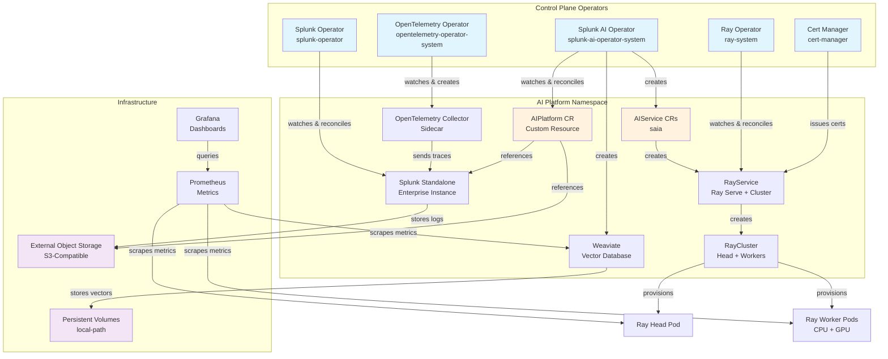

# k0s Cluster Setup for Splunk AI Platform

Complete guide for deploying Splunk AI Platform on k0s Kubernetes clusters.

## Table of Contents

- [Overview](#overview)
- [Features](#features)
- [Prerequisites](#prerequisites)
- [Quick Start](#quick-start)
- [Configuration](#configuration)
- [Usage](#usage)
- [Architecture](#architecture)
- [Image Pull Secrets](#image-pull-secrets)
- [Advanced Topics](#advanced-topics)
  - [k0s Config Persistence](#k0s-config-persistence)
  - [Kine Compaction](#kine-compaction)
  - [Insecure Registry Support (containerd v2)](#insecure-registry-support-containerd-v2)
- [Air-Gapped Deployment](#air-gapped-deployment)
- [Splunk AI Assistant App](#splunk-ai-assistant-app)
  - [Onboarding to the AI Tier](#onboarding-to-the-ai-tier)
- [Troubleshooting](#troubleshooting)
- [Security](#security)
- [Internet Dependencies](#internet-dependencies)
- [Migration Guide](#migration-guide)

---

## Overview

The `k0s_cluster_with_stack.sh` script deploys the complete Splunk AI Platform on k0s Kubernetes, supporting:

- **Bare metal / on-premises deployments** with existing hardware and SSH access
- **External S3-compatible object storage** (SeaweedFS, MinIO, or any S3-compatible endpoint) — customer-managed
- **Air-gapped environments** with private registries
- **Session logging** — all output captured to timestamped log files
- **Safety gates** — refuses to wipe a live cluster with Ready nodes

> **Important:** This script requires pre-provisioned nodes with `existingIPs` in the config YAML. It does **not** auto-create cloud instances. Object storage must be external and customer-managed (no in-cluster MinIO is deployed).

### What is k0s?

[k0s](https://k0sproject.io/) is a CNCF-certified, lightweight Kubernetes distribution designed for:
- Simple installation (single binary, no OS dependencies)
- Production-ready clusters with minimal overhead
- Edge, IoT, and on-premises deployments
- Air-gapped and security-sensitive environments

---

## Features

### Complete AI Platform Stack

The script installs everything needed for the AI Platform:

1. **k0s Kubernetes Cluster** — CNCF certified, single-binary Kubernetes
2. **Calico CNI** — High-performance networking with VXLAN
3. **local-path Storage Provisioner** — Default StorageClass for PVCs
4. **Cert-Manager v1.13.0** — Automated certificate management
5. **Kube-Prometheus Stack** — Monitoring with Prometheus + Grafana
6. **OpenTelemetry Operator** — Distributed tracing and telemetry
7. **NVIDIA Host Drivers + Device Plugin** — GPU support (RHEL 9)
8. **KubeRay Operator v1.2.2** — Ray cluster management for distributed AI
9. **Splunk Operator** — Splunk Enterprise management
10. **Splunk AI Platform Operator** — AI platform orchestration (SAIA feature)
11. **AIPlatform CR** — Complete AI deployment with features, scheduling, and secrets

### Operational Features

- **Two-phase parallel installation** — Independent components install concurrently for faster deployments
- **Helm retry with exponential backoff** — Automatic retries on transient errors (timeouts, TLS handshake failures)
- **Preflight validation** — Checks tools, config, SSH connectivity, and disk space before starting
- **Safety gate** — Refuses to wipe a cluster that has Ready nodes (prevents accidental data loss)
- **Session logging** — All stdout/stderr captured to `tools/cluster_setup/logs/k0s-install-YYYY-MM-DD_HH-MM-SS.log`
- **Existing cluster detection** — `useExisting` flag (auto/force/never) to skip k0s install and deploy stack only

### Image Pull Secrets Support

Automatically creates and configures secrets for private container registries:
- **AWS ECR** — Elastic Container Registry (auto-token refresh)
- **Docker Hub** — Docker Hub private repositories
- **GCR** — Google Container Registry
- **ACR** — Azure Container Registry
- **Custom** — Any Docker registry

Secrets are automatically propagated through the platform:
```
AIPlatform CR → AIService → Job/RayCluster → Pods
```

---

## Prerequisites

### Required Tools (on Admin Workstation)

```bash
# Install required tools on macOS
brew install kubectl helm git jq yq crane

# Install required tools on Ubuntu/Debian
# git and jq are in the default apt repos; kubectl and helm are not — add their
# upstream repos/install scripts, and yq/crane need sudo to write to /usr/local/bin
sudo apt-get update
sudo apt-get install -y apt-transport-https ca-certificates curl gnupg git jq

# pinned to match the k0s version this repo installs by default (v1.36.1+k0s.0) — keep in sync with that version
curl -fsSL https://pkgs.k8s.io/core:/stable:/v1.36/deb/Release.key | sudo gpg --dearmor -o /etc/apt/keyrings/kubernetes-apt-keyring.gpg
echo 'deb [signed-by=/etc/apt/keyrings/kubernetes-apt-keyring.gpg] https://pkgs.k8s.io/core:/stable:/v1.36/deb/ /' | sudo tee /etc/apt/sources.list.d/kubernetes.list
sudo apt-get update
sudo apt-get install -y kubectl

curl -fsSL https://raw.githubusercontent.com/helm/helm/main/scripts/get-helm-3 | bash

# pinned to match the version this repo already relies on (k0s_cluster_with_stack.sh, airgap_install.sh)
sudo wget https://github.com/mikefarah/yq/releases/download/v4.44.1/yq_linux_amd64 -O /usr/local/bin/yq
sudo chmod +x /usr/local/bin/yq

# crane — used by the image-mirroring commands below (see Step 2 — Mirror
# Container Images); no Docker daemon/root/group setup required
curl -fsSL https://github.com/google/go-containerregistry/releases/download/v0.21.9/go-containerregistry_Linux_x86_64.tar.gz -o /tmp/crane.tar.gz
tar -xzf /tmp/crane.tar.gz -C /tmp crane
sudo install -o root -g root -m 0755 /tmp/crane /usr/local/bin/crane
rm -f /tmp/crane.tar.gz /tmp/crane

# Verify installations
kubectl version --client
helm version
git --version
jq --version
yq --version
crane version
```

**RHEL 9** — none of `kubectl`, `helm`, `docker`, `yq`, or `crane` are in the
default `dnf` repos; `git` and `jq` are. Install each via its own supported
method (standalone binary, install script, or vendor repo, per each tool's
docs) rather than a single `dnf install`:

```bash
sudo dnf install -y git jq

# kubectl — official binary download (https://kubernetes.io/docs/tasks/tools/install-kubectl-linux/)
# pinned to match the k0s version this repo installs by default (v1.36.1+k0s.0,
# see DEPLOYMENT_GUIDE.md's Hardware Requirements) — keep in sync with that version
curl -fsSLO "https://dl.k8s.io/release/v1.36.1/bin/linux/amd64/kubectl"
sudo install -o root -g root -m 0755 kubectl /usr/local/bin/kubectl
rm -f kubectl

# helm — install script (https://helm.sh/docs/intro/install/)
curl -fsSL https://raw.githubusercontent.com/helm/helm/main/scripts/get-helm-3 | bash

# yq — binary release, pinned to match the version this repo already relies on
# (k0s_cluster_with_stack.sh, airgap_install.sh) — https://github.com/mikefarah/yq#install
sudo curl -fsSL https://github.com/mikefarah/yq/releases/download/v4.44.1/yq_linux_amd64 -o /usr/local/bin/yq
sudo chmod +x /usr/local/bin/yq

# crane — used by the image-mirroring commands below (see Step 2 — Mirror
# Container Images); no Docker daemon/root/group setup required
curl -fsSL https://github.com/google/go-containerregistry/releases/download/v0.21.9/go-containerregistry_Linux_x86_64.tar.gz -o /tmp/crane.tar.gz
tar -xzf /tmp/crane.tar.gz -C /tmp crane
sudo install -o root -g root -m 0755 /tmp/crane /usr/local/bin/crane
rm -f /tmp/crane.tar.gz /tmp/crane

# docker (optional, only needed if you prefer `docker pull`/`tag`/`push` over
# `crane copy` for the image-mirroring commands below) — Docker CE repo for
# RHEL (https://docs.docker.com/engine/install/rhel/)
sudo dnf install -y dnf-plugins-core
sudo dnf config-manager --add-repo https://download.docker.com/linux/rhel/docker-ce.repo
sudo dnf install -y docker-ce docker-ce-cli containerd.io docker-buildx-plugin docker-compose-plugin
sudo systemctl enable --now docker
sudo usermod -aG docker "$USER"   # log out/in (or `newgrp docker`) for group change to take effect

# Verify installations
kubectl version --client && helm version && git --version && jq --version && yq --version && crane version
```

The image-mirroring commands used later (see [Step 2 — Mirror Container Images](#step-2--mirror-container-images))
default to `crane copy`, which works on both Ubuntu and RHEL 9 with no
Docker daemon, root, or group setup. `docker pull`/`tag`/`push` is documented
there too as an equivalent alternative if you already run Docker.

### Hardware Requirements

| Node Type | Min CPU | Min RAM | Min Disk | Notes |
|-----------|---------|---------|----------|-------|
| Controller | 4+ | 8 GB | 100 GB | Runs API server, etcd, scheduler |
| CPU Worker | 8+ | 32 GB | 200 GB | Runs Weaviate, Ray head, Splunk, SAIA API/v2, Data Loader |
| GPU Worker | 48 vCPUs | 384 GiB | 500 GB | 4 × NVIDIA L40S per node (48 GB GDDR6 each) · **2 nodes required = 8 × L40S total (384 GB total GPU memory)** · 100 Gbps · equivalent to g6e.12xlarge |

**Ports between nodes:** 22 (SSH), 6443 (API), 2380 (etcd), 10250 (kubelet), 8132 (konnectivity), 4789/UDP (VXLAN), 179 (Calico BGP). Best practice: allow all ports between nodes.

### Software Requirements (on All Nodes)

- RHEL 9
- Passwordless SSH access from admin workstation
- Sudo privileges without password
- Python 3.8+ installed

### Network Requirements

Open the following ports between nodes:

| Port | Protocol | Purpose |
|------|----------|---------|
| 22 | TCP | SSH management |
| 6443 | TCP | Kubernetes API server |
| 2380 | TCP | etcd peer communication |
| 10250 | TCP | Kubelet API |
| 8132 | TCP | Konnectivity agent |
| 179 | TCP | Calico BGP |
| 4789 | UDP | Calico VXLAN |
| 30000-32767 | TCP | NodePort services (optional) |

### External Object Storage

You must provide an external S3-compatible object storage endpoint:
- **SeaweedFS**, **MinIO**, or any S3-compatible service
- Must be reachable from all cluster nodes
- The script does **not** deploy object storage in-cluster

---

## Quick Start

### 1. Clone the Repository

```bash
# Replace <branch-name> with the branch you were given
git clone -b <branch-name> --single-branch https://github.com/splunk/splunk-ai-operator.git
cd splunk-ai-operator/tools/cluster_setup
```

**No git / downloading a ZIP from the browser instead:** GitHub's branch
dropdown (top-left of the repo page, next to the branch icon) defaults to
`main` — switch it to `<branch-name>` *before* clicking **Code → Download
ZIP**, or use `https://github.com/splunk/splunk-ai-operator/archive/refs/heads/<branch-name>.zip`
directly. The extracted folder is named `splunk-ai-operator-<branch-name>`,
not `splunk-ai-operator` — adjust the `cd` above accordingly.

### 2. Create Configuration File

```bash
# Copy the template
cp k0s-cluster-config.yaml my-cluster.yaml

# Edit with your settings
vi my-cluster.yaml
```

### 3. Deploy the Cluster

```bash
CONFIG_FILE=./my-cluster.yaml ./k0s_cluster_with_stack.sh install
```

### 4. Verify Installation

```bash
# Set kubeconfig (saved automatically during install)
export KUBECONFIG=~/.kube/k0s-my-cluster

# Check nodes
kubectl get nodes

# Check AI Platform
kubectl get aiplatform -n ai-platform

# Check all components
kubectl get pods --all-namespaces
```

---

## Configuration

### Configuration File Structure

The `k0s-cluster-config.yaml` file controls all aspects of the deployment:

```yaml
cluster:           # Cluster name, useExisting, SSH user/key, optional API external address
nodes:             # Controller/worker counts and existingIPs
storage:           # storageClass, vectorDbSize, objectStore, minimumDiskSpace
images:            # registry prefix, operator, splunk, ray, weaviate, saia, nginx, fluentBit, otelCollector
operators:         # ray (version/modelVersion/rayVersion), certManager, nvidia devicePluginVersion
kubernetes:        # namespace
files:             # splunkOperator, aiPlatform manifest paths
splunk:            # standaloneName
aiPlatform:        # defaultAcceleratorType, workerGroupConfig, features, scheduling, serviceTemplate
imagePullSecrets:  # secrets list, autoCreateECR, dockerHub, gcr, acr, custom
ecr:               # account, region
```

### Configuration Example

```yaml
cluster:
  name: prod-ai-platform
  useExisting: auto               # auto | force | never
  sshUser: ubuntu
  sshKeyPath: ~/.ssh/prod-key.pem
  # Set when workers cannot reach the controller's auto-detected private IP.
  apiExternalAddress: api.prod.example.com

nodes:
  controllers: 1
  cpuWorkers: 2                   # First 2 workers treated as CPU
  gpuWorkers: 2                   # Remaining 2 workers treated as GPU
  existingIPs:
    controllers:
      - 10.0.1.10
    workers:
      - 10.0.1.20                 # CPU (worker index 0)
      - 10.0.1.21                 # CPU (worker index 1)
      - 10.0.1.22                 # GPU (worker index 2)
      - 10.0.1.23                 # GPU (worker index 3)

storage:
  storageClass: "local-path"
  vectorDbSize: "200Gi"
  minimumDiskSpace:               # Preflight disk checks (GB)
    controller: 100
    cpuWorker: 200
    gpuWorker: 500
  objectStore:
    type: "seaweedfs"             # aws | minio | seaweedfs
    bucket: "ai-platform-data"
    endpoint: "http://10.0.1.50:8333"   # REQUIRED for minio/seaweedfs
    auth:
      rootUser: "admin"
      rootPassword: "Change-This-Strong-Password!"
  modelStaging:
    enabled: true                 # Download from HF + upload to object store before install

images:
  registry: "registry.corp.com"
  operator:
    image: "registry.corp.com/splunk/splunk-ai-operator:v0.1.5"
  splunk:
    image: "registry.corp.com/splunk/splunk:latest"
    operatorImage: "docker.io/splunk/splunk-operator:3.0.0"
  ray:
    headImage: "registry.corp.com/splunk/ai-tier-ray-head:v0.2"
    workerImage: "registry.corp.com/splunk/ai-tier-ray-worker:v0.2"
  weaviate:
    image: "docker.io/semitechnologies/weaviate:stable-v1.28"
  saia:
    apiImage: "registry.corp.com/saia/saia-api:build-v1alpha1"
    apiV2Image: "registry.corp.com/saia/saia-api-v2:build-v1alpha1"
    dataLoaderImage: "registry.corp.com/saia/saia-data-loader:build-v1alpha1"
  nginx:
    image: "docker.io/library/nginx:1.27-alpine"
  fluentBit:
    image: "docker.io/fluent/fluent-bit:1.9.6"
  otelCollector:
    image: "docker.io/otel/opentelemetry-collector-contrib:0.122.1"

operators:
  ray:
    version: "v1.2.2"
    modelVersion: "v0.3.14-36-g1549f5a"
    rayVersion: "2.56.0"
  certManager:
    installCRDs: true
  nvidia:
    devicePluginVersion: "v0.17.3"

kubernetes:
  namespace: ai-platform

splunk:
  standaloneName: splunk-prod

aiPlatform:
  name: "prod-ai-stack"
  defaultAcceleratorType: "L40S"        # L40S or H100
  workerGroupConfig:
    imageRegistry: ""                   # Override registry for Ray worker images
  features:
    - name: "saia"
      version: "1.1.0"
      serviceAccountName: ""
  cpuScheduling:
    nodeSelector:
      splunk.ai/workload-type: cpu
    tolerations: []
  gpuScheduling:
    nodeSelector:
      splunk.ai/workload-type: gpu
    tolerations:
      - key: "nvidia.com/gpu"
        operator: "Equal"
        value: "true"
        effect: "NoSchedule"
  serviceTemplate:                      # Optional: expose SAIA externally
    type: "NodePort"                    # NodePort | LoadBalancer
    nodePort: 30080                     # Port for NodePort type

imagePullSecrets:
  secrets: []
  autoCreateECR: true
  dockerHub:
    enabled: false
    username: ""
    password: ""
    email: ""
  gcr:
    enabled: false
    jsonKey: ""
  acr:
    enabled: false
    registry: ""
    username: ""
    password: ""
  custom:
    enabled: false
    name: "custom-registry-secret"
    server: ""
    username: ""
    password: ""
    email: ""

ecr:
  account: "123456789012"
  region: us-east-2
```

### Configuration Reference

#### Cluster Section

| Field | Required | Default | Description |
|-------|----------|---------|-------------|
| `cluster.name` | Yes | — | Cluster identifier (used for kubeconfig, labels) |
| `cluster.useExisting` | No | `never` | `auto` = detect existing cluster, `force` = fail if not found, `never` = always create new |
| `cluster.sshUser` | Yes | `ubuntu` | SSH username for all nodes |
| `cluster.sshKeyPath` | Yes | — | Path to SSH private key |
| `cluster.apiExternalAddress` | No | Auto-detected private bind address | API IP or hostname reachable by every worker; set for public-only or routed worker topologies |

#### Nodes Section

| Field | Required | Default | Description |
|-------|----------|---------|-------------|
| `nodes.controllers` | No | `1` | Number of controller nodes. Only `1` is actually supported — `install_k0s_cluster` joins a controller on `nodes.existingIPs.controllers[0]` only and never issues a controller-join token to additional entries, so listing more IPs does not produce HA |
| `nodes.cpuWorkers` | No | `2` | First N workers in the list are labeled as CPU |
| `nodes.gpuWorkers` | No | `1` | Remaining workers after cpuWorkers are labeled as GPU |
| `nodes.existingIPs.controllers` | **Yes** | — | List of controller node IPs |
| `nodes.existingIPs.workers` | **Yes** | — | List of worker node IPs |

#### Storage Section

| Field | Required | Default | Description |
|-------|----------|---------|-------------|
| `storage.storageClass` | No | `local-path` | Kubernetes StorageClass for PVCs |
| `storage.vectorDbSize` | No | `50Gi` | Weaviate PersistentVolume size |
| `storage.minimumDiskSpace.controller` | No | `100` | Minimum disk (GB) for controller preflight check |
| `storage.minimumDiskSpace.cpuWorker` | No | `200` | Minimum disk (GB) for CPU worker preflight check |
| `storage.minimumDiskSpace.gpuWorker` | No | `500` | Minimum disk (GB) for GPU worker preflight check |
| `storage.objectStore.type` | No | `minio` | `aws`, `s3compat`, `minio`, or `seaweedfs` |
| `storage.objectStore.bucket` | No | `ai-platform-data` | S3 bucket name. **Must be lowercase** — the installer normalizes to lowercase automatically; uppercase letters in the config value are silently converted before any store operations. |
| `storage.objectStore.endpoint` | **Yes*** | — | S3-compatible endpoint URL (*required for s3compat/minio/seaweedfs) |
| `storage.objectStore.auth.rootUser` | Yes | — | Access key / root user |
| `storage.objectStore.auth.rootPassword` | Yes | — | Secret key / root password |
| `storage.modelStaging.enabled` | No | `true` | Download models from Hugging Face and upload to the object store before cluster install. Set `false` to skip (e.g. models already staged). |

#### S3 Bucket Directory Layout

The S3 bucket serves as the shared storage layer for both pre-staged artifacts and runtime data.

**Pre-staged (must exist before install when `modelStaging.enabled: true` is not set):**

| Directory | Owner | Description |
|---|---|---|
| `model_artifacts/<id>/` | Admin (pre-staged) | Pre-trained model weights loaded by Ray workers at startup |
| `staging_state/<id>/.staging_complete` | Installer | Completion marker written by the download script. The pre-check validates its `hf_url` against the selected artifact profile, so stale or mismatched weights are staged again. |

**Created at runtime by SAIA services:**

| Directory | Owner | Description |
|---|---|---|
| `conversations/` | SAIA v2 API | Conversation history per tenant |
| `config/` | SAIA v2 API / Worker | Tenant data configuration (`config/tenant_data_config/{tenant}.yaml`) |
| `storage_queue/` | SAIA v2 Worker | S3-backed task queue for async ingestion (`urgent/`, `batch/`, `locks/`) |
| `ingestion/tenant_data/` | SAIA v2 Worker | Temporary ingestion payload storage during processing |
| `field_counts/` | SAIA v2 Worker | Cached field count statistics per tenant/index/sourcetype |
| `admin/preferences/` | SAIA v2 API | Admin-curated markdown preferences per tenant |
| `job_groups/` | SAIA v1 API | Background job group state for data upload tasks |

**Created at runtime by other platform components:**

| Directory | Owner | Description |
|---|---|---|
| `artifacts/` | AI Operator | Deployment artifacts |
| `tasks/` | AI Operator / Ray | Task execution state |

> **Note:** Do not manually delete runtime directories (`conversations/`, `config/`, `storage_queue/`) as they contain active state. Deleting `storage_queue/locks/` may be necessary to clear stale distributed locks after a non-graceful pod restart.

#### Images Section

Short image paths (without a FQDN) are automatically prefixed with
`images.registry`. Fully qualified defaults such as `docker.io/...` are left
unchanged. For a private registry or air-gapped installation, mirror the images
and replace the corresponding fields with the mirrored paths; setting only
`images.registry` does not rewrite a fully qualified Docker Hub reference.

> Some application defaults use the mutable `preview` tag and workloads use `imagePullPolicy:
> IfNotPresent`. Re-running the installer with the same tag may reuse a cached
> image; use a new immutable tag or digest when performing a controlled upgrade.

| Field | Required | Default | Description |
|-------|----------|---------|-------------|
| `images.registry` | No | `""` | Registry hostname (and optional port) used to prefix short image paths, e.g. `registry.internal:5000` or `123456789.dkr.ecr.us-east-2.amazonaws.com` |
| `images.registryInsecure` | No | `false` | Set to `true` only for plain-HTTP (no-TLS) registries such as a local mirror. Leave `false` for ECR, Docker Hub, Harbor, or any HTTPS registry. When `true`, the installer configures containerd on every node to allow HTTP pulls from `images.registry` — see [Insecure Registry Support](#insecure-registry-support-containerd-v2). |
| `images.operator.image` | **Yes** | `docker.io/kpratyush775/splunk-ai-operator:v2.6` | Splunk AI Operator image |
| `images.splunk.image` | **Yes** | — | Splunk Enterprise image |
| `images.splunk.operatorImage` | No | `docker.io/splunk/splunk-operator:3.0.0` | Splunk Operator image |
| `images.ray.headImage` | **Yes** | `docker.io/splunk/ai-tier-ray-head:v0.2` | Ray head node image |
| `images.ray.workerImage` | **Yes** | `docker.io/splunk/ai-tier-ray-worker:v0.2` | Ray GPU worker image |
| `images.weaviate.image` | **Yes** | — | Weaviate vector DB image |
| `images.saia.apiImage` | **Yes** | `docker.io/splunk/ai-tier-saia-api:preview` | SAIA API v1 image |
| `images.saia.apiV2Image` | **Yes** | `docker.io/splunk/ai-tier-saia-api-v2:preview` | SAIA API v2 image |
| `images.saia.dataLoaderImage` | **Yes** | `docker.io/splunk/ai-tier-saia-data-loader:preview` | SAIA data loader / post-install hook image |
| `images.nginx.image` | No | `docker.io/library/nginx:1.27-alpine` | Nginx reverse proxy for SAIA v1/v2 routing |
| `images.fluentBit.image` | No | `fluent/fluent-bit:1.9.6` | Fluent Bit log forwarder |
| `images.otelCollector.image` | No | `otel/opentelemetry-collector-contrib:0.122.1` | OpenTelemetry Collector |

**Secure vs insecure registry — which to use:**

| Registry type | `images.registry` | `images.registryInsecure` | Notes |
|---|---|---|---|
| AWS ECR | `<account>.dkr.ecr.<region>.amazonaws.com` | `false` (default) | HTTPS; use `imagePullSecrets.autoCreateECR: true` for token refresh |
| Harbor / internal HTTPS | `registry.internal:443` | `false` (default) | HTTPS with valid TLS cert — no extra config needed |
| Plain-HTTP internal mirror | `10.0.0.5:5000` or `registry.internal:5000` | **`true`** | Installer writes containerd config for HTTP pulls on every node; see [Insecure Registry Support](#insecure-registry-support-containerd-v2) |
| Docker Hub | `docker.io` | `false` (default) | Public HTTPS — no `images.registry` needed unless mirroring |

> **Do not set `registryInsecure: true` for HTTPS registries.** It has no effect on TLS registries and may cause unexpected behaviour.

**Image patching chain:** The script reads these config values, resolves them via `build_image_url()` (prepends registry if needed), then uses `sed` to patch the corresponding `RELATED_IMAGE_*` env vars in manifest files:

| Config field | Env var patched | Target file |
|---|---|---|
| `images.operator.image` | Container `image:` field | `artifacts.yaml` |
| `images.splunk.image` | `RELATED_IMAGE_SPLUNK_ENTERPRISE` | `splunk-operator-cluster.yaml` |
| `images.splunk.operatorImage` | Container `image:` field | `splunk-operator-cluster.yaml` |
| `images.ray.headImage` | `RELATED_IMAGE_RAY_HEAD` | `artifacts.yaml` |
| `images.ray.workerImage` | `RELATED_IMAGE_RAY_WORKER` | `artifacts.yaml` |
| `images.weaviate.image` | `RELATED_IMAGE_WEAVIATE` | `artifacts.yaml` |
| `images.saia.apiImage` | `RELATED_IMAGE_SAIA_API` | `artifacts.yaml` |
| `images.saia.apiV2Image` | `RELATED_IMAGE_SAIA_API_V2` | `artifacts.yaml` |
| `images.saia.dataLoaderImage` | `RELATED_IMAGE_POST_INSTALL_HOOK` | `artifacts.yaml` |
| `images.nginx.image` | `RELATED_IMAGE_NGINX` | `artifacts.yaml` |
| `images.fluentBit.image` | `RELATED_IMAGE_FLUENT_BIT` | `artifacts.yaml` |
| `images.otelCollector.image` | `RELATED_IMAGE_OTEL_COLLECTOR` | `artifacts.yaml` |
| `operators.ray.modelVersion` | `MODEL_VERSION` | `artifacts.yaml` |
| `operators.ray.rayVersion` | `RAY_VERSION` | `artifacts.yaml` |

#### AI Platform Section

| Field | Required | Default | Description |
|-------|----------|---------|-------------|
| `aiPlatform.name` | No | `${CLUSTER_NAME}-ai-platform` | Base name for the AIPlatform CR |
| `aiPlatform.defaultAcceleratorType` | **Yes** | `""` | GPU accelerator type — `L40S`, `H100`, or `RTX_PRO_6000_BLACKWELL` |
| `aiPlatform.scaleFactor` | No | `1` | AI workload capacity multiplier; use a whole number of 1 or higher |
| `aiPlatform.workerGroupConfig.imageRegistry` | No | `""` | Override registry for Ray worker images |
| `aiPlatform.features` | Yes | — | Array of features to deploy (read dynamically from config) |
| `aiPlatform.features[].name` | Yes | — | Feature name (e.g., `saia`) |
| `aiPlatform.features[].version` | Yes | — | Feature version |
| `aiPlatform.features[].serviceAccountName` | No | `""` | Service account override |
| `aiPlatform.cpuScheduling.nodeSelector` | No | auto-generated | Node selector for CPU workloads |
| `aiPlatform.cpuScheduling.tolerations` | No | `[]` | Tolerations for CPU workloads |
| `aiPlatform.gpuScheduling.nodeSelector` | No | auto-generated | Node selector for GPU workloads |
| `aiPlatform.gpuScheduling.tolerations` | No | GPU toleration | Tolerations for GPU workloads |
| `aiPlatform.serviceTemplate.type` | No | — | Service type for SAIA exposure: `NodePort` or `LoadBalancer` |
| `aiPlatform.serviceTemplate.nodePort` | No | — | Node port number (only when type=NodePort) |

#### Scaling Deployment Capacity

Set `scaleFactor` under `aiPlatform` to change AI workload capacity:

```yaml
aiPlatform:
  scaleFactor: 2
```

Use a whole number of `1` or higher. The default is `1`; for example, `2`
doubles the standard capacity. Increasing this value does not add GPU nodes, so
ask your cluster administrator to add the required GPU capacity first.

Save the configuration and run the installer in interactive mode:

```bash
CONFIG_FILE=./k0s-cluster-config.yaml ./k0s_cluster_with_stack.sh install
```

> **Downscaling notice:** Reducing `scaleFactor` causes temporary service
> downtime while workloads are resized. Plan downscaling during a maintenance
> window.

#### Image Pull Secrets Section

The `secrets` list is **not consumed** by the script. Instead, the script auto-detects which secrets exist in the namespace by checking for hardcoded names: `ecr-registry-secret`, `docker-hub-secret`, `gcr-secret`, `acr-secret`, `custom-registry-secret`.

```yaml
imagePullSecrets:
  secrets: []                         # NOT consumed; script auto-detects in namespace
  autoCreateECR: true                 # Consumed → creates ECR secret from AWS creds

  dockerHub:
    enabled: false
    username: ""
    password: ""
    email: ""

  gcr:
    enabled: false
    jsonKey: ""

  acr:
    enabled: false
    registry: ""
    username: ""
    password: ""

  custom:
    enabled: false
    name: "custom-registry-secret"
    server: ""
    username: ""
    password: ""
    email: ""
```

---

## Usage

### Commands

```bash
# Install cluster and full AI Platform stack
CONFIG_FILE=./my-config.yaml ./k0s_cluster_with_stack.sh install

# Stage model artifacts only (download from HF + upload to object store)
CONFIG_FILE=./my-config.yaml ./k0s_cluster_with_stack.sh stage-artifacts

# Re-stage without re-downloading models already present locally
SKIP_IF_EXISTS=1 CONFIG_FILE=./my-config.yaml ./k0s_cluster_with_stack.sh stage-artifacts

# Delete entire cluster (stop k0s, remove services)
CONFIG_FILE=./my-config.yaml ./k0s_cluster_with_stack.sh delete

# Clean all k0s state from bare-metal nodes (stop/reset/remove)
CONFIG_FILE=./my-config.yaml ./k0s_cluster_with_stack.sh clean-all

# Join additional workers to an existing cluster (or rejoin failed workers)
CONFIG_FILE=./my-config.yaml ./k0s_cluster_with_stack.sh join-workers
```

> **Air-gap uses these same commands.** With `cluster.airgap: true` in the config, `install` and `join-workers` stage the offline artifacts first and then continue; every other subcommand runs immediately, unchanged. See [Air-Gapped Deployment](#air-gapped-deployment).

### Environment Variables

#### General

| Variable | Default | Description |
|----------|---------|-------------|
| `CONFIG_FILE` | `./k0s-cluster-config.yaml` | Path to configuration file |
| `AUTO_APPROVE` | `false` | Skip confirmation prompts |
| `USE_EXISTING` | (from config) | Override `cluster.useExisting` (`auto`/`force`/`never`) |
| `LOG_DIR` | `./logs` | Directory for session log files |
| `SKIP_IF_EXISTS` | `0` | Set to `1` to skip models that have a local `.staging_complete` marker (replaced the old directory-existence check) |
| `SKIP_IF_STAGED` | `0` | Set to `1` to also check the object store; skips models whose `staging_state/<id>/.staging_complete` marker already exists there |
| `HF_DOWNLOAD_RETRIES` | `2` | Number of download retries per model before giving up (15s backoff; partial folder deleted between attempts) |

#### Air-Gap Mode

Use `cluster.airgap: true` in your config YAML to tell the installer the cluster has no outbound internet:

```yaml
cluster:
  name: my-cluster
  airgap: true   # disconnected environment — skips HuggingFace + NVIDIA repo checks
  sshKeyPath: ~/.ssh/id_rsa
  sshUser: ec2-user
```

**What `airgap: true` does:**
- Skips the HuggingFace connectivity check before model staging (models must be pre-staged in object store)
- Skips the NVIDIA package repo connectivity check on GPU workers (drivers must be pre-installed)
- Object store connectivity is still checked — it lives on your local network and must be reachable
- The install plan banner shows `Air-gap mode: true` so customers can confirm it was picked up

**Precedence:** `AIRGAP_MODE=true` env var overrides the YAML value — useful for a one-off run without editing the file. Either one also makes `install` and `join-workers` stage the artifacts before touching the nodes; see [Air-Gapped Deployment](#air-gapped-deployment).

| Setting | How to set | When to use |
|---|---|---|
| `cluster.airgap: true` in YAML | Edit `k0s-cluster-config.yaml` | Permanent air-gap environment — commit it with your config |
| `AIRGAP_MODE=true` env var | `AIRGAP_MODE=true ./k0s_cluster_with_stack.sh install` | One-off run without editing YAML, or CI override |
| Neither (default) | Do nothing | Internet-connected environment |

#### Air-Gap URL Overrides

Every internet URL in the installer can be redirected to a local file or
internal mirror by setting the corresponding variable. Unset variables fall
back to the default public URL. These are set automatically by the air-gap
staging step; set them manually only for partial overrides. `<staged>` is
the staging directory, `./airgap-bundle/airgap-bundle-<timestamp>` by default.

| Variable | Replaces | Example value |
|----------|----------|---------------|
| `K0S_INSTALL_URL` | `https://get.k0s.sh` | `file://<staged>/binaries/k0s` |
| `YQ_DOWNLOAD_URL` | GitHub yq release URL | `file://<staged>/binaries/yq` |
| `CERT_MANAGER_MANIFEST_URL` | GitHub cert-manager release URL | `file://<staged>/manifests/cert-manager.yaml` |
| `LOCAL_PATH_MANIFEST_URL` | GitHub local-path-provisioner URL | `file://<staged>/manifests/local-path-storage.yaml` |
| `NVIDIA_DEVICE_PLUGIN_MANIFEST_URL` | GitHub NVIDIA device plugin URL | `file://<staged>/manifests/nvidia-device-plugin.yml` |
| `PROMETHEUS_CHART_PATH` | `prometheus-community/kube-prometheus-stack` | `<staged>/charts/kube-prometheus-stack-72.3.0.tgz` |
| `OTEL_CHART_PATH` | `open-telemetry/opentelemetry-operator` | `<staged>/charts/opentelemetry-operator-0.80.0.tgz` |
| `KUBERAY_CHART_PATH` | `kuberay/kuberay-operator` | `<staged>/charts/kuberay-operator-1.2.2.tgz` |
| `METALLB_CHART_PATH` | `metallb/metallb` | `<staged>/charts/metallb-0.14.8.tgz` |

See [Air-Gapped Deployment](#air-gapped-deployment) for the full air-gap workflow.

### Session Logging

All script output (stdout and stderr) is automatically captured to a timestamped log file:

```
tools/cluster_setup/logs/k0s-install-2026-04-29_14-30-00.log
```

Override the log directory:
```bash
LOG_DIR=/var/log/k0s CONFIG_FILE=./my-config.yaml ./k0s_cluster_with_stack.sh install
```

### Install Flow

The `install` command executes these steps in order:

0. **Air-gap check** *(air-gap only)* — if `cluster.airgap: true` (or `AIRGAP_MODE=true`), the run first hands off to `airgap_install.sh` to stage ~2.2 GB of offline artifacts, which then calls this script back to continue from step 1. With `airgap: false` this step is a no-op. See [Air-Gapped Deployment](#air-gapped-deployment).
1. **Load config** — Parse YAML, validate existingIPs
2. **Validate images** — Ensure all required image fields are set
3. **Configure images** — Patch `RELATED_IMAGE_*` env vars in manifest files
4. **Preflight checks** — Validate tools, SSH connectivity, disk space, config
5. **Model staging** *(when `storage.modelStaging.enabled: true`, the default)* — Download models from Hugging Face for the configured GPU type (`aiPlatform.defaultAcceleratorType`) and upload them to the object store. The staging pipeline is **resumable**: each model gets a per-model completion marker; re-runs skip already-staged models and cleanly retry only incomplete ones. The installer passes `SKIP_IF_STAGED=1` by default so previously staged models are never re-downloaded or re-uploaded. Skipped entirely when `enabled: false`.

   **Models staged (from the accelerator-selected artifact profile):**

   | Model artifact ID | Purpose |
   |---|---|
   | `gemma-4-31b-it` | Unquantized Gemma model for L40S |
   | `gemma-4-31b-it-qat-w4a16-ct` | Quantized Gemma model for H100 and RTX Pro |
   | `gpt-oss-20b` | Secondary LLM |
   | `all-minilm-l6-v2` | Sentence transformer / semantic search |
   | `bi-encoder` | BGE small encoder |
   | `cross-encoder` | MS MARCO cross-encoder |
   | `e5-language-classifier` | Multilingual language detection |
   | `fm_timeseries` | Cisco Time Series Model (CTSM) forecaster |
   | `mbart-translator` | Multilingual translation |
   | `pii-classifier` | PII detection |
   | `uae-large` | Embedding model |
   | `xlm-roberta-language-classifier` | Language classifier |

   **System requirements for the staging machine** (the machine running the installer or staging scripts):

   | Resource | Minimum | Notes |
   |---|---|---|
   | Disk (free) | 250 GB | >120 GB for 11 model artifacts + buffer for download staging and upload temp files |
   | RAM | 16 GB | Needed to stream large files without swapping |
   | Internet | Stable broadband | Downloads >120 GB from HuggingFace; re-run with `SKIP_IF_EXISTS=1` to resume interrupted downloads |
   | CPU | 4 cores | Recommended for parallel upload scripts |

   This can be the same machine used to run the installer script.

   **Manual staging** (running scripts directly without cluster install):

   ```bash
   # Stage models — GPU type read from aiPlatform.defaultAcceleratorType in config
   CONFIG_FILE=./my-cluster.yaml ./k0s_cluster_with_stack.sh stage-artifacts

   # Resume: skip models already staged in the object store (default behaviour of the installer)
   SKIP_IF_STAGED=1 CONFIG_FILE=./my-cluster.yaml ./k0s_cluster_with_stack.sh stage-artifacts
   ```

   Before starting any download work, `stage-artifacts` runs `all_models_staged()` — a fast pre-check that reads the selected artifact profile and verifies that each model's `staging_state/<id>/.staging_complete` marker contains the expected `hf_url`. If every marker matches, it exits immediately without downloading or uploading. Otherwise, it lists the artifacts that need staging:

   ```
   [LOG] Model staging needed: 1/11 model(s) not yet staged.
   [LOG]   MISSING: gemma-4-31b-it-qat-w4a16-ct  (bucket/staging_state/gemma-4-31b-it-qat-w4a16-ct/.staging_complete not found or hf_url changed)
   ```

   After upload completes, a post-stage verification pass re-checks all store markers and fails with a clear per-model error list if any are still absent — preventing an install from proceeding with an incomplete model set.

   To run the download script directly, pass the GPU type via `--accelerator`. If neither flag nor `ACCELERATOR` env var is set, the script prompts interactively:

   ```bash
   cd tools/artifacts_download_upload_scripts

   # Explicit GPU type
   ./download_from_huggingface.sh --accelerator l40s   # or h100 / rtx_pro_6000_blackwell

   # Interactive — prompted when no flag or ACCELERATOR env var is set:
   #   Select GPU type:
   #     1) l40s
   #     2) h100
   #   Enter 1 or 2:
   ./download_from_huggingface.sh
   ```

   Helper scripts in `tools/artifacts_download_upload_scripts/` can also be run independently:

   | Storage Type | Script | Key Environment Variables |
   |---|---|---|
   | MinIO / S3-compatible | `upload_to_minio.sh` | `OBJECT_STORE_ENDPOINT`, `OBJECT_STORE_BUCKET`, `OBJECT_STORE_ACCESS_KEY`, `OBJECT_STORE_SECRET_KEY` |
   | SeaweedFS | `upload_to_seaweedfs.sh` | `S3COMPAT_OBJECT_STORE_ENDPOINT`, `S3COMPAT_OBJECT_STORE_BUCKET`, `S3COMPAT_OBJECT_STORE_ACCESS_KEY`, `S3COMPAT_OBJECT_STORE_SECRET_KEY` |
   | AWS S3 | `upload_to_s3.sh` | `S3_BUCKET`, `S3_REGION` (requires AWS CLI credentials) |
   | MinIO via AWS CLI | `upload_to_minio_aws.sh` | `S3COMPAT_OBJECT_STORE_ENDPOINT`, `S3COMPAT_OBJECT_STORE_BUCKET`, `S3COMPAT_OBJECT_STORE_ACCESS_KEY`, `S3COMPAT_OBJECT_STORE_SECRET_KEY` |

   **Additional utilities:**

   | Script | Purpose |
   |---|---|
   | `test_minio_connection.sh` | Diagnose S3-compatible endpoint connectivity |
   | `create_seaweedfs_folders.sh` | Create standard bucket folder structure |
   | `install_seaweedfs_systemd.sh` | Install SeaweedFS as a systemd service |
   | `install_minio_ec2.sh` | Install MinIO on an EC2 instance |

   > See `tools/artifacts_download_upload_scripts/README.md` for full usage details.

6. **Install k0s cluster** — Safety gate check → clean state → install controller → join workers → label nodes
7. **Install AI Platform stack** (two-phase parallel):
   - Phase 1 (parallel): cert-manager, kube-prometheus, NVIDIA host drivers
   - Between phases: Ensure S3 credentials secret
   - Phase 2 (parallel): OTel operator, Ray operator, Splunk operator, NVIDIA device plugin
   - Sequential: Image pull secrets → Splunk standalone → AI operator → AIPlatform CR
8. **Health checks** — Verify all components are running
9. **Access info** — Display kubeconfig path and service endpoints

### join-workers Command

The `join-workers` command is used to:
- Add new worker nodes to an existing cluster
- Rejoin workers that were disconnected or failed

It:
1. Loads config and identifies which workers are not yet joined
2. Generates a fresh worker token from the controller
3. Installs k0s worker on each missing node
4. Waits for nodes to become Ready
5. Labels nodes with `splunk.ai/*` labels based on CPU/GPU role

Like `install`, `join-workers` stages the offline artifacts first when `cluster.airgap: true` — the new node needs the same binaries, image tarballs, and NVIDIA closure as the original nodes.

### useExisting Flag

| Value | Behavior |
|-------|----------|
| `never` | Always creates a new k0s cluster (default). Fails if nodes have a live cluster (safety gate). |
| `auto` | Checks if a running k0s cluster exists on the controller. If yes, skips cluster creation and deploys stack only. If no, creates new cluster. |
| `force` | Assumes an existing cluster. Fails if no running cluster is found on the controller. |

---

## Architecture

### Cluster Architecture

```
┌─────────────────────────────────────────────────────────────┐
│                  k0s Controller Node(s)                     │
│  ┌──────────────┐  ┌──────────────┐  ┌──────────────┐     │
│  │ API Server   │  │    etcd      │  │  Scheduler   │     │
│  │   :6443      │  │   :2380      │  │              │     │
│  └──────┬───────┘  └──────────────┘  └──────────────┘     │
│         │  Konnectivity                                    │
│         │  Server :8132                                    │
└─────────┼──────────────────────────────────────────────────┘
          │
    ┌─────┴────────────────────────┐
    │  Calico VXLAN Network        │
    │  (Pod Network: 10.244.0.0/16)│
    └─────┬────────────────────────┘
          │
  ┌───────┼───────────────────┬────────────────────┐
  │       │                   │                    │
┌─▼───────▼──────┐  ┌─────────▼────────┐  ┌───────▼─────────┐
│ CPU Worker 1   │  │  CPU Worker 2    │  │  GPU Worker     │
│                │  │                  │  │                 │
│ • Ray Head     │  │ • Weaviate       │  │ • Ray GPU Pods  │
│ • Splunk       │  │ • Ray CPU Pods   │  │ • AI Inference  │
│ • Monitoring   │  │ • AI Services    │  │                 │
└────────────────┘  └──────────────────┘  └─────────────────┘
```

### Network Architecture

**Pod Network (Calico VXLAN):**
- CIDR: `10.244.0.0/16`
- Overlay network across all nodes

**Service Network:**
- CIDR: `10.96.0.0/16`
- ClusterIP services
- NodePort range: `30000-32767`

**Host Network:**
- Controller API: `<controller-ip>:6443`
- Konnectivity: `<controller-ip>:8132`
- SSH: `<node-ip>:22`

### Storage Architecture

```
┌──────────────────────────────────────────────────────────┐
│            External S3-Compatible Object Storage          │
│           (Customer-Managed: SeaweedFS / MinIO / S3)     │
│                                                          │
│  Endpoint: http://<your-storage-host>:<port>             │
│                                                          │
│  Buckets:                                                │
│  └─ ai-platform-data/                                   │
│     ├─ artifacts/        (Build artifacts)               │
│     ├─ models/           (ML models)                     │
│     ├─ datasets/         (Training data)                 │
│     └─ tasks/            (Task outputs)                  │
│                                                          │
│  Credentials stored in-cluster as:                       │
│  └─ Secret: s3-secret (namespace: ai-platform)          │
│     Keys: s3_access_key, s3_secret_key                   │
└──────────────────────────────────────────────────────────┘
```

**Access Patterns:**
```yaml
# AIPlatform CR reference
objectStorage:
  path: s3://<bucket>/artifacts
  endpoint: http://<storage-host>:<port>
  region: us-east-1
  secretRef: s3-secret
```

### Component Architecture



---

## Image Pull Secrets

The platform supports automatic creation and propagation of image pull secrets for private container registries.

### Supported Registries

1. **AWS ECR** (Elastic Container Registry)
2. **Docker Hub** (Private repositories)
3. **GCR** (Google Container Registry)
4. **ACR** (Azure Container Registry)
5. **Custom** (Any Docker-compatible registry)

### Automatic ECR Configuration

```yaml
ecr:
  account: "123456789012"
  region: us-east-2

imagePullSecrets:
  autoCreateECR: true
```

**What happens automatically:**
1. Script detects AWS credentials
2. Gets ECR authorization token
3. Creates `ecr-registry-secret` in `ai-platform` namespace
4. Adds secret to AIPlatform CR `spec.images.imagePullSecrets`
5. Operator propagates to all AI workloads

**ECR Token Expiration:**
- ECR tokens expire after 12 hours
- Re-run installation to refresh tokens
- Or set up a CronJob for automatic refresh

### Manual Secret Creation

```bash
# ECR secret
kubectl create secret docker-registry ecr-registry-secret \
  --docker-server=123456789012.dkr.ecr.us-east-2.amazonaws.com \
  --docker-username=AWS \
  --docker-password=$(aws ecr get-login-password --region us-east-2) \
  --namespace=ai-platform

# Docker Hub secret
kubectl create secret docker-registry docker-hub-secret \
  --docker-server=docker.io \
  --docker-username=myuser \
  --docker-password=mypassword \
  --namespace=ai-platform

# Private registry secret
kubectl create secret docker-registry custom-registry-secret \
  --docker-server=registry.example.com \
  --docker-username=admin \
  --docker-password=secret123 \
  --namespace=ai-platform
```

### Image Pull Secret Propagation

Secrets are automatically propagated through the platform:

```yaml
AIPlatform CR
  spec.images.imagePullSecrets:
    - name: ecr-registry-secret
         ↓
AIService CR
  spec.imagePullSecrets:
    - name: ecr-registry-secret
         ↓
RayService/RayCluster
  spec.headGroupSpec.template.spec.imagePullSecrets:
    - name: ecr-registry-secret
  spec.workerGroupSpecs[*].template.spec.imagePullSecrets:
    - name: ecr-registry-secret
         ↓
Jobs (setup hooks, migrations)
  spec.template.spec.imagePullSecrets:
    - name: ecr-registry-secret
         ↓
Pods (Ray head, Ray workers, Weaviate, etc.)
  spec.imagePullSecrets:
    - name: ecr-registry-secret
```

### Troubleshooting Image Pull Issues

```bash
# Check if secret exists
kubectl get secret ecr-registry-secret -n ai-platform

# Verify secret type
kubectl get secret ecr-registry-secret -n ai-platform -o jsonpath='{.type}'
# Should output: kubernetes.io/dockerconfigjson

# Check pod events for pull errors
kubectl describe pod <pod-name> -n ai-platform | grep -A10 Events

# Common errors:
# "ImagePullBackOff" - Secret missing or invalid
# "ErrImagePull" - Wrong image name or registry
# "Unable to retrieve image pull secrets" - Secret doesn't exist in namespace
```

---

## Advanced Topics

### Node Labeling and Scheduling

The script automatically labels all nodes for proper workload scheduling.

#### Automatic Labels

**Controller Nodes:**
```yaml
splunk.ai/node-role: controller
splunk.ai/workload-type: control-plane
node.kubernetes.io/role: controller
```

**CPU Worker Nodes:**
```yaml
splunk.ai/node-role: worker
splunk.ai/workload-type: cpu
node.kubernetes.io/workload: ai-cpu
splunk.ai/instance-type: cpu-worker
```

**GPU Worker Nodes:**
```yaml
splunk.ai/node-role: worker
splunk.ai/workload-type: gpu
node.kubernetes.io/workload: ai-gpu
splunk.ai/instance-type: gpu-worker
nvidia.com/gpu: "true"
nvidia.com/gpu.count: "1"  # Auto-detected
```

#### GPU Taints

GPU nodes are automatically tainted to prevent non-GPU workloads:
```yaml
taints:
  - key: nvidia.com/gpu
    value: "true"
    effect: NoSchedule
```

#### Viewing Labels

```bash
# Show specific labels
kubectl get nodes -L splunk.ai/workload-type,splunk.ai/node-role

# Filter by type
kubectl get nodes -l splunk.ai/workload-type=gpu
kubectl get nodes -l splunk.ai/workload-type=cpu
```

### k0s Config Persistence

The installer writes the k0s controller config to `/etc/k0s/k0s.yaml` on the controller node before starting the service:

```bash
k0s config create | sudo tee /etc/k0s/k0s.yaml
sudo k0s install controller --config /etc/k0s/k0s.yaml --enable-worker
```

This ensures the config survives node reboots. Without an explicit config file, k0s generates a default config in memory on each start, which can drift from the originally-installed state after upgrades.

### Kine Compaction

k0s uses [kine](https://github.com/k3s-io/kine) (SQLite-backed) as the datastore on single-controller clusters. Without compaction the SQLite file grows unboundedly over time as Kubernetes writes revisions.

The installer sets `compact-interval: 5m` in the kine `extraArgs` section of `k0s.yaml`:

```yaml
spec:
  storage:
    kine:
      extraArgs:
        compact-interval: "5m"
    type: kine
```

This triggers a compaction pass every 5 minutes, keeping the DB size stable. It has no impact on cluster operation.

### Insecure Registry Support (containerd v2)

When `images.registryInsecure: true` is set in the config, the installer configures containerd on each node to allow HTTP (non-TLS) pulls from `images.registry`.

**containerd v2 (k0s ≥ 1.33 / containerd ≥ 2.x)** uses a `hosts.toml` per-registry directory under `/etc/k0s/containerd/certs.d/<registry>/`. The legacy `io.containerd.grpc.v1.cri` plugin key used by containerd v1 is silently ignored by containerd v2.

The installer detects the containerd major version from the binary and writes the correct config automatically:

| containerd version | Config written |
|---|---|
| v1.x | Drop-in TOML via `io.containerd.grpc.v1.cri` plugin config |
| v2.x | `config_path` drop-in in `/etc/k0s/containerd.d/` **+** `hosts.toml` under `/etc/k0s/containerd/certs.d/<registry>/` |

The `config_path` drop-in is required for containerd v2 to even read the `certs.d` directory — without it, the `hosts.toml` is silently ignored.

```yaml
images:
  registry: "10.0.0.5:5000"
  registryInsecure: true   # enables HTTP pulls from the registry above
```

### NVIDIA GPU Support

The script installs NVIDIA host drivers directly on GPU nodes (not the GPU Operator).

**Supported distributions:**
- RHEL 9

**What happens on GPU nodes:**
1. Kernel headers installed
2. NVIDIA CUDA repository configured
3. NVIDIA driver installed — the `nvidia-driver:latest-dkms` DKMS module (`kmod-nvidia-latest-dkms`); the older `cuda-drivers` meta-package is no longer published in NVIDIA's rhel9 repo
4. NVIDIA Container Toolkit installed and configured
5. `nvidia-smi` verification run
6. NVIDIA device plugin DaemonSet applied cluster-wide with RuntimeClass

### High Availability Setup

For production deployments, use 3 controller nodes:

```yaml
nodes:
  controllers: 3
  existingIPs:
    controllers:
      - 10.0.1.10
      - 10.0.1.11
      - 10.0.1.12
```

**Benefits:**
- Survives single controller failure
- etcd quorum maintained
- Zero downtime for API server

### Service Template (SAIA Public Exposure)

To expose the SAIA v2 chat UI externally:

```yaml
aiPlatform:
  serviceTemplate:
    type: "NodePort"      # or "LoadBalancer"
    nodePort: 30080       # only for NodePort
```

This generates a Kubernetes Service exposing port 8080 on the specified NodePort across all worker nodes.

### Air-Gapped Deployment

For completely disconnected environments, see the [Air-Gapped Deployment](#air-gapped-deployment) reference section below.

### Backup and Restore

#### Backup etcd

```bash
ssh ubuntu@controller-ip
sudo k0s etcd snapshot save /tmp/etcd-backup.db

# Copy to local machine
scp ubuntu@controller-ip:/tmp/etcd-backup.db ./backup/
```

#### Restore from Backup

```bash
scp ./backup/etcd-backup.db ubuntu@controller-ip:/tmp/
ssh ubuntu@controller-ip
sudo k0s etcd snapshot restore /tmp/etcd-backup.db
```

---

## Air-Gapped Deployment

Complete guide for deploying the Splunk AI Platform onto cluster nodes with no outbound internet access.

### Overview

**There is one entry point for both modes.** `k0s_cluster_with_stack.sh` detects air-gap mode from the config and stages the artifacts itself before installing:

```bash
cd tools/cluster_setup
CONFIG_FILE=./my-k0s-config.yaml ./k0s_cluster_with_stack.sh install
```

The mode is selected by the config, not by which script you run:

```yaml
cluster:
  airgap: false   # standard install — proceeds directly (unchanged behavior)
  airgap: true    # stages ~2.2 GB of artifacts first (~15 min), then installs
```

`AIRGAP_MODE=true` in the environment is an equally valid trigger, for a one-off air-gap run without editing the config:

```bash
AIRGAP_MODE=true CONFIG_FILE=./my-k0s-config.yaml ./k0s_cluster_with_stack.sh install
```

The two scripts involved:

| Script | Where to run | What it does |
|---|---|---|
| `k0s_cluster_with_stack.sh` | Installer machine | **The entry point for both modes.** With `cluster.airgap: true` (or `AIRGAP_MODE=true`) it hands off to `airgap_install.sh` to stage artifacts, which then calls it back to do the install |
| `airgap_install.sh` | Installer machine — internet access **and** SSH reach to the cluster nodes | The staging step, also usable directly (**advanced**). Downloads every binary, chart, manifest, image tarball, and the NVIDIA driver closure into a staging directory, then runs the main installer against it |

**How the handoff works.** The delegation sits in `k0s_cluster_with_stack.sh` just before its subcommand dispatch. It reads `cluster.airgap` with `yq`, falling back to a `grep` for that one key when `yq` isn't installed — commonly the case on a sealed host, since the bundle is what provides `yq`. If air-gap is on, it `exec`s `airgap_install.sh --config <cfg> --subcommand <cmd>`. That script stages, exports the `file://` overrides, sets `AIRGAP_STAGED=true`, and calls `k0s_cluster_with_stack.sh` back; `AIRGAP_STAGED` is the recursion guard, so the delegation branch stands down on the second pass. You never set `AIRGAP_STAGED` yourself — it is internal.

**Only `install` and `join-workers` stage.** `validate`, `diagnose`, `delete`, `clean-all`, `verify-pods`, and `stage-artifacts` never trigger staging, so they stay instant even with `airgap: true`. A read-only config check must not require a 15-minute download.

The air-gap boundary is between the installer machine and the nodes, not between two machines. There is no tarball to copy.

The main installer has no hardcoded download URLs — every internet address is overridable via environment variables. The staging step sets all of them automatically from the staged artifacts.

**When to reach for `airgap_install.sh` directly:** to pre-stage with `--download-only` (which has no equivalent on the unified command), or to drive staging with non-default flags — `--k0s-version`, `--output-dir`, `--keep-staging`, `--gpu-hosts`, `--gpu-kernels`, `--gpu-os`, `--node-hosts`, `--node-kernels`, `--driver-version`, `--skip-nvidia-closure`, `--installer`, `--subcommand`. Nothing was removed; the unified command simply calls it with defaults.

### Prerequisites

**Installer machine:**

| Tool | Install |
|---|---|
| RHEL 9 x86_64 (RHEL 10 x86_64 if the cluster nodes are RHEL 10 — see note below) | Required for air-gap only — the NVIDIA driver closure / node package closure is resolved with the host's own `dnf` |
| `curl` | `dnf install -y curl` |
| `helm` | https://helm.sh/docs/intro/install/ |
| `kubectl` | https://kubernetes.io/docs/tasks/tools/ |
| `tar`, `ssh`, `rpm`, `dnf`, `sha256sum` | Pre-installed on RHEL 9 / RHEL 10 |
| `createrepo_c` | `sudo dnf install -y createrepo_c` |
| `sudo` + ~5 GB free disk | Required for staging — the NVIDIA RPM closure is built on this host |
| `k0s`, `yq` | Downloaded for you — the staging step installs both to `/usr/local/bin/` |

> These requirements apply only to the air-gap path. A standard (`airgap: false`) install needs none of them.

> **For air-gap builds, the installer machine's RHEL major must match the cluster's.** `dnf`'s `$releasever` resolves from the *installer host's* own OS, not the target node's, so a RHEL 9 installer machine cannot resolve RHEL 10 packages (or vice versa) — and the air-gap path builds both closures (NVIDIA driver, node packages) on this host:
> - Cluster nodes are **RHEL 10** → installer machine must be **RHEL 10 x86_64**.
> - Cluster nodes are **RHEL 9** or **Ubuntu 24.04** → installer machine stays **RHEL 9 x86_64** (the Ubuntu `.deb` closure resolves inside an `ubuntu:24.04` container).
>
> A standard (`airgap: false`) install builds no closure — every node installs from its own repos — so the installer machine's OS does not have to match.

**Cluster nodes:** Same prerequisites as a normal k0s install (passwordless sudo, SSH access, 500 GB free on GPU workers). Nodes need no internet access.

> **NVIDIA drivers:** The installer detects and skips driver installation if `nvidia-smi` is already present. For air-gapped GPU nodes, pre-install the NVIDIA driver and `nvidia-container-toolkit` from an offline RPM closure before running the installer — see [Strategy 1 — Pre-install before running the installer](#gpu-nodes-in-air-gapped-environments) for the full recipe.

---

### Step 1 — Stage the Artifacts

Steps 1–3 are preparation. If your container images are already mirrored and your model weights already staged, go straight to [Step 4](#step-4--install) — that single command does Step 1 for you.

Stage explicitly only if you want the artifacts on disk *before* the install window — to inspect them, to size them, or to work through Step 2's image list. `--download-only` lives on `airgap_install.sh` and has no equivalent on the unified command, so this is the way to pre-stage:

```bash
cd tools/cluster_setup
./airgap_install.sh --download-only --config my-cluster-config.yaml

# Pin a specific k0s version
./airgap_install.sh --download-only --config my-cluster-config.yaml \
  --k0s-version v1.31.2+k0s.0

# Stage somewhere other than ./airgap-bundle
./airgap_install.sh --download-only --config my-cluster-config.yaml \
  --output-dir /mnt/staging
```

**What gets downloaded:**

| Category | Contents |
|---|---|
| Binaries | `k0s v1.36.1+k0s.0` (default; override with `--k0s-version`), `yq v4.44.1` |
| **Image bundles** (`images/`) | **`k0s-images.tar`** — k0s control-plane images (pause, Calico, kube-proxy, CoreDNS, metrics-server); **`addon-images.tar`** — add-on component images (cert-manager, kube-prometheus-stack, kuberay, MetalLB, OTel, NVIDIA device plugin, busybox). Both built automatically and staged to `/var/lib/k0s/images/` on every node at install time. |
| Manifests | `cert-manager v1.13.0`, `local-path-provisioner v0.0.24`, `nvidia-device-plugin v0.17.3` |
| Helm charts | `kube-prometheus-stack` (version captured at download time), `opentelemetry-operator` (version captured at download time), `kuberay-operator 1.2.2`, `metallb 0.14.8` |
| GPU packages | `packages/nvidia-closure/` — a complete offline dnf repo (driver, DKMS, gcc/make toolchain, container toolkit, `kernel-devel`/`kernel-headers` per GPU node kernel); PyYAML wheel (all nodes) |
| Node packages | `packages/node-closure/` — `kernel-modules-extra` for every node kernel that lacks `xt_conntrack` (RHEL 10 keeps kube-proxy's netfilter modules there). Only present when a node needs it; with `--download-only` and no `--config`, pass `--node-hosts` (or `--node-kernels`) so the nodes get probed. |
| Metadata | `bundle-versions.txt`, `container-images.txt`, `airgap-env.sh`, `checksums.sha256` |

Output: `./airgap-bundle/airgap-bundle-<timestamp>/` (~2–4 GB — the image bundles are the bulk; binaries/charts/manifests alone are ~500 MB). The artifacts are consumed in place; there is no tarball. After a successful install the staged tree is deleted to reclaim disk unless you pass `--keep-staging`.

> `kube-prometheus-stack` and `opentelemetry-operator` are not pinned in the installer — the staging step resolves and records those versions at download time so the air-gapped install uses exactly the charts that were tested.

> **Two image bundles, built for you.** `k0s-images.tar` and `addon-images.tar`
> cover the *infrastructure* images that k0s and the add-on charts/manifests pull
> from quay.io / ghcr.io / registry.k8s.io / nvcr.io — refs the `images.registry`
> rewrite never touches. They are **separate** from the platform application
> images you mirror in [Step 2](#step-2--mirror-container-images). Both are
> required for a working air-gapped cluster.

---

### Step 2 — Mirror Container Images

Platform application images are **not** staged (they would add many GB). Mirror them separately to an internal registry that the cluster nodes can reach.

The staged tree includes a ready-made image list:

```bash
cat ./airgap-bundle/airgap-bundle-*/container-images.txt
```

**Mirror with `crane` (recommended):**

```bash
INTERNAL_REGISTRY="registry.airgap.local"
IMAGE_LIST=$(ls ./airgap-bundle/airgap-bundle-*/container-images.txt | tail -1)

while IFS= read -r img; do
  [[ "$img" =~ ^# ]] && continue
  [[ -z "$img" ]] && continue
  dest="${INTERNAL_REGISTRY}/${img##*/}"
  echo "Copying $img → $dest"
  crane copy "$img" "$dest"
done < "${IMAGE_LIST}"
```

**Mirror with Docker:**

Requires the Docker CE daemon on the workstation, and your user in the
`docker` group so `docker` commands don't need `sudo`:

```bash
sudo usermod -aG docker "$USER"   # one-time; log out/in (or run `newgrp docker`) for it to take effect in the current shell
```

```bash
INTERNAL_REGISTRY="registry.airgap.local"
IMAGE="docker.io/semitechnologies/weaviate:stable-v1.28-007846a"
docker pull "$IMAGE"
docker tag "$IMAGE" "${INTERNAL_REGISTRY}/weaviate:stable-v1.28-007846a"
docker push "${INTERNAL_REGISTRY}/weaviate:stable-v1.28-007846a"
```

**Configure the installer to use your registry:**

```yaml
images:
  registry: "registry.airgap.local"
  operator:
    image: "registry.airgap.local/splunk-ai-operator:latest"
  # ... all other image fields pointing at your internal registry

imagePullSecrets:
  autoCreateECR: false   # disable automatic ECR token refresh
```

> **Authenticated registry** (Harbor or similar)? `autoCreateECR: false` plus
> `images.registry` alone creates no pull secret. The installer only creates
> credentials for a generic internal registry when
> `imagePullSecrets.custom.enabled` and its `server`/`username`/`password`
> fields are set:
>
> ```yaml
> imagePullSecrets:
>   autoCreateECR: false
>   custom:
>     enabled: true
>     name: "custom-registry-secret"
>     server: "registry.airgap.local"
>     username: "<registry-username>"
>     password: "<registry-password>"
> ```

---

### Step 3 — Stage Model Weights

Model weights (>120 GB total) are not staged by the air-gap staging step. Stage them separately into your object store from a machine with internet access.

**System requirements for the staging machine:**

| Resource | Minimum | Notes |
|---|---|---|
| Disk (free) | 250 GB | >120 GB for 11 model artifacts + buffer for download staging and upload temp files |
| RAM | 16 GB | Needed to stream and process large files without swapping |
| Internet | Stable broadband | Downloads >120 GB from HuggingFace; resume with `SKIP_IF_EXISTS=1` |
| CPU | 4 cores | Recommended for parallel upload scripts |

This can be the same installer machine, provided the disk requirement is met.

```bash
cd tools/artifacts_download_upload_scripts

# Download from HuggingFace — pass GPU type explicitly or select interactively
./download_from_huggingface.sh --accelerator l40s   # or --accelerator h100

# Upload to your object store
./upload_to_minio.sh    # or upload_to_s3.sh, upload_to_seaweedfs.sh
```

Then disable auto-staging in your cluster config (models are already there):

```yaml
storage:
  modelStaging:
    enabled: false
```

---

### Step 4 — Install

**4a. Add `cluster.airgap: true` to your config:**

This is the mode switch — it is what makes the install command below stage artifacts instead of going straight at the nodes.

```yaml
cluster:
  name: my-cluster
  airgap: true        # stage artifacts first; skip internet connectivity checks
  sshKeyPath: ~/.ssh/id_rsa
  sshUser: ec2-user
```

> Beyond selecting the mode, `airgap: true` also stops the installer attempting connectivity checks to HuggingFace and NVIDIA package repos — those checks pause for up to 5 minutes on unreachable hosts. `AIRGAP_MODE=true` in the environment does the same thing for one run without editing the config.

**4b. Run the install:**

Exactly the same command as a standard install:

```bash
cd tools/cluster_setup
chmod +x airgap_install.sh k0s_cluster_with_stack.sh

CONFIG_FILE=./my-cluster-config.yaml ./k0s_cluster_with_stack.sh install
```

**What happens automatically in air-gap mode:**

1. `cluster.airgap: true` is detected and the run hands off to `airgap_install.sh` to stage the artifacts
2. Preflights the config, the installer script, the build host, and the GPU nodes derived from the config — everything that can fail cheaply fails here, in seconds
3. Downloads binaries, manifests, charts, image tarballs, and the NVIDIA driver closure into `./airgap-bundle/airgap-bundle-<timestamp>/`
4. Verifies SHA-256 checksums of every staged file
5. Installs `k0s` and `yq` to `/usr/local/bin/`
6. Exports all env-var overrides (13 URL + path variables)
7. Calls `k0s_cluster_with_stack.sh install` back with `AIRGAP_STAGED=true` — that pass skips the staging branch and pushes the artifacts to every node over SSH

Budget roughly 15 extra minutes up front for the ~2.2 GB of artifacts. The install plan displayed before any changes are made will show `Air-gap mode: true` — confirm this before proceeding.

**Adding workers later:** `join-workers` delegates the same way — no extra flag, and the artifacts are re-staged so the new node gets them.

```bash
# Add GPU workers to an existing cluster
CONFIG_FILE=./my-cluster-config.yaml ./k0s_cluster_with_stack.sh join-workers
```

Everything else — `validate`, `diagnose`, `delete`, `clean-all`, `verify-pods`, `stage-artifacts` — runs immediately with no staging, even with `airgap: true`.

**Driving staging directly (advanced):** `airgap_install.sh` still accepts `--subcommand` if you need to pair a non-default staging flag with a specific installer subcommand.

```bash
./airgap_install.sh --config my-cluster-config.yaml \
  --subcommand join-workers --keep-staging
```

**Retrying after a failure:** the staged tree is deliberately kept when the installer exits non-zero, so a retry needs no re-download. The script prints the exact commands to resume:

```bash
export AIRGAP_BUNDLE_DIR=./airgap-bundle/airgap-bundle-<timestamp>
source "${AIRGAP_BUNDLE_DIR}/airgap-env.sh"
CONFIG_FILE=./my-cluster-config.yaml ./k0s_cluster_with_stack.sh install
```

`airgap-env.sh` exports `AIRGAP_STAGED=true` along with the `file://` overrides, so this run installs from the existing tree instead of staging it again.

---

### GPU Nodes in Air-Gapped Environments

GPU nodes require OS packages (EPEL, DKMS, CUDA, nvidia-container-toolkit) that normally download from the internet. The air-gap staging step builds a self-contained RPM **closure** containing all of them, and the installer pushes it to each GPU node and installs from it offline — so this is handled for you.

**Strategy 1 — Staged driver closure (recommended, fully automatic)**

Nothing extra is required — the plain install command already does it:

```bash
CONFIG_FILE=./my-cluster-config.yaml ./k0s_cluster_with_stack.sh install
```

The GPU node IPs are derived from your config (the workers in `nodes.existingIPs.workers` after the first `nodes.cpuWorkers` entries), and each node's `uname -r` is surveyed over SSH using the config's `sshUser`/`sshKeyPath`.

To override the derived list, or to name the kernels explicitly (no SSH needed) and pin the driver for reproducible rebuilds, drive the staging step directly — these flags live on `airgap_install.sh`, which continues into the install just as the unified command would:

```bash
# Override the derived GPU node list
./airgap_install.sh --config my-cluster-config.yaml \
  --gpu-hosts 10.0.38.138,10.0.38.139

# Name kernels explicitly and pin the driver version
./airgap_install.sh --config my-cluster-config.yaml \
  --gpu-kernels 5.14.0-687.29.1.el9_8.x86_64,5.14.0-687.10.1.el9_8.x86_64 \
  --driver-version 610.57.04
```

This produces `packages/nvidia-closure/` — a complete dnf repo (~500 MB, ~270 RPMs) holding the driver, DKMS, the gcc/make toolchain, the container toolkit, and `kernel-devel`/`kernel-headers` for every kernel covered. The same run then continues into the install.

The installer scp's the closure to each GPU node, installs with `dnf --disablerepo='*' --repofrompath=...` so the node never contacts `developer.download.nvidia.com`, and DKMS compiles the module against that node's running kernel.

**The closure must be built on a RHEL 9 x86_64 host** with `dnf` and `createrepo_c` — it cannot be built on macOS. The OS **minor** version and kernel do *not* need to match the GPU nodes: `$releasever` resolves to `9`, so a RHEL 9.6 installer machine can download `kernel-devel` for a 9.8 node, and the module compiles on the target anyway.

**Every GPU node's running kernel must be covered.** NVIDIA ships DKMS-only packages for RHEL 9 (there is no precompiled kmod), so the module is built on the node and needs headers for that exact `uname -r`. The installer checks this per node *before* copying 500 MB and fails with the offending kernel named if it is missing.

> **Pin kernels on GPU nodes.** Add `exclude=kernel*` to `/etc/dnf/dnf.conf` on each GPU node. If a node boots a kernel the closure has no headers for, DKMS cannot rebuild and `nvidia-smi` breaks with no offline path to recover.

**Strategy 2 — Pre-install drivers yourself**

If you would rather manage drivers out of band, install the NVIDIA driver and `nvidia-container-toolkit` on each GPU node before running the installer, and pass `--skip-nvidia-closure`. The installer detects `nvidia-smi` (skips driver install) and `nvidia-ctk` (skips toolkit install), then configures the containerd runtime offline.

To build the closure by hand for this path, the manual recipe follows.

The driver flavor that succeeds on RHEL 9 is the DKMS module `nvidia-driver:latest-dkms` (`kmod-nvidia-latest-dkms`). The older `cuda-drivers` meta-package has been **removed** from NVIDIA's current rhel9 repo and no longer resolves — do not use it.

The unified air-gap installer checks whether that RPM is visible and, on RHEL 9
only, resets any conflicting/default NVIDIA stream and enables
`nvidia-driver:latest-dkms` before resolving the closure. RHEL 10 uses ordinary
RPMs without this module-stream step, and Ubuntu follows its independent APT
path.

> **Driver vs. GPU model:** the driver RPMs are **not** GPU-model-specific — the same `kmod-nvidia-latest-dkms` covers T4, A10G, **L40S**, A100, H100. Only `kernel-devel` / `kernel-headers` are node-specific (pinned to the node's `uname -r`).

**Step 1 — build the closure on a connected RHEL 9 host.** A machine on the same RHEL 9 minor as the GPU node (the installer machine works) is ideal. Add the EPEL, CUDA, and container-toolkit repos to the build host first, then enable the DKMS driver module. Pin every node-specific value to the *GPU node's* running kernel and OS minor, not the build host's:

```bash
DEST=~/nvidia-offline
NODE_KREL="5.14.0-687.10.1.el9_8"   # GPU node's `uname -r`
NODE_MINOR="9.8"                     # GPU node's RHEL minor (cat /etc/os-release)

# Repos on the BUILD host (one-time): EPEL + NVIDIA CUDA + container-toolkit
sudo dnf install -y https://dl.fedoraproject.org/pub/epel/epel-release-latest-9.noarch.rpm
sudo dnf config-manager --add-repo \
  https://developer.download.nvidia.com/compute/cuda/repos/rhel9/x86_64/cuda-rhel9.repo
curl -s -L https://nvidia.github.io/libnvidia-container/stable/rpm/nvidia-container-toolkit.repo \
  | sudo tee /etc/yum.repos.d/nvidia-container-toolkit.repo
sudo dnf module reset -y nvidia-driver
sudo dnf module enable -y nvidia-driver:latest-dkms

mkdir -p "$DEST"
sudo dnf download --resolve --alldeps --releasever="$NODE_MINOR" \
  --setopt=install_weak_deps=False --destdir="$DEST" \
  -x 'kernel-core*' -x 'kernel-modules-core*' -x 'kernel-5.14*' \
  kmod-nvidia-latest-dkms nvidia-driver-cuda nvidia-driver-cuda-libs \
  nvidia-kmod-common nvidia-modprobe nvidia-persistenced \
  dkms gcc make elfutils-libelf-devel \
  "kernel-devel-${NODE_KREL}" "kernel-headers-${NODE_KREL}"

# Container Toolkit into the same dir
sudo dnf download --resolve --alldeps --releasever="$NODE_MINOR" \
  --setopt=install_weak_deps=False --destdir="$DEST" \
  nvidia-container-toolkit
```

**Step 2 — fix three traps before publishing the repo** (redo each on every rebuild):

1. **glibc skew.** `--alldeps` always pulls the *latest* `glibc` (e.g. `-270`), but the node runs an older minor (e.g. `-266`) and you **cannot** upgrade a core lib offline. Delete the too-new glibc RPMs and re-pull only the two `gcc` actually needs, at the node's installed version:
   ```bash
   rm -f "$DEST"/glibc-2.34-270*.rpm
   sudo dnf download --releasever="$NODE_MINOR" --destdir="$DEST" \
     glibc-devel-2.34-266 glibc-headers-2.34-266   # match the node's glibc
   ```
2. **dkms kernel-devel-matched.** `dkms` has a rich dependency `(kernel-devel-matched if kernel-core)`; the node has `kernel-core`, so the closure must contain `kernel-devel-matched-<KREL>`:
   ```bash
   sudo dnf download --releasever="$NODE_MINOR" --destdir="$DEST" \
     "kernel-devel-matched-${NODE_KREL}"
   ```
3. **repo metadata.** Build the repo index, then transfer to the node:
   ```bash
   createrepo_c "$DEST"
   GPU_NODE="10.0.0.3"
   scp -r "$DEST" "${GPU_NODE}:/tmp/nvidia-offline"
   ```

**Step 3 — install on the GPU node from the local repo.** Use **named packages against a local `--repofrompath`** (not `dnf install *.rpm`, which force-installs every file and conflicts). The `dnf clean all` + `--refresh` is mandatory — dnf caches repodata by repo name+path and will otherwise replay stale-metadata errors:

```bash
ssh "${GPU_NODE}" bash <<'EOF'
  PKGDIR=/tmp/nvidia-offline
  sudo dnf clean all
  sudo dnf install -y --refresh --disablerepo='*' \
    --repofrompath="airgap-nvidia,${PKGDIR}" \
    --setopt=airgap-nvidia.gpgcheck=0 --setopt=install_weak_deps=False \
    kmod-nvidia-latest-dkms nvidia-driver-cuda nvidia-driver-cuda-libs \
    nvidia-kmod-common nvidia-modprobe nvidia-persistenced \
    dkms gcc make elfutils-libelf-devel "kernel-devel-$(uname -r)"

  sudo dnf install -y --refresh --disablerepo='*' \
    --repofrompath="airgap-nvidia,${PKGDIR}" \
    --setopt=airgap-nvidia.gpgcheck=0 nvidia-container-toolkit

  # DKMS builds the kmod in %post — verify the whole stack before continuing:
  dkms status | grep -i nvidia      # → ...: installed
  nvidia-smi                        # → lists the GPU
  nvidia-ctk --version              # → NVIDIA Container Toolkit CLI version ...
  ls -l /lib64/libnvidia-ml.so.1    # → present
EOF
```

> **Do not reboot into a different kernel** after this. The kmod is DKMS-built against the running kernel only; pin/exclude kernel updates on air-gapped GPU nodes (`exclude=kernel*` in `/etc/dnf/dnf.conf`) so a reboot can't land on a kernel with no matching module.

After this succeeds on every GPU node, drive staging directly so you can pass the skip flag: `./airgap_install.sh --skip-nvidia-closure --config my-cluster-config.yaml`. The installer skips driver + toolkit install, then configures the containerd runtime, generates the CDI spec, and applies the device-plugin DaemonSet — all offline.

**What the installer handles for you (k0s ≥ 1.33 / containerd 2.x):**

- **containerd 2.x runtime config.** `nvidia-ctk runtime configure` still emits the legacy `io.containerd.grpc.v1.cri` plugin key, which containerd 2.x rejects (crash-looping the worker). The installer rewrites the drop-in to the new `io.containerd.cri.v1.runtime` key automatically when the node's k0s base config uses it — no manual edit needed.
- **device-plugin image.** The bundle includes `nvcr.io/nvidia/k8s-device-plugin` in `addon-images.tar`, staged to `/var/lib/k0s/images/` on every worker, so the DaemonSet starts without pulling from `nvcr.io`.
- **worker image staging on rejoin.** Workers joined into an existing cluster also receive the image tarballs, so a GPU node added later still comes up Ready offline.

> Staging also sets `AIRGAP_PYYAML_WHEEL_PATH` automatically from the PyYAML artifact in the staged `packages/` directory so the installer uses it instead of calling `dnf install python3-pyyaml`. PyYAML does not publish a pure-Python (`none-any`) wheel, so this is normally the source sdist (`PyYAML-*.tar.gz`), which `pip3 install` builds on the node; if a pure-Python wheel is ever published the script prefers it. Either way the path is wired up for you — don't expect a specific `.whl` filename.

**Strategy 3 — Partial air-gap (GPU nodes have controlled internet access)**

If GPU nodes can reach NVIDIA's package servers but the control plane / installer machine cannot, set `AIRGAP_MODE=true` in your config (to skip HuggingFace checks) while leaving GPU node driver install unblocked.

---

### Environment Variable Reference

These variables are set automatically by the air-gap staging step. Set them manually only if you are driving `k0s_cluster_with_stack.sh` against an already-staged tree (with `AIRGAP_STAGED=true` so it does not stage again), or want to override a single component. `<staged>` below is the staging directory, `./airgap-bundle/airgap-bundle-<timestamp>` by default.

**Binary URLs:**

| Variable | Default (online) | Air-gap usage |
|---|---|---|
| `K0S_INSTALL_URL` | `https://get.k0s.sh` | `file://<staged>/binaries/k0s` |
| `YQ_DOWNLOAD_URL` | GitHub releases URL | `file://<staged>/binaries/yq` |

**Manifest URLs:**

| Variable | Default (online) | Air-gap usage |
|---|---|---|
| `CERT_MANAGER_MANIFEST_URL` | GitHub cert-manager release URL | `file://<staged>/manifests/cert-manager.yaml` |
| `LOCAL_PATH_MANIFEST_URL` | GitHub rancher/local-path-provisioner URL | `file://<staged>/manifests/local-path-storage.yaml` |
| `NVIDIA_DEVICE_PLUGIN_MANIFEST_URL` | GitHub NVIDIA/k8s-device-plugin URL | `file://<staged>/manifests/nvidia-device-plugin.yml` |

**Helm Chart Paths:**

| Variable | Default (online) | Air-gap usage |
|---|---|---|
| `PROMETHEUS_CHART_PATH` | _(not set — uses remote repo)_ | `<staged>/charts/kube-prometheus-stack-<ver>.tgz` |
| `OTEL_CHART_PATH` | _(not set — uses remote repo)_ | `<staged>/charts/opentelemetry-operator-<ver>.tgz` |
| `KUBERAY_CHART_PATH` | _(not set — uses remote repo)_ | `<staged>/charts/kuberay-operator-1.2.2.tgz` |
| `METALLB_CHART_PATH` | _(not set — uses remote repo)_ | `<staged>/charts/metallb-0.14.8.tgz` |

**GPU Node OS Package URLs:**

| Variable | Default | What it controls |
|---|---|---|
| `AIRGAP_NVIDIA_CLOSURE_DIR` | _(not set)_ | Path to `packages/nvidia-closure` on the **installer host**. The installer scp's this directory to each GPU node and installs the driver/DKMS/toolkit from it with `--disablerepo='*'`. |
| `AIRGAP_PYYAML_WHEEL_PATH` | _(not set)_ | Path to the bundled PyYAML artifact (`.whl` if a pure-Python wheel exists, otherwise the `.tar.gz` sdist) for offline pip3 install |

> These are paths on the installer host, not on the nodes. Environment variables do **not** cross the SSH boundary, so the installer copies the referenced files to each node itself — that is why a "point dnf at my own mirror URL" env var is not offered here.

**Other:**

| Variable | Default | Description |
|---|---|---|
| `AIRGAP_MODE` | `false` | Set to `true` to skip HuggingFace and NVIDIA repo connectivity checks. Env var takes precedence over YAML `cluster.airgap`. |
| `AIRGAP_BUNDLE_DIR` | _(not set)_ | Path to the staged artifact directory. |

**Partial air-gap (override one component only):**

```bash
# Use an internal Helm chart mirror for metallb only
export METALLB_CHART_PATH="/shared/charts/metallb-0.14.8.tgz"

# Use an internal mirror for NVIDIA device plugin manifest only
export NVIDIA_DEVICE_PLUGIN_MANIFEST_URL="https://manifests.internal/nvidia-device-plugin-v0.17.3.yml"

CONFIG_FILE=./my-config.yaml ./k0s_cluster_with_stack.sh install
```

Unset variables fall back to the default public URLs automatically.

---

### Air-Gap Troubleshooting

| Symptom | Cause | Fix |
|---|---|---|
| "Checksum verification failed" | A staged file was truncated mid-download | Delete the staging directory and re-run the install — staging repeats automatically |
| "Expected chart not found" | Helm uses underscores vs dashes in filename | `ls ./airgap-bundle/airgap-bundle-*/charts/` and set `PROMETHEUS_CHART_PATH` explicitly |
| "k0s not found on remote nodes" | `K0S_INSTALL_URL` not set to the staged path | Verify the `file://` path exists on the installer machine, not the remote node |
| "no offline driver repo was provided" | Ran with `--skip-nvidia-closure` (or the closure build was skipped) | Re-run without `--skip-nvidia-closure`, or pre-install drivers on the nodes |
| "no kernel-devel for &lt;node&gt;'s running kernel" | GPU node runs a kernel the closure wasn't built for | Re-run including that kernel: `--gpu-kernels $(ssh node uname -r)` |
| "All matches were filtered out by modular filtering" | Stale `nvidia-driver` dnf module stream on the node | `sudo dnf module reset -y nvidia-driver` (the installer does this automatically) |
| DKMS built for a different kernel | Node rebooted into a newer kernel after the closure was built | Boot the covered kernel, or re-run to rebuild the closure; then add `exclude=kernel*` to `/etc/dnf/dnf.conf` |
| Images failing to pull | Images not mirrored or `images.registry` wrong | Confirm all images in `container-images.txt` were mirrored and `images.registry` is correct |

---

## Splunk AI Assistant App

The **Splunk AI Assistant** app (`Splunk_AI_Assistant_Cloud.tgz`) is a Splunk
application that provides the AI chat UI. It must be installed on the Splunk
Enterprise instance after the cluster is fully healthy.

### Internal Splunk management transport (native-HTTPS compatibility mode)

When `splunk.enabled: true` and `splunk.external.endpoint` is unset, the
installer preserves native splunkd HTTPS on port 8089. The immutable Splunk AI
Assistant app 2.0.4 depends on `https://127.0.0.1:8089` for its local SDK,
capability, KV Store, onboarding, and scheduled-job calls.

The installer uses the same short internal URL for Splunk's OAuth issuer and
the AIPlatform endpoint:

```text
https://splunk-<standaloneName>-standalone-service:8089
```

SAIA and Slim both derive `SPLUNK_ISSUERS` from that endpoint. No additional
nginx/JWKS proxy is deployed, and this path creates no TLS Secret, Certificate,
CA ConfigMap, or CA mount. HEC configuration remains separate on port 8088
through `splunkConfiguration.hecEndpoint`; the installer detects its effective
`enableSSL` value and does not change it. A configured HEC endpoint is consumed
only when an OTel collector is actually injected and running; it is not proof
that telemetry has been delivered.

Because OTel sidecar configuration is injected when a Ray pod is created,
changing the HEC URL or scheme updates the Collector configuration but does not
automatically replace Ray pods. This avoids an unrequested replacement
RayCluster on fully allocated GPU installations. Existing Ray pods retain their
injected configuration until they are recreated. Plan a controlled RayService
rollout during a maintenance window with sufficient spare capacity when an
existing installation must consume a changed HEC destination.

> **Compatibility boundary:** this restores `main`'s native splunkd HTTPS and
> short issuer contract while aligning the AIPlatform endpoint for SAIA and
> Slim. It does not solve trust or hostname verification for Splunk's built-in
> certificate. An SAIA or Slim image that strictly verifies outbound TLS may
> reject that certificate because its CA is not trusted or its SAN does not
> match the Service hostname. Verified end-to-end TLS requires the separate
> hostname-valid certificate and CA-trust design.

Upgrades from the earlier HTTP-management preview explicitly restore
`SPLUNKD_SSL_ENABLE=true`, remove stale installer-owned
`/mnt/splunk-cert*` paths, keep Splunk Web on HTTP, and preserve the PVC and
indexed data. Because the issuer changes back to the short HTTPS URL, users
must sign in again or repeat onboarding to receive tokens with the new `iss`
claim.

Check the resulting configuration:

```bash
kubectl -n ai-platform exec splunk-splunk-standalone-0 -- \
  /opt/splunk/bin/splunk btool server list sslConfig \
  | grep enableSplunkdSSL

kubectl -n ai-platform exec splunk-splunk-standalone-0 -- \
  /opt/splunk/bin/splunk btool authentication list oauth2_settings \
  | grep issuer_uri

kubectl -n ai-platform get aiplatform <cluster-name>-ai-platform \
  -o jsonpath='{.spec.splunkConfiguration.endpoint}{"\n"}{.spec.splunkConfiguration.hecEndpoint}{"\n"}'
```

Expect `enableSplunkdSSL = true`, the short HTTPS Service URL as
`issuer_uri` and `endpoint`, and the independently detected port-8088 URL as
`hecEndpoint`.

Run the reusable read-only validation after installation or upgrade:

```bash
KUBECONFIG=/path/to/kubeconfig \
  ./tools/cluster_setup/test_internal_splunk_http.sh \
  --namespace ai-platform \
  --standalone splunk-standalone \
  --aiplatform <cluster-name>-ai-platform
```

This validates the effective transport, issuer propagation, HEC exporter
configuration, running injected collectors, and SAIA/Slim readiness. It does
not read the Splunk admin password or assert that telemetry reached an index.

For an opt-in end-to-end authentication check, run:

```bash
KUBECONFIG=/path/to/kubeconfig \
  ./tools/cluster_setup/test_internal_splunk_authenticated.sh \
  --namespace ai-platform \
  --standalone splunk-standalone \
  --aiplatform <cluster-name>-ai-platform
```

This second test reads the operator-managed Splunk admin Secret, uses the
bundled Splunk AI Assistant SDK over its default local HTTPS connection, mints
a short-lived interactive JWT, and requires authenticated HTTP 200 responses
from both SAIA and Slim. The decoded password and JWT remain inside one in-pod
process and are never printed or written to files.

### Prerequisites

- All pods are Running: `kubectl get pods -A | grep -v "Running\|Completed"`
- `AIPlatform` CR is Ready: `kubectl get aiplatform -n ai-platform`
- SAIA service is up: `kubectl get pods,svc -n ai-platform | grep saia`
- You have the `Splunk_AI_Assistant_Cloud.tgz` archive (obtain from your Splunk account team)
- Splunk Web is reachable from your browser (see [Finding the Splunk Web URL](#finding-the-splunk-web-url))

---

### Finding the Splunk Web URL

Splunk Enterprise listens on port **8000**. How you reach it depends on your
service configuration.

**NodePort (default)**

```bash
# Discover the assigned NodePort
kubectl get svc -n ai-platform -l app.kubernetes.io/name=splunk
```

Access URL: `http://<any-worker-node-ip>:<nodePort>`

**LoadBalancer (MetalLB)**

```bash
kubectl get svc -n ai-platform -l app.kubernetes.io/component=saia \
  -o jsonpath='{.items[0].status.loadBalancer.ingress[0].ip}'
```

Access URL: `http://<EXTERNAL-IP>`

**kubectl port-forward (quick access, no external exposure)**

```bash
NAMESPACE=ai-platform
STANDALONE_NAME=splunk-standalone
SPLUNK_SERVICE="splunk-${STANDALONE_NAME}-standalone-service"
kubectl port-forward -n "${NAMESPACE}" "svc/${SPLUNK_SERVICE}" 8000:8000
```

Open `http://localhost:8000` in your browser.

**Retrieve the admin password**

```bash
NAMESPACE=ai-platform
STANDALONE_NAME=splunk-standalone
SPLUNK_SECRET="splunk-${STANDALONE_NAME}-standalone-secret-v1"
kubectl get secret "${SPLUNK_SECRET}" -n "${NAMESPACE}" \
  -o jsonpath='{.data.password}' | base64 --decode && echo
```

---

### Install via Splunk UI

1. Open the Splunk Web URL in your browser and log in as `admin`
2. Click the **Apps** menu in the top navigation bar → **Manage Apps**
3. Click **Install app from file**
4. Click **Choose File** and select `Splunk_AI_Assistant_Cloud.tgz`
5. Check **Upgrade app** if a previous version is already installed
6. Click **Upload**
7. If Splunk prompts for a restart, click **Restart Splunk** and wait ~60 seconds

After restart, the **Splunk AI Assistant** app appears in the Apps list.

---

### Install in an Air-Gapped Environment

When the browser machine cannot reach Splunk Web directly, copy the app into
the pod using `kubectl`:

```bash
APP_TGZ="Splunk_AI_Assistant_Cloud.tgz"
NAMESPACE="ai-platform"
STANDALONE_NAME="splunk-standalone"
POD="splunk-${STANDALONE_NAME}-standalone-0"

# 1. Copy the archive into the pod
kubectl cp "${APP_TGZ}" "${NAMESPACE}/${POD}:/tmp/${APP_TGZ}"

# 2. Extract into the Splunk apps directory
kubectl exec -n "${NAMESPACE}" "${POD}" -- bash -c "
  tar -xzf /tmp/${APP_TGZ} -C /opt/splunk/etc/apps
  rm /tmp/${APP_TGZ}
  echo 'Extracted to /opt/splunk/etc/apps/Splunk_AI_Assistant_Cloud'"

# 3. Restart Splunk to pick up the new app
kubectl exec -n "${NAMESPACE}" "${POD}" -- /opt/splunk/bin/splunk restart
```

Wait ~60 seconds, then verify (see [Verifying the Installation](#verifying-the-installation)).

---

### Verifying the Installation

**Via Kubernetes Standalone status**

```bash
kubectl get standalone splunk-standalone -n ai-platform -o json \
  | jq '.status.appContext.appSrcDeployStatus'
```

`deployStatus: 3` with `isDeploymentInProgress: false` means the app is installed.

| `deployStatus` | Meaning |
|---|---|
| `0` | Pending |
| `1` | Downloading |
| `2` | Deploying |
| `3` | ✅ Installed |
| `-1` | Error |

**Via Splunk REST API (from inside the pod)**

```bash
NAMESPACE=ai-platform
STANDALONE_NAME=splunk-standalone
SPLUNK_POD="splunk-${STANDALONE_NAME}-standalone-0"
SPLUNK_SECRET="splunk-${STANDALONE_NAME}-standalone-secret-v1"
SPLUNK_PASSWORD="$(kubectl get secret "${SPLUNK_SECRET}" \
  -n "${NAMESPACE}" -o jsonpath='{.data.password}' | base64 --decode)"
kubectl exec -n "${NAMESPACE}" "${SPLUNK_POD}" -- \
  curl -su admin:"${SPLUNK_PASSWORD}" \
  http://localhost:8089/services/apps/local/Splunk_AI_Assistant_Cloud \
  | grep -E "<title>|disabled|version"
```

**End-to-end smoke test**

Open the **Splunk AI Assistant** app in Splunk Web, type a prompt, and confirm a response is returned. If the app is installed but returns no response, the SAIA endpoint has not been configured — see [Onboarding to the AI Tier](#onboarding-to-the-ai-tier) below.

---

### Onboarding to the AI Tier

After the app is installed, you must point it at the SAIA API endpoint so prompts are routed to the AI inference backend. This is the onboarding step that activates the AI functionality.

**Step 1 — find the SAIA NodePort**

```bash
kubectl get svc -n ai-platform -l app.kubernetes.io/component=saia
# NAME          TYPE       CLUSTER-IP   EXTERNAL-IP   PORT(S)         AGE
# saia-service  NodePort   10.96.x.x    <none>        8080:30080/TCP  5m
#                                                           ^^^^^^^^
#                                                           nodePort
```

The SAIA API URL is `http://<any-worker-node-ip>:<nodePort>` (e.g. `http://10.0.0.21:30080`).

For LoadBalancer deployments:

```bash
kubectl get svc -n ai-platform -l app.kubernetes.io/component=saia \
  -o jsonpath='{.items[0].status.loadBalancer.ingress[0].ip}'
# URL: http://<EXTERNAL-IP>
```

**Step 2 — set the endpoint via Splunk UI**

In Splunk Web: **Splunk AI Assistant → Configuration** (or navigate to `/en-US/app/Splunk_AI_Assistant_Cloud/setup`), enter the SAIA API URL and save.

**Step 2 (alternative) — set via `splunkaiassistant.conf` (scripted / air-gapped)**

```bash
# Replace <worker-node-ip> and <nodePort> with values from Step 1
SAIA_URL="http://<worker-node-ip>:<nodePort>"
NAMESPACE="ai-platform"
STANDALONE_NAME="splunk-standalone"
SPLUNK_POD="splunk-${STANDALONE_NAME}-standalone-0"
SPLUNK_SECRET="splunk-${STANDALONE_NAME}-standalone-secret-v1"
SPLUNK_PASSWORD="$(kubectl get secret "${SPLUNK_SECRET}" \
  -n "${NAMESPACE}" -o jsonpath='{.data.password}' | base64 --decode)"

kubectl exec -n "${NAMESPACE}" "${SPLUNK_POD}" -- bash -c "
  mkdir -p /opt/splunk/etc/apps/Splunk_AI_Assistant_Cloud/local
  cat > /opt/splunk/etc/apps/Splunk_AI_Assistant_Cloud/local/splunkaiassistant.conf <<EOF
[splunk_ai_assistant]
feedback_enabled = true

[saia_sok_configurations]
saia_endpoint = ${SAIA_URL}
EOF"

# Reload app config without a full Splunk restart
kubectl exec -n "${NAMESPACE}" "${SPLUNK_POD}" -- \
  /opt/splunk/bin/splunk _internal call \
  /apps/local/Splunk_AI_Assistant_Cloud/_reload \
  -auth admin:"${SPLUNK_PASSWORD}"
```

**Step 3 — smoke test**

Open the **Splunk AI Assistant** app in Splunk Web, type a prompt, and confirm a response is returned. A working response means the full path — Splunk → SAIA API → Ray inference — is healthy.

---

### Troubleshooting the App

**App does not appear after upload**

```bash
SPLUNK_POD="splunk-splunk-standalone-standalone-0"
kubectl exec -n ai-platform "${SPLUNK_POD}" -- \
  tail -50 /opt/splunk/var/log/splunk/splunkd.log | grep -iE "install|app|error"
```

**Chat returns no response — SAIA API unreachable**

```bash
# Check SAIA service and pods are running
kubectl get pods,svc -n ai-platform | grep saia

# Test API reachability from inside the Splunk pod
SPLUNK_POD="splunk-splunk-standalone-standalone-0"
kubectl exec -n ai-platform "${SPLUNK_POD}" -- \
  curl -sv http://<worker-ip>:<nodePort>/health
# Expected: HTTP 200
```

**`deployStatus: -1` — app deployment error**

```bash
kubectl logs -n splunk-operator deploy/splunk-operator-controller-manager \
  --tail=100 | grep -iE "app|error"
```

**Restart loop after app install**

A malformed `splunkaiassistant.conf` is the most common cause. Remove and restart:

```bash
SPLUNK_POD="splunk-splunk-standalone-standalone-0"
kubectl exec -n ai-platform "${SPLUNK_POD}" -- \
  rm -f /opt/splunk/etc/apps/Splunk_AI_Assistant_Cloud/local/splunkaiassistant.conf
kubectl exec -n ai-platform "${SPLUNK_POD}" -- \
  /opt/splunk/bin/splunk restart
```

---

## Troubleshooting

### Installation Issues

#### SSH Connection Failures

```bash
# Test SSH access
ssh -i ~/.ssh/my-key.pem ubuntu@node-ip hostname

# Common issues:
# 1. Wrong key permissions
chmod 600 ~/.ssh/my-key.pem

# 2. SSH agent not running
eval $(ssh-agent)
ssh-add ~/.ssh/my-key.pem

# 3. Firewall blocking port 22
# 4. Wrong username (try: ubuntu, ec2-user, admin, root)
```

#### k0s Installation Failures

```bash
# Check k0s status on controller
ssh ubuntu@controller-ip
sudo k0s status

# View k0s logs
sudo journalctl -u k0scontroller -f

# Check k0s config
sudo cat /etc/k0s/k0s.yaml
```

#### Worker Join Failures

```bash
# Check if worker is running
ssh ubuntu@worker-ip
sudo k0s status

# View worker logs
sudo journalctl -u k0sworker -f

# Use join-workers command to retry
CONFIG_FILE=./my-config.yaml ./k0s_cluster_with_stack.sh join-workers
```

#### Safety Gate Blocking Install

If install fails with "k0s cluster has Ready nodes — refusing to wipe":

```bash
# Option 1: Use existing cluster (deploy stack only)
# Set useExisting: auto in config, then re-run install

# Option 2: Tear down first
CONFIG_FILE=./my-config.yaml ./k0s_cluster_with_stack.sh delete
CONFIG_FILE=./my-config.yaml ./k0s_cluster_with_stack.sh install
```

### Model Staging Issues

#### All models reported MISSING after a successful upload

The most common cause is a bucket name with uppercase letters. The upload scripts normalize to lowercase before writing markers, but the config value was previously used verbatim in path checks.

**Check:** Compare the bucket name in your config with the actual bucket in MinIO/S3:
```bash
# MinIO
mc ls myminio/
# S3
aws s3 ls
```

**Fix:** Use a lowercase bucket name in `storage.objectStore.bucket`. The installer now normalizes to lowercase automatically (uppercase values are silently converted), but lowercase-only names are safest and are required by the S3 spec.

#### Switching `defaultAcceleratorType` from L40S to H100 shows models as MISSING

This is expected and correct. L40S selects `model_artifacts_configs_unquantized.yaml`; H100 and RTX Pro select `model_artifacts_configs_quantized.yaml`. Gemma uses distinct artifact IDs and object-store prefixes in the two profiles. Staging checks validate each marker's `hf_url`, so a mismatched artifact is downloaded and uploaded rather than reused.

```bash
# Force re-stage for H100 after changing defaultAcceleratorType to h100
CONFIG_FILE=./my-config.yaml ./k0s_cluster_with_stack.sh stage-artifacts
```

#### `stage-artifacts` exits success with no models downloaded (`yq` failure)

If `yq` is not installed or cannot parse the selected artifact profile, the download script exits non-zero immediately with, for example:
```
ERROR: yq failed to parse './model_artifacts_configs_unquantized.yaml' — check that yq is installed and the file is valid YAML.
```

Install yq: `sudo wget -qO /usr/local/bin/yq https://github.com/mikefarah/yq/releases/download/v4.44.1/yq_linux_amd64 && sudo chmod +x /usr/local/bin/yq`

#### Re-stage a single model without restarting from scratch

Delete the store marker for that model and re-run `stage-artifacts`:
```bash
# MinIO
mc rm myminio/<bucket>/staging_state/<model-id>/.staging_complete
# S3
aws s3 rm s3://<bucket>/staging_state/<model-id>/.staging_complete

CONFIG_FILE=./my-config.yaml ./k0s_cluster_with_stack.sh stage-artifacts
```

### Storage Issues

#### Object Storage Connectivity

```bash
# Test endpoint from a node
ssh ubuntu@worker-ip
curl -s http://<endpoint>:<port>/minio/health/live

# Verify S3 secret exists
kubectl get secret s3-secret -n ai-platform -o yaml
```

#### PVC Stuck in Pending

```bash
# Check PVC status
kubectl get pvc -n ai-platform

# Check storage class
kubectl get sc

# For local-path issues:
kubectl get pods -n local-path-storage
kubectl logs -n local-path-storage deployment/local-path-provisioner
```

### GPU Issues

#### GPU Not Detected

```bash
# Check NVIDIA device plugin pods
kubectl get pods -n kube-system -l name=nvidia-device-plugin-ds

# Check node GPU resources
kubectl get nodes -o json | jq '.items[].status.capacity | select(.["nvidia.com/gpu"] != null)'

# Manually verify GPU on node
ssh ubuntu@gpu-worker-ip
nvidia-smi
```

#### GPU Workloads Not Scheduling

```bash
# Check if GPU nodes are tainted
kubectl describe node <gpu-node> | grep Taints

# Check if pods have tolerations
kubectl get pod <pod-name> -n ai-platform -o yaml | grep -A5 tolerations
```

### Application Issues

#### AIPlatform Not Ready

```bash
# Check AIPlatform status
kubectl get aiplatform -n ai-platform -o wide

# Describe for events
kubectl describe aiplatform <name> -n ai-platform

# Check operator logs
kubectl logs -n splunk-ai-operator-system \
  deployment/splunk-ai-operator-controller-manager
```

### Session Logs

All install output is captured in timestamped log files:

```bash
# View the latest log
ls -lt tools/cluster_setup/logs/ | head -5

# Tail a running install
tail -f tools/cluster_setup/logs/k0s-install-*.log
```

### Debugging Commands

```bash
# Get all resources in namespace
kubectl get all -n ai-platform

# Check events across cluster
kubectl get events --all-namespaces --sort-by='.lastTimestamp'

# Check resource usage
kubectl top nodes
kubectl top pods -n ai-platform

# Exec into pod for debugging
kubectl exec -it <pod-name> -n ai-platform -- /bin/bash

# Check pod logs (all containers)
kubectl logs <pod-name> -n ai-platform --all-containers=true --tail=100
```

---

## Security

### Production Security Checklist

- [ ] Use strong object storage credentials (not defaults)
- [ ] Enable TLS for all services
- [ ] Configure network policies
- [ ] Use unique SSH keys per environment
- [ ] Enable audit logging
- [ ] Set up RBAC policies
- [ ] Enable pod security policies
- [ ] Configure secrets encryption at rest
- [ ] Set up backup and disaster recovery
- [ ] Enable monitoring and alerting
- [ ] Harden SSH configuration (disable root login)
- [ ] Enable firewall on all nodes
- [ ] Regular security updates

### Network Policies

```bash
# Isolate ai-platform namespace
kubectl apply -f - <<EOF
apiVersion: networking.k8s.io/v1
kind: NetworkPolicy
metadata:
  name: deny-all-ingress
  namespace: ai-platform
spec:
  podSelector: {}
  policyTypes:
  - Ingress
---
apiVersion: networking.k8s.io/v1
kind: NetworkPolicy
metadata:
  name: allow-same-namespace
  namespace: ai-platform
spec:
  podSelector: {}
  policyTypes:
  - Ingress
  ingress:
  - from:
    - podSelector: {}
EOF
```

---

## Internet Dependencies

The script downloads various binaries, manifests, Helm charts, OS packages, and container images from the internet. This section lists every external download for air-gapped planning and security review.

### Downloads from the Admin Workstation (where the script runs)

| What | URL / Source |
|------|-------------|
| Public IP detection | `https://checkip.amazonaws.com`, `https://ipinfo.io/ip`, `https://api.ipify.org` |
| cert-manager manifest | `https://github.com/cert-manager/cert-manager/releases/download/v1.13.0/cert-manager.yaml` |
| NVIDIA k8s device plugin | `https://raw.githubusercontent.com/NVIDIA/k8s-device-plugin/<version>/deployments/static/nvidia-device-plugin.yml` |
| local-path-provisioner | `https://raw.githubusercontent.com/rancher/local-path-provisioner/v0.0.24/deploy/local-path-storage.yaml` |
| Prometheus Helm repo | `https://prometheus-community.github.io/helm-charts` |
| kube-prometheus-stack chart | `prometheus-community/kube-prometheus-stack` (via `helm install`) |
| OpenTelemetry Helm repo | `https://open-telemetry.github.io/opentelemetry-helm-charts` |
| OpenTelemetry Operator chart | `open-telemetry/opentelemetry-operator` (via `helm install`) |
| KubeRay Helm repo | `https://ray-project.github.io/kuberay-helm/` |
| KubeRay Operator chart | `kuberay/kuberay-operator` version `1.2.2` (via `helm install`) |

### Downloads on All Nodes via SSH

| What | URL / Source |
|------|-------------|
| iptables-nft | `dnf install -y iptables-nft` (RHEL/Fedora, if missing) |
| python3-pyyaml | `dnf install -y python3-pyyaml` or `apt-get install -y python3-yaml` or `pip3 install pyyaml` |
| k0s binary | `curl -sSLf https://get.k0s.sh | sudo sh` (if not already installed) |

### Downloads on GPU Worker Nodes via SSH

| What | URL / Source |
|------|-------------|
| Kernel headers | `dnf install kernel-devel-$(uname -r) kernel-headers-$(uname -r)` |
| NVIDIA GPU driver (RHEL 9) | Repo: `https://developer.download.nvidia.com/compute/cuda/repos/rhel9/x86_64/cuda-rhel9.repo` |
| EPEL for DKMS | `https://dl.fedoraproject.org/pub/epel/epel-release-latest-9.noarch.rpm` |
| NVIDIA Container Toolkit | Repo: `https://nvidia.github.io/libnvidia-container/stable/rpm/nvidia-container-toolkit.repo` |

### Container Images Pulled by Kubernetes at Runtime

These images are pulled from registries when pods are scheduled. Pre-pull for air-gapped environments.

| Image | Default Source |
|-------|---------------|
| Splunk AI Operator | ECR or configured registry |
| Ray Head / Ray Worker GPU | ECR or configured registry |
| Weaviate | `docker.io/semitechnologies/weaviate:...` |
| SAIA API v1 / v2 / Data Loader | ECR or configured registry |
| Nginx | `docker.io/library/nginx:1.27-alpine` |
| Fluent Bit | `docker.io/fluent/fluent-bit:1.9.6` |
| OpenTelemetry Collector | `docker.io/otel/opentelemetry-collector-contrib:0.122.1` |
| Splunk Enterprise | ECR or configured registry |
| Splunk Operator | `docker.io/splunk/splunk-operator:3.0.0` |
| Prometheus, Grafana, Alertmanager | Pulled by kube-prometheus-stack Helm chart |
| KubeRay Operator | `quay.io/kuberay/operator:v1.2.2` |
| OpenTelemetry Operator | Pulled by opentelemetry-operator Helm chart |
| cert-manager (controller, webhook, cainjector) | Pulled by cert-manager manifest |
| NVIDIA device plugin | Pulled by DaemonSet manifest |
| local-path-provisioner | Pulled by provisioner manifest |

---

## Migration Guide

### From EKS to k0s

If you're migrating from an existing EKS deployment:

**1. Export EKS Configuration**
```bash
# Export AIPlatform CR
kubectl get aiplatform -n ai-platform -o yaml > aiplatform-backup.yaml

# Backup S3 data
aws s3 sync s3://my-ai-bucket ./s3-backup/
```

**2. Install k0s Cluster**
```bash
CONFIG_FILE=./k0s-config.yaml ./k0s_cluster_with_stack.sh install
```

**3. Restore Data to Object Storage**
```bash
# Copy data to your S3-compatible endpoint
mc mirror ./s3-backup/ my-storage/ai-platform-bucket/
```

**4. Apply Resources**
```bash
kubectl apply -f aiplatform-backup.yaml
```

### Upgrading k0s Version

```bash
# On controller node
ssh ubuntu@controller-ip

# Download new k0s version
wget https://github.com/k0sproject/k0s/releases/download/v1.30.0/k0s
sudo install k0s /usr/local/bin/k0s

# Restart controller
sudo k0s stop
sudo k0s start

# Repeat for all workers
```

---

## Support and Resources

### Documentation

- k0s Official Docs: https://docs.k0sproject.io/
- Splunk AI Operator: https://github.com/splunk/splunk-ai-operator
- KubeRay: https://docs.ray.io/en/latest/cluster/kubernetes/

### Getting Help

- **GitHub Issues**: https://github.com/splunk/splunk-ai-operator/issues
- **Splunk Community**: https://community.splunk.com/
- **k0s Slack**: https://k8slens.slack.com

---

**Version:** 3.0
**Last Updated:** April 2026
**Maintainer:** Splunk AI Platform Team
