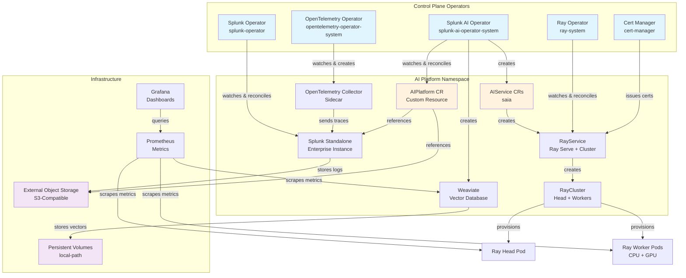

# k0s Cluster Setup for Splunk AI Platform

Complete guide for deploying Splunk AI Platform on k0s Kubernetes clusters.

## Table of Contents

- [Overview](#overview)
- [Features](#features)
- [Prerequisites](#prerequisites)
- [Quick Start](#quick-start)
- [Configuration](#configuration)
- [Usage](#usage)
- [Architecture](#architecture)
- [Image Pull Secrets](#image-pull-secrets)
- [Advanced Topics](#advanced-topics)
- [Troubleshooting](#troubleshooting)
- [Security](#security)
- [Internet Dependencies](#internet-dependencies)
- [Migration Guide](#migration-guide)

---

## Overview

The `k0s_cluster_with_stack.sh` script deploys the complete Splunk AI Platform on k0s Kubernetes, supporting:

- **Bare metal / on-premises deployments** with existing hardware and SSH access
- **External S3-compatible object storage** (SeaweedFS, MinIO, or any S3-compatible endpoint) — customer-managed
- **Air-gapped environments** with private registries
- **Session logging** — all output captured to timestamped log files
- **Safety gates** — refuses to wipe a live cluster with Ready nodes

> **Important:** This script requires pre-provisioned nodes with `existingIPs` in the config YAML. It does **not** auto-create cloud instances. Object storage must be external and customer-managed (no in-cluster MinIO is deployed).

### What is k0s?

[k0s](https://k0sproject.io/) is a CNCF-certified, lightweight Kubernetes distribution designed for:
- Simple installation (single binary, no OS dependencies)
- Production-ready clusters with minimal overhead
- Edge, IoT, and on-premises deployments
- Air-gapped and security-sensitive environments

---

## Features

### Complete AI Platform Stack

The script installs everything needed for the AI Platform:

1. **k0s Kubernetes Cluster** — CNCF certified, single-binary Kubernetes
2. **Calico CNI** — High-performance networking with VXLAN
3. **local-path Storage Provisioner** — Default StorageClass for PVCs
4. **Cert-Manager v1.13.0** — Automated certificate management
5. **Kube-Prometheus Stack** — Monitoring with Prometheus + Grafana
6. **OpenTelemetry Operator** — Distributed tracing and telemetry
7. **NVIDIA Host Drivers + Device Plugin** — GPU support (RHEL 9/10, AL2023, Debian/Ubuntu)
8. **KubeRay Operator v1.2.2** — Ray cluster management for distributed AI
9. **Splunk Operator** — Splunk Enterprise management
10. **Splunk AI Platform Operator** — AI platform orchestration (SAIA feature)
11. **AIPlatform CR** — Complete AI deployment with features, scheduling, and secrets

### Operational Features

- **Two-phase parallel installation** — Independent components install concurrently for faster deployments
- **Helm retry with exponential backoff** — Automatic retries on transient errors (timeouts, TLS handshake failures)
- **Preflight validation** — Checks tools, config, SSH connectivity, and disk space before starting
- **Safety gate** — Refuses to wipe a cluster that has Ready nodes (prevents accidental data loss)
- **Session logging** — All stdout/stderr captured to `tools/cluster_setup/logs/k0s-install-YYYY-MM-DD_HH-MM-SS.log`
- **Existing cluster detection** — `useExisting` flag (auto/force/never) to skip k0s install and deploy stack only

### Image Pull Secrets Support

Automatically creates and configures secrets for private container registries:
- **AWS ECR** — Elastic Container Registry (auto-token refresh)
- **Docker Hub** — Docker Hub private repositories
- **GCR** — Google Container Registry
- **ACR** — Azure Container Registry
- **Custom** — Any Docker registry

Secrets are automatically propagated through the platform:
```
AIPlatform CR → AIService → Job/RayCluster → Pods
```

---

## Prerequisites

### Required Tools (on Admin Workstation)

```bash
# Install required tools on macOS
brew install kubectl helm git jq yq

# Install required tools on Ubuntu/Debian
sudo apt-get update
sudo apt-get install -y kubectl helm git jq
wget https://github.com/mikefarah/yq/releases/latest/download/yq_linux_amd64 -O /usr/local/bin/yq
chmod +x /usr/local/bin/yq

# Verify installations
kubectl version --client
helm version
git --version
jq --version
yq --version
```

### Hardware Requirements

| Node Type | CPU | RAM | Disk | Notes |
|-----------|-----|-----|------|-------|
| Controller | 4+ | 8GB+ | 100GB+ | Runs API server, etcd, scheduler |
| CPU Worker | 8+ | 32GB+ | 200GB+ | Runs Weaviate, Ray head, Splunk |
| GPU Worker | 8+ | 32GB+ | 500GB+ | NVIDIA GPU required for AI inference |

### Software Requirements (on All Nodes)

- RHEL 9/10, Amazon Linux 2023, or Debian/Ubuntu
- Passwordless SSH access from admin workstation
- Sudo privileges without password
- Python 3.8+ installed

### Network Requirements

Open the following ports between nodes:

| Port | Protocol | Purpose |
|------|----------|---------|
| 22 | TCP | SSH management |
| 6443 | TCP | Kubernetes API server |
| 2380 | TCP | etcd peer communication |
| 10250 | TCP | Kubelet API |
| 8132 | TCP | Konnectivity agent |
| 179 | TCP | Calico BGP |
| 4789 | UDP | Calico VXLAN |
| 30000-32767 | TCP | NodePort services (optional) |

### External Object Storage

You must provide an external S3-compatible object storage endpoint:
- **SeaweedFS**, **MinIO**, or any S3-compatible service
- Must be reachable from all cluster nodes
- The script does **not** deploy object storage in-cluster

---

## Quick Start

### 1. Clone the Repository

```bash
git clone https://github.com/splunk/splunk-ai-operator.git
cd splunk-ai-operator/tools/cluster_setup
```

### 2. Create Configuration File

```bash
# Copy the template
cp k0s-cluster-config.yaml my-cluster.yaml

# Edit with your settings
vi my-cluster.yaml
```

### 3. Deploy the Cluster

```bash
CONFIG_FILE=./my-cluster.yaml ./k0s_cluster_with_stack.sh install
```

### 4. Verify Installation

```bash
# Set kubeconfig (saved automatically during install)
export KUBECONFIG=~/.kube/k0s-my-cluster

# Check nodes
kubectl get nodes

# Check AI Platform
kubectl get aiplatform -n ai-platform

# Check all components
kubectl get pods --all-namespaces
```

---

## Configuration

### Configuration File Structure

The `k0s-cluster-config.yaml` file controls all aspects of the deployment:

```yaml
cluster:           # Cluster name, useExisting, SSH user/key
nodes:             # Controller/worker counts and existingIPs
storage:           # storageClass, vectorDbSize, objectStore, minimumDiskSpace
images:            # registry prefix, operator, splunk, ray, weaviate, saia, nginx, fluentBit, otelCollector
operators:         # ray (version/modelVersion/rayVersion), certManager, nvidia devicePluginVersion
kubernetes:        # namespace
files:             # splunkOperator, aiPlatform manifest paths
splunk:            # standaloneName
aiPlatform:        # defaultAcceleratorType, workerGroupConfig, features, scheduling, serviceTemplate
imagePullSecrets:  # secrets list, autoCreateECR, dockerHub, gcr, acr, custom
ecr:               # account, region
```

### Configuration Example

```yaml
cluster:
  name: prod-ai-platform
  useExisting: auto               # auto | force | never
  sshUser: ubuntu
  sshKeyPath: ~/.ssh/prod-key.pem

nodes:
  controllers: 1
  cpuWorkers: 2                   # First 2 workers treated as CPU
  gpuWorkers: 2                   # Remaining 2 workers treated as GPU
  existingIPs:
    controllers:
      - 10.0.1.10
    workers:
      - 10.0.1.20                 # CPU (worker index 0)
      - 10.0.1.21                 # CPU (worker index 1)
      - 10.0.1.22                 # GPU (worker index 2)
      - 10.0.1.23                 # GPU (worker index 3)

storage:
  storageClass: "local-path"
  vectorDbSize: "200Gi"
  minimumDiskSpace:               # Preflight disk checks (GB)
    controller: 100
    cpuWorker: 200
    gpuWorker: 500
  objectStore:
    type: "seaweedfs"             # aws | s3compat | minio | seaweedfs
    bucket: "ai-platform-data"
    endpoint: "http://10.0.1.50:8333"   # REQUIRED for s3compat/minio/seaweedfs
    auth:
      rootUser: "admin"
      rootPassword: "Change-This-Strong-Password!"
  modelStaging:
    enabled: true                 # Download from HF + upload to object store before install

images:
  registry: "registry.corp.com"
  operator:
    image: "registry.corp.com/splunk/splunk-ai-operator:v0.1.5"
  splunk:
    image: "registry.corp.com/splunk/splunk:latest"
    operatorImage: "docker.io/splunk/splunk-operator:3.0.0"
  ray:
    headImage: "registry.corp.com/ray/ray-head:build-v1alpha1"
    workerImage: "registry.corp.com/ray/ray-worker-gpu:build-v1alpha1"
  weaviate:
    image: "docker.io/semitechnologies/weaviate:stable-v1.28"
  saia:
    apiImage: "registry.corp.com/saia/saia-api:build-v1alpha1"
    apiV2Image: "registry.corp.com/saia/saia-api-v2:build-v1alpha1"
    dataLoaderImage: "registry.corp.com/saia/saia-data-loader:build-v1alpha1"
  nginx:
    image: "docker.io/library/nginx:1.27-alpine"
  fluentBit:
    image: "docker.io/fluent/fluent-bit:1.9.6"
  otelCollector:
    image: "docker.io/otel/opentelemetry-collector-contrib:0.122.1"

operators:
  ray:
    version: "v1.2.2"
    modelVersion: "v0.3.14-36-g1549f5a"
    rayVersion: "2.44.0"
  certManager:
    installCRDs: true
  nvidia:
    devicePluginVersion: "v0.17.3"

kubernetes:
  namespace: ai-platform

splunk:
  standaloneName: splunk-prod

aiPlatform:
  name: "prod-ai-stack"
  defaultAcceleratorType: "L40S"        # GPU tier: L40S or ""
  workerGroupConfig:
    imageRegistry: ""                   # Override registry for Ray worker images
  features:
    - name: "saia"
      version: "1.1.0"
      serviceAccountName: ""
  cpuScheduling:
    nodeSelector:
      splunk.ai/workload-type: cpu
    tolerations: []
  gpuScheduling:
    nodeSelector:
      splunk.ai/workload-type: gpu
    tolerations:
      - key: "nvidia.com/gpu"
        operator: "Equal"
        value: "true"
        effect: "NoSchedule"
  serviceTemplate:                      # Optional: expose SAIA externally
    type: "NodePort"                    # NodePort | LoadBalancer
    nodePort: 30080                     # Port for NodePort type

imagePullSecrets:
  secrets: []
  autoCreateECR: true
  dockerHub:
    enabled: false
    username: ""
    password: ""
    email: ""
  gcr:
    enabled: false
    jsonKey: ""
  acr:
    enabled: false
    registry: ""
    username: ""
    password: ""
  custom:
    enabled: false
    name: "custom-registry-secret"
    server: ""
    username: ""
    password: ""
    email: ""

ecr:
  account: "123456789012"
  region: us-east-2
```

### Configuration Reference

#### Cluster Section

| Field | Required | Default | Description |
|-------|----------|---------|-------------|
| `cluster.name` | Yes | — | Cluster identifier (used for kubeconfig, labels) |
| `cluster.useExisting` | No | `never` | `auto` = detect existing cluster, `force` = fail if not found, `never` = always create new |
| `cluster.sshUser` | Yes | `ubuntu` | SSH username for all nodes |
| `cluster.sshKeyPath` | Yes | — | Path to SSH private key |

#### Nodes Section

| Field | Required | Default | Description |
|-------|----------|---------|-------------|
| `nodes.controllers` | No | `1` | Number of controller nodes (1 or 3 for HA) |
| `nodes.cpuWorkers` | No | `2` | First N workers in the list are labeled as CPU |
| `nodes.gpuWorkers` | No | `1` | Remaining workers after cpuWorkers are labeled as GPU |
| `nodes.existingIPs.controllers` | **Yes** | — | List of controller node IPs |
| `nodes.existingIPs.workers` | **Yes** | — | List of worker node IPs |

#### Storage Section

| Field | Required | Default | Description |
|-------|----------|---------|-------------|
| `storage.storageClass` | No | `local-path` | Kubernetes StorageClass for PVCs |
| `storage.vectorDbSize` | No | `50Gi` | Weaviate PersistentVolume size |
| `storage.minimumDiskSpace.controller` | No | `100` | Minimum disk (GB) for controller preflight check |
| `storage.minimumDiskSpace.cpuWorker` | No | `200` | Minimum disk (GB) for CPU worker preflight check |
| `storage.minimumDiskSpace.gpuWorker` | No | `500` | Minimum disk (GB) for GPU worker preflight check |
| `storage.objectStore.type` | No | `minio` | `aws`, `s3compat`, `minio`, or `seaweedfs` |
| `storage.objectStore.bucket` | No | `ai-platform-data` | S3 bucket name |
| `storage.objectStore.endpoint` | **Yes*** | — | S3-compatible endpoint URL (*required for s3compat/minio/seaweedfs) |
| `storage.objectStore.auth.rootUser` | Yes | — | Access key / root user |
| `storage.objectStore.auth.rootPassword` | Yes | — | Secret key / root password |
| `storage.modelStaging.enabled` | No | `true` | Download models from Hugging Face and upload to the object store before cluster install. Set `false` to skip (e.g. models already staged). |

#### Images Section

Short image paths (without a FQDN) are automatically prefixed with `images.registry`.

| Field | Required | Default | Description |
|-------|----------|---------|-------------|
| `images.registry` | No | `""` | Registry prefix for short image paths |
| `images.operator.image` | **Yes** | — | Splunk AI Operator image |
| `images.splunk.image` | **Yes** | — | Splunk Enterprise image |
| `images.splunk.operatorImage` | No | `docker.io/splunk/splunk-operator:3.0.0` | Splunk Operator image |
| `images.ray.headImage` | **Yes** | — | Ray head node image |
| `images.ray.workerImage` | **Yes** | — | Ray GPU worker image |
| `images.weaviate.image` | **Yes** | — | Weaviate vector DB image |
| `images.saia.apiImage` | **Yes** | — | SAIA API v1 image |
| `images.saia.apiV2Image` | **Yes** | — | SAIA API v2 image |
| `images.saia.dataLoaderImage` | **Yes** | — | SAIA data loader / post-install hook image |
| `images.nginx.image` | No | `docker.io/library/nginx:1.27-alpine` | Nginx reverse proxy for SAIA v1/v2 routing |
| `images.fluentBit.image` | No | `fluent/fluent-bit:1.9.6` | Fluent Bit log forwarder |
| `images.otelCollector.image` | No | `otel/opentelemetry-collector-contrib:0.122.1` | OpenTelemetry Collector |

**Image patching chain:** The script reads these config values, resolves them via `build_image_url()` (prepends registry if needed), then uses `sed` to patch the corresponding `RELATED_IMAGE_*` env vars in manifest files:

| Config field | Env var patched | Target file |
|---|---|---|
| `images.operator.image` | Container `image:` field | `artifacts.yaml` |
| `images.splunk.image` | `RELATED_IMAGE_SPLUNK_ENTERPRISE` | `splunk-operator-cluster.yaml` |
| `images.splunk.operatorImage` | Container `image:` field | `splunk-operator-cluster.yaml` |
| `images.ray.headImage` | `RELATED_IMAGE_RAY_HEAD` | `artifacts.yaml` |
| `images.ray.workerImage` | `RELATED_IMAGE_RAY_WORKER` | `artifacts.yaml` |
| `images.weaviate.image` | `RELATED_IMAGE_WEAVIATE` | `artifacts.yaml` |
| `images.saia.apiImage` | `RELATED_IMAGE_SAIA_API` | `artifacts.yaml` |
| `images.saia.apiV2Image` | `RELATED_IMAGE_SAIA_API_V2` | `artifacts.yaml` |
| `images.saia.dataLoaderImage` | `RELATED_IMAGE_POST_INSTALL_HOOK` | `artifacts.yaml` |
| `images.nginx.image` | `RELATED_IMAGE_NGINX` | `artifacts.yaml` |
| `images.fluentBit.image` | `RELATED_IMAGE_FLUENT_BIT` | `artifacts.yaml` |
| `images.otelCollector.image` | `RELATED_IMAGE_OTEL_COLLECTOR` | `artifacts.yaml` |
| `operators.ray.modelVersion` | `MODEL_VERSION` | `artifacts.yaml` |
| `operators.ray.rayVersion` | `RAY_VERSION` | `artifacts.yaml` |

#### AI Platform Section

| Field | Required | Default | Description |
|-------|----------|---------|-------------|
| `aiPlatform.name` | No | `${CLUSTER_NAME}-ai-platform` | Base name for the AIPlatform CR |
| `aiPlatform.defaultAcceleratorType` | No | `""` | GPU tier label: `L40S` or empty |
| `aiPlatform.workerGroupConfig.imageRegistry` | No | `""` | Override registry for Ray worker images |
| `aiPlatform.features` | Yes | — | Array of features to deploy (read dynamically from config) |
| `aiPlatform.features[].name` | Yes | — | Feature name (e.g., `saia`) |
| `aiPlatform.features[].version` | Yes | — | Feature version |
| `aiPlatform.features[].serviceAccountName` | No | `""` | Service account override |
| `aiPlatform.cpuScheduling.nodeSelector` | No | auto-generated | Node selector for CPU workloads |
| `aiPlatform.cpuScheduling.tolerations` | No | `[]` | Tolerations for CPU workloads |
| `aiPlatform.gpuScheduling.nodeSelector` | No | auto-generated | Node selector for GPU workloads |
| `aiPlatform.gpuScheduling.tolerations` | No | GPU toleration | Tolerations for GPU workloads |
| `aiPlatform.serviceTemplate.type` | No | — | Service type for SAIA exposure: `NodePort` or `LoadBalancer` |
| `aiPlatform.serviceTemplate.nodePort` | No | — | Node port number (only when type=NodePort) |

#### Image Pull Secrets Section

The `secrets` list is **not consumed** by the script. Instead, the script auto-detects which secrets exist in the namespace by checking for hardcoded names: `ecr-registry-secret`, `docker-hub-secret`, `gcr-secret`, `acr-secret`, `custom-registry-secret`.

```yaml
imagePullSecrets:
  secrets: []                         # NOT consumed; script auto-detects in namespace
  autoCreateECR: true                 # Consumed → creates ECR secret from AWS creds

  dockerHub:
    enabled: false
    username: ""
    password: ""
    email: ""

  gcr:
    enabled: false
    jsonKey: ""

  acr:
    enabled: false
    registry: ""
    username: ""
    password: ""

  custom:
    enabled: false
    name: "custom-registry-secret"
    server: ""
    username: ""
    password: ""
    email: ""
```

---

## Usage

### Commands

```bash
# Install cluster and full AI Platform stack
CONFIG_FILE=./my-config.yaml ./k0s_cluster_with_stack.sh install

# Stage model artifacts only (download from HF + upload to object store)
CONFIG_FILE=./my-config.yaml ./k0s_cluster_with_stack.sh stage-artifacts

# Re-stage without re-downloading models already present locally
SKIP_IF_EXISTS=1 CONFIG_FILE=./my-config.yaml ./k0s_cluster_with_stack.sh stage-artifacts

# Delete entire cluster (stop k0s, remove services)
CONFIG_FILE=./my-config.yaml ./k0s_cluster_with_stack.sh delete

# Clean all k0s state from bare-metal nodes (stop/reset/remove)
CONFIG_FILE=./my-config.yaml ./k0s_cluster_with_stack.sh clean-all

# Join additional workers to an existing cluster (or rejoin failed workers)
CONFIG_FILE=./my-config.yaml ./k0s_cluster_with_stack.sh join-workers
```

### Environment Variables

| Variable | Default | Description |
|----------|---------|-------------|
| `CONFIG_FILE` | `./k0s-cluster-config.yaml` | Path to configuration file |
| `AUTO_APPROVE` | `false` | Skip confirmation prompts |
| `USE_EXISTING` | (from config) | Override `cluster.useExisting` (`auto`/`force`/`never`) |
| `LOG_DIR` | `./logs` | Directory for session log files |
| `SKIP_IF_EXISTS` | `0` | Set to `1` to skip re-downloading models already present in `model_artifacts/` (used with `stage-artifacts` or during `install`) |

### Session Logging

All script output (stdout and stderr) is automatically captured to a timestamped log file:

```
tools/cluster_setup/logs/k0s-install-2026-04-29_14-30-00.log
```

Override the log directory:
```bash
LOG_DIR=/var/log/k0s CONFIG_FILE=./my-config.yaml ./k0s_cluster_with_stack.sh install
```

### Install Flow

The `install` command executes these steps in order:

1. **Load config** — Parse YAML, validate existingIPs
2. **Validate images** — Ensure all required image fields are set
3. **Configure images** — Patch `RELATED_IMAGE_*` env vars in manifest files
4. **Preflight checks** — Validate tools, SSH connectivity, disk space, config
5. **Model staging** *(when `storage.modelStaging.enabled: true`, the default)* — Download models from Hugging Face and upload them to the configured object store. Set `SKIP_IF_EXISTS=1` to skip re-downloading models already present locally. Skipped entirely when `enabled: false`.

   **Models staged (from `model_artifacts_configs.yaml`):**

   | Model artifact ID | Purpose |
   |---|---|
   | `gemma-4-31b-it` | Primary LLM for chat, SPL generation, reasoning |
   | `gpt-oss-20b` | Secondary LLM |
   | `all-minilm-l6-v2` | Sentence transformer / semantic search |
   | `bi-encoder` | BGE small encoder |
   | `cross-encoder` | MS MARCO cross-encoder |
   | `e5-language-classifier` | Multilingual language detection |
   | `mbart-translator` | Multilingual translation |
   | `pii-classifier` | PII detection |
   | `uae-large` | Embedding model |
   | `xlm-roberta-language-classifier` | Language classifier |
6. **Install k0s cluster** — Safety gate check → clean state → install controller → join workers → label nodes
7. **Install AI Platform stack** (two-phase parallel):
   - Phase 1 (parallel): cert-manager, kube-prometheus, NVIDIA host drivers
   - Between phases: Ensure S3 credentials secret
   - Phase 2 (parallel): OTel operator, Ray operator, Splunk operator, NVIDIA device plugin
   - Sequential: Image pull secrets → Splunk standalone → AI operator → AIPlatform CR
8. **Health checks** — Verify all components are running
9. **Access info** — Display kubeconfig path and service endpoints

### join-workers Command

The `join-workers` command is used to:
- Add new worker nodes to an existing cluster
- Rejoin workers that were disconnected or failed

It:
1. Loads config and identifies which workers are not yet joined
2. Generates a fresh worker token from the controller
3. Installs k0s worker on each missing node
4. Waits for nodes to become Ready
5. Labels nodes with `splunk.ai/*` labels based on CPU/GPU role

### useExisting Flag

| Value | Behavior |
|-------|----------|
| `never` | Always creates a new k0s cluster (default). Fails if nodes have a live cluster (safety gate). |
| `auto` | Checks if a running k0s cluster exists on the controller. If yes, skips cluster creation and deploys stack only. If no, creates new cluster. |
| `force` | Assumes an existing cluster. Fails if no running cluster is found on the controller. |

---

## Architecture

### Cluster Architecture

```
┌─────────────────────────────────────────────────────────────┐
│                  k0s Controller Node(s)                     │
│  ┌──────────────┐  ┌──────────────┐  ┌──────────────┐     │
│  │ API Server   │  │    etcd      │  │  Scheduler   │     │
│  │   :6443      │  │   :2380      │  │              │     │
│  └──────┬───────┘  └──────────────┘  └──────────────┘     │
│         │  Konnectivity                                    │
│         │  Server :8132                                    │
└─────────┼──────────────────────────────────────────────────┘
          │
    ┌─────┴────────────────────────┐
    │  Calico VXLAN Network        │
    │  (Pod Network: 10.244.0.0/16)│
    └─────┬────────────────────────┘
          │
  ┌───────┼───────────────────┬────────────────────┐
  │       │                   │                    │
┌─▼───────▼──────┐  ┌─────────▼────────┐  ┌───────▼─────────┐
│ CPU Worker 1   │  │  CPU Worker 2    │  │  GPU Worker     │
│                │  │                  │  │                 │
│ • Ray Head     │  │ • Weaviate       │  │ • Ray GPU Pods  │
│ • Splunk       │  │ • Ray CPU Pods   │  │ • AI Inference  │
│ • Monitoring   │  │ • AI Services    │  │                 │
└────────────────┘  └──────────────────┘  └─────────────────┘
```

### Network Architecture

**Pod Network (Calico VXLAN):**
- CIDR: `10.244.0.0/16`
- Overlay network across all nodes

**Service Network:**
- CIDR: `10.96.0.0/16`
- ClusterIP services
- NodePort range: `30000-32767`

**Host Network:**
- Controller API: `<controller-ip>:6443`
- Konnectivity: `<controller-ip>:8132`
- SSH: `<node-ip>:22`

### Storage Architecture

```
┌──────────────────────────────────────────────────────────┐
│            External S3-Compatible Object Storage          │
│           (Customer-Managed: SeaweedFS / MinIO / S3)     │
│                                                          │
│  Endpoint: http://<your-storage-host>:<port>             │
│                                                          │
│  Buckets:                                                │
│  └─ ai-platform-data/                                   │
│     ├─ artifacts/        (Build artifacts)               │
│     ├─ models/           (ML models)                     │
│     ├─ datasets/         (Training data)                 │
│     └─ tasks/            (Task outputs)                  │
│                                                          │
│  Credentials stored in-cluster as:                       │
│  └─ Secret: s3-secret (namespace: ai-platform)          │
│     Keys: s3_access_key, s3_secret_key                   │
└──────────────────────────────────────────────────────────┘
```

**Access Patterns:**
```yaml
# AIPlatform CR reference
objectStorage:
  path: s3://<bucket>/artifacts
  endpoint: http://<storage-host>:<port>
  region: us-east-1
  secretRef: s3-secret
```

### Component Architecture



---

## Image Pull Secrets

The platform supports automatic creation and propagation of image pull secrets for private container registries.

### Supported Registries

1. **AWS ECR** (Elastic Container Registry)
2. **Docker Hub** (Private repositories)
3. **GCR** (Google Container Registry)
4. **ACR** (Azure Container Registry)
5. **Custom** (Any Docker-compatible registry)

### Automatic ECR Configuration

```yaml
ecr:
  account: "123456789012"
  region: us-east-2

imagePullSecrets:
  autoCreateECR: true
```

**What happens automatically:**
1. Script detects AWS credentials
2. Gets ECR authorization token
3. Creates `ecr-registry-secret` in `ai-platform` namespace
4. Adds secret to AIPlatform CR `spec.images.imagePullSecrets`
5. Operator propagates to all AI workloads

**ECR Token Expiration:**
- ECR tokens expire after 12 hours
- Re-run installation to refresh tokens
- Or set up a CronJob for automatic refresh

### Manual Secret Creation

```bash
# ECR secret
kubectl create secret docker-registry ecr-registry-secret \
  --docker-server=123456789012.dkr.ecr.us-east-2.amazonaws.com \
  --docker-username=AWS \
  --docker-password=$(aws ecr get-login-password --region us-east-2) \
  --namespace=ai-platform

# Docker Hub secret
kubectl create secret docker-registry docker-hub-secret \
  --docker-server=docker.io \
  --docker-username=myuser \
  --docker-password=mypassword \
  --namespace=ai-platform

# Private registry secret
kubectl create secret docker-registry custom-registry-secret \
  --docker-server=registry.example.com \
  --docker-username=admin \
  --docker-password=secret123 \
  --namespace=ai-platform
```

### Image Pull Secret Propagation

Secrets are automatically propagated through the platform:

```yaml
AIPlatform CR
  spec.images.imagePullSecrets:
    - name: ecr-registry-secret
         ↓
AIService CR
  spec.imagePullSecrets:
    - name: ecr-registry-secret
         ↓
RayService/RayCluster
  spec.headGroupSpec.template.spec.imagePullSecrets:
    - name: ecr-registry-secret
  spec.workerGroupSpecs[*].template.spec.imagePullSecrets:
    - name: ecr-registry-secret
         ↓
Jobs (setup hooks, migrations)
  spec.template.spec.imagePullSecrets:
    - name: ecr-registry-secret
         ↓
Pods (Ray head, Ray workers, Weaviate, etc.)
  spec.imagePullSecrets:
    - name: ecr-registry-secret
```

### Troubleshooting Image Pull Issues

```bash
# Check if secret exists
kubectl get secret ecr-registry-secret -n ai-platform

# Verify secret type
kubectl get secret ecr-registry-secret -n ai-platform -o jsonpath='{.type}'
# Should output: kubernetes.io/dockerconfigjson

# Check pod events for pull errors
kubectl describe pod <pod-name> -n ai-platform | grep -A10 Events

# Common errors:
# "ImagePullBackOff" - Secret missing or invalid
# "ErrImagePull" - Wrong image name or registry
# "Unable to retrieve image pull secrets" - Secret doesn't exist in namespace
```

---

## Advanced Topics

### Node Labeling and Scheduling

The script automatically labels all nodes for proper workload scheduling.

#### Automatic Labels

**Controller Nodes:**
```yaml
splunk.ai/node-role: controller
splunk.ai/workload-type: control-plane
node.kubernetes.io/role: controller
```

**CPU Worker Nodes:**
```yaml
splunk.ai/node-role: worker
splunk.ai/workload-type: cpu
node.kubernetes.io/workload: ai-cpu
splunk.ai/instance-type: cpu-worker
```

**GPU Worker Nodes:**
```yaml
splunk.ai/node-role: worker
splunk.ai/workload-type: gpu
node.kubernetes.io/workload: ai-gpu
splunk.ai/instance-type: gpu-worker
nvidia.com/gpu: "true"
nvidia.com/gpu.count: "1"  # Auto-detected
```

#### GPU Taints

GPU nodes are automatically tainted to prevent non-GPU workloads:
```yaml
taints:
  - key: nvidia.com/gpu
    value: "true"
    effect: NoSchedule
```

#### Viewing Labels

```bash
# Show specific labels
kubectl get nodes -L splunk.ai/workload-type,splunk.ai/node-role

# Filter by type
kubectl get nodes -l splunk.ai/workload-type=gpu
kubectl get nodes -l splunk.ai/workload-type=cpu
```

### NVIDIA GPU Support

The script installs NVIDIA host drivers directly on GPU nodes (not the GPU Operator).

**Supported distributions:**
- RHEL 9
- RHEL 10
- Amazon Linux 2023
- Debian/Ubuntu

**What happens on GPU nodes:**
1. Kernel headers installed
2. NVIDIA CUDA repository configured
3. `cuda-drivers` package installed (falls back to `nvidia-driver-550` on Debian)
4. NVIDIA Container Toolkit installed and configured
5. `nvidia-smi` verification run
6. NVIDIA device plugin DaemonSet applied cluster-wide with RuntimeClass

### High Availability Setup

For production deployments, use 3 controller nodes:

```yaml
nodes:
  controllers: 3
  existingIPs:
    controllers:
      - 10.0.1.10
      - 10.0.1.11
      - 10.0.1.12
```

**Benefits:**
- Survives single controller failure
- etcd quorum maintained
- Zero downtime for API server

### Service Template (SAIA Public Exposure)

To expose the SAIA v2 chat UI externally:

```yaml
aiPlatform:
  serviceTemplate:
    type: "NodePort"      # or "LoadBalancer"
    nodePort: 30080       # only for NodePort
```

This generates a Kubernetes Service exposing port 8080 on the specified NodePort across all worker nodes.

### Air-Gapped Deployment

For completely disconnected environments:

1. **Pre-stage on a connected system:**
   - Download k0s binary
   - Pull all required container images
   - Download Helm charts

2. **Transfer to air-gapped environment:**
   - Copy k0s binary to all nodes
   - Load images into local registry
   - Copy Helm charts and manifests

3. **Configure to use local resources:**
   ```yaml
   images:
     registry: "registry.airgap.local"
     operator:
       image: "registry.airgap.local/splunk-ai-operator:v0.1.5"
   imagePullSecrets:
     secrets:
       - private-registry-secret
     autoCreateECR: false
   ```

4. **Run installation pointing to local registry**

### Backup and Restore

#### Backup etcd

```bash
ssh ubuntu@controller-ip
sudo k0s etcd snapshot save /tmp/etcd-backup.db

# Copy to local machine
scp ubuntu@controller-ip:/tmp/etcd-backup.db ./backup/
```

#### Restore from Backup

```bash
scp ./backup/etcd-backup.db ubuntu@controller-ip:/tmp/
ssh ubuntu@controller-ip
sudo k0s etcd snapshot restore /tmp/etcd-backup.db
```

---

## Troubleshooting

### Installation Issues

#### SSH Connection Failures

```bash
# Test SSH access
ssh -i ~/.ssh/my-key.pem ubuntu@node-ip hostname

# Common issues:
# 1. Wrong key permissions
chmod 600 ~/.ssh/my-key.pem

# 2. SSH agent not running
eval $(ssh-agent)
ssh-add ~/.ssh/my-key.pem

# 3. Firewall blocking port 22
# 4. Wrong username (try: ubuntu, ec2-user, admin, root)
```

#### k0s Installation Failures

```bash
# Check k0s status on controller
ssh ubuntu@controller-ip
sudo k0s status

# View k0s logs
sudo journalctl -u k0scontroller -f

# Check k0s config
sudo cat /etc/k0s/k0s.yaml
```

#### Worker Join Failures

```bash
# Check if worker is running
ssh ubuntu@worker-ip
sudo k0s status

# View worker logs
sudo journalctl -u k0sworker -f

# Use join-workers command to retry
CONFIG_FILE=./my-config.yaml ./k0s_cluster_with_stack.sh join-workers
```

#### Safety Gate Blocking Install

If install fails with "k0s cluster has Ready nodes — refusing to wipe":

```bash
# Option 1: Use existing cluster (deploy stack only)
# Set useExisting: auto in config, then re-run install

# Option 2: Tear down first
CONFIG_FILE=./my-config.yaml ./k0s_cluster_with_stack.sh delete
CONFIG_FILE=./my-config.yaml ./k0s_cluster_with_stack.sh install
```

### Storage Issues

#### Object Storage Connectivity

```bash
# Test endpoint from a node
ssh ubuntu@worker-ip
curl -s http://<endpoint>:<port>/minio/health/live

# Verify S3 secret exists
kubectl get secret s3-secret -n ai-platform -o yaml
```

#### PVC Stuck in Pending

```bash
# Check PVC status
kubectl get pvc -n ai-platform

# Check storage class
kubectl get sc

# For local-path issues:
kubectl get pods -n local-path-storage
kubectl logs -n local-path-storage deployment/local-path-provisioner
```

### GPU Issues

#### GPU Not Detected

```bash
# Check NVIDIA device plugin pods
kubectl get pods -n kube-system -l name=nvidia-device-plugin-ds

# Check node GPU resources
kubectl get nodes -o json | jq '.items[].status.capacity | select(.["nvidia.com/gpu"] != null)'

# Manually verify GPU on node
ssh ubuntu@gpu-worker-ip
nvidia-smi
```

#### GPU Workloads Not Scheduling

```bash
# Check if GPU nodes are tainted
kubectl describe node <gpu-node> | grep Taints

# Check if pods have tolerations
kubectl get pod <pod-name> -n ai-platform -o yaml | grep -A5 tolerations
```

### Application Issues

#### AIPlatform Not Ready

```bash
# Check AIPlatform status
kubectl get aiplatform -n ai-platform -o wide

# Describe for events
kubectl describe aiplatform <name> -n ai-platform

# Check operator logs
kubectl logs -n splunk-ai-operator-system \
  deployment/splunk-ai-operator-controller-manager
```

### Session Logs

All install output is captured in timestamped log files:

```bash
# View the latest log
ls -lt tools/cluster_setup/logs/ | head -5

# Tail a running install
tail -f tools/cluster_setup/logs/k0s-install-*.log
```

### Debugging Commands

```bash
# Get all resources in namespace
kubectl get all -n ai-platform

# Check events across cluster
kubectl get events --all-namespaces --sort-by='.lastTimestamp'

# Check resource usage
kubectl top nodes
kubectl top pods -n ai-platform

# Exec into pod for debugging
kubectl exec -it <pod-name> -n ai-platform -- /bin/bash

# Check pod logs (all containers)
kubectl logs <pod-name> -n ai-platform --all-containers=true --tail=100
```

---

## Security

### Production Security Checklist

- [ ] Use strong object storage credentials (not defaults)
- [ ] Enable TLS for all services
- [ ] Configure network policies
- [ ] Use unique SSH keys per environment
- [ ] Enable audit logging
- [ ] Set up RBAC policies
- [ ] Enable pod security policies
- [ ] Configure secrets encryption at rest
- [ ] Set up backup and disaster recovery
- [ ] Enable monitoring and alerting
- [ ] Harden SSH configuration (disable root login)
- [ ] Enable firewall on all nodes
- [ ] Regular security updates

### Network Policies

```bash
# Isolate ai-platform namespace
kubectl apply -f - <<EOF
apiVersion: networking.k8s.io/v1
kind: NetworkPolicy
metadata:
  name: deny-all-ingress
  namespace: ai-platform
spec:
  podSelector: {}
  policyTypes:
  - Ingress
---
apiVersion: networking.k8s.io/v1
kind: NetworkPolicy
metadata:
  name: allow-same-namespace
  namespace: ai-platform
spec:
  podSelector: {}
  policyTypes:
  - Ingress
  ingress:
  - from:
    - podSelector: {}
EOF
```

---

## Internet Dependencies

The script downloads various binaries, manifests, Helm charts, OS packages, and container images from the internet. This section lists every external download for air-gapped planning and security review.

### Downloads from the Admin Workstation (where the script runs)

| What | URL / Source |
|------|-------------|
| Public IP detection | `https://checkip.amazonaws.com`, `https://ipinfo.io/ip`, `https://api.ipify.org` |
| cert-manager manifest | `https://github.com/cert-manager/cert-manager/releases/download/v1.13.0/cert-manager.yaml` |
| NVIDIA k8s device plugin | `https://raw.githubusercontent.com/NVIDIA/k8s-device-plugin/<version>/deployments/static/nvidia-device-plugin.yml` |
| local-path-provisioner | `https://raw.githubusercontent.com/rancher/local-path-provisioner/v0.0.24/deploy/local-path-storage.yaml` |
| Prometheus Helm repo | `https://prometheus-community.github.io/helm-charts` |
| kube-prometheus-stack chart | `prometheus-community/kube-prometheus-stack` (via `helm install`) |
| OpenTelemetry Helm repo | `https://open-telemetry.github.io/opentelemetry-helm-charts` |
| OpenTelemetry Operator chart | `open-telemetry/opentelemetry-operator` (via `helm install`) |
| KubeRay Helm repo | `https://ray-project.github.io/kuberay-helm/` |
| KubeRay Operator chart | `kuberay/kuberay-operator` version `1.2.2` (via `helm install`) |

### Downloads on All Nodes via SSH

| What | URL / Source |
|------|-------------|
| iptables-nft | `dnf install -y iptables-nft` (RHEL/Fedora, if missing) |
| python3-pyyaml | `dnf install -y python3-pyyaml` or `apt-get install -y python3-yaml` or `pip3 install pyyaml` |
| k0s binary | `curl -sSLf https://get.k0s.sh | sudo sh` (if not already installed) |

### Downloads on GPU Worker Nodes via SSH

| What | URL / Source |
|------|-------------|
| Kernel headers | `dnf/yum install kernel-devel-$(uname -r) kernel-headers-$(uname -r)` or `apt-get install linux-headers-$(uname -r)` |
| NVIDIA GPU driver (AL2023) | Repo: `https://developer.download.nvidia.com/compute/cuda/repos/amzn2023/x86_64/cuda-amzn2023.repo` |
| NVIDIA GPU driver (RHEL 9/10) | Repo: `https://developer.download.nvidia.com/compute/cuda/repos/rhel{9,10}/x86_64/...` |
| NVIDIA GPU driver (Ubuntu) | `https://developer.download.nvidia.com/compute/cuda/repos/ubuntu2204/x86_64/cuda-keyring_1.1-1_all.deb` + `nvidia-driver-550` |
| EPEL for dkms (RHEL 10) | `https://dl.fedoraproject.org/pub/epel/epel-release-latest-10.noarch.rpm` |
| NVIDIA Container Toolkit | Repo: `https://nvidia.github.io/libnvidia-container/stable/rpm/nvidia-container-toolkit.repo`, GPG: `https://nvidia.github.io/libnvidia-container/gpgkey` |

### Container Images Pulled by Kubernetes at Runtime

These images are pulled from registries when pods are scheduled. Pre-pull for air-gapped environments.

| Image | Default Source |
|-------|---------------|
| Splunk AI Operator | ECR or configured registry |
| Ray Head / Ray Worker GPU | ECR or configured registry |
| Weaviate | `docker.io/semitechnologies/weaviate:...` |
| SAIA API v1 / v2 / Data Loader | ECR or configured registry |
| Nginx | `docker.io/library/nginx:1.27-alpine` |
| Fluent Bit | `docker.io/fluent/fluent-bit:1.9.6` |
| OpenTelemetry Collector | `docker.io/otel/opentelemetry-collector-contrib:0.122.1` |
| Splunk Enterprise | ECR or configured registry |
| Splunk Operator | `docker.io/splunk/splunk-operator:3.0.0` |
| Prometheus, Grafana, Alertmanager | Pulled by kube-prometheus-stack Helm chart |
| KubeRay Operator | `quay.io/kuberay/operator:v1.2.2` |
| OpenTelemetry Operator | Pulled by opentelemetry-operator Helm chart |
| cert-manager (controller, webhook, cainjector) | Pulled by cert-manager manifest |
| NVIDIA device plugin | Pulled by DaemonSet manifest |
| local-path-provisioner | Pulled by provisioner manifest |

---

## Migration Guide

### From EKS to k0s

If you're migrating from an existing EKS deployment:

**1. Export EKS Configuration**
```bash
# Export AIPlatform CR
kubectl get aiplatform -n ai-platform -o yaml > aiplatform-backup.yaml

# Backup S3 data
aws s3 sync s3://my-ai-bucket ./s3-backup/
```

**2. Install k0s Cluster**
```bash
CONFIG_FILE=./k0s-config.yaml ./k0s_cluster_with_stack.sh install
```

**3. Restore Data to Object Storage**
```bash
# Copy data to your S3-compatible endpoint
mc mirror ./s3-backup/ my-storage/ai-platform-bucket/
```

**4. Apply Resources**
```bash
kubectl apply -f aiplatform-backup.yaml
```

### Upgrading k0s Version

```bash
# On controller node
ssh ubuntu@controller-ip

# Download new k0s version
wget https://github.com/k0sproject/k0s/releases/download/v1.30.0/k0s
sudo install k0s /usr/local/bin/k0s

# Restart controller
sudo k0s stop
sudo k0s start

# Repeat for all workers
```

---

## Support and Resources

### Documentation

- k0s Official Docs: https://docs.k0sproject.io/
- Splunk AI Operator: https://github.com/splunk/splunk-ai-operator
- KubeRay: https://docs.ray.io/en/latest/cluster/kubernetes/

### Getting Help

- **GitHub Issues**: https://github.com/splunk/splunk-ai-operator/issues
- **Splunk Community**: https://community.splunk.com/
- **k0s Slack**: https://k8slens.slack.com

---

**Version:** 3.0
**Last Updated:** April 2026
**Maintainer:** Splunk AI Platform Team
