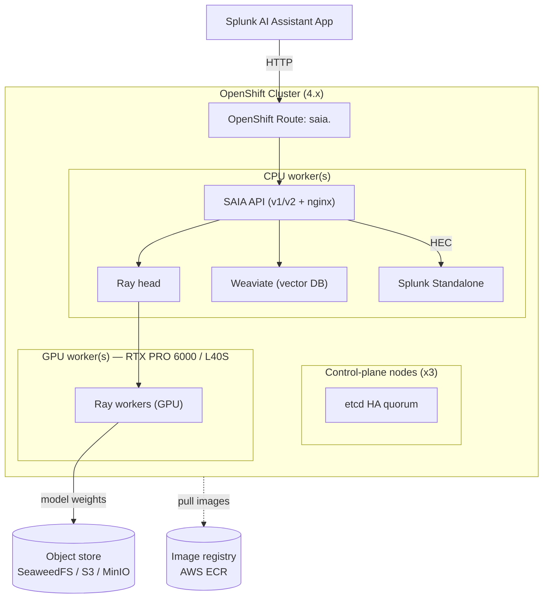

# Splunk AI Platform on OpenShift — Customer Onboarding Guide


This guide walks you through deploying the Splunk AI Platform stack onto an
**existing** OpenShift cluster using `openshift_with_stack.sh`. Unlike the k0s
installer, this installer does **not** provision a cluster — it assumes you
already have a running, healthy OpenShift cluster and installs only the AI
Platform stack on top of it.

> If you are deploying on a self-managed k0s cluster instead, use
> [`K0S_README.md`](./K0S_README.md). This document covers **OpenShift only**.

---

## Table of Contents

1. [Overview](#overview)
2. [What Gets Installed](#what-gets-installed)
3. [Prerequisites](#prerequisites)
4. [Quick Start](#quick-start)
5. [Configuration Reference](#configuration-reference)
6. [Install Flow](#install-flow)
7. [Architecture](#architecture)
8. [OpenShift-Specific Behavior](#openshift-specific-behavior)
9. [Image Pull Secrets (ECR)](#image-pull-secrets-ecr)
10. [Accessing SAIA — the Splunk AI Assistant App](#accessing-saia--the-splunk-ai-assistant-app)
11. [Air-Gapped Deployment](#air-gapped-deployment)
12. [Model Staging](#model-staging)
13. [Verification & Health Checks](#verification--health-checks)
14. [Troubleshooting](#troubleshooting)
15. [Uninstall](#uninstall)

---

## Overview

The Splunk AI Platform packages the models, vector database, and Splunk
integration that power the **Splunk AI Assistant (SAIA)** feature inside Splunk.
On OpenShift the stack is deployed by a single script, `openshift_with_stack.sh`,
which drives OLM operators, cert-manager, KubeRay, and the Splunk AI Operator to
stand up the platform.

**Key OpenShift differences vs. k0s** (these shape everything in this guide):

| Concern | k0s | OpenShift |
|---|---|---|
| Cluster provisioning | Installer creates the cluster | Cluster already exists; installer adds the stack only |
| Pod security | PodSecurityAdmission (warn) | **SCC-enforced** (`grantPrivilegedSCC`) |
| GPU Operator / NFD | Helm | **OLM Subscriptions** (OperatorHub catalogs) |
| External access | MetalLB LoadBalancer | **OpenShift Route** (HAProxy ingress) |
| Storage | local-path provisioner (installed by script) | local-path provisioner **+ SELinux relabel** of host dirs |
| CLI | `kubectl` | `oc` (installer uses `oc` exclusively) |

---

## What Gets Installed

Running `openshift_with_stack.sh install` creates the following, in order:

| Component | Namespace | Installed via |
|---|---|---|
| Node Feature Discovery (NFD) Operator → `NodeFeatureDiscovery` CR | `openshift-nfd` | OLM Subscription (`redhat-operators`, channel `stable`) |
| NVIDIA GPU Operator → `ClusterPolicy` CR | `nvidia-gpu-operator` | OLM Subscription (`certified-operators`, channel `v26.3`) |
| Node labels (`splunk.ai/*`) | — | `oc label` |
| local-path provisioner (+ SELinux relabel) | `local-path-storage` | Static manifest |
| cert-manager | `cert-manager` | Static manifest |
| OpenTelemetry Operator | `opentelemetry-operator-system` | Helm chart |
| KubeRay Operator | `ray-system` | Helm chart |
| ECR image pull secrets | all AI namespaces | `oc create secret` |
| Splunk AI Operator | `splunk-ai-operator-system` | `artifacts.yaml` |
| Splunk Operator | `splunk-operator` | `splunk-operator-cluster.yaml` |
| Splunk Standalone CR | `ai-platform` | Splunk Operator |
| AIPlatform CR (Ray, Weaviate, SAIA) | `ai-platform` | Splunk AI Operator |
| SAIA Route | `ai-platform` | `oc create route` |

The AI Platform workload namespace defaults to **`ai-platform`**.

---

## Prerequisites

**Cluster**
- A running **OpenShift Container Platform 4.21** cluster. The installer is
  validated on OCP 4.21.
- 3 control-plane nodes (etcd HA quorum).
- `cluster-admin` privileges (required for SCC grants, OLM installs, and the
  `oc debug node/` SELinux relabel).

**Reference hardware** (tested deployment):

| Role | Sizing |
|---|---|
| CPU | 1 node, 32 cores / 128 Gi RAM |
| GPU | 2 × RTX PRO 6000 Blackwell, 96 GB VRAM each |

**Client tools** on the install machine:
`oc` (logged in via `oc login`), `yq`, `helm` (v3+), `curl`, `jq`, `base64`,
`tar`. `aws` CLI is required when using ECR or an AWS S3 object store.
`python3` / `mc` are optional (model staging helpers).

**External dependencies**
- An image registry holding the platform images. Any registry works — AWS ECR,
  Docker Hub, GCR, ACR, an internal/Harbor registry, or a disconnected mirror.
  Set `images.registry` to your registry prefix and pick the matching pull-secret
  mechanism (`ecr.enabled` for ECR, or the `imagePullSecrets.*` blocks otherwise).
  The reference config uses **AWS ECR**
  (`658391232643.dkr.ecr.us-east-2.amazonaws.com`, region `us-east-2`).
- An S3-compatible object store for model artifacts (AWS S3, MinIO, or
  SeaweedFS). 

> The Ray head/worker and SAIA images are **built internally** and are not on any
> public registry. They must already exist in your registry (or be mirrored for
> air-gap) before install.

---

## Quick Start

```bash
cd tools/cluster_setup

# 1. Log in to your OpenShift cluster as cluster-admin
oc login --token=<token> --server=https://api.<cluster>:6443
oc whoami                       # confirm identity
oc auth can-i create clusterrolebinding   # must return "yes"

# 2. Edit the config for your environment
$EDITOR openshift-cluster-config.yaml
#   - set images.* to your registry paths
#   - set storage.objectStore.endpoint + auth to real values
#   - set openshift.nodes[] (manual strategy) to your node names
#   - set ecr.account / ecr.region if using ECR

# 3. Stage model weights to your object store.
#    Required for a fresh object store — Ray workers fail to start if weights
#    are missing. Skip only if the bucket is already staged from a prior run.
CONFIG_FILE=./openshift-cluster-config.yaml ./openshift_with_stack.sh stage-artifacts

# 4. Install the stack
CONFIG_FILE=./openshift-cluster-config.yaml ./openshift_with_stack.sh install

# (Teardown, when needed) Remove the stack. Leaves the cluster and nodes intact.
CONFIG_FILE=./openshift-cluster-config.yaml ./openshift_with_stack.sh delete
```

Because the installer uses your ambient `oc` login, make sure `oc whoami`
points at the correct cluster before running. If you manage cluster access via a
kubeconfig file, export it first, e.g. `export KUBECONFIG=~/.kube/openshift`.

The default subcommand is `install` if none is given. Use `--silent` / `-s` for
a non-interactive run.

**Subcommands:**

| Command | What it does |
|---|---|
| `install [--silent\|-s]` | Deploy the full stack |
| `delete` | Remove the stack (leaves cluster nodes running) |
| `diagnose` | Collect a support bundle (`tar.gz`) |
| `stage-artifacts` | Stage model weights to object storage only |
| `verify` | Check all pods are Running/Completed; auto-diagnoses on failure |

---

## Configuration Reference

The config file (default `openshift-cluster-config.yaml`, override with
`CONFIG_FILE=`) is validated with `yq`. Below are the sections and the values
from the reference deployment.

### `kubernetes`
```yaml
kubernetes:
  namespace: ai-platform      # AI Platform workload namespace
```

### `openshift`
```yaml
openshift:
  grantPrivilegedSCC: "true"  # grant SCCs to Ray/operator SAs (required for GPU)
  nodeLabelStrategy: "manual" # "auto" = all worker nodes; "manual" = list below
  nodes:                      # AI-tier pool (manual strategy only)
    - 00-25-b5-b5-00-35
    - 00-25-b5-b5-00-37
    - cc-40-f3-9f-e2-3c
```
- `grantPrivilegedSCC` — set `"false"` only if your cluster policy already grants
  the required SCCs. Required for GPU (`nvidia.com/gpu`) workloads.
- `nodeLabelStrategy` — `manual` labels only the nodes you list; `auto` labels
  every `node-role.kubernetes.io/worker` node.
- `ingressDomain` — optional; auto-detected from the default `IngressController`
  if omitted. Used to build the SAIA Route host.

### `images`
```yaml
images:
  registry: "658391232643.dkr.ecr.us-east-2.amazonaws.com"   # prefix for non-FQ images
  operator:
    image: ".../splunk-ai-operator:openshift-0.10"
  ray:
    headImage:   "ml-platform/ray/ray-head:build-953"
    workerImage: "ml-platform/ray/ray-worker-gpu:build-953"
  weaviate:
    image: "docker.io/semitechnologies/weaviate:stable-v1.28-007846a"
  saia:
    apiImage:        "ml-platform/saia/saia-api:build-v2-main-c3b489d"
    apiV2Image:      "ml-platform/saia/saia-api-v2:build-v2-main-c3b489d"
    dataLoaderImage: "ml-platform/saia/saia-data-loader:build-v2-main-c3b489d"
  splunk:
    image:         ".../splunk/splunk:10-2-ai-custom"
    operatorImage: "docker.io/splunk/splunk-operator:3.0.0"
  fluentBit:     { image: "docker.io/fluent/fluent-bit:1.9.6" }
  otelCollector: { image: "docker.io/otel/opentelemetry-collector-contrib:0.122.1" }
  nginx:         { image: "docker.io/library/nginx:1.27-alpine" }
```
The `registry` prefix is prepended to any image that is not fully qualified
(e.g. the `ml-platform/...` Ray and SAIA paths).


### `storage`
```yaml
storage:
  storageClass: "local-path"
  vectorDbSize: "50Gi"
  objectStore:
    type: "seaweedfs"           # aws | s3compat | minio | seaweedfs
    bucket: "ai-platform-bucket"
    endpoint: "http://<host>:8333"
    auth:
      rootUser: "<S3_ACCESS_KEY_ID>"
      rootPassword: "<S3_SECRET_ACCESS_KEY>"
```
Object storage path scheme by type: `s3://` (aws), `s3compat://`,
`minio://` (minio **and** seaweedfs).

> **`stage-artifacts` supports only `aws`, `minio`, and `seaweedfs`.** All four
> types work at runtime, but the automated staging command has no uploader for
> `s3compat` and will error out. If you use `s3compat`, **pre-stage the model
> weights into the bucket manually** (see [Model Staging](#model-staging)) before
> running `install` — the automated `stage-artifacts` step will not populate it.

### `splunk`
```yaml
splunk:
  standaloneName: splunk-standalone
```

### `aiPlatform`
```yaml
aiPlatform:
  name: "openshift-ai-platform"
  defaultAcceleratorType: "RTX_PRO_6000_BLACKWELL"   # L40S | H100 | RTX_PRO_6000_BLACKWELL
  workerGroupConfig:
    imageRegistry: ""
  features:
    - name: "saia"
      version: "1.1.0"
```
> **`serviceTemplate` is optional** and omitted here. Leave it out and SAIA's
> service defaults to `ClusterIP` — external clients reach SAIA through the
> **OpenShift Route** regardless (bare-metal node IPs are usually not externally
> routable). Only add a `serviceTemplate` block (e.g. `type: NodePort`,
> `nodePort: 30080`) if you specifically need the service exposed as NodePort.


### `operators`
```yaml
operators:
  ray:
    modelVersion: "v0.3.14-36-g1549f5a"   # model artifact version
    rayVersion: "2.53.0"                   # Ray runtime version
```

### `files`
```yaml
files:
  aiPlatform: "./artifacts.yaml"                  # Splunk AI Operator manifests
  splunkOperator: "./splunk-operator-cluster.yaml"
```
Relative paths are anchored to the config file's directory.

### `ecr`
```yaml
ecr:
  enabled: true
  account: "658391232643"
  region: "us-east-2"
```
When enabled, the installer creates `ecr-registry-secret` in all relevant
namespaces using an `aws ecr get-login-password` token. Set `enabled: false` for
non-ECR registries and use the `imagePullSecrets.*` blocks instead — see
[Image Pull Secrets](#image-pull-secrets-ecr) for the exact keys.

> **Non-ECR registries need `imagePullSecrets.*`.** Setting `ecr.enabled: false`
> alone creates **no** pull secret. If your internal Ray/SAIA/operator images
> live in a private (non-ECR) registry, you must enable the matching
> `imagePullSecrets.*` block below, or pods will fail with `ImagePullBackOff`.

---

## Install Flow

`openshift_with_stack.sh install` runs these phases:

1. **Pre-config** — load & validate config, resolve images, resolve accelerator
   type, resolve model staging, print the install plan.
2. **Model Staging** — stage weights to object storage (skipped in air-gap mode
   or when disabled).
3. **Preflight** — verify `oc whoami`, `cluster-admin`, and required tools.
4. **Infrastructure** — NFD Operator → GPU Operator → node labeling →
   local-path provisioner + SELinux relabel.
5. **Operators** — cert-manager → OpenTelemetry Operator → KubeRay Operator →
   ECR/image pull secrets → Splunk AI Operator → Splunk Operator.
6. **AI Platform Stack** — Splunk Standalone CR → AIPlatform CR → SAIA Route.
7. **Summary** — prints access info, including the SAIA URL.

---

## Architecture



- **Ray (KubeRay)** runs the model-serving cluster: a head pod on a CPU node and
  GPU worker pods pinned to GPU nodes by their `nvidia.com/gpu` resource request.
- **Weaviate** is the vector database (CPU workload); a `vector-db-setup` job
  populates it after install.
- **SAIA** is the RAG API fronted by nginx and exposed via the Route.
- **Splunk Standalone** is deployed by the Splunk Operator; SAIA sends data to it
  over HEC at
  `http://splunk-<standalone-name>-standalone-service.<ns>.svc.cluster.local:8088`.
- **Model weights** are staged to the object store and pulled by Ray workers.

### Node model & scheduling
All AI-tier nodes share a single `splunk.ai/ai-tier-node=true` label; both the
CPU scheduler and GPU scheduler select on it. GPU workers are further pinned to
GPU-capable nodes by their `nvidia.com/gpu` resource request — **not** by a
separate label or taint. Control-plane nodes are labeled
`splunk.ai/node-role=controller` and `splunk.ai/workload-type=control-plane`;
AI worker nodes are labeled `splunk.ai/node-role=worker`.

---

## OpenShift-Specific Behavior

### Security Context Constraints (SCC)

| Namespace | SCC | Reason |
|---|---|---|
| `splunk-ai-operator-system` | `privileged` | Operator webhook + leader election |
| `ai-platform` | `anyuid` | Operator-created SAs run as image-defined UID |
| `ai-platform` | `privileged` | Splunk Standalone writes to hostPath PVCs |
| `splunk-operator` | `privileged` | Operator pod adds `NET_BIND_SERVICE` |
| `local-path-storage` | `privileged` | Helper pod mounts host paths |

These group grants are added on `install` and removed on `delete` — but only
when `openshift.grantPrivilegedSCC` is `"true"` **in the config used for that
command**. The cleanup is conditional, so if you install with the grants
enabled and later flip `grantPrivilegedSCC: "false"`, `delete` will **skip**
the SCC cleanup and leave the `privileged`/`anyuid` group entries on the SCCs.
Those stale entries re-apply to any workload that later reuses these namespace
names. Run `delete` with the **same** `grantPrivilegedSCC` value you installed
with, or remove the entries manually:

```bash
oc adm policy remove-scc-from-group privileged system:serviceaccounts:splunk-ai-operator-system
oc adm policy remove-scc-from-group anyuid     system:serviceaccounts:ai-platform
oc adm policy remove-scc-from-group privileged system:serviceaccounts:ai-platform
oc adm policy remove-scc-from-group privileged system:serviceaccounts:splunk-operator
oc adm policy remove-scc-from-group privileged system:serviceaccounts:local-path-storage
```

### OpenShift Route (external access)
SAIA is exposed via an OpenShift **Route** named `saia`, host
`saia.<ingress-domain>`, backing service
`<aiPlatform.name>-saia-saia-service` on `targetPort: 8080`. The Route carries a
`600s` HAProxy timeout and disabled response buffering (for streaming). It is
created immediately and returns `503` until the SAIA backend endpoints are ready.

### OLM operators (NFD + GPU Operator)
NFD and the NVIDIA GPU Operator are installed as **OLM Subscriptions**, not Helm:
- **NFD** — Subscription `nfd`, channel `stable`, source `redhat-operators`, in
  `openshift-nfd`; then a `NodeFeatureDiscovery` CR (`nfd-instance`).
- **GPU Operator** — Subscription `gpu-operator-certified`, channel `v26.3`,
  source `certified-operators`, in `nvidia-gpu-operator`; then a `ClusterPolicy`
  CR (`gpu-cluster-policy`) with `driver.use_ocp_driver_toolkit: true` (no SSH to
  nodes needed). The installer waits up to 15 minutes for the
  `nvidia.com/gpu.present=true` node label.

### SELinux
On RHEL nodes SELinux is enforcing. The installer relabels the local-path
provisioner directory to `container_file_t` (MCS label `s0`) via
`oc debug node/...`, which requires cluster-admin and a debug image.

### cert-manager clock skew
cert-manager issues certs with `notBefore` ~30–60s in the future; early webhook
calls can fail with `x509: certificate ... is not yet valid`. The installer
probes with a real resource and retries (up to ~5 minutes) during OTel and
AIPlatform CR creation.

---

## Image Pull Secrets (ECR)

Two mechanisms exist:

1. **ECR auto-secret** (`ecr.enabled: true`) — the installer runs
   `aws ecr get-login-password`, creates `ecr-registry-secret` in
   `splunk-ai-operator-system`, `ai-platform`, and `splunk-operator`, and
   attaches it to the relevant service accounts.
2. **`imagePullSecrets.*` blocks** — for DockerHub, GCR, ACR, or a custom
   registry, enable the matching block; the installer creates the secret and
   attaches it to the `default` service account.

Both mechanisms run in all three namespaces: `ai-platform`,
`splunk-ai-operator-system`, and `splunk-operator`.

### Non-ECR registry schema

If you set `ecr.enabled: false` (or leave it out) you **must** supply the keys
below, or no pull secret is created and internal images fail with
`ImagePullBackOff`. Enable only the block(s) you need — each is independent and
all default to `enabled: false`:

```yaml
imagePullSecrets:
  autoCreateECR: false          # set true to also create the ECR secret here

  dockerHub:                    # → secret "docker-hub-secret" (server docker.io)
    enabled: true
    username: "myuser"
    password: "mytoken"         # DockerHub access token or password
    email: "me@example.com"     # optional

  gcr:                          # → secret "gcr-secret" (server gcr.io)
    enabled: false
    jsonKey: |                  # full service-account JSON; username is "_json_key"
      { "type": "service_account", ... }

  acr:                          # → secret "acr-secret"
    enabled: false
    registry: "myregistry.azurecr.io"
    username: "<sp-app-id>"
    password: "<sp-password>"

  custom:                       # → secret "custom-registry-secret" (or .name)
    enabled: false
    name: "custom-registry-secret"   # optional; overrides the secret name
    server: "registry.internal.example.com"
    username: "myuser"
    password: "mypassword"
    email: "me@example.com"          # optional
```

A block is only applied when `enabled: true` **and** its required credentials
are present (username+password for DockerHub/ACR/custom, `jsonKey` for GCR,
plus `server` for custom); otherwise the installer logs a warning and skips it.
Point the platform's image fields at the same registry so the created secret
matches the images being pulled.

> **ECR tokens expire after 12 hours.** For long-running clusters you should set
> up a refresh mechanism (e.g. a CronJob re-running the secret creation); this is
> not automated by the installer.

---

## Accessing SAIA — the Splunk AI Assistant App

After install, the script prints the SAIA URL:
`http://saia.<ingress-domain>`.

In the reference deployment this resolves to
**`http://saia.apps.splunk-ai.rtplab.splunk.com`**, which the OpenShift Route
forwards to the internal `openshift-ai-platform-saia-saia-service:8080`.

Use this URL when configuring the **Splunk AI Assistant** app in Splunk. The
SAIA services themselves (`saia-service`, `saia-v1`, `saia-v2`, `serve-svc`,
`head-svc`, `weaviate`) are `ClusterIP` and are not directly reachable from
outside the cluster — the Route is the single external entry point.

To find the URL later:
```bash
oc get route saia -n ai-platform -o jsonpath='{.spec.host}{"\n"}'
```

---

## Air-Gapped Deployment

Air-gap uses two scripts plus a separate image-mirroring step:

1. **On an internet-connected machine**, build the bundle:
   ```bash
   ./prepare_airgap_bundle_openshift.sh --output-dir /mnt/transfer
   ```
   The bundle contains **only** Helm charts and static manifests:
   - `manifests/cert-manager.yaml` (v1.13.0), `manifests/local-path-storage.yaml`
     (v0.0.26)
   - `charts/kuberay-operator-1.2.2.tgz`, `charts/opentelemetry-operator-*.tgz`
   - `airgap-env.sh`, `container-images.txt`, `bundle-versions.txt`,
     `checksums.sha256`

2. **Mirror container images** to your internal registry with `oc mirror` (or
   `crane`), then update `images.registry` and each `images.*` field in the
   config to the mirrored paths.

   `container-images.txt` in the bundle lists the publicly available images
   (Weaviate, KubeRay, OTel, Fluent Bit, nginx, cert-manager, Splunk,
   Splunk Operator). **Three image groups are built internally and are not
   listed as real entries** — they must be mirrored separately from your source
   registry:

   | Config key | Images to mirror |
   |---|---|
   | `images.operator.image` | Splunk AI Operator image |
   | `images.ray.headImage`, `images.ray.workerImage` | Ray head + worker GPU images |
   | `images.saia.apiImage`, `images.saia.apiV2Image`, `images.saia.dataLoaderImage` | SAIA API v1/v2 + data loader images |

   Mirror all three groups in addition to the images in `container-images.txt`,
   or the install will hit `ImagePullBackOff` on those pods.

3. **Mirror the OLM catalogs** for NFD (`redhat-operators`) and GPU Operator
   (`certified-operators`) via `oc mirror`, and apply the generated
   `ImageContentSourcePolicy` + `CatalogSource`.

4. **Stage model weights** separately (~60 GB) via
   `tools/artifacts_download_upload_scripts/`.

5. **On the air-gapped machine**, install from the bundle:
   ```bash
   ./install_from_airgap_bundle_openshift.sh \
     --bundle airgap-bundle-openshift-<date>.tar.gz \
     --config openshift-cluster-config.yaml \
     [--extract-dir /opt/airgap]
   ```
   This extracts the bundle, verifies SHA-256 checksums (hard-fails on mismatch),
   exports the `file://` env overrides, sets `AIRGAP_MODE=true`, and invokes
   `openshift_with_stack.sh install`.

**Not bundled** (and why): container images (`oc mirror`), NFD/GPU Operator (OLM
catalog mirror), the k0s binary/yq (OpenShift is a pre-existing cluster), MetalLB
(OpenShift uses Routes), kube-prometheus-stack (OpenShift ships its own
monitoring), the NVIDIA device-plugin manifest and GPU host OS packages (the GPU
Operator manages the driver lifecycle), and model weights (staged separately).

---

## Model Staging

Model artifacts are downloaded from HuggingFace and uploaded to your object
store. Staging is controlled by `storage.modelStaging.enabled` (or forced by the
`stage-artifacts` subcommand) and is skipped entirely in air-gap mode.

The model set (`model_artifacts_configs.yaml`, all non-gated):

| artifact-id | source |
|---|---|
| all-minilm-l6-v2 | sentence-transformers/all-MiniLM-L6-v2 |
| bi-encoder | BAAI/bge-small-en-v1.5 |
| cross-encoder | cross-encoder/ms-marco-MiniLM-L-6-v2 |
| e5-language-classifier | Mike0307/multilingual-e5-language-detection |
| gpt-oss-20b | openai/gpt-oss-20b |
| mbart-translator | facebook/mbart-large-50-many-to-many-mmt |
| gemma-4-31b-it-qat-w4a16-ct | google/gemma-4-31B-it-qat-w4a16-ct |
| pii-classifier | StanfordAIMI/stanford-deidentifier-base |
| uae-large | WhereIsAI/UAE-Large-V1 |
| xlm-roberta-language-classifier | papluca/xlm-roberta-base-language-detection |

Upload target is chosen by object-store type: `aws` → `upload_to_s3.sh`,
`minio` → `upload_to_minio.sh`, `seaweedfs` →
`upload_to_seaweedfs_upload_only.sh`. A `.staging_complete` marker per model lets
re-runs skip already-staged artifacts (override with `SKIP_IF_STAGED=0`).

> **`s3compat` is not supported by `stage-artifacts`.** Automated staging only
> handles `aws`, `minio`, and `seaweedfs`; a `s3compat` store errors out. For a
> generic S3-compatible store, upload the model weights into the bucket manually
> (the layout the platform expects is `model_artifacts/<artifact-id>/...` under
> your configured bucket) before running `install`.


---

## Verification & Health Checks

```bash
# High-level status
oc get aiplatform,aiservice,raycluster,rayservice -n ai-platform

# Automated pod health check across all namespaces
CONFIG_FILE=./openshift-cluster-config.yaml ./openshift_with_stack.sh verify

# Watch Ray come up
oc get raycluster,rayservice -n ai-platform -w

# Operator logs
oc logs -n splunk-ai-operator-system -l control-plane=controller-manager -f
```

A healthy reference deployment shows:
- `AIPlatform/openshift-ai-platform` — `READY=True`, `RAYSERVICE=True`,
  `VECTORDB=True`
- Ray head pod `3/3`, GPU worker pods `2/2`, SAIA deployment + nginx + v2 +
  worker Running, `weaviate-0` `1/1`, `splunk-standalone-0` `1/1`, and the
  `vector-db-setup` post-hook job `Completed`.
- Route `saia` resolving to your ingress domain.

If `verify` finds unhealthy pods it automatically runs `diagnose` (unless
`AUTO_DIAGNOSE=false`), producing a support bundle.

### Ray Dashboard UI

The Ray dashboard runs on the Ray head pod at port **8265**, exposed by the
`<aiPlatform.name>-head-svc` service (a `ClusterIP` — there is no Route for it).
To reach it, port-forward the head service and open the dashboard locally:

```bash
# Forward the dashboard port (Ctrl-C to stop)
oc port-forward -n ai-platform svc/openshift-ai-platform-head-svc 8265:8265
```

Then browse to **http://localhost:8265**. The dashboard shows the Ray cluster
state, Serve applications/deployments, actors, and per-node GPU/CPU usage. If
your AIPlatform CR uses a different `name`, substitute the matching
`<name>-head-svc` (find it with `oc get svc -n ai-platform | grep head-svc`).

---

## Troubleshooting

**Weaviate or Splunk Standalone stuck `Pending`**
Usually a PV node-affinity mismatch. The `local-path` provisioner pins a PV to
the first node it lands on; if that is a GPU node, a CPU-only workload whose
scheduler selector cannot reach it will stay Pending. Prefer letting the PVC
reprovision on a CPU node (delete the PVC and pod so the operator recreates
them) rather than relabeling the GPU node — overwriting a GPU node's
`splunk.ai/workload-type` would break GPU scheduling.

**Do not patch operator-owned resources directly**
The Weaviate StatefulSet and other stack resources are owned by the AIPlatform
CR. Patches to their `nodeSelector`/spec are reconciled back by the operator.

**Re-running the vector-db-setup job**
A completed Job cannot be re-run in place, and it is owned by the AIService CR.
`oc delete job <name> -n ai-platform` and the operator recreates it.

**AIPlatform CR rejected: "no endpoints available for service
`splunk-ai-operator-webhook-service`"**
The operator rolled out but its webhook endpoint isn't registered yet. Wait until
`oc get endpoints -n splunk-ai-operator-system` shows non-empty endpoints, then
retry.

**`x509: certificate ... is not yet valid`**
cert-manager clock skew — retry after a minute; the installer handles this
automatically during its own steps.

**ImagePullBackOff**
Confirm `ecr-registry-secret` exists in the pod's namespace and is attached to
its service account. Remember the ECR token expires after 12 hours; recreate the
secret if the cluster has been idle.

---

## Uninstall

```bash
CONFIG_FILE=./openshift-cluster-config.yaml ./openshift_with_stack.sh delete
```

This removes the AI Platform stack and reverses the SCC grants. It leaves the
underlying OpenShift cluster and its nodes running.

---

*Reference deployment facts in this guide were validated against a live
OpenShift 4.21 cluster. Image tags, versions, and endpoints reflect that
environment — substitute your own values in `openshift-cluster-config.yaml`.*
