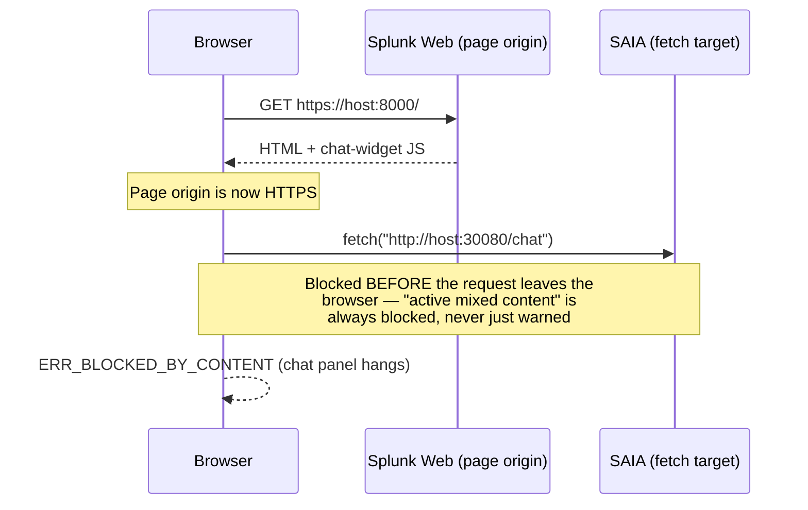
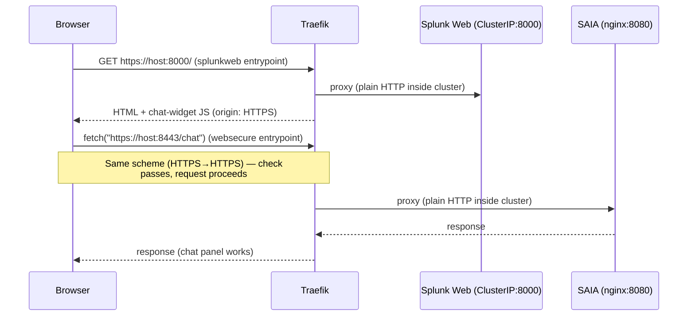
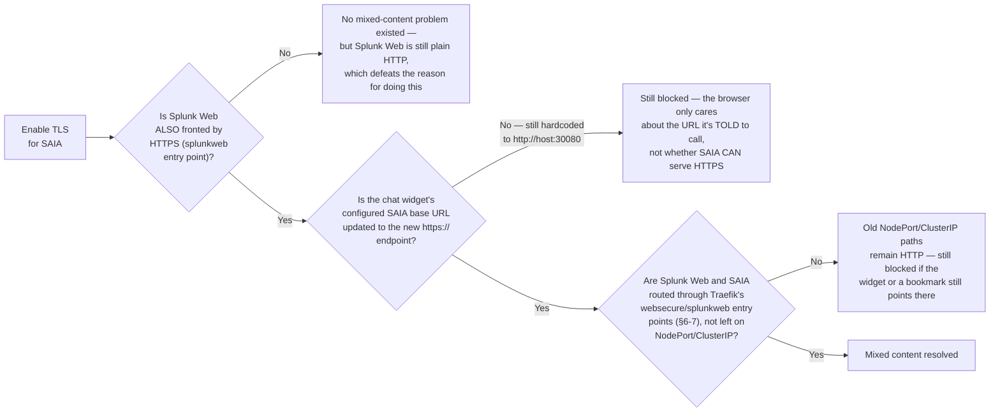
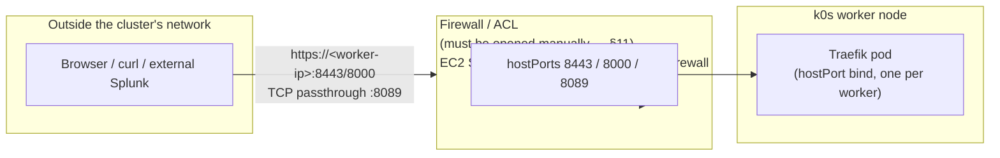
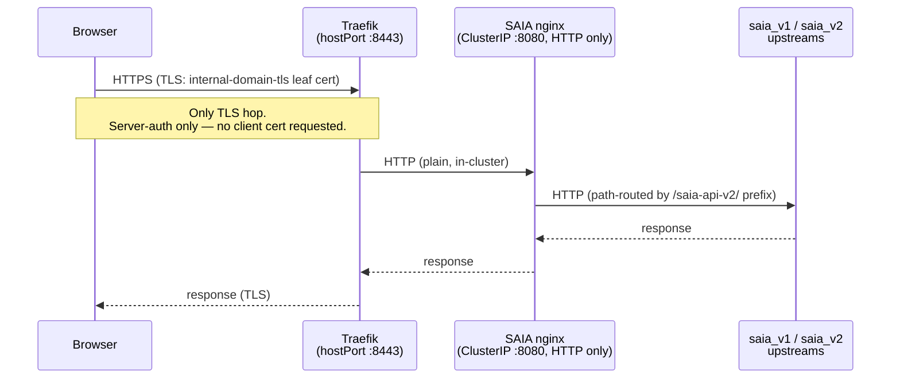

# Traefik HTTPS Ingress — Architecture Design

**Status:** Design / for-implementation
**Target:** k0s (1 controller, 1 CPU worker, 2 GPU workers, 1 installer/jump node) — on any
infrastructure: cloud VM, bare metal, or on-prem. Cloud-specific notes (e.g. EC2) are called out
explicitly where the underlying mechanism differs; everything else in this design is
infrastructure-agnostic.
**Namespace:** `ai-platform` (services), `ingress` (Traefik)
**Installer:** `k0s_cluster_with_stack.sh` + `k0s-cluster-config.yaml`

---

## Table of Contents

- [1. Problem Statement](#1-problem-statement)
- [1a. Requirements](#1a-requirements)
- [2. How the Existing YAML Files Fit In](#2-how-the-existing-yaml-files-fit-in)
- [3. FIPS / GODEBUG Behavior](#3-fips--godebug-behavior)
- [4. Architecture Decision: Raw Manifests vs Helm](#4-architecture-decision-raw-manifests-vs-helm)
- [5. TLS Certificate Strategy](#5-tls-certificate-strategy)
- [5a. TLS/mTLS Topology and External Exposure](#5a-tlsmtls-topology-and-external-exposure)
- [6. Entry Point Design](#6-entry-point-design)
- [7. IngressRoute Design](#7-ingressroute-design)
- [8. Required Changes to Existing Files](#8-required-changes-to-existing-files)
- [9. New Resources Needed](#9-new-resources-needed)
- [10. Installer Changes](#10-installer-changes)
- [11. What the End User Must Provide](#11-what-the-end-user-must-provide)
- [12. Access Pattern After Deployment](#12-access-pattern-after-deployment)
- [13. Bugs and Issues to Fix](#13-bugs-and-issues-to-fix)
- [14. Migration Path](#14-migration-path)

---

## 1. Problem Statement

Everything in the k0s AI Platform runs over plain HTTP:

- Splunk Web (`splunk-splunk-standalone-standalone-service:8000`) — ClusterIP only
- SAIA (`k0s-ai-platform-ai-platform-saia-saia-service`) — NodePort 30080

This causes three concrete failures today:

**1. Browser mixed-content blocking.** The moment Splunk Web is fronted by HTTPS, the browser refuses the `http://…:30080` XHR/fetch/EventSource calls the AI Assistant makes to SAIA. The chat panel shows a permanent spinner — the same failure documented in `K0S_README.md` (the onboarding wizard hanging because the SAIA tunnel wasn't open). Mixed-content is enforced by the browser and cannot be worked around server-side.

**2. Fragile SSH tunnel dependency.** Access today requires:
- A `kubectl port-forward` on the installer node (dies silently)
- Two SSH tunnels open simultaneously in separate terminals
- SAIA URL changes to `localhost:30080` every session

**3. External Splunk JWT trust.** External Splunk instances need a stable, TLS-terminated, publicly-trustable URL to validate JWTs against SAIA's signing endpoint — not a NodePort on a private IP.

### End state

Traefik v3 runs as a DaemonSet with hostPorts on the k0s workers. It terminates TLS and routes to in-cluster services. After deployment:

- Splunk Web → `https://<host>:8000` (TLS terminated at Traefik)
- SAIA → `https://<host>:8443` (same HTTPS scheme → no mixed-content)
- Certificates issued by cert-manager (already installed)
- SSH tunnels replaced by direct HTTPS or a single stable jump-host tunnel

## 1a. Requirements

- **Optional.** Traefik setup is gated behind `ingress.enabled` (default `false`). Installs that
  don't set it get zero behavior change — no Traefik namespace, no DaemonSet, no CRDs, no
  cert-manager chain beyond what's already installed for other purposes. This is additive to,
  not a replacement for, the existing NodePort/tunnel access path (§14 Migration Path).
- **In-cluster service routing.** When enabled, Traefik must provide a working route from its
  external-facing hostPorts to each in-cluster service it fronts — SAIA
  (`…-saia-saia-service:8080`), Splunk Web (`…-standalone-service:8000`), and Splunk mgmt
  (`…-standalone-service:8089`, TCP passthrough) — using `IngressRoute`/`IngressRouteTCP`
  objects that resolve those ClusterIP/NodePort services by their in-cluster DNS names (§7).
  Routing must work regardless of which namespace the backend service lives in (`ai-platform`),
  which requires Traefik's ClusterRole to have cluster-wide watch on `IngressRoute`/
  `IngressRouteTCP` objects (§9) and correct `dnsPolicy` so it can resolve in-cluster DNS at all
  (§13, bug #1).

### 1.1 Why fronting SAIA with TLS actually fixes mixed-content blocking

The browser's mixed-content check is purely about **scheme match between the page origin and
the fetch target** — it has nothing to do with whether SAIA itself supports TLS in the
abstract, and the check happens client-side, before any request leaves the browser:



Once Traefik terminates TLS for **both** Splunk Web and SAIA at the cluster edge, the browser
sees HTTPS→HTTPS on both legs and the check passes — everything behind Traefik (Traefik→Splunk
Web, Traefik→SAIA) stays plain HTTP internally, which the browser never inspects:



**This fix depends on three conditions all being true simultaneously — missing any one leaves
the bug in place:**



1. **Splunk Web must also be HTTPS** (§6's `splunkweb` entry point, `:8000`) — an HTTP page
   calling an HTTPS endpoint is *not* blocked, so if Splunk Web stayed plain HTTP there'd be no
   mixed-content error to fix in the first place, but you also wouldn't have gained anything,
   since Splunk Web being HTTPS is presumably part of the motivation.
2. **The chat widget's SAIA base URL must be updated to point at the new `https://<host>:8443`
   endpoint** (§7's `saia-ingressroute.yaml`). TLS capability on SAIA's side is necessary but
   not sufficient — if the widget config still resolves to `http://<node>:30080`, the browser
   is still instructed to make an HTTP call and still blocks it. This is a config/wiring change
   that must ship alongside the IngressRoute, not an automatic side effect of it.
3. **Both services must actually be routed through Traefik's entry points**, not left
   reachable on their old NodePort/ClusterIP paths — this design is explicitly **additive**
   (§14 Migration Path), so the old plain-HTTP paths keep working during the transition; any
   client (bookmark, saved widget config) still pointed at the old URL will still hit the
   mixed-content wall until it's repointed at the Traefik-fronted URL.

**Related but separate check — not fixed by this at all:** Splunk Web (`:8000`) and SAIA
(`:8443`) are different origins even once both are HTTPS (different ports), so cross-origin
`fetch` calls still require CORS headers from SAIA. This isn't a *new* requirement introduced
by this design — SAIA and Splunk Web are already on different ports today, so if CORS is
already handled now, it stays handled. Mixed-content (scheme) and CORS (origin) are
independent browser checks; fixing one doesn't touch the other.

---

## 2. How the Existing YAML Files Fit In

These files come from an existing **Splunk Cloud internal production deployment** — a multi-component Splunk cluster with cluster manager, license manager, SHC, indexers, etc. They are the sanctioned Splunk production pattern for Traefik and are the correct reference. However, they encode components the AI Platform does not have. Treat them as a template to prune, not a drop-in.

They are generated together and distributed as a **compressed archive** — `ingress.yaml` is the centrepiece (DaemonSet + entry points + FIPS control); the rest define the CRDs, RBAC, and per-service routing rules.

| File | What it is | Reusable? | Action needed |
|---|---|---|---|
| `ingress.yaml` | Traefik DaemonSet + entry-point/hostPort definitions + RBAC + image. **Contains the `GODEBUG` FIPS control env var (see §3).** | Core — yes | Prune entry points; fix `dnsPolicy` bug; remove duplicate RBAC; swap to internal image; set `GODEBUG` appropriately |
| `traefik-crds.yaml` | Full Traefik v3 CRD set (IngressRoute, IngressRouteTCP, Middleware, ServersTransport, TLSStore, etc.) | Yes, as-is | Apply verbatim — CRDs are cluster-scoped |
| `traefik-crds-rbac.yaml` | ClusterRole + ClusterRoleBinding for Traefik | Yes | Use as the **single** RBAC source; remove the duplicate embedded in `ingress.yaml` |
| `splunk_ingress.yaml` | Port-based IngressRoutes for cm/lm/mc/shc/s1/s2s; `ServersTransport: selfsigned` for backend TLS; references `internal-domain-tls` secret; namespace `splunk` | Pattern only | **Drop** cm/lm/mc/shc/s2s routes. Keep s1/standalone pattern. Change ns → `ai-platform`, update service names, align TLS secret |
| `splunk_ingress_named.yaml` | Host-based routes via `HostRegexp` (e.g. `manager.*`, `s1.*`) | Optional | Only if user has DNS names per service. Can be provided as a DNS-mode alternative |
| `monitoring.yaml` | IngressRoutes for Prometheus (:9090) and Perses (:3000) | Prometheus only | Keep Prometheus route (kube-prometheus-stack is deployed); drop Perses (not in platform) |
| `s3-upload-ingressroute.yaml` | IngressRoute for Ceph RGW (in-cluster S3) in namespace `rook-ceph` | **Drop** | AI Platform uses **external** object store. No `rook-ceph` deployed. Remove entirely |

---

## 3. FIPS / GODEBUG Behavior

The `ingress.yaml` DaemonSet contains this env var:

```yaml
env:
- name: GODEBUG
  value: fips140=off
```

This is a **first-class deployment control**, not a debug flag. In the source manifest (the internal Splunk Cloud deployment these files came from, §2), the Traefik image is the internal `docker.repo.splunkdev.net/splcore/contrib/traefik:v3.6.14-1783379655-0246af9e4924` build, which is compiled with a FIPS-capable Go toolchain. **This installer does not ship that image by default** — see the "Image sourcing" note below for why, and what customers get instead. The `GODEBUG=fips140=` setting governs whether the binary operates in FIPS 140 compliant mode:

| Value | Behaviour |
|---|---|
| `fips140=off` | FIPS disabled — standard Go crypto. Use for dev, internal, or non-FedRAMP deployments |
| `fips140=only` | FIPS enforced — only FIPS-approved algorithms permitted. Required for FedRAMP / US government customers |
| `fips140=debug` | FIPS mode with extra logging (development only) |

### Decision for the AI Platform installer

Expose this as a config knob (`ingress.fips` in `k0s-cluster-config.yaml`) with `off` as the default:

```yaml
ingress:
  fips: "off"    # off | only — controls GODEBUG=fips140= in Traefik
```

The installer substitutes this value into the DaemonSet manifest at deploy time (same `sed`/`envsubst` pattern used for image tags). This means:
- A standard k0s deployment gets `fips140=off` with no extra steps.
- A FedRAMP-scoped deployment sets `fips: "only"` in the config and the installer handles the rest.

> **Note:** `fips140=only` means Traefik will refuse TLS handshakes that use non-FIPS ciphers. If the Splunk backend (`splunk-standalone-service:8000`) presents a cert with non-FIPS ciphers, the `ServersTransport` passthrough must be used (not re-encrypt). The self-signed cert-manager certificate (§5 Option A) uses RSA-2048/ECDSA-P256 which are FIPS-approved, so they work in both modes.

### Image sourcing — gap in this design as written

Every code sample above hardcodes a single image:
`docker.repo.splunkdev.net/splcore/contrib/traefik:v3.6.14-1783379655-0246af9e4924`, and §11
just says the customer needs "pull access... same as existing SAIA image access." **That
claim doesn't hold up.** `docker.repo.splunkdev.net` is Splunk's internal corporate
Artifactory — it's the source these YAML files came from (§2: "an existing Splunk Cloud
internal production deployment"), not something a customer running this installer
standalone has network access to. Every other image in the stack is sourced differently:

- All images default to **public registries** (`docker.io/splunk/...`,
  `quay.io/kuberay/operator`, `docker.io/semitechnologies/weaviate`, etc.) under the
  `images:` block in `k0s-cluster-config.yaml` (see `images.operator.image`,
  `images.saia.apiImage`, ...).
- Customers who need a mirror set `images.registry` (a prefix) and the installer rewrites
  every image reference to go through it — that's the actual "same access as SAIA" path,
  not direct access to a Splunk-internal host.
- Airgap bundling (`prepare_airgap_bundle.sh`) enumerates every add-on image it needs to
  pre-stage (`container-images.txt`, `addon-images.list` from rendered charts/manifests) —
  **Traefik has no entry in either list today**, so an airgapped install would silently fail
  to pull it.

**Resolution — match the existing pattern instead of introducing a new one:**

1. **Default to the public upstream image**, consistent with every other component:
   `images.ingress.traefikImage: docker.io/library/traefik:v3.6.14`. This is reachable by any
   customer with normal internet/registry-mirror access and participates in the existing
   `images.registry` prefix-rewrite mechanism (§8/§10 below) — no new override plumbing
   needed.
2. **Treat the internal FIPS build as an explicit, opt-in override**, not the default:
   customers who set `ingress.fips: "only"` (FedRAMP/US-gov) must also set
   `images.ingress.traefikImage` themselves to an image they can actually pull — either
   Splunk's internal registry (if this is a Splunk-managed/Splunk Cloud deployment with that
   network access) or their own mirror of a FIPS-capable Traefik build. Document this
   requirement next to the `fips` knob rather than assuming a default value nobody but
   Splunk-internal deployments can reach.
3. **Add Traefik to the airgap bundle** when `ingress.enabled: true`: append the resolved
   `images.ingress.traefikImage` to `container-images.txt` (manual-mirror doc) and to the
   `ADDON_LIST` enumeration in `prepare_airgap_bundle.sh` §4b so `k0s airgap
   bundle-artifacts` actually stages it.

This changes §10's config block and §11's table below — see the corrected versions in each.

---

## 4. Architecture Decision: Raw Manifests vs Helm

**Decision: Raw manifests, templated by the installer's existing `sed`/`envsubst` mechanism. No upstream Traefik Helm chart.**

### Why not Helm

The upstream `traefik/traefik` Helm chart defaults to a `Deployment` + `Service` (NodePort/LoadBalancer), which reintroduces the very problem we are solving. Reconfiguring it to match the DaemonSet + hostPort model used by the provided files would require extensive values overrides that end up more complex than the raw manifests. MetalLB does not work on AWS VPCs (documented in `k0s-cluster-config.yaml` lines 205-212) because AWS's software-defined networking blocks the L2 ARP/BGP announcements MetalLB relies on — so on AWS, the chart's LoadBalancer default is a dead end. **On bare metal/on-prem with a normal L2 network, MetalLB has no such restriction** and is a legitimate alternative to the hostPort DaemonSet model (see §5a.1) — noted here for completeness, but not adopted as the default so the design stays identical across all target infrastructures.

### Why raw manifests

- The provided files are already the sanctioned Splunk production pattern — DaemonSet + hostPort, exact entry-point names, same FIPS env var. Wrapping them in Helm values would only obscure this.
- The installer already applies raw manifests with substitution (e.g. `install_cert_manager` at line 2537). The image/namespace substitution via `sed` is how SAIA images are injected today. Adding Traefik as a `kubectl apply -f` step is entirely consistent.
- Airgap compatibility: every URL in the installer is overridable for airgap. Raw manifests + a pinned internal image slot directly into the airgap bundle without a separate chart-resolution step.

**When to reconsider:** if Traefik config later grows many tunable knobs, wrap the pruned manifests in a thin local Helm chart under `tools/cluster_setup/helm-charts/traefik/` — this adds upgrade ergonomics without losing the hostPort DaemonSet model.

---

## 5. TLS Certificate Strategy

The provided files reference `internal-domain-tls` everywhere but **never create it** — in the source deployment it was provisioned out of band. We must create it. cert-manager is already installed by the platform installer.

Three options:

### Option A (recommended default): cert-manager self-signed CA

Create a self-signed `ClusterIssuer` → CA `Certificate`/`Issuer` → leaf `Certificate` producing the `internal-domain-tls` secret in the `ingress` namespace.

```yaml
# ai-platform-selfsigned-issuer.yaml
apiVersion: cert-manager.io/v1
kind: ClusterIssuer
metadata:
  name: ai-platform-selfsigned
spec:
  selfSigned: {}
---
apiVersion: cert-manager.io/v1
kind: Certificate
metadata:
  name: ai-platform-ca
  namespace: ingress
spec:
  isCA: true
  commonName: ai-platform-ca
  secretName: ai-platform-ca-tls
  issuerRef:
    name: ai-platform-selfsigned
    kind: ClusterIssuer
---
apiVersion: cert-manager.io/v1
kind: Issuer
metadata:
  name: ai-platform-ca-issuer
  namespace: ingress
spec:
  ca:
    secretName: ai-platform-ca-tls
---
apiVersion: cert-manager.io/v1
kind: Certificate
metadata:
  name: internal-domain-tls
  namespace: ingress
spec:
  secretName: internal-domain-tls    # name Traefik IngressRoutes reference
  issuerRef:
    name: ai-platform-ca-issuer
    kind: Issuer
  dnsNames:
    - ai.example.internal            # optional, user-supplied
  ipAddresses:
    - 203.0.113.10                   # EVERY worker IP, not just one — see note below
    - 203.0.113.11
    - 203.0.113.12
```

- **User provides:** nothing beyond the IP/hostname (auto-detected by installer from the config's worker IP list — this is already infrastructure-agnostic, see `k0s_cluster_with_stack.sh:577`)
- **Pros:** zero external dependency, works airgapped, works with bare IP SANs
- **Cons:** browser shows "not trusted" — user must import CA cert to client trust store once. For external Splunk JWT validation, the external Splunk must trust this CA or use `sslVerifyServerCert=false`.

> **Important — SAN list must cover every worker, not just one.** Traefik runs as a DaemonSet
> (§4), so there is one independent Traefik pod per worker node, each bound via `hostPort` to
> that node's own IP (§5a.1 has the full explanation). The leaf `Certificate` above is a single
> object whose `secretName: internal-domain-tls` is mounted identically into every one of those
> pods — so its `ipAddresses` SAN list must include **all** worker IPs (every entry in
> `nodes.existingIPs.workers[]` / the installer's `WORKER_IPS` array,
> `k0s_cluster_with_stack.sh:576-577`), not a single representative IP as earlier examples in
> this doc implied. If a client hits a worker IP that's missing from the SAN list, TLS
> validation fails with a hostname/IP mismatch even though that worker's Traefik pod is healthy
> and serving correctly. The installer must populate this list at apply-time from the same
> worker-IP source the rest of the script already uses — no new IP-discovery mechanism needed,
> just reuse of the existing one.

### Option B: ACME / Let's Encrypt (public DNS only)

A publicly-trusted cert — no client trust import required.

- **User provides:** public DNS name resolving to the cluster, port 80/443 reachable from the internet (HTTP-01 challenge) or DNS provider API credentials (DNS-01)
- **Not viable** for private-network deployments with no public DNS — true whether that network is an AWS VPC, an on-prem VLAN, or a bare-metal lab segment

### Option C: BYO cert (internal PKI / wildcard)

User supplies `tls.crt` + `tls.key`; installer creates the secret directly.

- **User provides:** cert + key PEM files

**Default in installer:** Option A (self-signed). Config key `ingress.tls.mode: selfsigned | acme | provided`.

---

## 5a. TLS/mTLS Topology and External Exposure

This section makes explicit what is TLS-terminated where, what is (and is **not**) mutual TLS
today, and how traffic actually reaches the cluster from outside. All three diagrams assume
Option A (self-signed CA, §5).

### 5a.1 External exposure — no cloud LoadBalancer involved

Traefik is a **hostPort DaemonSet**, not a `Service: LoadBalancer`. It binds ports directly on
each worker's host network interface. There is no cloud-native ingress/ELB in this design —
reachability from outside the cluster's network depends entirely on a firewall/ACL being opened
for those hostPorts (§11, customer-owned action), whatever form that takes on the target
infrastructure:

| Infrastructure | What "open the ports" means |
|---|---|
| AWS (EC2) | EC2 security-group ingress rule on the worker instances/ENIs |
| Other cloud VMs (GCP, Azure, etc.) | Equivalent cloud firewall rule (GCP firewall rule, Azure NSG, etc.) |
| Bare metal / on-prem | Host firewall on each worker (`iptables`/`nftables`/`firewalld`/`ufw`) + any network/switch ACL or perimeter firewall between the client and the worker's network segment |



Two supported access patterns (§12 has the full detail), neither of which is cloud-specific:
- **Workers directly reachable** (routable IP on the client's network + firewall rule open) →
  hit `https://<worker-ip>:<port>` directly. Applies equally to an EC2 instance with a public/
  VPC-routable IP or a bare-metal box on a reachable LAN/VLAN.
- **Workers stay on a private network segment** → a single stable SSH tunnel to a jump host,
  forwarding to the worker's hostPorts — no `kubectl port-forward` needed since the ports are
  stable on the host, not ephemeral pod IPs. This is the same pattern whether the jump host is
  an EC2 instance or a bare-metal/on-prem gateway box.

**Multi-worker access (DaemonSet caveat, infrastructure-agnostic):** because each worker
independently binds the hostPorts, a client must either target one worker IP directly (simplest,
no HA) or something must load-balance across workers. On AWS this is normally left unaddressed
in this design (no ELB is used — see §4). On bare metal/on-prem, **MetalLB is a viable option**
(§4) since it isn't blocked the way it is on AWS VPCs; alternatively, an existing hardware/
software load balancer the customer already operates (F5, HAProxy, keepalived+VIP, etc.) can
front the worker IPs. This decision is out of scope for the default design and left as a
customer/operator choice either way.

**"Which worker IP does the Traefik controller use?"** There is no single controller with one
IP — the DaemonSet means **every** worker (in the reference topology: 1 CPU + 2 GPU = 3 nodes)
runs its own independent Traefik pod, bound via `hostPort` to that node's own IP. Hitting
`https://<cpu-worker-ip>:8443` and `https://<gpu-worker-1-ip>:8443` reaches two *different* pods
— there is no routing between them absent a load balancer (above). This is why §5's leaf
`Certificate` SAN list must include every worker IP, not just one: whichever IP a client picks,
that worker's Traefik pod must present a cert that's valid for the IP the client actually dialed.

**Which URL to give the SAIA app / onboarding wizard (`saia_endpoint`/`saia_sok_url` in
`splunkaiassistant.conf`):** because the IngressRoute's backend (`…-saia-saia-service`, §7) is a
ClusterIP `Service`, Kubernetes' pod network already routes cross-node — a Traefik pod on
worker A can reach a SAIA nginx pod scheduled on worker B via the CNI overlay. **This means any
one worker's IP works identically for reaching SAIA — it does not need to be the worker SAIA's
own pod happens to be running on.** Recommended value: `https://<any-one-worker-ip>:8443`,
picking whichever worker IP is simplest for the deployment (any address in the leaf cert's SAN
list works, since all of them now share that requirement above). If `ingress.hostname` is
configured and resolves via DNS to a worker IP, prefer `https://<hostname>:8443` instead — it
survives that worker being replaced without requiring a config update, as long as the DNS record
is repointed and the new IP is (still) in the cert's SAN list.

### 5a.2 Case 1 — Plain TLS (nginx mTLS disabled; today's default)

Traefik terminates the **only** TLS hop in the path. Everything from Traefik inward — to nginx,
and nginx's own proxy to the SAIA v1/v2 upstreams — is plain HTTP inside the cluster network.
This is one-way TLS: the client validates Traefik's cert; nothing validates a client cert at any
hop.



### 5a.3 Case 2 — nginx TLS enabled (`AIService.spec.mtls.enabled: true`) — still NOT mutual TLS

Despite the field being named `mtls`, nginx today only adds a second **server-auth-only** TLS
listener on :8443 (`ssl_certificate` / `ssl_certificate_key` — `impl.go:1560-1567`). There is no
`ssl_verify_client` directive anywhere in the codebase, so nginx never requests or validates a
client certificate. If Traefik is pointed at this port, the hop becomes TLS instead of plain
HTTP, but it is **one-way TLS twice in a row**, not end-to-end mutual TLS.

```mermaid
sequenceDiagram
    participant Browser
    participant Traefik as Traefik<br/>(hostPort :8443)
    participant Nginx as SAIA nginx<br/>(ClusterIP :8443, TLS)
    participant V1V2 as saia_v1 / saia_v2<br/>upstreams

    Browser->>Traefik: HTTPS (TLS: internal-domain-tls leaf cert)
    Note over Browser,Traefik: Hop 1 — server-auth only
    Traefik->>Nginx: HTTPS (TLS: nginx's own mtls.secretName cert)
    Note over Traefik,Nginx: Hop 2 — ALSO server-auth only.<br/>Traefik never presents a client cert;<br/>nginx never asks for one.<br/>Requires a Traefik ServersTransport<br/>trusting nginx's cert (or its CA).
    Nginx->>V1V2: HTTP (plain, unchanged)
    V1V2-->>Nginx: response
    Nginx-->>Traefik: response (TLS)
    Traefik-->>Browser: response (TLS)
```

**To make this a trusted hop (not "not verified"/skip-verify):** issue nginx's cert from the
*same* CA as Traefik's leaf cert (extend §5 Option A — promote `ai-platform-ca-issuer` to a
`ClusterIssuer` so both `ingress` and `ai-platform` namespaces can request from it, then point
`AIService.spec.mtls.issuerRef` at it) and configure a Traefik `ServersTransport` with
`rootCAsSecrets: [ai-platform-ca-tls]` for the SAIA backend. This still is not mTLS — it just
makes hop 2 verifiable instead of blindly trusted.

**True mTLS (nginx demanding and validating a client cert from Traefik) does not exist today**
and is out of scope for this plan — it would require adding `ssl_verify_client on;` +
`ssl_client_certificate` to the nginx config template in `impl.go`, a code change to the SAIA
feature itself, not something the installer/cert-manager plumbing alone can add.

### 5a.4 Recommendation for this plan

Default to **Case 1** (Traefik → nginx:8080, plain HTTP) regardless of whether SAIA's own
`mtls.enabled` flag is set — it is simplest, matches every other in-cluster hop in this design
(Splunk Web, Splunk mgmt passthrough), and does not require coordinating two independently-owned
toggles (`ingress.enabled` for Traefik, `mtls.enabled` on `AIService`). Document Case 2 as a
future enhancement rather than building the `ClusterIssuer` promotion + `ServersTransport` wiring
now, since it adds complexity without adding real mutual authentication.

---

## 6. Entry Point Design

The reference `ingress.yaml` defines 11 entry points for a full Splunk cluster. The AI Platform needs 4–5. Bind only what is needed — every hostPort must be free on every worker and opened in the EC2 security group.

| Entry point name | Traefik port | hostPort | Backend | Purpose |
|---|---|---|---|---|
| `websecure` | 8443 | 8443 | `saia-saia-service:8080` | SAIA API HTTPS — **fixes mixed-content** |
| `splunkweb` | 8000 | 8000 | `splunk-…-standalone-service:8000` | Splunk Web HTTPS |
| `splunkmgmt` | 8089 | 8089 | `splunk-…-standalone-service:8089` | Splunk mgmt API (TCP passthrough) |
| `web` (redirect) | 8080 | 8080 | — | HTTP→HTTPS redirect helper (optional) |
| `prom` | 9090 | 9090 | `monitoring/prometheus:9090` | Prometheus (optional) |

**Remove from AI Platform** (not deployed): `cm`, `lm`, `mc`, `shc1-deployer`, `named-api`, `perses`, `s3`, `s2s`.

**Why hostPort and not NodePort Service:** the DaemonSet + hostPort model means `https://<any-worker-ip>:8443` works directly. NodePort services on the other hand have a different port mapping and no TLS — they are what we are replacing.

**Splunk mgmt (:8089):** Splunk's management port is already HTTPS internally. Use an `IngressRouteTCP` with `tls.passthrough: true` rather than re-encrypting. This preserves Splunk's own cert end-to-end and avoids needing `ServersTransport: insecureSkipVerify`.

---

## 7. IngressRoute Design

### SAIA — the critical route

```yaml
apiVersion: traefik.io/v1alpha1
kind: IngressRoute
metadata:
  name: saia-websecure
  namespace: ai-platform
spec:
  entryPoints: [websecure]       # :8443
  routes:
    - match: PathPrefix(`/`)
      kind: Rule
      services:
        - name: k0s-ai-platform-ai-platform-saia-saia-service
          port: 8080             # the nginx reverse proxy (routes v1/v2 internally)
  tls:
    secretName: internal-domain-tls
```

Route to `saia-service` only — **not** to `saia-v1-service` or `saia-v2-service` directly. The SAIA nginx already splits v1/v2 by path. Bypassing it would break the operator-managed routing.

### Splunk Web

```yaml
apiVersion: traefik.io/v1alpha1
kind: IngressRoute
metadata:
  name: splunkweb
  namespace: ai-platform
spec:
  entryPoints: [splunkweb]       # :8000
  routes:
    - match: PathPrefix(`/`)
      kind: Rule
      services:
        - name: splunk-splunk-standalone-standalone-service
          port: 8000
  tls:
    secretName: internal-domain-tls
```

### Splunk mgmt — TCP passthrough

```yaml
apiVersion: traefik.io/v1alpha1
kind: IngressRouteTCP
metadata:
  name: splunkmgmt
  namespace: ai-platform
spec:
  entryPoints: [splunkmgmt]      # :8089
  routes:
    - match: HostSNI(`*`)
      services:
        - name: splunk-splunk-standalone-standalone-service
          port: 8089
  tls:
    passthrough: true            # preserves Splunk's own cert end-to-end
```

### HTTP→HTTPS redirect middleware

```yaml
apiVersion: traefik.io/v1alpha1
kind: Middleware
metadata:
  name: redirect-https
  namespace: ai-platform
spec:
  redirectScheme:
    scheme: https
    permanent: true
```

Attach to any HTTP entry point route to upgrade `http://host:8000` → `https://host:8000`.

### Weaviate — intentionally NOT exposed

Weaviate (`k0s-ai-platform-ai-platform-weaviate:80`) is internal-only. SAIA reaches it in-cluster over ClusterIP. No ingress route — adding one increases attack surface with zero benefit.

### Route summary

| Route | Entry point | Backend | TLS |
|---|---|---|---|
| SAIA API | `websecure` :8443 | `saia-service:8080` | Terminate (leaf cert) |
| Splunk Web | `splunkweb` :8000 | `standalone-service:8000` | Terminate |
| Splunk mgmt | `splunkmgmt` :8089 | `standalone-service:8089` | TCP passthrough |
| Prometheus (opt) | `prom` :9090 | `monitoring/prometheus:9090` | Terminate |

---

## 8. Required Changes to Existing Files

### `ingress.yaml`

| # | Change | Reason |
|---|---|---|
| 1 | `dnsPolicy: ClusterFirst` (was `ClusterFirstWithHostNet`) | `hostNetwork: false` + `ClusterFirstWithHostNet` is wrong — Traefik can't resolve in-cluster DNS → all routes 502 |
| 2 | Remove the embedded `ClusterRole`/`ClusterRoleBinding` | Conflicts with `traefik-crds-rbac.yaml`; duplicate bindings leave Traefik without watch permissions |
| 3 | Image: templated from `images.ingress.traefikImage` (default `docker.io/library/traefik:v3.6.14`; override to a FIPS build only when `ingress.fips: "only"` — see §3) | Replace the manifest's hardcoded `docker.repo.splunkdev.net/...` reference — that's Splunk's internal registry, unreachable by standalone customer installs |
| 4 | Remove entry points: `cm`, `lm`, `mc`, `s2s`, `shc1-deployer`, `named-api`, `perses`, `s3` | Not deployed in AI Platform; unused hostPorts are a risk |
| 5 | Add entry points: `websecure(:8443)`, `splunkweb(:8000)`, `splunkmgmt(:8089)` | The AI Platform routes |
| 6 | `GODEBUG` value: templated from `ingress.fips` config key | `fips140=off` default; `fips140=only` for FedRAMP deployments |
| 7 | Add `nodeSelector` | Pin Traefik to workers (not controller) |

### `splunk_ingress.yaml`

| # | Change |
|---|---|
| 1 | `namespace: splunk` → `namespace: ai-platform` throughout |
| 2 | Delete routes for `cm`, `lm`, `mc`, `shc1`, `shc1-deployer`, `s2s` |
| 3 | Update service name: `splunk-s1-standalone-service` → `splunk-splunk-standalone-standalone-service` |
| 4 | Align entry-point names to the pruned set (`splunkweb`, `splunkmgmt`) |
| 5 | Confirm `tls.secretName: internal-domain-tls` matches what cert-manager creates (§5) |

### `splunk_ingress_named.yaml`

Same namespace + service name fixes as above. Provide as an **optional** DNS-mode alternative — only apply if the user has DNS names per service.

### `monitoring.yaml`

Keep the Prometheus route, drop Perses. The `IngressRoute` for Prometheus must reference the correct service name in the `monitoring` namespace. Since Traefik needs `allowCrossNamespace: true` to route to `monitoring` — add that arg to the DaemonSet.

### `s3-upload-ingressroute.yaml`

**Delete.** No `rook-ceph` in the AI Platform.

### `traefik-crds.yaml` / `traefik-crds-rbac.yaml`

Apply verbatim. No changes required. Verify CRD version matches Traefik v3.6.14.

---

## 9. New Resources Needed

These do not exist anywhere in the current repo and must be created:

1. **cert-manager issuer chain + leaf Certificate** producing `internal-domain-tls` in the `ingress` namespace (§5 / §7). Issue the leaf cert directly into `ingress` so Traefik reads it without cross-namespace secret access.

2. **SAIA `IngressRoute`** (`saia-websecure`, §7) — the single most important new object.

3. **Splunk Web `IngressRoute`** and **Splunk mgmt `IngressRouteTCP`** (§7).

4. **`redirect-https` Middleware** (§7).

5. **Image pull secret in `ingress` namespace.** The installer's `create_image_pull_secrets` helper creates pull secrets per-namespace for ECR — extend it to include `ingress`.

6. **EC2 security-group rules** opening hostPorts 8443, 8000, 8089 from the client/VPN CIDR to the worker nodes. The provision script (`k0s_aws_provision.sh`) must add these to the stack SG at provision time, or document them as a manual prerequisite.

7. **`ServersTransport: selfsigned`** (already in `splunk_ingress.yaml`) — carry it over for any backend that speaks HTTPS with a self-signed cert and is not using TCP passthrough.

---

## 10. Installer Changes

### `k0s_cluster_with_stack.sh`

Add `install_traefik_ingress()`, modeled on `install_cert_manager` (line ~2537) and `install_ray_operator` (line ~3444). Call it in Phase 2, **after** `wait_for_cert_manager_webhook` and **before** `install_ai_platform_cr`.

Steps inside the function:

```
1. ensure_namespace ingress
2. kubectl apply -f traefik-crds.yaml
3. wait_for_crd ingressroutes.traefik.io 300
4. kubectl apply -f traefik-crds-rbac.yaml
5. Apply cert-manager issuer chain + Certificate
6. kubectl wait --for=condition=Ready certificate/internal-domain-tls -n ingress --timeout=180s
7. create_image_pull_secrets ingress
8. envsubst TRAEFIK_IMAGE, GODEBUG_VALUE, WORKER_IP into ingress.yaml → apply
9. kubectl rollout status daemonset/traefik -n ingress --timeout=180s
10. kubectl apply -f saia-ingressroute.yaml, splunkweb-ingressroute.yaml, splunkmgmt-ingressroute.yaml
```

**SAIA service interaction.** When Traefik is enabled, SAIA no longer needs NodePort — Traefik reaches it in-cluster over ClusterIP. Set `aiPlatform.serviceTemplate.type: ClusterIP` implicitly when `ingress.enabled: true`. This interacts with the SAIA exposure logic at lines ~4262–4277 and ~4598–4627 — those must check for Traefik mode and skip forcing NodePort/LoadBalancer.

**Airgap.** All manifest paths must be overridable via env vars (`TRAEFIK_MANIFEST_DIR`, `TRAEFIK_IMAGE`) following the existing `AIRGAP_MODE` pattern. `prepare_airgap_bundle.sh` must add the resolved `images.ingress.traefikImage` to both `container-images.txt` (manual-mirror instructions) and the `ADDON_LIST` enumeration in §4b (`k0s airgap bundle-artifacts` staging) — neither currently has a Traefik entry, so airgapped installs with `ingress.enabled: true` would fail to pull it until this is added.

**Install summary.** The final "Access info" output (end of `cmd_install`) must print HTTPS URLs instead of the two-tunnel instructions when Traefik is enabled.

**Gate on config key:**
```yaml
ingress:
  enabled: false   # set true to deploy Traefik HTTPS ingress
```
When `false`, the installer skips `install_traefik_ingress` entirely and behaves exactly as today.

### `k0s-cluster-config.yaml`

Add an `images.ingress.traefikImage` key next to the other image overrides (same block as
`images.operator.image`, `images.saia.apiImage`, etc.), so it participates in the existing
`images.registry` prefix-rewrite and airgap tooling instead of a bespoke `ingress.image` key:

```yaml
images:
  ingress:
    traefikImage: "docker.io/library/traefik:v3.6.14"   # public default — works for
                                                          # standard/non-FIPS deployments.
                                                          # Override to a FIPS-capable build
                                                          # (e.g. an internal Splunk registry
                                                          # mirror) when ingress.fips: "only".
```

Add an `ingress` block:

```yaml
# ---------- Ingress / HTTPS Configuration ----------
# Deploys Traefik v3 as a DaemonSet with hostPort bindings on the worker nodes.
# Terminates TLS for Splunk Web (:8000) and SAIA (:8443), eliminating the SSH
# tunnel requirement and browser mixed-content blocks.
#
# Prerequisites: firewall/ACL rules opening the chosen hostPorts from your
# client/VPN network to the worker nodes — an EC2 security-group rule on AWS,
# or the equivalent host/network firewall rule on bare metal / on-prem.
ingress:
  enabled: false                    # set true to enable Traefik HTTPS ingress
  hostname: ""                      # optional DNS name; empty → IP SAN only
                                    # (worker's routable IP — an EC2 EIP on AWS,
                                    # or a static/DHCP-reserved LAN IP on bare metal)
  fips: "off"                       # off | only — sets GODEBUG=fips140= in Traefik pod
                                    # Use "only" for FedRAMP/US-gov deployments.
                                    # NOTE: the default images.ingress.traefikImage below is
                                    # NOT a FIPS build. Setting fips: "only" requires you to
                                    # also override images.ingress.traefikImage to a
                                    # FIPS-capable image you can pull (Splunk-internal
                                    # registry, or your own mirror) — see §3.

  tls:
    mode: selfsigned                # selfsigned | acme | provided
    # acmeEmail: ""                 # required when mode=acme
    # certFile: ""                  # required when mode=provided (path to PEM)
    # keyFile: ""                   # required when mode=provided

  entryPoints:
    saia:
      port: 8443                    # SAIA HTTPS (fixes mixed-content)
    splunkWeb:
      port: 8000                    # Splunk Web HTTPS
    splunkMgmt:
      port: 8089                    # Splunk mgmt API (TCP passthrough)
      enabled: false                # disable if external Splunk doesn't need direct mgmt access
    prometheus:
      port: 9090
      enabled: false                # optional metrics exposure
```

When `ingress.enabled: true`, the installer should implicitly set `aiPlatform.serviceTemplate.type: ClusterIP` and log a notice that the NodePort is being replaced by Traefik ingress.

---

## 11. What the End User Must Provide

| Requirement | Detail | When required |
|---|---|---|
| **TLS decision** | selfsigned (default, nothing extra), ACME (DNS name + email), or BYO cert | Always — defaults to selfsigned |
| **Hostname or accept IP-only** | For a fully-trusted cert a DNS name is needed; otherwise IP SAN + client CA import once | selfsigned/ACME |
| **CA cert import** | Download the installer-generated CA cert and add it to browser/OS trust store | selfsigned only |
| **Firewall/ACL rules** | Open hostPorts 8443 + 8000 (+ 8089 if mgmt) from client/VPN network to workers — an EC2 security-group rule on AWS, or the equivalent host/network firewall rule on bare metal / on-prem (§5a.1) | Always |
| **Multi-worker access decision (bare metal/on-prem only)** | Pick one: target a single worker IP directly, deploy MetalLB (viable off-AWS — §4/§5a.1), or front the workers with an existing hardware/software load balancer | Only relevant with more than one worker; not required on AWS (single-worker-IP or no-LB is the default there too) |
| **External Splunk CA trust** | Configure external Splunk to trust this CA cert, or set `sslVerifyServerCert=false` | When using external Splunk (see `EXTERNAL_SPLUNK_INTEGRATION.md`) |
| **FIPS setting** | Set `ingress.fips: "only"` in config | FedRAMP/US-gov deployments only |
| **Registry access** | Default is public `docker.io/library/traefik:v3.6.14` — no extra access needed beyond normal internet/registry-mirror reachability (same as SAIA/other images). Only for FedRAMP/US-gov (`ingress.fips: "only"`): must set `images.ingress.traefikImage` to a FIPS-capable build you can pull yourself | Always (default); FIPS override only when `fips: "only"` |

---

## 12. Access Pattern After Deployment

Examples below use `ec2-user@<EIP>` for concreteness (the AWS case); on bare metal/on-prem this
is just `<any-ssh-user>@<jump-host-IP-or-hostname>` — the tunnel mechanics are identical.

### Before (today)

Two SSH tunnels + `kubectl port-forward` on the installer:

```bash
# Terminal 1 — kubectl port-forward on installer + SSH tunnel
ssh ... ec2-user@<EIP> "nohup kubectl port-forward svc/splunk-…-service 8000:8000 …"
ssh -N -L 8000:localhost:8000 ec2-user@<EIP>

# Terminal 2 — SAIA NodePort tunnel
ssh -N -L 30080:<worker-ip>:30080 ec2-user@<EIP>
```

Browser: `http://localhost:8000` | SAIA URL: `http://localhost:30080`

### After — workers directly reachable (or DNS)

```
Splunk Web:  https://<worker-ip>:8000   (or https://ai.example.internal:8000)
SAIA:        https://<worker-ip>:8443   (or https://ai.example.internal:8443)
```

No port-forward, no NodePort, no tunnel. Same HTTPS scheme → no mixed-content.

### After — workers still private (EC2 VPC, via jump host)

A single, stable tunnel (Traefik hostPort means no `kubectl port-forward` needed):

```bash
ssh -i key.pem -N \
  -L 8000:<worker-ip>:8000 \
  -L 8443:<worker-ip>:8443 \
  ec2-user@<INSTALLER_EIP>
```

Browser: `https://localhost:8000`
Splunk AI Assistant SAIA URL: `https://localhost:8443`

**Both tunnels now forward to stable Traefik hostPorts** — they survive pod restarts and do not need `kubectl port-forward` running on the installer. The tunnels can even be put in `~/.ssh/config` as `LocalForward` lines for permanent access.

---

## 13. Bugs and Issues to Fix

| # | File | Bug | Impact if unfixed |
|---|---|---|---|
| 1 | `ingress.yaml` | `dnsPolicy: ClusterFirstWithHostNet` with `hostNetwork: false` | Traefik can't resolve in-cluster DNS → all routes 502 |
| 2 | `ingress.yaml` | Duplicate ClusterRole/Binding (conflicts with `traefik-crds-rbac.yaml`) | Traefik logs `forbidden` watching IngressRoutes → routes never populate |
| 3 | `ingress.yaml` | Image `docker.io/library/traefik:v3.6.14` | Pull fails in airgap / internal registry environments |
| 4 | `splunk_ingress*.yaml` | `namespace: splunk` — doesn't exist in AI Platform | IngressRoutes reference missing services → 404/503 |
| 5 | All IngressRoute files | `internal-domain-tls` secret never created | Traefik serves its default self-signed cert; browser errors; `tls: secret not found` in logs |
| 6 | `ingress.yaml` | No image pull secret on the SA in `ingress` ns | `ImagePullBackOff` for the internal registry image |
| 7 | `ingress.yaml` | Unused entry points bind hostPorts (cm/lm/mc/etc.) | Port conflicts on workers → DaemonSet pod `CrashLoopBackOff` on nodes where those ports are taken |
| 8 | `s3-upload-ingressroute.yaml` | References `rook-ceph` namespace/service — doesn't exist | Harmless but messy; IngressRoute will error-state perpetually |

---

## 14. Migration Path

Traefik is **additive** — it terminates in front of unchanged in-cluster services. The existing NodePort and tunnels continue working until the final cutover step. Rollback at any point = delete Traefik DaemonSet.

```
Step 1 — Prep (no cluster impact)
  - Land pruned manifests in tools/cluster_setup/
  - Add install_traefik_ingress() to installer
  - Add ingress: block to k0s-cluster-config.yaml

Step 2 — Issue certs
  - Apply cert-manager issuer chain + Certificate
  - kubectl wait --for=condition=Ready certificate/internal-domain-tls -n ingress
  - Download the CA cert for client trust import

Step 3 — Deploy Traefik
  - Apply CRDs, RBAC, DaemonSet
  - kubectl rollout status daemonset/traefik -n ingress
  - Verify hostPorts bound: ss -tlnp | grep -E '8443|8000|8089' on a worker

Step 4 — Apply IngressRoutes
  - kubectl apply -f saia-ingressroute.yaml splunkweb-ingressroute.yaml splunkmgmt-ingressroute.yaml
  - Old NodePort (30080) and tunnels still work — nothing removed yet

Step 5 — Open EC2 security-group rules
  - Add ingress rules for ports 8443/8000/8089 from client/VPN CIDR to workers

Step 6 — Validate HTTPS side-by-side
  - curl -vk https://<worker-ip>:8443/health  → 200 from SAIA
  - curl -vk https://<worker-ip>:8000         → 302/200 from Splunk Web
  - Import CA cert to browser; reload Splunk AI Assistant
  - In onboarding wizard, set SAIA URL to https://<worker-ip>:8443
  - Confirm chat panel loads, no mixed-content console errors

Step 7 — Cut over
  - Switch saia_sok_url in splunkaiassistant.conf to https://
  - Update AIPlatform splunkConfiguration.endpoint to https:// (if using external Splunk)
  - Users switch to single-tunnel or direct HTTPS access (§12)

Step 8 — Decommission NodePort (last, optional)
  - Set ingress.enabled: true + aiPlatform.serviceTemplate.type: ClusterIP in config
  - Re-run installer or patch AIService
  - Close NodePort SG rule for 30080
```

**Rollback (any step):** `kubectl delete daemonset/traefik -n ingress` and revert the SAIA service to NodePort. Traefik never mutates the in-cluster services it routes to — removing it restores the exact prior HTTP/tunnel behavior instantly.
