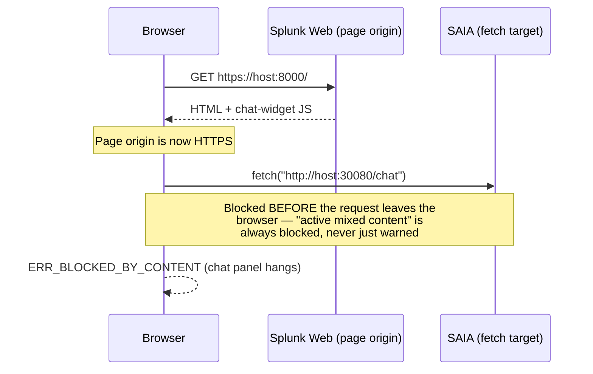
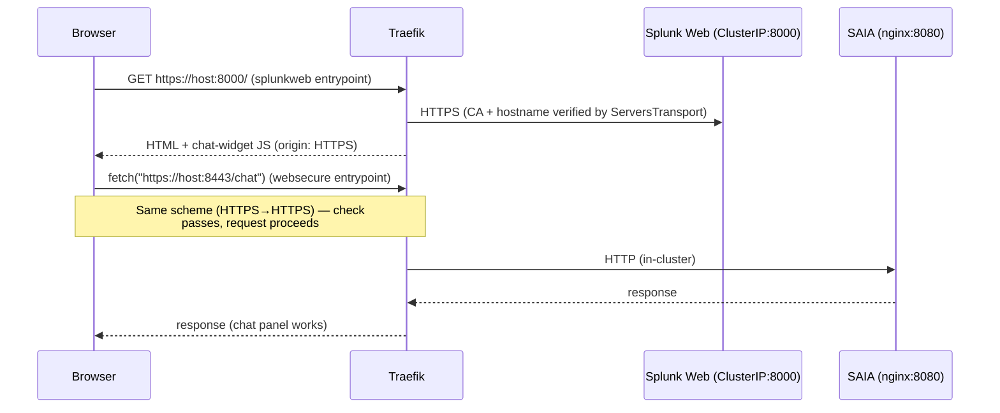
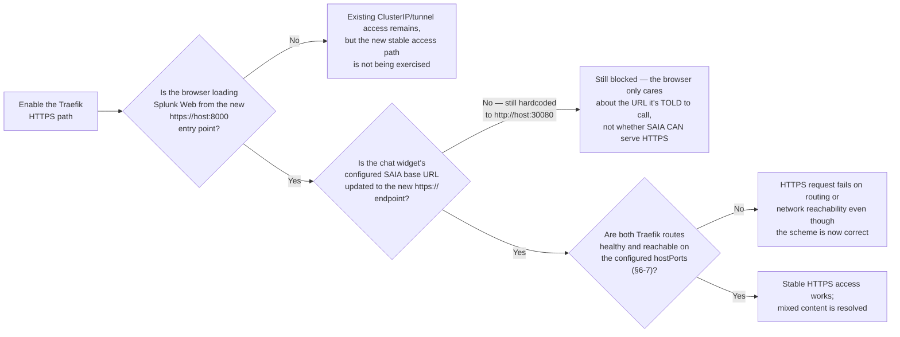
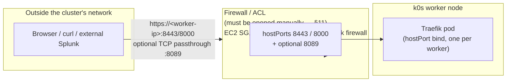
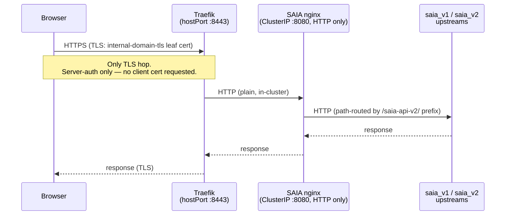

# Traefik HTTPS Ingress — Architecture Design

**Status:** Implementation contract for the supported first release

**Target:** k0s (1 controller, 1 CPU worker, 2 GPU workers, 1 installer/jump node) — on any
infrastructure: cloud VM, bare metal, or on-prem. Cloud-specific notes (e.g. EC2) are called out
explicitly where the underlying mechanism differs; everything else in this design is
infrastructure-agnostic.

**Namespace:** the configured AI namespace (`ai-platform` in examples) for services/routes and
`ingress` for the Traefik workload

**Installer:** `k0s_cluster_with_stack.sh` + `k0s-cluster-config.yaml`

---

## Table of Contents

- [1. Problem Statement](#1-problem-statement)
- [1a. Requirements](#1a-requirements)
- [2. How the Existing YAML Files Fit In](#2-how-the-existing-yaml-files-fit-in)
- [3. FIPS / GODEBUG Behavior](#3-fips--godebug-behavior)
- [4. Architecture Decision: Raw Manifests vs Helm](#4-architecture-decision-raw-manifests-vs-helm)
- [5. TLS Certificate Strategy](#5-tls-certificate-strategy)
- [5a. TLS/mTLS Topology and External Exposure](#5a-tlsmtls-topology-and-external-exposure)
- [6. Entry Point Design](#6-entry-point-design)
- [7. IngressRoute Design](#7-ingressroute-design)
- [8. Adaptations from the Reference Files](#8-adaptations-from-the-reference-files)
- [9. Installer-Owned and Consumed Resources](#9-installer-owned-and-consumed-resources)
- [10. Installer Changes](#10-installer-changes)
- [11. What the End User Must Provide](#11-what-the-end-user-must-provide)
- [12. Access Pattern After Deployment](#12-access-pattern-after-deployment)
- [13. Resolved Reference-Manifest Issues](#13-resolved-reference-manifest-issues)
- [14. Migration Path](#14-migration-path)

---

## 1. Problem Statement

Without optional Traefik ingress, there is no stable worker-host HTTPS endpoint shared by Splunk
Web and SAIA:

- Splunk Web (`splunk-splunk-standalone-standalone-service:8000`) — cert-manager-backed HTTPS,
  but ClusterIP-only and normally reached through a port-forward/tunnel
- SAIA (`k0s-ai-platform-ai-platform-saia-saia-service`) — plain HTTP on NodePort 30080 in the
  example configuration

This causes three concrete failures today:

**1. Browser mixed-content blocking.** When the browser loads the installer-configured Splunk Web
over HTTPS, it refuses the `http://…:30080` XHR/fetch/EventSource calls the AI Assistant makes to
SAIA. The chat panel shows a permanent spinner. Mixed-content is enforced by the browser and
cannot be worked around server-side.

**2. Fragile SSH tunnel dependency.** Access today requires:
- A `kubectl port-forward` on the installer node (dies silently)
- Two SSH tunnels open simultaneously in separate terminals
- SAIA URL changes to `localhost:30080` every session

**3. External Splunk JWT trust.** External Splunk instances need a stable, TLS-terminated URL whose
generated CA they explicitly trust to validate JWTs against SAIA's signing endpoint — not a
NodePort on a private IP.

### End state

Traefik v3 runs as a DaemonSet with hostPorts on the k0s workers. It terminates TLS and routes to in-cluster services. After deployment:

- Splunk Web → `https://<host>:8000` (TLS terminated at Traefik)
- SAIA → `https://<host>:8443` (same HTTPS scheme → no mixed-content)
- A cert-manager-generated self-signed CA and leaf certificate (the only supported TLS mode)
- Verified HTTPS from Traefik to Splunk Web; plain in-cluster HTTP only for SAIA
- SSH tunnels replaced by direct HTTPS or a single stable jump-host tunnel

The Splunk Web and management listeners above apply only when the installer manages internal
Splunk. External or disabled Splunk mode publishes the SAIA listener only and omits hostPorts 8000
and 8089 because there is no in-cluster Splunk Service to route to.

## 1a. Requirements

- **Optional.** Traefik setup is gated behind `ingress.enabled` (default `false`). A fresh install
  that never enables it gets no Traefik namespace, DaemonSet, CRDs, or ingress certificate chain.
  Disabling a previously enabled installation removes installer-owned resources but deliberately
  retains the shared cluster-scoped CRDs (§14). This is additive to the existing NodePort/tunnel
  access path. Disable reconciliation must use the same `kubernetes.namespace` used when ingress
  was enabled; it does not search other namespaces or adopt unlabelled common-name objects.
- **Platform compatibility baseline.** The current installer pins `k0s v1.33.13+k0s.1`
  (Kubernetes 1.33.13) with cert-manager `v1.21.1`. Its cert-manager gate accepts Kubernetes
  1.33–1.36, but an explicit 1.34–1.36 override still requires independent validation of the
  Splunk Operator and the rest of the platform. It reuses an existing cert-manager only when its
  controller, webhook, and cainjector images are all exactly `v1.21.1`. A different version must
  be upgraded through every intermediate cert-manager minor using its existing owner and upstream
  procedure. Before a fresh install, the supplied manifest is parsed and all three image versions
  are checked without mutating the cluster; any canonical leftover CRD, webhook, RBAC, Service, or
  workload blocks adoption. The admin workstation must resolve
  `#!/usr/bin/env bash` to Bash 4 or newer (Homebrew Bash before `/bin` in `PATH` on macOS).
- **In-cluster service routing.** When enabled, Traefik must provide a working route from its
  external-facing hostPorts to each in-cluster service it fronts — SAIA
  (`…-saia-saia-service:8080`), Splunk Web (`…-standalone-service:8000` over verified HTTPS),
  and, only when explicitly enabled, Splunk mgmt (`…-standalone-service:8089`, TCP passthrough)
  — using `IngressRoute`/`IngressRouteTCP`
  objects that resolve those ClusterIP/NodePort services by their in-cluster DNS names (§7).
  The routes and backends live together in `ai-platform`, so cross-namespace references are not
  required. Traefik still needs read-only RBAC for every informer it starts and `dnsPolicy:
  ClusterFirst` so it can resolve in-cluster DNS (§8).

### 1.1 Why fronting SAIA with TLS actually fixes mixed-content blocking

The browser's mixed-content check is purely about **scheme match between the page origin and
the fetch target** — it has nothing to do with whether SAIA itself supports TLS in the
abstract, and the check happens client-side, before any request leaves the browser:



Once Traefik terminates TLS for **both** Splunk Web and SAIA at the cluster edge, the browser
sees HTTPS→HTTPS on both legs and the check passes. Traefik validates Splunk Web's HTTPS backend
certificate; the SAIA backend remains HTTP inside the cluster. The browser does not inspect
either backend hop:



**The complete stable Traefik access pattern depends on three conditions:**



1. **Load Splunk Web through Traefik's HTTPS entry point** (§6's `splunkweb` entry point,
   `:8000`). The underlying Splunk service already uses HTTPS; the new entry point supplies the
   stable worker-host address and the separately generated ingress certificate clients trust.
2. **The chat widget's SAIA base URL must be updated to point at the new `https://<host>:8443`
   endpoint** (§7's `saia-ingressroute.yaml`). TLS capability on SAIA's side is necessary but
   not sufficient — if the widget config still resolves to `http://<node>:30080`, the browser
   is still instructed to make an HTTP call and still blocks it. This is a config/wiring change
   that must ship alongside the IngressRoute, not an automatic side effect of it.
3. **Both Traefik routes must be healthy and reachable.** This design is explicitly **additive**
   (§14 Migration Path), so the old ClusterIP/tunnel path and SAIA HTTP NodePort can remain during
   transition. A widget still pointed at the old `http://` SAIA URL will continue to hit the
   mixed-content wall even though the new HTTPS route exists.

The browser's mixed-content decision itself depends on the page and request schemes; route health
is the separate connectivity condition required for the complete access pattern.

**Related but separate check — not fixed by this at all:** Splunk Web (`:8000`) and SAIA
(`:8443`) are different origins even once both are HTTPS (different ports), so cross-origin
`fetch` calls still require CORS headers from SAIA. This isn't a *new* requirement introduced
by this design — SAIA and Splunk Web are already on different ports today, so if CORS is
already handled now, it stays handled. Mixed-content (scheme) and CORS (origin) are
independent browser checks; fixing one doesn't touch the other.

---

## 2. How the Existing YAML Files Fit In

These files come from an existing **Splunk Cloud internal production deployment** — a multi-component Splunk cluster with cluster manager, license manager, SHC, indexers, etc. They are the sanctioned Splunk production pattern for Traefik and are the correct reference. However, they encode components the AI Platform does not have. Treat them as a template to prune, not a drop-in.

The original reference files were generated together and distributed as a **compressed archive**,
with `ingress.yaml` as the centrepiece (DaemonSet + entry points + FIPS control). The current
installer does not deploy that file: it vendors only the complete CRD set and namespaced RBAC
template, then renders the DaemonSet and routes inline. References to the other filenames below
describe the historical input and the adaptations carried into the implementation.

| File | What it is | Reusable? | Action needed |
|---|---|---|---|
| `ingress.yaml` | Historical Traefik DaemonSet + entry-point/hostPort definitions + RBAC + image. **Contains the `GODEBUG` FIPS control env var (see §3).** | Pattern only | Carry the pruned entry points, corrected `dnsPolicy`, image override, and `GODEBUG` setting into the installer's inline DaemonSet; do not deploy the original file |
| `traefik-crds.yaml` | Complete CRD set vendored from the exact Traefik v3.6.25 release | Yes | Keep all ten CRDs together; an apparently unused missing type prevents the provider's informer caches from synchronizing |
| `traefik-rbac.yaml` | ServiceAccount + namespaced, read-only RBAC for the Kubernetes CRD provider | Yes | Render its AI namespace placeholder and use it as the **single** RBAC source; remove duplicate embedded RBAC |
| `splunk_ingress.yaml` | Port-based IngressRoutes for cm/lm/mc/shc/s1/s2s; an insecure legacy backend transport; references `internal-domain-tls`; namespace `splunk` | Pattern only | **Drop** cm/lm/mc/shc/s2s routes. Keep s1/standalone pattern. Change ns → `ai-platform`, update service names, align TLS secret, and replace the transport with the verified §7 design |
| `splunk_ingress_named.yaml` | Host-based routes via `HostRegexp` (e.g. `manager.*`, `s1.*`) | Optional | Only if user has DNS names per service. Can be provided as a DNS-mode alternative |
| `monitoring.yaml` | IngressRoutes for Prometheus (:9090) and Perses (:3000) | Not in first release | Do not apply; metrics exposure needs a separate access-control and cross-namespace design |
| `s3-upload-ingressroute.yaml` | IngressRoute for Ceph RGW (in-cluster S3) in namespace `rook-ceph` | **Drop** | AI Platform uses **external** object store. No `rook-ceph` deployed. Remove entirely |

---

## 3. FIPS / GODEBUG Behavior

The historical `ingress.yaml` DaemonSet contained this environment variable; the current installer
renders the equivalent value into its inline DaemonSet:

```yaml
env:
- name: GODEBUG
  value: fips140=off
```

This is a Go runtime control, but it is **not by itself a compliance claim**. In the source manifest
(the internal Splunk Cloud deployment these files came from, §2), the Traefik image is a legacy
internal `docker.repo.splunkdev.net/splcore/contrib/traefik` build. **This installer does
not ship that image by default** — see the "Image sourcing" note below.
The selected image must be built with an appropriate Go Cryptographic Module and validated for the
target operating environment; a runtime flag cannot make an arbitrary image FedRAMP/FIPS compliant.

| Value | Behaviour |
|---|---|
| `fips140=off` | FIPS mode disabled. This is the normal default |
| `fips140=on` | Enable Go's FIPS 140-3 mode. Use only with a suitably built and validated image |

The installer accepts only `off` and `on`. It must reject `only`; Go documents that setting as an
assessment/debug aid rather than the normal production mode.

### Decision for the AI Platform installer

Expose this as a config knob (`ingress.fips` in `k0s-cluster-config.yaml`) with `off` as the default:

```yaml
ingress:
  fips: "off"    # off | on — controls GODEBUG=fips140= in Traefik
```

The installer renders this value into its inline DaemonSet YAML at deploy time. A standard
deployment gets `fips140=off`. A FIPS-scoped deployment may set `fips: "on"`, but must also supply
an image built with the approved Go module and complete its own operating-environment/compliance
validation. The installer cannot inspect attestations or prove that an arbitrary override is
FIPS-capable. Go recommends selecting the module at build time with `GOFIPS140`;
`GODEBUG=fips140=only` is an assessment/debug aid and must not be offered as the production setting.

> **Backend TLS note:** cipher suites are negotiated by TLS peers; a certificate does not
> "present a cipher." With `fips140=on`, Traefik's HTTPS connection to Splunk Web succeeds only if
> both peers negotiate an allowed protocol, cipher, signature algorithm, and key exchange. Configure
> that hop with `scheme: https` plus a CA-validating `ServersTransport` (§7). `ServersTransport`
> has no passthrough mode. TCP passthrough is a separate TCP-router choice that shifts certificate
> validation and TLS-policy enforcement to the client; it does not repair an incompatible HTTP
> backend or establish compliance by itself. See the official Go FIPS guidance:
> <https://go.dev/doc/security/fips140>.

### Image sourcing

The source manifests used a Splunk-internal Artifactory image that standalone customers cannot
pull. The installer instead follows the repository's normal public-image/override pattern:

- All images default to **public registries** (`docker.io/splunk/...`,
  `quay.io/kuberay/operator`, `docker.io/semitechnologies/weaviate`, etc.) under the
  `images:` block in `k0s-cluster-config.yaml` (see `images.operator.image`,
  `images.saia.apiImage`, ...).
- The Traefik pull reference is explicit at `images.ingress.traefikImage`. Customers using a
  mirror set that key to the exact mirrored tag or digest; the generic `images.registry` prefix
  is not applied to this image.
- Airgap bundling (`prepare_airgap_bundle.sh --config <install-config>`) reads the configured
  ingress image when `ingress.enabled: true` and adds the exact reference to both
  `container-images.txt` and the add-on image tar.

**Resolution — match the existing pattern instead of introducing a new one:**

1. **Default to the public upstream image**, consistent with every other component. Pin the
   verified multi-architecture index rather than a mutable tag:
   `docker.io/library/traefik:v3.6.25@sha256:31267173a15b4944e797a76ffd9c419707c8d8b32fe5b610f80cd0cfa05f372d`.
   This is reachable by any
   customer with normal internet access. Mirror users override the same key with the exact
   mirrored reference (§10).
2. **Treat a validated FIPS build as an explicit, opt-in override**, not the default:
   customers who set `ingress.fips: "on"` must also set
   `images.ingress.traefikImage` themselves to an image they can actually pull — either
   Splunk's internal registry (if this is a Splunk-managed/Splunk Cloud deployment with that
   network access) or their own mirror of an appropriately built and validated Traefik image. Document this
   requirement next to the `fips` knob rather than assuming a default value nobody but
   Splunk-internal deployments can reach.
3. **Build airgap bundles from the install config:** passing `--config` makes the bundler append
   the resolved `images.ingress.traefikImage` to `container-images.txt` and to `ADDON_LIST`, so
   `k0s airgap bundle-artifacts` stages it. A bundle built without the config does not infer that
   ingress will later be enabled.

This changes §10's config block and §11's table below — see the corrected versions in each.

---

## 4. Architecture Decision: Raw Manifests vs Helm

**Decision: Raw Kubernetes YAML (vendored CRD/RBAC files plus inline rendered workload/routes). No upstream Traefik Helm chart.**

### Why not Helm

The upstream `traefik/traefik` Helm chart defaults to a `Deployment` + `Service` (NodePort/LoadBalancer), which reintroduces the very problem we are solving. Reconfiguring it to match the DaemonSet + hostPort model used by the provided files would require extensive values overrides that end up more complex than the raw manifests. MetalLB does not work on AWS VPCs (documented in `k0s-cluster-config.yaml` lines 205-212) because AWS's software-defined networking blocks the L2 ARP/BGP announcements MetalLB relies on — so on AWS, the chart's LoadBalancer default is a dead end. **On bare metal/on-prem with a normal L2 network, MetalLB has no such restriction** and is a legitimate alternative to the hostPort DaemonSet model (see §5a.1) — noted here for completeness, but not adopted as the default so the design stays identical across all target infrastructures.

### Why raw manifests

- The reference files establish the sanctioned DaemonSet + hostPort pattern, entry-point names, and
  FIPS environment control. Wrapping those concepts in Helm values would only obscure them.
- The installer already applies raw Kubernetes YAML. For Traefik it renders the workload and routes
  inline and applies the vendored CRD/RBAC files directly, which avoids a separate chart lifecycle.
- Airgap compatibility: every URL in the installer is overridable for airgap. Raw manifests + a pinned internal image slot directly into the airgap bundle without a separate chart-resolution step.

**When to reconsider:** if Traefik config later grows many tunable knobs, wrap the pruned manifests in a thin local Helm chart under `tools/cluster_setup/helm-charts/traefik/` — this adds upgrade ergonomics without losing the hostPort DaemonSet model.

---

## 5. TLS Certificate Strategy

The supported first release has one certificate strategy: cert-manager creates a self-signed CA
and issues the ingress leaf from it. ACME and user-provided certificate modes are not implemented
and must not be advertised as accepted config values. cert-manager is already installed by the
platform installer.

### cert-manager self-signed CA

Create a namespaced self-signed `Issuer` → CA `Certificate`/`Issuer` → leaf `Certificate` producing
the `internal-domain-tls` Secret in the `ai-platform` namespace. Traefik resolves
`spec.tls.secretName` in the `IngressRoute` namespace, not in the namespace where the Traefik pod
runs. Because the SAIA and Splunk Web routes below live in `ai-platform`, their TLS Secret must live
there too; `allowCrossNamespace` cannot change this rule because `tls.secretName` has no namespace
field.

```yaml
apiVersion: cert-manager.io/v1
kind: Issuer
metadata:
  name: ingress-selfsigned
  namespace: ai-platform
spec:
  selfSigned: {}
---
apiVersion: cert-manager.io/v1
kind: Certificate
metadata:
  name: ingress-ca
  namespace: ai-platform
spec:
  isCA: true
  commonName: ai-platform-ingress-ca
  secretName: ai-platform-ingress-ca-tls
  duration: 87600h       # 10-year trust anchor
  renewBefore: 8760h     # renew one year before expiry
  privateKey:
    algorithm: ECDSA
    size: 256
    rotationPolicy: Never
  issuerRef:
    name: ingress-selfsigned
    kind: Issuer
---
apiVersion: cert-manager.io/v1
kind: Issuer
metadata:
  name: ingress-ca-issuer
  namespace: ai-platform
spec:
  ca:
    secretName: ai-platform-ingress-ca-tls
---
apiVersion: cert-manager.io/v1
kind: Certificate
metadata:
  name: internal-domain-tls
  namespace: ai-platform
spec:
  secretName: internal-domain-tls    # name Traefik IngressRoutes reference
  duration: 2160h                    # 90-day leaf
  renewBefore: 720h                  # renew 30 days before expiry
  privateKey:
    algorithm: RSA
    size: 2048
    rotationPolicy: Always
  issuerRef:
    name: ingress-ca-issuer
    kind: Issuer
  dnsNames:
    - ai.example.internal            # optional, user-supplied
  ipAddresses:
    - 203.0.113.10                   # EVERY worker IP, not just one — see note below
    - 203.0.113.11
    - 203.0.113.12
```

- **User provides:** nothing beyond the optional hostname and the installer-managed ingress-node
  IP inventory. The supported single-node topology includes its worker-enabled controller.
- **Pros:** zero external dependency, works airgapped, works with bare IP SANs
- **Cons:** browser shows "not trusted" until the user imports the CA certificate into the client
  trust store. Any external Splunk client that calls these endpoints must trust the same CA while
  keeping server-certificate and hostname verification enabled.

> **Important — SAN list must cover every worker, not just one.** Traefik runs as a DaemonSet
> (§4), so there is one independent Traefik pod per worker node, each bound via `hostPort` to
> that node's own IP (§5a.1 has the full explanation). The leaf `Certificate` above is a single
> object watched through the Kubernetes CRD provider and used by every Traefik instance — it is not
> a pod-local mount. Its `ipAddresses` SAN list must therefore include **all** ingress-node IPs
> returned by the installer's `ingress_node_ips_k0s` helper, not a single representative
> IP as earlier examples in this doc implied. If a client hits a worker IP that's missing from
> the SAN list, TLS
> validation fails with a hostname/IP mismatch even though that worker's Traefik pod is healthy
> and serving correctly. The current installer populates this list at apply-time from
> `ingress_node_ips_k0s`, the same worker-IP source the rest of the script uses.

The installer waits for the leaf `Certificate` to report Ready for its current generation and
treats timeout as a failed install. Label-verified disable cleanup removes the installer-owned
Certificates, Issuers, CA and leaf Secrets; re-enable therefore generates a new CA and requires
client re-import. Traefik watches the frontend leaf Secret and reloads renewed leaf material, but
client trust stores are outside Kubernetes: during long-lived operation cert-manager renews the
ingress CA before expiry, so operators must redistribute the current public CA before the old trust
anchor expires. This frontend trust-anchor lifecycle is separate from the Splunk backend CA
snapshot described in §7. The cluster-scoped Traefik CRDs are retained because they may be shared.

---

## 5a. TLS/mTLS Topology and External Exposure

This section makes explicit what is TLS-terminated where, what is (and is **not**) mutual TLS
today, and how traffic actually reaches the cluster from outside. All diagrams assume the
self-signed CA described in §5.

### 5a.1 External exposure — no cloud LoadBalancer involved

Traefik is a **hostPort DaemonSet**, not a `Service: LoadBalancer`. It binds ports directly on
each worker's host network interface. There is no cloud-native ingress/ELB in this design —
reachability from outside the cluster's network depends entirely on a firewall/ACL being opened
for those hostPorts (§11, customer-owned action), whatever form that takes on the target
infrastructure:

| Infrastructure | What "open the ports" means |
|---|---|
| AWS (EC2) | EC2 security-group ingress rule on the worker instances/ENIs |
| Other cloud VMs (GCP, Azure, etc.) | Equivalent cloud firewall rule (GCP firewall rule, Azure NSG, etc.) |
| Bare metal / on-prem | Host firewall on each worker (`iptables`/`nftables`/`firewalld`/`ufw`) + any network/switch ACL or perimeter firewall between the client and the worker's network segment |



Two supported access patterns (§12 has the full detail), neither of which is cloud-specific:
- **Workers directly reachable** (routable IP on the client's network + firewall rule open) →
  hit `https://<worker-ip>:<port>` directly. Applies equally to an EC2 instance with a public/
  VPC-routable IP or a bare-metal box on a reachable LAN/VLAN.
- **Workers stay on a private network segment** → a single stable SSH tunnel to a jump host,
  forwarding to the worker's hostPorts — no `kubectl port-forward` needed since the ports are
  stable on the host, not ephemeral pod IPs. This is the same pattern whether the jump host is
  an EC2 instance or a bare-metal/on-prem gateway box.

**Multi-worker access (DaemonSet caveat, infrastructure-agnostic):** because each worker
independently binds the hostPorts, a client must either target one worker IP directly (simplest,
no HA) or something must load-balance across workers. On AWS this is normally left unaddressed
in this design (no ELB is used — see §4). On bare metal/on-prem, **MetalLB is a viable option**
(§4) since it isn't blocked the way it is on AWS VPCs; alternatively, an existing hardware/
software load balancer the customer already operates (F5, HAProxy, keepalived+VIP, etc.) can
front the worker IPs. This decision is out of scope for the default design and left as a
customer/operator choice either way.

**"Which worker IP does the Traefik controller use?"** There is no single controller with one
IP — the DaemonSet means **every** worker (in the reference topology: 1 CPU + 2 GPU = 3 nodes)
runs its own independent Traefik pod, bound via `hostPort` to that node's own IP. Hitting
`https://<cpu-worker-ip>:8443` and `https://<gpu-worker-1-ip>:8443` reaches two *different* pods
— there is no routing between them absent a load balancer (above). This is why §5's leaf
`Certificate` SAN list must include every worker IP, not just one: whichever IP a client picks,
that worker's Traefik pod must present a cert that's valid for the IP the client actually dialed.

**Which URL to give the SAIA app / onboarding wizard (`saia_endpoint`/`saia_sok_url` in
`splunkaiassistant.conf`):** because the IngressRoute's backend (`…-saia-saia-service`, §7) is a
cluster-addressable Kubernetes `Service`, Kubernetes' pod network already routes cross-node — a Traefik pod on
worker A can reach a SAIA nginx pod scheduled on worker B via the CNI overlay. **This means any
one worker's IP works identically for reaching SAIA — it does not need to be the worker SAIA's
own pod happens to be running on.** Recommended value: `https://<any-one-worker-ip>:8443`,
picking whichever worker IP is simplest for the deployment (any address in the leaf cert's SAN
list works, since all of them now share that requirement above). If `ingress.hostname` is
configured and resolves via DNS to a worker IP, prefer `https://<hostname>:8443` instead — it
survives that worker being replaced without requiring a config update, as long as the DNS record
is repointed and the new IP is (still) in the cert's SAN list.

### 5a.2 Case 1 — Plain TLS (nginx mTLS disabled; today's default)

Traefik terminates the **only** TLS hop in the path. Everything from Traefik inward — to nginx,
and nginx's own proxy to the SAIA v1/v2 upstreams — is plain HTTP inside the cluster network.
This is one-way TLS: the client validates Traefik's cert; nothing validates a client cert at any
hop.



### 5a.3 Case 2 — nginx TLS enabled (`AIService.spec.mtls.enabled: true`) — still NOT mutual TLS

Despite the field being named `mtls`, nginx today only adds a second **server-auth-only** TLS
listener on :8443 (`ssl_certificate` / `ssl_certificate_key` — `impl.go:1560-1567`). There is no
`ssl_verify_client` directive anywhere in the codebase, so nginx never requests or validates a
client certificate. If Traefik is pointed at this port, the hop becomes TLS instead of plain
HTTP, but it is **one-way TLS twice in a row**, not end-to-end mutual TLS.

```mermaid
sequenceDiagram
    participant Browser
    participant Traefik as Traefik<br/>(hostPort :8443)
    participant Nginx as SAIA nginx<br/>(ClusterIP :8443, TLS)
    participant V1V2 as saia_v1 / saia_v2<br/>upstreams

    Browser->>Traefik: HTTPS (TLS: internal-domain-tls leaf cert)
    Note over Browser,Traefik: Hop 1 — server-auth only
    Traefik->>Nginx: HTTPS (TLS: nginx's own mtls.secretName cert)
    Note over Traefik,Nginx: Hop 2 — ALSO server-auth only.<br/>Traefik never presents a client cert;<br/>nginx never asks for one.<br/>Requires a Traefik ServersTransport<br/>trusting nginx's cert (or its CA).
    Nginx->>V1V2: HTTP (plain, unchanged)
    V1V2-->>Nginx: response
    Nginx-->>Traefik: response (TLS)
    Traefik-->>Browser: response (TLS)
```

**To make this a trusted hop (not "not verified"/skip-verify):** issue nginx's cert from the
same `ingress-ca-issuer` used by §5 (both resources now live in `ai-platform`), point
`AIService.spec.mtls.issuerRef` at it, and configure a Traefik `ServersTransport` in
`ai-platform` with `rootCAs: [{configMap: ingress-ca-public}]` and the correct `serverName`. Publish
only `ca.crt` into that ConfigMap; do not configure a transport reference to the CA
Secret/private key. In
Traefik v3.6, each `rootCAs` entry is an object containing `secret` or `configMap`; the referenced
object must expose the CA under `ca.crt` or `tls.ca`.
This still is not mTLS — it only makes hop 2 verifiable instead of blindly trusted.

**True mTLS (nginx demanding and validating a client cert from Traefik) does not exist today**
and is out of scope for this plan — it would require adding `ssl_verify_client on;` +
`ssl_client_certificate` to the nginx config template in `impl.go`, a code change to the SAIA
feature itself, not something the installer/cert-manager plumbing alone can add.

### 5a.4 Recommendation for this plan

Default to **Case 1** (Traefik → nginx:8080, plain HTTP) regardless of whether SAIA's own
`mtls.enabled` flag is set. Splunk Web is deliberately different: its backend is HTTPS and is
verified by the §7 `ServersTransport`. Keeping SAIA on its established HTTP service avoids
coordinating two independently-owned toggles (`ingress.enabled` for Traefik, `mtls.enabled` on
`AIService`). Document Case 2 as a future enhancement rather than building the additional issuer,
CA-publication, and `ServersTransport` wiring now, since it adds complexity without adding real
mutual authentication.

---

## 6. Entry Point Design

The reference `ingress.yaml` defines 11 entry points for a full Splunk cluster. The AI Platform
always needs SAIA; internal Splunk mode adds Splunk Web and can opt into a third management
listener. Bind only what is needed: every hostPort must be free on every worker and allowed by the
applicable cloud/host/network firewall.

| Entry point name | Traefik port | hostPort | Backend | Purpose |
|---|---|---|---|---|
| `websecure` | 8443 | 8443 | `saia-saia-service:8080` | SAIA API HTTPS — **fixes mixed-content** |
| `splunkweb` | 8000 | 8000 | `splunk-…-standalone-service:8000` | Splunk Web HTTPS; internal Splunk mode only |
| `splunkmgmt` (default off) | 8089 | 8089 | `splunk-…-standalone-service:8089` | Optional Splunk mgmt API (TCP passthrough) |

**Remove from AI Platform** (not deployed): `cm`, `lm`, `mc`, `shc1-deployer`, `named-api`, `perses`, `s3`, `s2s`.

**Why hostPort and not another NodePort Service:** the DaemonSet + hostPort model means
`https://<any-worker-ip>:8443` works directly. Existing NodePort exposure remains additive until an
operator retires it; the installer does not silently rewrite or remove that Service configuration.

There is **no cleartext HTTP entry point** in the supported scope, so the installer must not
create an HTTP-to-HTTPS redirect middleware. A redirect becomes meaningful only if a separate
HTTP listener and route are deliberately added later.

**Splunk mgmt (:8089, default disabled):** Splunk's management port is already HTTPS internally.
Only when `entryPoints.splunkMgmt.enabled: true`, bind the entry point/hostPort and create an
`IngressRouteTCP` with `tls.passthrough: true` rather than terminating at Traefik. This preserves
Splunk's own certificate end-to-end, which also means the client—not Traefik—validates that
certificate. When this entry point is enabled, `provision_splunk_cert()` adds
`ingress.hostname` and every advertised worker IP to the `ai-splunk-server` leaf SANs. The current
service-DNS/localhost-only SAN set is insufficient for `https://<worker-ip>:8089`.

---

## 7. IngressRoute Design

### SAIA — the critical route

```yaml
apiVersion: traefik.io/v1alpha1
kind: IngressRoute
metadata:
  name: saia-websecure
  namespace: ai-platform
spec:
  entryPoints: [websecure]       # :8443
  routes:
    - match: PathPrefix(`/`)
      kind: Rule
      services:
        - name: k0s-ai-platform-ai-platform-saia-saia-service
          port: 8080             # the nginx reverse proxy (routes v1/v2 internally)
  tls:
    secretName: internal-domain-tls
```

Route to `saia-service` only — **not** to `saia-v1-service` or `saia-v2-service` directly. The SAIA nginx already splits v1/v2 by path. Bypassing it would break the operator-managed routing.

### Splunk Web

```yaml
apiVersion: traefik.io/v1alpha1
kind: ServersTransport
metadata:
  name: splunk-web-tls
  namespace: ai-platform
spec:
  # Must exactly match a DNS SAN on the installer-issued Splunk leaf.
  serverName: splunk-splunk-standalone-standalone-service.ai-platform.svc.${CLUSTER_DOMAIN}
  # The installer copies only ca.crt from ai-splunk-server-tls into this ConfigMap.
  # The transport never directly references the private-key-bearing Secret.
  rootCAs:
    - configMap: ai-splunk-ca-public
---
apiVersion: traefik.io/v1alpha1
kind: IngressRoute
metadata:
  name: splunkweb-splunkweb
  namespace: ai-platform
spec:
  entryPoints: [splunkweb]       # :8000
  routes:
    - match: PathPrefix(`/`)
      kind: Rule
      services:
        - name: splunk-splunk-standalone-standalone-service
          port: 8000
          # Splunk Web has enableSplunkWebSSL=true. Its Kubernetes port remains
          # named http-splunkweb, so Traefik will otherwise infer plain HTTP.
          scheme: https
          serversTransport: splunk-web-tls
  tls:
    secretName: internal-domain-tls
```

The CA-only ConfigMap removes the private-key-bearing Secret from the backend transport
configuration. It is not a Kubernetes RBAC isolation boundary: Traefik's CRD provider must
list/watch Secrets in its watched namespace to serve route certificates, and Kubernetes RBAC
cannot restrict `list`/`watch` by `resourceNames`. Treat the controller ServiceAccount as trusted
within the configured AI namespace (`ai-platform` in these examples); stronger Secret isolation
would require a separate routing namespace and a different cross-namespace backend design.

`ai-splunk-ca-public` is a snapshot, not a projection or controller-managed mirror. The installer
copies `ca.crt` from `Secret/ai-splunk-server-tls` only when the installer runs; a cert-manager
renewal does not refresh the ConfigMap by itself. Splunk also uses an `OnDelete` StatefulSet and
does not hot-reload its renewed certificate files. After `Certificate/ai-splunk-server` or its CA
renews, re-run the full installer with the original AI namespace. That run fingerprints the current
Splunk leaf, explicitly recycles the singleton Splunk pod when the leaf changed, waits for its
replacement, and refreshes the CA-only ConfigMap before reconciling Traefik. A Secret update alone
is not the end of this rotation workflow.

Do not replace this transport with `insecureSkipVerify: true`: that would encrypt the hop while
discarding both chain and hostname authentication.

The underlying Splunk TLS setup uses only cert-manager's standard `tls.crt`, `tls.key`, and
`ca.crt` Secret entries. Its Splunk-Ansible pre-task builds `server.pem` in
certificate-then-private-key order on a pod-private memory volume. It deliberately does not use
`additionalOutputFormats: CombinedPEM`, so no alpha cert-manager feature gate is part of this
design.

### Default frontend certificate (`TLSStore`)

TLS certificate selection occurs before HTTP routing. Some clients connecting to a raw IP omit
SNI; without a default store certificate Traefik presents its generated internal certificate
instead of `internal-domain-tls`. Install the special `default` store alongside the routes:

```yaml
apiVersion: traefik.io/v1alpha1
kind: TLSStore
metadata:
  name: default
  namespace: ai-platform
spec:
  defaultCertificate:
    secretName: internal-domain-tls
```

### Splunk mgmt — TCP passthrough

```yaml
apiVersion: traefik.io/v1alpha1
kind: IngressRouteTCP
metadata:
  name: splunkmgmt-passthrough
  namespace: ai-platform
spec:
  entryPoints: [splunkmgmt]      # :8089
  routes:
    - match: HostSNI(`*`)
      services:
        - name: splunk-splunk-standalone-standalone-service
          port: 8089
  tls:
    passthrough: true            # preserves Splunk's own cert end-to-end
```

`internal-domain-tls` is not presented on this route. Before enabling `splunkmgmt`, verify that the
Splunk leaf generated by `provision_splunk_cert()` includes every externally advertised worker IP
and `ingress.hostname`; otherwise conforming clients will reject the passthrough connection with a
hostname/SAN mismatch. If those SANs cannot be issued, leave this entry point disabled or redesign
it as explicit TLS termination plus verified re-encryption.

### HTTP redirects are out of scope

No HTTP listener is configured, so no redirect `Middleware` is created. Clients use the HTTPS
URLs directly. If an HTTP listener is introduced later, its redirect route and firewall exposure
must be designed and tested together rather than adding an unused middleware object.

### Weaviate — intentionally NOT exposed

Weaviate (`k0s-ai-platform-ai-platform-weaviate:80`) is internal-only. SAIA reaches it in-cluster over ClusterIP. No ingress route — adding one increases attack surface with zero benefit.

### Route summary

| Route | Entry point | Backend | TLS |
|---|---|---|---|
| SAIA API | `websecure` :8443 | `saia-service:8080` | Terminate (leaf cert) |
| Splunk Web | `splunkweb` :8000 | `standalone-service:8000` | Internal Splunk mode only; terminate and use verified HTTPS re-encryption via `splunk-web-tls` |
| Splunk mgmt (default off) | `splunkmgmt` :8089 | `standalone-service:8089` | TCP passthrough |

---

## 8. Adaptations from the Reference Files

The entries in this section are a regression checklist for how the historical reference archive was
adapted. The current installer renders the workload and routes inline; it does not expect these
per-route files to exist at runtime.

### Historical `ingress.yaml`

| # | Change | Reason |
|---|---|---|
| 1 | `dnsPolicy: ClusterFirst` (was `ClusterFirstWithHostNet`) | `hostNetwork: false` + `ClusterFirstWithHostNet` is wrong — Traefik can't resolve in-cluster DNS → all routes 502 |
| 2 | Remove the embedded `ClusterRole`/`ClusterRoleBinding` | Conflicts with `traefik-rbac.yaml` and grants broader access than the namespaced provider needs |
| 3 | Image: rendered from `images.ingress.traefikImage` (default v3.6.25 at the verified multi-arch digest in §3; override with an appropriately built and validated image when `ingress.fips: "on"`) | Replace the manifest's hardcoded Splunk-internal reference and prevent tag drift |
| 4 | Remove entry points: `cm`, `lm`, `mc`, `s2s`, `shc1-deployer`, `named-api`, `perses`, `s3` | Not deployed in AI Platform; unused hostPorts are a risk |
| 5 | Add `websecure(:8443)`; add `splunkweb(:8000)` in internal Splunk mode and `splunkmgmt(:8089)` only when explicitly enabled | Do not bind listeners that have no supported backend or are default-off |
| 6 | `GODEBUG` value: rendered from `ingress.fips` config key | `fips140=off` default; `fips140=on` only with a suitably built/validated image. Never use `only` as the production setting |
| 7 | Add `nodeSelector` | Pin Traefik to ingress-labelled workers, including the worker-enabled controller in supported single-node mode |

### `splunk_ingress.yaml`

| # | Change |
|---|---|
| 1 | `namespace: splunk` → `namespace: ai-platform` throughout |
| 2 | Delete routes for `cm`, `lm`, `mc`, `shc1`, `shc1-deployer`, `s2s` |
| 3 | Update service name: `splunk-s1-standalone-service` → `splunk-splunk-standalone-standalone-service` |
| 4 | Align entry-point names to the pruned set (`splunkweb`, `splunkmgmt`) |
| 5 | Confirm `tls.secretName: internal-domain-tls` matches what cert-manager creates (§5) |
| 6 | Set Splunk Web's backend `scheme: https` and attach the CA-validating `splunk-web-tls` `ServersTransport` (§7) |
| 7 | When the 8089 passthrough route is enabled, add the external hostname and all worker IPs to the Splunk leaf SANs |

### `splunk_ingress_named.yaml`

Same namespace + service name fixes as above. Provide as an **optional** DNS-mode alternative — only apply if the user has DNS names per service.

### `monitoring.yaml`

Do not apply it in the supported first release. Prometheus exposure is not an implemented entry
point and would require a separate security decision; the core routes need no cross-namespace
references, so `allowCrossNamespace` remains false.

### `s3-upload-ingressroute.yaml`

**Delete.** No `rook-ceph` in the AI Platform.

### `traefik-crds.yaml` / `traefik-rbac.yaml`

Vendor the complete definitions from the exact Traefik v3.6.25 release: `IngressRoute`,
`Middleware`, `MiddlewareTCP`, `IngressRouteTCP`, `IngressRouteUDP`, `TLSOption`,
`ServersTransport`, `ServersTransportTCP`, `TLSStore`, and `TraefikService`. The v3.6 CRD
provider starts informers for all ten types whether or not a route uses them; omitting an
"unused" CRD prevents cache synchronization and leaves every route unavailable. RBAC must also
cover the provider's Services, EndpointSlices, ConfigMaps, Secrets, and all ten Traefik resource
informers with read-only verbs. Set `namespaces: ${AI_NS}` and
`disableClusterScopeResources: true`; this deployment does not use IngressClass or NodePortLB, so
it does not need cluster-wide Node access.

---

## 9. Installer-Owned and Consumed Resources

The installer owns and reconciles these resources:

1. **cert-manager issuer chain + leaf Certificate** producing `internal-domain-tls` in the
   `ai-platform` namespace (§5 / §7), the same namespace as the referencing `IngressRoute`s.
   Traefik's own `ingress` namespace is irrelevant to `tls.secretName` lookup.

2. **SAIA `IngressRoute`** (`saia-websecure`, §7) — the single most important new object.

3. In internal Splunk mode, **Splunk Web `IngressRoute`** and, only when enabled, **Splunk mgmt
   `IngressRouteTCP`** (§7).

4. **`TLSStore/default`** in `ai-platform`, referencing `internal-domain-tls` for clients that do
   not send SNI (§7). No redirect Middleware is needed because there is no HTTP listener.

5. **Image pull secret in `ingress` namespace.** The installer creates enabled provider
   credentials there and attaches discovered credentials to the Traefik pod. A manually listed
   `imagePullSecrets.secrets[]` entry is copied from the AI namespace only when necessary, labelled
   as installer-owned, and reconciled from its source on later runs. Disable cleanup removes these
   labelled copies but retains pre-existing/unowned registry credentials in `ingress`; remove a
   retained credential explicitly only after confirming that no workload still consumes it.

6. **Customer firewall rules** opening hostPort 8443 from the client/VPN CIDR to the worker nodes,
   plus 8000 in internal Splunk mode and 8089 only when management ingress is enabled. These remain
   a documented customer prerequisite because the installer does not own external firewall policy.

7. In internal Splunk mode, **`ServersTransport: splunk-web-tls`** in `ai-platform`, with
   `serverName` matching the Splunk service-DNS SAN and
   `rootCAs: [{configMap: ai-splunk-ca-public}]`. The ConfigMap contains only
   the public `ca.crt` copied from `ai-splunk-server-tls`, never its private key, and is refreshed
   only on an installer run. Use it with explicit `scheme: https`; do not use
   `insecureSkipVerify`. Traefik's namespaced Role still permits `get/list/watch` on every Secret in
   the AI namespace because its CRD provider needs a Secret informer for route certificates.

---

## 10. Installer Changes

### `k0s_cluster_with_stack.sh`

Before `install_traefik_ingress()`, the install flow provisions the Splunk server Certificate. On
a rerun, `install_splunk_standalone()` compares the current leaf fingerprint with the value recorded
on the existing Standalone and explicitly recycles its `OnDelete` pod when that leaf changed.
`install_traefik_ingress()` then runs after cert-manager and the AI operator are available and before
the AIPlatform CR is applied. The current function performs these steps:

```
1. Create `ingress` and verify fixed-name objects are absent or carry both installer ownership labels.
2. Install all ten pinned v3.6.25 CRDs only when none exist. Accept an existing complete set only
   when server-side diff is empty; refuse partial/different shared schemas.
3. Wait for all ten CRDs to be Established.
4. Render `__AI_NAMESPACE__` in `traefik-rbac.yaml` and apply the namespaced Role/RoleBinding.
5. Refuse a legacy cluster-wide binding instead of deleting an unowned cluster-scoped object.
6. Resolve every configured ingress IP to a distinct Ready Node and reconcile the scheduling label
   to that exact set; then apply the issuer/CA/leaf chain and wait for Ready on the **current
   Certificate generation**.
7. In internal Splunk mode, refresh `ai-splunk-ca-public` from the current
   `ai-splunk-server-tls/ca.crt` snapshot.
8. Create/reconcile image pull credentials in `ingress`; configured manual Secrets are copied
   from the AI namespace with installer labels and refreshed on later runs.
9. Render and apply the inline DaemonSet with unique selector, security context, probes, and only
   the entry points enabled by current config/Splunk mode.
10. Wait for DaemonSet rollout, require desired/updated/Ready counts to equal the configured target
    count (a zero-target rollout is not success), and reject provider informer/RBAC errors.
11. Apply the supported routes; internal Splunk mode also gets the verified Splunk Web
    `ServersTransport`/route (`TLSStore/default` is applied with the ingress certificate chain).
12. When disabled, remove only label-verified installer resources and fail if deletion fails.
```

**SAIA service interaction.** Traefik reaches SAIA through its Kubernetes Service, but enabling
Traefik is deliberately additive: it does not rewrite an existing NodePort/LoadBalancer setting.
Configured hostPorts are rejected when they equal the retained SAIA/slim NodePorts. An explicit
feature list must contain `saia`; otherwise installation fails instead of creating a dangling
route.

**Airgap.** The manifest path is overridable with `TRAEFIK_MANIFEST_DIR`; the image is set through
`images.ingress.traefikImage` (there is no environment-variable image override).
Build the bundle with `prepare_airgap_bundle.sh --config <install-config>`; when that config enables
ingress, the script adds the resolved `images.ingress.traefikImage` to both
`container-images.txt` and the `ADDON_LIST` used for `k0s airgap bundle-artifacts`, and embeds the
CRD/RBAC manifests. The wrapper rejects version/config/image mismatches before installing bundled
binaries. A manually sourced `airgap-env.sh` exports the same verified metadata, and the main
installer enforces the same Traefik-image contract. Bundle construction requires a Linux/amd64
host because it executes k0s.

**Install output.** Traefik reconciliation prints the HTTPS URLs for the first ingress-capable
node (or `ingress.hostname`) when it is enabled.

**Gate on config key:**
```yaml
ingress:
  enabled: false   # set true to deploy Traefik HTTPS ingress
```
On a never-enabled cluster, `false` finds no ownership-labelled resources and leaves common-name
foreign objects untouched; an active fixed-name `DaemonSet/traefik` is reported as a blocking
collision rather than a successful disable. On a previously enabled cluster, it deletes only resources carrying
both installer labels; any delete error is fatal. Labelled pull-Secret copies are removed, while
shared cluster-scoped CRDs and pre-existing/unowned registry credentials are retained. Use the
original AI namespace when disabling: the installer does not
search a former namespace after `kubernetes.namespace` changes. A later re-enable creates a new CA,
so clients must import the replacement trust anchor.

Unlabelled objects created by an earlier prototype and foreign objects with common names are never
adopted or deleted automatically. An operator must inspect and remove confirmed legacy runtime/RBAC
objects explicitly. Likewise, existing complete cluster-scoped CRDs are only compared with the
pinned bundle; partial or different CRDs block installation, and routine disable never removes
them. Migrating shared CRDs requires coordination with their cluster-level owner.

### `k0s-cluster-config.yaml`

Add an `images.ingress.traefikImage` key next to the other image overrides (same block as
`images.operator.image`, `images.saia.apiImage`, etc.). It is the exact image pull reference;
the generic `images.registry` prefix is not applied. Airgap tooling reads this key directly:

```yaml
images:
  ingress:
    traefikImage: "docker.io/library/traefik:v3.6.25@sha256:31267173a15b4944e797a76ffd9c419707c8d8b32fe5b610f80cd0cfa05f372d"
                                                          # verified multi-arch index;
                                                          # standard/non-FIPS default.
                                                          # Override to an appropriately built
                                                          # and validated image
                                                          # (e.g. an internal Splunk registry
                                                          # mirror) when ingress.fips: "on".
```

Add an `ingress` block:

```yaml
# ---------- Ingress / HTTPS Configuration ----------
# Deploys Traefik v3 as a DaemonSet with hostPort bindings on the worker nodes.
# Terminates TLS for SAIA (:8443) and, in internal Splunk mode, Splunk Web
# (:8000), eliminating the SSH tunnel requirement and browser mixed-content blocks.
#
# Prerequisites: firewall/ACL rules opening the chosen hostPorts from your
# client/VPN network to the worker nodes — an EC2 security-group rule on AWS,
# or the equivalent host/network firewall rule on bare metal / on-prem.
ingress:
  enabled: false                    # set true to enable Traefik HTTPS ingress
  hostname: ""                      # optional DNS name; empty → IP SAN only
                                    # (worker's routable IP — an EC2 EIP on AWS,
                                    # or a static/DHCP-reserved LAN IP on bare metal)
  fips: "off"                       # off | on — sets GODEBUG=fips140= in Traefik pod
                                    # NOTE: the default images.ingress.traefikImage below is
                                    # not asserted to be a validated FIPS build. Setting "on"
                                    # requires an appropriately built/validated image and
                                    # operating-environment review; the flag alone is not a
                                    # compliance claim. Never use fips140=only in production.

  tls:
    mode: selfsigned                # only supported mode in this release

  entryPoints:
    # All hostPorts must be unique integers from 1024 through 65535. Port 9000
    # is reserved for the pod-local Traefik ping/readiness endpoint.
    saia:
      port: 8443                    # SAIA HTTPS (fixes mixed-content)
    splunkWeb:
      port: 8000                    # Splunk Web HTTPS
    splunkMgmt:
      port: 8089                    # Splunk mgmt API (TCP passthrough)
      enabled: false                # opt in only for direct access to installer-managed Splunk
```

Traefik is additive: enabling it does not mutate or remove an existing NodePort/LoadBalancer
service configuration. Operators can retire an older exposure path separately after validating
the HTTPS cutover.

---

## 11. What the End User Must Provide

| Requirement | Detail | When required |
|---|---|---|
| **TLS model** | The installer supports only its cert-manager-generated self-signed CA in this release | Always |
| **Hostname or IP** | Supply an optional stable DNS name or use an advertised worker IP; either value must appear in the leaf SANs | Always |
| **CA cert import** | Download the installer-generated CA cert and add it to browser/OS trust stores; redistribute it after scheduled CA renewal and repeat after disable/re-enable because cleanup removes the old CA | Always |
| **Splunk certificate renewal** | Monitor the internal Splunk leaf/CA and re-run the full installer after renewal so the OnDelete Splunk pod is recycled when its leaf changes and `ai-splunk-ca-public` is refreshed | Internal Splunk mode |
| **Firewall/ACL rules** | Open hostPort 8443, plus 8000 for internal Splunk and 8089 if management is enabled, from the client/VPN network to workers — an EC2 security-group rule on AWS, or the equivalent host/network firewall rule on bare metal / on-prem (§5a.1) | Always |
| **Multi-worker access decision (bare metal/on-prem only)** | Pick one: target a single worker IP directly, deploy MetalLB (viable off-AWS — §4/§5a.1), or front the workers with an existing hardware/software load balancer | Only relevant with more than one worker; not required on AWS (single-worker-IP or no-LB is the default there too) |
| **External Splunk CA trust** | Exchange/import the required CA certificates and keep hostname verification enabled; do not use `sslVerifyServerCert=false` as the deployment solution | When using external Splunk (see `EXTERNAL_SPLUNK_INTEGRATION.md`) |
| **FIPS setting** | Set `ingress.fips: "on"` only together with an appropriately built and validated image/environment | Compliance-scoped deployments only |
| **Registry access** | Default is public v3.6.25 pinned to the verified multi-arch digest shown in §3/§10. Compliance-scoped deployments must override it with the approved image they can pull; `fips: "on"` alone is insufficient | Always (default); approved-image override when required |

---

## 12. Access Pattern After Deployment

Examples below use `ec2-user@<EIP>` for concreteness (the AWS case); on bare metal/on-prem this
is just `<any-ssh-user>@<jump-host-IP-or-hostname>` — the tunnel mechanics are identical.

### Before (today)

Two SSH tunnels + `kubectl port-forward` on the installer:

```bash
# Terminal 1 — kubectl port-forward on installer + SSH tunnel
ssh ... ec2-user@<EIP> "nohup kubectl port-forward svc/splunk-…-service 8000:8000 …"
ssh -N -L 8000:localhost:8000 ec2-user@<EIP>

# Terminal 2 — SAIA NodePort tunnel
ssh -N -L 30080:<worker-ip>:30080 ec2-user@<EIP>
```

Browser: `https://localhost:8000` | SAIA URL: `http://localhost:30080`

### After — workers directly reachable (or DNS)

```
Splunk Web:  https://<worker-ip>:8000   (or https://ai.example.internal:8000)
SAIA:        https://<worker-ip>:8443   (or https://ai.example.internal:8443)
```

The new HTTPS path needs no port-forward, NodePort, or tunnel. Existing additive NodePort exposure
is unchanged until an operator retires it. Same HTTPS scheme → no mixed-content.

### After — workers still private (EC2 VPC, via jump host)

A single, stable tunnel (Traefik hostPort means no `kubectl port-forward` needed):

```bash
ssh -i key.pem -N \
  -L 8000:<worker-ip>:8000 \
  -L 8443:<worker-ip>:8443 \
  ec2-user@<INSTALLER_EIP>
```

The browser hostname must still match the certificate. For tunnel mode, configure a DNS SAN such
as `ai.example.internal` in `ingress.hostname`, then resolve that name to the local end of the
tunnel (for example, add `127.0.0.1 ai.example.internal` to the client machine's hosts file).

Browser: `https://ai.example.internal:8000`
Splunk AI Assistant SAIA URL: `https://ai.example.internal:8443`

Do not use `https://localhost:...` unless `localhost` was deliberately included in the certificate
SANs. Importing the self-signed CA fixes trust-chain validation, but it cannot fix a hostname/SAN
mismatch.

**Both tunnels now forward to stable Traefik hostPorts** — they survive pod restarts and do not need `kubectl port-forward` running on the installer. The tunnels can even be put in `~/.ssh/config` as `LocalForward` lines for permanent access.

---

## 13. Resolved Reference-Manifest Issues

These were defects or gaps in the historical reference inputs. The current installer addresses
them; keep this table as a regression checklist rather than a list of pending implementation work.

| # | File | Bug | Impact if unfixed |
|---|---|---|---|
| 1 | `ingress.yaml` | `dnsPolicy: ClusterFirstWithHostNet` with `hostNetwork: false` | Traefik can't resolve in-cluster DNS → all routes 502 |
| 2 | `ingress.yaml` | Duplicate ClusterRole/Binding (conflicts with `traefik-rbac.yaml`) | Cluster-wide Secret access survives even though the provider is namespace-scoped |
| 3 | Airgap bundle | Configured Traefik image omitted from image tar | Pull fails in airgap / internal registry environments |
| 4 | `splunk_ingress*.yaml` | `namespace: splunk` — doesn't exist in AI Platform | IngressRoutes reference missing services → 404/503 |
| 5 | All IngressRoute files | `internal-domain-tls` secret never created | Traefik serves its default self-signed cert; browser errors; `tls: secret not found` in logs |
| 6 | `ingress.yaml` | No image pull secret on the SA in `ingress` ns | `ImagePullBackOff` for the internal registry image |
| 7 | `ingress.yaml` | Unused entry points bind hostPorts (cm/lm/mc/etc.) | Port conflicts on workers → DaemonSet pod `CrashLoopBackOff` on nodes where those ports are taken |
| 8 | `s3-upload-ingressroute.yaml` | References `rook-ceph` namespace/service — doesn't exist | Harmless but messy; IngressRoute will error-state perpetually |
| 9 | `traefik-crds.yaml` / RBAC | Only route types currently used are installed/authorized | v3.6.25 starts all provider informers; a missing CRD or read permission prevents every cache from syncing |
| 10 | Splunk Web route | Backend defaults to HTTP or uses `insecureSkipVerify` | HTTPS-enabled Splunk Web returns 502, or encryption loses chain/hostname authentication |
| 11 | Frontend TLS | No `TLSStore/default` | Raw-IP clients that omit SNI receive Traefik's generated certificate instead of the trusted ingress leaf |
| 12 | Management entry point | 8089 hostPort exists while the feature is disabled | Unnecessary listener/exposure and possible host-port conflict |
| 13 | Disable path | `ingress.enabled: false` merely skips installation | Old DaemonSet, routes, Secrets, RBAC, and hostPorts remain active |

---

## 14. Migration Path

Traefik is **additive** — it terminates in front of unchanged in-cluster services. The existing
NodePort and tunnels continue working until the final cutover step. Routine rollback is performed
by setting `ingress.enabled: false` and re-running the installer so every installer-owned resource,
not only the DaemonSet, is cleaned up.

```
Step 1 — Prepare configuration (no cluster impact)
  - Keep the original kubernetes.namespace for the lifetime of this ingress installation
  - Set ingress.enabled: true and choose non-conflicting hostPorts
  - Set images.ingress.traefikImage explicitly when using a mirror or approved FIPS image
  - Open only the required external firewall/ACL ports

Step 2 — Run the installer
  - On a clean cluster it installs the complete pinned CRD bundle
  - On a cluster with existing CRDs it accepts only an exact complete match
  - It issues the certificates, deploys Traefik, and applies routes as one reconciled flow
  - Unlabelled legacy/common-name objects block migration and require explicit operator handling

Step 3 — Establish trust
  - Download the current ingress CA from the configured AI namespace
  - Import it into every client trust store
  - Monitor CA renewal and redistribute the current CA before the old trust anchor expires

Step 4 — Validate the additive HTTPS path
  - Verify DaemonSet rollout and hostPort 8443, plus 8000 in internal Splunk mode
  - Verify 8089 exists only when management exposure is enabled
  - Validate SAIA and, in internal Splunk mode, Splunk Web with --cacert, never -k
  - Old NodePort (30080) and tunnels still work — nothing removed yet

Step 5 — Cut over
  - In onboarding wizard, set SAIA URL to https://<worker-ip>:8443
  - Confirm chat panel loads, no mixed-content console errors
  - Users switch to single-tunnel or direct HTTPS access (§12)

Step 6 — Decommission NodePort (last, optional)
  - Set ingress.enabled: true + aiPlatform.serviceTemplate.type: ClusterIP in config
  - Re-run installer or patch AIService
  - Close NodePort SG rule for 30080

Ongoing — Reconcile certificate renewal
  - cert-manager renews certificates autonomously
  - Re-run the full installer after internal Splunk leaf/CA renewal
  - The rerun recycles the OnDelete Splunk pod when its leaf changed and refreshes
    ai-splunk-ca-public for Traefik's backend verification
```

**Rollback (any step):** set `ingress.enabled: false` and re-run the installer with the original
`kubernetes.namespace`. Cleanup removes label-verified installer-owned routes, transport/store,
DaemonSet/hostPorts, RBAC, Certificates/Issuers, CA/leaf Secrets, and labelled pull-Secret copies.
It retains cluster-scoped CRDs and pre-existing/unowned registry credentials, and it refuses to
delete unowned fixed-name objects; inspect confirmed legacy objects explicitly. Revert SAIA to
NodePort if it was changed during cutover. A later
re-enable creates a new CA and requires client trust re-import.
